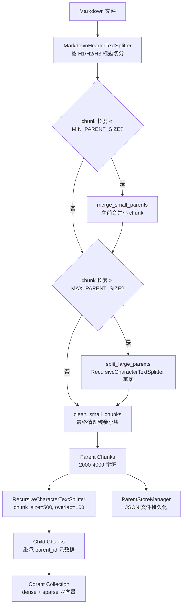
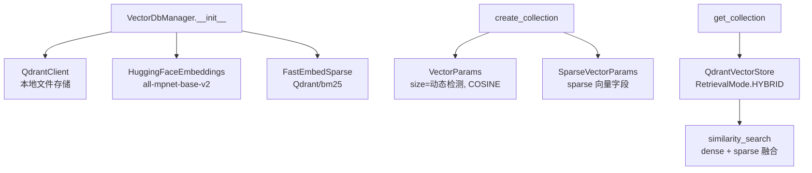
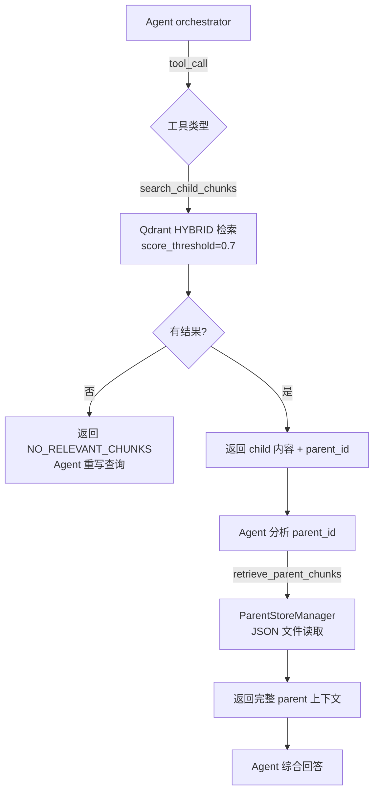

# PD-08.07 AgenticRAG — Qdrant 混合检索与 Parent-Child 分层索引

> 文档编号：PD-08.07
> 来源：agentic-rag-for-dummies `project/db/vector_db_manager.py` `project/document_chunker.py` `project/rag_agent/tools.py`
> GitHub：https://github.com/GiovanniPasq/agentic-rag-for-dummies.git
> 问题域：PD-08 搜索与检索 Search & Retrieval
> 状态：可复用方案

---

## 第 1 章 问题与动机

### 1.1 核心问题

RAG 系统面临一个根本矛盾：**检索精度与上下文完整性的冲突**。小 chunk 能精确匹配用户查询中的关键语义片段，但返回的内容往往缺乏上下文，导致 LLM 生成的回答断章取义；大 chunk 保留了完整上下文，但在向量空间中被噪声稀释，检索召回率下降。

同时，单一检索模式（纯向量或纯关键词）各有盲区：向量检索擅长语义相似但对精确术语不敏感，BM25 擅长精确匹配但无法理解同义词。在技术文档、学术论文等专业领域，用户查询往往同时包含精确术语和语义意图，单一模式难以兼顾。

agentic-rag-for-dummies 通过 **Parent-Child 分层索引 + Qdrant 混合检索（dense + sparse）** 解决了这两个问题，并将检索过程嵌入 LangGraph Agent 循环，让 Agent 自主决定何时搜索、何时回溯 parent、何时停止。

### 1.2 agentic-rag-for-dummies 的解法概述

1. **双层分块策略**：Markdown 按标题切分为大 parent chunk（2000-4000 字符），再将 parent 细分为小 child chunk（500 字符），child 继承 parent_id 元数据（`document_chunker.py:121-127`）
2. **混合检索引擎**：Qdrant 同时维护 dense 向量（HuggingFace `all-mpnet-base-v2`）和 sparse 向量（FastEmbed BM25），`RetrievalMode.HYBRID` 融合两路结果（`vector_db_manager.py:38-44`）
3. **Agent 驱动的两阶段检索**：LangGraph Agent 先调用 `search_child_chunks` 获取精确匹配的 child，再通过 `retrieve_parent_chunks` 回溯完整 parent 上下文（`tools.py:11-73`）
4. **score_threshold 过滤**：child 检索设置 0.7 分数阈值，低质量结果直接丢弃，返回 `NO_RELEVANT_CHUNKS` 信号触发 Agent 重写查询（`tools.py:19`）
5. **上下文压缩与去重**：Agent 循环中通过 `retrieval_keys` 集合跟踪已检索的 parent ID 和搜索查询，压缩上下文时注入"已执行"列表防止重复检索（`nodes.py:96-164`）

### 1.3 设计思想

| 设计原则 | 具体实现 | 理由 | 替代方案 |
|----------|----------|------|----------|
| 精度与上下文分离 | child chunk 检索 → parent chunk 回溯 | 小 chunk 精确匹配，大 chunk 提供完整语境 | 单一 chunk 大小折中（丢失两端优势） |
| 双模态融合 | dense (mpnet) + sparse (BM25) HYBRID | 语义相似 + 精确术语双覆盖 | 纯向量检索（术语盲区）或纯 BM25（语义盲区） |
| Agent 自主检索 | LangGraph 循环 + tool_call 路由 | Agent 根据信息充分性自主决定检索深度 | 固定 pipeline（无法适应查询复杂度） |
| 质量门控 | score_threshold=0.7 硬过滤 | 宁可不返回也不返回噪声 | 返回 top-K 不过滤（噪声污染 LLM） |
| 检索去重 | retrieval_keys Set 跟踪已检索内容 | 压缩上下文后防止 Agent 重复相同操作 | 无去重（浪费 tool call 配额） |

---

## 第 2 章 源码实现分析

### 2.1 架构概览

整体架构是一个 LangGraph 双层状态图：外层处理对话历史和查询改写，内层是 Agent 检索循环。

```
┌─────────────────────────────────────────────────────────────────┐
│                     Outer Graph (State)                         │
│                                                                 │
│  START → summarize_history → rewrite_query ─┬→ agent ×N ──→ aggregate_answers → END
│                                             │  (Send per query)
│                                             └→ request_clarification ──┘
│                                                                 │
│  ┌──────────────────────────────────────────────────────────┐   │
│  │              Inner Agent Subgraph (AgentState)           │   │
│  │                                                          │   │
│  │  START → orchestrator ─┬→ tools → should_compress ─┬→ orchestrator (loop)
│  │                        │                           └→ compress_context ──┘
│  │                        ├→ collect_answer → END
│  │                        └→ fallback_response → collect_answer → END
│  └──────────────────────────────────────────────────────────┘   │
└─────────────────────────────────────────────────────────────────┘
```

数据流核心路径：
- PDF → pymupdf4llm → Markdown → parent chunk (标题分割) → child chunk (递归分割)
- child chunk → Qdrant (dense + sparse 双向量)
- parent chunk → JSON 文件存储 (ParentStoreManager)
- 查询 → Agent → search_child_chunks (Qdrant hybrid) → retrieve_parent_chunks (JSON) → 回答

### 2.2 核心实现

#### 2.2.1 Parent-Child 分层分块



对应源码 `project/document_chunker.py:31-43`：

```python
def create_chunks_single(self, md_path):
    doc_path = Path(md_path)
    
    with open(doc_path, "r", encoding="utf-8") as f:
        parent_chunks = self.__parent_splitter.split_text(f.read())
    
    merged_parents = self.__merge_small_parents(parent_chunks)
    split_parents = self.__split_large_parents(merged_parents)
    cleaned_parents = self.__clean_small_chunks(split_parents)
    
    all_parent_chunks, all_child_chunks = [], []
    self.__create_child_chunks(all_parent_chunks, all_child_chunks, cleaned_parents, doc_path)
    return all_parent_chunks, all_child_chunks
```

关键细节：parent 分块经过三轮清洗——合并过小（`__merge_small_parents`，阈值 `MIN_PARENT_SIZE=2000`）、拆分过大（`__split_large_parents`，阈值 `MAX_PARENT_SIZE=4000`）、最终清理残余（`__clean_small_chunks`）。child 分块在 `__create_child_chunks` 中生成，每个 child 继承 `parent_id` 和 `source` 元数据（`document_chunker.py:121-127`）。

#### 2.2.2 Qdrant 混合检索引擎



对应源码 `project/db/vector_db_manager.py:7-47`：

```python
class VectorDbManager:
    __client: QdrantClient
    __dense_embeddings: HuggingFaceEmbeddings
    __sparse_embeddings: FastEmbedSparse
    def __init__(self):
        self.__client = QdrantClient(path=config.QDRANT_DB_PATH)
        self.__dense_embeddings = HuggingFaceEmbeddings(model_name=config.DENSE_MODEL)
        self.__sparse_embeddings = FastEmbedSparse(model_name=config.SPARSE_MODEL)

    def create_collection(self, collection_name):
        if not self.__client.collection_exists(collection_name):
            self.__client.create_collection(
                collection_name=collection_name,
                vectors_config=qmodels.VectorParams(
                    size=len(self.__dense_embeddings.embed_query("test")),
                    distance=qmodels.Distance.COSINE),
                sparse_vectors_config={
                    config.SPARSE_VECTOR_NAME: qmodels.SparseVectorParams()},
            )

    def get_collection(self, collection_name) -> QdrantVectorStore:
        return QdrantVectorStore(
            client=self.__client,
            collection_name=collection_name,
            embedding=self.__dense_embeddings,
            sparse_embedding=self.__sparse_embeddings,
            retrieval_mode=RetrievalMode.HYBRID,
            sparse_vector_name=config.SPARSE_VECTOR_NAME
        )
```

设计亮点：dense 向量维度通过 `embed_query("test")` 动态检测（`vector_db_manager.py:20`），而非硬编码，切换嵌入模型时无需修改 collection 创建逻辑。

#### 2.2.3 Agent 两阶段检索工具



对应源码 `project/rag_agent/tools.py:11-19`（child 检索）和 `tools.py:55-73`（parent 回溯）：

```python
def _search_child_chunks(self, query: str, limit: int) -> str:
    try:
        results = self.collection.similarity_search(
            query, k=limit, score_threshold=0.7)
        if not results:
            return "NO_RELEVANT_CHUNKS"
        return "\n\n".join([
            f"Parent ID: {doc.metadata.get('parent_id', '')}\n"
            f"File Name: {doc.metadata.get('source', '')}\n"
            f"Content: {doc.page_content.strip()}"
            for doc in results
        ])
    except Exception as e:
        return f"RETRIEVAL_ERROR: {str(e)}"

def _retrieve_parent_chunks(self, parent_id: str) -> str:
    try:
        parent = self.parent_store_manager.load_content(parent_id)
        if not parent:
            return "NO_PARENT_DOCUMENT"
        return (
            f"Parent ID: {parent.get('parent_id', 'n/a')}\n"
            f"File Name: {parent.get('metadata', {}).get('source', 'unknown')}\n"
            f"Content: {parent.get('content', '').strip()}"
        )
    except Exception as e:
        return f"PARENT_RETRIEVAL_ERROR: {str(e)}"
```

### 2.3 实现细节

**Parent 存储设计**：parent chunk 不存入 Qdrant，而是以 JSON 文件形式存储在 `parent_store/` 目录（`parent_store_manager.py:15-20`）。每个 parent 一个 JSON 文件，文件名即 `parent_id`（格式 `{doc_stem}_parent_{index}`）。这种设计将检索（Qdrant）和存储（文件系统）解耦，parent 内容不参与向量计算，节省嵌入成本。

**检索去重机制**：`should_compress_context` 节点（`nodes.py:96-125`）在每轮 tool 调用后提取本轮的 parent ID 和搜索查询，存入 `retrieval_keys` 集合（Set 类型，自动去重）。压缩上下文时将已执行列表注入摘要末尾（`nodes.py:152-162`），Agent 的 system prompt 明确要求"不要重复已列出的查询和 parent ID"（`prompts.py:69-72`）。

**迭代控制**：`route_after_orchestrator_call`（`edges.py:15-28`）检查 `iteration_count >= MAX_ITERATIONS(10)` 或 `tool_call_count > MAX_TOOL_CALLS(8)` 时强制进入 `fallback_response`，防止 Agent 无限循环。

**查询分解与并行检索**：外层图的 `rewrite_query` 节点将复杂查询分解为最多 3 个子查询（`schemas.py:8-9`），通过 LangGraph `Send` 机制并行派发到独立的 Agent 子图实例（`edges.py:10-13`），最终由 `aggregate_answers` 节点合并结果。

**上下文压缩**：当消息 token 数超过动态阈值（`BASE_TOKEN_THRESHOLD + context_summary_tokens * TOKEN_GROWTH_FACTOR`）时触发压缩（`nodes.py:118-124`），LLM 将对话历史压缩为 400-600 词的结构化摘要，然后删除原始消息（`nodes.py:164`）。

---
## 第 3 章 迁移指南

### 3.1 迁移清单

**阶段 1：基础设施**
- [ ] 安装依赖：`qdrant-client`, `langchain-qdrant`, `langchain-huggingface`, `fastembed`
- [ ] 配置 Qdrant 存储路径（本地文件或远程服务）
- [ ] 选择 dense 嵌入模型（默认 `all-mpnet-base-v2`，768 维）
- [ ] 选择 sparse 模型（默认 `Qdrant/bm25`）

**阶段 2：分块与索引**
- [ ] 实现 Parent-Child 分块器（可直接复用 `DocumentChuncker` 类）
- [ ] 配置分块参数：`CHILD_CHUNK_SIZE=500`, `CHILD_CHUNK_OVERLAP=100`, `MIN_PARENT_SIZE=2000`, `MAX_PARENT_SIZE=4000`
- [ ] 实现 Parent 存储（JSON 文件或数据库）
- [ ] 创建 Qdrant collection（dense + sparse 双向量配置）

**阶段 3：检索工具**
- [ ] 实现 `search_child_chunks` 工具（带 score_threshold 过滤）
- [ ] 实现 `retrieve_parent_chunks` 工具（按 parent_id 回溯）
- [ ] 将工具注册到 LLM agent

**阶段 4：Agent 循环**
- [ ] 构建 LangGraph Agent 子图（orchestrator → tools → compress → loop）
- [ ] 配置迭代限制（MAX_ITERATIONS, MAX_TOOL_CALLS）
- [ ] 实现上下文压缩与检索去重

### 3.2 适配代码模板

以下模板可直接运行，实现 Parent-Child 混合检索的核心能力：

```python
from qdrant_client import QdrantClient
from qdrant_client.http import models as qmodels
from langchain_huggingface import HuggingFaceEmbeddings
from langchain_qdrant import QdrantVectorStore, FastEmbedSparse, RetrievalMode
from langchain_text_splitters import MarkdownHeaderTextSplitter, RecursiveCharacterTextSplitter
from langchain_core.tools import tool
import json
from pathlib import Path
from typing import List

# === 1. 配置 ===
DENSE_MODEL = "sentence-transformers/all-mpnet-base-v2"
SPARSE_MODEL = "Qdrant/bm25"
CHILD_CHUNK_SIZE = 500
CHILD_CHUNK_OVERLAP = 100
MIN_PARENT_SIZE = 2000
MAX_PARENT_SIZE = 4000
SCORE_THRESHOLD = 0.7

# === 2. 初始化 Qdrant 混合检索 ===
client = QdrantClient(path="./qdrant_db")
dense_emb = HuggingFaceEmbeddings(model_name=DENSE_MODEL)
sparse_emb = FastEmbedSparse(model_name=SPARSE_MODEL)

def create_hybrid_collection(name: str):
    if not client.collection_exists(name):
        client.create_collection(
            collection_name=name,
            vectors_config=qmodels.VectorParams(
                size=len(dense_emb.embed_query("test")),
                distance=qmodels.Distance.COSINE),
            sparse_vectors_config={"sparse": qmodels.SparseVectorParams()})

def get_hybrid_store(name: str) -> QdrantVectorStore:
    return QdrantVectorStore(
        client=client, collection_name=name,
        embedding=dense_emb, sparse_embedding=sparse_emb,
        retrieval_mode=RetrievalMode.HYBRID,
        sparse_vector_name="sparse")

# === 3. Parent-Child 分块 ===
parent_splitter = MarkdownHeaderTextSplitter(
    headers_to_split_on=[("#", "H1"), ("##", "H2"), ("###", "H3")],
    strip_headers=False)
child_splitter = RecursiveCharacterTextSplitter(
    chunk_size=CHILD_CHUNK_SIZE, chunk_overlap=CHILD_CHUNK_OVERLAP)

def chunk_and_index(md_path: str, collection_name: str, parent_store_dir: str):
    """分块 Markdown 文件并索引到 Qdrant + Parent Store"""
    store_path = Path(parent_store_dir)
    store_path.mkdir(parents=True, exist_ok=True)
    
    with open(md_path, "r") as f:
        parents = parent_splitter.split_text(f.read())
    
    child_chunks = []
    for i, parent in enumerate(parents):
        parent_id = f"{Path(md_path).stem}_parent_{i}"
        parent.metadata["parent_id"] = parent_id
        # 持久化 parent
        (store_path / f"{parent_id}.json").write_text(
            json.dumps({"page_content": parent.page_content,
                        "metadata": parent.metadata}, ensure_ascii=False))
        # 生成 child chunks
        children = child_splitter.split_documents([parent])
        child_chunks.extend(children)
    
    # 索引 child chunks 到 Qdrant
    store = get_hybrid_store(collection_name)
    store.add_documents(child_chunks)
    return len(child_chunks)

# === 4. 检索工具 ===
@tool
def search_child_chunks(query: str, limit: int = 5) -> str:
    """搜索最相关的 child chunks（混合检索 + 分数过滤）"""
    store = get_hybrid_store("documents")
    results = store.similarity_search(query, k=limit, score_threshold=SCORE_THRESHOLD)
    if not results:
        return "NO_RELEVANT_CHUNKS"
    return "\n\n".join(
        f"Parent ID: {d.metadata.get('parent_id')}\nContent: {d.page_content}"
        for d in results)

@tool
def retrieve_parent_chunk(parent_id: str) -> str:
    """按 parent_id 回溯完整 parent 上下文"""
    path = Path("./parent_store") / f"{parent_id}.json"
    if not path.exists():
        return "NO_PARENT_DOCUMENT"
    data = json.loads(path.read_text())
    return f"Parent ID: {parent_id}\nContent: {data['page_content']}"
```

### 3.3 适用场景

| 场景 | 适用度 | 说明 |
|------|--------|------|
| 技术文档 / 学术论文 RAG | ⭐⭐⭐ | Markdown 标题天然对应 parent 边界，混合检索覆盖术语+语义 |
| 企业知识库问答 | ⭐⭐⭐ | Parent-Child 策略保证回答有完整上下文，不断章取义 |
| 小规模本地部署 | ⭐⭐⭐ | Qdrant 本地文件存储 + HuggingFace 本地模型，零 API 成本 |
| 大规模多租户 SaaS | ⭐⭐ | Parent JSON 文件存储需替换为数据库，Qdrant 需远程部署 |
| 实时流式文档 | ⭐ | 当前设计面向批量导入，增量更新需额外实现 |
| 多模态（图片/表格）检索 | ⭐ | pymupdf4llm 转换时 `ignore_images=True`，不处理图片 |

---

## 第 4 章 测试用例

```python
import pytest
import json
from pathlib import Path
from unittest.mock import MagicMock, patch
from langchain_core.documents import Document

class TestDocumentChunker:
    """测试 Parent-Child 分块逻辑"""
    
    def test_parent_child_relationship(self, tmp_path):
        """验证 child chunk 继承 parent_id 元数据"""
        md_file = tmp_path / "test.md"
        md_file.write_text("# Title\n" + "word " * 600 + "\n## Section\n" + "text " * 600)
        
        from document_chunker import DocumentChuncker
        chunker = DocumentChuncker()
        parents, children = chunker.create_chunks_single(md_file)
        
        assert len(parents) > 0
        assert len(children) > 0
        for child in children:
            assert "parent_id" in child.metadata
            assert child.metadata["parent_id"].startswith("test_parent_")
    
    def test_small_parent_merge(self):
        """验证小于 MIN_PARENT_SIZE 的 chunk 被合并"""
        from document_chunker import DocumentChuncker
        chunker = DocumentChuncker()
        small_chunks = [
            Document(page_content="short " * 10, metadata={"H1": "A"}),
            Document(page_content="short " * 10, metadata={"H1": "B"}),
        ]
        merged = chunker._DocumentChuncker__merge_small_parents(small_chunks)
        assert len(merged) == 1  # 两个小 chunk 合并为一个
    
    def test_large_parent_split(self):
        """验证大于 MAX_PARENT_SIZE 的 chunk 被拆分"""
        from document_chunker import DocumentChuncker
        chunker = DocumentChuncker()
        large_chunk = Document(page_content="word " * 2000, metadata={"H1": "Big"})
        split = chunker._DocumentChuncker__split_large_parents([large_chunk])
        assert len(split) > 1

class TestHybridRetrieval:
    """测试混合检索与 score_threshold 过滤"""
    
    def test_score_threshold_filters_low_quality(self):
        """验证 score_threshold=0.7 过滤低质量结果"""
        mock_collection = MagicMock()
        mock_collection.similarity_search.return_value = []  # 模拟全部低于阈值
        
        from rag_agent.tools import ToolFactory
        factory = ToolFactory(mock_collection)
        result = factory._search_child_chunks("irrelevant query", 5)
        
        assert result == "NO_RELEVANT_CHUNKS"
    
    def test_parent_retrieval_returns_full_context(self, tmp_path):
        """验证 parent 回溯返回完整内容"""
        store_path = tmp_path / "parent_store"
        store_path.mkdir()
        parent_data = {"page_content": "Full parent context here", "metadata": {"source": "test.pdf"}}
        (store_path / "doc_parent_0.json").write_text(json.dumps(parent_data))
        
        from db.parent_store_manager import ParentStoreManager
        manager = ParentStoreManager(store_path=str(store_path))
        result = manager.load_content("doc_parent_0")
        
        assert result["content"] == "Full parent context here"
        assert result["parent_id"] == "doc_parent_0"
    
    def test_retrieval_error_handling(self):
        """验证检索异常时返回错误信号而非崩溃"""
        mock_collection = MagicMock()
        mock_collection.similarity_search.side_effect = Exception("Connection lost")
        
        from rag_agent.tools import ToolFactory
        factory = ToolFactory(mock_collection)
        result = factory._search_child_chunks("test", 5)
        
        assert result.startswith("RETRIEVAL_ERROR:")

class TestAgentIteration:
    """测试 Agent 迭代控制与去重"""
    
    def test_max_iterations_triggers_fallback(self):
        """验证超过 MAX_ITERATIONS 时进入 fallback"""
        from rag_agent.edges import route_after_orchestrator_call
        state = {
            "iteration_count": 11,
            "tool_call_count": 0,
            "messages": [MagicMock(tool_calls=[])]
        }
        assert route_after_orchestrator_call(state) == "fallback_response"
    
    def test_no_tool_calls_collects_answer(self):
        """验证无 tool_call 时直接收集答案"""
        from rag_agent.edges import route_after_orchestrator_call
        mock_msg = MagicMock()
        mock_msg.tool_calls = []
        state = {
            "iteration_count": 1,
            "tool_call_count": 0,
            "messages": [mock_msg]
        }
        assert route_after_orchestrator_call(state) == "collect_answer"
```

---
## 第 5 章 跨域关联

| 关联域 | 关系类型 | 说明 |
|--------|----------|------|
| PD-01 上下文管理 | 协同 | `compress_context` 节点在检索循环中动态压缩上下文，`retrieval_keys` 去重防止压缩后重复检索。token 估算使用 tiktoken（`utils.py:27-37`），动态阈值 `BASE_TOKEN_THRESHOLD + summary_tokens * 0.9` |
| PD-02 多 Agent 编排 | 协同 | 外层图通过 LangGraph `Send` 将多个子查询并行派发到独立 Agent 子图实例（`edges.py:10-13`），`aggregate_answers` 节点合并多路结果 |
| PD-03 容错与重试 | 依赖 | 检索工具返回 `NO_RELEVANT_CHUNKS` / `RETRIEVAL_ERROR` 等信号字符串而非抛异常（`tools.py:21,31`），Agent 据此决定重写查询或放弃。`fallback_response` 节点在迭代耗尽时兜底 |
| PD-04 工具系统 | 依赖 | `ToolFactory` 通过 `@tool` 装饰器动态创建 LangChain 工具（`tools.py:75-80`），`llm.bind_tools()` 注入 Agent |
| PD-09 Human-in-the-Loop | 协同 | 外层图在 `request_clarification` 节点前设置 `interrupt_before`（`graph.py:48`），查询不清晰时暂停等待用户澄清 |
| PD-12 推理增强 | 协同 | `rewrite_query` 节点用 structured output 将用户查询分解为多个自包含子查询（`nodes.py:30-44`），提升检索精度 |

---

## 第 6 章 来源文件索引

| 文件 | 行范围 | 关键实现 |
|------|--------|----------|
| `project/document_chunker.py` | L1-127 | Parent-Child 分层分块器，三轮清洗（合并/拆分/清理） |
| `project/db/vector_db_manager.py` | L1-47 | Qdrant 混合检索引擎，dense + sparse 双向量配置 |
| `project/db/parent_store_manager.py` | L1-52 | Parent chunk JSON 文件存储，按 parent_id 读写 |
| `project/rag_agent/tools.py` | L1-80 | Agent 检索工具：search_child_chunks + retrieve_parent_chunks |
| `project/rag_agent/nodes.py` | L50-65 | orchestrator 节点：强制首次搜索 + 压缩上下文注入 |
| `project/rag_agent/nodes.py` | L96-164 | should_compress_context + compress_context：检索去重与上下文压缩 |
| `project/rag_agent/edges.py` | L6-28 | 路由逻辑：查询分发（Send）+ 迭代控制（fallback） |
| `project/rag_agent/graph.py` | L1-51 | LangGraph 双层状态图构建 |
| `project/rag_agent/graph_state.py` | L1-30 | State / AgentState 定义，retrieval_keys Set 去重 |
| `project/rag_agent/prompts.py` | L58-81 | orchestrator prompt：检索策略指令 |
| `project/config.py` | L1-36 | 全局配置：模型、分块参数、迭代限制 |
| `project/core/rag_system.py` | L1-37 | RAGSystem 初始化：组装 VectorDB + Chunker + Agent |
| `project/core/document_manager.py` | L1-72 | 文档导入：PDF→Markdown→分块→索引 |
| `project/utils.py` | L1-38 | PDF 转 Markdown（pymupdf4llm）+ token 估算 |

---

## 第 7 章 横向对比维度

> **重要：** 本章用于自动填充 Butcher Wiki 的横向对比表。
> 必须严格按以下 JSON 格式输出，放在 `comparison_data` 代码块中。

```json comparison_data
{
  "project": "agentic-rag-for-dummies",
  "dimensions": {
    "搜索架构": "Qdrant 混合检索（dense HuggingFace + sparse BM25），Agent 驱动两阶段检索",
    "索引结构": "Parent-Child 分层索引：大 parent 存 JSON，小 child 存 Qdrant 双向量",
    "检索方式": "child 精确匹配 → parent_id 回溯完整上下文",
    "去重机制": "retrieval_keys Set 跟踪已检索 parent ID 和查询，压缩时注入已执行列表",
    "结果处理": "score_threshold=0.7 硬过滤 + Agent 自主判断信息充分性",
    "排序策略": "Qdrant HYBRID 模式内置 dense+sparse 融合排序，COSINE 距离",
    "容错策略": "NO_RELEVANT_CHUNKS 信号触发查询重写，迭代超限进入 fallback_response 兜底",
    "成本控制": "本地 HuggingFace 嵌入零 API 成本，Ollama 本地 LLM，MAX_TOOL_CALLS=8 硬限制",
    "嵌入后端适配": "dense 维度通过 embed_query('test') 动态检测，切换模型无需改 collection 配置",
    "文档格式转换": "pymupdf4llm 将 PDF 转 Markdown，忽略图片，保留标题结构",
    "组件正交": "VectorDbManager / ParentStoreManager / DocumentChuncker / ToolFactory 四组件独立可替换"
  }
}
```

### 域元数据补充

```json domain_metadata
{
  "solution_summary": "agentic-rag-for-dummies 用 Qdrant 混合检索（dense+BM25）+ Parent-Child 分层索引实现两阶段检索：小 child 精确匹配后回溯大 parent 获取完整上下文",
  "description": "分层索引策略解决检索精度与上下文完整性的矛盾",
  "sub_problems": [
    "Parent-Child 分块边界选择：按标题切分 vs 按固定长度切分对不同文档结构的适用性差异",
    "parent 存储介质选择：JSON 文件 vs 数据库在并发读写和规模扩展上的权衡",
    "Agent 检索深度自适应：如何让 Agent 根据查询复杂度自主决定 child→parent 回溯的层数"
  ],
  "best_practices": [
    "Parent-Child 分层索引解决精度-上下文矛盾：小 child 精确匹配，大 parent 提供完整语境，两者通过 parent_id 关联",
    "嵌入维度动态检测优于硬编码：通过 embed_query('test') 获取实际维度，切换模型时零修改",
    "检索信号字符串优于异常抛出：NO_RELEVANT_CHUNKS 等信号让 Agent 可编程地响应检索失败"
  ]
}
```
