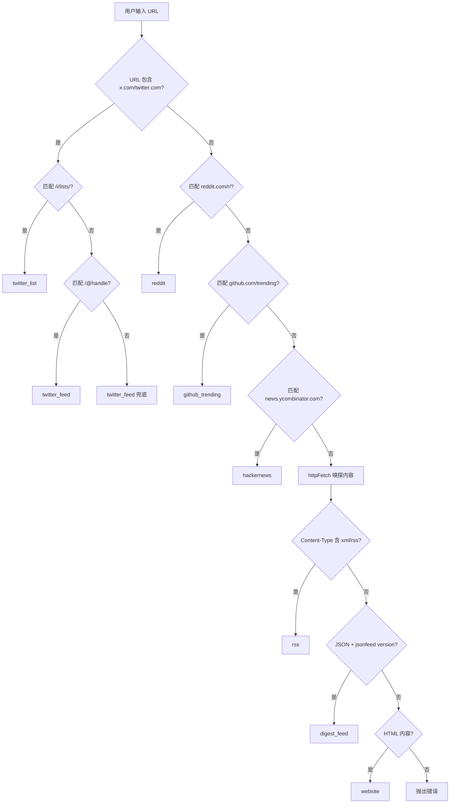
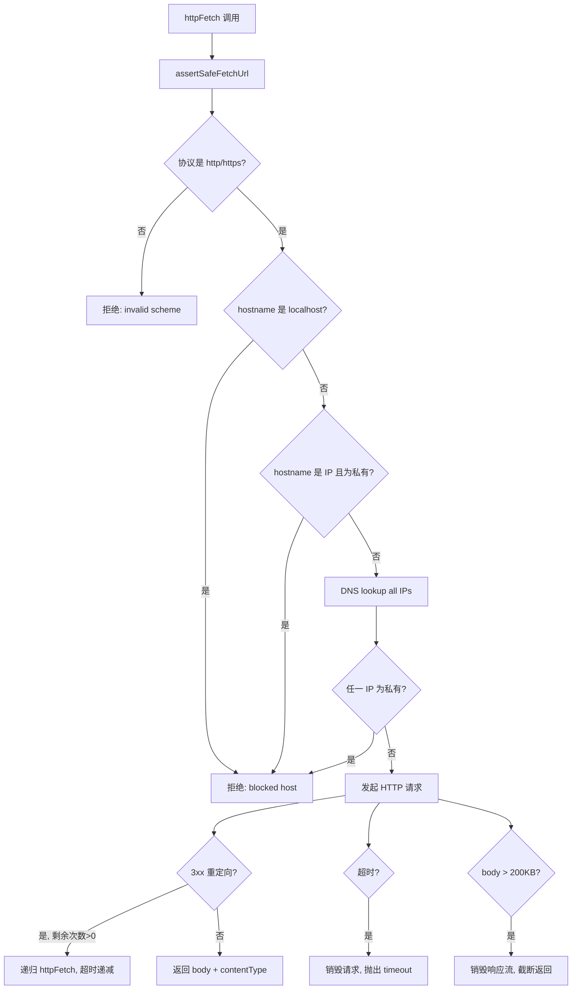

# PD-08.06 ClawFeed — 多源内容聚合与 URL 类型自动检测

> 文档编号：PD-08.06
> 来源：ClawFeed `src/server.mjs` `src/db.mjs`
> GitHub：https://github.com/kevinho/clawfeed
> 问题域：PD-08 搜索与检索 Search & Retrieval
> 状态：可复用方案

---

## 第 1 章 问题与动机

### 1.1 核心问题

信息聚合类 Agent 面临一个基础但关键的工程问题：**如何从异构信息源（Twitter/RSS/Reddit/HN/GitHub Trending/Website/JSON Feed）统一采集内容，并在用户只提供一个 URL 时自动识别源类型？**

传统做法要求用户手动选择源类型再填写配置，体验差且容易出错。ClawFeed 的核心创新在于：用户只需粘贴一个 URL，系统自动完成类型检测、配置生成、内容预览，实现"一个 URL 搞定一切"的零配置添加体验。

这个问题在 Agent 工程中尤为重要：当 Agent 需要从多个信息源采集数据时，源类型的自动识别和统一抽象是构建可扩展采集管道的前提。

### 1.2 ClawFeed 的解法概述

1. **URL 类型自动检测**：`resolveSourceUrl()` 函数（`src/server.mjs:253-322`）通过 URL 模式匹配 + HTTP 内容嗅探两阶段策略，支持 9 种源类型的自动识别
2. **SSRF 安全防护**：`assertSafeFetchUrl()` + `isPrivateOrSpecialIp()`（`src/server.mjs:131-161`）在 DNS 解析后检查 IP，拒绝私有地址访问
3. **递归重定向处理**：`httpFetch()`（`src/server.mjs:215-238`）支持最多 3 次重定向跟踪，每次递减超时预算
4. **Source 级去重**：数据库层 `UNIQUE(source_id, dedup_key)` 约束 + `INSERT OR IGNORE` 实现零代码去重（`docs/prd/source-personalization.md:86-88`）
5. **订阅驱动的个性化聚合**：`user_subscriptions` 表解耦采集与消费，同一 Source 只采集一次，多用户共享（`docs/ARCHITECTURE.md:166-169`）

### 1.3 设计思想

| 设计原则 | 具体实现 | 理由 | 替代方案 |
|----------|----------|------|----------|
| URL 优先检测 | 先正则匹配已知平台 URL，再 HTTP 嗅探未知 URL | 已知平台无需网络请求，响应更快 | 全部 HTTP 嗅探（慢）或全部正则（不够灵活） |
| 采集与消费解耦 | Source 级采集写入 raw_items，Digest 按用户订阅过滤 | 同一 Source 100 人订阅只采集 1 次 | 按用户采集（N 倍重复请求） |
| 数据库层去重 | UNIQUE 约束 + INSERT OR IGNORE | 无需应用层去重逻辑，天然幂等 | 应用层 Set/Map 去重（内存开销、重启丢失） |
| 渐进式降级 | Website 类型：RSS 自动发现 → og:title 提取 → hostname 兜底 | 宁可返回粗糙结果也不失败 | 严格模式（找不到 RSS 就报错） |
| DNS 级 SSRF 防护 | 解析 DNS 后检查所有 IP 地址 | 防止 DNS rebinding 攻击 | 仅检查 hostname（可被绕过） |

---

## 第 2 章 源码实现分析

### 2.1 架构概览

ClawFeed 的搜索与检索架构分为三层：URL 解析层、HTTP 采集层、存储去重层。

```
┌──────────────────────────────────────────────────────────┐
│                    用户输入 URL                           │
└──────────────────────┬───────────────────────────────────┘
                       ▼
┌──────────────────────────────────────────────────────────┐
│  resolveSourceUrl()  — URL 类型自动检测                   │
│  ┌─────────────────┐  ┌──────────────────┐               │
│  │ 阶段1: 正则匹配  │  │ 阶段2: HTTP 嗅探  │              │
│  │ Twitter/X ──────│  │ RSS/Atom ────────│              │
│  │ Reddit ─────────│  │ JSON Feed ───────│              │
│  │ GitHub Trending ─│  │ HTML Website ────│              │
│  │ Hacker News ────│  │                  │               │
│  └─────────────────┘  └──────────────────┘               │
└──────────────────────┬───────────────────────────────────┘
                       ▼
┌──────────────────────────────────────────────────────────┐
│  httpFetch()  — 安全 HTTP 采集                            │
│  assertSafeFetchUrl() → DNS 解析 → IP 检查 → 请求        │
│  重定向跟踪（≤3次）· 超时递减 · 200KB 截断               │
└──────────────────────┬───────────────────────────────────┘
                       ▼
┌──────────────────────────────────────────────────────────┐
│  SQLite 存储层                                            │
│  sources 表 ──→ raw_items 表 ──→ digests 表              │
│  (类型+配置)    (UNIQUE去重)     (用户订阅过滤)           │
└──────────────────────────────────────────────────────────┘
```

### 2.2 核心实现

#### 2.2.1 URL 类型自动检测



对应源码 `src/server.mjs:253-322`：

```javascript
async function resolveSourceUrl(url) {
  const u = url.toLowerCase();

  // Twitter/X — 正则匹配阶段
  if (u.includes('x.com') || u.includes('twitter.com')) {
    const listMatch = url.match(/\/i\/lists\/(\d+)/);
    if (listMatch) {
      return { name: `X List ${listMatch[1]}`, type: 'twitter_list',
               config: { list_url: url }, icon: '🐦' };
    }
    const handleMatch = url.match(/(?:x\.com|twitter\.com)\/(@?[A-Za-z0-9_]+)/);
    if (handleMatch && !['i','search','explore','home','notifications',
        'messages','settings'].includes(handleMatch[1].toLowerCase())) {
      const handle = handleMatch[1].replace(/^@/, '');
      return { name: `@${handle}`, type: 'twitter_feed',
               config: { handle: `@${handle}` }, icon: '🐦' };
    }
    return { name: 'X Feed', type: 'twitter_feed',
             config: { handle: url }, icon: '🐦' };
  }

  // Reddit — 正则匹配
  const redditMatch = url.match(/reddit\.com\/r\/([A-Za-z0-9_]+)/);
  if (redditMatch) {
    return { name: `r/${redditMatch[1]}`, type: 'reddit',
             config: { subreddit: redditMatch[1], sort: 'hot', limit: 20 },
             icon: '👽' };
  }

  // HTTP 嗅探阶段 — 未知 URL 需要实际请求
  const resp = await httpFetch(url);
  const ct = resp.contentType.toLowerCase();
  const body = resp.body;

  // RSS/Atom 检测：Content-Type + 内容特征双重判断
  if (ct.includes('xml') || ct.includes('rss') || ct.includes('atom')
      || body.trimStart().startsWith('<?xml') || body.includes('<rss')
      || body.includes('<feed')) {
    if (body.includes('<rss') || body.includes('<feed')
        || body.includes('<channel')) {
      const titleMatch = body.match(
        /<title[^>]*>(?:<!\[CDATA\[)?(.*?)(?:\]\]>)?<\/title>/);
      const name = titleMatch ? titleMatch[1].trim()
                              : new URL(url).hostname;
      const preview = extractRssPreview(body);
      return { name, type: 'rss', config: { url }, icon: '📡', preview };
    }
  }

  // JSON Feed 检测
  if (ct.includes('json') || body.trimStart().startsWith('{')) {
    try {
      const j = JSON.parse(body);
      if (j.version && j.version.includes('jsonfeed')) {
        const preview = (j.items || []).slice(0, 5).map(
          i => ({ title: i.title || '(untitled)', url: i.url }));
        return { name: j.title || new URL(url).hostname,
                 type: 'digest_feed', config: { url },
                 icon: '📰', preview };
      }
    } catch {}
  }

  // HTML 兜底 — 提取 title 作为 website 类型
  if (ct.includes('html') || body.includes('<html')
      || body.includes('<!DOCTYPE')) {
    const titleMatch = body.match(/<title[^>]*>(.*?)<\/title>/is);
    const name = titleMatch
      ? titleMatch[1].trim().replace(/\s+/g, ' ').slice(0, 100)
      : new URL(url).hostname;
    return { name, type: 'website', config: { url }, icon: '🌐' };
  }

  throw new Error('Cannot detect source type');
}
```

#### 2.2.2 SSRF 防护与安全 HTTP 采集



对应源码 `src/server.mjs:131-238`：

```javascript
function isPrivateOrSpecialIp(ip) {
  if (!ip) return true;
  if (ip.includes(':')) {
    const n = ip.toLowerCase();
    return n === '::1' || n.startsWith('fc') || n.startsWith('fd')
           || n.startsWith('fe80:') || n.startsWith('::ffff:127.');
  }
  const p = ip.split('.').map(Number);
  if (p.length !== 4 || p.some((x) => Number.isNaN(x)
      || x < 0 || x > 255)) return true;
  const [a, b] = p;
  return (a === 0 || a === 10 || a === 127
    || (a === 169 && b === 254)
    || (a === 172 && b >= 16 && b <= 31)
    || (a === 192 && b === 168) || a >= 224);
}

async function assertSafeFetchUrl(rawUrl) {
  const u = new URL(rawUrl);
  if (!['http:', 'https:'].includes(u.protocol))
    throw new Error('invalid url scheme');
  const host = u.hostname;
  if (host === 'localhost' || host.endsWith('.localhost'))
    throw new Error('blocked host');
  if (isIP(host) && isPrivateOrSpecialIp(host))
    throw new Error('blocked host');
  const resolved = await lookup(host, { all: true });
  if (!resolved.length
      || resolved.some((r) => isPrivateOrSpecialIp(r.address))) {
    throw new Error('blocked host');
  }
}

async function httpFetch(url, timeout = 5000, redirectsLeft = 3) {
  await assertSafeFetchUrl(url);
  return new Promise((resolve, reject) => {
    const mod = url.startsWith('https') ? https : http;
    const r = mod.get(url, {
      headers: { 'User-Agent': 'AI-Digest/1.0',
                 'Accept': 'text/html,application/xhtml+xml,...' }
    }, async (resp) => {
      if (resp.statusCode >= 300 && resp.statusCode < 400
          && resp.headers.location) {
        clearTimeout(timer);
        if (redirectsLeft <= 0)
          return reject(new Error('too many redirects'));
        const nextUrl = new URL(resp.headers.location, url).toString();
        return resolve(await httpFetch(
          nextUrl, Math.max(1000, timeout - 1000), redirectsLeft - 1));
      }
      let data = '';
      resp.on('data', c => {
        data += c;
        if (data.length > 200000) resp.destroy(); // 200KB 截断
      });
      resp.on('end', () => {
        clearTimeout(timer);
        resolve({ contentType: resp.headers['content-type'] || '',
                  body: data });
      });
    });
    const timer = setTimeout(() => {
      r.destroy(); reject(new Error('timeout'));
    }, timeout);
    r.on('error', (e) => { clearTimeout(timer); reject(e); });
  });
}
```

### 2.3 实现细节

#### RSS XML 解析器

`extractRssPreview()`（`src/server.mjs:240-251`）用正则而非 DOM 解析器提取 RSS 预览，支持 RSS 2.0 的 `<item>` 和 Atom 的 `<entry>` 两种格式，最多返回 5 条预览。这是一个有意的轻量化选择——不引入 XML 解析库，用正则覆盖 90% 场景。

#### Source 数据模型

`sources` 表（`migrations/003_sources.sql:1-13`）用 `type` + `config` JSON 组合表达 9 种源类型的差异化配置：

| type | config 示例 | 说明 |
|------|------------|------|
| `twitter_feed` | `{"handle":"@karpathy"}` | Twitter 账号 |
| `twitter_list` | `{"list_url":"..."}` | Twitter List |
| `rss` | `{"url":"https://..."}` | RSS/Atom |
| `hackernews` | `{"filter":"top","min_score":100}` | HN 过滤 |
| `reddit` | `{"subreddit":"LocalLLaMA","sort":"hot","limit":20}` | Reddit |
| `github_trending` | `{"language":"python","since":"daily"}` | GitHub |
| `website` | `{"url":"https://..."}` | 通用网站 |
| `digest_feed` | `{"url":"https://..."}` | JSON Feed |
| `custom_api` | `{"url":"..."}` | 自定义 API |

#### 去重策略

PRD 文档（`docs/prd/source-personalization.md:86-94`）定义了两层去重：
- **Source 级**：`dedup_key = source_id + ":" + url`，无 URL 时用 `content_hash`
- **数据库级**：`UNIQUE(source_id, dedup_key)` + `INSERT OR IGNORE` 天然幂等

#### 采集频率分级

根据源类型设定不同采集间隔（`docs/ARCHITECTURE.md:178-187`）：
- Twitter: 30min（时效性强）
- HN/Reddit: 1h（热度变化快）
- RSS/Blog/Website: 4h（更新频率低）


---

## 第 3 章 迁移指南

### 3.1 迁移清单

**阶段 1：URL 类型自动检测（1 个文件）**
- [ ] 移植 `resolveSourceUrl()` 函数，按需裁剪支持的平台
- [ ] 移植 `httpFetch()` 含 SSRF 防护
- [ ] 移植 `extractRssPreview()` RSS 解析
- [ ] 添加新平台时只需在 `resolveSourceUrl()` 中增加一个 `if` 分支

**阶段 2：Source 存储与去重（数据库）**
- [ ] 创建 `sources` 表（type + config JSON 模式）
- [ ] 创建 `raw_items` 表（含 `dedup_key` UNIQUE 约束）
- [ ] 实现 `INSERT OR IGNORE` 去重写入

**阶段 3：订阅驱动聚合（可选）**
- [ ] 创建 `user_subscriptions` 表
- [ ] 实现按用户订阅过滤 raw_items 的查询
- [ ] 实现订阅组合 hash 缓存（`SHA256(sorted(source_ids))`）

### 3.2 适配代码模板

以下是可直接复用的 URL 类型检测器模板（Node.js ESM）：

```javascript
// source-resolver.mjs — 可直接复用的多源 URL 检测器
import { lookup } from 'dns/promises';
import { isIP } from 'net';
import https from 'https';
import http from 'http';

// ── SSRF 防护 ──
function isPrivateIp(ip) {
  if (!ip) return true;
  const p = ip.split('.').map(Number);
  if (p.length !== 4) return true;
  const [a, b] = p;
  return a === 0 || a === 10 || a === 127
    || (a === 172 && b >= 16 && b <= 31)
    || (a === 192 && b === 168) || a >= 224;
}

async function safeFetch(url, timeout = 5000, maxRedirects = 3) {
  const u = new URL(url);
  if (!['http:', 'https:'].includes(u.protocol)) throw new Error('bad scheme');
  if (u.hostname === 'localhost') throw new Error('blocked');
  if (isIP(u.hostname) && isPrivateIp(u.hostname)) throw new Error('blocked');
  const ips = await lookup(u.hostname, { all: true });
  if (ips.some(r => isPrivateIp(r.address))) throw new Error('blocked');

  return new Promise((resolve, reject) => {
    const mod = url.startsWith('https') ? https : http;
    const req = mod.get(url, {
      headers: { 'User-Agent': 'MyAgent/1.0' }
    }, async (resp) => {
      if (resp.statusCode >= 300 && resp.statusCode < 400
          && resp.headers.location && maxRedirects > 0) {
        clearTimeout(timer);
        const next = new URL(resp.headers.location, url).toString();
        return resolve(await safeFetch(next, timeout - 1000, maxRedirects - 1));
      }
      let data = '';
      resp.on('data', c => { data += c; if (data.length > 200000) resp.destroy(); });
      resp.on('end', () => { clearTimeout(timer); resolve({ ct: resp.headers['content-type'] || '', body: data }); });
    });
    const timer = setTimeout(() => { req.destroy(); reject(new Error('timeout')); }, timeout);
    req.on('error', e => { clearTimeout(timer); reject(e); });
  });
}

// ── URL 类型检测 ──
// 扩展方式：添加新的 if 分支即可
const PLATFORM_RULES = [
  { test: u => /x\.com|twitter\.com/.test(u), resolve: resolveTwitter },
  { test: u => /reddit\.com\/r\//.test(u), resolve: resolveReddit },
  { test: u => /github\.com\/trending/.test(u), resolve: resolveGitHub },
  { test: u => /news\.ycombinator\.com/.test(u), resolve: () => ({
    name: 'Hacker News', type: 'hackernews',
    config: { filter: 'top', min_score: 100 }
  })},
];

export async function resolveSourceUrl(url) {
  const lower = url.toLowerCase();
  for (const rule of PLATFORM_RULES) {
    if (rule.test(lower)) return rule.resolve(url);
  }
  // 未知 URL → HTTP 嗅探
  const { ct, body } = await safeFetch(url);
  if (body.includes('<rss') || body.includes('<feed'))
    return { name: extractTitle(body), type: 'rss', config: { url } };
  if (ct.includes('json')) {
    try { const j = JSON.parse(body); if (j.version?.includes('jsonfeed'))
      return { name: j.title, type: 'json_feed', config: { url } };
    } catch {}
  }
  return { name: extractTitle(body) || new URL(url).hostname,
           type: 'website', config: { url } };
}

function resolveTwitter(url) {
  const list = url.match(/\/i\/lists\/(\d+)/);
  if (list) return { name: `List ${list[1]}`, type: 'twitter_list', config: { list_url: url } };
  const handle = url.match(/(?:x\.com|twitter\.com)\/(@?[\w]+)/);
  if (handle) return { name: `@${handle[1].replace(/^@/,'')}`, type: 'twitter_feed', config: { handle: handle[1] } };
  return { name: 'Twitter', type: 'twitter_feed', config: { url } };
}

function resolveReddit(url) {
  const m = url.match(/reddit\.com\/r\/([\w]+)/);
  return { name: `r/${m[1]}`, type: 'reddit', config: { subreddit: m[1], sort: 'hot' } };
}

function resolveGitHub(url) {
  const lang = url.match(/\/trending\/([\w+#.-]+)/i);
  return { name: `GitHub Trending${lang ? ' - ' + lang[1] : ''}`,
           type: 'github_trending', config: { language: lang?.[1] || 'all' } };
}

function extractTitle(html) {
  const m = html.match(/<title[^>]*>(.*?)<\/title>/is);
  return m ? m[1].trim().replace(/\s+/g, ' ').slice(0, 100) : '';
}
```

### 3.3 适用场景

| 场景 | 适用度 | 说明 |
|------|--------|------|
| 多源信息聚合 Agent | ⭐⭐⭐ | 核心场景，URL 自动检测 + 统一采集管道 |
| RSS 阅读器 / Newsletter 工具 | ⭐⭐⭐ | RSS/Atom/JSON Feed 检测可直接复用 |
| 社交媒体监控 | ⭐⭐ | Twitter/Reddit 检测可用，但采集需额外 API |
| 通用爬虫 | ⭐ | 仅 URL 检测部分可用，深度爬取需更复杂方案 |
| 搜索引擎 | ⭐ | 不适用，ClawFeed 是订阅制而非搜索制 |

---

## 第 4 章 测试用例

```python
import pytest
import json
from unittest.mock import AsyncMock, patch, MagicMock

# ── 模拟 ClawFeed 的 resolveSourceUrl 逻辑 ──

class SourceResolver:
    """可移植的 URL 类型检测器，基于 ClawFeed src/server.mjs:253-322"""

    TWITTER_RESERVED = {'i','search','explore','home','notifications','messages','settings'}

    @classmethod
    async def resolve(cls, url: str, http_fetch=None) -> dict:
        u = url.lower()

        # Twitter/X
        if 'x.com' in u or 'twitter.com' in u:
            list_m = __import__('re').search(r'/i/lists/(\d+)', url)
            if list_m:
                return {'name': f'X List {list_m.group(1)}', 'type': 'twitter_list',
                        'config': {'list_url': url}}
            handle_m = __import__('re').search(
                r'(?:x\.com|twitter\.com)/(@?[A-Za-z0-9_]+)', url)
            if handle_m and handle_m.group(1).lower() not in cls.TWITTER_RESERVED:
                handle = handle_m.group(1).lstrip('@')
                return {'name': f'@{handle}', 'type': 'twitter_feed',
                        'config': {'handle': f'@{handle}'}}
            return {'name': 'X Feed', 'type': 'twitter_feed', 'config': {'handle': url}}

        # Reddit
        reddit_m = __import__('re').search(r'reddit\.com/r/([A-Za-z0-9_]+)', url)
        if reddit_m:
            return {'name': f'r/{reddit_m.group(1)}', 'type': 'reddit',
                    'config': {'subreddit': reddit_m.group(1), 'sort': 'hot', 'limit': 20}}

        # GitHub Trending
        if 'github.com/trending' in u:
            lang_m = __import__('re').search(r'/trending/([a-z0-9+#.-]+)', url, __import__('re').I)
            lang = lang_m.group(1) if lang_m else ''
            return {'name': f'GitHub Trending{" - " + lang if lang else ""}',
                    'type': 'github_trending',
                    'config': {'language': lang or 'all', 'since': 'daily'}}

        # Hacker News
        if 'news.ycombinator.com' in u:
            return {'name': 'Hacker News', 'type': 'hackernews',
                    'config': {'filter': 'top', 'min_score': 100}}

        # HTTP 嗅探
        if http_fetch:
            resp = await http_fetch(url)
            body = resp.get('body', '')
            ct = resp.get('content_type', '')
            if '<rss' in body or '<feed' in body:
                return {'name': 'RSS Feed', 'type': 'rss', 'config': {'url': url}}
            if 'json' in ct:
                try:
                    j = json.loads(body)
                    if 'jsonfeed' in j.get('version', ''):
                        return {'name': j.get('title', ''), 'type': 'digest_feed',
                                'config': {'url': url}}
                except json.JSONDecodeError:
                    pass
            return {'name': 'Website', 'type': 'website', 'config': {'url': url}}

        raise ValueError('Cannot detect source type')


class TestResolveSourceUrl:
    """测试 URL 类型自动检测，对应 src/server.mjs:253-322"""

    @pytest.mark.asyncio
    async def test_twitter_handle(self):
        result = await SourceResolver.resolve('https://x.com/karpathy')
        assert result['type'] == 'twitter_feed'
        assert result['config']['handle'] == '@karpathy'
        assert result['name'] == '@karpathy'

    @pytest.mark.asyncio
    async def test_twitter_list(self):
        result = await SourceResolver.resolve('https://x.com/i/lists/123456')
        assert result['type'] == 'twitter_list'
        assert '123456' in result['config']['list_url']

    @pytest.mark.asyncio
    async def test_twitter_reserved_path(self):
        """Twitter 保留路径（search/explore 等）不应被识别为 handle"""
        result = await SourceResolver.resolve('https://x.com/search')
        assert result['type'] == 'twitter_feed'
        assert result['name'] == 'X Feed'  # 兜底

    @pytest.mark.asyncio
    async def test_reddit(self):
        result = await SourceResolver.resolve('https://reddit.com/r/LocalLLaMA')
        assert result['type'] == 'reddit'
        assert result['config']['subreddit'] == 'LocalLLaMA'

    @pytest.mark.asyncio
    async def test_github_trending_with_language(self):
        result = await SourceResolver.resolve('https://github.com/trending/python')
        assert result['type'] == 'github_trending'
        assert result['config']['language'] == 'python'

    @pytest.mark.asyncio
    async def test_hackernews(self):
        result = await SourceResolver.resolve('https://news.ycombinator.com')
        assert result['type'] == 'hackernews'
        assert result['config']['min_score'] == 100

    @pytest.mark.asyncio
    async def test_rss_via_http_sniff(self):
        mock_fetch = AsyncMock(return_value={
            'body': '<?xml version="1.0"?><rss><channel><title>Test</title></channel></rss>',
            'content_type': 'application/xml'
        })
        result = await SourceResolver.resolve('https://example.com/feed', http_fetch=mock_fetch)
        assert result['type'] == 'rss'

    @pytest.mark.asyncio
    async def test_json_feed_via_http_sniff(self):
        mock_fetch = AsyncMock(return_value={
            'body': json.dumps({'version': 'https://jsonfeed.org/version/1.1',
                                'title': 'My Feed', 'items': []}),
            'content_type': 'application/json'
        })
        result = await SourceResolver.resolve('https://example.com/feed.json', http_fetch=mock_fetch)
        assert result['type'] == 'digest_feed'

    @pytest.mark.asyncio
    async def test_website_fallback(self):
        mock_fetch = AsyncMock(return_value={
            'body': '<html><head><title>My Site</title></head></html>',
            'content_type': 'text/html'
        })
        result = await SourceResolver.resolve('https://example.com', http_fetch=mock_fetch)
        assert result['type'] == 'website'


class TestSsrfProtection:
    """测试 SSRF 防护，对应 src/server.mjs:131-161"""

    def test_private_ipv4(self):
        from ipaddress import ip_address
        private_ips = ['127.0.0.1', '10.0.0.1', '172.16.0.1',
                       '192.168.1.1', '169.254.1.1', '0.0.0.0']
        for ip in private_ips:
            p = [int(x) for x in ip.split('.')]
            a, b = p[0], p[1]
            is_private = (a == 0 or a == 10 or a == 127
                or (a == 169 and b == 254)
                or (a == 172 and 16 <= b <= 31)
                or (a == 192 and b == 168) or a >= 224)
            assert is_private, f'{ip} should be blocked'

    def test_public_ipv4(self):
        public_ips = ['8.8.8.8', '1.1.1.1', '142.250.80.46']
        for ip in public_ips:
            p = [int(x) for x in ip.split('.')]
            a, b = p[0], p[1]
            is_private = (a == 0 or a == 10 or a == 127
                or (a == 169 and b == 254)
                or (a == 172 and 16 <= b <= 31)
                or (a == 192 and b == 168) or a >= 224)
            assert not is_private, f'{ip} should be allowed'


class TestDedupStrategy:
    """测试去重策略，对应 docs/prd/source-personalization.md:86-94"""

    def test_dedup_key_generation(self):
        """dedup_key = source_id:url"""
        source_id = 42
        url = 'https://example.com/article/123'
        dedup_key = f'{source_id}:{url}'
        assert dedup_key == '42:https://example.com/article/123'

    def test_dedup_key_no_url_uses_hash(self):
        """无 URL 时用 content hash"""
        import hashlib
        content = 'Some tweet content without URL'
        content_hash = hashlib.sha256(content.encode()).hexdigest()[:16]
        dedup_key = f'42:{content_hash}'
        assert len(dedup_key) > 3
```


---

## 第 5 章 跨域关联

| 关联域 | 关系类型 | 说明 |
|--------|----------|------|
| PD-03 容错与重试 | 协同 | `httpFetch` 的超时递减 + 重定向次数限制是容错设计；采集失败 5 次自动暂停 Source 是熔断策略 |
| PD-04 工具系统 | 协同 | `resolveSourceUrl` 本质是一个"URL → Source 配置"的工具，可封装为 MCP Tool 供 Agent 调用 |
| PD-06 记忆持久化 | 依赖 | `raw_items` 表是采集结果的持久化层，`dedup_key` 实现跨次采集的记忆去重 |
| PD-07 质量检查 | 协同 | `curation-rules.md` 模板定义了内容质量过滤规则（关注/取关建议），是 Digest 生成的质量门控 |
| PD-09 Human-in-the-Loop | 协同 | Mark 系统让用户标记感兴趣的内容触发 Deep Dive，是人机协作的信息检索模式 |
| PD-10 中间件管道 | 协同 | 采集管道（Source → Fetcher → raw_items → Digest）是典型的中间件管道架构 |
| PD-11 可观测性 | 协同 | `/api/raw-items/stats` 端点提供每个 Source 的采集健康度监控 |

---

## 第 6 章 来源文件索引

| 文件 | 行范围 | 关键实现 |
|------|--------|----------|
| `src/server.mjs` | L131-161 | SSRF 防护：`isPrivateOrSpecialIp()` + `assertSafeFetchUrl()` |
| `src/server.mjs` | L215-238 | 安全 HTTP 采集：`httpFetch()` 递归重定向 + 超时 + 截断 |
| `src/server.mjs` | L240-251 | RSS XML 解析：`extractRssPreview()` 正则提取 |
| `src/server.mjs` | L253-322 | URL 类型自动检测：`resolveSourceUrl()` 9 种源类型 |
| `src/server.mjs` | L616-628 | API 端点：`POST /api/sources/resolve` |
| `src/db.mjs` | L259-324 | Source CRUD：`listSources()` / `createSource()` / `updateSource()` / `deleteSource()` |
| `src/db.mjs` | L370-408 | 订阅管理：`subscribe()` / `unsubscribe()` / `bulkSubscribe()` / `isSubscribed()` |
| `migrations/003_sources.sql` | L1-18 | Sources 表定义（type + config + is_active + is_public） |
| `migrations/006_subscriptions.sql` | L1-11 | user_subscriptions 表定义（UNIQUE 约束） |
| `migrations/007_soft_delete.sql` | L1-2 | 软删除字段：is_deleted + deleted_at |
| `docs/prd/source-personalization.md` | L76-95 | raw_items 表设计 + dedup_key 去重策略 |
| `docs/ARCHITECTURE.md` | L164-191 | 采集架构：Source 级采集 + 频率分级 + 去重策略 |
| `templates/digest-prompt.md` | L1-36 | Digest 生成 prompt 模板（输出格式 + 规则） |
| `templates/curation-rules.md` | L1-73 | 内容策展规则（关注/取关/Mark 系统） |
| `test/e2e.sh` | L1-451 | 66 条 E2E 测试（含 Source CRUD、Pack 安装、去重、软删除） |

---

## 第 7 章 横向对比维度

```json comparison_data
{
  "project": "ClawFeed",
  "dimensions": {
    "搜索架构": "URL 模式匹配 + HTTP 内容嗅探两阶段检测，9 种源类型统一抽象",
    "去重机制": "数据库 UNIQUE(source_id, dedup_key) + INSERT OR IGNORE 天然幂等",
    "结果处理": "LLM 策展固定 15-20 条输出，Source 越多质量越高篇幅不变",
    "容错策略": "连续失败 5 次自动暂停 Source，单源失败不影响其他源采集",
    "成本控制": "Source 级采集（N 用户共享 1 次请求），订阅组合 hash 缓存 Digest",
    "搜索源热切换": "type + config JSON 模式，新增源类型只需添加 resolveSourceUrl 分支",
    "页面内容净化": "extractRssPreview 正则提取 + HTML title/og:title 降级提取",
    "解析容错": "RSS 用正则非 DOM 解析，JSON Feed try-catch 静默降级到 website",
    "缓存机制": "subscription_hash = SHA256(sorted(source_ids)) 相同订阅组合共享 Digest",
    "扩展性": "PLATFORM_RULES 数组模式，新平台只需添加 test+resolve 函数对"
  }
}
```

### 域元数据补充

```json domain_metadata
{
  "solution_summary": "ClawFeed 通过 resolveSourceUrl 两阶段检测（URL 正则 + HTTP 内容嗅探）实现 9 种信息源类型的零配置自动识别，配合 UNIQUE 约束天然去重和 Source 级共享采集降低成本",
  "description": "用户只提供 URL 时如何自动识别源类型并生成采集配置",
  "sub_problems": [
    "URL 类型自动检测：用户粘贴 URL 后如何自动识别 Twitter/RSS/Reddit 等源类型",
    "采集频率分级：不同源类型如何设定差异化采集间隔避免过度请求",
    "订阅组合去重：多用户相同订阅组合如何共享 Digest 降低 LLM 调用成本",
    "Source 软删除级联：源被删除后订阅者和 Pack 安装如何优雅处理"
  ],
  "best_practices": [
    "URL 优先正则再 HTTP 嗅探：已知平台零网络开销，未知 URL 才发请求",
    "数据库 UNIQUE 约束替代应用层去重：天然幂等，重启不丢状态，零额外代码",
    "Source 级采集与用户无关：同一源 100 人订阅只采集 1 次，线性扩展",
    "DNS 解析后检查所有 IP 防 SSRF：比仅检查 hostname 更安全，防 DNS rebinding"
  ]
}
```

