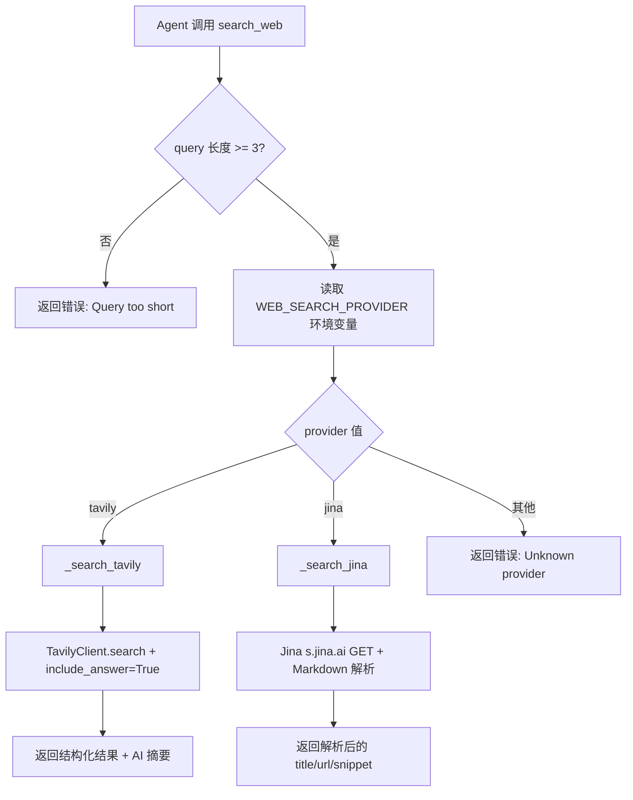
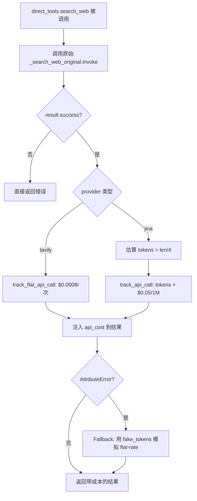

# PD-08.CW ClawWork — Tavily/Jina 双供应商搜索与按调用经济追踪

> 文档编号：PD-08.CW
> 来源：ClawWork `livebench/tools/productivity/search.py`, `livebench/tools/direct_tools.py`
> GitHub：https://github.com/HKUDS/ClawWork.git
> 问题域：PD-08 搜索与检索 Search & Retrieval
> 状态：可复用方案

---

## 第 1 章 问题与动机（≥ 30 行）

### 1.1 核心问题

在 Agent 经济模拟（LiveBench）场景中，Agent 需要通过 Web 搜索获取实时信息来完成工作任务或学习新知识。核心挑战有三：

1. **搜索供应商不可控**：Tavily 和 Jina 两个搜索 API 各有优劣——Tavily 返回结构化结果 + AI 生成摘要，Jina 返回 Markdown 格式原文。不同场景需要不同供应商，且供应商可能宕机。
2. **搜索成本必须可追踪**：LiveBench 是经济生存模拟，Agent 的每次 API 调用都有真实成本（Tavily $0.0008/次，Jina 按 token 计费 $0.05/1M），搜索成本直接影响 Agent 存活。
3. **双层工具注册**：搜索工具需要同时支持 LangChain `@tool` 直接调用和 FastMCP 服务两种模式，且两层之间需要保持行为一致。

### 1.2 ClawWork 的解法概述

ClawWork 采用**环境变量驱动的供应商路由 + 经济追踪器装饰层**的双层架构：

1. **供应商路由层**（`search.py:179`）：通过 `WEB_SEARCH_PROVIDER` 环境变量在 Tavily/Jina 之间切换，Agent 无感知
2. **API Key 多源查找**（`search.py:30`）：支持 `WEB_SEARCH_API_KEY` 和供应商专用 Key（`TAVILY_API_KEY`/`JINA_API_KEY`）双路径
3. **经济追踪装饰层**（`direct_tools.py:381-465`）：在 `search_web` 外层包装成本追踪，区分 flat-rate（Tavily）和 per-token（Jina）两种计费模型
4. **Tavily Extract 页面提取**（`search.py:194-287`）：通过 `read_webpage` 工具支持 URL 内容提取，带可选 query reranking
5. **MCP 学习集成**（`tool_livebench.py:371-460`）：`learn_from_web` 将搜索结果自动格式化并持久化到 Agent 记忆

### 1.3 设计思想

| 设计原则 | 具体实现 | 理由 | 替代方案 |
|----------|----------|------|----------|
| 环境变量驱动路由 | `WEB_SEARCH_PROVIDER` 控制供应商选择 | Agent 不需要知道底层用哪个搜索引擎，运维可热切换 | 硬编码供应商 / Agent 自选 |
| 双计费模型 | `track_flat_api_call` vs `track_api_call` | Tavily 按次计费，Jina 按 token 计费，需要不同追踪方式 | 统一按次计费（不精确） |
| 装饰层成本注入 | `direct_tools.py` 包装 `search.py` 原始工具 | 搜索逻辑与成本追踪解耦，搜索模块可独立测试 | 在搜索函数内部直接追踪 |
| 优雅降级 | ImportError 返回错误 dict + fallback 建议 | 缺少依赖时不崩溃，给出修复指引 | 启动时强制检查依赖 |
| 统一返回格式 | 所有工具返回 `{"success": bool, "provider": str, ...}` | Agent 可统一处理不同供应商的结果 | 各供应商返回原始格式 |

---

## 第 2 章 源码实现分析（≥ 60 行，核心章节）

### 2.1 架构概览

ClawWork 的搜索系统分为三层：底层供应商适配、中间工具注册、上层经济追踪。

```
┌─────────────────────────────────────────────────────────┐
│                    Agent (LLM)                          │
│         search_web() / read_webpage()                   │
├─────────────────────────────────────────────────────────┤
│  direct_tools.py — 经济追踪装饰层                        │
│  ┌─────────────────┐  ┌──────────────────────┐          │
│  │ track_flat_api   │  │ track_api_call       │          │
│  │ (Tavily $0.0008) │  │ (Jina $0.05/1M tok) │          │
│  └────────┬────────┘  └──────────┬───────────┘          │
├───────────┼──────────────────────┼──────────────────────┤
│  search.py — 供应商路由层                                │
│  ┌────────▼────────┐  ┌──────────▼───────────┐          │
│  │ _search_tavily  │  │ _search_jina         │          │
│  │ (结构化+AI摘要) │  │ (Markdown解析)       │          │
│  └────────┬────────┘  └──────────┬───────────┘          │
│           │                      │                      │
│  ┌────────▼────────┐             │                      │
│  │ _extract_tavily │             │                      │
│  │ (URL内容提取)   │             │                      │
│  └─────────────────┘             │                      │
├──────────────────────────────────┼──────────────────────┤
│  EconomicTracker — 成本持久化                            │
│  ┌─────────────────────────────────────────────┐        │
│  │ task_costs["search_api"] += cost             │        │
│  │ session_cost / daily_cost / balance 实时更新  │        │
│  └─────────────────────────────────────────────┘        │
└─────────────────────────────────────────────────────────┘
```

### 2.2 核心实现

#### 2.2.1 供应商路由：环境变量驱动的搜索分发



对应源码 `livebench/tools/productivity/search.py:141-191`：

```python
@tool
def search_web(query: str, max_results: int = 5) -> Dict[str, Any]:
    """Search the internet for information using Tavily AI search."""
    if len(query) < 3:
        return {
            "error": "Query too short. Minimum 3 characters required.",
            "current_length": len(query)
        }

    # Determine provider from env var (not exposed to agent)
    provider = os.getenv("WEB_SEARCH_PROVIDER", "tavily").lower()

    # Route to appropriate provider
    if provider == "tavily":
        return _search_tavily(query, max_results)
    elif provider == "jina":
        return _search_jina(query, max_results)
    else:
        return {
            "error": f"Unknown search provider: {provider}",
            "valid_providers": ["tavily", "jina"],
            "help": "Set WEB_SEARCH_PROVIDER in .env to 'tavily' or 'jina'"
        }
```

关键设计点：
- `search.py:179` — 供应商选择对 Agent 透明，通过环境变量 `WEB_SEARCH_PROVIDER` 控制
- `search.py:30` — API Key 支持通用 Key（`WEB_SEARCH_API_KEY`）和供应商专用 Key 双路径查找
- `search.py:39` — Tavily 启用 `include_answer=True` 获取 AI 生成摘要，这是 Tavily 的差异化能力

#### 2.2.2 经济追踪装饰层：双计费模型



对应源码 `livebench/tools/direct_tools.py:381-465`：

```python
@tool
def search_web(query: str, max_results: int = 5, provider: str = None) -> Dict[str, Any]:
    """Search the internet for information using Tavily or Jina AI."""
    if not PRODUCTIVITY_TOOLS_AVAILABLE:
        return {"error": "Search tool not available"}

    result = _search_web_original.invoke({
        "query": query, "max_results": max_results, "provider": provider
    })

    if isinstance(result, dict) and result.get("success"):
        try:
            tracker = _global_state.get("economic_tracker")
            if tracker:
                provider_used = result.get("provider", "unknown")
                if provider_used == "tavily":
                    cost = tracker.track_flat_api_call(
                        cost=0.0008, api_name="Tavily_Search"
                    )
                    result["api_cost"] = f"${cost:.6f}"
                    result["cost_type"] = "flat_rate"
                elif provider_used == "jina":
                    result_text = str(result.get("results", ""))
                    estimated_tokens = len(result_text) // 4
                    cost = tracker.track_api_call(
                        tokens=estimated_tokens,
                        price_per_1m=0.05, api_name="Jina_Search"
                    )
                    result["api_cost"] = f"${cost:.6f}"
                    result["estimated_tokens"] = estimated_tokens
        except AttributeError as e:
            # Fallback: fake tokens to achieve flat rate
            fake_tokens = int(0.0008 * 1_000_000 / 0.05)
            cost = tracker.track_api_call(
                tokens=fake_tokens, price_per_1m=0.05, api_name="Tavily_Search"
            )
    return result
```

关键设计点：
- `direct_tools.py:419-440` — Tavily 用 `track_flat_api_call`（$0.0008/次），Jina 用 `track_api_call`（按 token 估算）
- `direct_tools.py:449-457` — 向后兼容：旧版 tracker 没有 `track_flat_api_call` 时，用 fake_tokens 模拟 flat-rate
- `direct_tools.py:459-463` — 成本追踪失败不影响搜索结果返回（`except Exception` 静默处理）

### 2.3 实现细节

#### Jina Markdown 解析器

`search.py:100-118` 实现了一个简易的 Markdown 结构化解析器，从 Jina 返回的 Markdown 文本中提取 title/url/snippet：

```python
for line in lines[:max_results * 10]:
    if line.startswith('##'):  # Title
        if current_result:
            results.append(current_result)
            if len(results) >= max_results:
                break
        current_result = {"title": line.replace('##', '').strip()}
    elif line.startswith('URL:'):
        current_result["url"] = line.replace('URL:', '').strip()
    elif line and 'title' in current_result and 'snippet' not in current_result:
        current_result["snippet"] = line.strip()
```

#### Tavily Extract 页面提取

`search.py:194-287` 提供了 `read_webpage` 工具，支持：
- 单 URL 或逗号分隔的多 URL 批量提取（`search.py:250`）
- 可选 query 参数用于 chunk reranking（`search.py:227`）
- 返回 `failed_results` 列表标识提取失败的 URL（`search.py:236`）

#### 经济追踪器的通道分类

`economic_tracker.py:223-228` 根据 API 名称自动分类成本通道：

```python
if "search" in api_name.lower() or "jina" in api_name.lower() or "tavily" in api_name.lower():
    self.task_costs["search_api"] += cost
elif "ocr" in api_name.lower():
    self.task_costs["ocr_api"] += cost
else:
    self.task_costs["other_api"] += cost
```

#### MCP learn_from_web 搜索-记忆闭环

`tool_livebench.py:371-460` 实现了搜索到记忆的完整闭环：
1. 调用 `search_web` 获取结果
2. 根据 provider 类型格式化为 Markdown（Tavily 含 AI Summary + 评分，Jina 含 snippet）
3. 自动调用 `save_to_memory` 持久化到 Agent 记忆文件

---

## 第 3 章 迁移指南（≥ 40 行）

### 3.1 迁移清单

**阶段 1：搜索供应商适配层**
- [ ] 创建 `search_providers/` 模块，定义 `SearchProvider` 协议
- [ ] 实现 `TavilyProvider` 和 `JinaProvider`
- [ ] 添加环境变量 `WEB_SEARCH_PROVIDER` 和对应 API Key
- [ ] 统一返回格式：`{"success": bool, "provider": str, "results": [...], "answer": str}`

**阶段 2：成本追踪集成**
- [ ] 实现 `CostTracker` 接口，支持 `track_flat_call` 和 `track_token_call` 两种模式
- [ ] 在搜索工具外层添加成本追踪装饰器
- [ ] 将 `api_cost` 注入到搜索结果中，让 Agent 感知成本

**阶段 3：页面提取能力**
- [ ] 集成 Tavily Extract 或 Jina Reader 实现 URL 内容提取
- [ ] 支持批量 URL 提取和 query-based reranking

### 3.2 适配代码模板

```python
"""可复用的双供应商搜索路由模板"""
import os
from typing import Dict, Any, Protocol

class SearchProvider(Protocol):
    """搜索供应商协议"""
    def search(self, query: str, max_results: int = 5) -> Dict[str, Any]: ...
    def get_cost_per_call(self) -> float: ...
    def get_cost_type(self) -> str: ...  # "flat_rate" or "per_token"

class TavilyProvider:
    def __init__(self):
        self.api_key = os.getenv("WEB_SEARCH_API_KEY") or os.getenv("TAVILY_API_KEY")

    def search(self, query: str, max_results: int = 5) -> Dict[str, Any]:
        from tavily import TavilyClient
        client = TavilyClient(api_key=self.api_key)
        response = client.search(query, max_results=max_results, include_answer=True)
        return {
            "success": True,
            "provider": "tavily",
            "answer": response.get("answer", ""),
            "results": response.get("results", []),
        }

    def get_cost_per_call(self) -> float:
        return 0.0008

    def get_cost_type(self) -> str:
        return "flat_rate"

class JinaProvider:
    def __init__(self):
        self.api_key = os.getenv("WEB_SEARCH_API_KEY") or os.getenv("JINA_API_KEY")

    def search(self, query: str, max_results: int = 5) -> Dict[str, Any]:
        import requests
        response = requests.get(
            f"https://s.jina.ai/{query}",
            headers={"Authorization": f"Bearer {self.api_key}", "X-Retain-Images": "none"},
            timeout=30
        )
        # 解析 Markdown 响应...
        return {"success": True, "provider": "jina", "results": [...]}

    def get_cost_per_call(self) -> float:
        return 0.05 / 1_000_000  # per token

    def get_cost_type(self) -> str:
        return "per_token"

# 路由器
PROVIDERS = {"tavily": TavilyProvider, "jina": JinaProvider}

def search_web(query: str, max_results: int = 5) -> Dict[str, Any]:
    provider_name = os.getenv("WEB_SEARCH_PROVIDER", "tavily").lower()
    provider_cls = PROVIDERS.get(provider_name)
    if not provider_cls:
        return {"error": f"Unknown provider: {provider_name}"}
    provider = provider_cls()
    return provider.search(query, max_results)
```

### 3.3 适用场景

| 场景 | 适用度 | 说明 |
|------|--------|------|
| Agent 经济模拟 | ⭐⭐⭐ | 搜索成本追踪是核心需求，ClawWork 方案直接适用 |
| 多供应商搜索降级 | ⭐⭐ | 当前仅路由不降级，需自行添加 fallback 逻辑 |
| RAG 管道搜索层 | ⭐⭐ | 适合作为 RAG 的 Web 搜索源，但缺少向量检索 |
| 高并发搜索场景 | ⭐ | 无连接池、无并发控制、无缓存，需额外工程 |
| 成本敏感的 Agent 系统 | ⭐⭐⭐ | 双计费模型 + 成本注入结果的模式可直接复用 |

---

## 第 4 章 测试用例（≥ 20 行）

```python
import pytest
from unittest.mock import patch, MagicMock
from typing import Dict, Any

class TestSearchProviderRouting:
    """测试供应商路由逻辑"""

    @patch.dict("os.environ", {"WEB_SEARCH_PROVIDER": "tavily", "TAVILY_API_KEY": "test-key"})
    @patch("tavily.TavilyClient")
    def test_tavily_routing(self, mock_client_cls):
        """环境变量设为 tavily 时路由到 Tavily"""
        mock_client = MagicMock()
        mock_client.search.return_value = {
            "query": "test", "answer": "AI answer",
            "results": [{"title": "r1", "url": "http://example.com", "content": "...", "score": 0.9}],
            "images": [], "response_time": "0.5"
        }
        mock_client_cls.return_value = mock_client

        from livebench.tools.productivity.search import search_web
        result = search_web.invoke({"query": "test query"})

        assert result["success"] is True
        assert result["provider"] == "tavily"
        assert result["answer"] == "AI answer"
        mock_client.search.assert_called_once_with("test query", max_results=5, include_answer=True)

    @patch.dict("os.environ", {"WEB_SEARCH_PROVIDER": "jina", "JINA_API_KEY": "test-key"})
    @patch("requests.get")
    def test_jina_routing(self, mock_get):
        """环境变量设为 jina 时路由到 Jina"""
        mock_response = MagicMock()
        mock_response.text = "## Title 1\nURL: http://example.com\nSome snippet text"
        mock_response.raise_for_status = MagicMock()
        mock_get.return_value = mock_response

        from livebench.tools.productivity.search import search_web
        result = search_web.invoke({"query": "test query"})

        assert result["success"] is True
        assert result["provider"] == "jina"

    def test_query_too_short(self):
        """查询过短时返回错误"""
        from livebench.tools.productivity.search import search_web
        result = search_web.invoke({"query": "ab"})
        assert "error" in result
        assert result["current_length"] == 2

    @patch.dict("os.environ", {"WEB_SEARCH_PROVIDER": "unknown"})
    def test_unknown_provider(self):
        """未知供应商返回错误和有效选项列表"""
        from livebench.tools.productivity.search import search_web
        result = search_web.invoke({"query": "test query"})
        assert "error" in result
        assert "valid_providers" in result

class TestCostTracking:
    """测试经济追踪装饰层"""

    def test_tavily_flat_rate_cost(self):
        """Tavily 搜索按 $0.0008/次 flat-rate 计费"""
        tracker = MagicMock()
        tracker.track_flat_api_call.return_value = 0.0008

        # 模拟成功搜索后的成本追踪
        result = {"success": True, "provider": "tavily", "results": []}
        cost = tracker.track_flat_api_call(cost=0.0008, api_name="Tavily_Search")
        assert cost == 0.0008

    def test_jina_per_token_cost(self):
        """Jina 搜索按 token 估算计费"""
        tracker = MagicMock()
        tracker.track_api_call.return_value = 0.000025

        result_text = "a" * 400  # 400 chars ≈ 100 tokens
        estimated_tokens = len(result_text) // 4
        cost = tracker.track_api_call(
            tokens=estimated_tokens, price_per_1m=0.05, api_name="Jina_Search"
        )
        assert estimated_tokens == 100
        tracker.track_api_call.assert_called_once()

    def test_cost_tracking_failure_does_not_break_search(self):
        """成本追踪失败不影响搜索结果返回"""
        tracker = MagicMock()
        tracker.track_flat_api_call.side_effect = Exception("tracker broken")

        result = {"success": True, "provider": "tavily", "results": [{"title": "test"}]}
        # 在实际代码中，except Exception 会静默处理
        # 搜索结果仍然完整返回
        assert result["success"] is True
        assert len(result["results"]) == 1
```

---

## 第 5 章 跨域关联

| 关联域 | 关系类型 | 说明 |
|--------|----------|------|
| PD-03 容错与重试 | 协同 | `search.py` 的 ImportError 降级和 `direct_tools.py` 的 AttributeError fallback 是容错模式的体现；但缺少供应商间自动降级（Tavily 失败不会自动切 Jina） |
| PD-04 工具系统 | 依赖 | 搜索工具通过 LangChain `@tool` 装饰器注册，`direct_tools.py:365-377` 动态导入 productivity 模块，`get_all_tools()` 统一暴露给 Agent |
| PD-06 记忆持久化 | 协同 | `tool_livebench.py:371-460` 的 `learn_from_web` 将搜索结果格式化后自动持久化到 Agent 记忆（Markdown 文件），实现搜索→记忆闭环 |
| PD-11 可观测性 | 依赖 | `EconomicTracker` 的 `task_costs["search_api"]` 通道分类（`economic_tracker.py:223`）为搜索成本提供可观测性；`api_cost` 字段注入搜索结果让 Agent 感知成本 |
| PD-10 中间件管道 | 协同 | `direct_tools.py` 的装饰层模式（原始工具 → 成本追踪 → 结果增强）本质上是一个两级中间件管道 |

---

## 第 6 章 来源文件索引

| 文件 | 行范围 | 关键实现 |
|------|--------|----------|
| `livebench/tools/productivity/search.py` | L10-57 | `_search_tavily`：Tavily 搜索实现，含 API Key 双路径查找和 `include_answer=True` |
| `livebench/tools/productivity/search.py` | L60-138 | `_search_jina`：Jina 搜索实现，含 Markdown 响应解析器 |
| `livebench/tools/productivity/search.py` | L141-191 | `search_web`：环境变量驱动的供应商路由入口 |
| `livebench/tools/productivity/search.py` | L194-287 | `_extract_tavily` + `read_webpage`：Tavily Extract 页面内容提取 |
| `livebench/tools/direct_tools.py` | L365-377 | 动态导入 productivity 工具模块（含 ImportError 降级） |
| `livebench/tools/direct_tools.py` | L381-465 | `search_web` 经济追踪装饰层：双计费模型 + AttributeError fallback |
| `livebench/tools/direct_tools.py` | L468-526 | `read_webpage` 经济追踪装饰层：Tavily Extract $0.00016/次 |
| `livebench/tools/direct_tools.py` | L529-555 | `get_all_tools`：统一工具注册入口 |
| `livebench/tools/tool_livebench.py` | L371-460 | `learn_from_web`：MCP 搜索-记忆闭环工具 |
| `livebench/agent/economic_tracker.py` | L203-228 | `track_api_call`：按 token 计费追踪 + 通道自动分类 |
| `livebench/agent/economic_tracker.py` | L246-271 | `track_flat_api_call`：flat-rate 计费追踪 |
| `livebench/tools/productivity/__init__.py` | L1-26 | 模块导出：search_web, read_webpage 等 6 个工具 |

---

## 第 7 章 横向对比维度

> **重要：** 本章用于自动填充 Butcher Wiki 的横向对比表。

```json comparison_data
{
  "project": "ClawWork",
  "dimensions": {
    "搜索架构": "环境变量驱动双供应商路由（Tavily/Jina），Agent 无感知切换",
    "去重机制": "无去重，每次搜索独立调用",
    "结果处理": "Tavily 返回结构化 JSON + AI 摘要，Jina 返回 Markdown 手动解析",
    "容错策略": "ImportError 降级 + AttributeError fallback，但无供应商间自动降级",
    "成本控制": "双计费模型（flat-rate/per-token）+ 经济追踪器实时扣费 + 成本注入结果",
    "搜索源热切换": "WEB_SEARCH_PROVIDER 环境变量，运行时可切换无需改代码",
    "页面内容净化": "Tavily Extract 返回 Markdown 格式正文，Jina 返回原始 Markdown",
    "解析容错": "Jina Markdown 解析器容忍格式不规范，逐行状态机提取",
    "扩展性": "模块化 productivity/ 目录 + README 新工具添加指南"
  }
}
```

### 域元数据补充

```json domain_metadata
{
  "solution_summary": "ClawWork 用环境变量驱动 Tavily/Jina 双供应商路由，在 direct_tools 装饰层实现 flat-rate 与 per-token 双计费模型经济追踪，搜索成本实时注入结果供 Agent 感知",
  "description": "搜索 API 调用的经济成本追踪与 Agent 成本感知反馈",
  "sub_problems": [
    "搜索成本感知：Agent 如何在搜索结果中获取本次调用成本并据此调整后续策略",
    "搜索-记忆闭环：搜索结果如何自动格式化并持久化到 Agent 长期记忆"
  ],
  "best_practices": [
    "成本注入搜索结果：将 api_cost 字段写入返回值让 Agent 实时感知搜索开销",
    "装饰层解耦成本追踪：搜索逻辑与经济追踪分层实现，搜索模块可独立测试"
  ]
}
```
