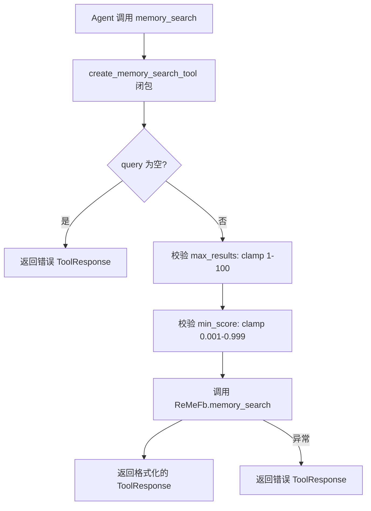
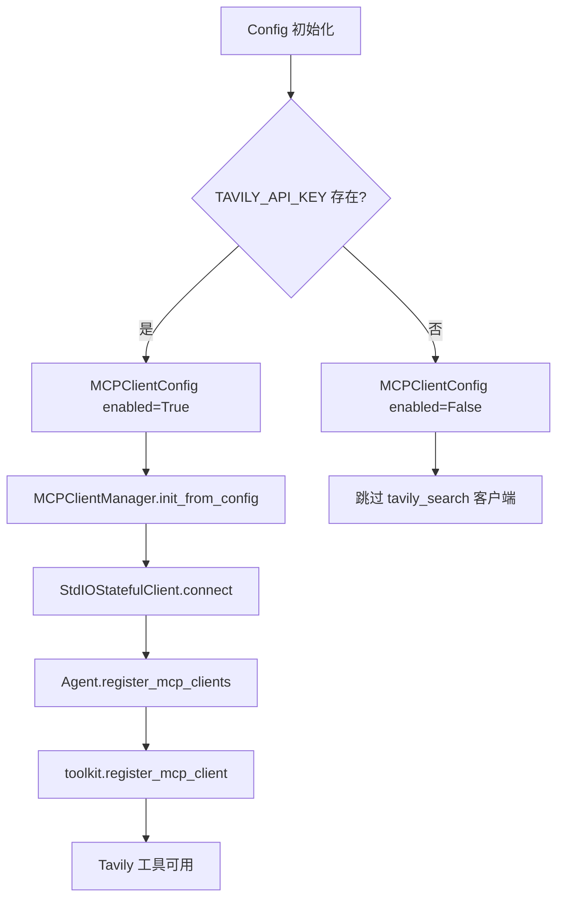

# PD-08.CoPaw CoPaw — ReMe 双通道语义搜索与 MCP Tavily Web 检索

> 文档编号：PD-08.CoPaw
> 来源：CoPaw `src/copaw/agents/memory/memory_manager.py`, `src/copaw/agents/tools/memory_search.py`, `src/copaw/config/config.py`
> GitHub：https://github.com/agentscope-ai/CoPaw.git
> 问题域：PD-08 搜索与检索 Search & Retrieval
> 状态：可复用方案

---

## 第 1 章 问题与动机

### 1.1 核心问题

个人 AI Agent 需要在两个维度上具备搜索能力：

1. **内部记忆检索** — Agent 跨会话运行，每次会话是全新的，必须从持久化的记忆文件（MEMORY.md、memory/*.md）中语义检索历史决策、偏好、待办事项等上下文，否则 Agent 会"失忆"。
2. **外部 Web 搜索** — Agent 需要获取实时信息（新闻、文档、API 参考），但搜索服务依赖外部 API Key，不是所有用户都配置了搜索能力。

核心挑战在于：如何让这两种搜索能力**按需启用**——embedding API Key 缺失时向量搜索自动降级为纯全文检索，Tavily API Key 缺失时 Web 搜索工具自动从 Agent 工具列表中移除，而不是报错崩溃。

### 1.2 CoPaw 的解法概述

CoPaw 通过 ReMe（一个独立的记忆管理库）+ MCP 协议集成 Tavily 搜索，构建了双层搜索架构：

1. **向量 + 全文检索双通道**：MemoryManager 继承 ReMeFb，同时启用 `vector_enabled`（语义搜索）和 `fts_enabled`（全文检索），两个通道独立开关（`memory_manager.py:481-524`）
2. **Embedding 缓存**：通过 `enable_cache` 配置项避免重复计算相同文本的 embedding（`memory_manager.py:518`）
3. **API Key 驱动的条件启用**：向量搜索以 `EMBEDDING_API_KEY` 是否存在为开关（`memory_manager.py:481`），Tavily 搜索以 `TAVILY_API_KEY` 是否存在为开关（`config.py:170`）
4. **MCP 协议集成外部搜索**：Tavily 通过 MCP StdIO 子进程接入，支持热重载（`mcp/manager.py:75-134`）
5. **闭包工厂注册工具**：`create_memory_search_tool` 用闭包绑定 MemoryManager 实例，生成可注册的异步工具函数（`memory_search.py:7-69`）

### 1.3 设计思想

| 设计原则 | 具体实现 | 理由 | 替代方案 |
|----------|----------|------|----------|
| 按需降级 | `vector_enabled = bool(embedding_api_key)` 一行决定向量搜索开关 | 零配置用户也能用全文检索，不会因缺 Key 崩溃 | 启动时强制校验所有 Key（用户体验差） |
| 双通道互补 | 向量搜索 + FTS 同时启用，ReMe 内部融合结果 | 语义搜索覆盖同义词，FTS 覆盖精确匹配 | 只用向量搜索（精确关键词可能漏掉） |
| MCP 协议解耦 | Tavily 通过 `npx tavily-mcp@latest` 子进程接入 | 搜索服务与 Agent 进程隔离，崩溃不影响主进程 | 直接 import tavily SDK（耦合度高） |
| 闭包工厂模式 | `create_memory_search_tool(mm)` 返回绑定实例的函数 | AgentScope Toolkit 要求注册独立函数，闭包避免全局状态 | 类方法直接注册（需改 Toolkit 接口） |
| 平台自适应存储 | Windows 用 local 后端，其他用 chroma | ChromaDB 在 Windows 上有兼容性问题 | 统一用一种后端（牺牲跨平台） |

---

## 第 2 章 源码实现分析

### 2.1 架构概览

CoPaw 的搜索架构分为两层：内部记忆检索（ReMe）和外部 Web 搜索（MCP Tavily）。

```
┌─────────────────────────────────────────────────────────┐
│                    CoPawAgent (ReActAgent)               │
│                                                         │
│  ┌─────────────┐  ┌──────────────┐  ┌───────────────┐  │
│  │ memory_search│  │ MCP Tools    │  │ Built-in Tools│  │
│  │ (闭包工具)   │  │ (Tavily etc) │  │ (shell/file)  │  │
│  └──────┬──────┘  └──────┬───────┘  └───────────────┘  │
│         │                │                               │
│  ┌──────▼──────┐  ┌──────▼───────┐                      │
│  │MemoryManager│  │MCPClientMgr  │                      │
│  │ (ReMeFb)    │  │ (StdIO子进程) │                      │
│  ├─────────────┤  ├──────────────┤                      │
│  │vector_search│  │tavily_search │                      │
│  │fts_search   │  │(条件启用)     │                      │
│  │embedding    │  └──────────────┘                      │
│  │  cache      │                                        │
│  └─────────────┘                                        │
└─────────────────────────────────────────────────────────┘
```

### 2.2 核心实现

#### 2.2.1 MemoryManager 初始化：双通道条件启用

```mermaid
graph TD
    A[MemoryManager.__init__] --> B[get_emb_envs 读取环境变量]
    B --> C{EMBEDDING_API_KEY 存在?}
    C -->|是| D[vector_enabled = True]
    C -->|否| E[vector_enabled = False, 日志警告]
    D --> F{FTS_ENABLED 环境变量}
    E --> F
    F -->|true/默认| G[fts_enabled = True]
    F -->|false| H[fts_enabled = False]
    G --> I{平台检测}
    H --> I
    I -->|Windows| J[backend = local]
    I -->|其他| K[backend = chroma]
    J --> L[super().__init__ 传入配置]
    K --> L
```

对应源码 `src/copaw/agents/memory/memory_manager.py:452-534`：

```python
class MemoryManager(ReMeFb):
    def __init__(self, *args, working_dir: str, **kwargs):
        if not _REME_AVAILABLE:
            raise RuntimeError("reme package not installed.")

        config = load_config()
        max_input_length = config.agents.running.max_input_length
        self._memory_compact_threshold = int(
            max_input_length * MEMORY_COMPACT_RATIO * 0.9,
        )

        (embedding_api_key, embedding_base_url, embedding_model_name,
         embedding_dimensions, embedding_cache_enabled) = self.get_emb_envs()

        vector_enabled = bool(embedding_api_key)  # 一行决定向量搜索开关
        fts_enabled = os.environ.get("FTS_ENABLED", "true").lower() == "true"

        memory_store_backend = os.environ.get("MEMORY_STORE_BACKEND", "auto")
        if memory_store_backend == "auto":
            memory_backend = "local" if platform.system() == "Windows" else "chroma"
        else:
            memory_backend = memory_store_backend

        super().__init__(
            *args,
            working_dir=working_dir,
            default_embedding_model_config={
                "model_name": embedding_model_name,
                "dimensions": embedding_dimensions,
                "enable_cache": embedding_cache_enabled,  # embedding 缓存
            },
            default_file_store_config={
                "backend": memory_backend,
                "store_name": "copaw",
                "vector_enabled": vector_enabled,
                "fts_enabled": fts_enabled,
            },
            default_file_watcher_config={
                "watch_paths": [
                    str(Path(working_dir) / "MEMORY.md"),
                    str(Path(working_dir) / "memory.md"),
                    str(Path(working_dir) / "memory"),
                ],
            },
            **kwargs,
        )
```

关键设计点：
- `vector_enabled = bool(embedding_api_key)`（L481）：API Key 为空字符串时 `bool("")` 为 False，自动禁用向量搜索
- `fts_enabled` 默认 True（L491）：全文检索作为保底通道始终可用
- `enable_cache`（L518）：embedding 缓存避免对相同文本重复调用 embedding API
- `watch_paths`（L527-530）：文件监听器自动索引 MEMORY.md 和 memory/ 目录变更

#### 2.2.2 memory_search 工具：闭包工厂 + 参数校验



对应源码 `src/copaw/agents/tools/memory_search.py:7-69` 和 `src/copaw/agents/memory/memory_manager.py:838-890`：

```python
# memory_search.py — 闭包工厂
def create_memory_search_tool(memory_manager):
    async def memory_search(
        query: str,
        max_results: int = 5,
        min_score: float = 0.1,
    ) -> ToolResponse:
        if memory_manager is None:
            return ToolResponse(content=[
                TextBlock(type="text", text="Error: Memory manager is not enabled."),
            ])
        try:
            return await memory_manager.memory_search(
                query=query, max_results=max_results, min_score=min_score,
            )
        except Exception as e:
            return ToolResponse(content=[
                TextBlock(type="text", text=f"Error: Memory search failed due to\n{e}"),
            ])
    return memory_search

# memory_manager.py — 参数校验 + 委托 ReMe
async def memory_search(self, query: str, max_results: int = 5,
                         min_score: float = 0.1) -> ToolResponse:
    if not query:
        return ToolResponse(content=[TextBlock(type="text", text="Error: No query provided.")])
    if isinstance(max_results, int):
        max_results = min(max(max_results, 1), 100)  # clamp [1, 100]
    if isinstance(min_score, float):
        min_score = min(max(min_score, 0.001), 0.999)  # clamp [0.001, 0.999]
    search_result: str = await super().memory_search(
        query=query, max_results=max_results, min_score=min_score,
    )
    return ToolResponse(content=[TextBlock(type="text", text=search_result)])
```

#### 2.2.3 MCP Tavily 条件注册与热重载



对应源码 `src/copaw/config/config.py:158-176`：

```python
class MCPConfig(BaseModel):
    clients: Dict[str, MCPClientConfig] = Field(
        default_factory=lambda: {
            "tavily_search": MCPClientConfig(
                name="tavily_mcp",
                enabled=bool(os.getenv("TAVILY_API_KEY")),  # 条件启用
                command="npx",
                args=["-y", "tavily-mcp@latest"],
                env={"TAVILY_API_KEY": os.getenv("TAVILY_API_KEY", "")},
            ),
        },
    )
```

MCP 客户端热重载（`src/copaw/app/mcp/manager.py:75-134`）采用 connect-outside-lock + swap-inside-lock 模式：

```python
async def replace_client(self, key, client_config, timeout=60.0):
    # 1. 锁外创建并连接新客户端（可能耗时）
    new_client = StdIOStatefulClient(
        name=client_config.name, command=client_config.command,
        args=client_config.args, env=client_config.env,
    )
    await asyncio.wait_for(new_client.connect(), timeout=timeout)
    # 2. 锁内原子交换 + 关闭旧客户端
    async with self._lock:
        old_client = self._clients.get(key)
        self._clients[key] = new_client
        if old_client is not None:
            await old_client.close()
```

### 2.3 实现细节

**Embedding 环境变量热更新**：`update_emb_envs()` 方法（`memory_manager.py:579-596`）在每次 compact/summary 前重新读取环境变量，支持运行时切换 embedding 模型而无需重启。

**MCP 配置监听器**：`MCPConfigWatcher`（`mcp/watcher.py:26-334`）每 2 秒轮询 config.json 的 mtime，检测到 MCP 配置变更后在后台 Task 中执行 reload，并通过 `_client_failures` 字典跟踪每个客户端的失败次数，超过 3 次自动放弃重试。

**记忆文件监听**：MemoryManager 配置了 `watch_paths` 监听 MEMORY.md 和 memory/ 目录，文件变更时自动重新索引到向量库和全文索引。

**工具注册时机**：`CoPawAgent._setup_memory_manager()`（`react_agent.py:189-215`）在 Agent 构造时条件注册 memory_search 工具；MCP 工具在 `register_mcp_clients()`（`react_agent.py:262-265`）中异步注册，发生在 Agent 构造之后、首次 query 之前。


---

## 第 3 章 迁移指南

### 3.1 迁移清单

**阶段 1：内部记忆检索（核心）**

- [ ] 引入 ReMe 库（`pip install reme`）或实现等价的向量+全文检索双通道
- [ ] 实现 MemoryManager 包装类，配置 embedding 模型、存储后端、文件监听
- [ ] 实现 `create_memory_search_tool` 闭包工厂，将 MemoryManager 绑定为工具函数
- [ ] 在 Agent 初始化时条件注册 memory_search 工具（检查 API Key）
- [ ] 配置文件监听器，自动索引 MEMORY.md 和 memory/ 目录变更

**阶段 2：外部 Web 搜索（可选）**

- [ ] 定义 MCP 客户端配置模型（command、args、env、enabled）
- [ ] 实现 MCPClientManager，管理 StdIO 子进程生命周期
- [ ] 在配置中以 API Key 存在性控制 Tavily 等搜索服务的启用
- [ ] 实现配置热重载（轮询 config mtime + hash 比对 + 后台 reload）

**阶段 3：容错增强**

- [ ] embedding 参数 clamp 校验（max_results [1,100]，min_score [0.001,0.999]）
- [ ] MCP 客户端连接超时保护（默认 60s）
- [ ] MCP 重试次数上限（3 次失败后放弃，配置变更时重置计数）
- [ ] 平台自适应存储后端选择

### 3.2 适配代码模板

以下模板展示如何在任意 Agent 框架中复用 CoPaw 的"API Key 驱动条件注册"模式：

```python
import os
from typing import Optional, Callable, Awaitable

class ConditionalSearchToolkit:
    """按 API Key 存在性条件注册搜索工具的通用模式。"""

    def __init__(self):
        self._tools: dict[str, Callable] = {}

    def register_if_available(
        self,
        tool_name: str,
        env_key: str,
        factory: Callable[[str], Callable[..., Awaitable]],
    ) -> bool:
        """仅当环境变量存在时注册工具。

        Args:
            tool_name: 工具名称
            env_key: 控制启用的环境变量名
            factory: 接收 API Key 返回工具函数的工厂

        Returns:
            是否成功注册
        """
        api_key = os.environ.get(env_key, "")
        if not api_key:
            return False
        self._tools[tool_name] = factory(api_key)
        return True

    def get_tools(self) -> dict[str, Callable]:
        return dict(self._tools)


# 使用示例
toolkit = ConditionalSearchToolkit()

# 向量搜索：EMBEDDING_API_KEY 存在时启用
toolkit.register_if_available(
    "memory_search",
    "EMBEDDING_API_KEY",
    lambda key: create_vector_search_tool(api_key=key),
)

# Web 搜索：TAVILY_API_KEY 存在时启用
toolkit.register_if_available(
    "web_search",
    "TAVILY_API_KEY",
    lambda key: create_tavily_search_tool(api_key=key),
)
```

### 3.3 适用场景

| 场景 | 适用度 | 说明 |
|------|--------|------|
| 个人 AI 助手（跨会话记忆） | ⭐⭐⭐ | CoPaw 的核心场景，MEMORY.md 模式简单有效 |
| 多用户 SaaS Agent | ⭐⭐ | 需要改造为按用户隔离的记忆存储，ReMe 的 working_dir 可按用户分目录 |
| 深度研究 Agent | ⭐⭐ | Web 搜索能力通过 MCP 可扩展，但缺少递归搜索和多源聚合 |
| 纯离线 Agent | ⭐⭐⭐ | FTS 通道不依赖任何外部 API，完全离线可用 |
| 企业知识库检索 | ⭐ | ReMe 面向个人记忆文件，大规模文档需要更专业的 RAG 方案 |

---

## 第 4 章 测试用例

```python
import pytest
from unittest.mock import AsyncMock, MagicMock, patch
import os


class TestMemorySearchParameterValidation:
    """测试 memory_search 的参数校验逻辑。"""

    @pytest.fixture
    def mock_memory_manager(self):
        mm = AsyncMock()
        mm.memory_search = AsyncMock(return_value=MagicMock(
            content=[{"type": "text", "text": "found: test result"}]
        ))
        return mm

    @pytest.mark.asyncio
    async def test_empty_query_returns_error(self, mock_memory_manager):
        """空查询应返回错误而非调用 ReMe。"""
        from copaw.agents.tools.memory_search import create_memory_search_tool
        tool = create_memory_search_tool(mock_memory_manager)
        result = await tool(query="")
        # 空查询不应调用底层搜索
        mock_memory_manager.memory_search.assert_not_called()

    @pytest.mark.asyncio
    async def test_max_results_clamped_to_range(self, mock_memory_manager):
        """max_results 应被 clamp 到 [1, 100]。"""
        tool = create_memory_search_tool(mock_memory_manager)
        await tool(query="test", max_results=200)
        call_args = mock_memory_manager.memory_search.call_args
        assert call_args.kwargs["max_results"] <= 100

    @pytest.mark.asyncio
    async def test_min_score_clamped_to_range(self, mock_memory_manager):
        """min_score 应被 clamp 到 [0.001, 0.999]。"""
        tool = create_memory_search_tool(mock_memory_manager)
        await tool(query="test", min_score=0.0)
        call_args = mock_memory_manager.memory_search.call_args
        assert call_args.kwargs["min_score"] >= 0.001

    @pytest.mark.asyncio
    async def test_none_memory_manager_returns_error(self):
        """memory_manager 为 None 时应返回错误。"""
        tool = create_memory_search_tool(None)
        result = await tool(query="test")
        assert "not enabled" in result.content[0].text


class TestVectorEnabledCondition:
    """测试向量搜索的条件启用逻辑。"""

    def test_vector_enabled_when_key_present(self):
        """EMBEDDING_API_KEY 存在时 vector_enabled 应为 True。"""
        assert bool("sk-test-key") is True

    def test_vector_disabled_when_key_empty(self):
        """EMBEDDING_API_KEY 为空时 vector_enabled 应为 False。"""
        assert bool("") is False

    def test_fts_enabled_by_default(self):
        """FTS 默认启用。"""
        assert os.environ.get("FTS_ENABLED", "true").lower() == "true"


class TestMCPTavilyConditionalEnable:
    """测试 Tavily MCP 客户端的条件启用。"""

    @patch.dict(os.environ, {"TAVILY_API_KEY": "tvly-test123"})
    def test_tavily_enabled_with_key(self):
        """TAVILY_API_KEY 存在时 Tavily 客户端应启用。"""
        assert bool(os.getenv("TAVILY_API_KEY")) is True

    @patch.dict(os.environ, {}, clear=True)
    def test_tavily_disabled_without_key(self):
        """TAVILY_API_KEY 不存在时 Tavily 客户端应禁用。"""
        assert bool(os.getenv("TAVILY_API_KEY")) is False


class TestMCPClientManagerHotReload:
    """测试 MCP 客户端热重载的锁安全性。"""

    @pytest.mark.asyncio
    async def test_replace_client_closes_old(self):
        """replace_client 应关闭旧客户端。"""
        from copaw.app.mcp.manager import MCPClientManager
        manager = MCPClientManager()
        # 模拟已有客户端
        old_client = AsyncMock()
        manager._clients["test"] = old_client
        # 模拟新客户端配置
        new_config = MagicMock()
        new_config.name = "test"
        new_config.command = "echo"
        new_config.args = []
        new_config.env = {}
        with patch("copaw.app.mcp.manager.StdIOStatefulClient") as MockClient:
            mock_instance = AsyncMock()
            MockClient.return_value = mock_instance
            await manager.replace_client("test", new_config)
            old_client.close.assert_called_once()
```


---

## 第 5 章 跨域关联

| 关联域 | 关系类型 | 说明 |
|--------|----------|------|
| PD-01 上下文管理 | 协同 | MemoryCompactionHook 在上下文超限时触发压缩，压缩后的摘要通过 memory_search 可检索；compact_memory 和 summary_memory 共用同一个 MemoryManager 实例 |
| PD-04 工具系统 | 依赖 | memory_search 通过 AgentScope Toolkit.register_tool_function 注册；MCP 工具通过 toolkit.register_mcp_client 注册；两者共享同一个 Toolkit 实例 |
| PD-06 记忆持久化 | 协同 | MemoryManager 的 summary_memory 将对话摘要写入 memory/ 目录，这些文件又被 file_watcher 自动索引到搜索引擎中，形成"写入→索引→检索"闭环 |
| PD-03 容错与重试 | 协同 | MCPConfigWatcher 的 _client_failures 跟踪机制（3 次失败放弃）和 MCP 连接超时保护（60s）属于容错设计；memory_search 的 try/except 包裹也是容错 |
| PD-10 中间件管道 | 协同 | MemoryCompactionHook 作为 pre_reasoning hook 注册，在每次推理前检查 token 用量并触发压缩，这是中间件管道模式的应用 |

---

## 第 6 章 来源文件索引

| 文件 | 行范围 | 关键实现 |
|------|--------|----------|
| `src/copaw/agents/memory/memory_manager.py` | L445-534 | MemoryManager 类定义、双通道初始化、embedding 配置 |
| `src/copaw/agents/memory/memory_manager.py` | L554-577 | get_emb_envs 静态方法：读取 5 个 embedding 环境变量 |
| `src/copaw/agents/memory/memory_manager.py` | L838-890 | memory_search 方法：参数校验 + 委托 ReMe |
| `src/copaw/agents/tools/memory_search.py` | L7-69 | create_memory_search_tool 闭包工厂 |
| `src/copaw/config/config.py` | L147-176 | MCPClientConfig + MCPConfig：Tavily 条件启用 |
| `src/copaw/app/mcp/manager.py` | L22-194 | MCPClientManager：热重载、锁安全、超时保护 |
| `src/copaw/app/mcp/watcher.py` | L26-334 | MCPConfigWatcher：轮询 mtime + hash 比对 + 失败跟踪 |
| `src/copaw/agents/react_agent.py` | L189-265 | CoPawAgent：条件注册 memory_search + MCP 工具 |
| `src/copaw/agents/hooks/memory_compaction.py` | L65-204 | MemoryCompactionHook：token 计数 + 自动压缩 |
| `src/copaw/constant.py` | L49-56 | MEMORY_COMPACT_KEEP_RECENT、MEMORY_COMPACT_RATIO 常量 |
| `src/copaw/agents/md_files/en/AGENTS.md` | L47-51 | Prompt 指令：强制 Agent 在回答前先 memory_search |

---

## 第 7 章 横向对比维度

```json comparison_data
{
  "project": "CoPaw",
  "dimensions": {
    "搜索架构": "ReMe 双通道（向量+全文检索）+ MCP StdIO 外部搜索",
    "去重机制": "ReMe 内部融合，CoPaw 层不额外去重",
    "结果处理": "ToolResponse 包裹 TextBlock，Agent 直接消费文本",
    "容错策略": "API Key 缺失自动降级；MCP 3 次失败放弃；连接 60s 超时",
    "成本控制": "embedding 缓存避免重复计算；min_score 阈值过滤低质量结果",
    "搜索源热切换": "MCPConfigWatcher 轮询 config.json mtime，后台 Task 热重载",
    "缓存机制": "embedding enable_cache 配置项，ReMe 内部实现缓存",
    "嵌入后端适配": "环境变量驱动：EMBEDDING_BASE_URL + MODEL_NAME + DIMENSIONS",
    "检索方式": "语义搜索（向量）+ 精确匹配（FTS）双通道并行",
    "扩展性": "MCP 协议可插拔任意搜索服务，config.json 声明式添加",
    "搜索工具条件注册": "bool(api_key) 一行判断，Key 缺失时工具不注册而非报错",
    "记忆文件自动索引": "file_watcher 监听 MEMORY.md 和 memory/ 目录变更自动重建索引"
  }
}
```

### 域元数据补充

```json domain_metadata
{
  "solution_summary": "CoPaw 通过 ReMe 库实现向量+全文检索双通道记忆搜索，embedding 缓存降低成本，MCP StdIO 集成 Tavily Web 搜索，API Key 驱动条件启用实现零配置降级",
  "description": "个人 Agent 的记忆文件语义检索与外部搜索服务按需集成",
  "sub_problems": [
    "记忆文件自动索引：工作目录下记忆文件变更时如何自动触发向量库和全文索引重建",
    "存储后端平台适配：向量数据库在不同操作系统上的兼容性差异如何通过自动检测选择后端"
  ],
  "best_practices": [
    "API Key 存在性作为搜索能力开关：bool(api_key) 一行实现条件降级，零配置用户也能用全文检索保底",
    "MCP 客户端热重载采用 connect-outside-lock + swap-inside-lock 模式：最小化锁持有时间，新连接失败不影响旧客户端"
  ]
}
```

