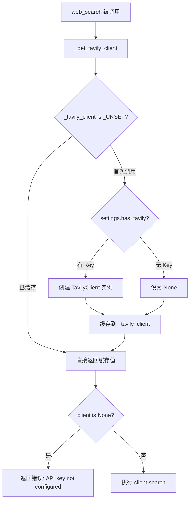
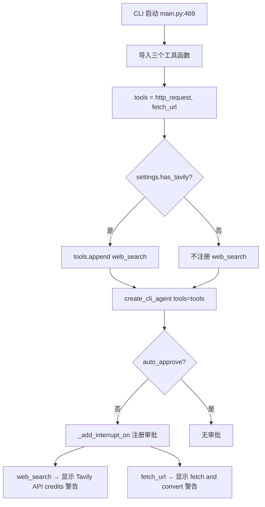
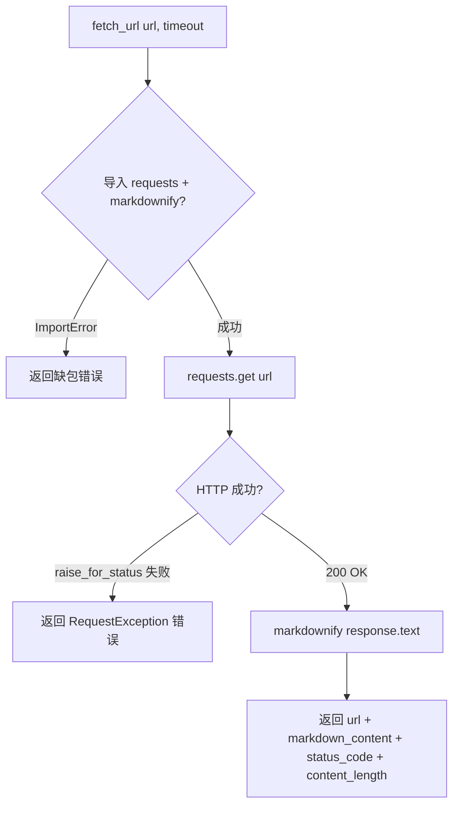

# PD-08.32 DeepAgents — Tavily 单源搜索与 HTML→Markdown 净化

> 文档编号：PD-08.32
> 来源：DeepAgents `libs/cli/deepagents_cli/tools.py`, `libs/cli/deepagents_cli/agent.py`
> GitHub：https://github.com/langchain-ai/deepagents.git
> 问题域：PD-08 搜索与检索 Search & Retrieval
> 状态：可复用方案

---

## 第 1 章 问题与动机

### 1.1 核心问题

Agent 系统需要从互联网获取实时信息来回答用户问题、辅助研究和代码调试。核心挑战包括：

1. **搜索 API 集成**：如何将第三方搜索引擎（Tavily）无缝集成到 Agent 工具链中，同时处理 API Key 缺失、配额耗尽、网络超时等异常
2. **网页内容消费**：搜索引擎返回的是 URL 和摘要，Agent 需要获取完整网页内容并转换为 LLM 可消费的格式（Markdown）
3. **工具可用性动态检测**：搜索工具依赖外部 API Key，系统需要在运行时检测 Key 是否配置，动态决定是否注册该工具
4. **成本感知**：每次搜索调用消耗 API 额度，需要通过 HITL（Human-in-the-Loop）审批机制让用户感知成本
5. **多场景搜索**：同一搜索引擎需要支持通用搜索、新闻搜索、金融搜索等不同主题

### 1.2 DeepAgents 的解法概述

DeepAgents 采用**极简单源架构**，围绕 Tavily 搜索引擎构建搜索能力：

1. **懒加载单例客户端** — `_get_tavily_client()` 使用模块级哨兵值 `_UNSET` 实现延迟初始化，避免启动时导入开销（`tools.py:14-32`）
2. **条件工具注册** — `settings.has_tavily` 属性检测环境变量，仅在 API Key 存在时将 `web_search` 注册到 Agent 工具列表（`main.py:496-497`）
3. **HTML→Markdown 净化** — `fetch_url` 工具使用 `markdownify` 库将网页 HTML 转换为干净的 Markdown 文本供 LLM 消费（`tools.py:183-236`）
4. **三主题搜索** — `web_search` 支持 `general`/`news`/`finance` 三种 Tavily topic 参数，覆盖通用、新闻、金融场景（`tools.py:107`）
5. **HITL 成本审批** — 每次 `web_search` 和 `fetch_url` 调用都经过 interrupt_on 审批，提示用户"This will use Tavily API credits"（`agent.py:350-358`）

### 1.3 设计思想

| 设计原则 | 具体实现 | 理由 | 替代方案 |
|----------|----------|------|----------|
| 懒加载 | `_UNSET` 哨兵 + 全局缓存 | 避免无 Key 时导入 tavily 包报错 | 启动时初始化（会阻塞 CLI 启动） |
| 条件注册 | `has_tavily` → 动态 append | 无 Key 时 Agent 不暴露搜索工具 | 注册但运行时报错（用户体验差） |
| 单源依赖 | 仅 Tavily，无 fallback | 简化架构，Tavily 质量足够 | 多源 fallback（增加复杂度） |
| 内容净化 | markdownify 全量转换 | 保留结构化信息（标题/列表/链接） | BeautifulSoup 纯文本（丢失结构） |
| 成本透明 | HITL interrupt 提示 API credits | 用户知情同意，避免意外消费 | 静默调用（用户不知道花了多少钱） |

---

## 第 2 章 源码实现分析

### 2.1 架构概览

DeepAgents 的搜索与检索系统由三个独立工具函数 + 一个配置层 + 一个 HITL 审批层组成：

```
┌─────────────────────────────────────────────────────────┐
│                    Agent (LangGraph)                     │
│                                                         │
│  tools = [http_request, fetch_url, web_search?]         │
│           ↓              ↓            ↓                 │
│  ┌──────────────┐ ┌────────────┐ ┌──────────────┐      │
│  │ http_request │ │  fetch_url │ │  web_search  │      │
│  │  (通用HTTP)  │ │ (HTML→MD)  │ │  (Tavily)    │      │
│  └──────┬───────┘ └─────┬──────┘ └──────┬───────┘      │
│         │               │               │               │
│         ▼               ▼               ▼               │
│    requests.request  markdownify   TavilyClient         │
│                                    (懒加载单例)          │
└─────────────────────────────────────────────────────────┘
                          ↑
              ┌───────────┴───────────┐
              │  Settings.has_tavily  │
              │  (环境变量检测)        │
              │  TAVILY_API_KEY       │
              └───────────────────────┘
```

三个工具的职责分离清晰：
- `http_request`：通用 HTTP 客户端，返回原始 JSON/文本
- `fetch_url`：专用网页抓取器，HTML→Markdown 转换
- `web_search`：Tavily 搜索引擎封装，条件注册

### 2.2 核心实现

#### 2.2.1 Tavily 客户端懒加载单例



对应源码 `libs/cli/deepagents_cli/tools.py:10-32`：

```python
_UNSET = object()
_tavily_client: TavilyClient | object | None = _UNSET


def _get_tavily_client() -> TavilyClient | None:
    global _tavily_client
    if _tavily_client is not _UNSET:
        return _tavily_client

    from deepagents_cli.config import settings

    if settings.has_tavily:
        from tavily import TavilyClient as _TavilyClient
        _tavily_client = _TavilyClient(api_key=settings.tavily_api_key)
    else:
        _tavily_client = None
    return _tavily_client
```

关键设计点：
- 使用 `object()` 哨兵而非 `None`，区分"未初始化"和"初始化为 None（无 Key）"
- `from tavily import TavilyClient` 延迟到首次调用时执行，避免无 tavily 包时启动报错
- `from deepagents_cli.config import settings` 也延迟导入，打破循环依赖

#### 2.2.2 条件工具注册与 HITL 审批



对应源码 `libs/cli/deepagents_cli/main.py:495-497`：

```python
tools: list[Callable[..., Any] | dict[str, Any]] = [http_request, fetch_url]
if settings.has_tavily:
    tools.append(web_search)
```

HITL 审批配置 `libs/cli/deepagents_cli/agent.py:242-275`：

```python
def _format_web_search_description(
    tool_call: ToolCall, _state: AgentState[Any], _runtime: Runtime[Any]
) -> str:
    args = tool_call["args"]
    query = args.get("query", "unknown")
    max_results = args.get("max_results", 5)
    return (
        f"Query: {query}\nMax results: {max_results}\n\n"
        f"{get_glyphs().warning}  This will use Tavily API credits"
    )

def _format_fetch_url_description(
    tool_call: ToolCall, _state: AgentState[Any], _runtime: Runtime[Any]
) -> str:
    args = tool_call["args"]
    url = args.get("url", "unknown")
    timeout = args.get("timeout", 30)
    return (
        f"URL: {url}\nTimeout: {timeout}s\n\n"
        f"{get_glyphs().warning}  Will fetch and convert web content to markdown"
    )
```

#### 2.2.3 fetch_url HTML→Markdown 净化



对应源码 `libs/cli/deepagents_cli/tools.py:183-236`：

```python
def fetch_url(url: str, timeout: int = 30) -> dict[str, Any]:
    try:
        import requests
        from markdownify import markdownify
    except ImportError as exc:
        return {
            "error": f"Required package not installed: {exc.name}. "
            "Install with: pip install 'deepagents[cli]'",
            "url": url,
        }

    try:
        response = requests.get(
            url, timeout=timeout,
            headers={"User-Agent": "Mozilla/5.0 (compatible; DeepAgents/1.0)"},
        )
        response.raise_for_status()
        markdown_content = markdownify(response.text)
        return {
            "url": str(response.url),
            "markdown_content": markdown_content,
            "status_code": response.status_code,
            "content_length": len(markdown_content),
        }
    except requests.exceptions.RequestException as e:
        return {"error": f"Fetch URL error: {e!s}", "url": url}
```

### 2.3 实现细节

#### Deep Research 示例中的增强搜索模式

DeepAgents 在 `examples/deep_research/` 中展示了更高级的搜索模式（`examples/deep_research/research_agent/tools.py:38-88`）：

1. **搜索+全文抓取二阶段**：先用 Tavily 发现 URL，再用 `fetch_webpage_content()` 抓取完整网页内容转 Markdown，而非仅依赖 Tavily 返回的摘要
2. **think_tool 反思机制**：每次搜索后强制调用 `think_tool` 进行反思，评估信息充分性（`examples/deep_research/research_agent/prompts.py:79`）
3. **硬性调用预算**：简单查询 2-3 次搜索上限，复杂查询 5 次上限，防止无限搜索（`prompts.py:93-96`）
4. **子代理并行研究**：编排器将研究任务分配给最多 3 个并行子代理，每个子代理独立搜索（`agent.py:21-22`）

#### 异常处理的全覆盖策略

`web_search` 函数（`tools.py:137-180`）捕获了 7 种 Tavily 特定异常：
- `BadRequestError` — 查询格式错误
- `ForbiddenError` — 权限不足
- `InvalidAPIKeyError` — Key 无效
- `MissingAPIKeyError` — Key 缺失
- `TavilyTimeoutError` — Tavily 服务超时
- `UsageLimitExceededError` — 配额耗尽
- `requests.exceptions.RequestException` — 网络层异常

所有异常统一返回 `{"error": "...", "query": query}` 格式，Agent 可据此向用户解释失败原因。

#### Settings 环境检测

`config.py:470-514` 中 `Settings.from_environment()` 在 CLI 启动时一次性检测所有 API Key：

```python
tavily_key = os.environ.get("TAVILY_API_KEY")
# ...
return cls(tavily_api_key=tavily_key, ...)
```

`has_tavily` 属性（`config.py:542-544`）是一个简单的 None 检查：

```python
@property
def has_tavily(self) -> bool:
    return self.tavily_api_key is not None
```

---

## 第 3 章 迁移指南

### 3.1 迁移清单

#### 阶段 1：基础搜索能力（1 个文件）

- [ ] 安装依赖：`pip install tavily-python markdownify requests`
- [ ] 创建 `tools/search.py`，实现 `web_search` + `fetch_url` 两个工具函数
- [ ] 配置 `TAVILY_API_KEY` 环境变量
- [ ] 实现懒加载单例模式避免启动时导入

#### 阶段 2：条件注册（集成到 Agent 框架）

- [ ] 在 Agent 初始化时检测 `TAVILY_API_KEY` 是否存在
- [ ] 仅在 Key 存在时注册 `web_search` 工具
- [ ] `fetch_url` 和 `http_request` 作为基础工具始终注册

#### 阶段 3：成本控制（可选）

- [ ] 为搜索工具添加 HITL 审批机制
- [ ] 在审批提示中显示 API 成本警告
- [ ] 实现搜索调用预算（如 Deep Research 示例中的 5 次上限）

### 3.2 适配代码模板

以下代码可直接复用，实现 Tavily 搜索 + HTML→Markdown 净化的完整工具链：

```python
"""搜索工具模块 — 可直接复用的 Tavily 搜索 + URL 抓取工具。

依赖：pip install tavily-python markdownify requests
环境变量：TAVILY_API_KEY
"""

from __future__ import annotations

import os
from typing import Any, Literal

# ── 懒加载单例 ──────────────────────────────────────────

_UNSET = object()
_client: Any = _UNSET


def _get_client():
    """懒加载 Tavily 客户端，无 Key 时返回 None。"""
    global _client
    if _client is not _UNSET:
        return _client

    api_key = os.environ.get("TAVILY_API_KEY")
    if api_key:
        from tavily import TavilyClient
        _client = TavilyClient(api_key=api_key)
    else:
        _client = None
    return _client


# ── 搜索工具 ────────────────────────────────────────────

def web_search(
    query: str,
    max_results: int = 5,
    topic: Literal["general", "news", "finance"] = "general",
    include_raw_content: bool = False,
) -> dict[str, Any]:
    """Tavily 搜索，返回结构化结果。"""
    client = _get_client()
    if client is None:
        return {"error": "TAVILY_API_KEY not configured", "query": query}

    try:
        return client.search(
            query,
            max_results=max_results,
            include_raw_content=include_raw_content,
            topic=topic,
        )
    except Exception as e:
        return {"error": f"Search failed: {e!s}", "query": query}


# ── URL 抓取工具 ─────────────────────────────────────────

def fetch_url(url: str, timeout: int = 30) -> dict[str, Any]:
    """抓取网页并转换为 Markdown。"""
    import requests
    from markdownify import markdownify

    try:
        resp = requests.get(
            url, timeout=timeout,
            headers={"User-Agent": "Mozilla/5.0 (compatible; MyAgent/1.0)"},
        )
        resp.raise_for_status()
        md = markdownify(resp.text)
        return {
            "url": str(resp.url),
            "markdown_content": md,
            "status_code": resp.status_code,
            "content_length": len(md),
        }
    except requests.exceptions.RequestException as e:
        return {"error": f"Fetch error: {e!s}", "url": url}


# ── 条件注册 ─────────────────────────────────────────────

def get_search_tools() -> list:
    """返回可用的搜索工具列表，无 Key 时不包含 web_search。"""
    tools = [fetch_url]
    if _get_client() is not None:
        tools.append(web_search)
    return tools
```

### 3.3 适用场景

| 场景 | 适用度 | 说明 |
|------|--------|------|
| CLI Agent 需要 Web 搜索 | ⭐⭐⭐ | 极简集成，开箱即用 |
| 深度研究 Agent | ⭐⭐ | 需补充搜索+全文抓取二阶段和反思机制 |
| 多源搜索聚合 | ⭐ | 仅 Tavily 单源，无 fallback，需自行扩展 |
| 金融/新闻专项搜索 | ⭐⭐⭐ | Tavily topic 参数原生支持 |
| 离线/内网环境 | ⭐ | 完全依赖外部 API，无本地检索能力 |
| 成本敏感场景 | ⭐⭐⭐ | HITL 审批 + 调用预算双重控制 |

---

## 第 4 章 测试用例

基于 DeepAgents 真实函数签名编写的测试代码（参考 `libs/cli/tests/unit_tests/tools/test_fetch_url.py`）：

```python
"""测试搜索工具模块 — 覆盖正常路径、边界情况、降级行为。"""

import os
from unittest.mock import MagicMock, patch

import pytest
import requests
import responses


# ── 测试 _get_tavily_client 懒加载 ──────────────────────

class TestTavilyClientSingleton:
    """测试 Tavily 客户端懒加载单例。"""

    def setup_method(self):
        """每个测试前重置单例状态。"""
        import deepagents_cli.tools as tools_mod
        tools_mod._tavily_client = tools_mod._UNSET

    def test_returns_none_without_api_key(self):
        """无 TAVILY_API_KEY 时返回 None。"""
        with patch.dict(os.environ, {}, clear=True):
            from deepagents_cli.tools import _get_tavily_client
            # 需要重置 settings 缓存
            client = _get_tavily_client()
            # 验证返回 None 而非抛异常
            assert client is None

    def test_caches_after_first_call(self):
        """第二次调用直接返回缓存值，不重新创建。"""
        import deepagents_cli.tools as tools_mod
        tools_mod._tavily_client = "cached_value"
        from deepagents_cli.tools import _get_tavily_client
        assert _get_tavily_client() == "cached_value"


# ── 测试 web_search ─────────────────────────────────────

class TestWebSearch:
    """测试 web_search 工具函数。"""

    def test_returns_error_without_client(self):
        """无 Tavily 客户端时返回错误字典。"""
        with patch("deepagents_cli.tools._get_tavily_client", return_value=None):
            from deepagents_cli.tools import web_search
            result = web_search("test query")
            assert "error" in result
            assert "API key not configured" in result["error"]
            assert result["query"] == "test query"

    def test_passes_topic_parameter(self):
        """验证 topic 参数正确传递给 Tavily。"""
        mock_client = MagicMock()
        mock_client.search.return_value = {"results": []}
        with patch("deepagents_cli.tools._get_tavily_client", return_value=mock_client):
            from deepagents_cli.tools import web_search
            web_search("finance news", topic="finance", max_results=3)
            mock_client.search.assert_called_once_with(
                "finance news",
                max_results=3,
                include_raw_content=False,
                topic="finance",
            )

    def test_handles_usage_limit_exceeded(self):
        """配额耗尽时返回错误而非抛异常。"""
        mock_client = MagicMock()
        from tavily.errors import UsageLimitExceededError
        mock_client.search.side_effect = UsageLimitExceededError("Limit exceeded")
        with patch("deepagents_cli.tools._get_tavily_client", return_value=mock_client):
            from deepagents_cli.tools import web_search
            result = web_search("test")
            assert "error" in result
            assert "Limit exceeded" in result["error"]


# ── 测试 fetch_url ──────────────────────────────────────

class TestFetchUrl:
    """测试 fetch_url HTML→Markdown 转换。"""

    @responses.activate
    def test_converts_html_to_markdown(self):
        """HTML 正确转换为 Markdown。"""
        responses.add(
            responses.GET, "http://example.com",
            body="<html><body><h1>Title</h1><p>Content</p></body></html>",
            status=200,
        )
        from deepagents_cli.tools import fetch_url
        result = fetch_url("http://example.com")
        assert result["status_code"] == 200
        assert "Title" in result["markdown_content"]
        assert result["content_length"] > 0

    @responses.activate
    def test_handles_timeout(self):
        """超时返回错误字典。"""
        responses.add(
            responses.GET, "http://example.com/slow",
            body=requests.exceptions.Timeout(),
        )
        from deepagents_cli.tools import fetch_url
        result = fetch_url("http://example.com/slow", timeout=1)
        assert "error" in result
        assert result["url"] == "http://example.com/slow"

    @responses.activate
    def test_handles_404(self):
        """HTTP 404 返回错误。"""
        responses.add(responses.GET, "http://example.com/missing", status=404)
        from deepagents_cli.tools import fetch_url
        result = fetch_url("http://example.com/missing")
        assert "error" in result

    def test_sets_custom_user_agent(self):
        """验证自定义 User-Agent 头。"""
        with patch("requests.get") as mock_get:
            mock_resp = MagicMock()
            mock_resp.status_code = 200
            mock_resp.text = "<p>test</p>"
            mock_resp.url = "http://example.com"
            mock_resp.raise_for_status = MagicMock()
            mock_get.return_value = mock_resp
            from deepagents_cli.tools import fetch_url
            fetch_url("http://example.com")
            call_kwargs = mock_get.call_args
            assert "DeepAgents" in call_kwargs.kwargs["headers"]["User-Agent"]
```

---

## 第 5 章 跨域关联

| 关联域 | 关系类型 | 说明 |
|--------|----------|------|
| PD-01 上下文管理 | 协同 | `fetch_url` 返回的 `content_length` 可用于上下文预算估算；Deep Research 示例中的搜索调用预算（5 次上限）本质是上下文管理策略 |
| PD-04 工具系统 | 依赖 | 搜索工具通过 `create_cli_agent` 的 `tools` 参数注册，依赖 DeepAgents SDK 的工具系统；条件注册模式是工具系统设计的典型实践 |
| PD-09 Human-in-the-Loop | 协同 | `web_search` 和 `fetch_url` 都配置了 `interrupt_on` 审批，HITL 机制是搜索成本控制的关键手段 |
| PD-02 多 Agent 编排 | 协同 | Deep Research 示例中编排器将搜索任务委托给最多 3 个并行子代理，搜索能力与编排能力紧密配合 |
| PD-03 容错与重试 | 依赖 | `web_search` 捕获 7 种 Tavily 异常统一返回错误字典，但无自动重试机制，容错策略为"快速失败+用户可见" |
| PD-11 可观测性 | 协同 | HITL 审批提示中显示 "Tavily API credits" 是成本可观测性的轻量实现 |
| PD-12 推理增强 | 协同 | Deep Research 示例中的 `think_tool` 在每次搜索后强制反思，是推理增强与搜索结合的典型模式 |

---

## 第 6 章 来源文件索引

| 文件 | 行范围 | 关键实现 |
|------|--------|----------|
| `libs/cli/deepagents_cli/tools.py` | L1-L237 | 三个搜索工具函数：`web_search`、`fetch_url`、`http_request` + Tavily 懒加载单例 |
| `libs/cli/deepagents_cli/tools.py` | L10-L32 | `_UNSET` 哨兵 + `_get_tavily_client()` 懒加载单例 |
| `libs/cli/deepagents_cli/tools.py` | L104-L180 | `web_search` 函数：Tavily 搜索 + 7 种异常捕获 |
| `libs/cli/deepagents_cli/tools.py` | L183-L236 | `fetch_url` 函数：HTML→Markdown 净化 |
| `libs/cli/deepagents_cli/agent.py` | L242-L275 | HITL 审批描述格式化：`_format_web_search_description` + `_format_fetch_url_description` |
| `libs/cli/deepagents_cli/agent.py` | L324-L385 | `_add_interrupt_on` 配置所有工具的审批规则 |
| `libs/cli/deepagents_cli/agent.py` | L388-L597 | `create_cli_agent` 工厂函数：工具注册 + 中间件组装 |
| `libs/cli/deepagents_cli/main.py` | L469-L497 | 工具导入 + 条件注册 `web_search` |
| `libs/cli/deepagents_cli/config.py` | L446-L544 | `Settings` 类：`tavily_api_key` 字段 + `has_tavily` 属性 |
| `libs/cli/deepagents_cli/non_interactive.py` | L49, L634-L636 | 非交互模式下同样的条件工具注册 |
| `libs/cli/deepagents_cli/tool_display.py` | L111-L167 | 搜索工具的 TUI 显示格式化 |
| `libs/cli/deepagents_cli/system_prompt.md` | L100-L106, L213-L223 | 系统提示中的搜索工具使用指引 |
| `examples/deep_research/research_agent/tools.py` | L1-L117 | 增强版搜索：Tavily 发现 URL + httpx 全文抓取 + think_tool 反思 |
| `examples/deep_research/research_agent/prompts.py` | L67-L132 | 研究子代理提示：搜索预算、反思要求、停止条件 |
| `examples/deep_research/agent.py` | L1-L59 | 研究编排器：子代理并行搜索配置 |
| `libs/cli/tests/unit_tests/tools/test_fetch_url.py` | L1-L73 | `fetch_url` 单元测试：成功/404/超时/连接错误 |

---

## 第 7 章 横向对比维度

> **重要：** 本章用于自动填充 Butcher Wiki 的横向对比表。

```json comparison_data
{
  "project": "DeepAgents",
  "dimensions": {
    "搜索架构": "Tavily 单源直连，无向量数据库，无本地索引",
    "去重机制": "无显式去重，依赖 Tavily 服务端去重",
    "结果处理": "markdownify 全量 HTML→Markdown 转换",
    "容错策略": "7 种 Tavily 异常统一捕获，快速失败返回错误字典",
    "成本控制": "HITL 审批提示 API credits + 搜索调用次数硬预算",
    "搜索源热切换": "不支持，硬编码 Tavily 单源",
    "页面内容净化": "markdownify 库 + 自定义 User-Agent 头",
    "扩展性": "条件注册模式，无 Key 时自动降级为无搜索",
    "检索方式": "纯在线搜索，无 RAG/向量检索",
    "缓存机制": "Tavily 客户端模块级单例缓存，无结果缓存"
  }
}
```

### 域元数据补充

```json domain_metadata
{
  "solution_summary": "DeepAgents 用 Tavily 单源懒加载单例 + markdownify HTML 净化 + HITL 审批成本控制实现极简搜索工具链",
  "description": "搜索工具的条件注册与运行时可用性检测是 Agent 工具系统的重要设计模式",
  "sub_problems": [
    "搜索工具条件注册：API Key 缺失时如何优雅地从 Agent 工具列表中移除搜索能力",
    "搜索调用预算：如何通过 prompt 硬限制搜索次数防止 Agent 无限搜索消耗配额",
    "搜索后反思：每次搜索后如何强制 Agent 评估信息充分性再决定是否继续搜索"
  ],
  "best_practices": [
    "条件工具注册优于运行时报错：无 API Key 时不注册工具，比注册后运行时报错的用户体验更好",
    "搜索+全文抓取二阶段：先用搜索引擎发现 URL，再抓取完整网页内容，比仅依赖搜索摘要信息更丰富"
  ]
}
```
