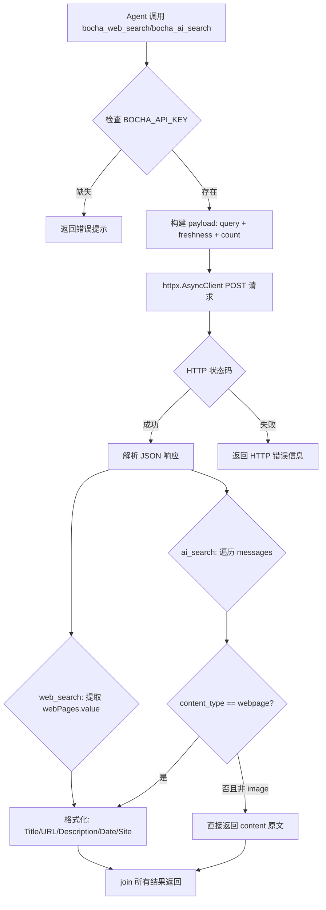
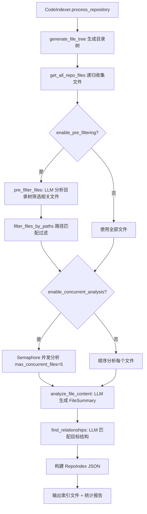
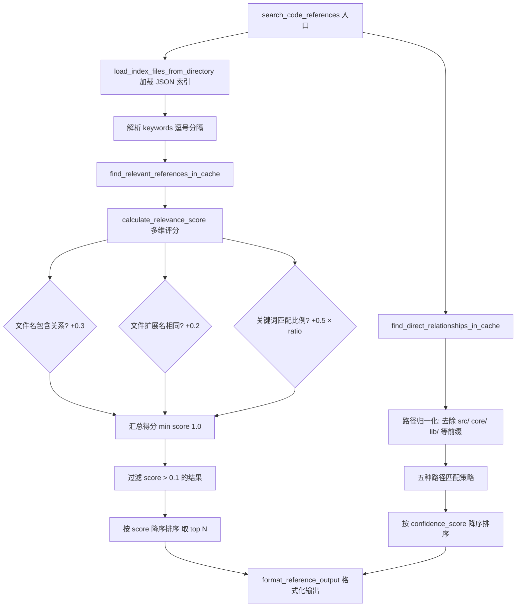

# PD-08.06 DeepCode — MCP 双搜索引擎与 LLM 驱动代码索引

> 文档编号：PD-08.06
> 来源：DeepCode `tools/bocha_search_server.py`, `tools/code_indexer.py`, `tools/code_reference_indexer.py`
> GitHub：https://github.com/HKUDS/DeepCode.git
> 问题域：PD-08 搜索与检索 Search & Retrieval
> 状态：可复用方案

---

## 第 1 章 问题与动机

### 1.1 核心问题

AI 编程 Agent 在复现论文代码时面临两类搜索需求：

1. **Web 搜索**：查找算法原理、API 文档、最佳实践等外部知识，且需要同时覆盖中英文搜索场景
2. **代码参考搜索**：从已有代码库中找到与目标文件功能相关的参考实现，提供可复用的代码片段和设计模式

传统方案要么只支持单一搜索源（如仅 Brave），要么代码搜索依赖简单的文本匹配（如 grep），无法理解代码语义。DeepCode 需要一个既能覆盖多语言 Web 搜索、又能进行语义级代码参考检索的统一搜索体系。

### 1.2 DeepCode 的解法概述

DeepCode 采用 **MCP Server 化的双搜索引擎 + LLM 驱动的代码索引** 三层架构：

1. **Bocha 中文 AI 搜索 MCP Server**（`tools/bocha_search_server.py:13-39`）：FastMCP 封装，提供 `bocha_web_search` 和 `bocha_ai_search` 两种模式，后者支持语义理解和垂直领域结构化卡片
2. **Brave 搜索 MCP Server**（`mcp_agent.config.yaml:27-40`）：通过 npx 启动标准 MCP 协议的 Brave Search，覆盖英文搜索场景
3. **LLM 驱动代码索引器**（`tools/code_indexer.py:68-250`）：用 LLM 分析代码文件语义，构建 JSON 索引，支持四级置信度关系匹配
4. **代码参考检索 MCP Server**（`tools/code_reference_indexer.py:34`）：从预构建索引中搜索相关代码参考，基于文件路径 + 关键词的多维度相关性评分
5. **多 LLM 提供商自动切换**（`utils/llm_utils.py:109-171`）：Anthropic/OpenAI/Google 三选一，配置优先 + API Key 可用性降级

### 1.3 设计思想

| 设计原则 | 具体实现 | 理由 | 替代方案 |
|----------|----------|------|----------|
| MCP 协议统一工具接口 | 所有搜索能力封装为 MCP Server | Agent 通过统一协议调用，无需关心底层实现 | 直接 HTTP 调用各 API |
| 双引擎语言感知 | Bocha 覆盖中文 + Brave 覆盖英文 | 中文搜索引擎对中文内容质量更高 | 仅用 Google/Bing 单引擎 |
| LLM 语义索引 | 用 LLM 分析代码文件生成结构化摘要 | 超越关键词匹配，理解代码功能语义 | 基于 AST 的静态分析 |
| 四级关系置信度 | direct_match/partial_match/reference/utility | 区分不同程度的代码相关性 | 二元匹配（相关/不相关） |
| 配置驱动 | YAML 配置文件控制所有参数 | 不改代码即可调整行为 | 硬编码参数 |

---

## 第 2 章 源码实现分析

### 2.1 架构概览

DeepCode 的搜索与检索体系由三个独立的 MCP Server 和一个离线索引构建器组成：

```
┌─────────────────────────────────────────────────────────────────┐
│                        MCP Agent (编排层)                        │
│                   mcp_agent.config.yaml 配置                     │
├─────────┬──────────────┬──────────────────┬─────────────────────┤
│         │              │                  │                     │
│  ┌──────▼──────┐ ┌─────▼──────┐ ┌────────▼────────┐ ┌─────────▼──────┐
│  │ bocha-mcp   │ │   brave    │ │ code-reference  │ │  filesystem    │
│  │ (FastMCP)   │ │ (npx MCP)  │ │   -indexer      │ │  (npx MCP)     │
│  │             │ │            │ │   (FastMCP)     │ │                │
│  │ web_search  │ │ brave_     │ │ search_code_    │ │ read/write     │
│  │ ai_search   │ │ search     │ │ references      │ │ files          │
│  └──────┬──────┘ └─────┬──────┘ └────────┬────────┘ └────────────────┘
│         │              │                  │
│    Bocha API      Brave API        JSON 索引文件
│  (中文 AI 搜索)   (英文搜索)     (CodeIndexer 预构建)
│                                          ▲
│                                          │
│                               ┌──────────┴──────────┐
│                               │   CodeIndexer       │
│                               │   (离线构建)         │
│                               │   LLM 分析 → JSON   │
│                               └─────────────────────┘
└─────────────────────────────────────────────────────────────────┘
```

### 2.2 核心实现

#### 2.2.1 Bocha 搜索 MCP Server



对应源码 `tools/bocha_search_server.py:42-111`：

```python
@server.tool()
async def bocha_web_search(
    query: str, freshness: str = "noLimit", count: int = 10
) -> str:
    boch_api_key = os.environ.get("BOCHA_API_KEY", "")
    if not boch_api_key:
        return "Error: Bocha API key is not configured..."

    endpoint = "https://api.bochaai.com/v1/web-search?utm_source=bocha-mcp-local"
    payload = {"query": query, "summary": True, "freshness": freshness, "count": count}
    headers = {"Authorization": f"Bearer {boch_api_key}", "Content-Type": "application/json"}

    async with httpx.AsyncClient() as client:
        response = await client.post(endpoint, headers=headers, json=payload, timeout=10.0)
        response.raise_for_status()
        resp = response.json()
        if "data" not in resp:
            return "Search error."
        results = []
        for result in resp["data"]["webPages"]["value"]:
            results.append(
                f"Title: {result['name']}\nURL: {result['url']}\n"
                f"Description: {result['summary']}\nPublished date: {result['datePublished']}\n"
                f"Site name: {result['siteName']}"
            )
        return "\n\n".join(results)
```

关键设计点：
- `web_search` 返回传统搜索结果（标题/URL/摘要/日期/站点名）
- `ai_search`（`tools/bocha_search_server.py:114-195`）额外支持语义理解，返回结构化垂直领域卡片（天气、新闻、百科等）
- `ai_search` 通过 `messages` 数组遍历，区分 `webpage` 和其他 `content_type`，跳过 `image` 类型
- 统一 10 秒超时，三层异常捕获：`HTTPStatusError` → `RequestError` → `Exception`

#### 2.2.2 LLM 驱动代码索引器



对应源码 `tools/code_indexer.py:30-66`（核心数据结构）：

```python
@dataclass
class FileRelationship:
    """代码文件与目标结构文件之间的关系"""
    repo_file_path: str
    target_file_path: str
    relationship_type: str  # 'direct_match', 'partial_match', 'reference', 'utility'
    confidence_score: float  # 0.0 to 1.0
    helpful_aspects: List[str]
    potential_contributions: List[str]
    usage_suggestions: str

@dataclass
class FileSummary:
    """仓库文件的结构化摘要"""
    file_path: str
    file_type: str
    main_functions: List[str]
    key_concepts: List[str]
    dependencies: List[str]
    summary: str
    lines_of_code: int
    last_modified: str

@dataclass
class RepoIndex:
    """完整的仓库索引"""
    repo_name: str
    total_files: int
    file_summaries: List[FileSummary]
    relationships: List[FileRelationship]
    analysis_metadata: Dict[str, Any]
```

LLM 调用的重试机制（`tools/code_indexer.py:383-466`）：

```python
async def _call_llm(self, prompt: str, system_prompt=None, max_tokens=None) -> str:
    for attempt in range(self.max_retries):  # 默认 3 次
        try:
            client, client_type = await self._initialize_llm_client()
            if client_type == "anthropic":
                response = await client.messages.create(
                    model=self.default_models["anthropic"],
                    system=system_prompt,
                    messages=[{"role": "user", "content": prompt}],
                    max_tokens=max_tokens, temperature=self.llm_temperature,
                )
                # ... 提取 text content
            elif client_type == "openai":
                # ... OpenAI 调用
        except Exception as e:
            last_error = e
            if attempt < self.max_retries - 1:
                await asyncio.sleep(self.retry_delay * (attempt + 1))  # 线性退避
    return f"Error in LLM analysis: {error_msg}"
```

#### 2.2.3 代码参考检索的相关性评分



对应源码 `tools/code_reference_indexer.py:132-173`：

```python
def calculate_relevance_score(
    target_file: str, reference: CodeReference, keywords: List[str] = None
) -> float:
    score = 0.0
    target_name = Path(target_file).stem.lower()
    ref_name = Path(reference.file_path).stem.lower()

    # 文件名相似度 (权重 0.3)
    if target_name in ref_name or ref_name in target_name:
        score += 0.3

    # 文件类型匹配 (权重 0.2)
    if Path(target_file).suffix == Path(reference.file_path).suffix:
        score += 0.2

    # 关键词匹配 (权重 0.5)
    if keywords:
        total_searchable_text = (
            " ".join(reference.key_concepts) + " " +
            " ".join(reference.main_functions) + " " +
            reference.summary + " " + reference.file_type
        ).lower()
        keyword_matches = sum(1 for kw in keywords if kw.lower() in total_searchable_text)
        score += (keyword_matches / len(keywords)) * 0.5

    return min(score, 1.0)
```

### 2.3 实现细节

**多 LLM 提供商自动选择**（`utils/llm_utils.py:109-171`）：

优先级链：用户配置偏好 → API Key 可用性 → 默认 Google。支持三个提供商（Anthropic/OpenAI/Google），每个提供商可配置独立的 planning_model 和 implementation_model，实现阶段性模型分离。

**并发控制**（`tools/code_indexer.py:1070-1187`）：

使用 `asyncio.Semaphore(max_concurrent_files)` 限制并发数（默认 5），并发失败时自动降级为顺序处理。finally 块中强制取消未完成任务并触发 GC。

**四级关系类型权重**（`tools/indexer_config.yaml:89-94`）：

```yaml
relationship_types:
  direct_match: 1.0      # 直接实现匹配
  partial_match: 0.8     # 部分功能匹配
  reference: 0.6         # 参考或工具函数
  utility: 0.4           # 通用工具或辅助
```

**路径归一化**（`tools/code_reference_indexer.py:198-236`）：

去除 `src/`、`core/`、`lib/`、`main/`、`./` 等常见前缀后进行五种匹配：精确匹配、包含匹配（双向）、原始路径包含匹配（双向），确保跨项目路径差异不影响检索。

---

## 第 3 章 迁移指南

### 3.1 迁移清单

**阶段一：MCP 搜索引擎集成**

- [ ] 安装 FastMCP 依赖：`pip install mcp httpx`
- [ ] 创建搜索 MCP Server，注册 `@server.tool()` 装饰的搜索函数
- [ ] 配置 `mcp_agent.config.yaml` 注册 MCP Server
- [ ] 申请搜索 API Key（Bocha / Brave / 其他）
- [ ] 实现 freshness 时间范围过滤参数

**阶段二：LLM 代码索引构建**

- [ ] 定义 `FileRelationship`、`FileSummary`、`RepoIndex` 数据结构
- [ ] 实现文件遍历 + 扩展名过滤 + 目录跳过
- [ ] 实现 LLM 预过滤（可选，减少分析文件数）
- [ ] 实现 LLM 文件分析 → JSON 摘要
- [ ] 实现 LLM 关系匹配 → 四级置信度
- [ ] 配置并发控制（Semaphore）和重试机制

**阶段三：代码参考检索 MCP Server**

- [ ] 实现 JSON 索引加载和缓存
- [ ] 实现多维度相关性评分（文件名 + 类型 + 关键词）
- [ ] 实现路径归一化和灵活匹配
- [ ] 封装为 MCP Server 供 Agent 调用

### 3.2 适配代码模板

以下是一个可直接运行的简化版搜索 MCP Server 模板：

```python
"""可复用的搜索 MCP Server 模板"""
import os
import httpx
from mcp.server.fastmcp import FastMCP

server = FastMCP("my-search-mcp")

@server.tool()
async def web_search(query: str, count: int = 10) -> str:
    """通用 Web 搜索工具"""
    api_key = os.environ.get("SEARCH_API_KEY", "")
    if not api_key:
        return "Error: SEARCH_API_KEY not configured"

    # 替换为你的搜索 API endpoint
    endpoint = "https://api.your-search.com/v1/search"
    payload = {"query": query, "count": count}
    headers = {"Authorization": f"Bearer {api_key}", "Content-Type": "application/json"}

    try:
        async with httpx.AsyncClient() as client:
            response = await client.post(
                endpoint, headers=headers, json=payload, timeout=10.0
            )
            response.raise_for_status()
            data = response.json()

            results = []
            for item in data.get("results", []):
                results.append(
                    f"Title: {item.get('title', '')}\n"
                    f"URL: {item.get('url', '')}\n"
                    f"Description: {item.get('description', '')}"
                )
            return "\n\n".join(results) if results else "No results found."

    except httpx.HTTPStatusError as e:
        return f"HTTP error: {e.response.status_code}"
    except httpx.RequestError as e:
        return f"Request error: {str(e)}"
    except Exception as e:
        return f"Unexpected error: {str(e)}"

if __name__ == "__main__":
    server.run(transport="stdio")
```

以下是简化版代码相关性评分模板：

```python
"""可复用的代码相关性评分模板"""
from pathlib import Path
from typing import List, Tuple
from dataclasses import dataclass

@dataclass
class CodeRef:
    file_path: str
    main_functions: List[str]
    key_concepts: List[str]
    summary: str

def calculate_relevance(
    target: str, ref: CodeRef, keywords: List[str] = None
) -> float:
    score = 0.0
    t_name = Path(target).stem.lower()
    r_name = Path(ref.file_path).stem.lower()

    # 文件名相似度
    if t_name in r_name or r_name in t_name:
        score += 0.3

    # 扩展名匹配
    if Path(target).suffix == Path(ref.file_path).suffix:
        score += 0.2

    # 关键词匹配
    if keywords:
        searchable = " ".join(ref.key_concepts + ref.main_functions + [ref.summary]).lower()
        matches = sum(1 for kw in keywords if kw.lower() in searchable)
        score += (matches / len(keywords)) * 0.5

    return min(score, 1.0)

def search_references(
    target: str, refs: List[CodeRef], keywords: List[str] = None, top_k: int = 10
) -> List[Tuple[CodeRef, float]]:
    scored = [(ref, calculate_relevance(target, ref, keywords)) for ref in refs]
    scored = [(ref, s) for ref, s in scored if s > 0.1]
    scored.sort(key=lambda x: x[1], reverse=True)
    return scored[:top_k]
```

### 3.3 适用场景

| 场景 | 适用度 | 说明 |
|------|--------|------|
| AI 编程 Agent 需要 Web 搜索 | ⭐⭐⭐ | MCP Server 封装搜索 API，Agent 通过统一协议调用 |
| 论文代码复现需要参考实现 | ⭐⭐⭐ | LLM 索引器理解代码语义，比 grep 更精准 |
| 中英文双语搜索场景 | ⭐⭐⭐ | Bocha + Brave 双引擎覆盖 |
| 大型代码库的代码搜索 | ⭐⭐ | 需要预构建索引，适合离线分析场景 |
| 实时代码搜索（IDE 集成） | ⭐ | LLM 索引构建耗时较长，不适合实时场景 |

---

## 第 4 章 测试用例

```python
import pytest
from pathlib import Path
from dataclasses import dataclass
from typing import List

# ---- 被测函数（从 code_reference_indexer.py 提取） ----

@dataclass
class CodeReference:
    file_path: str
    file_type: str
    main_functions: List[str]
    key_concepts: List[str]
    dependencies: List[str]
    summary: str
    lines_of_code: int
    repo_name: str
    confidence_score: float = 0.0

def calculate_relevance_score(target_file, reference, keywords=None):
    score = 0.0
    target_name = Path(target_file).stem.lower()
    ref_name = Path(reference.file_path).stem.lower()
    if target_name in ref_name or ref_name in target_name:
        score += 0.3
    if Path(target_file).suffix == Path(reference.file_path).suffix:
        score += 0.2
    if keywords:
        text = (" ".join(reference.key_concepts) + " " +
                " ".join(reference.main_functions) + " " +
                reference.summary + " " + reference.file_type).lower()
        matches = sum(1 for kw in keywords if kw.lower() in text)
        score += (matches / len(keywords)) * 0.5
    return min(score, 1.0)


class TestRelevanceScoring:
    """测试代码相关性评分"""

    def _make_ref(self, path="src/gcn.py", funcs=None, concepts=None, summary=""):
        return CodeReference(
            file_path=path, file_type="Python module",
            main_functions=funcs or [], key_concepts=concepts or [],
            dependencies=[], summary=summary, lines_of_code=100, repo_name="test"
        )

    def test_exact_name_match(self):
        """文件名完全包含时得分 >= 0.3"""
        ref = self._make_ref("src/gcn.py")
        score = calculate_relevance_score("core/gcn.py", ref)
        assert score >= 0.3

    def test_extension_match(self):
        """扩展名相同时得分 >= 0.2"""
        ref = self._make_ref("src/model.py")
        score = calculate_relevance_score("lib/trainer.py", ref)
        assert score >= 0.2

    def test_keyword_full_match(self):
        """所有关键词匹配时得分接近 0.5"""
        ref = self._make_ref(
            concepts=["diffusion", "denoiser"],
            summary="diffusion model with denoiser"
        )
        score = calculate_relevance_score(
            "other.txt", ref, keywords=["diffusion", "denoiser"]
        )
        assert score >= 0.45

    def test_no_match_returns_zero(self):
        """完全不相关时得分为 0"""
        ref = self._make_ref("readme.md", summary="documentation")
        score = calculate_relevance_score("src/model.py", ref)
        assert score == 0.0

    def test_score_capped_at_one(self):
        """得分不超过 1.0"""
        ref = self._make_ref(
            "src/gcn.py",
            funcs=["train", "eval"],
            concepts=["gcn", "graph"],
            summary="gcn graph neural network"
        )
        score = calculate_relevance_score(
            "core/gcn.py", ref, keywords=["gcn", "graph"]
        )
        assert score <= 1.0

    def test_partial_keyword_match(self):
        """部分关键词匹配时得分按比例计算"""
        ref = self._make_ref(concepts=["diffusion"], summary="diffusion model")
        score = calculate_relevance_score(
            "other.txt", ref, keywords=["diffusion", "transformer", "attention"]
        )
        # 1/3 关键词匹配 → 0.5 * (1/3) ≈ 0.167
        assert 0.1 < score < 0.3

    def test_path_normalization_in_relationships(self):
        """路径归一化：去除常见前缀后匹配"""
        common_prefixes = ["src/", "core/", "lib/", "main/", "./"]
        target = "src/models/gcn.py"
        normalized = target.strip("/")
        for prefix in common_prefixes:
            if normalized.startswith(prefix):
                normalized = normalized[len(prefix):]
                break
        assert normalized == "models/gcn.py"
```

---

## 第 5 章 跨域关联

| 关联域 | 关系类型 | 说明 |
|--------|----------|------|
| PD-04 工具系统 | 依赖 | 所有搜索能力通过 MCP Server 暴露，依赖 FastMCP 工具注册机制（`@server.tool()` 装饰器） |
| PD-03 容错与重试 | 协同 | CodeIndexer 的 `_call_llm` 实现了 max_retries + 线性退避重试；并发分析失败时自动降级为顺序处理 |
| PD-11 可观测性 | 协同 | CodeIndexer 内置 logging 模块，支持 verbose_output 和 save_raw_responses 调试模式 |
| PD-01 上下文管理 | 协同 | `max_content_length=3000` 截断文件内容避免 LLM 上下文溢出；文档分段配置 `size_threshold_chars=50000` |
| PD-06 记忆持久化 | 协同 | 代码索引以 JSON 文件持久化，`RepoIndex` 包含完整的 `analysis_metadata` 元数据 |
| PD-09 Human-in-the-Loop | 协同 | CodebaseIndexWorkflow 支持从 `initial_plan.txt` 加载人工编写的目标结构，引导索引构建方向 |

---

## 第 6 章 来源文件索引

| 文件 | 行范围 | 关键实现 |
|------|--------|----------|
| `tools/bocha_search_server.py` | L1-L220 | Bocha 搜索 MCP Server：web_search + ai_search 双模式 |
| `tools/bocha_search_server.py` | L42-L111 | `bocha_web_search`：传统 Web 搜索，返回标题/URL/摘要/日期 |
| `tools/bocha_search_server.py` | L114-L195 | `bocha_ai_search`：语义搜索，支持垂直领域结构化卡片 |
| `tools/code_indexer.py` | L30-L66 | 核心数据结构：FileRelationship、FileSummary、RepoIndex |
| `tools/code_indexer.py` | L68-L250 | CodeIndexer 初始化：配置加载、LLM 参数、关系类型权重 |
| `tools/code_indexer.py` | L383-L466 | `_call_llm`：多提供商 LLM 调用 + 重试机制 |
| `tools/code_indexer.py` | L617-L697 | `pre_filter_files`：LLM 预过滤相关文件 |
| `tools/code_indexer.py` | L753-L863 | `analyze_file_content`：LLM 文件分析生成 FileSummary |
| `tools/code_indexer.py` | L865-L949 | `find_relationships`：LLM 关系匹配 + 四级置信度 |
| `tools/code_indexer.py` | L966-L1048 | `process_repository`：完整仓库处理流水线 |
| `tools/code_indexer.py` | L1070-L1187 | `_process_files_concurrently`：Semaphore 并发 + 降级 |
| `tools/code_reference_indexer.py` | L37-L49 | CodeReference 数据结构 |
| `tools/code_reference_indexer.py` | L132-L173 | `calculate_relevance_score`：三维度相关性评分 |
| `tools/code_reference_indexer.py` | L175-L196 | `find_relevant_references_in_cache`：索引搜索 |
| `tools/code_reference_indexer.py` | L198-L236 | `find_direct_relationships_in_cache`：路径归一化匹配 |
| `tools/code_reference_indexer.py` | L334-L408 | `search_code_references`：统一 MCP 工具入口 |
| `utils/llm_utils.py` | L109-L171 | `get_preferred_llm_class`：多提供商优先级选择 |
| `utils/llm_utils.py` | L214-L293 | `get_default_models`：阶段性模型配置 |
| `workflows/codebase_index_workflow.py` | L30-L42 | CodebaseIndexWorkflow 编排类 |
| `workflows/codebase_index_workflow.py` | L406-L662 | `run_indexing_workflow`：完整索引工作流 |
| `mcp_agent.config.yaml` | L18-L74 | MCP Server 注册配置（bocha/brave/code-reference-indexer） |
| `tools/indexer_config.yaml` | L1-L142 | CodeIndexer 完整配置（文件分析/LLM/关系/性能/调试） |

---

## 第 7 章 横向对比维度

```json comparison_data
{
  "project": "DeepCode",
  "dimensions": {
    "搜索架构": "MCP Server 化双引擎：Bocha 中文 AI 搜索 + Brave 英文搜索 + LLM 代码索引",
    "去重机制": "无显式去重，依赖 LLM 预过滤减少冗余文件分析",
    "结果处理": "三维度评分（文件名0.3+类型0.2+关键词0.5）排序",
    "容错策略": "三层异常捕获 + LLM 重试线性退避 + 并发降级顺序",
    "成本控制": "LLM 预过滤减少分析文件数 + max_content_length 截断",
    "检索方式": "离线 LLM 索引构建 + 运行时多维评分检索",
    "索引结构": "JSON 文件存储 FileSummary + FileRelationship 双层结构",
    "排序策略": "relevance_score 多维加权 + confidence_score 降序",
    "缓存机制": "可选 FIFO 内容缓存 + 文件 mtime+size 缓存键",
    "扩展性": "MCP 协议标准化，新搜索源只需注册新 Server",
    "解析容错": "JSON 解析失败回退基础分析 + mock 模式测试",
    "多模态支持": "ai_search 跳过 image 类型，仅处理文本和结构化数据",
    "专家知识集成": "target_structure 注入目标项目结构引导 LLM 分析方向"
  }
}
```

### 域元数据补充

```json domain_metadata
{
  "solution_summary": "DeepCode 用 MCP Server 封装 Bocha 中文 AI 搜索 + Brave 英文搜索双引擎，配合 LLM 驱动的代码索引器构建四级置信度关系图谱，实现语义级代码参考检索",
  "description": "MCP 协议标准化搜索工具注册，实现搜索引擎即插即用",
  "sub_problems": [
    "代码语义索引：如何用 LLM 理解代码功能并构建可检索的结构化索引",
    "离线索引与在线检索分离：如何平衡索引构建成本与检索实时性"
  ],
  "best_practices": [
    "MCP Server 封装搜索 API 实现协议标准化：新搜索源只需注册 Server 无需改 Agent 代码",
    "LLM 预过滤减少无关文件分析：先用目录树让 LLM 筛选再逐文件深度分析，节省 70%+ API 调用"
  ]
}
```
