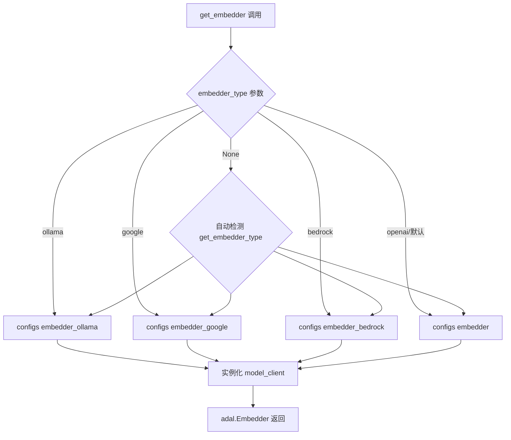
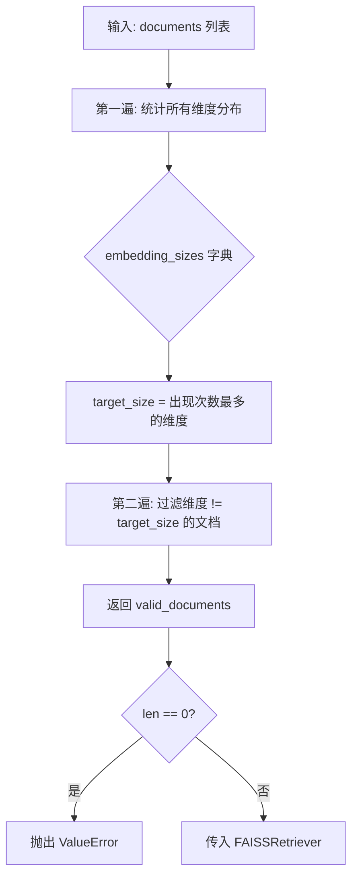

# PD-08.06 DeepWiki — RAG 流水线与多 Embedder 向量检索

> 文档编号：PD-08.06
> 来源：DeepWiki `api/rag.py`, `api/data_pipeline.py`, `api/tools/embedder.py`
> GitHub：https://github.com/AsyncFuncAI/deepwiki-open.git
> 问题域：PD-08 搜索与检索 Search & Retrieval
> 状态：可复用方案

---

## 第 1 章 问题与动机

### 1.1 核心问题

代码仓库的知识检索面临三个核心挑战：

1. **代码文件异构性**：一个仓库包含 `.py`、`.js`、`.md`、`.yaml` 等多种文件类型，token 长度差异巨大（从几十行到上万行），需要统一的分块策略
2. **嵌入后端碎片化**：用户可能使用 OpenAI、Google、Ollama（本地）、AWS Bedrock 等不同的嵌入服务，每种服务的 API 协议、批处理能力、输出维度都不同
3. **向量维度一致性**：不同嵌入后端输出维度不同（OpenAI 256d、Ollama 768d、Google 768d），混用或切换后端时 FAISS 索引要求所有向量维度一致，否则直接崩溃

DeepWiki 作为一个"给任意 Git 仓库生成 Wiki"的工具，必须在用户提问时从整个仓库中检索最相关的代码片段，注入到 LLM prompt 中生成回答。

### 1.2 DeepWiki 的解法概述

DeepWiki 构建了一条基于 AdalFlow 框架的完整 RAG 流水线：

1. **文档读取与过滤**：递归扫描仓库，按代码/文档分类，支持 inclusion/exclusion 双模式过滤（`api/data_pipeline.py:153-380`）
2. **TextSplitter 分块**：按 word 粒度切分，350 word/chunk，100 word overlap，确保代码上下文连贯（`api/config/embedder.json:36-40`）
3. **多 Embedder 适配**：统一 `get_embedder()` 工厂函数，通过环境变量 `DEEPWIKI_EMBEDDER_TYPE` 切换 OpenAI/Google/Ollama/Bedrock 四种后端（`api/tools/embedder.py:6-58`）
4. **嵌入维度校验**：两遍扫描法——第一遍统计所有向量维度分布，第二遍过滤掉与众数不一致的文档（`api/rag.py:251-343`）
5. **FAISS 检索**：top_k=20 的向量近邻检索，检索结果按文件路径分组后注入 prompt（`api/rag.py:385-391`）

### 1.3 设计思想

| 设计原则 | 具体实现 | 理由 | 替代方案 |
|----------|----------|------|----------|
| 嵌入后端可插拔 | 环境变量 `DEEPWIKI_EMBEDDER_TYPE` + 工厂函数 `get_embedder()` | 用户部署环境差异大，有人用云 API 有人用本地 Ollama | 硬编码单一后端 |
| 防御性向量校验 | 两遍扫描过滤不一致维度的文档 | Ollama 等本地模型偶尔返回异常维度向量，不过滤会导致 FAISS 崩溃 | 信任所有向量，出错再重试 |
| 代码优先索引 | 先扫描 16 种代码扩展名，再扫描 6 种文档扩展名 | 代码仓库的核心价值在代码文件，文档是辅助 | 不区分优先级 |
| token 预算控制 | 代码文件 > 81920 token 跳过，文档文件 > 8192 token 跳过 | 防止单个巨型文件耗尽嵌入 API 配额 | 截断而非跳过 |
| 上下文降级 | token 超限时去掉 RAG 上下文，仅用 system prompt 回答 | 宁可回答质量下降，不可请求失败 | 返回错误 |

---

## 第 2 章 源码实现分析

### 2.1 架构概览

DeepWiki 的 RAG 流水线是一个经典的 Indexing → Retrieval → Generation 三阶段架构，基于 AdalFlow 框架构建：

```
┌─────────────────────────────────────────────────────────────────┐
│                    DeepWiki RAG Pipeline                        │
│                                                                 │
│  ┌──────────┐   ┌───────────┐   ┌───────────┐   ┌───────────┐ │
│  │ Git Repo │──→│ read_all_ │──→│ TextSplit- │──→│ ToEmbed-  │ │
│  │ (clone)  │   │ documents │   │ ter(350w)  │   │ dings     │ │
│  └──────────┘   └───────────┘   └───────────┘   └───────────┘ │
│                       │                               │         │
│                       │ Document[]                     │ vector  │
│                       ▼                               ▼         │
│              ┌──────────────┐              ┌──────────────────┐ │
│              │ LocalDB      │              │ _validate_and_   │ │
│              │ (.pkl 持久化) │◄─────────────│ filter_embeddings│ │
│              └──────────────┘              └──────────────────┘ │
│                       │                                         │
│                       ▼                                         │
│              ┌──────────────┐   ┌───────────┐   ┌───────────┐ │
│              │ FAISSRetrie- │──→│ Context   │──→│ LLM Gen-  │ │
│              │ ver(top_k=20)│   │ Injection │   │ erator    │ │
│              └──────────────┘   └───────────┘   └───────────┘ │
└─────────────────────────────────────────────────────────────────┘
```

关键组件关系：
- `DatabaseManager`（`data_pipeline.py:712`）负责仓库下载、文档读取、索引构建的全生命周期
- `RAG`（`rag.py:153`）是面向用户的入口，组合了 Memory、Embedder、FAISSRetriever、Generator
- `get_embedder()`（`embedder.py:6`）是嵌入后端的工厂函数，根据配置返回不同的 `adal.Embedder` 实例

### 2.2 核心实现

#### 2.2.1 多 Embedder 工厂与适配



对应源码 `api/tools/embedder.py:6-58`：

```python
def get_embedder(is_local_ollama: bool = False, use_google_embedder: bool = False, embedder_type: str = None) -> adal.Embedder:
    # Determine which embedder config to use
    if embedder_type:
        if embedder_type == 'ollama':
            embedder_config = configs["embedder_ollama"]
        elif embedder_type == 'google':
            embedder_config = configs["embedder_google"]
        elif embedder_type == 'bedrock':
            embedder_config = configs["embedder_bedrock"]
        else:  # default to openai
            embedder_config = configs["embedder"]
    elif is_local_ollama:
        embedder_config = configs["embedder_ollama"]
    elif use_google_embedder:
        embedder_config = configs["embedder_google"]
    else:
        current_type = get_embedder_type()
        # ... auto-detect logic
    
    model_client_class = embedder_config["model_client"]
    if "initialize_kwargs" in embedder_config:
        model_client = model_client_class(**embedder_config["initialize_kwargs"])
    else:
        model_client = model_client_class()
    
    embedder = adal.Embedder(model_client=model_client, model_kwargs=embedder_config["model_kwargs"])
    if "batch_size" in embedder_config:
        embedder.batch_size = embedder_config["batch_size"]
    return embedder
```

四种后端的配置差异（`api/config/embedder.json`）：

| 后端 | 模型 | 维度 | 批大小 | 特殊处理 |
|------|------|------|--------|----------|
| OpenAI | text-embedding-3-small | 256 | 500 | 标准批处理 |
| Google | gemini-embedding-001 | 自动 | 100 | task_type=SEMANTIC_SIMILARITY |
| Ollama | nomic-embed-text | 768 | 1（逐条） | OllamaDocumentProcessor 单条处理 |
| Bedrock | amazon.titan-embed-text-v2:0 | 256 | 100 | AWS 凭证链 |

#### 2.2.2 嵌入维度校验（两遍扫描法）



对应源码 `api/rag.py:251-343`：

```python
def _validate_and_filter_embeddings(self, documents: List) -> List:
    valid_documents = []
    embedding_sizes = {}

    # First pass: collect all embedding sizes and count occurrences
    for i, doc in enumerate(documents):
        if not hasattr(doc, 'vector') or doc.vector is None:
            continue
        try:
            if isinstance(doc.vector, list):
                embedding_size = len(doc.vector)
            elif hasattr(doc.vector, 'shape'):
                embedding_size = doc.vector.shape[0] if len(doc.vector.shape) == 1 else doc.vector.shape[-1]
            elif hasattr(doc.vector, '__len__'):
                embedding_size = len(doc.vector)
            else:
                continue
            if embedding_size == 0:
                continue
            embedding_sizes[embedding_size] = embedding_sizes.get(embedding_size, 0) + 1
        except Exception:
            continue

    # Find the most common embedding size
    target_size = max(embedding_sizes.keys(), key=lambda k: embedding_sizes[k])

    # Second pass: filter documents with the target embedding size
    for i, doc in enumerate(documents):
        # ... same dimension extraction logic ...
        if embedding_size == target_size:
            valid_documents.append(doc)
    
    return valid_documents
```

### 2.3 实现细节

#### 数据流水线组装

`prepare_data_pipeline()` 函数（`data_pipeline.py:382-424`）将 TextSplitter 和 Embedder 组装成 `adal.Sequential` 管道：

```python
def prepare_data_pipeline(embedder_type: str = None):
    splitter = TextSplitter(**configs["text_splitter"])  # split_by="word", chunk_size=350, chunk_overlap=100
    embedder = get_embedder(embedder_type=embedder_type)
    
    if embedder_type == 'ollama':
        embedder_transformer = OllamaDocumentProcessor(embedder=embedder)  # 逐条处理
    else:
        batch_size = embedder_config.get("batch_size", 500)
        embedder_transformer = ToEmbeddings(embedder=embedder, batch_size=batch_size)  # 批处理
    
    data_transformer = adal.Sequential(splitter, embedder_transformer)
    return data_transformer
```

Ollama 的特殊处理（`ollama_patch.py:62-105`）：由于 Ollama 客户端不支持批量嵌入，`OllamaDocumentProcessor` 逐条处理每个文档，并在处理过程中实时校验维度一致性：

```python
class OllamaDocumentProcessor(DataComponent):
    def __call__(self, documents: Sequence[Document]) -> Sequence[Document]:
        expected_embedding_size = None
        for i, doc in enumerate(tqdm(output)):
            result = self.embedder(input=doc.text)
            embedding = result.data[0].embedding
            if expected_embedding_size is None:
                expected_embedding_size = len(embedding)
            elif len(embedding) != expected_embedding_size:
                continue  # 跳过维度不一致的文档
            output[i].vector = embedding
```

#### 检索结果注入 Prompt

检索到的文档在 `simple_chat.py:206-229` 中按文件路径分组后注入 prompt：

```python
# Group documents by file path
docs_by_file = {}
for doc in documents:
    file_path = doc.meta_data.get('file_path', 'unknown')
    if file_path not in docs_by_file:
        docs_by_file[file_path] = []
    docs_by_file[file_path].append(doc)

# Format context text with file path grouping
for file_path, docs in docs_by_file.items():
    header = f"## File Path: {file_path}\n\n"
    content = "\n\n".join([doc.text for doc in docs])
    context_parts.append(f"{header}{content}")
```

#### 数据库持久化与缓存

`DatabaseManager.prepare_db_index()`（`data_pipeline.py:831-913`）实现了索引缓存逻辑：
- 首次访问：读取文件 → 分块 → 嵌入 → 保存为 `.pkl`
- 再次访问：直接加载 `.pkl`，校验嵌入是否有效（非空且维度一致）
- 嵌入全部无效时：自动重建索引


---

## 第 3 章 迁移指南

### 3.1 迁移清单

**阶段 1：基础 RAG 管道（最小可用）**
- [ ] 安装依赖：`adalflow`、`faiss-cpu`、`tiktoken`
- [ ] 实现文档读取器：递归扫描目录，按文件类型分类
- [ ] 配置 TextSplitter：`split_by="word"`, `chunk_size=350`, `chunk_overlap=100`
- [ ] 接入一种 Embedder（推荐 OpenAI text-embedding-3-small）
- [ ] 构建 FAISS 索引并实现 top_k 检索

**阶段 2：多后端适配**
- [ ] 抽象 Embedder 工厂函数，支持环境变量切换
- [ ] 为 Ollama 实现单条处理适配器
- [ ] 实现嵌入维度校验（两遍扫描法）
- [ ] 添加 Google/Bedrock 后端配置

**阶段 3：生产加固**
- [ ] 实现 LocalDB 持久化（pickle 序列化）
- [ ] 添加 token 预算控制（大文件跳过）
- [ ] 实现上下文降级（token 超限时去掉 RAG 上下文）
- [ ] 添加文件过滤（inclusion/exclusion 双模式）

### 3.2 适配代码模板

以下是一个可直接运行的最小 RAG 管道模板，基于 DeepWiki 的核心设计：

```python
"""Minimal RAG pipeline inspired by DeepWiki's architecture."""
import os
import glob
from dataclasses import dataclass, field
from typing import List, Optional, Dict, Tuple

import tiktoken
import numpy as np

# --- Configuration ---
RAG_CONFIG = {
    "text_splitter": {"split_by": "word", "chunk_size": 350, "chunk_overlap": 100},
    "retriever": {"top_k": 20},
    "embedder_type": os.environ.get("EMBEDDER_TYPE", "openai"),
    "max_embedding_tokens": 8192,
}

CODE_EXTENSIONS = [".py", ".js", ".ts", ".java", ".go", ".rs", ".cpp", ".c"]
DOC_EXTENSIONS = [".md", ".txt", ".rst", ".yaml", ".yml", ".json"]

@dataclass
class Document:
    text: str
    meta_data: Dict
    vector: Optional[List[float]] = None

# --- Step 1: Document Reader ---
def read_all_documents(path: str, excluded_dirs: List[str] = None) -> List[Document]:
    """Recursively read code and doc files, code-first priority."""
    documents = []
    excluded = set(excluded_dirs or [".git", "node_modules", "__pycache__", ".venv"])
    encoding = tiktoken.encoding_for_model("text-embedding-3-small")
    
    for extensions, is_code in [(CODE_EXTENSIONS, True), (DOC_EXTENSIONS, False)]:
        for ext in extensions:
            for file_path in glob.glob(f"{path}/**/*{ext}", recursive=True):
                parts = os.path.normpath(file_path).split(os.sep)
                if any(ex in parts for ex in excluded):
                    continue
                try:
                    with open(file_path, "r", encoding="utf-8") as f:
                        content = f.read()
                    token_count = len(encoding.encode(content))
                    limit = RAG_CONFIG["max_embedding_tokens"] * (10 if is_code else 1)
                    if token_count > limit:
                        continue
                    documents.append(Document(
                        text=content,
                        meta_data={"file_path": os.path.relpath(file_path, path), "is_code": is_code}
                    ))
                except Exception:
                    continue
    return documents

# --- Step 2: Text Splitter ---
def split_documents(documents: List[Document]) -> List[Document]:
    """Split documents by word with overlap."""
    cfg = RAG_CONFIG["text_splitter"]
    chunks = []
    for doc in documents:
        words = doc.text.split()
        for i in range(0, len(words), cfg["chunk_size"] - cfg["chunk_overlap"]):
            chunk_words = words[i:i + cfg["chunk_size"]]
            if not chunk_words:
                continue
            chunks.append(Document(
                text=" ".join(chunk_words),
                meta_data=doc.meta_data.copy()
            ))
    return chunks

# --- Step 3: Embedding with Validation ---
def embed_documents(chunks: List[Document], embed_fn) -> List[Document]:
    """Embed documents and validate dimension consistency (DeepWiki two-pass method)."""
    for chunk in chunks:
        chunk.vector = embed_fn(chunk.text)
    
    # Two-pass validation: find most common dimension, filter outliers
    dim_counts: Dict[int, int] = {}
    for chunk in chunks:
        if chunk.vector is not None:
            dim = len(chunk.vector)
            dim_counts[dim] = dim_counts.get(dim, 0) + 1
    
    if not dim_counts:
        raise ValueError("No valid embeddings produced")
    
    target_dim = max(dim_counts, key=dim_counts.get)
    return [c for c in chunks if c.vector is not None and len(c.vector) == target_dim]

# --- Step 4: FAISS Retrieval ---
def build_faiss_index(documents: List[Document]):
    """Build FAISS index from embedded documents."""
    import faiss
    vectors = np.array([doc.vector for doc in documents], dtype=np.float32)
    dim = vectors.shape[1]
    index = faiss.IndexFlatL2(dim)
    index.add(vectors)
    return index

def retrieve(query_vector: List[float], index, documents: List[Document], top_k: int = 20) -> List[Document]:
    """Retrieve top_k most similar documents."""
    query = np.array([query_vector], dtype=np.float32)
    distances, indices = index.search(query, top_k)
    return [documents[i] for i in indices[0] if i < len(documents)]
```

### 3.3 适用场景

| 场景 | 适用度 | 说明 |
|------|--------|------|
| 代码仓库问答 | ⭐⭐⭐ | DeepWiki 的核心场景，350 word 分块对代码友好 |
| 多租户 SaaS（不同用户不同嵌入后端） | ⭐⭐⭐ | 多 Embedder 工厂 + 环境变量切换天然支持 |
| 本地离线部署 | ⭐⭐⭐ | Ollama 后端 + FAISS 本地索引，无需云 API |
| 大规模文档库（>10万文档） | ⭐⭐ | FAISS FlatL2 无分片，需要换 IVF 或 HNSW |
| 实时增量索引 | ⭐ | 当前是全量重建，无增量更新机制 |
| 多模态检索（图片+代码） | ⭐ | 仅支持文本嵌入，无图片/音频处理 |

---

## 第 4 章 测试用例

```python
"""Tests based on DeepWiki's actual function signatures."""
import pytest
from unittest.mock import MagicMock, patch
from dataclasses import dataclass
from typing import List, Optional, Dict

# --- Mock types matching DeepWiki's Document structure ---
@dataclass
class MockDocument:
    text: str
    meta_data: Dict
    vector: Optional[List[float]] = None

class TestEmbeddingValidation:
    """Tests for _validate_and_filter_embeddings (rag.py:251-343)"""
    
    def _make_rag_validator(self):
        """Create a minimal object with the validation method."""
        class Validator:
            def _validate_and_filter_embeddings(self, documents):
                if not documents:
                    return []
                embedding_sizes = {}
                for doc in documents:
                    if not hasattr(doc, 'vector') or doc.vector is None:
                        continue
                    size = len(doc.vector) if isinstance(doc.vector, list) else 0
                    if size > 0:
                        embedding_sizes[size] = embedding_sizes.get(size, 0) + 1
                if not embedding_sizes:
                    return []
                target_size = max(embedding_sizes.keys(), key=lambda k: embedding_sizes[k])
                return [d for d in documents if hasattr(d, 'vector') and d.vector is not None 
                        and len(d.vector) == target_size]
        return Validator()
    
    def test_normal_path_consistent_dimensions(self):
        """All documents have same dimension → all pass."""
        validator = self._make_rag_validator()
        docs = [MockDocument(text=f"doc{i}", meta_data={}, vector=[0.1]*256) for i in range(5)]
        result = validator._validate_and_filter_embeddings(docs)
        assert len(result) == 5
    
    def test_mixed_dimensions_majority_wins(self):
        """Mixed dimensions → majority dimension survives."""
        validator = self._make_rag_validator()
        docs = [
            MockDocument(text="a", meta_data={}, vector=[0.1]*256),
            MockDocument(text="b", meta_data={}, vector=[0.1]*256),
            MockDocument(text="c", meta_data={}, vector=[0.1]*256),
            MockDocument(text="d", meta_data={}, vector=[0.1]*768),  # outlier
        ]
        result = validator._validate_and_filter_embeddings(docs)
        assert len(result) == 3
        assert all(len(d.vector) == 256 for d in result)
    
    def test_empty_documents(self):
        """Empty input → empty output."""
        validator = self._make_rag_validator()
        assert validator._validate_and_filter_embeddings([]) == []
    
    def test_all_none_vectors(self):
        """All vectors None → empty output."""
        validator = self._make_rag_validator()
        docs = [MockDocument(text="x", meta_data={}, vector=None) for _ in range(3)]
        assert validator._validate_and_filter_embeddings(docs) == []
    
    def test_single_document(self):
        """Single document → passes through."""
        validator = self._make_rag_validator()
        docs = [MockDocument(text="solo", meta_data={}, vector=[0.5]*128)]
        result = validator._validate_and_filter_embeddings(docs)
        assert len(result) == 1


class TestDocumentReader:
    """Tests for read_all_documents (data_pipeline.py:153-380)"""
    
    def test_code_files_prioritized(self, tmp_path):
        """Code files should be read before doc files."""
        (tmp_path / "main.py").write_text("print('hello')")
        (tmp_path / "README.md").write_text("# Readme")
        
        # Simplified version of read_all_documents logic
        code_exts = [".py"]
        doc_exts = [".md"]
        documents = []
        
        for ext in code_exts:
            for f in tmp_path.glob(f"*{ext}"):
                documents.append({"path": f.name, "is_code": True})
        for ext in doc_exts:
            for f in tmp_path.glob(f"*{ext}"):
                documents.append({"path": f.name, "is_code": False})
        
        assert documents[0]["is_code"] is True
        assert documents[1]["is_code"] is False
    
    def test_excluded_dirs_filtered(self, tmp_path):
        """Files in excluded directories should be skipped."""
        node_modules = tmp_path / "node_modules"
        node_modules.mkdir()
        (node_modules / "index.js").write_text("module.exports = {}")
        (tmp_path / "app.js").write_text("console.log('app')")
        
        excluded = {"node_modules"}
        import os
        results = []
        for f in tmp_path.rglob("*.js"):
            parts = os.path.normpath(str(f)).split(os.sep)
            if not any(ex in parts for ex in excluded):
                results.append(f.name)
        
        assert len(results) == 1
        assert results[0] == "app.js"


class TestTokenCounting:
    """Tests for count_tokens (data_pipeline.py:27-70)"""
    
    def test_fallback_on_error(self):
        """When tiktoken fails, fallback to len(text)//4."""
        text = "a" * 400
        # Simulate fallback
        approx = len(text) // 4
        assert approx == 100


class TestEmbedderFactory:
    """Tests for get_embedder (embedder.py:6-58)"""
    
    def test_ollama_type_returns_ollama_config(self):
        """embedder_type='ollama' should use embedder_ollama config."""
        # Verify the routing logic
        embedder_type = 'ollama'
        config_key = f"embedder_{embedder_type}" if embedder_type != 'openai' else "embedder"
        assert config_key == "embedder_ollama"
    
    def test_default_type_returns_openai_config(self):
        """embedder_type=None with no flags should default to openai."""
        embedder_type = 'openai'
        config_key = "embedder" if embedder_type == 'openai' else f"embedder_{embedder_type}"
        assert config_key == "embedder"
```


---

## 第 5 章 跨域关联

| 关联域 | 关系类型 | 说明 |
|--------|----------|------|
| PD-01 上下文管理 | 协同 | RAG 检索的 top_k=20 文档直接影响 LLM 上下文窗口占用；token 超限时降级去掉 RAG 上下文是上下文管理的一种策略 |
| PD-04 工具系统 | 依赖 | DeepWiki 的 RAG 管道依赖 AdalFlow 框架的 TextSplitter、ToEmbeddings、FAISSRetriever 等工具组件 |
| PD-06 记忆持久化 | 协同 | LocalDB 的 pickle 持久化（`~/.adalflow/databases/{repo}.pkl`）是一种简单的记忆持久化方案；Memory 类管理对话历史 |
| PD-07 质量检查 | 协同 | 嵌入维度校验（两遍扫描法）是数据质量检查的一种形式，确保索引数据的一致性 |
| PD-11 可观测性 | 依赖 | 全链路 logging（文档数量、嵌入维度、过滤数量、检索结果数）是 RAG 管道可观测性的基础 |

---

## 第 6 章 来源文件索引

| 文件 | 行范围 | 关键实现 |
|------|--------|----------|
| `api/rag.py` | L153-L446 | RAG 主类：Memory、Embedder 初始化、prepare_retriever、call、_validate_and_filter_embeddings |
| `api/rag.py` | L251-L343 | 嵌入维度两遍扫描校验 |
| `api/rag.py` | L345-L414 | prepare_retriever：数据库准备 + FAISS 索引构建 |
| `api/data_pipeline.py` | L27-L70 | count_tokens：多后端 token 计数 |
| `api/data_pipeline.py` | L153-L380 | read_all_documents：递归文档读取 + inclusion/exclusion 过滤 |
| `api/data_pipeline.py` | L382-L424 | prepare_data_pipeline：TextSplitter + Embedder 管道组装 |
| `api/data_pipeline.py` | L426-L450 | transform_documents_and_save_to_db：索引构建 + LocalDB 持久化 |
| `api/data_pipeline.py` | L712-L913 | DatabaseManager：仓库下载、索引缓存、增量重建 |
| `api/tools/embedder.py` | L6-L58 | get_embedder 工厂函数：多后端适配 |
| `api/ollama_patch.py` | L62-L105 | OllamaDocumentProcessor：Ollama 单条嵌入处理 + 维度校验 |
| `api/config.py` | L52 | EMBEDDER_TYPE 环境变量读取 |
| `api/config.py` | L151-L178 | load_embedder_config + get_embedder_config：嵌入配置加载 |
| `api/config.py` | L238-L252 | get_embedder_type：自动检测当前嵌入后端类型 |
| `api/config/embedder.json` | L1-L41 | 四种嵌入后端配置 + TextSplitter + Retriever 参数 |
| `api/simple_chat.py` | L91-L129 | RAG 实例创建 + prepare_retriever 调用 |
| `api/simple_chat.py` | L191-L238 | 检索结果按文件路径分组 + 上下文注入 |
| `api/simple_chat.py` | L563-L577 | token 超限降级：去掉 RAG 上下文重试 |
| `api/prompts.py` | L31-L57 | RAG_TEMPLATE：上下文注入 prompt 模板 |

---

## 第 7 章 横向对比维度

```json comparison_data
{
  "project": "DeepWiki",
  "dimensions": {
    "搜索架构": "AdalFlow Sequential 管道：TextSplitter→ToEmbeddings→FAISS FlatL2",
    "去重机制": "无显式去重，依赖 FAISS 向量距离排序自然去重",
    "结果处理": "top_k=20 检索后按 file_path 分组注入 prompt",
    "容错策略": "嵌入维度两遍扫描过滤 + token 超限去掉 RAG 上下文降级",
    "成本控制": "大文件跳过（代码>81920 token，文档>8192 token）+ 低维嵌入(256d)",
    "检索方式": "FAISS FlatL2 向量近邻，无 BM25 混合",
    "扩展性": "环境变量切换 4 种嵌入后端，JSON 配置驱动",
    "索引结构": "FAISS FlatL2 + LocalDB pickle 持久化",
    "缓存机制": "~/.adalflow/databases/{repo}.pkl 索引缓存，命中则跳过重建",
    "嵌入后端适配": "工厂函数 get_embedder() 统一接口，支持 OpenAI/Google/Ollama/Bedrock",
    "组件正交": "TextSplitter 和 Embedder 通过 adal.Sequential 串联，可独立替换",
    "排序策略": "FAISS L2 距离排序，无重排序(reranker)",
    "多模态支持": "仅文本嵌入，无图片/音频处理"
  }
}
```

### 域元数据补充

```json domain_metadata
{
  "solution_summary": "DeepWiki 用 AdalFlow Sequential 管道串联 TextSplitter(350w)+多 Embedder 工厂(OpenAI/Google/Ollama/Bedrock)+FAISS FlatL2(top_k=20)，两遍扫描法校验嵌入维度一致性",
  "description": "代码仓库场景下的 RAG 管道需要处理多种文件类型和多种嵌入后端的维度一致性问题",
  "sub_problems": [
    "嵌入维度一致性校验：切换嵌入后端后如何确保已有索引与新向量维度匹配",
    "代码文件 token 预算：不同文件类型设定差异化 token 上限避免嵌入 API 超限",
    "索引缓存失效判定：持久化索引加载后如何判断嵌入是否仍然有效"
  ],
  "best_practices": [
    "两遍扫描法校验嵌入维度：先统计维度分布找众数，再过滤异常维度文档，比逐条校验更鲁棒",
    "代码文件与文档文件差异化 token 上限：代码允许 10 倍于文档的 token 上限，因为代码文件通常更长且更有价值",
    "嵌入后端工厂+环境变量切换：一个工厂函数统一 4 种后端，部署时只改环境变量不改代码"
  ]
}
```

