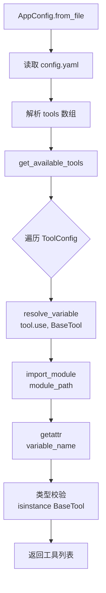
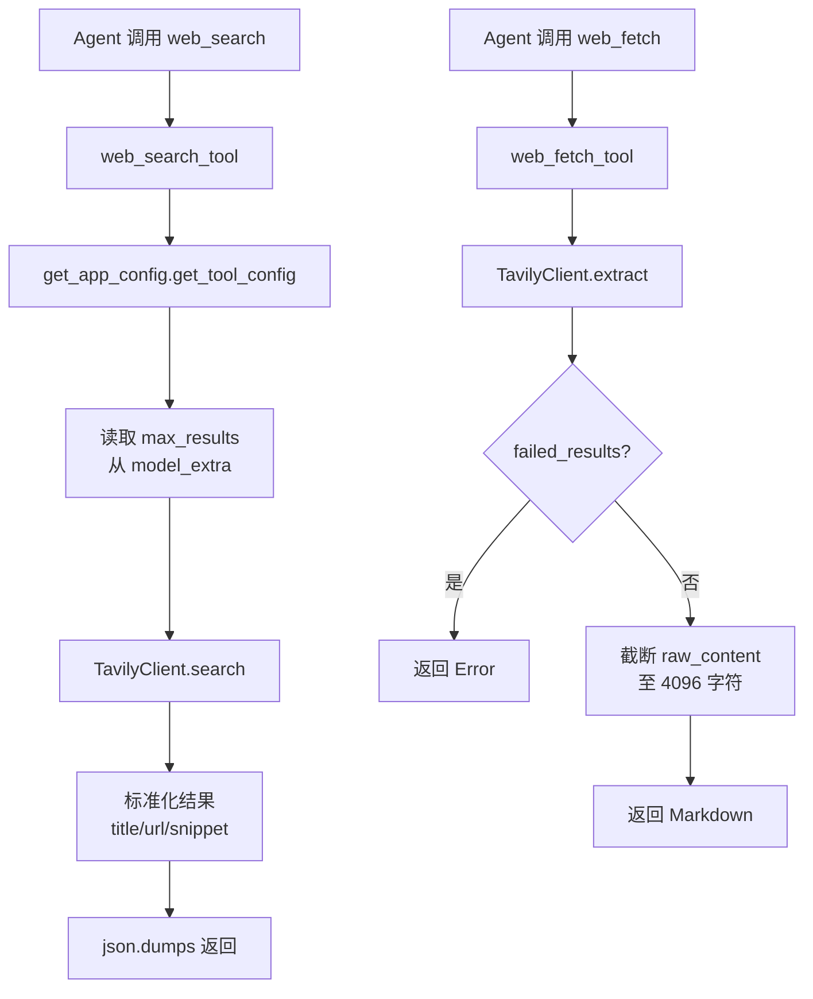
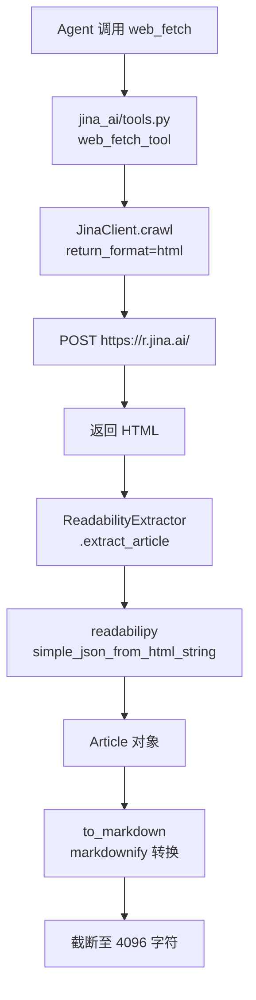

# PD-08.03 DeerFlow — 四源声明式搜索聚合方案

> 文档编号：PD-08.03
> 来源：DeerFlow `backend/src/community/tavily/tools.py`, `backend/src/community/jina_ai/tools.py`, `backend/src/community/firecrawl/tools.py`, `backend/src/community/image_search/tools.py`
> GitHub：https://github.com/bytedance/deer-flow
> 问题域：PD-08 搜索与检索 Search & Retrieval
> 状态：可复用方案

---

## 第 1 章 问题与动机

### 1.1 核心问题

Agent 系统需要从互联网获取实时信息来回答用户问题，但单一搜索源存在明显局限：

- **覆盖面不足**：Tavily 擅长结构化搜索结果，但无法深度抓取页面内容；Jina AI 擅长 readability 提取，但不提供搜索功能
- **多模态缺失**：文本搜索无法满足图片生成场景的参考图需求
- **供应商锁定**：硬编码单一搜索 API 导致切换成本高，一旦 API 不可用整个系统瘫痪
- **配置僵化**：搜索参数（max_results、timeout、api_key）散落在代码中，运维调整需要改代码重新部署

DeerFlow 面对的核心挑战是：如何在保持简洁实现的前提下，支持多搜索源的声明式配置和运行时热切换？

### 1.2 DeerFlow 的解法概述

DeerFlow 采用"声明式配置 + 反射加载 + 统一工具名"三层架构解决上述问题：

1. **四源并存**：Tavily（web_search + web_fetch）、Jina AI（readability web_fetch）、Firecrawl（web_search + web_fetch）、DuckDuckGo（image_search），覆盖文本搜索、页面抓取、图片搜索三种场景（`config.example.yaml:94-113`）
2. **声明式配置**：所有搜索工具通过 `config.yaml` 的 `tools` 数组声明，`use` 字段指定 Python 模块路径，运行时通过反射加载（`backend/src/reflection/resolvers.py:7-46`）
3. **统一工具名策略**：Tavily 和 Firecrawl 都注册为 `web_search` / `web_fetch`，通过 config.yaml 的 `use` 字段切换实现，Agent 侧无感知（`backend/src/community/tavily/tools.py:17`, `backend/src/community/firecrawl/tools.py:17`）
4. **结果标准化**：所有搜索源输出统一的 `{title, url, snippet}` JSON 格式，下游消费者无需关心数据来源（`backend/src/community/tavily/tools.py:31-38`）
5. **配置驱动参数**：max_results、timeout、api_key 等参数从 `ToolConfig.model_extra` 读取，支持环境变量引用（`backend/src/config/app_config.py:98-117`）

### 1.3 设计思想

| 设计原则 | 具体实现 | 理由 | 替代方案 |
|----------|----------|------|----------|
| 声明式配置 | config.yaml `tools` 数组 + `use` 路径 | 运维人员改 YAML 即可切换搜索源，无需改代码 | 硬编码 if-else 分支 |
| 反射加载 | `resolve_variable()` 动态 import | 新增搜索源只需写模块 + 改配置，零侵入 | 工厂模式注册表 |
| 统一工具名 | Tavily/Firecrawl 都叫 `web_search` | Agent prompt 不变，后端自由切换实现 | 每个源独立工具名 |
| 结果标准化 | 统一 `{title, url, snippet}` JSON | 下游 Agent 只需解析一种格式 | 各源返回原始格式 |
| 配置外置参数 | `model_extra` 存储 max_results/timeout | 同一工具不同部署可有不同参数 | 函数参数硬编码默认值 |
| 4096 字符截断 | `[:4096]` 硬截断 web_fetch 结果 | 防止单页内容撑爆 LLM 上下文窗口 | 动态按 token 截断 |

---

## 第 2 章 源码实现分析

### 2.1 架构概览

DeerFlow 的搜索系统由四个独立的 community 模块组成，通过 config.yaml 声明式绑定到统一的工具名：

```
┌─────────────────────────────────────────────────────────────┐
│                    config.yaml (声明层)                       │
│  tools:                                                      │
│    - name: web_search   use: tavily.tools:web_search_tool   │
│    - name: web_fetch    use: jina_ai.tools:web_fetch_tool   │
│    - name: image_search use: image_search.tools:...         │
└──────────────────────┬──────────────────────────────────────┘
                       │ resolve_variable()
                       ▼
┌──────────────────────────────────────────────────────────────┐
│                  tools/tools.py (加载层)                      │
│  get_available_tools() → [BaseTool, BaseTool, ...]           │
└──────────────────────┬───────────────────────────────────────┘
                       │
        ┌──────────────┼──────────────┬──────────────┐
        ▼              ▼              ▼              ▼
┌──────────────┐┌──────────────┐┌──────────────┐┌──────────────┐
│   Tavily     ││   Jina AI    ││  Firecrawl   ││  DuckDuckGo  │
│ web_search   ││  web_fetch   ││ web_search   ││ image_search │
│ web_fetch    ││ (readability)││ web_fetch    ││  (图片搜索)   │
└──────────────┘└──────────────┘└──────────────┘└──────────────┘
        │              │              │              │
        ▼              ▼              ▼              ▼
   {title,url,    Markdown       {title,url,    {title,
    snippet}      (≤4096)         snippet}     image_url,
                                              thumbnail_url}
```

### 2.2 核心实现

#### 2.2.1 反射式工具加载



对应源码 `backend/src/tools/tools.py:42-43`：

```python
config = get_app_config()
loaded_tools = [resolve_variable(tool.use, BaseTool)
                for tool in config.tools
                if groups is None or tool.group in groups]
```

`resolve_variable` 的核心逻辑（`backend/src/reflection/resolvers.py:7-46`）：

```python
def resolve_variable[T](
    variable_path: str,
    expected_type: type[T] | tuple[type, ...] | None = None,
) -> T:
    module_path, variable_name = variable_path.rsplit(":", 1)
    module = import_module(module_path)
    variable = getattr(module, variable_name)
    if expected_type is not None:
        if not isinstance(variable, expected_type):
            raise ValueError(...)
    return variable
```

这是一个通用的 Python 反射加载器，通过 `package.module:variable` 格式的路径字符串，动态导入模块并获取变量。`expected_type` 参数确保加载的对象是 `BaseTool` 实例。

#### 2.2.2 Tavily 搜索 + 提取双工具



对应源码 `backend/src/community/tavily/tools.py:17-40`：

```python
@tool("web_search", parse_docstring=True)
def web_search_tool(query: str) -> str:
    config = get_app_config().get_tool_config("web_search")
    max_results = 5
    if config is not None and "max_results" in config.model_extra:
        max_results = config.model_extra.get("max_results")
    client = _get_tavily_client()
    res = client.search(query, max_results=max_results)
    normalized_results = [
        {"title": result["title"], "url": result["url"],
         "snippet": result["content"]}
        for result in res["results"]
    ]
    return json.dumps(normalized_results, indent=2, ensure_ascii=False)
```

Tavily 的 `web_fetch` 使用 `client.extract([url])` API，支持批量 URL 提取，但 DeerFlow 只传单个 URL。失败时返回 `failed_results` 数组中的错误信息（`backend/src/community/tavily/tools.py:54-62`）。

#### 2.2.3 Jina AI Readability 提取管道



对应源码 `backend/src/community/jina_ai/tools.py:10-28`：

```python
@tool("web_fetch", parse_docstring=True)
def web_fetch_tool(url: str) -> str:
    jina_client = JinaClient()
    timeout = 10
    config = get_app_config().get_tool_config("web_fetch")
    if config is not None and "timeout" in config.model_extra:
        timeout = config.model_extra.get("timeout")
    html_content = jina_client.crawl(url, return_format="html", timeout=timeout)
    article = readability_extractor.extract_article(html_content)
    return article.to_markdown()[:4096]
```

Jina AI 方案的独特之处在于两层内容提取：
1. **Jina Reader API**（`backend/src/community/jina_ai/jina_client.py:10-38`）：通过 `https://r.jina.ai/` 获取页面 HTML，支持 `X-Return-Format` 和 `X-Timeout` 头控制
2. **Readability 提取**（`backend/src/utils/readability.py:54-66`）：用 `readabilipy` 库提取正文，再用 `markdownify` 转 Markdown，过滤广告和导航噪音

### 2.3 实现细节

#### 配置驱动的参数注入

`ToolConfig` 使用 Pydantic 的 `ConfigDict(extra="allow")`（`backend/src/config/tool_config.py:11-21`），允许 YAML 中的任意额外字段存入 `model_extra` 字典。各工具通过 `config.model_extra.get("key")` 读取自己需要的参数：

- Tavily: `max_results`, `api_key`
- Jina AI: `timeout`
- Image Search: `max_results`
- Firecrawl: `max_results`, `api_key`

#### 环境变量解析

`AppConfig.resolve_env_variables()`（`backend/src/config/app_config.py:98-117`）递归遍历配置树，将 `$VAR_NAME` 格式的字符串替换为 `os.getenv()` 的值。这使得 API Key 可以安全地通过环境变量注入，而非明文写在配置文件中。

#### DuckDuckGo 图片搜索的延迟导入

`image_search/tools.py:43-46` 使用函数内 `from ddgs import DDGS` 延迟导入，避免未安装 `ddgs` 库时整个模块加载失败。这是一种优雅的可选依赖处理模式。

#### Firecrawl 作为 Tavily 的替代实现

Firecrawl 模块（`backend/src/community/firecrawl/tools.py:17-73`）注册了与 Tavily 完全相同的工具名 `web_search` 和 `web_fetch`。切换只需修改 config.yaml 的 `use` 字段：

```yaml
# 从 Tavily 切换到 Firecrawl，只改 use 字段
- name: web_search
  group: web
  use: src.community.firecrawl.tools:web_search_tool  # 原: tavily.tools
```


---

## 第 3 章 迁移指南

### 3.1 迁移清单

**阶段 1：基础搜索能力（1 个搜索源）**

- [ ] 创建 `config.yaml`，声明 `tools` 数组
- [ ] 实现 `ToolConfig` Pydantic 模型（`extra="allow"`）
- [ ] 实现 `resolve_variable()` 反射加载器
- [ ] 实现第一个搜索工具（推荐 Tavily，API 最简单）
- [ ] 实现结果标准化为 `{title, url, snippet}` JSON

**阶段 2：多源扩展**

- [ ] 添加 web_fetch 工具（Jina AI 或 Tavily extract）
- [ ] 添加 image_search 工具（DuckDuckGo）
- [ ] 确保同名工具（web_search）可通过 config 切换实现

**阶段 3：生产加固**

- [ ] 环境变量解析（`$VAR_NAME` → `os.getenv()`）
- [ ] 结果截断保护（4096 字符上限）
- [ ] 延迟导入可选依赖（ddgs 等）
- [ ] 工具分组（web/file/bash）权限控制

### 3.2 适配代码模板

#### 最小可运行的声明式搜索系统

```python
"""可直接运行的声明式搜索系统骨架，移植自 DeerFlow 架构"""
import json
import os
from importlib import import_module
from typing import Any, TypeVar

import yaml
from pydantic import BaseModel, ConfigDict, Field

T = TypeVar("T")


# === 1. 反射加载器（来自 DeerFlow resolvers.py） ===
def resolve_variable(variable_path: str, expected_type: type | None = None) -> Any:
    module_path, variable_name = variable_path.rsplit(":", 1)
    module = import_module(module_path)
    variable = getattr(module, variable_name)
    if expected_type and not isinstance(variable, expected_type):
        raise ValueError(f"{variable_path} is not {expected_type.__name__}")
    return variable


# === 2. 配置模型（来自 DeerFlow tool_config.py） ===
class ToolConfig(BaseModel):
    name: str
    group: str = "default"
    use: str  # "package.module:variable_name"
    model_config = ConfigDict(extra="allow")


class SearchConfig(BaseModel):
    tools: list[ToolConfig] = Field(default_factory=list)

    @classmethod
    def from_yaml(cls, path: str = "config.yaml") -> "SearchConfig":
        with open(path) as f:
            data = yaml.safe_load(f)
        # 解析环境变量
        data = cls._resolve_env(data)
        return cls.model_validate(data)

    @classmethod
    def _resolve_env(cls, config: Any) -> Any:
        if isinstance(config, str) and config.startswith("$"):
            return os.getenv(config[1:], config)
        elif isinstance(config, dict):
            return {k: cls._resolve_env(v) for k, v in config.items()}
        elif isinstance(config, list):
            return [cls._resolve_env(item) for item in config]
        return config

    def get_tool_config(self, name: str) -> ToolConfig | None:
        return next((t for t in self.tools if t.name == name), None)


# === 3. 搜索工具实现示例 ===
def create_web_search_tool(config: SearchConfig):
    """根据配置创建搜索工具"""
    tool_cfg = config.get_tool_config("web_search")
    if tool_cfg is None:
        raise ValueError("web_search not configured")

    max_results = tool_cfg.model_extra.get("max_results", 5)

    def web_search(query: str) -> str:
        # 替换为你的搜索 API 调用
        from tavily import TavilyClient
        api_key = tool_cfg.model_extra.get("api_key")
        client = TavilyClient(api_key=api_key)
        res = client.search(query, max_results=max_results)
        normalized = [
            {"title": r["title"], "url": r["url"], "snippet": r["content"]}
            for r in res["results"]
        ]
        return json.dumps(normalized, indent=2, ensure_ascii=False)

    return web_search


# === 4. 使用 ===
if __name__ == "__main__":
    config = SearchConfig.from_yaml("config.yaml")
    search = create_web_search_tool(config)
    results = search("DeerFlow agent framework")
    print(results)
```

### 3.3 适用场景

| 场景 | 适用度 | 说明 |
|------|--------|------|
| LLM Agent 需要实时搜索 | ⭐⭐⭐ | 核心场景，声明式配置 + 统一输出格式 |
| 多搜索源 A/B 测试 | ⭐⭐⭐ | 改 config.yaml 即可切换 Tavily/Firecrawl |
| 需要图片参考的生成场景 | ⭐⭐⭐ | DuckDuckGo image_search 专为此设计 |
| 需要深度页面内容提取 | ⭐⭐ | Jina AI + readability 管道，但 4096 截断可能不够 |
| 高并发搜索场景 | ⭐ | 无内置并发控制和速率限制，需自行添加 |
| 需要搜索结果缓存 | ⭐ | 无缓存层，每次调用都是实时 API 请求 |

---

## 第 4 章 测试用例

```python
"""基于 DeerFlow 搜索系统真实函数签名的测试用例"""
import json
from unittest.mock import MagicMock, patch

import pytest


class TestTavilyWebSearch:
    """测试 Tavily web_search_tool (backend/src/community/tavily/tools.py:17-40)"""

    @patch("src.community.tavily.tools.get_app_config")
    @patch("src.community.tavily.tools.TavilyClient")
    def test_normal_search(self, mock_client_cls, mock_config):
        """正常搜索返回标准化 JSON"""
        from src.community.tavily.tools import web_search_tool

        mock_config.return_value.get_tool_config.return_value = None
        mock_client = MagicMock()
        mock_client_cls.return_value = mock_client
        mock_client.search.return_value = {
            "results": [
                {"title": "Test", "url": "https://example.com", "content": "snippet"}
            ]
        }

        result = web_search_tool.invoke({"query": "test query"})
        parsed = json.loads(result)

        assert len(parsed) == 1
        assert parsed[0]["title"] == "Test"
        assert parsed[0]["url"] == "https://example.com"
        assert parsed[0]["snippet"] == "snippet"

    @patch("src.community.tavily.tools.get_app_config")
    @patch("src.community.tavily.tools.TavilyClient")
    def test_max_results_from_config(self, mock_client_cls, mock_config):
        """max_results 从配置读取"""
        from src.community.tavily.tools import web_search_tool

        tool_config = MagicMock()
        tool_config.model_extra = {"max_results": 10}
        mock_config.return_value.get_tool_config.return_value = tool_config
        mock_client = MagicMock()
        mock_client_cls.return_value = mock_client
        mock_client.search.return_value = {"results": []}

        web_search_tool.invoke({"query": "test"})
        mock_client.search.assert_called_once_with("test", max_results=10)


class TestJinaWebFetch:
    """测试 Jina AI web_fetch_tool (backend/src/community/jina_ai/tools.py:10-28)"""

    @patch("src.community.jina_ai.tools.get_app_config")
    @patch("src.community.jina_ai.tools.readability_extractor")
    @patch("src.community.jina_ai.tools.JinaClient")
    def test_fetch_with_readability(self, mock_jina_cls, mock_extractor, mock_config):
        """Jina 抓取 + readability 提取 + Markdown 转换"""
        from src.community.jina_ai.tools import web_fetch_tool

        mock_config.return_value.get_tool_config.return_value = None
        mock_jina = MagicMock()
        mock_jina_cls.return_value = mock_jina
        mock_jina.crawl.return_value = "<html><body><p>Hello</p></body></html>"

        mock_article = MagicMock()
        mock_article.to_markdown.return_value = "# Title\n\nHello"
        mock_extractor.extract_article.return_value = mock_article

        result = web_fetch_tool.invoke({"url": "https://example.com"})
        assert len(result) <= 4096

    @patch("src.community.jina_ai.tools.get_app_config")
    @patch("src.community.jina_ai.tools.JinaClient")
    def test_truncation_at_4096(self, mock_jina_cls, mock_config):
        """结果截断到 4096 字符"""
        mock_config.return_value.get_tool_config.return_value = None
        mock_jina = MagicMock()
        mock_jina_cls.return_value = mock_jina
        mock_jina.crawl.return_value = "<html><body>" + "x" * 10000 + "</body></html>"
        # 验证截断逻辑：article.to_markdown()[:4096]


class TestImageSearch:
    """测试 DuckDuckGo image_search (backend/src/community/image_search/tools.py:77-135)"""

    @patch("src.community.image_search.tools.get_app_config")
    @patch("src.community.image_search.tools._search_images")
    def test_normalized_output(self, mock_search, mock_config):
        """图片搜索结果标准化为 title/image_url/thumbnail_url"""
        from src.community.image_search.tools import image_search_tool

        mock_config.return_value.get_tool_config.return_value = None
        mock_search.return_value = [
            {"title": "Cat", "thumbnail": "https://img.example.com/cat.jpg"}
        ]

        result = image_search_tool.invoke({"query": "cat photo"})
        parsed = json.loads(result)

        assert parsed["total_results"] == 1
        assert parsed["results"][0]["image_url"] == "https://img.example.com/cat.jpg"
        assert "usage_hint" in parsed

    @patch("src.community.image_search.tools.get_app_config")
    @patch("src.community.image_search.tools._search_images")
    def test_empty_results(self, mock_search, mock_config):
        """无结果时返回 error JSON"""
        from src.community.image_search.tools import image_search_tool

        mock_config.return_value.get_tool_config.return_value = None
        mock_search.return_value = []

        result = image_search_tool.invoke({"query": "nonexistent"})
        parsed = json.loads(result)
        assert "error" in parsed


class TestResolveVariable:
    """测试反射加载器 (backend/src/reflection/resolvers.py:7-46)"""

    def test_valid_path(self):
        from src.reflection.resolvers import resolve_variable
        result = resolve_variable("json:dumps")
        assert callable(result)

    def test_invalid_path_format(self):
        from src.reflection.resolvers import resolve_variable
        with pytest.raises(ImportError, match="doesn't look like a variable path"):
            resolve_variable("no_colon_here")

    def test_type_validation_failure(self):
        from src.reflection.resolvers import resolve_variable
        with pytest.raises(ValueError, match="is not an instance of"):
            resolve_variable("json:dumps", expected_type=int)
```


---

## 第 5 章 跨域关联

| 关联域 | 关系类型 | 说明 |
|--------|----------|------|
| PD-01 上下文管理 | 协同 | web_fetch 的 4096 字符截断是上下文窗口保护的一部分，防止单次搜索结果撑爆 LLM 上下文 |
| PD-04 工具系统 | 依赖 | 搜索工具通过 `@tool` 装饰器注册为 LangChain BaseTool，依赖 PD-04 的反射加载和配置驱动工具注册机制 |
| PD-09 Human-in-the-Loop | 协同 | Lead Agent 的 `ask_clarification` 工具可在搜索前澄清用户意图，提升搜索精度 |
| PD-11 可观测性 | 协同 | 搜索工具的调用可通过 DeerFlow 的 tracing 配置追踪，但搜索层本身无内置 metrics |
| PD-06 记忆持久化 | 协同 | Memory 系统注入的用户偏好可影响搜索策略，但当前搜索工具未直接消费 memory 数据 |

---

## 第 6 章 来源文件索引

| 文件 | 行范围 | 关键实现 |
|------|--------|----------|
| `backend/src/community/tavily/tools.py` | L1-63 | Tavily web_search + web_fetch 双工具，结果标准化 |
| `backend/src/community/jina_ai/tools.py` | L1-28 | Jina AI web_fetch，readability 提取管道 |
| `backend/src/community/jina_ai/jina_client.py` | L1-38 | Jina Reader API 客户端，HTTP POST + 超时控制 |
| `backend/src/utils/readability.py` | L1-66 | ReadabilityExtractor + Article 模型，HTML→Markdown |
| `backend/src/community/firecrawl/tools.py` | L1-73 | Firecrawl web_search + web_fetch，Tavily 替代实现 |
| `backend/src/community/image_search/tools.py` | L1-135 | DuckDuckGo 图片搜索，延迟导入 + 结果标准化 |
| `backend/src/config/tool_config.py` | L1-21 | ToolConfig Pydantic 模型，extra="allow" |
| `backend/src/config/app_config.py` | L21-207 | AppConfig 单例，YAML 加载 + 环境变量解析 |
| `backend/src/reflection/resolvers.py` | L1-71 | resolve_variable 反射加载器，动态 import |
| `backend/src/tools/tools.py` | L1-84 | get_available_tools，工具加载入口 |
| `config.example.yaml` | L94-113 | 搜索工具声明式配置示例 |

---

## 第 7 章 横向对比维度

```json comparison_data
{
  "project": "DeerFlow",
  "dimensions": {
    "搜索架构": "四源声明式配置：Tavily + Jina AI + Firecrawl + DuckDuckGo，config.yaml 切换",
    "去重机制": "无内置去重，依赖 LLM Agent 层面的 URL 去重判断",
    "结果处理": "统一 {title, url, snippet} JSON + 4096 字符硬截断",
    "容错策略": "Firecrawl try-except 返回 Error 字符串，DuckDuckGo 延迟导入降级为空列表",
    "成本控制": "config.yaml 声明 max_results 限制单次返回数量，无 token 级成本追踪",
    "检索方式": "实时 API 调用，无本地索引或向量检索",
    "扩展性": "反射加载 resolve_variable + config.yaml 声明，新增搜索源零侵入",
    "解析容错": "Jina AI 双层提取（Reader API + readabilipy），空内容返回 fallback 文本",
    "多模态支持": "DuckDuckGo image_search 支持图片搜索，含尺寸/类型/布局过滤"
  }
}
```

### 域元数据补充

```json domain_metadata
{
  "solution_summary": "DeerFlow 通过 config.yaml 声明式配置 + resolve_variable 反射加载，实现 Tavily/Jina AI/Firecrawl/DuckDuckGo 四源搜索的零侵入切换，统一输出 JSON 格式",
  "description": "声明式配置驱动的多搜索源热切换与统一结果标准化",
  "sub_problems": [
    "搜索源热切换：如何在不改代码的情况下切换底层搜索 API 实现",
    "页面内容净化：从原始 HTML 中提取正文并转为结构化 Markdown"
  ],
  "best_practices": [
    "统一工具名 + 反射加载实现搜索源透明切换：Agent prompt 无需感知底层 API 变化",
    "Pydantic extra=allow 模式存储工具参数：同一工具不同部署可有不同配置，无需改代码",
    "可选依赖延迟导入：函数内 import 避免未安装的库导致整个模块加载失败"
  ]
}
```
