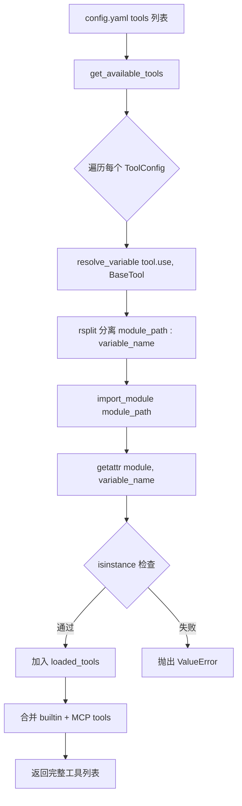
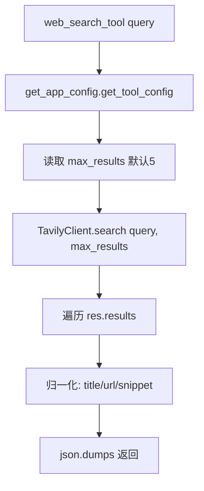

# PD-08.NN DeerFlow — 多搜索源配置驱动与 Readability 内容净化

> 文档编号：PD-08.NN
> 来源：DeerFlow `backend/src/community/tavily/tools.py`, `backend/src/community/firecrawl/tools.py`, `backend/src/community/jina_ai/tools.py`
> GitHub：https://github.com/bytedance/deer-flow.git
> 问题域：PD-08 搜索与检索 Search & Retrieval
> 状态：可复用方案

---

## 第 1 章 问题与动机

### 1.1 核心问题

Agent 系统需要从互联网获取信息，但不同搜索 API 的可用性、成本、质量差异巨大：

- **供应商锁定**：硬编码 Tavily 后，API 不可用时整个搜索能力瘫痪
- **内容质量参差**：不同 API 返回的原始内容格式不一（HTML/Markdown/纯文本），直接喂给 LLM 浪费 token
- **配置僵化**：切换搜索供应商需要改代码、重新部署，无法运行时调整
- **多模态盲区**：纯文本搜索无法满足图片生成场景的参考图需求

这些问题在生产环境中尤为突出——Tavily 免费额度用完、Firecrawl 被限流、Jina 返回脏 HTML，都是常见场景。

### 1.2 DeerFlow 的解法概述

DeerFlow 2.0 采用**配置驱动的可插拔搜索架构**，核心设计：

1. **YAML 声明式工具注册**：在 `config.example.yaml:94-113` 中用 `name + group + use` 三元组声明搜索工具，`use` 字段指向 Python 模块路径
2. **反射式动态加载**：`resolve_variable()` (`backend/src/reflection/resolvers.py:7-46`) 在运行时通过 `importlib` 动态导入工具，无需硬编码依赖
3. **统一输出格式**：三个搜索供应商（Tavily/Firecrawl/Jina）都将结果标准化为 `{title, url, snippet}` JSON 格式 (`backend/src/community/tavily/tools.py:31-38`)
4. **Readability 内容净化**：Jina 路径使用 Mozilla Readability 算法 + markdownify 将 HTML 转为干净 Markdown (`backend/src/utils/readability.py:54-66`)
5. **4096 字符硬截断**：所有 `web_fetch` 实现统一截断至 4096 字符，防止 LLM 上下文溢出

### 1.3 设计思想

| 设计原则 | 具体实现 | 理由 | 替代方案 |
|----------|----------|------|----------|
| 配置驱动热切换 | YAML `use` 字段指定模块路径，改配置即换供应商 | 运维无需改代码重部署 | 环境变量开关（粒度不够） |
| 同名工具覆盖 | 同一 `name` 只保留最后一个配置项 | 简化切换逻辑，避免多供应商冲突 | 路由表按优先级选择（复杂度高） |
| 反射式加载 | `importlib.import_module` + `getattr` | 新供应商只需加模块+配置，零侵入 | 工厂注册表（需维护注册代码） |
| 结果格式归一化 | 所有供应商输出 `{title, url, snippet}` JSON | LLM prompt 不感知底层供应商差异 | 让 LLM 自行解析不同格式（浪费 token） |
| 硬截断保护 | `[:4096]` 字符截断 | 简单粗暴但有效，防止单次 fetch 占满上下文 | token 级截断（需 tokenizer 依赖） |
| 内容净化管道 | HTML → Readability 提取 → Markdown 转换 | 去除导航栏/广告/脚本等噪声 | 正则清洗（不可靠）或 LLM 摘要（成本高） |

---

## 第 2 章 源码实现分析

### 2.1 架构概览

DeerFlow 的搜索系统由四层组成：配置层、加载层、供应商层、净化层。

```
┌─────────────────────────────────────────────────────────┐
│                    config.yaml                           │
│  tools:                                                  │
│    - name: web_search                                    │
│      use: src.community.tavily.tools:web_search_tool     │
│    - name: web_fetch                                     │
│      use: src.community.jina_ai.tools:web_fetch_tool     │
│    - name: image_search                                  │
│      use: src.community.image_search.tools:...           │
└──────────────────────┬──────────────────────────────────┘
                       │ resolve_variable()
                       ▼
┌─────────────────────────────────────────────────────────┐
│              get_available_tools()                        │
│  loaded_tools = [resolve_variable(t.use) for t in ...]   │
│  return loaded_tools + builtin_tools + mcp_tools         │
└──────────────────────┬──────────────────────────────────┘
                       │
          ┌────────────┼────────────┬──────────────┐
          ▼            ▼            ▼              ▼
    ┌──────────┐ ┌──────────┐ ┌──────────┐ ┌────────────┐
    │  Tavily  │ │ Firecrawl│ │  Jina AI │ │ DuckDuckGo │
    │ search + │ │ search + │ │  fetch   │ │   images   │
    │  fetch   │ │  fetch   │ │  only    │ │   only     │
    └────┬─────┘ └────┬─────┘ └────┬─────┘ └─────┬──────┘
         │            │            │              │
         ▼            ▼            ▼              ▼
    {title,url,   {title,url,   HTML → Readability  {title,
     snippet}      snippet}     → Markdown[:4096]    image_url}
```

### 2.2 核心实现

#### 2.2.1 反射式工具加载



对应源码 `backend/src/reflection/resolvers.py:7-46`：

```python
def resolve_variable[T](
    variable_path: str,
    expected_type: type[T] | tuple[type, ...] | None = None,
) -> T:
    try:
        module_path, variable_name = variable_path.rsplit(":", 1)
    except ValueError as err:
        raise ImportError(
            f"{variable_path} doesn't look like a variable path"
        ) from err

    module = import_module(module_path)
    variable = getattr(module, variable_name)

    if expected_type is not None:
        if not isinstance(variable, expected_type):
            raise ValueError(
                f"{variable_path} is not an instance of {expected_type}"
            )
    return variable
```

调用方 `backend/src/tools/tools.py:42-43`：

```python
config = get_app_config()
loaded_tools = [
    resolve_variable(tool.use, BaseTool)
    for tool in config.tools
    if groups is None or tool.group in groups
]
```

#### 2.2.2 Tavily 搜索与结果归一化



对应源码 `backend/src/community/tavily/tools.py:17-40`：

```python
@tool("web_search", parse_docstring=True)
def web_search_tool(query: str) -> str:
    config = get_app_config().get_tool_config("web_search")
    max_results = 5
    if config is not None and "max_results" in config.model_extra:
        max_results = config.model_extra.get("max_results")

    client = _get_tavily_client()
    res = client.search(query, max_results=max_results)
    normalized_results = [
        {
            "title": result["title"],
            "url": result["url"],
            "snippet": result["content"],  # Tavily 用 "content" 字段
        }
        for result in res["results"]
    ]
    return json.dumps(normalized_results, indent=2, ensure_ascii=False)
```

注意 Tavily 原始字段名是 `content`，归一化时映射为 `snippet`，确保下游 LLM prompt 不感知供应商差异。

#### 2.2.3 Jina + Readability 内容净化管道

```mermaid
graph TD
    A[web_fetch_tool url] --> B[JinaClient.crawl url, html, timeout=10]
    B --> C[POST https://r.jina.ai/]
    C --> D{status 200?}
    D -->|否| E[返回 Error 字符串]
    D -->|是| F[返回原始 HTML]
    F --> G[ReadabilityExtractor.extract_article html]
    G --> H[readabilipy: simple_json_from_html_string]
    H --> I[提取 title + content HTML]
    I --> J[Article.to_markdown]
    J --> K[markdownify: HTML → Markdown]
    K --> L[截断 [:4096]]
    L --> M[返回干净 Markdown]
```

对应源码 `backend/src/community/jina_ai/tools.py:10-28`：

```python
readability_extractor = ReadabilityExtractor()

@tool("web_fetch", parse_docstring=True)
def web_fetch_tool(url: str) -> str:
    jina_client = JinaClient()
    timeout = 10
    config = get_app_config().get_tool_config("web_fetch")
    if config is not None and "timeout" in config.model_extra:
        timeout = config.model_extra.get("timeout")
    html_content = jina_client.crawl(url, return_format="html", timeout=timeout)
    article = readability_extractor.extract_article(html_content)
    return article.to_markdown()[:4096]
```

Readability 提取器 `backend/src/utils/readability.py:54-66`：

```python
class ReadabilityExtractor:
    def extract_article(self, html: str) -> Article:
        article = simple_json_from_html_string(html, use_readability=True)
        html_content = article.get("content")
        if not html_content or not str(html_content).strip():
            html_content = "No content could be extracted from this page"
        title = article.get("title")
        if not title or not str(title).strip():
            title = "Untitled"
        return Article(title=title, html_content=html_content)
```

### 2.3 实现细节

**ToolConfig 的 extra="allow" 设计** (`backend/src/config/tool_config.py:11-20`)：

Pydantic `ConfigDict(extra="allow")` 让每个工具可以携带任意额外配置（api_key、max_results、timeout 等），无需为每个供应商定义专用 Config 类。工具内部通过 `config.model_extra.get("key")` 读取，实现了配置的完全开放性。

**Firecrawl 的防御式编程** (`backend/src/community/firecrawl/tools.py:35-41`)：

```python
normalized_results = [
    {
        "title": getattr(item, "title", "") or "",
        "url": getattr(item, "url", "") or "",
        "snippet": getattr(item, "description", "") or "",
    }
    for item in web_results
]
```

使用 `getattr(item, field, "") or ""` 双重防御：`getattr` 防止属性不存在，`or ""` 防止属性值为 `None`。这比 Tavily 的 `result["key"]` 字典访问更健壮。

**DuckDuckGo 图片搜索的零成本设计** (`backend/src/community/image_search/tools.py:43-74`)：

图片搜索使用 DuckDuckGo 的 `ddgs` 库，无需 API Key，支持 size/type/layout 过滤。这是一个巧妙的成本优化——图片搜索只需要 URL 不需要高质量文本摘要，DuckDuckGo 完全够用。

**Article.to_message() 的多模态支持** (`backend/src/utils/readability.py:27-51`)：

```python
def to_message(self) -> list[dict]:
    image_pattern = r"!\[.*?\]\((.*?)\)"
    parts = re.split(image_pattern, markdown)
    for i, part in enumerate(parts):
        if i % 2 == 1:
            image_url = urljoin(self.url, part.strip())
            content.append({"type": "image_url", "image_url": {"url": image_url}})
        else:
            content.append({"type": "text", "text": text_part})
    return content
```

从 Markdown 中提取图片 URL 并转为 LLM 多模态消息格式，支持 Vision 模型直接处理网页中的图片。

---

## 第 3 章 迁移指南

### 3.1 迁移清单

**阶段 1：基础搜索能力（1 个供应商）**

- [ ] 安装依赖：`pip install tavily-python` 或 `pip install firecrawl-py` 或 `pip install requests readabilipy markdownify`
- [ ] 创建 `config.yaml` 工具配置段，声明 `web_search` 和 `web_fetch`
- [ ] 实现 `resolve_variable()` 反射加载器（可直接复用 DeerFlow 的 47 行实现）
- [ ] 实现一个搜索供应商的 `web_search_tool` 和 `web_fetch_tool`
- [ ] 统一输出格式为 `{title, url, snippet}` JSON

**阶段 2：多供应商可切换**

- [ ] 添加第二个供应商模块（如 Firecrawl）
- [ ] 在 `config.yaml` 中注释切换即可验证
- [ ] 添加 Readability 内容净化管道（如果使用 Jina）

**阶段 3：图片搜索与多模态**

- [ ] 添加 `image_search` 工具（DuckDuckGo，零成本）
- [ ] 实现 `Article.to_message()` 多模态消息转换

### 3.2 适配代码模板

**最小可用的配置驱动搜索系统：**

```python
# --- config_loader.py ---
import yaml
from importlib import import_module
from dataclasses import dataclass, field
from typing import Any

@dataclass
class ToolEntry:
    name: str
    group: str
    use: str  # "module.path:variable_name"
    extra: dict[str, Any] = field(default_factory=dict)

def load_tools_from_config(config_path: str, groups: list[str] | None = None) -> list:
    """从 YAML 配置加载工具，支持按 group 过滤"""
    with open(config_path) as f:
        cfg = yaml.safe_load(f)

    tools = []
    for entry in cfg.get("tools", []):
        if groups and entry["group"] not in groups:
            continue
        module_path, var_name = entry["use"].rsplit(":", 1)
        module = import_module(module_path)
        tool_func = getattr(module, var_name)
        tools.append(tool_func)
    return tools


# --- search_provider.py ---
import json
import requests
from readabilipy import simple_json_from_html_string
from markdownify import markdownify as md

MAX_CONTENT_LENGTH = 4096

def normalize_search_results(raw_results: list[dict], field_map: dict) -> str:
    """将不同供应商的搜索结果归一化为统一格式"""
    normalized = [
        {
            "title": r.get(field_map.get("title", "title"), ""),
            "url": r.get(field_map.get("url", "url"), ""),
            "snippet": r.get(field_map.get("snippet", "snippet"), ""),
        }
        for r in raw_results
    ]
    return json.dumps(normalized, indent=2, ensure_ascii=False)

def extract_clean_content(html: str) -> str:
    """HTML → Readability 提取 → Markdown 转换 → 截断"""
    article = simple_json_from_html_string(html, use_readability=True)
    content = article.get("content", "")
    title = article.get("title", "Untitled")
    markdown = f"# {title}\n\n{md(content)}" if content else f"# {title}\n\n*No content*"
    return markdown[:MAX_CONTENT_LENGTH]
```

**对应的 config.yaml：**

```yaml
tools:
  - name: web_search
    group: web
    use: my_project.search.tavily:web_search_tool
    max_results: 5
    api_key: $TAVILY_API_KEY

  - name: web_fetch
    group: web
    use: my_project.search.jina:web_fetch_tool
    timeout: 10
```

### 3.3 适用场景

| 场景 | 适用度 | 说明 |
|------|--------|------|
| 研究型 Agent（Deep Research） | ⭐⭐⭐ | 多源搜索 + 内容净化是标配 |
| 客服/问答 Agent | ⭐⭐⭐ | 配置驱动方便按客户切换搜索源 |
| 代码生成 Agent | ⭐⭐ | 搜索需求较少，但 web_fetch 文档提取有用 |
| 数据分析 Agent | ⭐⭐ | 需要扩展金融数据源，当前架构支持 |
| 纯离线 Agent | ⭐ | 无搜索需求，但配置驱动模式可复用于其他工具 |

---

## 第 4 章 测试用例

```python
import json
import pytest
from unittest.mock import patch, MagicMock


class TestSearchResultNormalization:
    """测试搜索结果归一化"""

    def test_tavily_normalization(self):
        """Tavily 的 content 字段应映射为 snippet"""
        raw = {"results": [
            {"title": "Test", "url": "https://example.com", "content": "snippet text"}
        ]}
        with patch("tavily.TavilyClient") as mock_client:
            mock_client.return_value.search.return_value = raw
            # 模拟 tavily web_search_tool 的归一化逻辑
            normalized = [
                {"title": r["title"], "url": r["url"], "snippet": r["content"]}
                for r in raw["results"]
            ]
            assert normalized[0]["snippet"] == "snippet text"
            assert "content" not in normalized[0]

    def test_firecrawl_defensive_getattr(self):
        """Firecrawl 结果属性缺失时应返回空字符串"""
        mock_item = MagicMock(spec=[])  # 无任何属性
        result = {
            "title": getattr(mock_item, "title", "") or "",
            "url": getattr(mock_item, "url", "") or "",
            "snippet": getattr(mock_item, "description", "") or "",
        }
        assert result == {"title": "", "url": "", "snippet": ""}

    def test_firecrawl_none_values(self):
        """Firecrawl 属性值为 None 时应返回空字符串"""
        mock_item = MagicMock()
        mock_item.title = None
        mock_item.url = "https://example.com"
        mock_item.description = None
        result = {
            "title": getattr(mock_item, "title", "") or "",
            "url": getattr(mock_item, "url", "") or "",
            "snippet": getattr(mock_item, "description", "") or "",
        }
        assert result["title"] == ""
        assert result["url"] == "https://example.com"


class TestContentTruncation:
    """测试 4096 字符截断"""

    def test_truncation_boundary(self):
        """超长内容应被截断至 4096 字符"""
        long_content = "x" * 10000
        truncated = long_content[:4096]
        assert len(truncated) == 4096

    def test_short_content_unchanged(self):
        """短内容不应被截断"""
        short = "Hello world"
        assert short[:4096] == short


class TestReadabilityExtraction:
    """测试 Readability 内容净化"""

    def test_extract_article_with_valid_html(self):
        """有效 HTML 应提取出 title 和 content"""
        from readabilipy import simple_json_from_html_string
        html = "<html><head><title>Test</title></head><body><article><p>Content</p></article></body></html>"
        article = simple_json_from_html_string(html, use_readability=True)
        assert article.get("title") is not None

    def test_empty_html_fallback(self):
        """空 HTML 应返回降级内容"""
        html_content = ""
        fallback = "No content could be extracted from this page"
        if not html_content or not str(html_content).strip():
            html_content = fallback
        assert html_content == fallback


class TestResolveVariable:
    """测试反射式工具加载"""

    def test_valid_path(self):
        """合法路径应成功解析"""
        from importlib import import_module
        module = import_module("json")
        func = getattr(module, "dumps")
        assert callable(func)

    def test_invalid_path_format(self):
        """缺少冒号的路径应抛出异常"""
        path = "no_colon_here"
        with pytest.raises(ValueError):
            path.rsplit(":", 1)  # 不会抛异常但只返回1个元素
            module_path, var_name = path.rsplit(":", 1)

    def test_missing_attribute(self):
        """不存在的属性应抛出 AttributeError"""
        from importlib import import_module
        module = import_module("json")
        with pytest.raises(AttributeError):
            getattr(module, "nonexistent_function_xyz")


class TestTavilyFetchErrorHandling:
    """测试 Tavily web_fetch 错误处理"""

    def test_failed_results(self):
        """extract 失败时应返回错误信息"""
        res = {"failed_results": [{"error": "URL not accessible"}], "results": []}
        if "failed_results" in res and len(res["failed_results"]) > 0:
            output = f"Error: {res['failed_results'][0]['error']}"
        assert output == "Error: URL not accessible"

    def test_empty_results(self):
        """无结果时应返回 No results found"""
        res = {"results": []}
        if "results" in res and len(res["results"]) > 0:
            output = "has results"
        else:
            output = "Error: No results found"
        assert output == "Error: No results found"
```

---

## 第 5 章 跨域关联

| 关联域 | 关系类型 | 说明 |
|--------|----------|------|
| PD-01 上下文管理 | 协同 | 4096 字符截断直接服务于上下文窗口保护，`web_fetch` 的截断阈值应与上下文预算联动 |
| PD-03 容错与重试 | 协同 | Firecrawl 的 `try/except` 全包裹和 Jina 的 HTTP 状态码检查是搜索层容错的基础，但缺少跨供应商降级链 |
| PD-04 工具系统 | 依赖 | 搜索工具的注册、加载、分组过滤完全依赖 PD-04 的 `resolve_variable` + `ToolConfig` 体系 |
| PD-10 中间件管道 | 协同 | `get_available_tools()` 加载的搜索工具会经过 Agent 的 middleware 管道处理 |
| PD-11 可观测性 | 协同 | 当前搜索工具缺少成本追踪（Tavily 按次计费），可通过 PD-11 的追踪体系补充 |

---

## 第 6 章 来源文件索引

| 文件 | 行范围 | 关键实现 |
|------|--------|----------|
| `backend/src/community/tavily/tools.py` | L1-63 | Tavily web_search + web_fetch，结果归一化 |
| `backend/src/community/firecrawl/tools.py` | L1-73 | Firecrawl web_search + web_fetch，防御式 getattr |
| `backend/src/community/jina_ai/tools.py` | L1-28 | Jina web_fetch + Readability 净化管道 |
| `backend/src/community/jina_ai/jina_client.py` | L1-38 | Jina HTTP 客户端，POST r.jina.ai |
| `backend/src/community/image_search/tools.py` | L1-135 | DuckDuckGo 图片搜索，零成本多参数过滤 |
| `backend/src/utils/readability.py` | L1-66 | ReadabilityExtractor + Article 类，HTML→Markdown |
| `backend/src/tools/tools.py` | L22-84 | get_available_tools()，工具加载与合并 |
| `backend/src/config/tool_config.py` | L1-20 | ToolConfig Pydantic 模型，extra="allow" |
| `backend/src/reflection/resolvers.py` | L7-46 | resolve_variable() 反射式动态导入 |
| `config.example.yaml` | L94-113 | 搜索工具 YAML 配置示例 |

---

## 第 7 章 横向对比维度

```json comparison_data
{
  "project": "DeerFlow",
  "dimensions": {
    "搜索架构": "YAML 配置驱动 + resolve_variable 反射加载，三供应商可插拔",
    "去重机制": "无显式去重，依赖单供应商返回结果的内在去重",
    "结果处理": "三供应商统一归一化为 {title,url,snippet} JSON",
    "容错策略": "Firecrawl 全 try/except，Jina HTTP 状态码检查，Tavily 无显式容错",
    "成本控制": "图片搜索用免费 DuckDuckGo，Jina 有免费层，4096 字符硬截断",
    "搜索源热切换": "改 config.yaml 的 use 字段即可切换供应商，无需改代码",
    "页面内容净化": "Jina 路径: Mozilla Readability + markdownify 双阶段净化",
    "扩展性": "新供应商只需创建模块 + 配置 use 路径，零侵入主代码",
    "多模态支持": "Article.to_message() 提取图片 URL 转 VLM 消息格式",
    "解析容错": "Firecrawl 用 getattr+or 双重防御，Jina 用空内容降级文案"
  }
}
```

### 域元数据补充

```json domain_metadata
{
  "solution_summary": "DeerFlow 用 YAML 配置 + resolve_variable 反射加载实现 Tavily/Firecrawl/Jina 三供应商热切换，Readability+markdownify 双阶段内容净化，4096 字符硬截断保护上下文",
  "description": "配置驱动的搜索供应商热切换与 HTML 内容净化是 Agent 搜索系统的工程基础",
  "sub_problems": [
    "搜索结果字段归一化：不同供应商返回字段名不同时如何统一映射为标准格式",
    "图片搜索零成本方案：如何用免费 API 满足图片生成场景的参考图需求",
    "HTML 多模态提取：网页内容中的图片如何转为 VLM 可处理的消息格式"
  ],
  "best_practices": [
    "Pydantic extra=allow 让工具配置完全开放：无需为每个供应商定义专用 Config 类",
    "反射式加载优于工厂注册表：新供应商只需加模块+配置，零侵入主代码",
    "getattr+or 双重防御处理供应商返回值不一致：防属性缺失 + 防 None 值"
  ]
}
```
