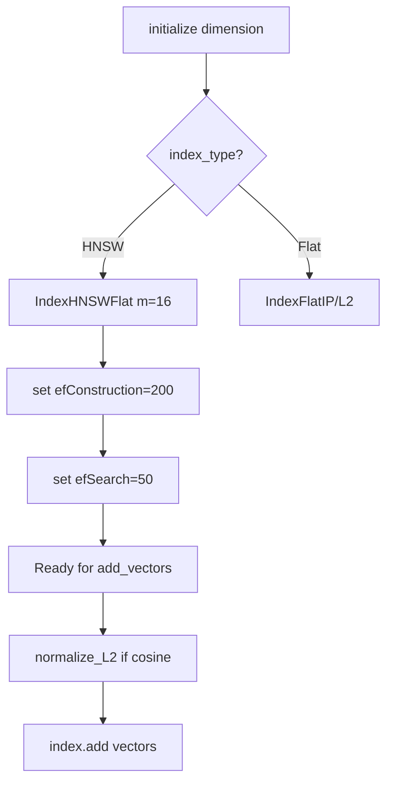
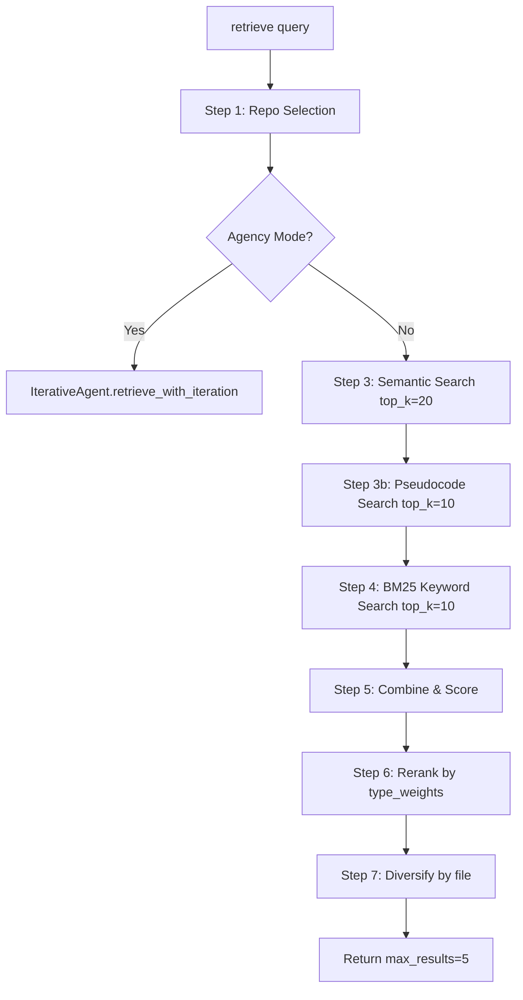
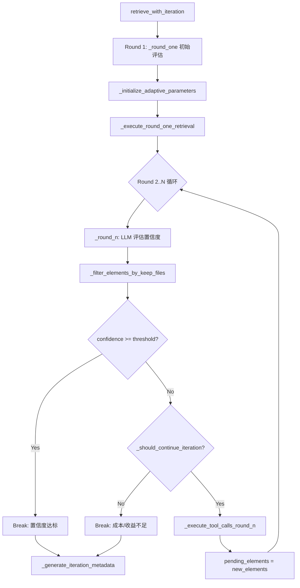

# PD-08.13 FastCode — 三层混合检索 + 置信度驱动迭代 Agent

> 文档编号：PD-08.13
> 来源：FastCode `fastcode/retriever.py`, `fastcode/vector_store.py`, `fastcode/iterative_agent.py`
> GitHub：https://github.com/HKUDS/FastCode.git
> 问题域：PD-08 搜索与检索 Search & Retrieval
> 状态：可复用方案

---

## 第 1 章 问题与动机

### 1.1 核心问题

代码仓库级别的语义检索面临三重挑战：

1. **语义鸿沟**：用户自然语言查询与代码标识符之间存在巨大语义差距，单一向量检索无法覆盖关键词精确匹配场景（如搜索 `BM25Okapi` 类名）
2. **多仓库噪声**：当索引包含数十个仓库时，检索结果会被无关仓库的代码污染，需要先缩小搜索范围再精确检索
3. **单轮检索不足**：复杂代码问题（如"这个函数的调用链是什么"）需要多轮渐进式检索，单次 top-k 无法覆盖完整上下文

### 1.2 FastCode 的解法概述

FastCode 构建了一个三层混合检索 + 迭代 Agent 的代码理解系统：

1. **FAISS HNSW 语义搜索** — 用 `sentence-transformers/paraphrase-multilingual-MiniLM-L12-v2` 嵌入代码元素，FAISS HNSW 索引实现毫秒级近似最近邻搜索（`fastcode/vector_store.py:55-86`）
2. **BM25 关键词搜索** — 对代码元素的名称、签名、docstring、代码片段进行分词，构建 BM25Okapi 索引实现精确关键词匹配（`fastcode/retriever.py:97-141`）
3. **NetworkX 代码关系图遍历** — 构建调用图、依赖图、继承图三种关系图，通过图遍历扩展检索结果（`fastcode/graph_builder.py:20-133`）
4. **IterativeAgent 多轮迭代检索** — LLM 驱动的置信度评估 + 自适应参数调整 + 成本预算控制，最多 4-6 轮迭代直到置信度达标（`fastcode/iterative_agent.py:20-343`）
5. **两阶段仓库选择** — 先用 LLM 或 embedding+BM25 从仓库概览中选出相关仓库，再在选中仓库内精确检索（`fastcode/retriever.py:251-286`）

### 1.3 设计思想

| 设计原则 | 具体实现 | 理由 | 替代方案 |
|----------|----------|------|----------|
| 混合检索互补 | 语义(0.5) + 关键词(0.5) + 图(0.1) 加权融合 | 语义覆盖意图，关键词覆盖精确匹配，图覆盖关联代码 | 单一向量检索（召回率低） |
| 两阶段检索 | 先选仓库再选文件，filtered 索引与 full 索引分离 | 多仓库场景下避免跨仓库噪声，filtered 索引加速检索 | 全局搜索 + 后过滤（慢且噪声大） |
| 置信度驱动迭代 | LLM 评估 0-100 置信度，< 95 则继续检索 | 简单问题 2 轮即可，复杂问题自动增加轮次 | 固定轮次（浪费或不足） |
| 自适应参数 | 根据查询复杂度动态调整 max_iterations/confidence_threshold/line_budget | 简单查询用小预算快速完成，复杂查询给足资源 | 固定参数（一刀切） |
| 成本预算控制 | max_total_lines=12000 行硬限 + ROI 分析 + 递减收益检测 | 防止迭代失控消耗过多 token | 无限制迭代（成本爆炸） |

---

## 第 2 章 源码实现分析

### 2.1 架构概览

FastCode 的检索管线是一个 7 阶段流水线，外层由 IterativeAgent 驱动多轮迭代：

```
┌─────────────────────────────────────────────────────────────────┐
│                    IterativeAgent (多轮控制)                      │
│  ┌──────────┐    ┌──────────┐    ┌──────────┐    ┌──────────┐  │
│  │ Round 1   │───→│ Round 2   │───→│ Round 3   │───→│ Round N   │  │
│  │ 初始评估  │    │ 置信度评估│    │ 工具调用  │    │ 终止判断  │  │
│  └──────────┘    └──────────┘    └──────────┘    └──────────┘  │
│       │                │                │                │      │
│       ▼                ▼                ▼                ▼      │
│  ┌─────────────────────────────────────────────────────────┐   │
│  │              HybridRetriever (单轮检索)                  │   │
│  │  ┌─────────┐  ┌─────────┐  ┌─────────┐  ┌──────────┐  │   │
│  │  │ Semantic │  │ BM25    │  │ Graph   │  │ Rerank + │  │   │
│  │  │ Search   │  │ Search  │  │ Expand  │  │ Diversify│  │   │
│  │  └─────────┘  └─────────┘  └─────────┘  └──────────┘  │   │
│  └─────────────────────────────────────────────────────────┘   │
│       │                                                         │
│       ▼                                                         │
│  ┌─────────────────────────────────────────────────────────┐   │
│  │              VectorStore (FAISS HNSW)                    │   │
│  │  full_index ──→ filtered_index (per-repo reload)        │   │
│  └─────────────────────────────────────────────────────────┘   │
└─────────────────────────────────────────────────────────────────┘
```

### 2.2 核心实现

#### 2.2.1 FAISS HNSW 向量存储



对应源码 `fastcode/vector_store.py:55-86`：

```python
def initialize(self, dimension: int):
    self.dimension = dimension
    if self.index_type == "HNSW":
        if self.distance_metric == "cosine":
            index = faiss.IndexHNSWFlat(dimension, self.m, faiss.METRIC_INNER_PRODUCT)
        else:
            index = faiss.IndexHNSWFlat(dimension, self.m, faiss.METRIC_L2)
        index.hnsw.efConstruction = self.ef_construction
        index.hnsw.efSearch = self.ef_search
        self.index = index
    else:
        if self.distance_metric == "cosine":
            self.index = faiss.IndexFlatIP(dimension)
        else:
            self.index = faiss.IndexFlatL2(dimension)
```

关键设计：HNSW 参数 `m=16, efConstruction=200, efSearch=50` 在构建质量和搜索速度之间取得平衡。cosine 距离通过 L2 归一化 + 内积实现，避免了每次搜索时的归一化开销。

#### 2.2.2 HybridRetriever 7 阶段检索管线



对应源码 `fastcode/retriever.py:184-389`：

```python
def retrieve(self, query, filters=None, repo_filter=None, 
             enable_file_selection=True, use_agency_mode=None,
             dialogue_history=None):
    # STEP 1: Repository Selection
    if self.select_repos_by_overview:
        if len(effective_repos) > 1:
            if self.repo_selection_method == "llm":
                selected_repos = self._select_relevant_repositories_by_llm(
                    search_text4repo_selection, self.top_repos_to_search,
                    scope_repos=repo_filter)
            else:
                selected_repos = self._select_relevant_repositories(
                    search_text4repo_selection, keywords, self.top_repos_to_search)
    
    # STEP 2: Agency Mode or Standard
    if should_use_agency and self.iterative_agent:
        return self._apply_agency_mode(query_str, [], query_info, repo_filter, dialogue_history)
    
    # STEP 3-7: Standard Pipeline
    semantic_results = self._semantic_search(search_text4semantic, top_k=20, repo_filter=repo_filter)
    keyword_results = self._keyword_search(keyword_query, top_k=10, repo_filter=repo_filter)
    combined_results = self._combine_results(semantic_results, keyword_results, pseudocode_results)
    final_results = self._rerank(query_str, combined_results)
    final_results = self._diversify(final_results)
```

#### 2.2.3 结果融合与多样性控制

`_combine_results` 方法（`fastcode/retriever.py:837-907`）通过 element ID 去重合并三路结果，BM25 分数归一化到 0-1 后按权重加权。`_diversify` 方法（`fastcode/retriever.py:1016-1043`）对同一文件的重复结果施加 `diversity_penalty=0.1` 的衰减因子，避免结果被单个大文件垄断。

Rerank 阶段（`fastcode/retriever.py:964-987`）按元素类型加权：function(1.2) > class(1.1) > file(0.9) > documentation(0.8)，优先返回函数级别的精确结果。

### 2.3 实现细节

#### 2.3.1 IterativeAgent 多轮迭代控制



对应源码 `fastcode/iterative_agent.py:154-343`：

```python
def retrieve_with_iteration(self, query, processed_query, query_info, 
                            repo_filter=None, dialogue_history=None):
    # Round 1: Initial assessment
    round1_result = self._round_one(query, processed_query, query_info, repo_filter, dialogue_history)
    query_complexity = round1_result.get("query_complexity", 50)
    self._initialize_adaptive_parameters(query_complexity)
    
    # Iterative rounds (2 to n)
    while current_round <= self.max_iterations:
        round_result = self._round_n(query, current_elements, query_info, current_round, dialogue_history)
        
        # Filter elements based on keep_files
        retained_elements = self._filter_elements_by_keep_files(
            current_elements, round_result["keep_files"])
        
        confidence = round_result["confidence"]
        if confidence >= self.confidence_threshold:
            break
        
        # Cost-benefit analysis
        if not self._should_continue_iteration(current_round, confidence, 
                                                current_elements, query_complexity):
            break
        
        # Execute tool calls for next round
        new_elements = self._execute_tool_calls_round_n(
            query, round_result["tool_calls"], repo_filter, current_elements)
        pending_elements = new_elements
        current_round += 1
```

#### 2.3.2 自适应参数调整

`_initialize_adaptive_parameters`（`fastcode/iterative_agent.py:109-152`）根据查询复杂度动态调整三个关键参数：

- **max_iterations**: 简单查询 2-3 轮，复杂查询 4-6 轮
- **confidence_threshold**: 复杂查询降低到 90（避免过度迭代），简单查询保持 95
- **line_budget**: 简单查询 60% 预算（~7200 行），复杂查询 100%（~12000 行）

#### 2.3.3 五重停止条件

`_should_continue_iteration`（`fastcode/iterative_agent.py:2268-2347`）实现了五重停止判断：

1. 置信度达标（confidence >= threshold）
2. 硬迭代上限（round >= max_iterations）
3. 行预算耗尽（total_lines >= adaptive_line_budget）
4. 停滞检测（连续两轮置信度变化 < 1.0）
5. 递减收益（连续两轮 low performance：显著下降或低 ROI）

#### 2.3.4 Full/Filtered 双索引架构

`reload_specific_repositories`（`fastcode/retriever.py:1129-1227`）实现了 full 索引和 filtered 索引的分离：

- **full_bm25 / full_bm25_elements**: 全量索引，用于仓库选择阶段，永不清除
- **filtered_bm25 / filtered_vector_store**: 按选中仓库重建的子索引，用于实际检索

这种设计避免了每次查询都在全量索引上过滤，同时保证仓库选择阶段能看到所有仓库。


---

## 第 3 章 迁移指南

### 3.1 迁移清单

**阶段 1：基础混合检索（1-2 天）**
- [ ] 安装依赖：`faiss-cpu`, `rank-bm25`, `sentence-transformers`, `networkx`
- [ ] 实现 VectorStore 类：FAISS HNSW 初始化 + cosine 归一化
- [ ] 实现 BM25 索引构建：代码元素多字段拼接 + 分词
- [ ] 实现 `_combine_results`：三路加权融合 + ID 去重

**阶段 2：多仓库支持（1-2 天）**
- [ ] 实现 Full/Filtered 双索引架构
- [ ] 实现仓库概览的独立存储（`repo_overviews.pkl`）
- [ ] 实现 LLM 仓库选择（`RepositorySelector`）
- [ ] 实现 `reload_specific_repositories` 按需加载子索引

**阶段 3：迭代 Agent（2-3 天）**
- [ ] 实现 IterativeAgent 的 Round 1 初始评估
- [ ] 实现 Round N 置信度评估 + keep_files 过滤
- [ ] 实现自适应参数调整（复杂度 → 迭代次数/阈值/预算）
- [ ] 实现五重停止条件 + ROI 分析

### 3.2 适配代码模板

以下是一个可直接运行的最小混合检索器模板：

```python
import numpy as np
import faiss
from rank_bm25 import BM25Okapi
from sentence_transformers import SentenceTransformer
from typing import List, Dict, Tuple, Optional
from dataclasses import dataclass


@dataclass
class CodeElement:
    id: str
    name: str
    code: str
    file_path: str
    element_type: str  # file, class, function
    docstring: str = ""
    signature: str = ""


class MinimalHybridRetriever:
    """FastCode 风格的最小混合检索器"""
    
    def __init__(self, model_name="sentence-transformers/all-MiniLM-L6-v2",
                 semantic_weight=0.5, keyword_weight=0.5):
        self.embedder = SentenceTransformer(model_name)
        self.dim = self.embedder.get_sentence_embedding_dimension()
        self.semantic_weight = semantic_weight
        self.keyword_weight = keyword_weight
        
        # FAISS HNSW index
        self.index = faiss.IndexHNSWFlat(self.dim, 16, faiss.METRIC_INNER_PRODUCT)
        self.index.hnsw.efConstruction = 200
        self.index.hnsw.efSearch = 50
        self.metadata: List[Dict] = []
        
        # BM25 index
        self.bm25 = None
        self.bm25_corpus: List[List[str]] = []
        self.elements: List[CodeElement] = []
    
    def index_elements(self, elements: List[CodeElement]):
        """索引代码元素到 FAISS + BM25"""
        self.elements = elements
        
        # 1. 构建嵌入文本
        texts = []
        for elem in elements:
            text = f"Type: {elem.element_type}\nName: {elem.name}\n"
            if elem.signature:
                text += f"Signature: {elem.signature}\n"
            if elem.docstring:
                text += f"Doc: {elem.docstring}\n"
            text += f"Code:\n{elem.code[:2000]}"
            texts.append(text)
        
        # 2. 生成嵌入并添加到 FAISS
        embeddings = self.embedder.encode(texts, normalize_embeddings=True,
                                           convert_to_numpy=True)
        embeddings = embeddings.astype(np.float32)
        self.index.add(embeddings)
        self.metadata = [{"id": e.id, "name": e.name, "file_path": e.file_path,
                          "type": e.element_type} for e in elements]
        
        # 3. 构建 BM25 索引
        for elem in elements:
            tokens = f"{elem.name} {elem.element_type} {elem.docstring} {elem.code[:1000]}".lower().split()
            self.bm25_corpus.append(tokens)
        self.bm25 = BM25Okapi(self.bm25_corpus)
    
    def search(self, query: str, top_k: int = 5) -> List[Dict]:
        """混合检索：语义 + BM25 加权融合"""
        # 语义搜索
        q_emb = self.embedder.encode([query], normalize_embeddings=True).astype(np.float32)
        distances, indices = self.index.search(q_emb, min(top_k * 3, len(self.metadata)))
        
        combined = {}
        for dist, idx in zip(distances[0], indices[0]):
            if idx == -1:
                continue
            eid = self.metadata[idx]["id"]
            combined[eid] = {
                "element": self.metadata[idx],
                "semantic_score": float(dist) * self.semantic_weight,
                "keyword_score": 0.0,
            }
        
        # BM25 搜索
        if self.bm25:
            scores = self.bm25.get_scores(query.lower().split())
            max_score = max(scores) if max(scores) > 0 else 1.0
            top_indices = np.argsort(scores)[::-1][:top_k * 3]
            for idx in top_indices:
                if scores[idx] > 0:
                    eid = self.elements[idx].id
                    norm_score = (scores[idx] / max_score) * self.keyword_weight
                    if eid in combined:
                        combined[eid]["keyword_score"] = norm_score
                    else:
                        combined[eid] = {
                            "element": self.metadata[idx],
                            "semantic_score": 0.0,
                            "keyword_score": norm_score,
                        }
        
        # 融合排序
        for v in combined.values():
            v["total_score"] = v["semantic_score"] + v["keyword_score"]
        
        results = sorted(combined.values(), key=lambda x: x["total_score"], reverse=True)
        return results[:top_k]
```

### 3.3 适用场景

| 场景 | 适用度 | 说明 |
|------|--------|------|
| 多仓库代码问答 | ⭐⭐⭐ | 两阶段检索 + 迭代 Agent 专为此设计 |
| 单仓库代码搜索 | ⭐⭐⭐ | 混合检索 + 图扩展效果好，可关闭仓库选择 |
| 实时代码补全 | ⭐⭐ | HNSW 搜索快，但迭代 Agent 延迟高，需关闭 agency mode |
| 文档/注释检索 | ⭐⭐ | BM25 对自然语言文档效果好，但索引粒度偏向代码 |
| 大规模仓库（>100 万行） | ⭐⭐ | HNSW 可扩展，但 BM25 全量索引内存占用大 |

---

## 第 4 章 测试用例

```python
import pytest
import numpy as np
from unittest.mock import MagicMock, patch
from dataclasses import dataclass


@dataclass
class MockCodeElement:
    id: str
    name: str
    type: str
    code: str
    file_path: str
    relative_path: str
    language: str = "python"
    start_line: int = 1
    end_line: int = 50
    signature: str = ""
    docstring: str = ""
    summary: str = ""
    metadata: dict = None
    repo_name: str = "test-repo"
    repo_url: str = ""
    
    def __post_init__(self):
        if self.metadata is None:
            self.metadata = {}
    
    def to_dict(self):
        return {
            "id": self.id, "name": self.name, "type": self.type,
            "code": self.code, "file_path": self.file_path,
            "relative_path": self.relative_path, "repo_name": self.repo_name,
            "start_line": self.start_line, "end_line": self.end_line,
        }


class TestHybridRetrieverCombineResults:
    """测试三路结果融合逻辑"""
    
    def test_semantic_only(self):
        """纯语义结果应按 semantic_weight 加权"""
        from fastcode.retriever import HybridRetriever
        config = {"retrieval": {"semantic_weight": 0.6, "keyword_weight": 0.3, "graph_weight": 0.1}}
        retriever = HybridRetriever.__new__(HybridRetriever)
        retriever.semantic_weight = 0.6
        retriever.keyword_weight = 0.3
        retriever.graph_weight = 0.1
        
        semantic = [
            ({"id": "a", "name": "func_a"}, 0.9),
            ({"id": "b", "name": "func_b"}, 0.7),
        ]
        results = retriever._combine_results(semantic, [], None)
        assert len(results) == 2
        assert results[0]["element"]["id"] == "a"
        assert abs(results[0]["semantic_score"] - 0.9 * 0.6) < 0.01
    
    def test_dedup_across_sources(self):
        """同一 element 出现在语义和关键词结果中应合并分数"""
        from fastcode.retriever import HybridRetriever
        retriever = HybridRetriever.__new__(HybridRetriever)
        retriever.semantic_weight = 0.5
        retriever.keyword_weight = 0.5
        
        semantic = [({"id": "x", "name": "foo"}, 0.8)]
        keyword = [({"id": "x", "name": "foo"}, 5.0)]  # BM25 raw score
        results = retriever._combine_results(semantic, keyword, None)
        assert len(results) == 1
        assert results[0]["semantic_score"] > 0
        assert results[0]["keyword_score"] > 0
        assert results[0]["total_score"] > results[0]["semantic_score"]
    
    def test_pseudocode_boost(self):
        """伪代码搜索结果应额外加分"""
        from fastcode.retriever import HybridRetriever
        retriever = HybridRetriever.__new__(HybridRetriever)
        retriever.semantic_weight = 0.5
        retriever.keyword_weight = 0.5
        
        semantic = [({"id": "a"}, 0.8)]
        pseudocode = [({"id": "a"}, 0.7)]
        results = retriever._combine_results(semantic, [], pseudocode)
        assert results[0]["pseudocode_score"] > 0


class TestDiversification:
    """测试结果多样性控制"""
    
    def test_same_file_penalty(self):
        """同一文件的多个结果应被惩罚"""
        from fastcode.retriever import HybridRetriever
        retriever = HybridRetriever.__new__(HybridRetriever)
        retriever.diversity_penalty = 0.1
        
        results = [
            {"element": {"file_path": "a.py"}, "total_score": 1.0,
             "semantic_score": 1.0, "keyword_score": 0, "pseudocode_score": 0, "graph_score": 0},
            {"element": {"file_path": "a.py"}, "total_score": 0.9,
             "semantic_score": 0.9, "keyword_score": 0, "pseudocode_score": 0, "graph_score": 0},
            {"element": {"file_path": "b.py"}, "total_score": 0.85,
             "semantic_score": 0.85, "keyword_score": 0, "pseudocode_score": 0, "graph_score": 0},
        ]
        diversified = retriever._diversify(results)
        # b.py 的结果应排在第二个 a.py 之前（因为第二个 a.py 被惩罚）
        assert diversified[0]["element"]["file_path"] == "a.py"
        assert diversified[1]["element"]["file_path"] == "b.py"


class TestIterativeAgentStopConditions:
    """测试迭代 Agent 的停止条件"""
    
    def test_confidence_threshold_stop(self):
        """置信度达标应停止迭代"""
        from fastcode.iterative_agent import IterativeAgent
        agent = IterativeAgent.__new__(IterativeAgent)
        agent.confidence_threshold = 95
        agent.max_iterations = 6
        agent.adaptive_line_budget = 12000
        agent.min_confidence_gain = 5
        agent.iteration_history = [
            {"round": 1, "confidence": 80, "total_lines": 3000, "confidence_gain": 0},
            {"round": 2, "confidence": 96, "total_lines": 5000, "confidence_gain": 16},
        ]
        agent.logger = MagicMock()
        
        result = agent._should_continue_iteration(3, 96, [], 50)
        assert result is False
    
    def test_budget_exceeded_stop(self):
        """行预算耗尽应停止迭代"""
        from fastcode.iterative_agent import IterativeAgent
        agent = IterativeAgent.__new__(IterativeAgent)
        agent.confidence_threshold = 95
        agent.max_iterations = 6
        agent.adaptive_line_budget = 12000
        agent.min_confidence_gain = 5
        agent.iteration_history = [
            {"round": 1, "confidence": 60, "total_lines": 11000, "confidence_gain": 0},
        ]
        agent.logger = MagicMock()
        
        # Mock _calculate_total_lines to return over budget
        agent._calculate_total_lines = lambda x: 13000
        result = agent._should_continue_iteration(2, 70, [], 50)
        assert result is False
```


---

## 第 5 章 跨域关联

| 关联域 | 关系类型 | 说明 |
|--------|----------|------|
| PD-01 上下文管理 | 协同 | IterativeAgent 的 `max_total_lines` 行预算本质上是上下文窗口管理，防止检索结果超出 LLM 上下文限制 |
| PD-02 多 Agent 编排 | 协同 | IterativeAgent 是一个单 Agent 迭代模式，可扩展为多 Agent 并行检索（如按仓库分 Agent） |
| PD-03 容错与重试 | 依赖 | `_round_n` 的 LLM 调用失败时返回 fallback 结果（confidence=85, tool_calls=[]），不中断迭代流程 |
| PD-04 工具系统 | 依赖 | AgentTools 提供 `search_codebase` 和 `list_directory` 两个只读工具，受 `repo_root` 安全边界约束 |
| PD-06 记忆持久化 | 协同 | BM25 索引通过 pickle 持久化，FAISS 索引通过 `faiss.write_index` 持久化，支持增量加载 |
| PD-11 可观测性 | 协同 | `_generate_iteration_metadata` 输出详细的效率分析：ROI、budget_used_pct、stopping_reason、efficiency_rating |
| PD-12 推理增强 | 协同 | QueryProcessor 用 LLM 重写查询、生成伪代码提示、检测意图，增强检索精度 |

---

## 第 6 章 来源文件索引

| 文件 | 行范围 | 关键实现 |
|------|--------|----------|
| `fastcode/retriever.py` | L23-L96 | HybridRetriever 类定义，三层权重配置，双索引架构 |
| `fastcode/retriever.py` | L97-L141 | BM25 索引构建：多字段拼接 + 空格分词 |
| `fastcode/retriever.py` | L184-L389 | retrieve() 主入口：7 阶段检索管线 |
| `fastcode/retriever.py` | L517-L592 | LLM 仓库选择 + 模糊匹配 + 三级降级 |
| `fastcode/retriever.py` | L727-L835 | 语义搜索 + BM25 搜索 + 三重 repo_filter 安全检查 |
| `fastcode/retriever.py` | L837-L907 | 三路结果融合：语义 + 关键词 + 伪代码加权合并 |
| `fastcode/retriever.py` | L964-L1043 | Rerank（类型权重）+ Diversify（文件去重惩罚） |
| `fastcode/retriever.py` | L1129-L1227 | reload_specific_repositories：Full/Filtered 双索引重建 |
| `fastcode/vector_store.py` | L16-L86 | VectorStore：FAISS HNSW 初始化 + cosine 归一化 |
| `fastcode/vector_store.py` | L115-L182 | search()：向量搜索 + repo_filter + min_score 过滤 |
| `fastcode/vector_store.py` | L184-L356 | 仓库概览独立存储：save/load/search_repository_overviews |
| `fastcode/vector_store.py` | L536-L608 | merge_from_index：跨仓库向量索引合并 |
| `fastcode/iterative_agent.py` | L20-L84 | IterativeAgent 初始化：自适应阈值 + LLM 客户端 |
| `fastcode/iterative_agent.py` | L109-L152 | _initialize_adaptive_parameters：复杂度驱动参数调整 |
| `fastcode/iterative_agent.py` | L154-L343 | retrieve_with_iteration：多轮迭代主循环 |
| `fastcode/iterative_agent.py` | L446-L589 | Round 1 prompt 构建：置信度规则 + 对话历史 + 工具调用指南 |
| `fastcode/iterative_agent.py` | L2268-L2347 | _should_continue_iteration：五重停止条件 + ROI 分析 |
| `fastcode/graph_builder.py` | L20-L133 | CodeGraphBuilder：调用图 + 依赖图 + 继承图构建 |
| `fastcode/embedder.py` | L13-L41 | CodeEmbedder：SentenceTransformer 加载 + 设备自动检测 |
| `fastcode/query_processor.py` | L17-L29 | ProcessedQuery 数据类：rewritten_query + pseudocode_hints |
| `fastcode/indexer.py` | L19-L38 | CodeElement 数据类：统一代码元素表示 |
| `fastcode/repo_selector.py` | L16-L100 | RepositorySelector：LLM 驱动的仓库/文件选择 |
| `fastcode/agent_tools.py` | L15-L100 | AgentTools：安全路径解析 + list_directory + search_codebase |
| `config/config.yaml` | L1-L207 | 全局配置：检索权重、Agent 参数、HNSW 参数 |

---

## 第 7 章 横向对比维度

```json comparison_data
{
  "project": "FastCode",
  "dimensions": {
    "搜索架构": "FAISS HNSW 语义 + BM25 关键词 + NetworkX 图遍历三层混合，IterativeAgent 多轮迭代",
    "去重机制": "element ID 去重合并三路分数，containment-aware 去重消除包含关系重复",
    "结果处理": "类型权重 Rerank + 文件级 diversity_penalty 多样性控制",
    "容错策略": "LLM 仓库选择三级降级（LLM→embedding+BM25→scope_repos），Round N 失败返回 fallback",
    "成本控制": "max_total_lines 行预算 + ROI 分析 + 五重停止条件 + 自适应参数",
    "检索方式": "两阶段：先 LLM/embedding 选仓库，再 filtered 索引精确检索",
    "索引结构": "Full/Filtered 双索引分离，per-repo pickle 持久化，仓库概览独立存储",
    "排序策略": "三路加权融合(semantic 0.5 + keyword 0.5 + pseudocode 0.4) + 类型权重 Rerank",
    "缓存机制": "index_scan_cache TTL=30s 缓存仓库扫描结果，BM25/FAISS pickle 持久化",
    "扩展性": "配置驱动（config.yaml），支持 OpenAI/Anthropic 双 LLM 后端，多仓库动态加载"
  }
}
```

### 域元数据补充

```json domain_metadata
{
  "solution_summary": "FastCode 用 FAISS HNSW + BM25 + NetworkX 三层混合检索，配合 IterativeAgent 置信度驱动多轮迭代（最多 6 轮）和自适应行预算控制实现多仓库代码精确定位",
  "description": "代码仓库级混合检索需要迭代式置信度驱动的自适应检索深度控制",
  "sub_problems": [
    "置信度驱动迭代深度：如何用 LLM 评估检索充分性并动态决定是否继续检索",
    "自适应检索预算：如何根据查询复杂度动态调整迭代次数、置信度阈值和行预算",
    "Full/Filtered 双索引：多仓库场景下如何分离全量索引与按需子索引避免跨仓库噪声",
    "仓库选择降级链：LLM 选仓库失败时如何逐级降级到 embedding+BM25 再到用户原始选择"
  ],
  "best_practices": [
    "Full/Filtered 双索引分离：全量索引用于仓库选择，按需重建子索引用于精确检索，避免跨仓库噪声",
    "五重停止条件防止迭代失控：置信度达标、硬迭代上限、行预算耗尽、停滞检测、递减收益缺一不可",
    "类型权重 Rerank 优先返回函数级结果：function(1.2) > class(1.1) > file(0.9)，代码问答场景函数粒度最有价值"
  ]
}
```

