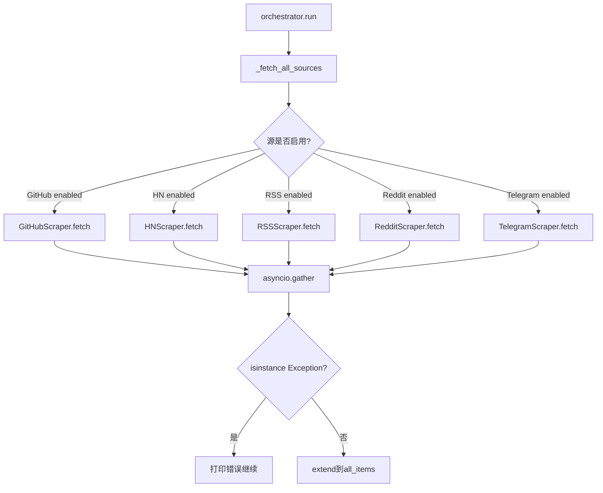
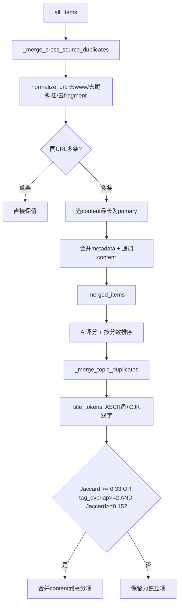
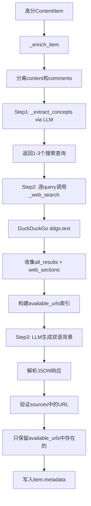

# PD-08.01 Horizon — 五源并发聚合与 Web 搜索增强检索管线

> 文档编号：PD-08.01
> 来源：Horizon `src/search.py` `src/ai/enricher.py` `src/orchestrator.py`
> GitHub：https://github.com/Thysrael/Horizon.git
> 问题域：PD-08 搜索与检索 Search & Retrieval
> 状态：可复用方案

---

## 第 1 章 问题与动机

### 1.1 核心问题

信息聚合类 Agent 面临的核心检索挑战：如何从 HN、RSS、Reddit、Telegram、GitHub 等异构信息源并发抓取内容，并在抓取后通过 Web 搜索为高分内容补充背景知识，形成"采集→评分→搜索增强→摘要"的完整检索管线。

传统做法是串行抓取各源、手动整理，存在三个痛点：
1. **多源异构**：每个平台 API 格式不同（JSON API / RSS XML / HTML 爬取），需要统一数据模型
2. **信息过载**：五源并发可能产生数百条内容，需要 AI 评分过滤 + 语义去重
3. **上下文缺失**：原始抓取内容缺乏背景知识，读者难以理解技术新闻的意义

### 1.2 Horizon 的解法概述

Horizon 采用"五源并发采集 → AI 评分过滤 → 双层去重 → Web 搜索增强 → 双语摘要"的管线架构：

1. **统一数据模型 ContentItem**（`src/models.py:18-36`）：Pydantic BaseModel 统一五种源的数据结构，包含 `source_type`、`ai_score`、`ai_tags` 等字段
2. **BaseScraper 抽象基类**（`src/scrapers/base.py:11-47`）：定义 `fetch(since)` 接口，五个 Scraper 子类各自实现平台特定逻辑
3. **asyncio.gather 并发采集**（`src/orchestrator.py:200-201`）：所有源同时发起请求，`return_exceptions=True` 确保单源失败不影响整体
4. **双层去重**（`src/orchestrator.py:252-382`）：URL 归一化去重 + Jaccard 标题相似度语义去重
5. **DuckDuckGo Web 搜索增强**（`src/ai/enricher.py:52-74`）：对高分内容用 LLM 提取概念 → ddgs 搜索背景 → LLM 生成双语解读

### 1.3 设计思想

| 设计原则 | 具体实现 | 理由 | 替代方案 |
|----------|----------|------|----------|
| 统一数据模型 | ContentItem Pydantic 模型统一五源 | 下游 AI 分析/去重/摘要无需关心来源差异 | 每源独立模型 + 适配器 |
| 并发优先 | asyncio.gather + return_exceptions | 五源独立无依赖，并发可将延迟从串行 5x 降到 1x | 串行逐源抓取 |
| AI 评分门控 | 先评分过滤再搜索增强 | 搜索增强成本高（LLM + Web 搜索），只对高分内容执行 | 全量搜索增强 |
| 双层去重 | URL 归一化 + 标题 Jaccard 语义去重 | URL 去重处理精确重复，语义去重处理同一事件的不同报道 | 仅 URL 去重 |
| 概念驱动搜索 | LLM 先提取需解释的概念再搜索 | 避免盲目搜索，精准补充读者可能不了解的技术背景 | 直接用标题搜索 |
| 引用验证 | 只保留搜索结果中实际存在的 URL | 防止 LLM 幻觉生成虚假引用 | 信任 LLM 输出的所有 URL |

---

## 第 2 章 源码实现分析

### 2.1 架构概览

Horizon 的检索管线是一个 7 阶段流水线，由 `HorizonOrchestrator.run()` 驱动：

```
┌─────────────────────────────────────────────────────────────────┐
│                    HorizonOrchestrator.run()                     │
├─────────────────────────────────────────────────────────────────┤
│                                                                  │
│  ┌──────────┐  ┌──────────┐  ┌──────────┐  ┌──────────┐  ┌──────────┐ │
│  │ GitHub   │  │   HN     │  │   RSS    │  │  Reddit  │  │ Telegram │ │
│  │ Scraper  │  │ Scraper  │  │ Scraper  │  │ Scraper  │  │ Scraper  │ │
│  └────┬─────┘  └────┬─────┘  └────┬─────┘  └────┬─────┘  └────┬─────┘ │
│       │              │              │              │              │      │
│       └──────────────┴──────┬───────┴──────────────┴──────────────┘      │
│                             ▼                                            │
│                   ┌──────────────────┐                                   │
│                   │ URL 归一化去重    │                                   │
│                   └────────┬─────────┘                                   │
│                            ▼                                             │
│                   ┌──────────────────┐                                   │
│                   │ AI 评分 (1st pass)│                                   │
│                   └────────┬─────────┘                                   │
│                            ▼                                             │
│                   ┌──────────────────┐                                   │
│                   │ 标题语义去重      │                                   │
│                   └────────┬─────────┘                                   │
│                            ▼                                             │
│              ┌─────────────────────────────┐                             │
│              │ Web 搜索增强 (2nd AI pass)   │                             │
│              │ ┌─────────┐  ┌───────────┐  │                             │
│              │ │概念提取  │→│DuckDuckGo │  │                             │
│              │ │  (LLM)  │  │  搜索     │  │                             │
│              │ └─────────┘  └─────┬─────┘  │                             │
│              │              ┌─────▼─────┐  │                             │
│              │              │背景生成    │  │                             │
│              │              │(LLM+引用) │  │                             │
│              │              └───────────┘  │                             │
│              └─────────────┬───────────────┘                             │
│                            ▼                                             │
│                   ┌──────────────────┐                                   │
│                   │ 双语摘要生成      │                                   │
│                   └──────────────────┘                                   │
└─────────────────────────────────────────────────────────────────┘
```

### 2.2 核心实现

#### 2.2.1 五源并发采集



对应源码 `src/orchestrator.py:163-211`：

```python
async def _fetch_all_sources(self, since: datetime) -> List[ContentItem]:
    async with httpx.AsyncClient(timeout=30.0) as client:
        tasks = []
        if self.config.sources.github:
            github_scraper = GitHubScraper(self.config.sources.github, client)
            tasks.append(self._fetch_with_progress("GitHub", github_scraper, since))
        if self.config.sources.hackernews.enabled:
            hn_scraper = HackerNewsScraper(self.config.sources.hackernews, client)
            tasks.append(self._fetch_with_progress("Hacker News", hn_scraper, since))
        if self.config.sources.rss:
            rss_scraper = RSSScraper(self.config.sources.rss, client)
            tasks.append(self._fetch_with_progress("RSS Feeds", rss_scraper, since))
        if self.config.sources.reddit.enabled:
            reddit_scraper = RedditScraper(self.config.sources.reddit, client)
            tasks.append(self._fetch_with_progress("Reddit", reddit_scraper, since))
        if self.config.sources.telegram.enabled:
            telegram_scraper = TelegramScraper(self.config.sources.telegram, client)
            tasks.append(self._fetch_with_progress("Telegram", telegram_scraper, since))

        results = await asyncio.gather(*tasks, return_exceptions=True)

        all_items = []
        for result in results:
            if isinstance(result, Exception):
                self.console.print(f"[red]Error fetching source: {result}[/red]")
            elif isinstance(result, list):
                all_items.extend(result)
        return all_items
```

关键设计：共享 `httpx.AsyncClient(timeout=30.0)` 实例，所有 Scraper 复用同一连接池。`return_exceptions=True` 确保单源超时/报错不会导致 `gather` 整体失败。

#### 2.2.2 双层去重机制



对应源码 `src/orchestrator.py:252-382`：

```python
def _merge_cross_source_duplicates(self, items: List[ContentItem]) -> List[ContentItem]:
    def normalize_url(url: str) -> str:
        parsed = urlparse(str(url))
        host = parsed.hostname or ""
        if host.startswith("www."):
            host = host[4:]
        path = parsed.path.rstrip("/")
        return f"{host}{path}"

    url_groups: Dict[str, List[ContentItem]] = {}
    for item in items:
        key = normalize_url(str(item.url))
        url_groups.setdefault(key, []).append(item)

    merged = []
    for key, group in url_groups.items():
        if len(group) == 1:
            merged.append(group[0])
            continue
        primary = max(group, key=lambda x: len(x.content or ""))
        all_sources = set()
        for item in group:
            all_sources.add(item.source_type.value)
            for mk, mv in item.metadata.items():
                if mk not in primary.metadata or not primary.metadata[mk]:
                    primary.metadata[mk] = mv
        primary.metadata["merged_sources"] = list(all_sources)
        merged.append(primary)
    return merged
```

语义去重使用 Jaccard 相似度（`src/orchestrator.py:348-382`），支持 ASCII 词和 CJK 双字组合：

```python
@staticmethod
def _title_tokens(title: str) -> set:
    tokens = set()
    for w in re.findall(r'[a-zA-Z]{3,}', title):
        tokens.add(w.lower())
    cjk = re.sub(r'[^\u4e00-\u9fff]', '', title)
    for i in range(len(cjk) - 1):
        tokens.add(cjk[i:i + 2])
    return tokens
```

#### 2.2.3 Web 搜索增强（概念驱动三步法）



对应源码 `src/ai/enricher.py:109-212`：

```python
@retry(stop=stop_after_attempt(3), wait=wait_exponential(min=2, max=10))
async def _enrich_item(self, item: ContentItem) -> None:
    content_text = ""
    comments_text = ""
    if item.content:
        if "--- Top Comments ---" in item.content:
            main, comments_part = item.content.split("--- Top Comments ---", 1)
            content_text = main.strip()[:4000]
            comments_text = comments_part.strip()[:2000]
        else:
            content_text = item.content[:4000]

    # Step 1: AI identifies concepts to explain
    queries = await self._extract_concepts(item, content_text)

    # Step 2: Search web for each concept
    all_results = []
    web_sections = []
    for query in queries:
        results = await self._web_search(query)
        all_results.extend(results)
        if results:
            lines = [f"- [{r['title']}]({r['url']}): {r['body']}" for r in results]
            web_sections.append(f"**{query}:**\n" + "\n".join(lines))
    web_context = "\n\n".join(web_sections) if web_sections else ""

    # Index of available URLs for citation validation
    available_urls = {r["url"]: r["title"] for r in all_results if r.get("url")}

    # Step 3: AI generates background grounded in search results
    # ... (构建 prompt 并调用 LLM)

    # Store citation sources — only URLs that actually came from our search results
    if result.get("sources") and available_urls:
        valid = [
            {"url": u, "title": available_urls[u]}
            for u in result["sources"]
            if u in available_urls
        ]
        if valid:
            item.metadata["sources"] = valid
```

### 2.3 实现细节

**HN + Reddit 双路关联搜索**（`src/search.py:66-106`）：除了 enricher 的 DuckDuckGo 搜索外，Horizon 还有独立的关联搜索模块，用 HN Algolia API 和 Reddit Search API 为每条内容查找相关讨论：

- HN Algolia：`hn.algolia.com/api/v1/search`，按 `story` 标签过滤，每条取 3 个结果
- Reddit Search：`reddit.com/search.json`，按相关性排序，限制 1 年内，每条取 3 个结果
- Reddit 并发控制：`asyncio.Semaphore(5)` 限制同时 5 个 Reddit 请求（`src/search.py:13`）
- URL 去重：搜索结果中与原始 item URL 相同的结果被过滤（`src/search.py:88-94`）

**Telegram HTML 爬取**（`src/scrapers/telegram.py:49-77`）：Telegram 没有公开 API，Horizon 通过 `t.me/s/{channel}` 的 Web 预览页面用 BeautifulSoup 解析 HTML，提取消息文本、时间戳和外部链接。支持 429 限流重试。

**Reddit 限流处理**（`src/scrapers/reddit.py:197-210`）：检测 429 状态码，读取 `Retry-After` header，等待后重试一次。

**内容截断策略**：
- 正文截断：content_text[:4000]（enricher），content[:800]/[:1000]（analyzer）
- 评论截断：comments_text[:2000]，单条评论[:500]
- 概念提取输入：content[:1000]

**多 AI 提供商支持**（`src/ai/client.py:191-212`）：工厂模式支持 Anthropic/OpenAI/Gemini/Doubao 四种后端，通过 `config.provider` 切换。


---

## 第 3 章 迁移指南

### 3.1 迁移清单

**阶段 1：统一数据模型（1 天）**
- [ ] 定义 `ContentItem` Pydantic 模型，包含 `source_type`、`ai_score`、`ai_tags`、`metadata` 字段
- [ ] 定义 `SourceType` 枚举，列出所有信息源
- [ ] 定义 `BaseScraper` 抽象基类，约定 `fetch(since: datetime) -> List[ContentItem]` 接口

**阶段 2：实现各源 Scraper（2-3 天）**
- [ ] 每个源一个 Scraper 子类，共享 `httpx.AsyncClient`
- [ ] 实现 `_generate_id(source, subtype, native_id)` 确保 ID 全局唯一
- [ ] 对 HTML 源（Telegram）使用 BeautifulSoup 解析
- [ ] 对 JSON API 源（HN/Reddit/GitHub）直接解析响应

**阶段 3：并发采集 + 去重（1 天）**
- [ ] 用 `asyncio.gather(*tasks, return_exceptions=True)` 并发采集
- [ ] 实现 URL 归一化去重（去 www、去尾斜杠、去 fragment）
- [ ] 实现标题 Jaccard 语义去重（ASCII 词 + CJK 双字组合）

**阶段 4：AI 评分 + 搜索增强（1-2 天）**
- [ ] 实现 AI 评分（第一轮 LLM 调用），按阈值过滤
- [ ] 实现概念提取 → Web 搜索 → 背景生成三步法
- [ ] 实现引用 URL 验证（只保留搜索结果中实际存在的 URL）

### 3.2 适配代码模板

#### 多源并发采集框架

```python
import asyncio
from abc import ABC, abstractmethod
from datetime import datetime
from typing import List, Dict, Any
from pydantic import BaseModel, HttpUrl, Field
from enum import Enum
import httpx


class SourceType(str, Enum):
    HACKERNEWS = "hackernews"
    RSS = "rss"
    REDDIT = "reddit"
    # 按需扩展


class ContentItem(BaseModel):
    id: str
    source_type: SourceType
    title: str
    url: HttpUrl
    content: str | None = None
    published_at: datetime
    metadata: Dict[str, Any] = Field(default_factory=dict)
    ai_score: float | None = None
    ai_tags: List[str] = Field(default_factory=list)


class BaseScraper(ABC):
    def __init__(self, config: dict, client: httpx.AsyncClient):
        self.config = config
        self.client = client

    @abstractmethod
    async def fetch(self, since: datetime) -> List[ContentItem]:
        pass

    def _generate_id(self, source: str, subtype: str, native_id: str) -> str:
        return f"{source}:{subtype}:{native_id}"


async def fetch_all_sources(
    scrapers: List[BaseScraper], since: datetime
) -> List[ContentItem]:
    """并发采集所有源，单源失败不影响整体。"""
    tasks = [s.fetch(since) for s in scrapers]
    results = await asyncio.gather(*tasks, return_exceptions=True)

    all_items = []
    for result in results:
        if isinstance(result, Exception):
            print(f"Source failed: {result}")
        elif isinstance(result, list):
            all_items.extend(result)
    return all_items
```

#### 概念驱动 Web 搜索增强

```python
from ddgs import DDGS
import json


async def web_search(query: str, max_results: int = 3) -> list:
    """DuckDuckGo 搜索，失败返回空列表。"""
    try:
        ddgs = DDGS()
        results = ddgs.text(query, max_results=max_results)
        return [
            {"title": r.get("title", ""), "url": r.get("href", ""), "body": r.get("body", "")}
            for r in (results or [])
        ]
    except Exception:
        return []


async def enrich_with_search(
    item: ContentItem, ai_client, concept_prompt: str, enrichment_prompt: str
) -> None:
    """三步法搜索增强：概念提取 → Web 搜索 → 背景生成。"""
    # Step 1: LLM 提取需要解释的概念
    concepts_resp = await ai_client.complete(system=concept_prompt, user=item.title)
    queries = json.loads(concepts_resp).get("queries", [])[:3]

    # Step 2: 逐概念搜索
    all_results = []
    for query in queries:
        results = await web_search(query)
        all_results.extend(results)

    # 构建可引用 URL 索引
    available_urls = {r["url"]: r["title"] for r in all_results if r.get("url")}

    # Step 3: LLM 生成背景（传入搜索结果作为 grounding）
    web_context = "\n".join(
        f"- [{r['title']}]({r['url']}): {r['body']}" for r in all_results
    )
    background_resp = await ai_client.complete(
        system=enrichment_prompt,
        user=f"Title: {item.title}\nSearch Results:\n{web_context}"
    )
    result = json.loads(background_resp)

    # 引用验证：只保留搜索结果中实际存在的 URL
    if result.get("sources"):
        valid_sources = [
            {"url": u, "title": available_urls[u]}
            for u in result["sources"] if u in available_urls
        ]
        item.metadata["sources"] = valid_sources
```

### 3.3 适用场景

| 场景 | 适用度 | 说明 |
|------|--------|------|
| 技术新闻聚合 | ⭐⭐⭐ | Horizon 的核心场景，五源覆盖主流技术社区 |
| 竞品监控 | ⭐⭐⭐ | 配置特定 GitHub 用户/仓库 + 关键词 RSS 即可 |
| 学术论文追踪 | ⭐⭐ | 需新增 arXiv/Semantic Scholar Scraper |
| 实时舆情监控 | ⭐ | 批处理架构，不适合秒级实时需求 |
| 金融数据采集 | ⭐ | 缺少金融数据源适配，需大量定制 |

---

## 第 4 章 测试用例

```python
import pytest
import asyncio
from datetime import datetime, timezone, timedelta
from unittest.mock import AsyncMock, MagicMock, patch
from src.models import ContentItem, SourceType


class TestURLDeduplication:
    """测试 URL 归一化去重。"""

    def _make_item(self, url: str, source: SourceType, content: str = "") -> ContentItem:
        return ContentItem(
            id=f"test:{source.value}:{hash(url)}",
            source_type=source,
            title="Test Item",
            url=url,
            content=content,
            published_at=datetime.now(timezone.utc),
        )

    def test_www_prefix_dedup(self):
        """www 前缀不同的 URL 应被视为同一条。"""
        from src.orchestrator import HorizonOrchestrator
        orch = HorizonOrchestrator.__new__(HorizonOrchestrator)
        items = [
            self._make_item("https://www.example.com/article", SourceType.RSS, "short"),
            self._make_item("https://example.com/article", SourceType.HACKERNEWS, "longer content here"),
        ]
        merged = orch._merge_cross_source_duplicates(items)
        assert len(merged) == 1
        assert "longer content here" in merged[0].content

    def test_trailing_slash_dedup(self):
        """尾斜杠不同的 URL 应被视为同一条。"""
        from src.orchestrator import HorizonOrchestrator
        orch = HorizonOrchestrator.__new__(HorizonOrchestrator)
        items = [
            self._make_item("https://example.com/path/", SourceType.RSS),
            self._make_item("https://example.com/path", SourceType.REDDIT),
        ]
        merged = orch._merge_cross_source_duplicates(items)
        assert len(merged) == 1

    def test_different_urls_kept(self):
        """不同 URL 应保留为独立条目。"""
        from src.orchestrator import HorizonOrchestrator
        orch = HorizonOrchestrator.__new__(HorizonOrchestrator)
        items = [
            self._make_item("https://example.com/a", SourceType.RSS),
            self._make_item("https://example.com/b", SourceType.RSS),
        ]
        merged = orch._merge_cross_source_duplicates(items)
        assert len(merged) == 2


class TestTitleSemanticDedup:
    """测试标题 Jaccard 语义去重。"""

    def test_similar_titles_merged(self):
        """高相似度标题应被合并。"""
        from src.orchestrator import HorizonOrchestrator
        orch = HorizonOrchestrator.__new__(HorizonOrchestrator)
        orch.console = MagicMock()
        items = [
            ContentItem(
                id="a", source_type=SourceType.HACKERNEWS,
                title="OpenAI releases GPT-5 with major improvements",
                url="https://a.com", published_at=datetime.now(timezone.utc),
                ai_score=9.0, ai_tags=["openai", "gpt"],
            ),
            ContentItem(
                id="b", source_type=SourceType.REDDIT,
                title="OpenAI GPT-5 released with significant improvements",
                url="https://b.com", published_at=datetime.now(timezone.utc),
                ai_score=7.0, ai_tags=["openai", "gpt"],
            ),
        ]
        kept = orch._merge_topic_duplicates(items)
        assert len(kept) == 1
        assert kept[0].id == "a"  # 高分项保留

    def test_different_topics_kept(self):
        """不同主题应保留为独立条目。"""
        from src.orchestrator import HorizonOrchestrator
        orch = HorizonOrchestrator.__new__(HorizonOrchestrator)
        orch.console = MagicMock()
        items = [
            ContentItem(
                id="a", source_type=SourceType.HACKERNEWS,
                title="Rust 2.0 released with async improvements",
                url="https://a.com", published_at=datetime.now(timezone.utc),
                ai_score=9.0, ai_tags=["rust"],
            ),
            ContentItem(
                id="b", source_type=SourceType.RSS,
                title="Python 3.14 adds pattern matching enhancements",
                url="https://b.com", published_at=datetime.now(timezone.utc),
                ai_score=8.0, ai_tags=["python"],
            ),
        ]
        kept = orch._merge_topic_duplicates(items)
        assert len(kept) == 2


class TestWebSearch:
    """测试 DuckDuckGo Web 搜索。"""

    @pytest.mark.asyncio
    async def test_search_returns_structured_results(self):
        """搜索应返回 title/url/body 结构。"""
        from src.ai.enricher import ContentEnricher
        enricher = ContentEnricher.__new__(ContentEnricher)
        with patch("src.ai.enricher.DDGS") as mock_ddgs:
            mock_ddgs.return_value.text.return_value = [
                {"title": "Test", "href": "https://example.com", "body": "desc"}
            ]
            results = await enricher._web_search("test query")
            assert len(results) == 1
            assert results[0]["url"] == "https://example.com"

    @pytest.mark.asyncio
    async def test_search_failure_returns_empty(self):
        """搜索失败应返回空列表而非抛异常。"""
        from src.ai.enricher import ContentEnricher
        enricher = ContentEnricher.__new__(ContentEnricher)
        with patch("src.ai.enricher.DDGS", side_effect=Exception("network error")):
            results = await enricher._web_search("test query")
            assert results == []


class TestConcurrentFetch:
    """测试并发采集容错。"""

    @pytest.mark.asyncio
    async def test_single_source_failure_doesnt_block(self):
        """单源失败不应阻塞其他源。"""
        async def failing_fetch(since):
            raise ConnectionError("HN down")

        async def success_fetch(since):
            return [ContentItem(
                id="test:rss:1", source_type=SourceType.RSS,
                title="Test", url="https://example.com",
                published_at=datetime.now(timezone.utc),
            )]

        results = await asyncio.gather(
            failing_fetch(datetime.now()), success_fetch(datetime.now()),
            return_exceptions=True,
        )
        items = []
        for r in results:
            if isinstance(r, list):
                items.extend(r)
        assert len(items) == 1
```


---

## 第 5 章 跨域关联

| 关联域 | 关系类型 | 说明 |
|--------|----------|------|
| PD-01 上下文管理 | 协同 | enricher 对 content_text[:4000]、comments[:2000] 的截断策略是上下文窗口管理的实例 |
| PD-02 多 Agent 编排 | 协同 | orchestrator 的 7 阶段流水线本质是单 Agent 顺序编排，可扩展为多 Agent 并行分析 |
| PD-03 容错与重试 | 依赖 | `return_exceptions=True` 并发容错 + tenacity `@retry` 指数退避 + Reddit 429 限流重试 |
| PD-04 工具系统 | 协同 | DuckDuckGo 搜索和 HN Algolia/Reddit Search 可抽象为可插拔工具 |
| PD-07 质量检查 | 依赖 | AI 评分（0-10 分制）是质量门控的核心，threshold 过滤决定哪些内容进入搜索增强 |
| PD-09 Human-in-the-Loop | 潜在 | 当前全自动，可在 AI 评分后加入人工审核环节 |
| PD-11 可观测性 | 协同 | Rich Progress 进度条 + 每源计数日志提供基本可观测性，缺少成本追踪 |

---

## 第 6 章 来源文件索引

| 文件 | 行范围 | 关键实现 |
|------|--------|----------|
| `src/models.py` | L9-36 | SourceType 枚举 + ContentItem 统一数据模型 |
| `src/models.py` | L38-56 | AIConfig + AIProvider 多提供商配置 |
| `src/scrapers/base.py` | L11-47 | BaseScraper 抽象基类，定义 fetch 接口 |
| `src/scrapers/hackernews.py` | L19-142 | HN Firebase API 抓取 + 评论并发获取 |
| `src/scrapers/reddit.py` | L20-210 | Reddit JSON API 抓取 + 429 限流重试 |
| `src/scrapers/rss.py` | L19-165 | RSS/Atom feedparser 解析 + 环境变量 URL 展开 |
| `src/scrapers/telegram.py` | L21-151 | Telegram Web 预览 HTML 爬取 + BeautifulSoup 解析 |
| `src/scrapers/github.py` | L15-222 | GitHub Events/Releases API 抓取 |
| `src/orchestrator.py` | L25-441 | 7 阶段流水线编排 + 双层去重 |
| `src/orchestrator.py` | L163-211 | asyncio.gather 五源并发采集 |
| `src/orchestrator.py` | L252-304 | URL 归一化跨源去重 |
| `src/orchestrator.py` | L306-382 | Jaccard 标题语义去重（ASCII + CJK） |
| `src/ai/enricher.py` | L24-212 | ContentEnricher 三步搜索增强 |
| `src/ai/enricher.py` | L52-74 | DuckDuckGo Web 搜索封装 |
| `src/ai/enricher.py` | L76-103 | LLM 概念提取（queries[:3] 限制） |
| `src/ai/enricher.py` | L199-207 | 引用 URL 验证（available_urls 白名单） |
| `src/ai/analyzer.py` | L13-141 | AI 评分分析器 + tenacity 重试 |
| `src/ai/prompts.py` | L1-151 | 评分/概念提取/搜索增强三套 prompt |
| `src/ai/client.py` | L15-212 | 四提供商 AI 客户端工厂 |
| `src/ai/summarizer.py` | L60-195 | 纯程序化双语 Markdown 摘要生成 |
| `src/search.py` | L10-106 | HN Algolia + Reddit Search 关联搜索 |
| `src/storage/manager.py` | L9-39 | JSON 配置加载 + Markdown 摘要持久化 |

---

## 第 7 章 横向对比维度

> **重要：** 本章用于自动填充 Butcher Wiki 的横向对比表。
> 必须严格按以下 JSON 格式输出，放在 `comparison_data` 代码块中。

```json comparison_data
{
  "project": "Horizon",
  "dimensions": {
    "搜索架构": "五源并发采集 + DuckDuckGo 概念驱动搜索增强，无向量数据库",
    "去重机制": "双层去重：URL 归一化 + Jaccard 标题语义去重（ASCII+CJK）",
    "结果处理": "AI 评分门控 → 概念提取 → Web 搜索 → 双语背景生成",
    "容错策略": "asyncio.gather return_exceptions + tenacity 指数退避 + 429 限流重试",
    "成本控制": "AI 评分门控只对高分内容执行搜索增强，概念查询限 3 条",
    "搜索源热切换": "config.json 中 enabled 字段控制各源开关，无需改代码",
    "页面内容净化": "Telegram 用 BeautifulSoup 解析 HTML，HN 评论用 regex 去标签",
    "采集频率分级": "统一 time_window_hours 窗口，各源独立 min_score/fetch_limit 阈值",
    "搜索结果字段归一化": "五源统一映射到 ContentItem 模型，metadata 存源特有字段",
    "引用验证": "available_urls 白名单校验，只保留搜索结果中实际存在的 URL"
  }
}
```

### 域元数据补充

> **重要：** 本节用于自动丰富 Butcher Wiki 的问题域描述。

```json domain_metadata
{
  "solution_summary": "Horizon 用 asyncio.gather 五源并发采集 + DuckDuckGo 概念驱动三步搜索增强，双层去重（URL归一化+Jaccard语义）过滤后对高分内容生成双语背景知识",
  "description": "信息聚合场景下多异构源并发采集与 AI 评分门控的搜索增强管线设计",
  "sub_problems": [
    "引用 URL 验证：LLM 生成的引用如何通过搜索结果白名单校验防止幻觉",
    "CJK 语义去重：中英文混合标题如何用双字组合+ASCII词的Jaccard相似度去重",
    "概念驱动搜索：如何用 LLM 先提取需解释的技术概念再定向搜索而非盲目全文搜索",
    "评论内容分离：抓取内容中正文与社区评论如何分离处理避免评论噪声污染分析"
  ],
  "best_practices": [
    "AI 评分门控搜索增强：先用廉价 LLM 评分过滤，只对高分内容执行昂贵的搜索增强",
    "引用白名单验证：构建 available_urls 索引，LLM 输出的 sources 必须在搜索结果中存在",
    "五源共享 httpx.AsyncClient：复用连接池降低 TCP 握手开销，统一 timeout 配置"
  ]
}
```

