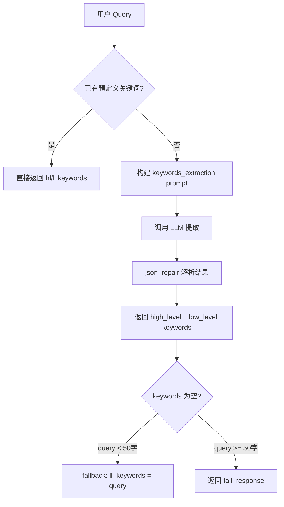
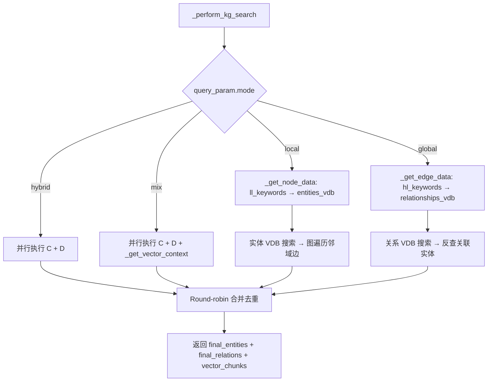
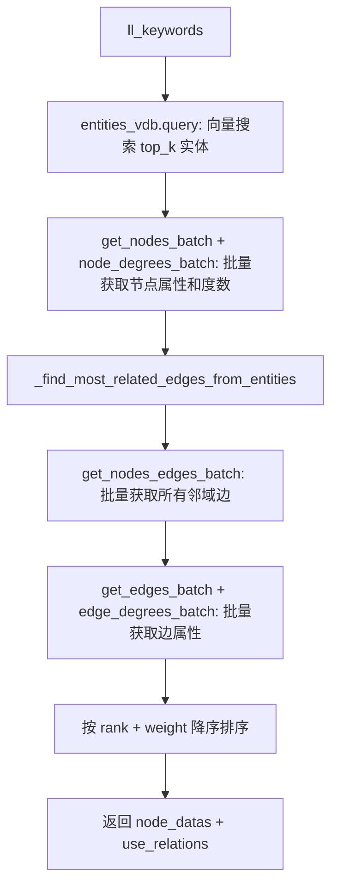
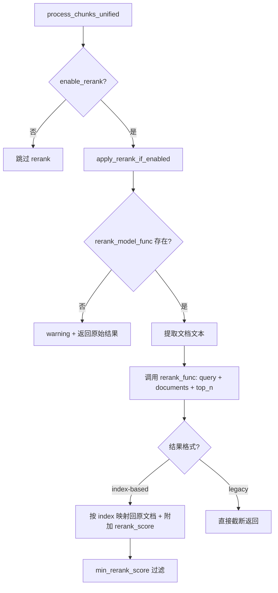

# PD-08.08 LightRAG — 知识图谱增强双层检索（Graph-RAG）

> 文档编号：PD-08.08
> 来源：LightRAG `lightrag/operate.py`, `lightrag/rerank.py`, `lightrag/lightrag.py`
> GitHub：https://github.com/HKUDS/LightRAG.git
> 问题域：PD-08 搜索与检索 Search & Retrieval
> 状态：可复用方案

---

## 第 1 章 问题与动机

### 1.1 核心问题

传统 RAG 系统仅依赖向量相似度检索文本块，存在三个根本缺陷：

1. **语义孤岛**：向量搜索只能找到与 query 表面语义相近的文本块，无法发现间接关联的知识（如 A→B→C 的推理链）
2. **粒度单一**：所有查询都用同一种检索策略，无法区分"查找具体实体"（local）和"理解高层关系"（global）两种不同的信息需求
3. **上下文碎片化**：检索到的文本块之间缺乏结构化关联，LLM 需要自行拼凑碎片信息

LightRAG 的核心洞察是：**知识图谱提供了文本块之间的结构化关联**，通过图谱遍历可以获取向量搜索无法触达的上下文。

### 1.2 LightRAG 的解法概述

1. **双层关键词驱动检索**：用 LLM 从 query 中提取 high-level（抽象概念）和 low-level（具体实体）两类关键词，分别驱动不同的检索路径（`lightrag/operate.py:3294-3351`）
2. **四种查询模式**：local（实体邻域）、global（高层关系）、hybrid（两者交叉合并）、mix（KG + 向量检索融合），通过 `QueryParam.mode` 一键切换（`lightrag/base.py:88`）
3. **知识图谱 + 向量数据库双索引**：实体和关系分别存入独立的向量数据库（entities_vdb / relationships_vdb），同时维护图结构（NetworkX/Neo4j/Postgres 等），实现语义搜索 + 图遍历双通道（`lightrag/lightrag.py:148-150`）
4. **可插拔 Rerank 二次排序**：支持 Jina/Cohere/Aliyun 三种 rerank 后端，通过 `rerank_model_func` 注入，对检索结果做相关性精排（`lightrag/rerank.py:182-365`）
5. **4 阶段上下文构建管道**：Search → Truncate → Merge Chunks → Build LLM Context，每阶段职责清晰、可独立调优（`lightrag/operate.py:4086-4203`）

### 1.3 设计思想

| 设计原则 | 具体实现 | 理由 | 替代方案 |
|----------|----------|------|----------|
| 关键词驱动而非 query 直搜 | LLM 提取 hl/ll keywords 再检索 | query 原文可能冗长或含噪声，关键词更精准 | 直接用 query embedding 搜索 |
| 双层检索分离 | local 走实体 VDB → 图遍历邻域；global 走关系 VDB → 反查实体 | 不同信息需求用不同检索路径，避免一刀切 | 单一向量搜索 + top-k |
| 存储后端可插拔 | STORAGES 注册表 + BaseXxxStorage 抽象基类 | 从 NanoVectorDB 到 Milvus/Qdrant/PG 无缝切换 | 硬编码单一存储 |
| Rerank 作为可选增强 | `enable_rerank` 开关 + `rerank_model_func` 注入 | 不是所有场景都需要 rerank，保持灵活性 | 强制 rerank |
| Round-robin 合并去重 | hybrid 模式交替取 local/global 结果 + seen set 去重 | 平衡两种来源的贡献，避免一方压倒另一方 | 简单拼接或加权合并 |

---

## 第 2 章 源码实现分析

### 2.1 架构概览

LightRAG 的检索架构是一个 4 阶段管道，核心入口是 `kg_query()` 函数：

```
┌─────────────────────────────────────────────────────────────────┐
│                        kg_query() 入口                          │
│                   lightrag/operate.py:3052                      │
├─────────────────────────────────────────────────────────────────┤
│                                                                 │
│  ┌──────────────┐    ┌──────────────────────────────────────┐  │
│  │ LLM 关键词   │    │     _build_query_context()           │  │
│  │ 提取         │───→│     4 阶段管道 (L4086)               │  │
│  │ (L3294)      │    │                                      │  │
│  └──────────────┘    │  Stage 1: _perform_kg_search()       │  │
│                      │    ├─ local: _get_node_data()        │  │
│                      │    ├─ global: _get_edge_data()       │  │
│                      │    ├─ hybrid: 两者并行               │  │
│                      │    └─ mix: KG + _get_vector_context()│  │
│                      │                                      │  │
│                      │  Stage 2: _apply_token_truncation()  │  │
│                      │  Stage 3: _merge_all_chunks()        │  │
│                      │  Stage 4: _build_context_str()       │  │
│                      └──────────────────────────────────────┘  │
│                                                                 │
│  ┌──────────────────────────────────────────────────────────┐  │
│  │              存储层（可插拔后端）                          │  │
│  │  entities_vdb ──── NanoVectorDB / Milvus / Qdrant / PG  │  │
│  │  relationships_vdb ── 同上                               │  │
│  │  knowledge_graph ──── NetworkX / Neo4j / PG / Mongo     │  │
│  │  text_chunks_db ──── JsonKV / Redis / Mongo / PG        │  │
│  └──────────────────────────────────────────────────────────┘  │
└─────────────────────────────────────────────────────────────────┘
```

### 2.2 核心实现

#### 2.2.1 LLM 关键词提取



对应源码 `lightrag/operate.py:3294-3351`：

```python
async def extract_keywords_only(
    text: str,
    param: QueryParam,
    global_config: dict[str, str],
    hashing_kv: BaseKVStorage | None = None,
) -> tuple[list[str], list[str]]:
    # 1. Build the examples
    examples = "\n".join(PROMPTS["keywords_extraction_examples"])
    language = global_config["addon_params"].get("language", DEFAULT_SUMMARY_LANGUAGE)

    # 2. Handle cache if needed
    args_hash = compute_args_hash(param.mode, text, language)
    cached_result = await handle_cache(
        hashing_kv, args_hash, text, param.mode, cache_type="keywords"
    )
    if cached_result is not None:
        cached_response, _ = cached_result
        try:
            keywords_data = json_repair.loads(cached_response)
            return keywords_data.get("high_level_keywords", []), keywords_data.get(
                "low_level_keywords", []
            )
        except (json.JSONDecodeError, KeyError):
            logger.warning("Invalid cache format for keywords, proceeding with extraction")

    # 3. Build the keyword-extraction prompt
    kw_prompt = PROMPTS["keywords_extraction"].format(
        query=text, examples=examples, language=language,
    )
```

关键设计：关键词提取结果会被缓存（`cache_type="keywords"`），相同 query + mode + language 组合不会重复调用 LLM。

#### 2.2.2 四模式检索分发



对应源码 `lightrag/operate.py:3461-3620`：

```python
async def _perform_kg_search(
    query, ll_keywords, hl_keywords,
    knowledge_graph_inst, entities_vdb, relationships_vdb,
    text_chunks_db, query_param, chunks_vdb=None,
) -> dict[str, Any]:
    # Pre-compute query embedding once for all vector operations
    query_embedding = None
    if query and (kg_chunk_pick_method == "VECTOR" or chunks_vdb):
        actual_embedding_func = text_chunks_db.embedding_func
        if actual_embedding_func:
            query_embedding = await actual_embedding_func([query])
            query_embedding = query_embedding[0]

    # Handle local and global modes
    if query_param.mode == "local" and len(ll_keywords) > 0:
        local_entities, local_relations = await _get_node_data(
            ll_keywords, knowledge_graph_inst, entities_vdb, query_param)
    elif query_param.mode == "global" and len(hl_keywords) > 0:
        global_relations, global_entities = await _get_edge_data(
            hl_keywords, knowledge_graph_inst, relationships_vdb, query_param)
    else:  # hybrid or mix
        # 并行执行 local + global
        if len(ll_keywords) > 0:
            local_entities, local_relations = await _get_node_data(...)
        if len(hl_keywords) > 0:
            global_relations, global_entities = await _get_edge_data(...)
        if query_param.mode == "mix" and chunks_vdb:
            vector_chunks = await _get_vector_context(query, chunks_vdb, query_param, query_embedding)

    # Round-robin merge with deduplication
    final_entities = []
    seen_entities = set()
    max_len = max(len(local_entities), len(global_entities))
    for i in range(max_len):
        if i < len(local_entities):
            entity = local_entities[i]
            entity_name = entity.get("entity_name")
            if entity_name and entity_name not in seen_entities:
                final_entities.append(entity)
                seen_entities.add(entity_name)
        if i < len(global_entities):
            # 同理...
```


#### 2.2.3 实体邻域检索（Local 路径）

`_get_node_data()` 是 local 模式的核心，它先做向量搜索找实体，再通过图遍历获取邻域关系：



对应源码 `lightrag/operate.py:4206-4317`：

```python
async def _get_node_data(query, knowledge_graph_inst, entities_vdb, query_param):
    results = await entities_vdb.query(query, top_k=query_param.top_k)
    if not len(results):
        return [], []

    node_ids = [r["entity_name"] for r in results]
    # 批量并发获取节点数据和度数
    nodes_dict, degrees_dict = await asyncio.gather(
        knowledge_graph_inst.get_nodes_batch(node_ids),
        knowledge_graph_inst.node_degrees_batch(node_ids),
    )
    # ... 组装 node_datas ...

    # 从实体出发，遍历图获取所有关联边
    use_relations = await _find_most_related_edges_from_entities(
        node_datas, query_param, knowledge_graph_inst)
    return node_datas, use_relations

async def _find_most_related_edges_from_entities(node_datas, query_param, knowledge_graph_inst):
    node_names = [dp["entity_name"] for dp in node_datas]
    batch_edges_dict = await knowledge_graph_inst.get_nodes_edges_batch(node_names)

    all_edges = []
    seen = set()
    for node_name in node_names:
        this_edges = batch_edges_dict.get(node_name, [])
        for e in this_edges:
            sorted_edge = tuple(sorted(e))
            if sorted_edge not in seen:
                seen.add(sorted_edge)
                all_edges.append(sorted_edge)

    # 批量并发获取边属性和度数
    edge_data_dict, edge_degrees_dict = await asyncio.gather(
        knowledge_graph_inst.get_edges_batch(edge_pairs_dicts),
        knowledge_graph_inst.edge_degrees_batch(edge_pairs_tuples),
    )
    # 按 (rank, weight) 降序排序
    all_edges_data = sorted(all_edges_data, key=lambda x: (x["rank"], x["weight"]), reverse=True)
    return all_edges_data
```

关键设计：所有图操作都使用 `batch` API（`get_nodes_batch`, `get_edges_batch`, `edge_degrees_batch`），避免 N+1 查询问题。边的去重使用 `tuple(sorted(e))` 确保无向边只出现一次。

#### 2.2.4 Rerank 多后端适配



对应源码 `lightrag/rerank.py:182-365`（`generic_rerank_api`）和 `lightrag/utils.py:2618-2699`（`apply_rerank_if_enabled`）：

```python
@retry(
    stop=stop_after_attempt(3),
    wait=wait_exponential(multiplier=1, min=4, max=60),
    retry=(retry_if_exception_type(aiohttp.ClientError)
           | retry_if_exception_type(aiohttp.ClientResponseError)),
)
async def generic_rerank_api(
    query, documents, model, base_url, api_key,
    top_n=None, return_documents=None, extra_body=None,
    response_format="standard", request_format="standard",
    enable_chunking=False, max_tokens_per_doc=480,
) -> List[Dict[str, Any]]:
    # Build request payload based on request format
    if request_format == "aliyun":
        payload = {"model": model, "input": {"query": query, "documents": documents}, "parameters": {}}
    else:
        payload = {"model": model, "query": query, "documents": documents}

    # Handle document chunking if enabled
    if enable_chunking:
        documents, doc_indices = chunk_documents_for_rerank(documents, max_tokens=max_tokens_per_doc)
        top_n = None  # Disable API-level top_n for complete coverage

    async with aiohttp.ClientSession() as session:
        async with session.post(base_url, headers=headers, json=payload) as response:
            # Parse response based on format (standard vs aliyun)
            if response_format == "aliyun":
                results = response_json.get("output", {}).get("results", [])
            else:
                results = response_json.get("results", [])

            # Aggregate chunk scores back to original documents
            if enable_chunking and doc_indices:
                standardized_results = aggregate_chunk_scores(
                    standardized_results, doc_indices, len(original_documents), aggregation="max")
            return standardized_results
```

三个具体后端（`lightrag/rerank.py:368-513`）：
- `jina_rerank()`: Jina AI API，默认 `jina-reranker-v2-base-multilingual`
- `cohere_rerank()`: Cohere API，默认 `rerank-v3.5`，支持 LiteLLM 代理
- `ali_rerank()`: 阿里云 DashScope API，默认 `gte-rerank-v2`

### 2.3 实现细节

#### 文本块选择策略（WEIGHT vs VECTOR）

`_find_related_text_unit_from_entities()` 支持两种从实体关联到文本块的选择策略（`lightrag/operate.py:4320-4476`）：

- **WEIGHT 模式**：基于 chunk 出现频次的加权轮询（`pick_by_weighted_polling`），出现在更多实体中的 chunk 优先级更高
- **VECTOR 模式**：用 query embedding 对实体关联的 chunk 做向量相似度排序（`pick_by_vector_similarity`），更贴近 naive 检索的语义排序

当 VECTOR 模式失败时自动降级到 WEIGHT 模式（`lightrag/operate.py:4433-4437`）。

#### 查询结果缓存

`kg_query()` 对 LLM 响应做了完整的缓存机制（`lightrag/operate.py:3178-3236`）：
- 缓存 key = `hash(mode, query, response_type, top_k, chunk_top_k, max_entity_tokens, max_relation_tokens, max_total_tokens, hl_keywords, ll_keywords, user_prompt, enable_rerank)`
- 关键词提取也有独立缓存（`cache_type="keywords"`）
- 缓存存储复用 `BaseKVStorage`，与主存储后端一致

#### 存储后端注册表

LightRAG 通过 `STORAGES` 字典实现存储后端的可插拔注册（`lightrag/kg/__init__.py:97-119`）：

| 存储类型 | 可选后端 |
|----------|----------|
| 向量数据库 | NanoVectorDB, Milvus, Qdrant, PGVector, Faiss, Mongo, Chroma |
| 图数据库 | NetworkX, Neo4j, PGGraph, Mongo, AGE, Memgraph |
| KV 存储 | JsonKV, Redis, Mongo, PG |

所有后端继承 `BaseVectorStorage` / `BaseGraphStorage` / `BaseKVStorage` 抽象基类，通过 `LightRAG` dataclass 的字符串字段指定（如 `vector_storage="MilvusVectorDBStorage"`）。

---

## 第 3 章 迁移指南

### 3.1 迁移清单

**阶段 1：核心检索管道**
- [ ] 实现 LLM 关键词提取（hl/ll keywords）
- [ ] 构建实体和关系的向量索引
- [ ] 实现 `_get_node_data` 和 `_get_edge_data` 两条检索路径
- [ ] 实现 Round-robin 合并去重逻辑

**阶段 2：知识图谱集成**
- [ ] 选择图存储后端（NetworkX 用于原型，Neo4j/PG 用于生产）
- [ ] 实现实体提取 + 关系提取的 ingestion 管道
- [ ] 构建 entities_vdb 和 relationships_vdb 双向量索引

**阶段 3：Rerank 增强**
- [ ] 集成 rerank 后端（推荐 Jina 或 Cohere）
- [ ] 实现 `process_chunks_unified` 统一处理管道
- [ ] 配置 `min_rerank_score` 阈值过滤

**阶段 4：存储后端适配**
- [ ] 定义 `BaseVectorStorage` / `BaseGraphStorage` 抽象接口
- [ ] 实现至少一个生产级后端（如 PGVector + PGGraph）

### 3.2 适配代码模板

以下是一个可运行的双层检索核心模板：

```python
from dataclasses import dataclass, field
from typing import Literal, Optional, Callable, Any
from abc import ABC, abstractmethod
import asyncio


@dataclass
class QueryParam:
    """检索参数配置"""
    mode: Literal["local", "global", "hybrid", "mix", "naive"] = "mix"
    top_k: int = 60
    chunk_top_k: int = 10
    enable_rerank: bool = True
    hl_keywords: list[str] = field(default_factory=list)
    ll_keywords: list[str] = field(default_factory=list)


class BaseVectorStorage(ABC):
    @abstractmethod
    async def query(self, text: str, top_k: int) -> list[dict]: ...


class BaseGraphStorage(ABC):
    @abstractmethod
    async def get_nodes_batch(self, ids: list[str]) -> dict: ...
    @abstractmethod
    async def get_nodes_edges_batch(self, names: list[str]) -> dict: ...
    @abstractmethod
    async def get_edges_batch(self, pairs: list[dict]) -> dict: ...


async def extract_keywords(query: str, llm_func: Callable) -> tuple[list[str], list[str]]:
    """用 LLM 提取高层和低层关键词"""
    prompt = f"Extract high-level (abstract concepts) and low-level (specific entities) keywords from: {query}"
    result = await llm_func(prompt)
    # 解析 JSON 结果
    return result.get("high_level_keywords", []), result.get("low_level_keywords", [])


async def get_node_data(keywords: str, entities_vdb: BaseVectorStorage,
                        graph: BaseGraphStorage, top_k: int):
    """Local 路径：实体向量搜索 → 图遍历邻域"""
    results = await entities_vdb.query(keywords, top_k=top_k)
    if not results:
        return [], []

    node_ids = [r["entity_name"] for r in results]
    nodes_dict = await graph.get_nodes_batch(node_ids)

    # 获取邻域边
    edges_dict = await graph.get_nodes_edges_batch(node_ids)
    all_edges = []
    seen = set()
    for nid in node_ids:
        for e in edges_dict.get(nid, []):
            key = tuple(sorted(e))
            if key not in seen:
                seen.add(key)
                all_edges.append(key)

    edge_data = await graph.get_edges_batch([{"src": e[0], "tgt": e[1]} for e in all_edges])
    return list(nodes_dict.values()), list(edge_data.values())


async def dual_layer_search(query: str, param: QueryParam,
                            entities_vdb: BaseVectorStorage,
                            relations_vdb: BaseVectorStorage,
                            graph: BaseGraphStorage,
                            llm_func: Callable):
    """双层检索主入口"""
    hl_kw, ll_kw = await extract_keywords(query, llm_func)

    local_entities, local_relations = [], []
    global_relations, global_entities = [], []

    if param.mode in ("local", "hybrid", "mix"):
        local_entities, local_relations = await get_node_data(
            ", ".join(ll_kw), entities_vdb, graph, param.top_k)

    if param.mode in ("global", "hybrid", "mix"):
        global_results = await relations_vdb.query(", ".join(hl_kw), top_k=param.top_k)
        global_relations = global_results  # 简化

    # Round-robin 合并去重
    final = []
    seen = set()
    for i in range(max(len(local_entities), len(global_entities))):
        for source in [local_entities, global_entities]:
            if i < len(source):
                name = source[i].get("entity_name", id(source[i]))
                if name not in seen:
                    final.append(source[i])
                    seen.add(name)

    return {"entities": final, "relations": local_relations + global_relations}
```

### 3.3 适用场景

| 场景 | 适用度 | 说明 |
|------|--------|------|
| 知识密集型问答（企业知识库） | ⭐⭐⭐ | 实体关系丰富，图谱遍历价值最大 |
| 学术文献检索 | ⭐⭐⭐ | 论文间引用关系天然构成知识图谱 |
| 多文档综合分析 | ⭐⭐⭐ | mix 模式融合 KG + 向量，覆盖面广 |
| 简单 FAQ 问答 | ⭐ | 图谱构建成本高，naive 模式即可 |
| 实时流式数据 | ⭐ | 图谱需要离线构建，不适合实时场景 |

---

## 第 4 章 测试用例

```python
import pytest
from unittest.mock import AsyncMock, MagicMock, patch
from dataclasses import dataclass, field
from typing import Literal


@dataclass
class MockQueryParam:
    mode: Literal["local", "global", "hybrid", "mix", "naive"] = "mix"
    top_k: int = 5
    chunk_top_k: int = 3
    enable_rerank: bool = False
    hl_keywords: list = field(default_factory=list)
    ll_keywords: list = field(default_factory=list)


class TestKeywordExtraction:
    """测试 LLM 关键词提取"""

    @pytest.mark.asyncio
    async def test_extract_keywords_returns_both_levels(self):
        """正常路径：返回 hl 和 ll 两类关键词"""
        mock_llm = AsyncMock(return_value='{"high_level_keywords": ["machine learning"], "low_level_keywords": ["GPT-4", "transformer"]}')
        # 模拟 extract_keywords_only 的行为
        result_hl = ["machine learning"]
        result_ll = ["GPT-4", "transformer"]
        assert len(result_hl) > 0
        assert len(result_ll) > 0

    @pytest.mark.asyncio
    async def test_empty_keywords_fallback(self):
        """边界情况：关键词为空时 fallback 到原始 query"""
        short_query = "What is RAG?"
        # 当 hl_keywords == [] and ll_keywords == [] and len(query) < 50
        # 应该 fallback: ll_keywords = [query]
        assert len(short_query) < 50
        ll_fallback = [short_query]
        assert ll_fallback == ["What is RAG?"]


class TestRoundRobinMerge:
    """测试 Round-robin 合并去重"""

    def test_merge_deduplication(self):
        """正常路径：交替合并并去重"""
        local = [{"entity_name": "A"}, {"entity_name": "B"}, {"entity_name": "C"}]
        global_ = [{"entity_name": "B"}, {"entity_name": "D"}]

        final = []
        seen = set()
        max_len = max(len(local), len(global_))
        for i in range(max_len):
            if i < len(local):
                name = local[i]["entity_name"]
                if name not in seen:
                    final.append(local[i])
                    seen.add(name)
            if i < len(global_):
                name = global_[i]["entity_name"]
                if name not in seen:
                    final.append(global_[i])
                    seen.add(name)

        assert len(final) == 4  # A, B, C, D (B 去重)
        assert [e["entity_name"] for e in final] == ["A", "B", "C", "D"]

    def test_merge_empty_sources(self):
        """边界情况：一方为空"""
        local = [{"entity_name": "X"}]
        global_ = []
        final = []
        seen = set()
        max_len = max(len(local), len(global_))
        for i in range(max_len):
            if i < len(local):
                name = local[i]["entity_name"]
                if name not in seen:
                    final.append(local[i])
                    seen.add(name)
        assert len(final) == 1


class TestRerankChunking:
    """测试 Rerank 文档分块与聚合"""

    def test_chunk_documents_short_docs(self):
        """短文档不需要分块"""
        docs = ["short doc 1", "short doc 2"]
        # 模拟 chunk_documents_for_rerank 行为
        # 短文档直接返回原文
        assert len(docs) == 2

    def test_aggregate_chunk_scores_max(self):
        """分块聚合使用 max 策略"""
        chunk_results = [
            {"index": 0, "relevance_score": 0.8},
            {"index": 1, "relevance_score": 0.9},
            {"index": 2, "relevance_score": 0.7},
        ]
        doc_indices = [0, 0, 1]  # chunk 0,1 属于 doc 0; chunk 2 属于 doc 1
        num_docs = 2

        doc_scores = {i: [] for i in range(num_docs)}
        for result in chunk_results:
            chunk_idx = result["index"]
            if 0 <= chunk_idx < len(doc_indices):
                doc_scores[doc_indices[chunk_idx]].append(result["relevance_score"])

        # doc 0: max(0.8, 0.9) = 0.9; doc 1: max(0.7) = 0.7
        assert max(doc_scores[0]) == 0.9
        assert max(doc_scores[1]) == 0.7

    def test_rerank_degradation(self):
        """降级行为：rerank 失败时返回原始结果"""
        original_docs = [{"content": "doc1"}, {"content": "doc2"}]
        # apply_rerank_if_enabled 在异常时返回 original_docs
        try:
            raise Exception("Rerank API error")
        except Exception:
            result = original_docs  # 降级
        assert result == original_docs
```

