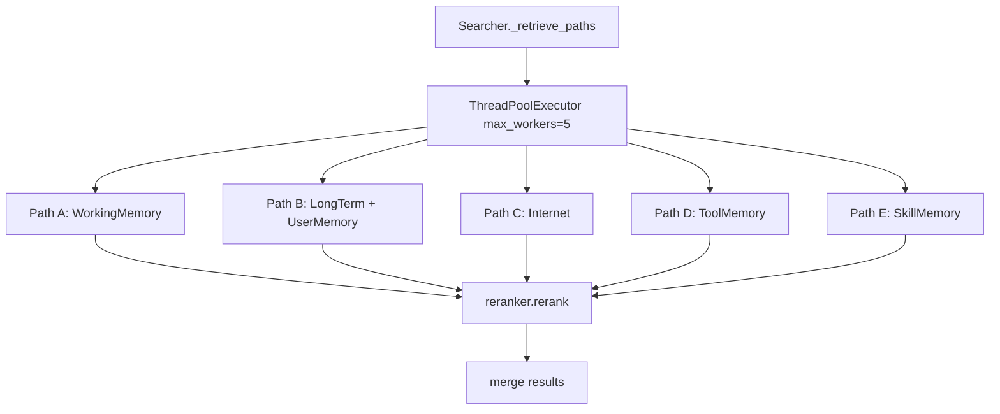
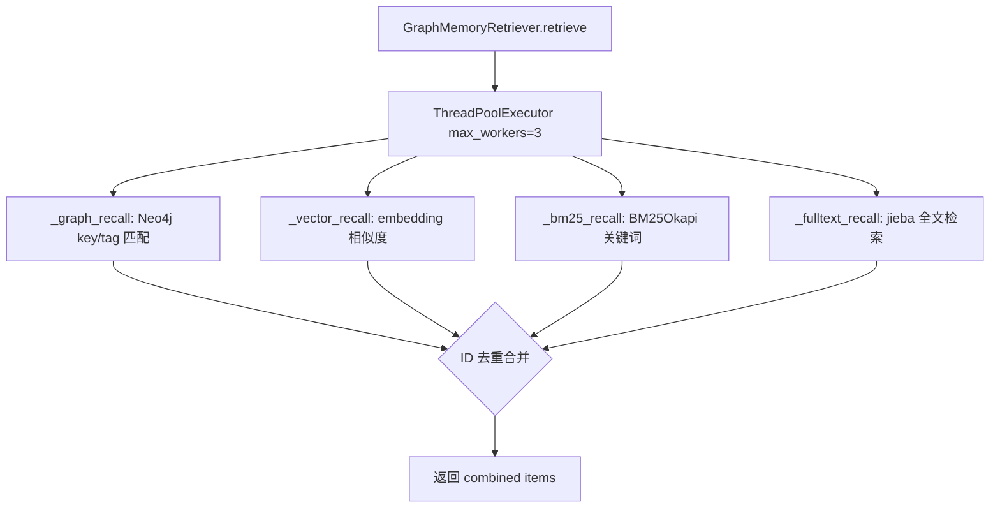
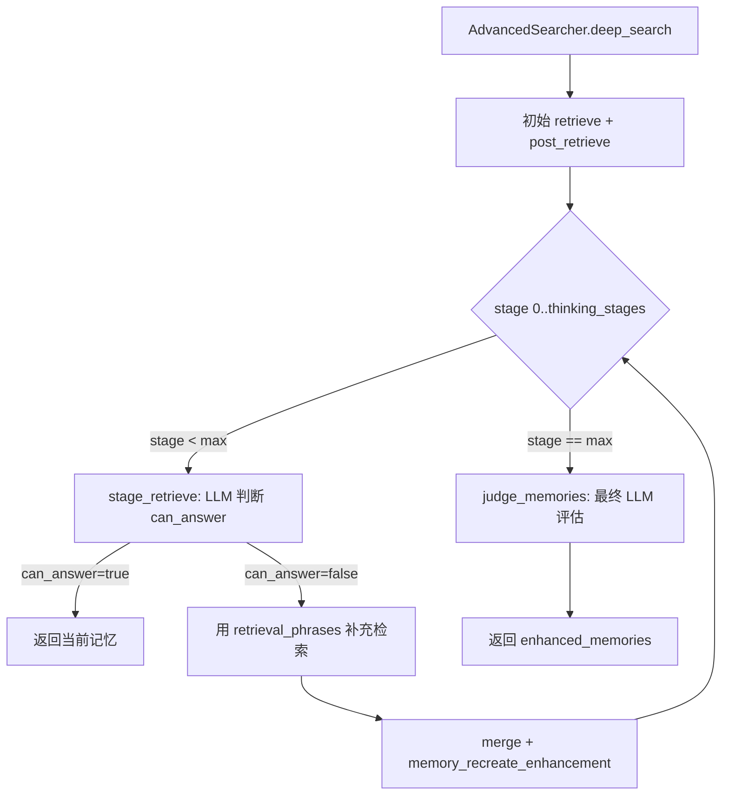

# PD-08.NN MemOS — 多层记忆检索管道与 LLM 驱动迭代深搜

> 文档编号：PD-08.NN
> 来源：MemOS `src/memos/memories/textual/tree_text_memory/retrieve/`
> GitHub：https://github.com/MemTensor/MemOS.git
> 问题域：PD-08 搜索与检索 Search & Retrieval
> 状态：可复用方案

---

## 第 1 章 问题与动机

### 1.1 核心问题

Agent 记忆系统面临的检索挑战与传统 RAG 不同：记忆按类型分区（工作记忆、长期记忆、用户记忆、工具记忆、技能记忆），每种记忆的检索策略和优先级不同。单次检索往往无法覆盖复杂查询所需的全部信息，需要多轮迭代式检索来补全知识缺口。同时，记忆以图数据库（Neo4j）为底层存储，需要同时支持结构化图查询、向量相似度搜索、BM25 关键词匹配和全文检索四种召回路径，并在最终阶段通过 Reranker 统一排序。

### 1.2 MemOS 的解法概述

1. **五路并行召回架构**：Searcher 通过 `ContextThreadPoolExecutor(max_workers=5)` 同时执行 Path A（WorkingMemory）、Path B（LongTermMemory + UserMemory）、Path C（Internet）、Path D（ToolMemory）、Path E（SkillMemory）五条检索路径 (`searcher.py:341-434`)
2. **四引擎混合检索**：GraphMemoryRetriever 在每条路径内部并行执行 graph_recall（结构化图查询）、vector_recall（向量相似度）、bm25_recall（BM25 关键词）、fulltext_recall（全文检索）四种召回方式 (`recall.py:86-137`)
3. **LLM 驱动迭代深搜**：AdvancedSearcher 实现 `thinking_stages=3` 的多阶段迭代检索，每阶段由 LLM 判断当前记忆是否足以回答查询，不足则生成新的 retrieval_phrases 进行补充检索 (`advanced_searcher.py:232-364`)
4. **策略模式 Reranker**：通过 BaseRerankerStrategy 抽象接口支持多种重排序策略（单轮对话、背景拼接、文档来源拼接），由工厂模式按配置选择 (`reranker/strategies/base.py:9-61`)
5. **CoT 查询扩展**：Searcher 支持 Chain-of-Thought 查询分解，将复杂查询拆分为子问题分别嵌入，扩大召回覆盖面 (`searcher.py:1124-1161`)

### 1.3 设计思想

| 设计原则 | 具体实现 | 理由 | 替代方案 |
|----------|----------|------|----------|
| 记忆分区并行 | 5 条 Path 按 memory_type 独立检索 | 不同记忆类型有不同检索策略和优先级 | 统一索引不分区（丢失类型语义） |
| 四引擎互补 | Graph + Vector + BM25 + Fulltext 并行 | 结构化查询捕获精确匹配，向量捕获语义相似，BM25 捕获关键词 | 仅用向量检索（漏掉精确匹配） |
| LLM 判断检索充分性 | stage_retrieve 返回 can_answer 布尔值 | 避免固定轮数浪费或不足 | 固定迭代次数（不自适应） |
| 策略模式重排序 | BaseRerankerStrategy + Factory | 不同对话场景需要不同的文档拼接方式 | 硬编码单一重排序逻辑 |
| 查询理解前置 | TaskGoalParser 提取 keys/tags/memories | 结构化查询意图提升图检索精度 | 直接用原始 query 检索 |

---

## 第 2 章 源码实现分析

### 2.1 架构概览

MemOS 的检索系统分为三层：SearchPipeline（入口调度）→ Searcher（五路并行 + 后处理）→ GraphMemoryRetriever（四引擎混合召回）。AdvancedSearcher 继承 Searcher，在其基础上增加 LLM 驱动的多阶段迭代深搜能力。

```
┌─────────────────────────────────────────────────────────────────┐
│                      SearchPipeline                             │
│  search_pipeline.py:15-94                                       │
│  按 memory_type 分区调用 → LongTermMemory + UserMemory          │
└──────────────────────────┬──────────────────────────────────────┘
                           │
              ┌────────────▼────────────┐
              │   Searcher / AdvancedSearcher                     │
              │   searcher.py:41 / advanced_searcher.py:25        │
              │                                                   │
              │  ┌─────┐ ┌─────┐ ┌─────┐ ┌─────┐ ┌─────┐       │
              │  │PathA│ │PathB│ │PathC│ │PathD│ │PathE│       │
              │  │Work │ │Long │ │Inter│ │Tool │ │Skill│       │
              │  │Mem  │ │+User│ │net  │ │Mem  │ │Mem  │       │
              │  └──┬──┘ └──┬──┘ └──┬──┘ └──┬──┘ └──┬──┘       │
              │     │       │       │       │       │            │
              │     └───────┴───┬───┴───────┴───────┘            │
              │                 │ merge + dedup + rerank          │
              └─────────────────┼─────────────────────────────────┘
                                │
              ┌─────────────────▼─────────────────────────────────┐
              │          GraphMemoryRetriever                      │
              │          recall.py:15-567                          │
              │                                                   │
              │  ┌──────────┐ ┌──────────┐ ┌─────┐ ┌──────────┐ │
              │  │graph_recall│ │vector_recall│ │BM25 │ │fulltext  │ │
              │  │(Neo4j key │ │(embedding  │ │recall│ │recall    │ │
              │  │ +tag匹配) │ │ similarity)│ │     │ │(jieba)   │ │
              │  └──────────┘ └──────────┘ └─────┘ └──────────┘ │
              │       并行执行 → ID 去重合并                       │
              └───────────────────────────────────────────────────┘
```

### 2.2 核心实现

#### 2.2.1 五路并行检索



对应源码 `src/memos/memories/textual/tree_text_memory/retrieve/searcher.py:316-436`：

```python
def _retrieve_paths(self, query, parsed_goal, query_embedding, info,
                    top_k, mode, memory_type, search_filter=None,
                    search_priority=None, user_name=None,
                    search_tool_memory=False, tool_mem_top_k=6,
                    include_skill_memory=False, skill_mem_top_k=3):
    """Run A/B/C/D/E retrieval paths in parallel"""
    tasks = []
    with ContextThreadPoolExecutor(max_workers=5) as executor:
        tasks.append(executor.submit(
            self._retrieve_from_working_memory, query, parsed_goal,
            query_embedding, top_k, memory_type, search_filter,
            search_priority, user_name, id_filter))
        tasks.append(executor.submit(
            self._retrieve_from_long_term_and_user, query, parsed_goal,
            query_embedding, top_k, memory_type, search_filter,
            search_priority, user_name, id_filter, mode=mode))
        tasks.append(executor.submit(
            self._retrieve_from_internet, query, parsed_goal,
            query_embedding, top_k, info, mode, memory_type, user_name))
        if self.use_fulltext:
            tasks.append(executor.submit(
                self._retrieve_from_keyword, ...))
        if search_tool_memory:
            tasks.append(executor.submit(
                self._retrieve_from_tool_memory, ...))
        if include_skill_memory:
            tasks.append(executor.submit(
                self._retrieve_from_skill_memory, ...))
        results = []
        for t in tasks:
            results.extend(t.result())
    return results
```

每条 Path 内部都会调用 `self.reranker.rerank()` 对各自的召回结果进行初步排序，最终在 `post_retrieve` 中做全局去重和排序。

#### 2.2.2 四引擎混合召回



对应源码 `src/memos/memories/textual/tree_text_memory/retrieve/recall.py:86-137`：

```python
def retrieve(self, query, parsed_goal, top_k, memory_scope,
             query_embedding=None, search_filter=None,
             search_priority=None, user_name=None,
             id_filter=None, use_fast_graph=False):
    with ContextThreadPoolExecutor(max_workers=3) as executor:
        future_graph = executor.submit(
            self._graph_recall, parsed_goal, memory_scope,
            user_name, use_fast_graph=use_fast_graph)
        future_vector = executor.submit(
            self._vector_recall, query_embedding or [],
            memory_scope, top_k, search_filter=search_filter,
            search_priority=search_priority, user_name=user_name)
        if self.use_bm25:
            future_bm25 = executor.submit(
                self._bm25_recall, query, parsed_goal,
                memory_scope, top_k=top_k, user_name=user_name,
                search_filter=id_filter)
        if use_fast_graph:
            future_fulltext = executor.submit(
                self._fulltext_recall, query_words=parsed_goal.keys or [],
                memory_scope=memory_scope, top_k=top_k, ...)

        graph_results = future_graph.result()
        vector_results = future_vector.result()
        bm25_results = future_bm25.result() if self.use_bm25 else []
        fulltext_results = future_fulltext.result() if use_fast_graph else []

    # Merge and deduplicate by ID
    combined = {item.id: item
                for item in graph_results + vector_results
                + bm25_results + fulltext_results}
    return list(combined.values())
```

关键设计：四引擎结果通过 `item.id` 做字典去重，同一记忆节点被多引擎召回时只保留一份，避免重复。

#### 2.2.3 LLM 驱动迭代深搜



对应源码 `src/memos/memories/textual/tree_text_memory/retrieve/advanced_searcher.py:232-364`：

```python
def deep_search(self, query, top_k, info=None, memory_type="All",
                search_filter=None, user_name=None, **kwargs):
    previous_retrieval_phrases = [query]
    retrieved_memories = self.retrieve(query=query, ...)
    memories = self.post_retrieve(retrieved_results=retrieved_memories, ...)
    mem_list, _ = self.tree_memories_to_text_memories(memories=memories)

    for current_stage_id in range(self.thinking_stages + 1):
        if current_stage_id == self.thinking_stages:
            # 最终阶段：LLM 判断是否足够
            reason, can_answer = self.judge_memories(query=query,
                text_memories="- " + "\n- ".join(mem_list) + "\n")
            return enhanced_memories[:top_k]

        can_answer, reason, retrieval_phrases = self.stage_retrieve(
            stage_id=current_stage_id + 1, query=query,
            previous_retrieval_phrases=previous_retrieval_phrases,
            text_memories="- " + "\n- ".join(mem_list) + "\n")

        if can_answer:
            return enhanced_memories[:top_k]
        else:
            # 用新 phrases 补充检索
            for phrase in retrieval_phrases:
                _retrieved = self.retrieve(query=phrase,
                    top_k=self.stage_retrieve_top, ...)
                additional_retrieved_memories.extend(_retrieved)
            # 合并 + LLM 增强记忆
            mem_list = self.memory_recreate_enhancement(
                query=query, top_k=top_k,
                text_memories=mem_list, retries=self.max_retry_times)
```

核心参数：`thinking_stages=3`（最多 3 轮迭代）、`stage_retrieve_top=3`（每轮补充检索 top 3）、`max_retry_times=2`（LLM 解析失败重试 2 次）。

### 2.3 实现细节

**BM25 + TF-IDF 混合评分**：EnhancedBM25 支持可选的 TF-IDF 重排序，权重比为 `0.7 * bm25 + 0.3 * tfidf` (`bm25_util.py:127`)。BM25 模型通过 LRU Cache（maxsize=100）按 corpus_name 缓存，避免重复构建索引 (`bm25_util.py:33-56`)。

**CoT 查询分解**：`_cot_query` 方法用 LLM 判断查询是否复杂（`is_complex`），复杂查询拆分为最多 3 个子问题，每个子问题独立嵌入后合并到 query_embedding 列表中 (`searcher.py:1124-1161`)。支持中英文双语 prompt 模板，通过 `detect_lang` 自动选择。

**Reranker 策略工厂**：RerankerFactory 支持 4 种后端——`http_bge`（远程 BGE 交叉编码器）、`cosine_local`（本地余弦相似度 + 层级权重）、`noop`（透传）、`http_bge_strategy`（带策略模式的 BGE）(`reranker/factory.py:23-72`)。HTTPBGERerankerStrategy 内部通过 `RerankerStrategyFactory` 选择文档拼接策略（single_turn / concat_background / concat_docsource）。

**记忆去重**：两层去重机制——GraphMemoryRetriever 层按 `item.id` 字典去重 (`recall.py:132-134`)；Searcher 层按 `item.memory` 文本去重，保留最高分 (`searcher.py:918-924`)。RawFileMemory 还有专门的边关系去重，通过 SUMMARY 边找到摘要节点并移除 (`searcher.py:1028-1073`)。

**元数据 Boost**：HTTPBGERerankerStrategy 支持基于 search_filter 的分数加权，默认权重 `user_id: 0.5, tags: 0.2, session_id: 0.3`，匹配时 `score *= (1 + weight)` (`http_bge_strategy.py:290-327`)。


---

## 第 3 章 迁移指南

### 3.1 迁移清单

**阶段 1：基础四引擎混合检索**
- [ ] 实现 GraphMemoryRetriever，集成 graph_recall + vector_recall + bm25_recall
- [ ] 引入 `rank_bm25` 库，实现 EnhancedBM25 带 LRU Cache
- [ ] 实现 ID 去重合并逻辑
- [ ] 配置 ContextThreadPoolExecutor 并行执行

**阶段 2：五路并行分区检索**
- [ ] 定义记忆类型枚举（WorkingMemory / LongTermMemory / UserMemory / ToolMemory / SkillMemory）
- [ ] 实现 Searcher 五路并行调度
- [ ] 实现 TaskGoalParser（fast 模式用分词，fine 模式用 LLM）
- [ ] 实现 post_retrieve 全局去重 + 排序

**阶段 3：LLM 驱动迭代深搜**
- [ ] 实现 AdvancedSearcher 继承 Searcher
- [ ] 编写 stage_retrieve prompt 模板（stage1/2/3_expand_retrieve）
- [ ] 实现 judge_memories 最终评估
- [ ] 实现 memory_recreate_enhancement 记忆重组

**阶段 4：Reranker 策略体系**
- [ ] 实现 BaseReranker 抽象接口
- [ ] 实现 BaseRerankerStrategy 文档准备/重建接口
- [ ] 接入远程 BGE Reranker 或本地 Cosine Reranker
- [ ] 实现 RerankerFactory 配置驱动

### 3.2 适配代码模板

以下是一个可直接复用的四引擎混合检索器模板：

```python
from concurrent.futures import ThreadPoolExecutor, as_completed
from dataclasses import dataclass, field
from typing import Protocol

@dataclass
class RetrievalResult:
    id: str
    content: str
    score: float
    source: str  # "graph" | "vector" | "bm25" | "fulltext"

class RecallEngine(Protocol):
    def recall(self, query: str, top_k: int, **kwargs) -> list[RetrievalResult]: ...

class HybridRetriever:
    """四引擎混合检索器，参考 MemOS GraphMemoryRetriever 设计"""

    def __init__(self, engines: dict[str, RecallEngine], max_workers: int = 3):
        self.engines = engines
        self.max_workers = max_workers

    def retrieve(self, query: str, top_k: int, **kwargs) -> list[RetrievalResult]:
        all_results: dict[str, RetrievalResult] = {}

        with ThreadPoolExecutor(max_workers=self.max_workers) as executor:
            futures = {
                executor.submit(engine.recall, query, top_k * 2, **kwargs): name
                for name, engine in self.engines.items()
            }
            for future in as_completed(futures):
                engine_name = futures[future]
                try:
                    results = future.result()
                    for r in results:
                        # ID 去重，保留最高分
                        if r.id not in all_results or r.score > all_results[r.id].score:
                            all_results[r.id] = r
                except Exception as e:
                    print(f"Engine {engine_name} failed: {e}")

        # 按分数降序排列
        sorted_results = sorted(all_results.values(), key=lambda x: x.score, reverse=True)
        return sorted_results[:top_k]
```

以下是 LLM 驱动迭代深搜的模板：

```python
class IterativeDeepSearcher:
    """参考 MemOS AdvancedSearcher 的多阶段迭代检索"""

    def __init__(self, retriever: HybridRetriever, llm, max_stages: int = 3):
        self.retriever = retriever
        self.llm = llm
        self.max_stages = max_stages

    def deep_search(self, query: str, top_k: int) -> list[RetrievalResult]:
        results = self.retriever.retrieve(query, top_k)
        previous_phrases = [query]

        for stage in range(self.max_stages):
            context = "\n".join([f"- {r.content}" for r in results])
            can_answer, new_phrases = self._evaluate_sufficiency(
                query, context, previous_phrases)

            if can_answer:
                return results[:top_k]

            # 补充检索
            for phrase in new_phrases:
                additional = self.retriever.retrieve(phrase, top_k=3)
                results.extend(additional)

            # 去重
            seen = {}
            for r in results:
                if r.id not in seen or r.score > seen[r.id].score:
                    seen[r.id] = r
            results = sorted(seen.values(), key=lambda x: x.score, reverse=True)
            previous_phrases.extend(new_phrases)

        return results[:top_k]

    def _evaluate_sufficiency(self, query, context, previous_phrases):
        prompt = f"""Given query: {query}
Current retrieved memories:
{context}
Previous search phrases: {previous_phrases}
Can the current memories answer the query? Return JSON:
{{"can_answer": true/false, "retrieval_phrases": ["phrase1", "phrase2"]}}"""
        response = self.llm.generate(prompt)
        # parse response...
        return can_answer, retrieval_phrases
```

### 3.3 适用场景

| 场景 | 适用度 | 说明 |
|------|--------|------|
| Agent 长期记忆检索 | ⭐⭐⭐ | 核心场景，多类型记忆分区并行检索 |
| 知识库 RAG | ⭐⭐⭐ | 四引擎混合检索可直接复用 |
| 复杂问答深度研究 | ⭐⭐⭐ | LLM 迭代深搜适合需要多轮补充的场景 |
| 实时对话检索 | ⭐⭐ | 迭代深搜延迟较高，fast 模式单轮检索更适合 |
| 小规模文档检索 | ⭐ | 架构偏重，小规模场景用单引擎即可 |

---

## 第 4 章 测试用例

```python
import pytest
from unittest.mock import MagicMock, patch
from dataclasses import dataclass

# 模拟 MemOS 的 TextualMemoryItem 结构
@dataclass
class MockMetadata:
    memory_type: str = "LongTermMemory"
    user_id: str = "user1"
    key: str = ""
    tags: list = None
    sources: list = None
    embedding: list = None

    def __post_init__(self):
        self.tags = self.tags or []
        self.sources = self.sources or []

    def model_dump(self):
        return {"memory_type": self.memory_type, "user_id": self.user_id}

@dataclass
class MockMemoryItem:
    id: str
    memory: str
    metadata: MockMetadata = None

    def __post_init__(self):
        self.metadata = self.metadata or MockMetadata()


class TestSearcherDeduplication:
    """测试 Searcher._deduplicate_results (searcher.py:918-924)"""

    def test_dedup_keeps_highest_score(self):
        items = [
            (MockMemoryItem(id="1", memory="hello"), 0.8),
            (MockMemoryItem(id="2", memory="hello"), 0.9),  # 同文本更高分
            (MockMemoryItem(id="3", memory="world"), 0.7),
        ]
        deduped = {}
        for item, score in items:
            if item.memory not in deduped or score > deduped[item.memory][1]:
                deduped[item.memory] = (item, score)
        result = list(deduped.values())
        assert len(result) == 2
        assert result[0][1] == 0.9  # "hello" 保留 0.9
        assert result[1][1] == 0.7  # "world" 保留 0.7

    def test_dedup_empty_input(self):
        deduped = {}
        assert list(deduped.values()) == []


class TestEnhancedBM25:
    """测试 EnhancedBM25._search_docs (bm25_util.py:76-158)"""

    def test_empty_corpus_returns_empty(self):
        # EnhancedBM25._search_docs 对空 corpus 直接返回 []
        corpus = []
        assert corpus == [] or len(corpus) == 0

    def test_bm25_tfidf_weight_ratio(self):
        """验证 BM25:TF-IDF = 0.7:0.3 的权重比"""
        bm25_score = 1.0
        tfidf_score = 1.0
        combined = 0.7 * bm25_score + 0.3 * tfidf_score
        assert combined == pytest.approx(1.0)

        bm25_score = 0.5
        tfidf_score = 0.0
        combined = 0.7 * bm25_score + 0.3 * tfidf_score
        assert combined == pytest.approx(0.35)


class TestAdvancedSearcherStageRetrieve:
    """测试 AdvancedSearcher.stage_retrieve (advanced_searcher.py:71-133)"""

    def test_can_answer_parsing(self):
        """验证 can_answer 布尔值解析逻辑"""
        for val in ["true", "True", "yes", "y", "1"]:
            assert val.strip().lower() in {"true", "yes", "y", "1"}
        for val in ["false", "False", "no", "n", "0"]:
            assert val.strip().lower() not in {"true", "yes", "y", "1"}

    def test_retrieval_phrases_list_parsing(self):
        """验证 retrieval_phrases 支持 list 和 string 两种格式"""
        # list 格式
        phrases_val = ["phrase1", "phrase2"]
        result = [str(p).strip() for p in phrases_val if str(p).strip()]
        assert result == ["phrase1", "phrase2"]

        # string 格式（换行分隔）
        phrases_val = "phrase1\nphrase2\n"
        result = [p.strip() for p in phrases_val.splitlines() if p.strip()]
        assert result == ["phrase1", "phrase2"]


class TestRerankerBoost:
    """测试 HTTPBGERerankerStrategy._apply_boost_generic"""

    def test_boost_multiplier(self):
        """验证 score *= (1 + weight) 的加权逻辑"""
        base_score = 0.5
        weight = 0.5  # user_id 默认权重
        boosted = base_score * (1.0 + weight)
        boosted = min(max(0.0, boosted), 1.0)
        assert boosted == pytest.approx(0.75)

    def test_boost_clamped_to_one(self):
        """验证分数不超过 1.0"""
        base_score = 0.9
        weight = 0.5
        boosted = base_score * (1.0 + weight)
        boosted = min(max(0.0, boosted), 1.0)
        assert boosted == 1.0
```


---

## 第 5 章 跨域关联

| 关联域 | 关系类型 | 说明 |
|--------|----------|------|
| PD-01 上下文管理 | 协同 | AdvancedSearcher 的 memory_recreate_enhancement 用 LLM 重组记忆，本质是上下文压缩；CoT 查询分解也是上下文管理的一部分 |
| PD-02 多 Agent 编排 | 协同 | SearchPipeline 按 memory_type 分区调度，类似多 Agent 编排中的任务分发；五路并行检索本身就是并行编排模式 |
| PD-03 容错与重试 | 依赖 | stage_retrieve 和 judge_memories 都有 max_retry_times=2 的重试机制；BM25 搜索失败返回空列表而非抛异常；deep_search 每个 stage 异常时 continue 到下一阶段 |
| PD-04 工具系统 | 协同 | Path D 专门检索 ToolSchemaMemory 和 ToolTrajectoryMemory，将工具定义和使用轨迹作为可检索的记忆类型 |
| PD-06 记忆持久化 | 依赖 | 检索系统依赖 Neo4j 图数据库存储的记忆节点，包括 embedding 向量、key/tag 元数据、usage 历史等 |
| PD-07 质量检查 | 协同 | AdvancedSearcher 的 judge_memories 是检索质量的自动评估机制，LLM 判断检索结果是否足以回答查询 |
| PD-10 中间件管道 | 协同 | Searcher 的 search 流程本身是一个管道：TaskGoalParser → retrieve → post_retrieve（dedup + sort + trim），每步可独立替换 |

---

## 第 6 章 来源文件索引

| 文件 | 行范围 | 关键实现 |
|------|--------|----------|
| `src/memos/memories/textual/tree_text_memory/retrieve/searcher.py` | L41-L1161 | Searcher 核心类：五路并行检索、CoT 查询分解、去重排序 |
| `src/memos/memories/textual/tree_text_memory/retrieve/advanced_searcher.py` | L25-L365 | AdvancedSearcher：LLM 驱动多阶段迭代深搜 |
| `src/memos/memories/textual/tree_text_memory/retrieve/recall.py` | L15-L567 | GraphMemoryRetriever：四引擎混合召回（graph/vector/BM25/fulltext） |
| `src/memos/memories/textual/tree_text_memory/retrieve/bm25_util.py` | L18-L187 | EnhancedBM25：BM25Okapi + TF-IDF 混合评分 + LRU Cache |
| `src/memos/mem_scheduler/memory_manage_modules/search_pipeline.py` | L15-L94 | SearchPipeline：入口调度，按 LongTermMemory/UserMemory 分区搜索 |
| `src/memos/reranker/base.py` | L12-L25 | BaseReranker 抽象接口 |
| `src/memos/reranker/factory.py` | L23-L72 | RerankerFactory：4 种后端配置驱动 |
| `src/memos/reranker/http_bge_strategy.py` | L52-L328 | HTTPBGERerankerStrategy：远程 BGE + 策略模式 + Boost 加权 |
| `src/memos/reranker/cosine_local.py` | L52-L103 | CosineLocalReranker：本地余弦相似度 + 层级权重 |
| `src/memos/reranker/strategies/base.py` | L9-L61 | BaseRerankerStrategy：文档准备/重建抽象接口 |
| `src/memos/memories/textual/tree_text_memory/retrieve/task_goal_parser.py` | L18-L136 | TaskGoalParser：fast/fine 双模式查询理解 |
| `src/memos/memories/textual/tree_text_memory/retrieve/reasoner.py` | L11-L62 | MemoryReasoner：LLM 驱动记忆筛选推理 |

---

## 第 7 章 横向对比维度

```json comparison_data
{
  "project": "MemOS",
  "dimensions": {
    "搜索架构": "五路并行分区检索 + 四引擎混合召回（Graph/Vector/BM25/Fulltext）",
    "去重机制": "双层去重：GraphMemoryRetriever 按 ID 字典去重 + Searcher 按 memory 文本去重保留最高分",
    "结果处理": "LLM 迭代深搜 thinking_stages=3 + memory_recreate_enhancement 记忆重组",
    "容错策略": "每引擎独立 try-catch 返回空列表；deep_search stage 异常 continue；LLM 解析 max_retry_times=2",
    "成本控制": "fast/fine 双模式：fast 跳过 LLM 解析直接分词；CoT 仅复杂查询触发；BM25 LRU Cache 避免重建",
    "排序策略": "策略模式 Reranker（BGE 远程/Cosine 本地/Noop）+ 元数据 Boost 加权",
    "检索方式": "Graph 结构化 key/tag 匹配 + Vector embedding 相似度 + BM25Okapi + jieba 全文检索",
    "扩展性": "记忆类型可扩展（Working/LongTerm/User/Tool/Skill/RawFile/Outer），每类型独立 Path",
    "缓存机制": "BM25 模型 LRU Cache maxsize=100 按 corpus_name 缓存",
    "索引结构": "Neo4j 图数据库存储记忆节点，embedding 向量内嵌节点属性",
    "嵌入后端适配": "OllamaEmbedder 统一接口，支持批量 embed 多查询向量",
    "组件正交": "Retriever/Reranker/Reasoner/GoalParser 四组件独立可替换，通过构造函数注入"
  }
}
```

### 域元数据补充

```json domain_metadata
{
  "solution_summary": "MemOS 用五路并行分区检索（Working/LongTerm/User/Tool/Skill）+ 四引擎混合召回（Graph/Vector/BM25/Fulltext）+ LLM 驱动 3 阶段迭代深搜实现记忆检索管道",
  "description": "Agent 记忆系统中按记忆类型分区的多路并行检索与 LLM 驱动的自适应迭代补充检索",
  "sub_problems": [
    "记忆类型分区检索：不同类型记忆（工作/长期/用户/工具/技能）如何设计独立检索路径并行执行",
    "LLM 驱动检索充分性判断：如何用 LLM 在每轮迭代中评估当前记忆是否足以回答查询并生成补充检索短语",
    "记忆重组增强：多轮检索累积的记忆碎片如何通过 LLM 重组为连贯的增强记忆",
    "Reranker 策略选择：不同对话场景（单轮/多轮/带背景）如何选择不同的文档拼接策略进行重排序",
    "元数据 Boost 加权：如何基于 user_id/session_id/tags 等元数据对 Reranker 分数进行动态加权"
  ],
  "best_practices": [
    "四引擎结果用 ID 字典去重比 set 更高效：同一记忆被多引擎召回时自动保留一份",
    "LLM 迭代深搜应设置 thinking_stages 上限防止无限循环，每阶段异常 continue 而非中断",
    "fast/fine 双模式平衡延迟与精度：实时对话用 fast（分词直检），深度问答用 fine（LLM 解析意图）",
    "Reranker 策略模式比硬编码更灵活：通过工厂按配置选择 BGE 远程/Cosine 本地/Noop 透传"
  ]
}
```

