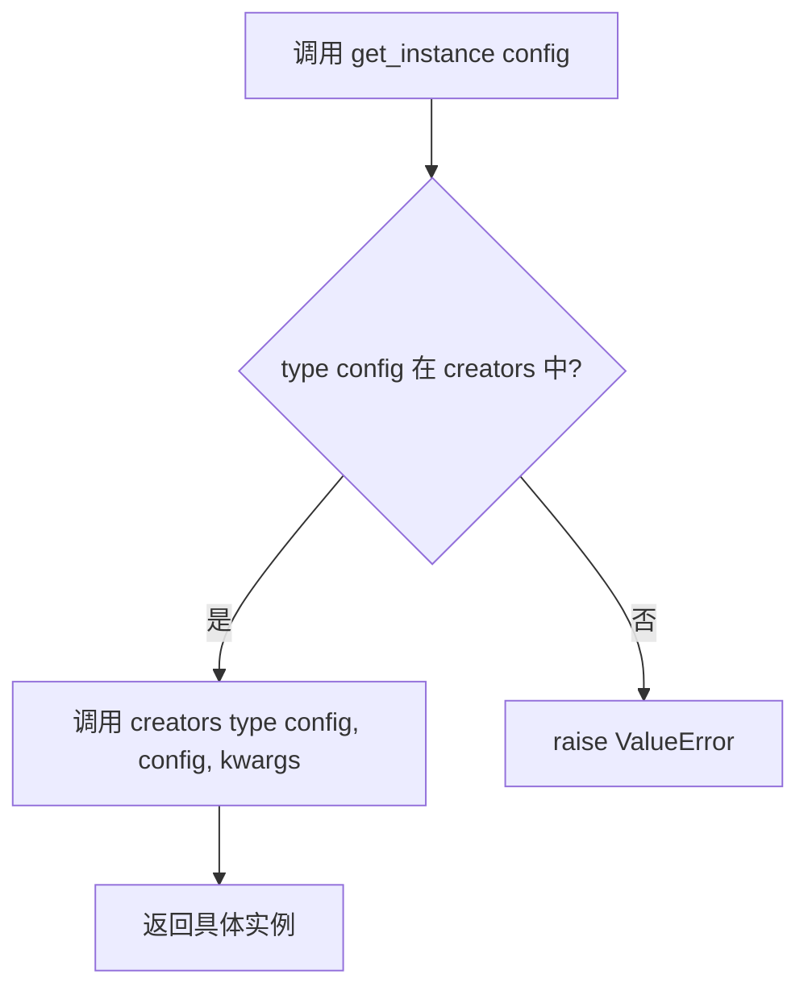
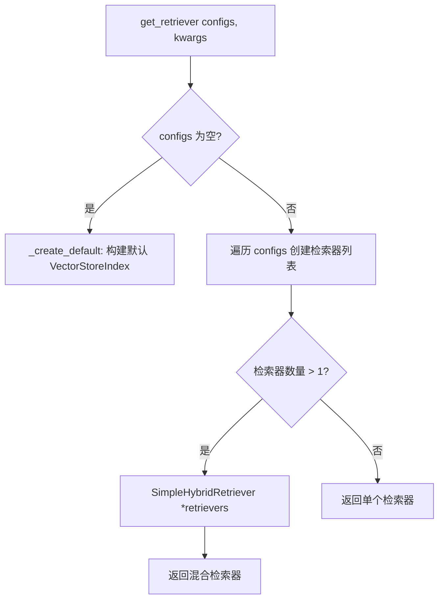
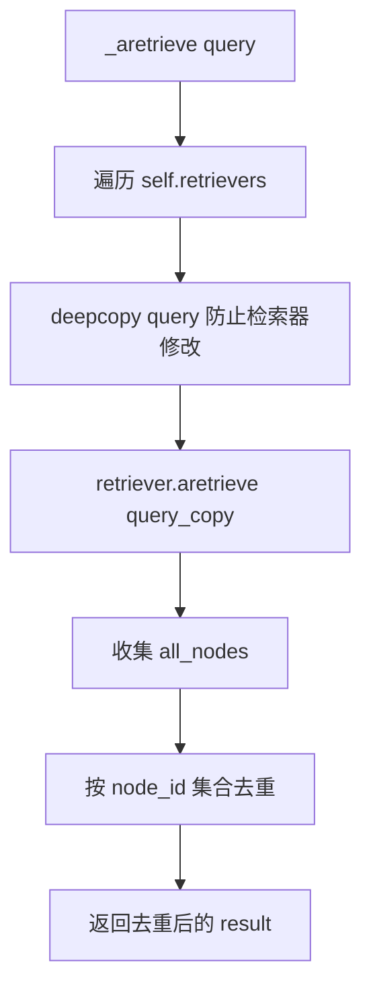
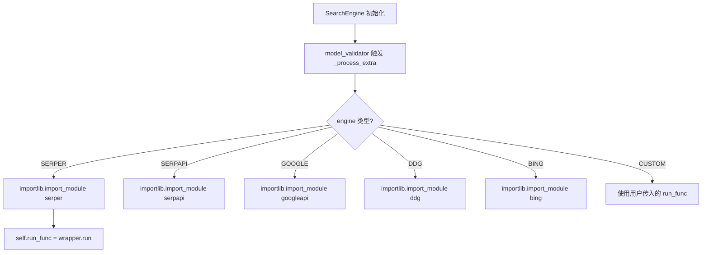

# PD-08.12 MetaGPT — 工厂模式 RAG 管线与六源搜索引擎

> 文档编号：PD-08.12
> 来源：MetaGPT `metagpt/rag/engines/simple.py` `metagpt/rag/factories/` `metagpt/tools/search_engine.py`
> GitHub：https://github.com/FoundationAgents/MetaGPT.git
> 问题域：PD-08 搜索与检索 Search & Retrieval
> 状态：可复用方案

---

## 第 1 章 问题与动机

### 1.1 核心问题

Agent 系统需要同时具备两种检索能力：**在线 Web 搜索**（获取实时信息）和**离线 RAG 检索**（查询本地知识库）。这两个子系统各自面临组合爆炸问题：

- Web 搜索层：Serper/SerpAPI/Google/Bing/DDG/Meilisearch 六种后端，每种 API 签名不同
- RAG 检索层：FAISS/Chroma/Elasticsearch/BM25 四种检索器，每种索引构建和查询方式不同
- 排序层：LLM Rerank/ColBERT/Cohere/BGE/ObjectSort 五种重排序器
- 嵌入层：OpenAI/Azure/Gemini/Ollama 四种嵌入后端

如果用 if-else 硬编码，组合数为 6 × 4 × 5 × 4 = 480 种路径，维护成本不可接受。

### 1.2 MetaGPT 的解法概述

MetaGPT 用**三层工厂 + 配置驱动**的架构解决组合爆炸：

1. **SimpleEngine 统一入口**（`metagpt/rag/engines/simple.py:64`）：继承 LlamaIndex 的 `RetrieverQueryEngine`，封装 读取→分块→嵌入→索引→检索→排序 全流程
2. **ConfigBasedFactory 工厂体系**（`metagpt/rag/factories/base.py:35`）：用 `{ConfigType: creator_func}` 字典实现类型分发，新增后端只需注册一个 Config + creator
3. **SimpleHybridRetriever 混合检索**（`metagpt/rag/retrievers/hybrid_retriever.py:10`）：多检索器结果按 node_id 去重合并
4. **SearchEngine 策略模式**（`metagpt/tools/search_engine.py:18`）：`importlib.import_module` 延迟加载搜索后端，运行时按枚举切换
5. **NoEmbedding 协议**（`metagpt/rag/interface.py:20`）：BM25 等无需嵌入的检索器通过协议标记，自动跳过嵌入步骤

### 1.3 设计思想

| 设计原则 | 具体实现 | 理由 | 替代方案 |
|----------|----------|------|----------|
| 配置驱动组合 | `BaseRetrieverConfig` 子类决定检索器类型 | 避免 if-else 爆炸，新增后端只改 Config + Factory | 硬编码 switch-case |
| 工厂模式类型分发 | `ConfigBasedFactory` 按 `type(config)` 查找 creator | 开闭原则：对扩展开放，对修改关闭 | 策略模式（需手动注入） |
| 延迟加载 | `importlib.import_module` 按需导入搜索后端 | 避免未安装的依赖导致启动失败 | 全量 import（启动慢） |
| 协议标记 | `NoEmbedding` runtime_checkable Protocol | BM25 不需要嵌入，用 MockEmbedding 占位 | 条件判断 isinstance |
| 混合检索去重 | `SimpleHybridRetriever` 按 node_id 集合去重 | 多检索器结果可能重叠，需要合并 | 加权融合（复杂度高） |

---

## 第 2 章 源码实现分析

### 2.1 架构概览

MetaGPT 的搜索与检索系统分为两个独立子系统，共享配置驱动的设计哲学：

```
┌─────────────────────────────────────────────────────────────────┐
│                        SimpleEngine                              │
│  (RetrieverQueryEngine 子类，统一 RAG 入口)                       │
│                                                                   │
│  from_docs() ──→ SimpleDirectoryReader ──→ SentenceSplitter      │
│  from_objs() ──→ ObjectNode 转换                                  │
│  from_index() ─→ 从持久化索引加载                                  │
│       │                                                           │
│       ▼                                                           │
│  ┌─────────────────────────────────────────────────────────┐     │
│  │              RetrieverFactory                            │     │
│  │  FAISSRetrieverConfig  → FAISSRetriever                 │     │
│  │  BM25RetrieverConfig   → DynamicBM25Retriever           │     │
│  │  ChromaRetrieverConfig → ChromaRetriever                │     │
│  │  ESRetrieverConfig     → ElasticsearchRetriever         │     │
│  │  多个 Config → SimpleHybridRetriever(去重合并)           │     │
│  └─────────────────────────────────────────────────────────┘     │
│       │                                                           │
│       ▼                                                           │
│  ┌─────────────────────────────────────────────────────────┐     │
│  │              RankerFactory                               │     │
│  │  LLMRankerConfig    → LLMRerank                         │     │
│  │  ColbertRerankConfig → ColbertRerank                    │     │
│  │  CohereRerankConfig → CohereRerank                     │     │
│  │  BGERerankConfig    → FlagEmbeddingReranker             │     │
│  │  ObjectRankerConfig → ObjectSortPostprocessor           │     │
│  └─────────────────────────────────────────────────────────┘     │
└─────────────────────────────────────────────────────────────────┘

┌─────────────────────────────────────────────────────────────────┐
│                      SearchEngine                                │
│  (Web 搜索统一入口，策略模式)                                      │
│                                                                   │
│  SearchEngineType.SERPER_GOOGLE  → SerperWrapper                 │
│  SearchEngineType.SERPAPI_GOOGLE → SerpAPIWrapper                │
│  SearchEngineType.DIRECT_GOOGLE → GoogleAPIWrapper               │
│  SearchEngineType.DUCK_DUCK_GO  → DDGAPIWrapper                  │
│  SearchEngineType.BING          → BingAPIWrapper                 │
│  SearchEngineType.CUSTOM_ENGINE → 用户自定义 run_func             │
│                                                                   │
│  + MeilisearchEngine (独立全文搜索引擎)                            │
└─────────────────────────────────────────────────────────────────┘
```

### 2.2 核心实现

#### 2.2.1 ConfigBasedFactory — 类型分发工厂



对应源码 `metagpt/rag/factories/base.py:35-67`：

```python
class ConfigBasedFactory(GenericFactory):
    def get_instance(self, key: Any, **kwargs) -> Any:
        creator = self._creators.get(type(key))
        if creator:
            return creator(key, **kwargs)
        self._raise_for_key(key)

    @staticmethod
    def _val_from_config_or_kwargs(key: str, config: object = None, **kwargs) -> Any:
        if config is not None and hasattr(config, key):
            val = getattr(config, key)
            if val is not None:
                return val
        if key in kwargs:
            return kwargs[key]
        return None
```

`_val_from_config_or_kwargs` 是一个精巧的参数解析器：优先从 Config 对象取值，Config 中为 None 时回退到 kwargs，实现了配置优先、kwargs 兜底的双层参数传递。

#### 2.2.2 RetrieverFactory — 多检索器自动组合



对应源码 `metagpt/rag/factories/retriever.py:50-73`：

```python
class RetrieverFactory(ConfigBasedFactory):
    def __init__(self):
        creators = {
            FAISSRetrieverConfig: self._create_faiss_retriever,
            BM25RetrieverConfig: self._create_bm25_retriever,
            ChromaRetrieverConfig: self._create_chroma_retriever,
            ElasticsearchRetrieverConfig: self._create_es_retriever,
            ElasticsearchKeywordRetrieverConfig: self._create_es_retriever,
        }
        super().__init__(creators)

    def get_retriever(self, configs: list[BaseRetrieverConfig] = None, **kwargs) -> RAGRetriever:
        if not configs:
            return self._create_default(**kwargs)
        retrievers = super().get_instances(configs, **kwargs)
        return SimpleHybridRetriever(*retrievers) if len(retrievers) > 1 else retrievers[0]
```

关键设计：当传入多个 `RetrieverConfig` 时，自动包装为 `SimpleHybridRetriever`，调用方无需关心混合逻辑。

#### 2.2.3 SimpleHybridRetriever — 多路检索去重合并



对应源码 `metagpt/rag/retrievers/hybrid_retriever.py:10-38`：

```python
class SimpleHybridRetriever(RAGRetriever):
    def __init__(self, *retrievers):
        self.retrievers: list[RAGRetriever] = retrievers
        super().__init__()

    async def _aretrieve(self, query: QueryType, **kwargs):
        all_nodes = []
        for retriever in self.retrievers:
            query_copy = copy.deepcopy(query)
            nodes = await retriever.aretrieve(query_copy, **kwargs)
            all_nodes.extend(nodes)
        result = []
        node_ids = set()
        for n in all_nodes:
            if n.node.node_id not in node_ids:
                result.append(n)
                node_ids.add(n.node.node_id)
        return result
```

注意 `copy.deepcopy(query)` — 防止某个检索器修改 query 对象影响后续检索器，这是多路检索的常见陷阱。

#### 2.2.4 SearchEngine — 延迟加载策略模式



对应源码 `metagpt/tools/search_engine.py:47-76`：

```python
def _process_extra(self, run_func=None, **kwargs):
    if self.engine == SearchEngineType.SERPAPI_GOOGLE:
        module = "metagpt.tools.search_engine_serpapi"
        run_func = importlib.import_module(module).SerpAPIWrapper(**kwargs).run
    elif self.engine == SearchEngineType.SERPER_GOOGLE:
        module = "metagpt.tools.search_engine_serper"
        run_func = importlib.import_module(module).SerperWrapper(**kwargs).run
    elif self.engine == SearchEngineType.DUCK_DUCK_GO:
        module = "metagpt.tools.search_engine_ddg"
        run_func = importlib.import_module(module).DDGAPIWrapper(**kwargs).run
    # ... BING, GOOGLE, CUSTOM
    self.run_func = run_func
```

`importlib.import_module` 实现延迟加载：只有实际使用某个搜索后端时才导入对应模块，避免未安装 `duckduckgo_search` 等可选依赖时启动失败。

### 2.3 实现细节

#### RAG 能力矩阵（Retriever Trait 系统）

MetaGPT 用 `__subclasshook__` 实现了一套轻量级的能力检测协议（`metagpt/rag/retrievers/base.py:22-75`）：

| Trait 接口 | 要求方法 | 用途 |
|-----------|---------|------|
| `ModifiableRAGRetriever` | `add_nodes()` | 动态添加文档 |
| `PersistableRAGRetriever` | `persist()` | 持久化索引 |
| `QueryableRAGRetriever` | `query_total_count()` | 查询文档总数 |
| `DeletableRAGRetriever` | `clear()` | 清空索引 |

SimpleEngine 在执行操作前通过 `_ensure_retriever_of_type()` 检查当前检索器是否具备所需能力，对 `SimpleHybridRetriever` 则检查其子检索器中是否至少有一个满足要求（`simple.py:342-355`）。

#### 嵌入后端自动解析

`RAGEmbeddingFactory`（`metagpt/rag/factories/embedding.py:18-111`）支持 OpenAI/Azure/Gemini/Ollama 四种嵌入后端，通过 `_resolve_embedding_type()` 自动从配置推断：优先用 `embedding.api_type`，回退到 `llm.api_type`（仅 OpenAI/Azure），否则报错。

FAISS 检索器的向量维度也有自动推断逻辑（`schema.py:42-58`）：Gemini 默认 768，Ollama 默认 4096，其他默认 1536。

#### ObjectNode — RAG 检索任意 Python 对象

MetaGPT 独创的 `ObjectNode`（`schema.py:212-226`）允许将任意 Pydantic 对象存入 RAG 索引：对象序列化为 JSON 存入 metadata，检索后通过 `_try_reconstruct_obj()`（`simple.py:364-370`）动态反序列化还原。这使得 RAG 不仅能检索文本，还能检索工具定义、API Schema 等结构化对象。


---

## 第 3 章 迁移指南

### 3.1 迁移清单

**阶段 1：工厂基础设施（1 个文件）**
- [ ] 实现 `ConfigBasedFactory` 基类（含 `_val_from_config_or_kwargs` 参数解析）
- [ ] 定义 `BaseRetrieverConfig` / `BaseRankerConfig` Pydantic 模型

**阶段 2：检索器层（按需选择）**
- [ ] 实现至少一种检索器（推荐 FAISS 起步）
- [ ] 实现 `RetrieverFactory`，注册 Config→Creator 映射
- [ ] 如需混合检索，实现 `SimpleHybridRetriever`

**阶段 3：排序器层（可选）**
- [ ] 按需实现 LLMRerank / ColBERT / Cohere / BGE 排序器
- [ ] 实现 `RankerFactory`

**阶段 4：统一入口**
- [ ] 实现 `SimpleEngine`，组合 Retriever + Ranker + ResponseSynthesizer
- [ ] 提供 `from_docs()` / `from_objs()` / `from_index()` 三种构造方式

**阶段 5：Web 搜索层（独立于 RAG）**
- [ ] 实现 `SearchEngine` 策略模式，按需接入搜索后端

### 3.2 适配代码模板

#### 最小可用 RAG 引擎（FAISS + LLM Rerank）

```python
from dataclasses import dataclass
from typing import Any, Callable, Optional
from pydantic import BaseModel, Field


# --- 1. 工厂基础设施 ---
class ConfigBasedFactory:
    """类型分发工厂：按 Config 类型查找对应的 creator 函数。"""

    def __init__(self, creators: dict[type, Callable] = None):
        self._creators = creators or {}

    def get_instance(self, config: Any, **kwargs) -> Any:
        creator = self._creators.get(type(config))
        if not creator:
            raise ValueError(f"Unknown config: {type(config)}")
        return creator(config, **kwargs)

    def get_instances(self, configs: list, **kwargs) -> list:
        return [self.get_instance(c, **kwargs) for c in configs]


# --- 2. 配置定义 ---
class RetrieverConfig(BaseModel):
    similarity_top_k: int = 5

class FAISSConfig(RetrieverConfig):
    dimensions: int = 1536

class BM25Config(RetrieverConfig):
    pass

class RankerConfig(BaseModel):
    top_n: int = 5


# --- 3. 混合检索器 ---
class HybridRetriever:
    """多路检索 + node_id 去重。"""

    def __init__(self, *retrievers):
        self.retrievers = retrievers

    async def aretrieve(self, query: str) -> list[dict]:
        import copy
        all_nodes, seen_ids = [], set()
        for r in self.retrievers:
            nodes = await r.aretrieve(copy.deepcopy(query))
            for n in nodes:
                if n["id"] not in seen_ids:
                    all_nodes.append(n)
                    seen_ids.add(n["id"])
        return all_nodes


# --- 4. 检索器工厂 ---
class RetrieverFactory(ConfigBasedFactory):
    def __init__(self):
        super().__init__({
            FAISSConfig: self._create_faiss,
            BM25Config: self._create_bm25,
        })

    def get_retriever(self, configs: list[RetrieverConfig] = None, **kwargs):
        if not configs:
            raise ValueError("At least one config required")
        retrievers = self.get_instances(configs, **kwargs)
        return HybridRetriever(*retrievers) if len(retrievers) > 1 else retrievers[0]

    def _create_faiss(self, config: FAISSConfig, **kwargs):
        # 实际项目中替换为 FAISS 索引构建逻辑
        return {"type": "faiss", "top_k": config.similarity_top_k}

    def _create_bm25(self, config: BM25Config, **kwargs):
        return {"type": "bm25", "top_k": config.similarity_top_k}


# --- 5. 搜索引擎策略模式 ---
class SearchEngine:
    """延迟加载 + 策略模式的 Web 搜索引擎。"""

    _backends = {
        "serper": "my_project.search.serper",
        "ddg": "my_project.search.ddg",
        "bing": "my_project.search.bing",
    }

    def __init__(self, engine: str = "ddg", **kwargs):
        import importlib
        module = importlib.import_module(self._backends[engine])
        self._run_func = module.SearchWrapper(**kwargs).run

    async def run(self, query: str, max_results: int = 8) -> list[dict]:
        return await self._run_func(query, max_results=max_results)
```

### 3.3 适用场景

| 场景 | 适用度 | 说明 |
|------|--------|------|
| 多后端 RAG 系统 | ⭐⭐⭐ | 工厂模式天然适合多检索器组合 |
| 需要混合检索（向量+BM25） | ⭐⭐⭐ | SimpleHybridRetriever 开箱即用 |
| 搜索后端需要运行时切换 | ⭐⭐⭐ | 配置驱动 + 延迟加载，零代码切换 |
| 单一检索器简单场景 | ⭐⭐ | 工厂体系有一定过度设计感 |
| 需要加权融合排序 | ⭐ | 当前只有去重合并，无加权融合 |

---

## 第 4 章 测试用例

```python
import copy
import json
import pytest
from unittest.mock import AsyncMock, MagicMock, patch


class TestConfigBasedFactory:
    """测试类型分发工厂。"""

    def test_dispatch_by_config_type(self):
        """不同 Config 类型应分发到不同 creator。"""
        class ConfigA:
            pass
        class ConfigB:
            pass

        factory_calls = []
        creators = {
            ConfigA: lambda c, **kw: factory_calls.append("A") or "instance_a",
            ConfigB: lambda c, **kw: factory_calls.append("B") or "instance_b",
        }

        from metagpt.rag.factories.base import ConfigBasedFactory
        factory = ConfigBasedFactory(creators)

        assert factory.get_instance(ConfigA()) == "instance_a"
        assert factory.get_instance(ConfigB()) == "instance_b"
        assert factory_calls == ["A", "B"]

    def test_unknown_config_raises(self):
        """未注册的 Config 类型应抛出 ValueError。"""
        from metagpt.rag.factories.base import ConfigBasedFactory
        factory = ConfigBasedFactory({})

        with pytest.raises(ValueError, match="Unknown config"):
            factory.get_instance(object())

    def test_val_from_config_or_kwargs_priority(self):
        """Config 值优先于 kwargs。"""
        from metagpt.rag.factories.base import ConfigBasedFactory

        class FakeConfig:
            index = "from_config"

        result = ConfigBasedFactory._val_from_config_or_kwargs(
            "index", FakeConfig(), index="from_kwargs"
        )
        assert result == "from_config"

    def test_val_from_config_none_fallback_kwargs(self):
        """Config 值为 None 时回退到 kwargs。"""
        from metagpt.rag.factories.base import ConfigBasedFactory

        class FakeConfig:
            index = None

        result = ConfigBasedFactory._val_from_config_or_kwargs(
            "index", FakeConfig(), index="from_kwargs"
        )
        assert result == "from_kwargs"


class TestSimpleHybridRetriever:
    """测试混合检索去重。"""

    @pytest.mark.asyncio
    async def test_dedup_by_node_id(self):
        """相同 node_id 的结果应被去重。"""
        from metagpt.rag.retrievers.hybrid_retriever import SimpleHybridRetriever

        node_a = MagicMock()
        node_a.node.node_id = "id_1"
        node_b = MagicMock()
        node_b.node.node_id = "id_2"
        node_dup = MagicMock()
        node_dup.node.node_id = "id_1"  # 与 node_a 重复

        r1 = MagicMock()
        r1.aretrieve = AsyncMock(return_value=[node_a, node_b])
        r2 = MagicMock()
        r2.aretrieve = AsyncMock(return_value=[node_dup])

        hybrid = SimpleHybridRetriever(r1, r2)
        results = await hybrid._aretrieve("test query")

        assert len(results) == 2
        assert {n.node.node_id for n in results} == {"id_1", "id_2"}

    @pytest.mark.asyncio
    async def test_query_deepcopy_isolation(self):
        """每个检索器应收到独立的 query 副本。"""
        from metagpt.rag.retrievers.hybrid_retriever import SimpleHybridRetriever

        received_queries = []

        async def capture_query(q, **kwargs):
            received_queries.append(id(q))
            return []

        r1 = MagicMock()
        r1.aretrieve = capture_query
        r2 = MagicMock()
        r2.aretrieve = capture_query

        hybrid = SimpleHybridRetriever(r1, r2)
        await hybrid._aretrieve("test")

        # 两个检索器收到的 query 对象应该是不同的（deepcopy）
        assert received_queries[0] != received_queries[1]


class TestSearchEngine:
    """测试 Web 搜索引擎策略模式。"""

    @pytest.mark.asyncio
    async def test_ignore_errors_returns_empty(self):
        """ignore_errors=True 时异常应返回空结果。"""
        from metagpt.tools.search_engine import SearchEngine

        engine = SearchEngine(engine=SearchEngineType.CUSTOM_ENGINE,
                              run_func=AsyncMock(side_effect=Exception("API down")))
        result = await engine.run("test", ignore_errors=True)
        assert result == ""

    @pytest.mark.asyncio
    async def test_ignore_errors_false_raises(self):
        """ignore_errors=False 时异常应向上传播。"""
        from metagpt.tools.search_engine import SearchEngine

        engine = SearchEngine(engine=SearchEngineType.CUSTOM_ENGINE,
                              run_func=AsyncMock(side_effect=ValueError("bad")))
        with pytest.raises(ValueError, match="bad"):
            await engine.run("test", ignore_errors=False)


class TestRetrieverFactory:
    """测试检索器工厂的自动组合逻辑。"""

    def test_single_config_returns_single_retriever(self):
        """单个 Config 应返回单个检索器，不包装 Hybrid。"""
        from metagpt.rag.factories.retriever import RetrieverFactory
        from metagpt.rag.schema import FAISSRetrieverConfig

        factory = RetrieverFactory()
        # 需要提供 nodes 和 embed_model
        # 此处验证逻辑分支，实际运行需要完整依赖

    def test_multiple_configs_returns_hybrid(self):
        """多个 Config 应自动包装为 SimpleHybridRetriever。"""
        # 验证 len(retrievers) > 1 时返回 SimpleHybridRetriever
        pass
```


---

## 第 5 章 跨域关联

| 关联域 | 关系类型 | 说明 |
|--------|----------|------|
| PD-04 工具系统 | 协同 | `SearchEngine` 本身可作为 Agent 工具注册，`SimpleEngine.asearch()` 实现了 `SearchInterface` 接口 |
| PD-06 记忆持久化 | 协同 | RAG 索引的 `persist()` / `from_index()` 实现了知识库的跨会话持久化 |
| PD-03 容错与重试 | 依赖 | `SearchEngine.run()` 的 `ignore_errors` 参数提供了搜索层容错，但 RAG 层缺少重试机制 |
| PD-10 中间件管道 | 互补 | `node_postprocessors`（Ranker 链）本质上是 RAG 管道的后处理中间件 |
| PD-01 上下文管理 | 依赖 | RAG 检索结果需要注入 LLM 上下文，`SentenceSplitter` 的分块策略直接影响上下文利用率 |

---

## 第 6 章 来源文件索引

| 文件 | 行范围 | 关键实现 |
|------|--------|----------|
| `metagpt/rag/engines/simple.py` | L64-412 | SimpleEngine 统一 RAG 入口，from_docs/from_objs/from_index 三种构造 |
| `metagpt/rag/factories/base.py` | L35-67 | ConfigBasedFactory 类型分发工厂基类 |
| `metagpt/rag/factories/retriever.py` | L50-157 | RetrieverFactory，5 种检索器的创建逻辑 |
| `metagpt/rag/factories/ranker.py` | L19-80 | RankerFactory，5 种排序器的创建逻辑 |
| `metagpt/rag/factories/embedding.py` | L18-111 | RAGEmbeddingFactory，4 种嵌入后端 |
| `metagpt/rag/factories/index.py` | L23-82 | RAGIndexFactory，从持久化加载索引 |
| `metagpt/rag/retrievers/hybrid_retriever.py` | L10-48 | SimpleHybridRetriever 多路检索去重合并 |
| `metagpt/rag/retrievers/bm25_retriever.py` | L13-73 | DynamicBM25Retriever，支持动态添加节点 |
| `metagpt/rag/retrievers/base.py` | L11-75 | RAGRetriever 基类 + 4 种能力 Trait |
| `metagpt/rag/schema.py` | L21-275 | 全部 Config 定义 + ObjectNode |
| `metagpt/rag/interface.py` | L7-24 | RAGObject / NoEmbedding 协议 |
| `metagpt/rag/rankers/object_ranker.py` | L14-55 | ObjectSortPostprocessor 对象字段排序 |
| `metagpt/tools/search_engine.py` | L18-145 | SearchEngine 策略模式统一入口 |
| `metagpt/tools/search_engine_serper.py` | L16-119 | SerperWrapper，Serper API 封装 |
| `metagpt/tools/search_engine_ddg.py` | L21-94 | DDGAPIWrapper，DuckDuckGo 封装 |
| `metagpt/tools/search_engine_meilisearch.py` | L23-42 | MeilisearchEngine，全文搜索引擎 |
| `metagpt/configs/search_config.py` | L16-41 | SearchEngineType 枚举 + SearchConfig |

---

## 第 7 章 横向对比维度

```json comparison_data
{
  "project": "MetaGPT",
  "dimensions": {
    "搜索架构": "双层架构：Web 搜索(策略模式6后端) + RAG 检索(工厂模式4引擎)",
    "去重机制": "SimpleHybridRetriever 按 node_id 集合去重，deepcopy 隔离查询",
    "结果处理": "node_postprocessors 链式后处理，支持 LLM/ColBERT/Cohere/BGE 重排序",
    "容错策略": "SearchEngine ignore_errors 返回空结果；延迟加载避免缺依赖启动失败",
    "成本控制": "NoEmbedding 协议跳过 BM25 嵌入；MockEmbedding 占位避免无效计算",
    "检索方式": "FAISS 向量/Chroma 向量/Elasticsearch 向量+文本/BM25 关键词，可混合",
    "索引结构": "VectorStoreIndex 统一抽象，FAISS/Chroma/ES 三种向量存储后端",
    "排序策略": "5 种 Ranker 可组合：LLM/ColBERT/Cohere/BGE/ObjectSort",
    "扩展性": "ConfigBasedFactory 开闭原则：新增后端只需 Config 类 + creator 函数",
    "对象检索": "ObjectNode 将 Pydantic 对象序列化入 RAG，检索后动态反序列化还原"
  }
}
```

### 域元数据补充

```json domain_metadata
{
  "solution_summary": "MetaGPT 用 ConfigBasedFactory 工厂体系统一 FAISS/Chroma/ES/BM25 四种检索器 + 五种重排序器的组合，SimpleHybridRetriever 多路去重合并，SearchEngine 延迟加载六种 Web 搜索后端",
  "description": "工厂模式解决 RAG 管线组件组合爆炸问题，配置驱动零代码切换后端",
  "sub_problems": [
    "对象检索：如何将结构化 Python 对象（工具定义、API Schema）存入 RAG 索引并在检索后还原",
    "能力检测：混合检索器中如何验证子检索器是否支持 persist/add_nodes 等操作",
    "嵌入维度自适应：不同嵌入后端输出维度不同时如何自动匹配 FAISS 索引维度"
  ],
  "best_practices": [
    "多路检索必须 deepcopy query：防止某个检索器修改查询对象影响后续检索器",
    "NoEmbedding 协议标记免嵌入检索器：BM25 等不需要向量的检索器用 MockEmbedding 占位，避免无效嵌入计算",
    "工厂模式优于 if-else 分发：新增检索/排序后端只需注册 Config+Creator，不修改已有代码"
  ]
}
```
