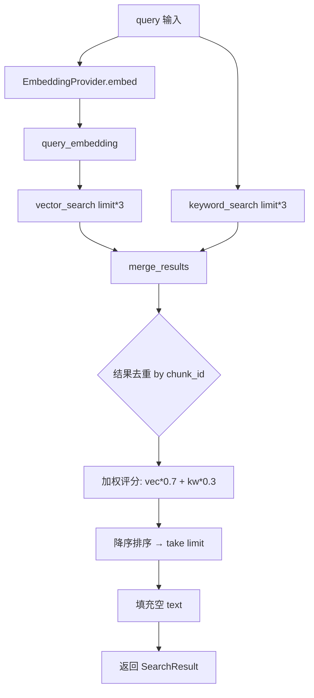
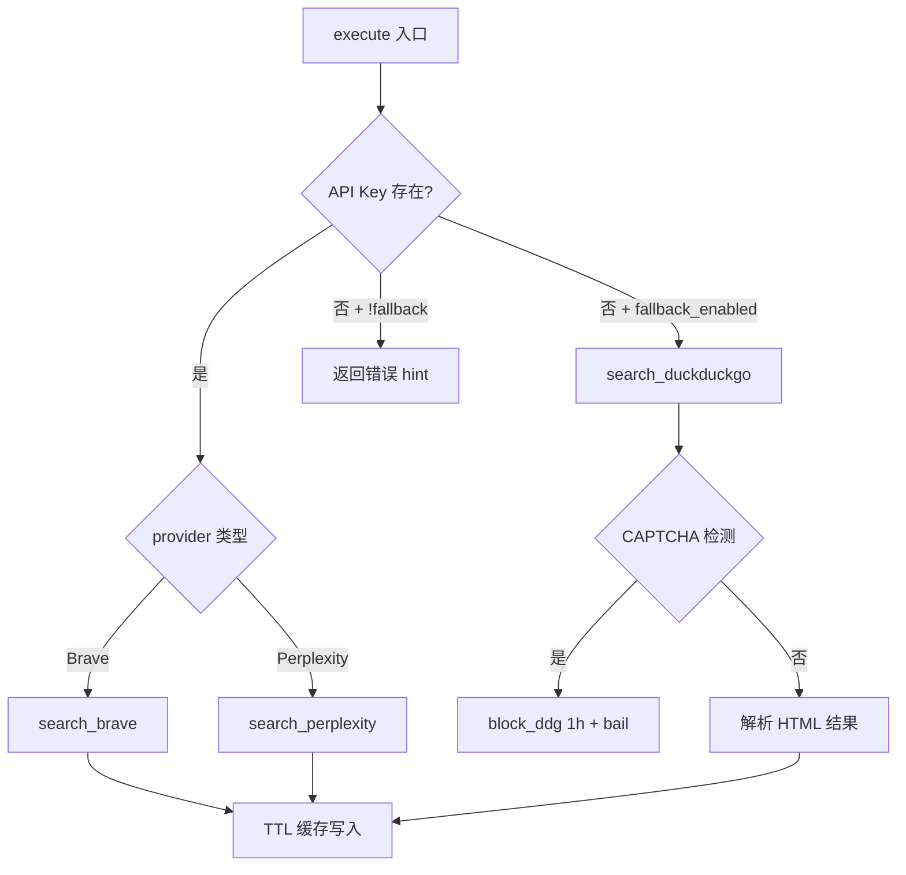
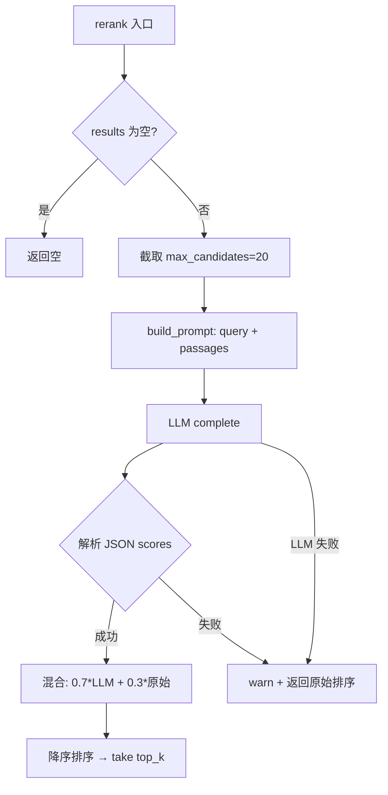

# PD-08.XX Moltis — 三层混合检索与 LLM-Reranker 加权融合

> 文档编号：PD-08.XX
> 来源：Moltis `crates/memory/src/search.rs` `crates/tools/src/web_search.rs` `crates/tools/src/web_fetch.rs`
> GitHub：https://github.com/moltis-org/moltis.git
> 问题域：PD-08 搜索与检索 Search & Retrieval
> 状态：可复用方案

---

## 第 1 章 问题与动机

### 1.1 核心问题

Agent 系统需要同时具备两种检索能力：**外部 Web 搜索**（获取实时信息）和**内部记忆检索**（召回历史上下文）。单一检索方式无法兼顾精确度和召回率——纯向量搜索会遗漏关键词精确匹配，纯关键词搜索无法理解语义相似性。此外，Web 搜索 API 的可用性不稳定（API Key 缺失、CAPTCHA 限流），需要多层降级保障。

Moltis 面临的具体挑战：
1. 搜索源多样性：Brave Search、Perplexity、DuckDuckGo 三种 Web 搜索后端，需要统一接口和自动降级
2. 混合检索融合：向量相似度和关键词匹配的结果如何合理合并排序
3. 安全性：URL 抓取需防止 SSRF 攻击
4. 成本控制：缓存机制避免重复请求，LLM Reranker 需控制候选数量

### 1.2 Moltis 的解法概述

1. **三层 Web 搜索降级链**：Brave/Perplexity → DuckDuckGo HTML fallback → 错误提示，通过 `fallback_enabled` 配置控制（`crates/tools/src/web_search.rs:42`）
2. **加权混合检索**：`hybrid_search()` 函数以 3 倍 over-fetch 后按 `vector_weight`/`keyword_weight` 加权合并，chunk_id 去重（`crates/memory/src/search.rs:51-94`）
3. **LLM-as-Reranker**：用通用 LLM 生成 0-1 相关性评分，70% LLM + 30% 原始分数混合，失败时优雅回退原始排序（`crates/memory/src/reranking.rs:119-191`）
4. **SSRF 防护 + CIDR 白名单**：DNS 解析后逐 IP 校验私有地址，支持配置例外（`crates/tools/src/web_fetch.rs:193-223`）
5. **TTL 内存缓存 + 惰性淘汰**：搜索和抓取结果均缓存，超 100 条时触发过期清理（`crates/tools/src/web_search.rs:269-284`）

### 1.3 设计思想

| 设计原则 | 具体实现 | 理由 | 替代方案 |
|----------|----------|------|----------|
| 降级优于失败 | Brave→DDG fallback + CAPTCHA 1h 冷却 | 无 API Key 时仍可搜索，CAPTCHA 后快速失败避免浪费 | 直接报错让用户配置 Key |
| 加权融合优于单一排序 | vector_weight=0.7 + keyword_weight=0.3 | 语义为主、精确匹配为辅，平衡召回率和精确度 | RRF (Reciprocal Rank Fusion) |
| Trait 抽象解耦 | MemoryStore/EmbeddingProvider/RerankerProvider 三 trait | 存储、嵌入、排序三层独立替换 | 单体实现 |
| 安全默认 | SSRF 默认拒绝私有 IP，需显式白名单放行 | 防止 Agent 被诱导访问内网 | 不做检查或仅检查 localhost |
| 缓存透明 | cache_key 包含 key_state 区分有无 API Key | 热更新 Key 后自动失效旧缓存 | 固定 TTL 不区分 |

---

## 第 2 章 源码实现分析

### 2.1 架构概览

Moltis 的搜索与检索系统分为两个独立子系统：**Web 搜索工具**（外部信息获取）和**Memory 混合检索**（内部知识召回），通过 `AgentTool` trait 统一注册到工具系统。

```
┌─────────────────────────────────────────────────────────────┐
│                      Agent (LLM)                            │
│                         │                                   │
│              ┌──────────┼──────────┐                        │
│              ▼          ▼          ▼                        │
│        web_search   web_fetch   memory_search              │
│              │          │          │                        │
│   ┌──────────┤    ┌─────┤    ┌─────┴──────┐                │
│   ▼     ▼    ▼    ▼     ▼    ▼            ▼                │
│ Brave  Pplx DDG  SSRF  HTML  vector    keyword             │
│   │     │    │   Check  →MD   search    search             │
│   └──┬──┘    │    │     │     │            │               │
│      │       │    │     │     └─────┬──────┘               │
│   TTL Cache  │  Redirect│     merge_results()              │
│              │  Follow  │           │                       │
│              │          │     LLM Reranker                  │
│              │          │     (optional)                    │
│              │          │           │                       │
│              └──────────┘     SearchResult[]                │
│                               + citations                  │
└─────────────────────────────────────────────────────────────┘
```

### 2.2 核心实现

#### 2.2.1 混合检索与加权融合



对应源码 `crates/memory/src/search.rs:51-94`：

```rust
pub async fn hybrid_search(
    store: &dyn MemoryStore,
    embedder: &dyn EmbeddingProvider,
    query: &str,
    limit: usize,
    vector_weight: f32,
    keyword_weight: f32,
) -> anyhow::Result<Vec<SearchResult>> {
    let query_embedding = embedder.embed(query).await?;

    let fetch_limit = limit * 3; // over-fetch for merging
    let vector_results = store.vector_search(&query_embedding, fetch_limit).await?;
    let keyword_results = store.keyword_search(query, fetch_limit).await?;

    let merged = merge_results(
        &vector_results,
        &keyword_results,
        vector_weight,
        keyword_weight,
    );

    let mut final_results: Vec<SearchResult> = merged.into_iter().take(limit).collect();

    // Fill in text for results that need it
    for result in &mut final_results {
        if result.text.is_empty()
            && let Some(chunk) = store.get_chunk_by_id(&result.chunk_id).await?
        {
            result.text = chunk.text;
        }
    }
    Ok(final_results)
}
```

`merge_results` 的去重逻辑（`crates/memory/src/search.rs:126-158`）：用 `HashMap<chunk_id, (score, SearchResult)>` 累加同一 chunk 在两个通道的加权分数，最终降序排列。

#### 2.2.2 Web 搜索三层降级链



对应源码 `crates/tools/src/web_search.rs:698-759`：

```rust
async fn execute(&self, params: serde_json::Value) -> Result<serde_json::Value> {
    let query = params.get("query").and_then(|v| v.as_str())
        .ok_or_else(|| anyhow::anyhow!("missing 'query' parameter"))?;
    let count = params.get("count").and_then(|v| v.as_u64())
        .map(|n| n.clamp(1, 10) as u8)
        .unwrap_or(self.max_results);
    let api_key = self.current_api_key().await;

    // cache_key 包含 key_state 区分有无 Key
    let key_state = if api_key.is_empty() { "no-key" } else { "has-key" };
    let cache_key = format!("{:?}:{key_state}:{query}:{count}", self.provider);
    if let Some(cached) = self.cache_get(&cache_key) {
        return Ok(cached);
    }

    // 无 Key 时直接走 DDG，跳过必定失败的 API 调用
    let result = if self.fallback_enabled && api_key.is_empty() {
        self.search_duckduckgo(query, count).await?
    } else {
        match &self.provider {
            SearchProvider::Brave => self.search_brave(query, count, &params, accept_language, &api_key).await?,
            SearchProvider::Perplexity { base_url_override, model } => {
                let base_url = resolve_perplexity_base_url(base_url_override.as_deref(), &api_key);
                self.search_perplexity(query, &api_key, &base_url, model).await?
            },
        }
    };
    self.cache_set(cache_key, result.clone());
    Ok(result)
}
```

#### 2.2.3 LLM Reranker 评分混合



对应源码 `crates/memory/src/reranking.rs:120-191`：

```rust
async fn rerank(&self, query: &str, mut results: Vec<SearchResult>, top_k: usize)
    -> anyhow::Result<Vec<SearchResult>>
{
    let candidates: Vec<SearchResult> = results
        .drain(..results.len().min(self.max_candidates))
        .collect();
    let remaining = results;

    let prompt = self.build_prompt(query, &candidates);

    match self.client.complete(&prompt, self.model.as_deref()).await {
        Ok(response) => {
            match self.parse_scores(&response, candidates.len()) {
                Ok(scores) => {
                    let mut scored: Vec<(f32, SearchResult)> = candidates
                        .into_iter().zip(scores)
                        .map(|(mut r, score)| {
                            r.score = score * 0.7 + r.score * 0.3; // 70% LLM + 30% 原始
                            (r.score, r)
                        }).collect();
                    scored.sort_by(|a, b| b.0.partial_cmp(&a.0).unwrap_or(std::cmp::Ordering::Equal));
                    let mut final_results: Vec<SearchResult> =
                        scored.into_iter().map(|(_, r)| r).take(top_k).collect();
                    if final_results.len() < top_k {
                        final_results.extend(remaining.into_iter().take(top_k - final_results.len()));
                    }
                    Ok(final_results)
                },
                Err(e) => { warn!("failed to parse reranking scores"); /* 回退原始排序 */ }
            }
        },
        Err(e) => { warn!("LLM reranking failed"); /* 回退原始排序 */ }
    }
}
```

### 2.3 实现细节

**嵌入降级链**（`crates/memory/src/embeddings_fallback.rs:65-198`）：`FallbackEmbeddingProvider` 维护一个有序 provider 链，每个 provider 有独立的断路器（3 次连续失败 → 60s 冷却）。成功时自动切换 `active` 指针，后续请求直接走新 provider。

**SSRF 防护**（`crates/tools/src/web_fetch.rs:193-248`）：`ssrf_check()` 在每次 HTTP 请求前执行 DNS 解析，逐 IP 检查是否为私有地址（loopback/private/link-local/CGNAT/broadcast），支持 CIDR 白名单例外。手动处理重定向（`redirect::Policy::none()`），每跳都重新做 SSRF 检查，防止 DNS rebinding。

**DuckDuckGo CAPTCHA 冷却**（`crates/tools/src/web_search.rs:406-468`）：检测到 `challenge-form` 或 `not a Robot` 后，设置 `ddg_blocked_until = now + 1h`，后续调用 `is_ddg_blocked()` 快速失败，避免无意义的网络往返。

**缓存 key_state 区分**（`crates/tools/src/web_search.rs:714-719`）：cache_key 包含 `has-key`/`no-key` 前缀，当用户运行时通过 `EnvVarProvider` 热更新 API Key 后，旧的无 Key 缓存自动失效。

**Citation 自动模式**（`crates/memory/src/search.rs:34-47`）：`CitationMode::Auto` 仅在结果来自多个不同文件时才附加引用，单文件结果不加引用，减少输出噪声。


---

## 第 3 章 迁移指南

### 3.1 迁移清单

**阶段 1：混合检索核心（1 个文件）**
- [ ] 定义 `SearchResult` 结构体（chunk_id, path, score, text）
- [ ] 实现 `merge_results()` 加权去重函数
- [ ] 实现 `hybrid_search()` 入口函数
- [ ] 配置 `vector_weight` / `keyword_weight` 参数

**阶段 2：LLM Reranker（1 个文件）**
- [ ] 定义 `RerankerProvider` trait
- [ ] 实现 `LlmReranker`：prompt 构建 + JSON 分数解析 + 混合评分
- [ ] 实现 `NoOpReranker` 作为禁用时的默认实现
- [ ] 在 hybrid_search 后可选调用 reranker

**阶段 3：Web 搜索降级链（1 个文件）**
- [ ] 实现主搜索 provider（Brave 或其他）
- [ ] 实现 DuckDuckGo HTML fallback 解析
- [ ] 添加 CAPTCHA 检测 + 冷却机制
- [ ] 添加 TTL 内存缓存

**阶段 4：安全加固**
- [ ] 实现 SSRF 检查（DNS 解析 + 私有 IP 拒绝）
- [ ] 手动重定向跟踪（每跳重新 SSRF 检查）
- [ ] 配置 CIDR 白名单

### 3.2 适配代码模板

以下 Python 模板可直接复用 Moltis 的混合检索 + Reranker 模式：

```python
from dataclasses import dataclass
from typing import Protocol

@dataclass
class SearchResult:
    chunk_id: str
    path: str
    score: float
    text: str

class VectorStore(Protocol):
    async def vector_search(self, embedding: list[float], limit: int) -> list[SearchResult]: ...
    async def keyword_search(self, query: str, limit: int) -> list[SearchResult]: ...

class EmbeddingProvider(Protocol):
    async def embed(self, text: str) -> list[float]: ...

class RerankerProvider(Protocol):
    async def rerank(self, query: str, results: list[SearchResult], top_k: int) -> list[SearchResult]: ...

def merge_results(
    vector: list[SearchResult],
    keyword: list[SearchResult],
    vector_weight: float = 0.7,
    keyword_weight: float = 0.3,
) -> list[SearchResult]:
    """Moltis 式加权去重合并"""
    scores: dict[str, tuple[float, SearchResult]] = {}
    for r in vector:
        entry = scores.setdefault(r.chunk_id, (0.0, r))
        scores[r.chunk_id] = (entry[0] + r.score * vector_weight, entry[1])
    for r in keyword:
        entry = scores.setdefault(r.chunk_id, (0.0, r))
        scores[r.chunk_id] = (entry[0] + r.score * keyword_weight, entry[1])
    merged = [SearchResult(chunk_id=cid, path=sr.path, score=s, text=sr.text)
              for cid, (s, sr) in scores.items()]
    return sorted(merged, key=lambda r: r.score, reverse=True)

async def hybrid_search(
    store: VectorStore,
    embedder: EmbeddingProvider,
    query: str,
    limit: int = 10,
    vector_weight: float = 0.7,
    keyword_weight: float = 0.3,
    reranker: RerankerProvider | None = None,
) -> list[SearchResult]:
    """Moltis 式三层检索：向量 + 关键词 + 可选 Reranker"""
    embedding = await embedder.embed(query)
    fetch_limit = limit * 3  # over-fetch
    vec_results = await store.vector_search(embedding, fetch_limit)
    kw_results = await store.keyword_search(query, fetch_limit)
    merged = merge_results(vec_results, kw_results, vector_weight, keyword_weight)
    results = merged[:limit]
    if reranker:
        results = await reranker.rerank(query, results, limit)
    return results
```

### 3.3 适用场景

| 场景 | 适用度 | 说明 |
|------|--------|------|
| Agent 记忆检索 | ⭐⭐⭐ | 核心场景，向量+关键词混合最适合非结构化文本 |
| RAG 知识库问答 | ⭐⭐⭐ | over-fetch + rerank 显著提升答案相关性 |
| 多源 Web 搜索 | ⭐⭐⭐ | 降级链保障可用性，适合不确定 API 可用性的场景 |
| 代码搜索 | ⭐⭐ | 关键词权重需调高（代码更依赖精确匹配） |
| 实时数据检索 | ⭐ | 缓存 TTL 需设短，不适合毫秒级实时性要求 |

---

## 第 4 章 测试用例

基于 Moltis 真实函数签名的测试代码：

```python
import pytest
from unittest.mock import AsyncMock, MagicMock

class TestMergeResults:
    """对应 crates/memory/src/search.rs merge_results 测试"""

    def test_deduplication_and_weighting(self):
        vec = [SearchResult("c1", "a.md", 0.9, ""), SearchResult("c2", "b.md", 0.5, "")]
        kw = [SearchResult("c1", "a.md", 0.8, ""), SearchResult("c3", "c.md", 0.7, "")]
        merged = merge_results(vec, kw, 0.7, 0.3)
        c1 = next(r for r in merged if r.chunk_id == "c1")
        assert abs(c1.score - 0.87) < 1e-5  # 0.9*0.7 + 0.8*0.3

    def test_empty_inputs(self):
        assert merge_results([], [], 0.7, 0.3) == []

    def test_single_source_only(self):
        vec = [SearchResult("c1", "a.md", 0.9, "text")]
        merged = merge_results(vec, [], 0.7, 0.3)
        assert len(merged) == 1
        assert abs(merged[0].score - 0.63) < 1e-5  # 0.9*0.7

class TestHybridSearch:
    """对应 crates/memory/src/search.rs hybrid_search"""

    @pytest.mark.asyncio
    async def test_over_fetch_factor(self):
        store = AsyncMock()
        store.vector_search.return_value = []
        store.keyword_search.return_value = []
        embedder = AsyncMock()
        embedder.embed.return_value = [0.1] * 384
        await hybrid_search(store, embedder, "test", limit=5)
        store.vector_search.assert_called_once_with(embedder.embed.return_value, 15)  # 5*3
        store.keyword_search.assert_called_once_with("test", 15)

class TestLlmReranker:
    """对应 crates/memory/src/reranking.rs LlmReranker"""

    @pytest.mark.asyncio
    async def test_score_blending(self):
        """70% LLM + 30% 原始"""
        llm = AsyncMock()
        llm.complete.return_value = "[0.3, 0.9]"
        reranker = LlmReranker(llm, max_candidates=20)
        results = [
            SearchResult("c1", "a.md", 0.9, "first"),
            SearchResult("c2", "b.md", 0.7, "second"),
        ]
        reranked = await reranker.rerank("query", results, 2)
        assert reranked[0].chunk_id == "c2"  # LLM 给 c2 更高分

    @pytest.mark.asyncio
    async def test_graceful_fallback_on_llm_failure(self):
        llm = AsyncMock()
        llm.complete.side_effect = Exception("LLM down")
        reranker = LlmReranker(llm, max_candidates=20)
        results = [SearchResult("c1", "a.md", 0.9, "text")]
        reranked = await reranker.rerank("query", results, 1)
        assert reranked[0].chunk_id == "c1"  # 回退原始排序

class TestWebSearchFallback:
    """对应 crates/tools/src/web_search.rs DDG fallback"""

    def test_captcha_detection_blocks_subsequent_calls(self):
        tool = WebSearchTool(fallback_enabled=True)
        assert not tool.is_ddg_blocked()
        tool.block_ddg(duration_secs=3600)
        assert tool.is_ddg_blocked()

    def test_cache_key_includes_key_state(self):
        key_with = f"Brave:has-key:rust:5"
        key_without = f"Brave:no-key:rust:5"
        assert key_with != key_without  # 热更新 Key 后缓存自动失效
```


---

## 第 5 章 跨域关联

| 关联域 | 关系类型 | 说明 |
|--------|----------|------|
| PD-01 上下文管理 | 协同 | 检索结果注入 LLM 上下文前需截断控制，`max_chars` 和 chunk_size 直接影响上下文窗口占用 |
| PD-03 容错与重试 | 依赖 | Web 搜索三层降级链是容错模式的典型应用；嵌入 fallback 链的断路器（3 次失败 → 60s 冷却）属于 PD-03 |
| PD-04 工具系统 | 依赖 | WebSearchTool/WebFetchTool 通过 `AgentTool` trait 注册到 `ToolRegistry`，工具系统决定搜索工具的可见性 |
| PD-06 记忆持久化 | 协同 | `MemoryStore` trait 同时服务于记忆写入（PD-06）和检索（PD-08），SQLite 后端共享 |
| PD-11 可观测性 | 协同 | hybrid_search 通过 `#[cfg(feature = "metrics")]` 条件编译记录搜索次数和耗时 |

---

## 第 6 章 来源文件索引

| 文件 | 行范围 | 关键实现 |
|------|--------|----------|
| `crates/memory/src/search.rs` | L1-L311 | SearchResult 结构体、hybrid_search、keyword_only_search、merge_results 加权去重、CitationMode 判断 |
| `crates/memory/src/reranking.rs` | L1-L337 | RerankerProvider trait、LlmReranker（prompt 构建 + 分数解析 + 70/30 混合）、NoOpReranker |
| `crates/memory/src/store.rs` | L1-L55 | MemoryStore trait（vector_search + keyword_search + embedding cache） |
| `crates/memory/src/embeddings.rs` | L1-L29 | EmbeddingProvider trait（embed + embed_batch + dimensions + provider_key） |
| `crates/memory/src/embeddings_fallback.rs` | L1-L283 | FallbackEmbeddingProvider 断路器降级链（3 次失败 → 60s 冷却） |
| `crates/memory/src/config.rs` | L1-L76 | MemoryConfig（vector_weight=0.7, keyword_weight=0.3, chunk_size=400）、CitationMode 枚举 |
| `crates/tools/src/web_search.rs` | L1-L1143 | WebSearchTool（Brave/Perplexity/DDG 三层降级）、CAPTCHA 冷却、TTL 缓存、EnvVarProvider 热更新 |
| `crates/tools/src/web_fetch.rs` | L1-L744 | WebFetchTool（SSRF 防护 + CIDR 白名单 + 重定向跟踪 + HTML→text 净化 + TTL 缓存） |

---

## 第 7 章 横向对比维度

```json comparison_data
{
  "project": "Moltis",
  "dimensions": {
    "搜索架构": "双子系统：Web 搜索工具 + Memory 混合检索，AgentTool trait 统一注册",
    "去重机制": "chunk_id HashMap 累加加权分数，同一 chunk 跨通道合并",
    "结果处理": "3 倍 over-fetch → 加权合并 → 可选 LLM Reranker → citation 格式化",
    "容错策略": "Brave→DDG fallback + CAPTCHA 1h 冷却 + 嵌入断路器 3 次/60s",
    "成本控制": "TTL 内存缓存 + Reranker 限 20 候选 + passage 截断 500 字符",
    "检索方式": "向量 0.7 + 关键词 0.3 加权混合，无嵌入时降级为纯关键词",
    "搜索源热切换": "EnvVarProvider 运行时热更新 API Key，cache_key 含 key_state 自动失效",
    "页面内容净化": "自实现 html_to_text：strip script/style + 块级标签换行 + 实体解码",
    "缓存机制": "Mutex<HashMap> TTL 缓存，超 100 条惰性淘汰过期项",
    "排序策略": "LLM-as-Reranker：70% LLM 评分 + 30% 原始分数，失败回退原始排序",
    "嵌入后端适配": "EmbeddingProvider trait + FallbackChain 断路器，支持 OpenAI/Local GGUF/Ollama",
    "SSRF防护": "DNS 解析后逐 IP 校验私有地址，CIDR 白名单例外，每跳重新检查"
  }
}
```

### 域元数据补充

```json domain_metadata
{
  "solution_summary": "Moltis 用 Rust 实现三层 Web 搜索降级链（Brave/Perplexity/DDG）+ 加权混合检索（vector 0.7 + keyword 0.3）+ LLM-as-Reranker（70/30 评分混合），配合断路器嵌入降级和 SSRF 防护",
  "description": "Rust 原生实现的搜索系统如何兼顾类型安全、零拷贝性能和运行时灵活性",
  "sub_problems": [
    "CAPTCHA 冷却机制：搜索 fallback 被反爬后如何快速失败避免无意义重试",
    "缓存 key_state 区分：API Key 热更新后如何自动失效旧缓存结果",
    "SSRF 逐跳检查：手动重定向跟踪中每跳都重新做 DNS 解析防止 rebinding",
    "Reranker 候选截断：LLM 上下文有限时如何限制 rerank 候选数量并截断 passage"
  ],
  "best_practices": [
    "无 API Key 时跳过必定失败的 API 调用直接走 fallback，避免浪费网络往返",
    "Reranker 失败时优雅回退原始排序而非报错，保证检索可用性不受 LLM 影响",
    "嵌入 fallback 链用断路器（3 次失败/60s 冷却）而非简单重试，防止雪崩"
  ]
}
```

