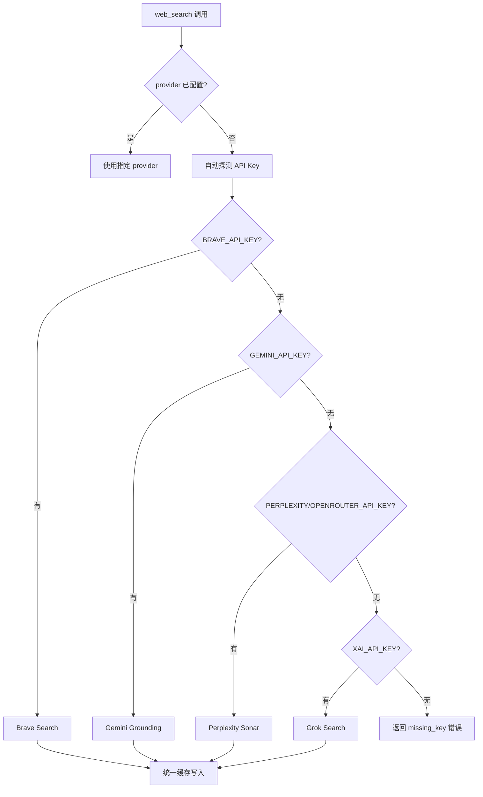
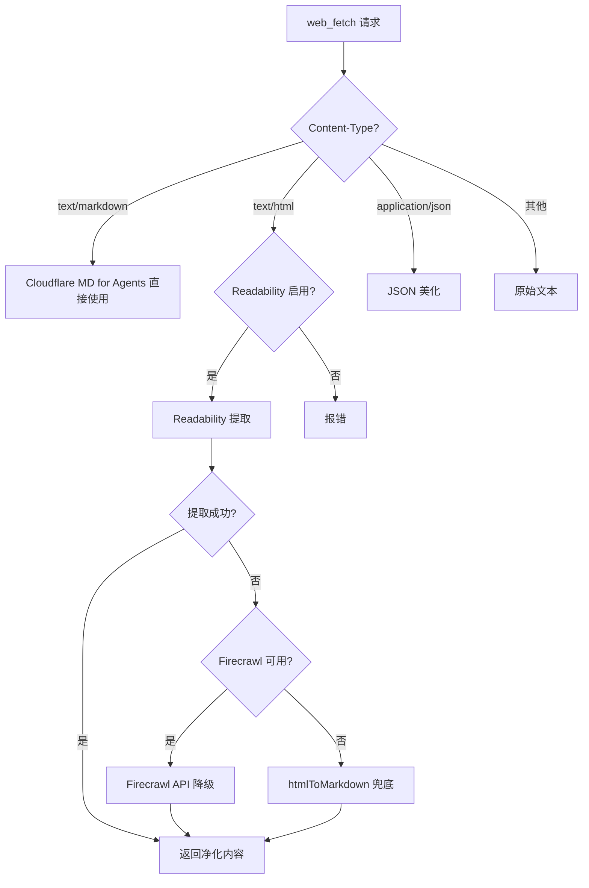
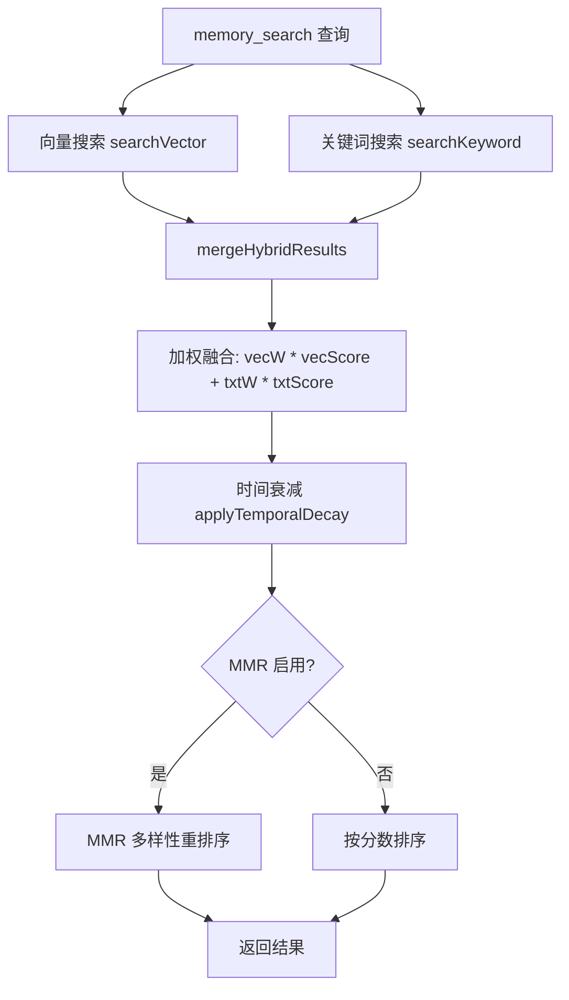

# PD-08.20 OpenClaw — 四引擎搜索路由 + SQLite-vec 混合 RAG 检索

> 文档编号：PD-08.20
> 来源：OpenClaw `src/agents/tools/web-search.ts` `src/memory/hybrid.ts`
> GitHub：https://github.com/openclaw/openclaw.git
> 问题域：PD-08 搜索与检索 Search & Retrieval
> 状态：可复用方案

---

## 第 1 章 问题与动机

### 1.1 核心问题

Agent 系统的搜索与检索面临两个正交的挑战：

1. **Web 搜索多源路由**：不同搜索引擎各有优劣——Brave 返回结构化链接列表适合精确查找，Perplexity/Grok/Gemini 返回 AI 合成摘要适合开放式问题。Agent 需要在运行时根据可用 API Key 自动选择最优引擎，且支持配置切换。
2. **本地记忆 RAG 检索**：Agent 的长期记忆（MEMORY.md + 日期化记忆文件）需要语义搜索能力。当嵌入服务不可用时，系统必须优雅降级到全文检索（FTS），而非直接失败。混合检索需要平衡语义相关性、关键词精确匹配、时间衰减和结果多样性。

### 1.2 OpenClaw 的解法概述

OpenClaw 构建了两套独立但设计理念一致的搜索子系统：

1. **Web 搜索工具** (`web-search.ts:22-36`)：支持 Brave/Perplexity/Grok/Gemini 四引擎，通过 API Key 前缀自动推断路由目标（如 `pplx-` → Perplexity 直连，`sk-or-` → OpenRouter），统一缓存层 + SSRF 防护
2. **Web 抓取工具** (`web-fetch.ts:502-678`)：Readability 提取 → Firecrawl 降级 → 原始 HTML 兜底的三级内容净化管道，支持 Cloudflare Markdown for Agents 协议
3. **本地 RAG 检索** (`hybrid.ts:51-149`)：SQLite-vec 向量搜索 + FTS5 全文检索的加权融合，配合 MMR 多样性重排序和时间衰减评分
4. **查询扩展** (`query-expansion.ts:723-776`)：7 语言停用词过滤 + CJK 字符 bigram 分词，FTS-only 模式下的查询增强
5. **嵌入后端适配** (`embeddings.ts:144-260`)：OpenAI/Gemini/Voyage/Mistral/Local(node-llama-cpp) 五后端自动探测 + 链式降级

### 1.3 设计思想

| 设计原则 | 具体实现 | 理由 | 替代方案 |
|----------|----------|------|----------|
| API Key 驱动自动路由 | `resolveSearchProvider` 按优先级探测 Brave→Gemini→Perplexity→Grok | 零配置即可用，用户只需设置一个 Key | 显式配置 provider 字段 |
| 三级内容净化 | Readability → Firecrawl → htmlToMarkdown 逐级降级 | 不同网站结构差异大，单一方案覆盖率不足 | 仅用 Readability |
| 混合检索加权融合 | `vectorWeight * vecScore + textWeight * textScore` | 语义和关键词互补，避免单一检索的盲区 | 仅向量检索 |
| FTS-only 优雅降级 | 嵌入不可用时自动切回 FTS + query expansion | 搜索能力不应因嵌入服务故障而完全丧失 | 直接报错 |
| 逐跳 SSRF 检查 | `fetchWithSsrFGuard` 每次重定向重新 DNS 解析 | 防止 DNS rebinding 攻击绕过 SSRF 防护 | 仅首次检查 |

---

## 第 2 章 源码实现分析

### 2.1 架构概览

```
┌─────────────────────────────────────────────────────────────────┐
│                        Agent Tool Layer                         │
├──────────────────┬──────────────────┬───────────────────────────┤
│   web_search     │    web_fetch     │      memory_search        │
│  (4 引擎路由)     │  (3 级净化管道)   │    (混合 RAG 检索)         │
├──────────────────┴──────────────────┴───────────────────────────┤
│                     Shared Infrastructure                        │
├─────────────┬──────────────┬────────────────┬───────────────────┤
│  web-shared │  SSRF Guard  │  Embedding     │  SQLite-vec/FTS5  │
│  (缓存/超时) │  (逐跳检查)   │  (5 后端适配)   │  (向量+全文)       │
└─────────────┴──────────────┴────────────────┴───────────────────┘
```

OpenClaw 的搜索与检索分为三个独立工具，共享缓存层和安全基础设施。Web 搜索和 Web 抓取面向外部互联网，Memory 搜索面向本地知识库。三者通过统一的 `AnyAgentTool` 接口暴露给 Agent。

### 2.2 核心实现

#### 2.2.1 四引擎搜索路由



对应源码 `src/agents/tools/web-search.ts:281-336`：

```typescript
function resolveSearchProvider(search?: WebSearchConfig): (typeof SEARCH_PROVIDERS)[number] {
  const raw = search && "provider" in search && typeof search.provider === "string"
    ? search.provider.trim().toLowerCase() : "";
  if (raw === "perplexity") return "perplexity";
  if (raw === "grok") return "grok";
  if (raw === "gemini") return "gemini";
  if (raw === "brave") return "brave";

  // Auto-detect provider from available API keys (priority order)
  if (raw === "") {
    if (resolveSearchApiKey(search)) return "brave";
    const geminiConfig = resolveGeminiConfig(search);
    if (resolveGeminiApiKey(geminiConfig)) return "gemini";
    const perplexityConfig = resolvePerplexityConfig(search);
    const { apiKey: perplexityKey } = resolvePerplexityApiKey(perplexityConfig);
    if (perplexityKey) return "perplexity";
    const grokConfig = resolveGrokConfig(search);
    if (resolveGrokApiKey(grokConfig)) return "grok";
  }
  return "brave";
}
```

Perplexity 路由还有一个精巧的 API Key 前缀推断机制 (`web-search.ts:375-387`)：

```typescript
function inferPerplexityBaseUrlFromApiKey(apiKey?: string): PerplexityBaseUrlHint | undefined {
  if (!apiKey) return undefined;
  const normalized = apiKey.toLowerCase();
  if (PERPLEXITY_KEY_PREFIXES.some((prefix) => normalized.startsWith(prefix))) return "direct";
  if (OPENROUTER_KEY_PREFIXES.some((prefix) => normalized.startsWith(prefix))) return "openrouter";
  return undefined;
}
```

`pplx-` 前缀的 Key 自动路由到 `api.perplexity.ai` 直连，`sk-or-` 前缀路由到 OpenRouter 代理。这避免了用户手动配置 baseUrl。

#### 2.2.2 三级内容净化管道



对应源码 `src/agents/tools/web-fetch.ts:591-644`：

```typescript
if (contentType.includes("text/markdown")) {
  extractor = "cf-markdown";  // Cloudflare Markdown for Agents
  if (params.extractMode === "text") text = markdownToText(body);
} else if (contentType.includes("text/html")) {
  if (params.readabilityEnabled) {
    const readable = await extractReadableContent({ html: body, url: finalUrl, extractMode });
    if (readable?.text) {
      text = readable.text; title = readable.title; extractor = "readability";
    } else {
      const firecrawl = await tryFirecrawlFallback({ ...params, url: finalUrl });
      if (firecrawl) {
        text = firecrawl.text; title = firecrawl.title; extractor = "firecrawl";
      } else {
        throw new Error("Readability and Firecrawl returned no content.");
      }
    }
  }
}
```

Readability 还有深度嵌套防护 (`web-fetch-utils.ts:115-207`)：当 HTML 嵌套深度超过 3000 层时跳过 DOM 解析，直接用正则降级，防止 stack overflow 攻击。

#### 2.2.3 混合 RAG 检索与 MMR 重排序



对应源码 `src/memory/hybrid.ts:51-149`：

```typescript
export async function mergeHybridResults(params: {
  vector: HybridVectorResult[];
  keyword: HybridKeywordResult[];
  vectorWeight: number;
  textWeight: number;
  mmr?: Partial<MMRConfig>;
  temporalDecay?: Partial<TemporalDecayConfig>;
}): Promise<Array<{ path: string; startLine: number; endLine: number; score: number; snippet: string }>> {
  // 1. 按 ID 合并向量和关键词结果
  const byId = new Map();
  for (const r of params.vector) byId.set(r.id, { ...r, vectorScore: r.vectorScore, textScore: 0 });
  for (const r of params.keyword) {
    const existing = byId.get(r.id);
    if (existing) existing.textScore = r.textScore;
    else byId.set(r.id, { ...r, vectorScore: 0, textScore: r.textScore });
  }
  // 2. 加权融合
  const merged = Array.from(byId.values()).map((e) => ({
    ...e, score: params.vectorWeight * e.vectorScore + params.textWeight * e.textScore,
  }));
  // 3. 时间衰减
  const decayed = await applyTemporalDecayToHybridResults({ results: merged, temporalDecay: params.temporalDecay });
  const sorted = decayed.toSorted((a, b) => b.score - a.score);
  // 4. MMR 重排序
  if (params.mmr?.enabled) return applyMMRToHybridResults(sorted, params.mmr);
  return sorted;
}
```

MMR 算法使用 Jaccard 相似度而非余弦相似度 (`mmr.ts:41-61`)，因为在文本片段级别 Jaccard 计算更轻量且不需要额外的嵌入调用：

```typescript
export function jaccardSimilarity(setA: Set<string>, setB: Set<string>): number {
  if (setA.size === 0 && setB.size === 0) return 1;
  if (setA.size === 0 || setB.size === 0) return 0;
  let intersectionSize = 0;
  const smaller = setA.size <= setB.size ? setA : setB;
  const larger = setA.size <= setB.size ? setB : setA;
  for (const token of smaller) { if (larger.has(token)) intersectionSize++; }
  const unionSize = setA.size + setB.size - intersectionSize;
  return unionSize === 0 ? 0 : intersectionSize / unionSize;
}
```

### 2.3 实现细节

**统一缓存层** (`web-shared.ts:1-61`)：Web 搜索和 Web 抓取共享同一套 TTL 缓存实现，默认 15 分钟过期，最大 100 条。缓存 key 包含 provider + query + 参数的组合，确保不同引擎的结果不会混淆。缓存满时采用 FIFO 淘汰。

**SSRF 逐跳防护** (`fetch-guard.ts:91-197`)：`fetchWithSsrFGuard` 手动跟踪重定向（`redirect: "manual"`），每一跳都重新做 DNS 解析和 SSRF 策略检查。跨域重定向时自动剥离 `Authorization`、`Cookie` 等敏感 Header。检测到重定向循环时立即终止。

**嵌入后端链式降级** (`embeddings.ts:174-212`)：`auto` 模式下按 local → openai → gemini → voyage → mistral 顺序尝试。仅 API Key 缺失错误触发降级，网络错误等非认证错误直接抛出。所有后端都失败时返回 `provider: null`，系统自动切换到 FTS-only 模式。

**7 语言查询扩展** (`query-expansion.ts:661-713`)：tokenizer 支持英语、中文、日语、韩语、西班牙语、葡萄牙语、阿拉伯语。中文使用字符 unigram + bigram 分词，韩语自动剥离尾部助词（조사），日语按书写系统（汉字/假名/ASCII）分段。

**时间衰减评分** (`temporal-decay.ts:17-34`)：使用指数衰减公式 `score * exp(-λ * age)`，其中 `λ = ln(2) / halfLifeDays`。日期化记忆文件（如 `memory/2024-01-15.md`）从文件名提取日期，常青记忆文件（`MEMORY.md`）不衰减。


---

## 第 3 章 迁移指南

### 3.1 迁移清单

**阶段 1：Web 搜索多引擎路由（1-2 天）**

- [ ] 定义搜索引擎 Provider 接口（query → results 标准格式）
- [ ] 实现 Brave Search 适配器（结构化链接列表）
- [ ] 实现 Perplexity/Gemini 适配器（AI 合成摘要 + citations）
- [ ] 实现 API Key 自动探测路由逻辑
- [ ] 添加统一 TTL 缓存层（Map + expiresAt）
- [ ] 集成 SSRF 防护（逐跳 DNS 解析）

**阶段 2：本地 RAG 混合检索（2-3 天）**

- [ ] 搭建 SQLite-vec + FTS5 双索引存储
- [ ] 实现嵌入后端适配层（至少支持 OpenAI + 一个本地后端）
- [ ] 实现混合检索加权融合（向量 + 关键词）
- [ ] 添加 MMR 多样性重排序（可选）
- [ ] 添加时间衰减评分（可选）
- [ ] 实现 FTS-only 降级模式 + 查询扩展

**阶段 3：内容净化管道（1 天）**

- [ ] 集成 @mozilla/readability 提取正文
- [ ] 实现 HTML → Markdown 转换器
- [ ] 添加 Firecrawl 降级路径（可选）
- [ ] 添加深度嵌套 HTML 防护

### 3.2 适配代码模板

**多引擎搜索路由器（TypeScript）：**

```typescript
type SearchProvider = "brave" | "perplexity" | "gemini" | "grok";

interface SearchResult {
  query: string;
  provider: SearchProvider;
  content?: string;        // AI 合成摘要（Perplexity/Grok/Gemini）
  results?: Array<{        // 结构化链接（Brave）
    title: string;
    url: string;
    description: string;
  }>;
  citations?: string[];
  tookMs: number;
}

// 缓存层
const cache = new Map<string, { value: SearchResult; expiresAt: number }>();
const CACHE_TTL_MS = 15 * 60_000;
const CACHE_MAX = 100;

function readCache(key: string): SearchResult | null {
  const entry = cache.get(key);
  if (!entry || Date.now() > entry.expiresAt) { cache.delete(key); return null; }
  return entry.value;
}

function writeCache(key: string, value: SearchResult): void {
  if (cache.size >= CACHE_MAX) cache.delete(cache.keys().next().value!);
  cache.set(key, { value, expiresAt: Date.now() + CACHE_TTL_MS });
}

// 自动路由
function detectProvider(config: Record<string, string | undefined>): SearchProvider {
  if (config.BRAVE_API_KEY) return "brave";
  if (config.GEMINI_API_KEY) return "gemini";
  if (config.PERPLEXITY_API_KEY || config.OPENROUTER_API_KEY) return "perplexity";
  if (config.XAI_API_KEY) return "grok";
  throw new Error("No search API key available");
}
```

**混合检索融合器（TypeScript）：**

```typescript
interface HybridResult {
  id: string;
  path: string;
  snippet: string;
  vectorScore: number;
  textScore: number;
}

function mergeResults(
  vectorHits: Array<{ id: string; path: string; snippet: string; score: number }>,
  keywordHits: Array<{ id: string; path: string; snippet: string; score: number }>,
  vectorWeight = 0.7,
  textWeight = 0.3,
): Array<{ id: string; path: string; snippet: string; score: number }> {
  const byId = new Map<string, HybridResult>();
  for (const r of vectorHits) {
    byId.set(r.id, { id: r.id, path: r.path, snippet: r.snippet, vectorScore: r.score, textScore: 0 });
  }
  for (const r of keywordHits) {
    const existing = byId.get(r.id);
    if (existing) { existing.textScore = r.score; }
    else { byId.set(r.id, { id: r.id, path: r.path, snippet: r.snippet, vectorScore: 0, textScore: r.score }); }
  }
  return Array.from(byId.values())
    .map((e) => ({ id: e.id, path: e.path, snippet: e.snippet, score: vectorWeight * e.vectorScore + textWeight * e.textScore }))
    .sort((a, b) => b.score - a.score);
}
```

### 3.3 适用场景

| 场景 | 适用度 | 说明 |
|------|--------|------|
| 多搜索引擎 Agent | ⭐⭐⭐ | 四引擎路由 + API Key 自动探测，零配置即可用 |
| 本地知识库 RAG | ⭐⭐⭐ | SQLite-vec 轻量级向量搜索，无需外部向量数据库 |
| 多语言 Agent | ⭐⭐⭐ | 7 语言查询扩展，CJK 分词支持 |
| 高安全要求场景 | ⭐⭐⭐ | SSRF 逐跳检查 + 跨域 Header 剥离 |
| 大规模向量检索 | ⭐⭐ | SQLite-vec 适合中小规模（<100K 文档），大规模需换 Qdrant/Milvus |
| 实时搜索场景 | ⭐⭐ | 15 分钟缓存 TTL 可能导致结果滞后 |

---

## 第 4 章 测试用例

```typescript
import { describe, it, expect, vi } from "vitest";

// ---- Web Search 路由测试 ----
describe("resolveSearchProvider", () => {
  it("should auto-detect brave when BRAVE_API_KEY is set", () => {
    const search = { apiKey: "BSA-xxx" };
    // resolveSearchProvider 内部调用 resolveSearchApiKey
    expect(resolveSearchProvider(search)).toBe("brave");
  });

  it("should fall through to gemini when brave key is missing", () => {
    const search = { gemini: { apiKey: "AIza-xxx" } };
    expect(resolveSearchProvider(search)).toBe("gemini");
  });

  it("should respect explicit provider config", () => {
    const search = { provider: "grok", apiKey: "BSA-xxx" };
    expect(resolveSearchProvider(search)).toBe("grok");
  });
});

// ---- Perplexity API Key 前缀推断 ----
describe("inferPerplexityBaseUrlFromApiKey", () => {
  it("should detect direct Perplexity key", () => {
    expect(inferPerplexityBaseUrlFromApiKey("pplx-abc123")).toBe("direct");
  });

  it("should detect OpenRouter key", () => {
    expect(inferPerplexityBaseUrlFromApiKey("sk-or-abc123")).toBe("openrouter");
  });

  it("should return undefined for unknown prefix", () => {
    expect(inferPerplexityBaseUrlFromApiKey("sk-abc123")).toBeUndefined();
  });
});

// ---- 混合检索融合 ----
describe("mergeHybridResults", () => {
  it("should merge vector and keyword results by ID", async () => {
    const vector = [{ id: "a", path: "f.md", startLine: 1, endLine: 5, source: "memory", snippet: "hello", vectorScore: 0.9 }];
    const keyword = [{ id: "a", path: "f.md", startLine: 1, endLine: 5, source: "memory", snippet: "hello", textScore: 0.5 }];
    const results = await mergeHybridResults({ vector, keyword, vectorWeight: 0.7, textWeight: 0.3 });
    expect(results[0].score).toBeCloseTo(0.7 * 0.9 + 0.3 * 0.5);
  });

  it("should include keyword-only results with vectorScore=0", async () => {
    const vector: any[] = [];
    const keyword = [{ id: "b", path: "g.md", startLine: 1, endLine: 3, source: "memory", snippet: "world", textScore: 0.8 }];
    const results = await mergeHybridResults({ vector, keyword, vectorWeight: 0.7, textWeight: 0.3 });
    expect(results).toHaveLength(1);
    expect(results[0].score).toBeCloseTo(0.3 * 0.8);
  });
});

// ---- MMR 重排序 ----
describe("mmrRerank", () => {
  it("should return items unchanged when disabled", () => {
    const items = [
      { id: "1", score: 0.9, content: "hello world" },
      { id: "2", score: 0.8, content: "hello world again" },
    ];
    const result = mmrRerank(items, { enabled: false });
    expect(result.map((r) => r.id)).toEqual(["1", "2"]);
  });

  it("should penalize similar items when enabled", () => {
    const items = [
      { id: "1", score: 0.9, content: "hello world foo bar" },
      { id: "2", score: 0.85, content: "hello world foo bar" },  // 完全相同
      { id: "3", score: 0.8, content: "completely different topic xyz" },
    ];
    const result = mmrRerank(items, { enabled: true, lambda: 0.5 });
    // item 3 应该排在 item 2 前面（多样性奖励）
    const ids = result.map((r) => r.id);
    expect(ids[0]).toBe("1");
    expect(ids.indexOf("3")).toBeLessThan(ids.indexOf("2"));
  });
});

// ---- 查询扩展 ----
describe("extractKeywords", () => {
  it("should filter English stop words", () => {
    const keywords = extractKeywords("what was the solution for the bug");
    expect(keywords).toContain("solution");
    expect(keywords).toContain("bug");
    expect(keywords).not.toContain("what");
    expect(keywords).not.toContain("the");
  });

  it("should extract Chinese bigrams", () => {
    const keywords = extractKeywords("之前讨论的那个方案");
    expect(keywords).toContain("讨论");
    expect(keywords).toContain("方案");
  });
});

// ---- 时间衰减 ----
describe("calculateTemporalDecayMultiplier", () => {
  it("should return 0.5 at exactly halfLifeDays", () => {
    const multiplier = calculateTemporalDecayMultiplier({ ageInDays: 30, halfLifeDays: 30 });
    expect(multiplier).toBeCloseTo(0.5, 5);
  });

  it("should return 1.0 for age=0", () => {
    const multiplier = calculateTemporalDecayMultiplier({ ageInDays: 0, halfLifeDays: 30 });
    expect(multiplier).toBe(1);
  });
});
```


---

## 第 5 章 跨域关联

| 关联域 | 关系类型 | 说明 |
|--------|----------|------|
| PD-01 上下文管理 | 协同 | `clampResultsByInjectedChars` 按 token 预算截断检索结果注入量，防止记忆搜索结果撑爆上下文窗口 |
| PD-03 容错与重试 | 依赖 | Web 搜索的 SSRF 防护、Firecrawl 降级、嵌入后端链式降级都是容错机制的具体应用 |
| PD-04 工具系统 | 依赖 | web_search / web_fetch / memory_search 三个工具通过统一的 `AnyAgentTool` 接口注册到工具系统 |
| PD-05 沙箱隔离 | 协同 | `sandboxed` 参数影响搜索工具的启用策略，沙箱模式下默认启用搜索 |
| PD-06 记忆持久化 | 依赖 | memory_search 的检索对象是 PD-06 持久化的 MEMORY.md 和日期化记忆文件 |
| PD-10 中间件管道 | 协同 | `FallbackMemoryManager` 实现了 primary → fallback 的管道式降级，QMD 后端失败自动切换到内置索引 |
| PD-11 可观测性 | 协同 | 搜索结果包含 `tookMs`、`provider`、`extractor` 等元数据，支持成本追踪和性能监控 |

---

## 第 6 章 来源文件索引

| 文件 | 行范围 | 关键实现 |
|------|--------|----------|
| `src/agents/tools/web-search.ts` | L22-36 | 四引擎常量定义（Brave/Perplexity/Grok/Gemini） |
| `src/agents/tools/web-search.ts` | L281-336 | `resolveSearchProvider` API Key 自动探测路由 |
| `src/agents/tools/web-search.ts` | L375-387 | `inferPerplexityBaseUrlFromApiKey` Key 前缀推断 |
| `src/agents/tools/web-search.ts` | L502-579 | `runGeminiSearch` Gemini Grounding 搜索 + 重定向解析 |
| `src/agents/tools/web-search.ts` | L786-967 | `runWebSearch` 统一搜索入口 + 缓存 |
| `src/agents/tools/web-fetch.ts` | L502-678 | `runWebFetch` 三级内容净化管道 |
| `src/agents/tools/web-fetch.ts` | L351-426 | `fetchFirecrawlContent` Firecrawl API 集成 |
| `src/agents/tools/web-fetch-utils.ts` | L60-89 | `htmlToMarkdown` 正则 HTML→MD 转换 |
| `src/agents/tools/web-fetch-utils.ts` | L115-207 | `exceedsEstimatedHtmlNestingDepth` 深度嵌套防护 |
| `src/agents/tools/web-fetch-utils.ts` | L209-254 | `extractReadableContent` Readability 提取 + 降级 |
| `src/agents/tools/web-shared.ts` | L1-61 | 统一缓存层（TTL + FIFO 淘汰） |
| `src/agents/tools/web-shared.ts` | L63-87 | `withTimeout` AbortSignal 超时控制 |
| `src/memory/hybrid.ts` | L33-44 | `buildFtsQuery` FTS5 查询构建 |
| `src/memory/hybrid.ts` | L51-149 | `mergeHybridResults` 混合检索加权融合 |
| `src/memory/mmr.ts` | L41-61 | `jaccardSimilarity` Jaccard 相似度计算 |
| `src/memory/mmr.ts` | L116-183 | `mmrRerank` MMR 多样性重排序算法 |
| `src/memory/query-expansion.ts` | L661-713 | `tokenize` 7 语言分词器 |
| `src/memory/query-expansion.ts` | L723-776 | `expandQueryForFts` 查询扩展 |
| `src/memory/temporal-decay.ts` | L17-34 | 指数时间衰减公式 |
| `src/memory/embeddings.ts` | L144-260 | `createEmbeddingProvider` 五后端链式降级 |
| `src/memory/manager-search.ts` | L20-94 | `searchVector` + `searchKeyword` 双索引查询 |
| `src/memory/embedding-chunk-limits.ts` | L6-35 | `enforceEmbeddingMaxInputTokens` chunk 分割 |
| `src/infra/net/fetch-guard.ts` | L91-197 | `fetchWithSsrFGuard` SSRF 逐跳防护 |
| `src/agents/tools/memory-tool.ts` | L40-99 | `createMemorySearchTool` 记忆搜索工具 |
| `src/memory/search-manager.ts` | L75-217 | `FallbackMemoryManager` QMD→内置索引降级 |

---

## 第 7 章 横向对比维度

```json comparison_data
{
  "project": "OpenClaw",
  "dimensions": {
    "搜索架构": "四引擎路由（Brave/Perplexity/Grok/Gemini）+ API Key 自动探测",
    "去重机制": "缓存 key 含 provider+query+参数，MMR Jaccard 去重",
    "结果处理": "Brave 返回链接列表，其余三引擎返回 AI 合成摘要+citations",
    "容错策略": "嵌入五后端链式降级 → FTS-only 兜底，Readability→Firecrawl→htmlToMarkdown 三级净化",
    "成本控制": "15 分钟 TTL 缓存 + FIFO 淘汰，FTS-only 模式零嵌入成本",
    "搜索源热切换": "config.tools.web.search.provider 配置切换，或删除 Key 自动降级",
    "页面内容净化": "Readability + Cloudflare MD for Agents + htmlToMarkdown 三级管道",
    "SSRF防护": "fetchWithSsrFGuard 逐跳 DNS 解析 + 跨域 Header 剥离",
    "检索方式": "SQLite-vec 向量 + FTS5 全文的加权混合检索",
    "索引结构": "SQLite-vec 单表向量索引 + FTS5 全文索引，同库共存",
    "排序策略": "加权融合 → 时间衰减 → MMR 多样性重排序三阶管道",
    "缓存机制": "Map 内存缓存，TTL 15min，FIFO 淘汰，最大 100 条",
    "嵌入后端适配": "OpenAI/Gemini/Voyage/Mistral/Local 五后端 auto 模式链式探测",
    "扩展性": "新引擎只需添加 run*Search 函数 + provider 枚举值"
  }
}
```

### 域元数据补充

```json domain_metadata
{
  "solution_summary": "OpenClaw 用 API Key 前缀推断实现 Brave/Perplexity/Grok/Gemini 四引擎零配置路由，本地 RAG 用 SQLite-vec+FTS5 混合检索配合 MMR 重排序和时间衰减评分",
  "description": "搜索引擎的零配置自动路由与嵌入不可用时的 FTS 优雅降级",
  "sub_problems": [
    "API Key 前缀推断路由：如何从 Key 格式自动判断应连接直连 API 还是代理网关",
    "Gemini Grounding 重定向解析：Google 搜索引用 URL 需要 HEAD 请求解析真实地址",
    "HTML 深度嵌套防护：恶意 HTML 嵌套数千层导致 DOM 解析 stack overflow 的防御",
    "Cloudflare Markdown for Agents 协议：服务端预渲染 Markdown 时的 Content-Type 识别与直接使用",
    "记忆文件常青判定：MEMORY.md 等常青知识文件不应被时间衰减惩罚的识别逻辑"
  ],
  "best_practices": [
    "API Key 前缀推断比显式配置更友好：pplx- 前缀自动直连，sk-or- 前缀走 OpenRouter",
    "MMR 用 Jaccard 而非余弦相似度：文本片段级去重不需要额外嵌入调用，计算更轻量",
    "嵌入不可用时降级到 FTS+查询扩展而非报错：搜索能力不应因嵌入服务故障完全丧失",
    "SSRF 逐跳检查而非仅首次检查：防止 DNS rebinding 攻击绕过首次 IP 校验"
  ]
}
```
