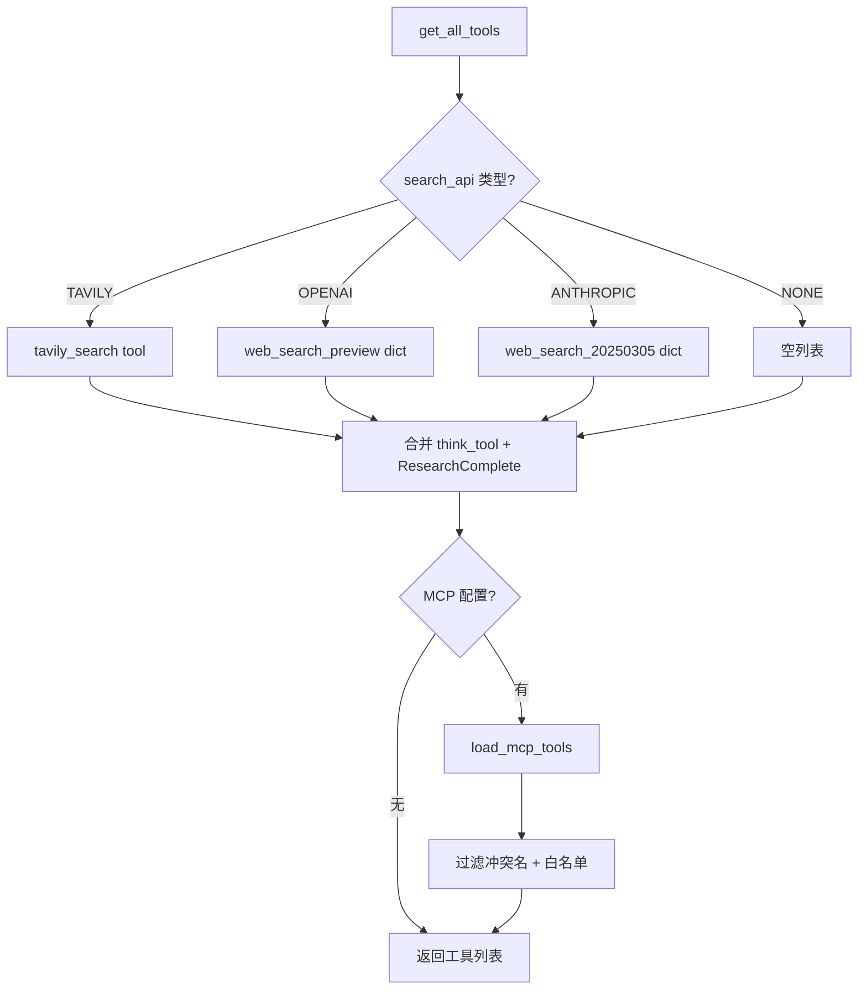
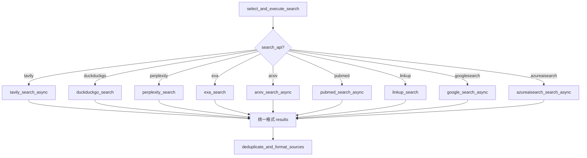

# PD-08.06 Open Deep Research — 多搜索源架构与 LLM 摘要处理

> 文档编号：PD-08.06
> 来源：Open Deep Research `src/open_deep_research/utils.py`, `src/legacy/utils.py`
> GitHub：https://github.com/langchain-ai/open_deep_research.git
> 问题域：PD-08 搜索与检索 Search & Retrieval
> 状态：可复用方案

---

## 第 1 章 问题与动机

### 1.1 核心问题

深度研究 Agent 需要从互联网获取高质量、多样化的信息来回答复杂问题。单一搜索源存在三个根本缺陷：

1. **覆盖盲区**：Tavily 擅长通用搜索但不覆盖学术论文；ArXiv 只有预印本；PubMed 只有生物医学文献
2. **可用性风险**：任何单一 API 都可能因限流、宕机或 API Key 过期而不可用
3. **结果冗余**：多查询并发搜索会产生大量重复 URL，直接喂给 LLM 浪费 token

Open Deep Research 通过**双版本架构**解决这些问题：主版本（`src/open_deep_research/`）面向生产环境，支持 Tavily/OpenAI/Anthropic 原生搜索 + MCP 扩展；Legacy 版本（`src/legacy/`）面向实验环境，支持 10+ 搜索源的统一调度。

### 1.2 Open Deep Research 的解法概述

1. **Enum 驱动的搜索源选择**：通过 `SearchAPI` 枚举 + 配置类实现搜索源热切换，无需改代码（`src/open_deep_research/configuration.py:11-17`）
2. **统一结果格式**：所有搜索源（Tavily/Exa/ArXiv/PubMed/DuckDuckGo/Google/Perplexity/Linkup/Azure AI Search）输出统一的 `{query, results: [{title, url, content, score, raw_content}]}` 格式（`src/legacy/utils.py:89-151`）
3. **URL 级去重**：搜索结果按 URL 去重，支持 keep_first/keep_last 两种策略（`src/legacy/utils.py:120-128`）
4. **双模式结果处理**：搜索结果支持 LLM summarization（摘要压缩）和 split-and-rerank（embedding 向量检索）两种处理模式（`src/legacy/utils.py:1406-1439`）
5. **MCP 协议扩展**：主版本通过 MCP 协议支持任意外部工具集成，包括 OAuth 认证流程（`src/open_deep_research/utils.py:449-524`）

### 1.3 设计思想

| 设计原则 | 具体实现 | 理由 | 替代方案 |
|----------|----------|------|----------|
| 搜索源正交 | 每个搜索源独立函数，统一输出格式 | 新增搜索源只需加一个函数 + 一行路由 | 继承体系（过度抽象） |
| 配置驱动切换 | Enum + dataclass/Pydantic 配置 | 运行时切换搜索源，支持环境变量覆盖 | 硬编码 if-else |
| 去重前置 | 搜索后立即 URL 去重，再做摘要 | 避免对重复内容做昂贵的 LLM 摘要 | 摘要后去重（浪费 token） |
| 摘要与检索二选一 | summarize vs split_and_rerank 配置项 | 不同场景需要不同精度/成本权衡 | 只支持一种模式 |
| 降级优于失败 | 摘要超时/失败时返回原文 | 宁可信息冗余也不丢失信息 | 抛异常中断流程 |

---

## 第 2 章 源码实现分析

### 2.1 架构概览

Open Deep Research 的搜索系统分为两个版本，共享相同的设计理念但实现粒度不同：

```
┌─────────────────────────────────────────────────────────┐
│                    Main Version (生产)                    │
│  SearchAPI Enum: TAVILY | OPENAI | ANTHROPIC | NONE     │
│  + MCP 协议扩展（任意外部工具）                            │
│                                                          │
│  搜索 → URL去重 → LLM摘要(structured output) → 格式化    │
└─────────────────────────────────────────────────────────┘

┌─────────────────────────────────────────────────────────┐
│                  Legacy Version (实验)                    │
│  SearchAPI Enum: TAVILY | EXA | ARXIV | PUBMED |        │
│    PERPLEXITY | LINKUP | DUCKDUCKGO | GOOGLESEARCH |    │
│    AZUREAISEARCH | NONE                                  │
│                                                          │
│  搜索 → URL去重 → summarize | split_and_rerank → 格式化  │
└─────────────────────────────────────────────────────────┘

┌─────────────────────────────────────────────────────────┐
│              Researcher Agent (ReAct Loop)                │
│                                                          │
│  researcher() → researcher_tools() → compress_research() │
│       ↑              │                                   │
│       └──────────────┘ (循环直到 max_react_tool_calls    │
│                         或 ResearchComplete)              │
└─────────────────────────────────────────────────────────┘
```

### 2.2 核心实现

#### 2.2.1 搜索源路由与工具组装



对应源码 `src/open_deep_research/utils.py:531-597`：

```python
async def get_search_tool(search_api: SearchAPI):
    if search_api == SearchAPI.ANTHROPIC:
        return [{"type": "web_search_20250305", "name": "web_search", "max_uses": 5}]
    elif search_api == SearchAPI.OPENAI:
        return [{"type": "web_search_preview"}]
    elif search_api == SearchAPI.TAVILY:
        search_tool = tavily_search
        search_tool.metadata = {**(search_tool.metadata or {}), "type": "search", "name": "web_search"}
        return [search_tool]
    elif search_api == SearchAPI.NONE:
        return []
    return []

async def get_all_tools(config: RunnableConfig):
    tools = [tool(ResearchComplete), think_tool]
    configurable = Configuration.from_runnable_config(config)
    search_api = SearchAPI(get_config_value(configurable.search_api))
    search_tools = await get_search_tool(search_api)
    tools.extend(search_tools)
    existing_tool_names = {
        tool.name if hasattr(tool, "name") else tool.get("name", "web_search") for tool in tools
    }
    mcp_tools = await load_mcp_tools(config, existing_tool_names)
    tools.extend(mcp_tools)
    return tools
```

#### 2.2.2 Legacy 版本的 10+ 搜索源统一调度



对应源码 `src/legacy/utils.py:1501-1539`：

```python
async def select_and_execute_search(search_api: str, query_list: list[str], params_to_pass: dict) -> str:
    if search_api == "tavily":
        return await tavily_search.ainvoke({'queries': query_list, **params_to_pass})
    elif search_api == "duckduckgo":
        return await duckduckgo_search.ainvoke({'search_queries': query_list})
    elif search_api == "perplexity":
        search_results = perplexity_search(query_list, **params_to_pass)
    elif search_api == "exa":
        search_results = await exa_search(query_list, **params_to_pass)
    elif search_api == "arxiv":
        search_results = await arxiv_search_async(query_list, **params_to_pass)
    elif search_api == "pubmed":
        search_results = await pubmed_search_async(query_list, **params_to_pass)
    elif search_api == "linkup":
        search_results = await linkup_search(query_list, **params_to_pass)
    elif search_api == "googlesearch":
        search_results = await google_search_async(query_list, **params_to_pass)
    elif search_api == "azureaisearch":
        search_results = await azureaisearch_search_async(query_list, **params_to_pass)
    else:
        raise ValueError(f"Unsupported search API: {search_api}")
    return deduplicate_and_format_sources(search_results, max_tokens_per_source=4000, deduplication_strategy="keep_first")
```

### 2.3 实现细节

#### URL 去重与格式归一化

`deduplicate_and_format_sources`（`src/legacy/utils.py:89-151`）实现了两种去重策略：

- **keep_first**：保留首次出现的结果（适合按相关性排序的搜索源）
- **keep_last**：保留最后出现的结果（适合需要最新内容的场景）

每个结果的 `raw_content` 按 `max_tokens_per_source * 4` 字符截断（粗略的 token-to-char 换算）。

#### 双模式结果处理（Legacy Tavily）

`src/legacy/utils.py:1406-1439` 展示了 summarize 与 split_and_rerank 的分支：

- **summarize 模式**：对每个去重后的 URL 内容调用 LLM 生成结构化摘要（Summary: summary + key_excerpts），Anthropic 模型额外启用 `cache_control` 降低重复内容的 API 成本
- **split_and_rerank 模式**：用 `RecursiveCharacterTextSplitter`（chunk_size=1500, overlap=200）切分网页内容，存入 `InMemoryVectorStore`，再用 `similarity_search` 检索 top-k 相关片段，最后用 `stitch_documents_by_url` 按 URL 拼接去重片段

#### 搜索后反思机制（think_tool）

`src/open_deep_research/utils.py:219-244` 定义了 `think_tool`，强制 Agent 在每次搜索后暂停反思：

```python
@tool(description="Strategic reflection tool for research planning")
def think_tool(reflection: str) -> str:
    return f"Reflection recorded: {reflection}"
```

Prompt 中通过硬性规则要求 Agent 在每次搜索后调用 think_tool 评估信息充分性（`src/open_deep_research/prompts.py:151`）：
> "CRITICAL: Use think_tool after each search to reflect on results and plan next steps."

#### 搜索调用预算

主版本通过两层预算控制搜索成本：
- **Researcher 层**：`max_react_tool_calls`（默认 10）限制单个 Researcher 的工具调用次数（`src/open_deep_research/configuration.py:107-119`）
- **Supervisor 层**：`max_researcher_iterations`（默认 6）限制 Supervisor 的研究迭代次数（`src/open_deep_research/configuration.py:94-106`）
- **并发限制**：`max_concurrent_research_units`（默认 5）限制并行 Researcher 数量（`src/open_deep_research/configuration.py:64-76`）

#### MCP 工具加载与认证

`load_mcp_tools`（`src/open_deep_research/utils.py:449-524`）实现了完整的 MCP 工具加载流程：
1. 检查 `mcp_config.auth_required`，如需认证则通过 OAuth token exchange 获取 access_token
2. 连接 MCP 服务器（streamable_http transport）
3. 过滤工具名冲突 + 白名单筛选
4. 用 `wrap_mcp_authenticate_tool` 包装每个工具，处理 MCP 错误码（如 -32003 交互要求）

#### 各搜索源的限流策略

| 搜索源 | 限流策略 | 源码位置 |
|--------|----------|----------|
| Exa | 请求间 0.25s 延迟，429 时额外 1s | `src/legacy/utils.py:550-572` |
| ArXiv | 请求间 3s 延迟（官方限制），429 时额外 5s | `src/legacy/utils.py:704-730` |
| PubMed | 自适应延迟：成功时缩短（min 0.5s），失败时增长（max 5s） | `src/legacy/utils.py:842-878` |
| DuckDuckGo | 指数退避重试（backoff_factor=2），最多 3 次 | `src/legacy/utils.py:1263-1327` |
| Google | API 模式 0.2s 延迟，爬虫模式 0.5-2s 随机延迟 | `src/legacy/utils.py:1009-1019` |


---

## 第 3 章 迁移指南

### 3.1 迁移清单

**阶段 1：搜索源抽象层（1-2 天）**
- [ ] 定义统一搜索结果格式 `SearchResult(title, url, content, score, raw_content)`
- [ ] 实现 `SearchAPI` 枚举和配置类
- [ ] 实现 `select_and_execute_search` 路由函数
- [ ] 实现 `deduplicate_and_format_sources` 去重函数

**阶段 2：搜索源接入（每个 0.5 天）**
- [ ] 接入 Tavily（最推荐，结果质量高）
- [ ] 接入 DuckDuckGo（免费备选）
- [ ] 按需接入学术源（ArXiv/PubMed）

**阶段 3：结果处理增强（1 天）**
- [ ] 实现 LLM summarization 模式
- [ ] 实现 split-and-rerank 模式（需要 embedding 服务）
- [ ] 添加 think_tool 搜索后反思机制

**阶段 4：MCP 扩展（可选，1 天）**
- [ ] 实现 MCP 工具加载和认证流程
- [ ] 添加工具名冲突检测

### 3.2 适配代码模板

#### 统一搜索接口

```python
from enum import Enum
from typing import List, Dict, Any, Optional, Literal
from pydantic import BaseModel
import asyncio

class SearchResult(BaseModel):
    title: str
    url: str
    content: str
    score: Optional[float] = None
    raw_content: Optional[str] = None

class SearchResponse(BaseModel):
    query: str
    results: List[SearchResult]

class SearchAPI(Enum):
    TAVILY = "tavily"
    DUCKDUCKGO = "duckduckgo"
    NONE = "none"

def deduplicate_results(
    responses: List[SearchResponse],
    strategy: Literal["keep_first", "keep_last"] = "keep_first",
    max_chars_per_source: int = 20000
) -> Dict[str, SearchResult]:
    """URL 级去重，返回 {url: result} 字典"""
    unique: Dict[str, SearchResult] = {}
    for resp in responses:
        for result in resp.results:
            if strategy == "keep_first" and result.url not in unique:
                unique[result.url] = result
            elif strategy == "keep_last":
                unique[result.url] = result
    # 截断 raw_content
    for result in unique.values():
        if result.raw_content and len(result.raw_content) > max_chars_per_source:
            result.raw_content = result.raw_content[:max_chars_per_source] + "... [truncated]"
    return unique

async def search_and_process(
    search_api: SearchAPI,
    queries: List[str],
    process_mode: Literal["summarize", "raw"] = "raw"
) -> str:
    """统一搜索入口：搜索 → 去重 → 处理 → 格式化"""
    # 1. 执行搜索
    if search_api == SearchAPI.TAVILY:
        responses = await tavily_search_async(queries)
    elif search_api == SearchAPI.DUCKDUCKGO:
        responses = await duckduckgo_search_async(queries)
    else:
        return "No search API configured"
    
    # 2. 去重
    unique_results = deduplicate_results(responses)
    
    # 3. 处理（可选 LLM 摘要）
    if process_mode == "summarize":
        unique_results = await summarize_all(unique_results)
    
    # 4. 格式化输出
    return format_results(unique_results)
```

#### 搜索后反思工具

```python
from langchain_core.tools import tool

@tool(description="Strategic reflection tool for research planning")
def think_tool(reflection: str) -> str:
    """强制 Agent 在搜索后暂停反思，评估信息充分性。
    
    在 system prompt 中添加硬性规则：
    "CRITICAL: Use think_tool after each search to reflect on results."
    """
    return f"Reflection recorded: {reflection}"
```

### 3.3 适用场景

| 场景 | 适用度 | 说明 |
|------|--------|------|
| 深度研究 Agent | ⭐⭐⭐ | 核心场景，多源搜索 + LLM 摘要 + 反思循环 |
| RAG 增强问答 | ⭐⭐⭐ | split-and-rerank 模式直接可用 |
| 学术文献综述 | ⭐⭐⭐ | ArXiv + PubMed 学术源 + 去重 |
| 新闻聚合 | ⭐⭐ | 多源搜索 + 去重，但缺少时效性排序 |
| 实时数据查询 | ⭐ | 搜索源延迟较高，不适合实时场景 |

---

## 第 4 章 测试用例

```python
import pytest
import asyncio
from unittest.mock import AsyncMock, patch, MagicMock
from typing import List, Dict


class TestDeduplicateAndFormatSources:
    """测试 URL 去重与格式化"""

    def test_keep_first_strategy(self):
        """keep_first 策略保留首次出现的结果"""
        search_response = [
            {"results": [
                {"title": "A", "url": "https://a.com", "content": "first", "score": 0.9, "raw_content": "first full"},
                {"title": "B", "url": "https://b.com", "content": "b content", "score": 0.8, "raw_content": "b full"},
            ]},
            {"results": [
                {"title": "A-dup", "url": "https://a.com", "content": "duplicate", "score": 0.7, "raw_content": "dup full"},
            ]}
        ]
        # keep_first 应保留 title="A" 而非 "A-dup"
        unique = {}
        for resp in search_response:
            for r in resp["results"]:
                if r["url"] not in unique:
                    unique[r["url"]] = r
        assert unique["https://a.com"]["title"] == "A"
        assert len(unique) == 2

    def test_keep_last_strategy(self):
        """keep_last 策略保留最后出现的结果"""
        search_response = [
            {"results": [
                {"title": "A", "url": "https://a.com", "content": "first", "score": 0.9, "raw_content": "first"},
            ]},
            {"results": [
                {"title": "A-updated", "url": "https://a.com", "content": "updated", "score": 0.95, "raw_content": "updated"},
            ]}
        ]
        unique = {r["url"]: r for resp in search_response for r in resp["results"]}
        assert unique["https://a.com"]["title"] == "A-updated"

    def test_raw_content_truncation(self):
        """raw_content 超长时应截断"""
        long_content = "x" * 100000
        max_tokens = 5000
        char_limit = max_tokens * 4
        truncated = long_content[:char_limit] + "... [truncated]" if len(long_content) > char_limit else long_content
        assert len(truncated) < len(long_content)
        assert truncated.endswith("... [truncated]")


class TestSearchAPIRouting:
    """测试搜索源路由"""

    def test_search_api_enum_values(self):
        """验证 SearchAPI 枚举包含所有预期值"""
        # Main version
        main_apis = {"anthropic", "openai", "tavily", "none"}
        # Legacy version
        legacy_apis = {"perplexity", "tavily", "exa", "arxiv", "pubmed", "linkup", "duckduckgo", "googlesearch", "none"}
        assert len(main_apis) == 4
        assert len(legacy_apis) == 9

    def test_get_search_params_filtering(self):
        """验证搜索参数过滤只传递合法参数"""
        SEARCH_API_PARAMS = {
            "tavily": ["max_results", "topic"],
            "exa": ["max_characters", "num_results", "include_domains", "exclude_domains", "subpages"],
        }
        config = {"max_results": 5, "topic": "general", "invalid_param": "should_be_filtered"}
        filtered = {k: v for k, v in config.items() if k in SEARCH_API_PARAMS.get("tavily", [])}
        assert "invalid_param" not in filtered
        assert filtered == {"max_results": 5, "topic": "general"}


class TestSummarizeWebpage:
    """测试网页摘要功能"""

    @pytest.mark.asyncio
    async def test_summarize_timeout_returns_original(self):
        """摘要超时时应返回原始内容"""
        original_content = "This is the original webpage content"
        # 模拟超时
        mock_model = AsyncMock()
        mock_model.ainvoke = AsyncMock(side_effect=asyncio.TimeoutError())
        try:
            result = await asyncio.wait_for(mock_model.ainvoke([]), timeout=0.01)
        except asyncio.TimeoutError:
            result = original_content
        assert result == original_content

    @pytest.mark.asyncio
    async def test_summarize_error_returns_original(self):
        """摘要失败时应返回原始内容"""
        original_content = "Original content"
        mock_model = AsyncMock()
        mock_model.ainvoke = AsyncMock(side_effect=Exception("API Error"))
        try:
            result = await mock_model.ainvoke([])
        except Exception:
            result = original_content
        assert result == original_content


class TestThinkTool:
    """测试搜索后反思工具"""

    def test_think_tool_returns_reflection(self):
        """think_tool 应返回反思内容"""
        reflection = "Found 3 relevant sources about topic X. Missing: pricing data."
        result = f"Reflection recorded: {reflection}"
        assert "Reflection recorded:" in result
        assert "pricing data" in result
```


---

## 第 5 章 跨域关联

| 关联域 | 关系类型 | 说明 |
|--------|----------|------|
| PD-01 上下文管理 | 依赖 | 搜索结果的 `max_content_length`（50000 字符）截断和 `compress_research` 压缩直接影响上下文窗口使用；`remove_up_to_last_ai_message` 在 token 超限时裁剪消息历史 |
| PD-02 多 Agent 编排 | 协同 | Supervisor → Researcher 的委托模式中，每个 Researcher 独立执行搜索循环；`max_concurrent_research_units` 控制并行 Researcher 数量 |
| PD-03 容错与重试 | 协同 | 搜索摘要的 `with_retry(stop_after_attempt=3)` + 60s 超时保护；各搜索源的限流退避策略（指数退避、自适应延迟）；`is_token_limit_exceeded` 多提供商错误检测 |
| PD-04 工具系统 | 依赖 | 搜索工具通过 `@tool` 装饰器注册；MCP 工具通过 `load_mcp_tools` 动态加载；`get_all_tools` 组装完整工具列表 |
| PD-09 Human-in-the-Loop | 协同 | Legacy 版本的 `human_feedback` 节点在搜索计划生成后暂停等待用户审批，通过 LangGraph `interrupt` 实现 |
| PD-11 可观测性 | 协同 | 所有搜索函数用 `@traceable` 装饰器（LangSmith）追踪；`tags=["langsmith:nostream"]` 标记非流式调用 |

---

## 第 6 章 来源文件索引

| 文件 | 行范围 | 关键实现 |
|------|--------|----------|
| `src/open_deep_research/configuration.py` | L11-L17 | SearchAPI 枚举定义（主版本 4 源） |
| `src/open_deep_research/configuration.py` | L38-L252 | Configuration Pydantic 模型（搜索/模型/MCP 配置） |
| `src/open_deep_research/utils.py` | L43-L136 | tavily_search 工具（搜索+去重+摘要完整流程） |
| `src/open_deep_research/utils.py` | L175-L213 | summarize_webpage（LLM 摘要 + 60s 超时保护） |
| `src/open_deep_research/utils.py` | L219-L244 | think_tool（搜索后反思工具） |
| `src/open_deep_research/utils.py` | L449-L524 | load_mcp_tools（MCP 工具加载 + OAuth 认证） |
| `src/open_deep_research/utils.py` | L531-L597 | get_search_tool + get_all_tools（工具组装） |
| `src/open_deep_research/utils.py` | L665-L785 | is_token_limit_exceeded（多提供商 token 超限检测） |
| `src/open_deep_research/deep_researcher.py` | L365-L424 | researcher 节点（ReAct 搜索循环） |
| `src/open_deep_research/deep_researcher.py` | L435-L509 | researcher_tools（工具执行 + 迭代控制） |
| `src/open_deep_research/deep_researcher.py` | L511-L585 | compress_research（研究结果压缩 + token 超限重试） |
| `src/open_deep_research/prompts.py` | L138-L183 | research_system_prompt（搜索预算硬限制） |
| `src/legacy/configuration.py` | L20-L29 | SearchAPI 枚举定义（Legacy 9 源） |
| `src/legacy/utils.py` | L57-L87 | get_search_params（搜索参数白名单过滤） |
| `src/legacy/utils.py` | L89-L151 | deduplicate_and_format_sources（URL 去重 + 格式化） |
| `src/legacy/utils.py` | L172-L216 | tavily_search_async（并发搜索） |
| `src/legacy/utils.py` | L278-L371 | perplexity_search（Perplexity API 适配） |
| `src/legacy/utils.py` | L374-L574 | exa_search（Exa API + 子页面 + 限流） |
| `src/legacy/utils.py` | L577-L731 | arxiv_search_async（ArXiv + 3s 限流） |
| `src/legacy/utils.py` | L734-L879 | pubmed_search_async（PubMed + 自适应延迟） |
| `src/legacy/utils.py` | L927-L1186 | google_search_async（API + 爬虫双模式） |
| `src/legacy/utils.py` | L1247-L1356 | duckduckgo_search（指数退避重试） |
| `src/legacy/utils.py` | L1501-L1539 | select_and_execute_search（统一路由） |
| `src/legacy/utils.py` | L1573-L1618 | split_and_rerank + stitch_documents_by_url（向量检索模式） |

---

## 第 7 章 横向对比维度

```json comparison_data
{
  "project": "OpenDeepResearch",
  "dimensions": {
    "搜索架构": "双版本架构：主版本 Tavily/OpenAI/Anthropic+MCP，Legacy 版本 10+ 搜索源统一路由",
    "去重机制": "URL 级去重，支持 keep_first/keep_last 策略",
    "结果处理": "双模式：LLM summarization（structured output）或 split-and-rerank（embedding 向量检索）",
    "容错策略": "摘要超时返回原文，各搜索源独立限流退避，token 超限渐进截断",
    "成本控制": "独立摘要模型（gpt-4.1-mini）+ Anthropic cache_control + 搜索调用预算硬限制",
    "搜索源热切换": "Enum + Pydantic 配置 + 环境变量覆盖，运行时切换无需改代码",
    "扩展性": "MCP 协议支持任意外部工具集成，含 OAuth token exchange 认证",
    "排序策略": "各搜索源原生排序 + split_and_rerank 模式的 embedding 相似度排序",
    "搜索后反思": "think_tool 强制 Agent 每次搜索后评估信息充分性再决定是否继续"
  }
}
```

### 域元数据补充

```json domain_metadata
{
  "solution_summary": "Open Deep Research 用双版本架构实现 10+ 搜索源统一路由，搜索结果经 URL 去重后支持 LLM summarization 或 split-and-rerank 两种处理模式，通过 think_tool 强制搜索后反思控制搜索深度",
  "description": "搜索源统一格式化与双模式结果处理（摘要 vs 向量检索）的工程权衡",
  "sub_problems": [
    "搜索参数白名单过滤：不同搜索源接受不同参数时如何安全传递配置",
    "原生搜索检测：如何判断 OpenAI/Anthropic 的原生 web search 是否在响应中被调用",
    "搜索源限流差异化：不同 API 的限流策略（固定延迟/指数退避/自适应）如何统一管理",
    "MCP 工具名冲突：外部 MCP 工具与内置工具同名时的检测与跳过机制"
  ],
  "best_practices": [
    "去重前置于摘要：先 URL 去重再做 LLM 摘要，避免对重复内容浪费 token",
    "摘要失败降级为原文：LLM 摘要超时或报错时返回原始内容而非抛异常",
    "搜索参数白名单过滤：每个搜索源定义接受的参数列表，防止非法参数传入",
    "Anthropic cache_control 降低摘要成本：对重复网页内容启用 ephemeral 缓存减少 API 费用"
  ]
}
```
