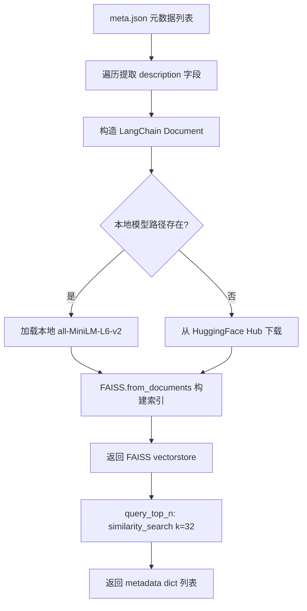
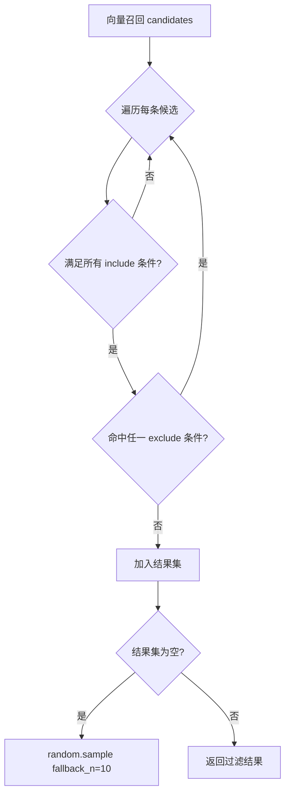
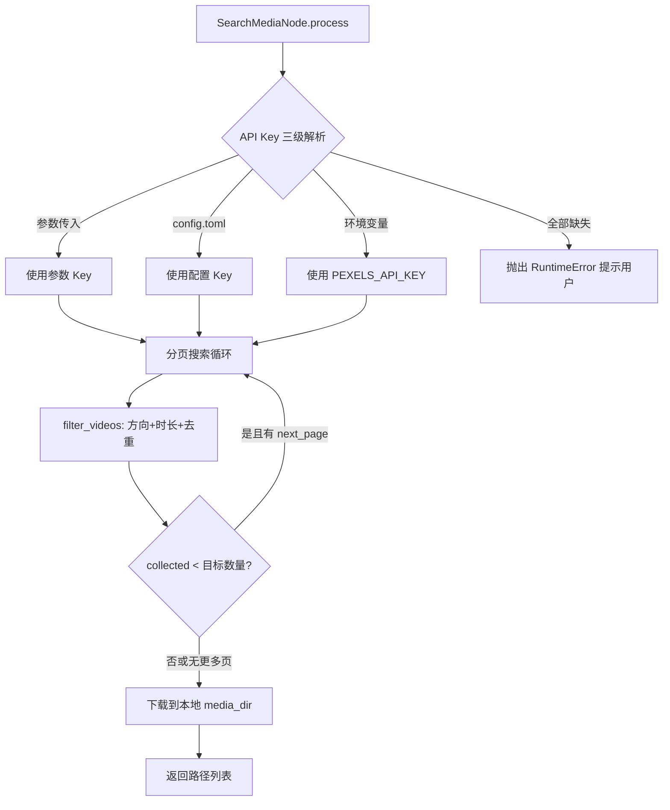

# PD-08.XX OpenStoryline — FAISS 语义召回 + Pexels 双通道素材检索

> 文档编号：PD-08.XX
> 来源：OpenStoryline `src/open_storyline/utils/recall.py`, `src/open_storyline/nodes/core_nodes/search_media.py`, `src/open_storyline/nodes/core_nodes/select_bgm.py`
> GitHub：https://github.com/FireRedTeam/FireRed-OpenStoryline.git
> 问题域：PD-08 搜索与检索 Search & Retrieval
> 状态：可复用方案

---

## 第 1 章 问题与动机

### 1.1 核心问题

视频自动生成流水线中，素材检索是关键瓶颈。系统需要同时解决两类检索需求：

1. **本地资源语义召回** — BGM 音乐库和脚本模板库是预置的结构化 JSON 资源，用户用自然语言描述需求（如"轻松治愈的旅行背景音乐"），系统需要从数百条候选中找到语义最匹配的 top-N。传统关键词匹配无法处理同义词和模糊描述。
2. **在线素材关键词搜索** — 图片和视频素材来自外部 API（Pexels），需要按关键词搜索、按方向/时长/质量多维过滤、分页采集、去重、下载到本地缓存。

两类检索的共同挑战：结果需要经过后处理（标签过滤、LLM 精选、质量排序）才能进入下游节点，且必须在 API Key 缺失时优雅降级。

### 1.2 OpenStoryline 的解法概述

OpenStoryline 采用"双通道"检索架构，将本地向量检索和在线 API 搜索分离为独立节点：

1. **StorylineRecall 静态工具类** — 基于 LangChain FAISS + HuggingFace Embeddings（all-MiniLM-L6-v2），将 JSON 元数据的 `description` 字段嵌入为向量，构建内存 FAISS 索引，`similarity_search(query, k=32)` 返回 top-N 原始 dict（`recall.py:8-63`）
2. **ElementFilter 标签过滤器** — 对向量召回结果做 include/exclude 多维标签过滤，过滤为空时随机采样 fallback（`element_filter.py:50-85`）
3. **LLM 精选层** — BGM 场景中，向量召回 + 标签过滤后的候选列表交给 LLM 做最终选择，解析失败时降级取第一条（`select_bgm.py:86-107`）
4. **Pexels API 搜索节点** — 独立的 `SearchMediaNode` 处理在线图片/视频搜索，支持方向、时长、质量多维过滤和分页采集（`search_media.py:44-88`）
5. **三级 API Key 降级链** — 输入参数 → config.toml → 环境变量，全部缺失时抛出明确错误提示用户配置（`search_media.py:49-55`）

### 1.3 设计思想

| 设计原则 | 具体实现 | 理由 | 替代方案 |
|----------|----------|------|----------|
| 本地优先嵌入 | all-MiniLM-L6-v2 本地模型，CPU 推理 | 零 API 成本，离线可用，384 维轻量 | OpenAI Embeddings（需网络+付费） |
| 召回-过滤-精选三阶段 | FAISS top-32 → 标签过滤 → LLM 精选 | 向量召回保证语义相关，标签过滤保证硬约束，LLM 保证最终质量 | 纯向量检索（无法处理硬约束标签） |
| 节点化封装 | 每种检索是独立 BaseNode 子类 | 可通过 MCP 协议独立调用，支持 mode=auto/skip/default | 单体函数（不可编排） |
| 元数据即文档 | JSON 元数据的 description 字段直接作为嵌入文本 | 资源库自带描述，无需额外文档处理 | 独立维护嵌入文本（同步成本高） |
| 渐进式 Key 解析 | 参数 → 配置文件 → 环境变量三级 fallback | 适配 Web UI 传入、本地部署、CI 环境等多种场景 | 仅环境变量（Web UI 场景不友好） |

---

## 第 2 章 源码实现分析

### 2.1 架构概览

```
┌─────────────────────────────────────────────────────────────┐
│                    OpenStoryline 检索架构                      │
├─────────────────────────────────────────────────────────────┤
│                                                             │
│  ┌─────────────────────┐    ┌──────────────────────────┐   │
│  │  本地向量检索通道     │    │   在线 API 搜索通道       │   │
│  │                     │    │                          │   │
│  │  meta.json          │    │  Pexels REST API         │   │
│  │    ↓                │    │    ↓                     │   │
│  │  StorylineRecall    │    │  search_videos/photos    │   │
│  │  .build_vectorstore │    │    ↓                     │   │
│  │    ↓                │    │  filter_videos/photos    │   │
│  │  FAISS.similarity   │    │  (方向/时长/质量/去重)     │   │
│  │  _search(k=32)      │    │    ↓                     │   │
│  │    ↓                │    │  download → 本地缓存      │   │
│  │  ElementFilter      │    │                          │   │
│  │  .filter(include/   │    └──────────────────────────┘   │
│  │   exclude)          │                                    │
│  │    ↓                │    使用者:                          │
│  │  LLM 精选(可选)     │    - SelectBGMNode (本地通道)       │
│  │                     │    - ScriptTemplateRec (本地通道)   │
│  └─────────────────────┘    - SearchMediaNode (在线通道)     │
│                                                             │
└─────────────────────────────────────────────────────────────┘
```

### 2.2 核心实现

#### 2.2.1 StorylineRecall — 向量索引构建与查询



对应源码 `src/open_storyline/utils/recall.py:6-63`：

```python
class StorylineRecall:
    @staticmethod
    def build_vectorstore(
        data: list[dict], 
        field: str = "description", 
        model_name: str = "./.storyline/models/all-MiniLM-L6-v2", 
        device: str = "cpu"
    ):
        if not os.path.exists(model_name):
            model_name = "sentence-transformers/all-MiniLM-L6-v2"

        embeddings = HuggingFaceEmbeddings(
            model_name=model_name,
            model_kwargs={"device": device}
        )

        docs = []
        for item in data:
            text = item.get(field, "")
            if text:
                docs.append(Document(page_content=text, metadata=item))

        if not docs:
            return None
        vectorstore = FAISS.from_documents(docs, embeddings)
        return vectorstore

    @staticmethod
    def query_top_n(vectorstore, query: str, n: int = 32):
        results = vectorstore.similarity_search(query, k=n)
        return [doc.metadata for doc in results]
```

关键设计点：
- **本地模型优先**：先检查 `.storyline/models/` 下是否有预下载模型，没有才从 Hub 拉取（`recall.py:26-27`）
- **metadata 透传**：将原始 dict 完整存入 Document.metadata，查询时直接返回，避免二次查找（`recall.py:40`）
- **宽召回策略**：默认 k=32，给下游过滤和精选留足空间（`recall.py:50`）

#### 2.2.2 ElementFilter — 多维标签过滤



对应源码 `src/open_storyline/utils/element_filter.py:50-85`：

```python
def filter(
    self,
    candidates: Optional[List[Dict[str, Any]]] = None,
    filter_include: Optional[FilterDict] = None,
    filter_exclude: Optional[FilterDict] = None,
    fallback_n: int = 10,
) -> List[Dict[str, Any]]:
    candidates = candidates or self.library
    include = filter_include or {}
    exclude = filter_exclude or {}

    results = []
    for item in candidates:
        if not self._match_include(item, include):
            continue
        if self._match_exclude(item, exclude):
            continue
        results.append(item)

    if not results and fallback_n > 0:
        return random.sample(
            self.library, min(fallback_n, len(self.library))
        )
    return results
```

关键设计点：
- **AND/OR 语义**：include 多维度之间 AND，同维度多值之间 OR（`element_filter.py:96-108`）
- **随机 fallback**：过滤结果为空时从全库随机采样 10 条，保证下游不会收到空列表（`element_filter.py:80-83`）
- **值归一化**：`_normalize()` 将标量和列表统一为 `List[str]`，支持 int/str 混合标签（`element_filter.py:87-94`）

#### 2.2.3 Pexels 在线搜索 — 分页采集与质量排序



对应源码 `src/open_storyline/nodes/core_nodes/search_media.py:44-88`：

```python
async def process(self, node_state: NodeState, inputs: Dict[str, Any]) -> Dict[str, Any]:
    pexels_api_key = inputs.get("pexels_api_key", "")
    if pexels_api_key == "":
        pexels_api_key = self.server_cfg.search_media.pexels_api_key
    if not pexels_api_key or pexels_api_key == "":
        pexels_api_key = os.getenv("PEXELS_API_KEY")
    if not pexels_api_key or pexels_api_key == "":
        node_state.node_summary.info_for_llm(
            "If the user has not entered their Pexels API key, "
            "please remind them to enter it in the sidebar of the webpage."
        )
        raise RuntimeError("Pexels api key not detected...")
```

视频质量选择算法 `search_media.py:245-260`：

```python
def candidate_score(file_info: dict[str, Any]) -> tuple[int, int, int]:
    long_edge_px = max(width_px, height_px)
    long_edge_distance = abs(long_edge_px - TARGET_LONG_EDGE_PX)  # 1080
    return (
        -long_edge_distance,        # 越接近 1080p 越好
        quality_preference(quality), # hd > sd > uhd
        -file_size_bytes,            # 同质量下选小文件
    )
```

### 2.3 实现细节

**BGM 选择的三阶段流水线** (`select_bgm.py:62-107`)：

1. **向量召回**：`StorylineRecall.query_top_n(vectorstore, query=user_request)` 返回 32 条候选
2. **标签过滤**：`ElementFilter.filter(candidates, filter_include, filter_exclude)` 按 mood/scene/genre/lang 过滤
3. **LLM 精选**：将过滤后候选列表和用户需求拼入 prompt，LLM 返回 JSON 选择结果
4. **降级兜底**：LLM 输出解析失败时取候选列表第一条（`select_bgm.py:103-105`）

**Pexels 去重机制**：视频和图片搜索均使用 `seen: set[str]` 按 URL 去重，跨页累积（`search_media.py:121,176-198`）

**拦截器注入 API Key**：MCP 调用链中，`ToolInterceptor.inject_pexels_api_key` 在工具调用前将运行时上下文中的 Key 注入到请求参数中（`node_interceptors.py:351-379`）


---

## 第 3 章 迁移指南

### 3.1 迁移清单

**阶段 1：本地向量召回（1 个文件）**
- [ ] 安装依赖：`pip install langchain-huggingface langchain-community faiss-cpu`
- [ ] 准备资源元数据 JSON（每条含 `description` 文本字段）
- [ ] 复制 `StorylineRecall` 类，按需修改 `field` 参数名和默认模型路径
- [ ] 首次运行时自动下载 all-MiniLM-L6-v2（约 80MB），或预下载到本地目录

**阶段 2：标签过滤层（1 个文件）**
- [ ] 复制 `ElementFilter` 类
- [ ] 定义资源的标签维度（如 mood/scene/genre），确保 JSON 元数据中包含对应字段
- [ ] 根据业务需求调整 `fallback_n` 值

**阶段 3：在线 API 搜索（可选）**
- [ ] 注册 Pexels API Key（免费，200 请求/小时）
- [ ] 复制 `search_videos/search_photos/filter_videos/filter_photos` 函数
- [ ] 实现三级 Key 解析逻辑（参数 → 配置 → 环境变量）

### 3.2 适配代码模板

```python
"""可直接运行的本地向量召回 + 标签过滤模板"""
import json
import os
import random
from typing import Any, Dict, List, Optional, Union

from langchain_huggingface import HuggingFaceEmbeddings
from langchain_core.documents import Document
from langchain_community.vectorstores.faiss import FAISS


class LocalRecall:
    """通用本地资源语义召回"""

    def __init__(
        self,
        data: List[Dict[str, Any]],
        text_field: str = "description",
        model_name: str = "sentence-transformers/all-MiniLM-L6-v2",
        device: str = "cpu",
    ):
        self.data = data
        embeddings = HuggingFaceEmbeddings(
            model_name=model_name,
            model_kwargs={"device": device},
        )
        docs = [
            Document(page_content=item[text_field], metadata=item)
            for item in data
            if item.get(text_field)
        ]
        self.vectorstore = FAISS.from_documents(docs, embeddings) if docs else None

    def recall(self, query: str, top_n: int = 32) -> List[Dict[str, Any]]:
        if not self.vectorstore:
            return []
        results = self.vectorstore.similarity_search(query, k=top_n)
        return [doc.metadata for doc in results]

    def recall_and_filter(
        self,
        query: str,
        top_n: int = 32,
        include: Optional[Dict[str, Any]] = None,
        exclude: Optional[Dict[str, Any]] = None,
        fallback_n: int = 10,
    ) -> List[Dict[str, Any]]:
        candidates = self.recall(query, top_n)
        include = include or {}
        exclude = exclude or {}

        results = []
        for item in candidates:
            # include: 所有维度 AND，同维度多值 OR
            if not all(
                set(_norm(item.get(k))) & set(_norm(v))
                for k, v in include.items()
                if k in item
            ):
                continue
            # exclude: 任一维度命中即排除
            if any(
                set(_norm(item.get(k))) & set(_norm(v))
                for k, v in exclude.items()
                if k in item
            ):
                continue
            results.append(item)

        if not results and fallback_n > 0:
            return random.sample(self.data, min(fallback_n, len(self.data)))
        return results


def _norm(value: Any) -> List[str]:
    if value is None:
        return []
    if isinstance(value, list):
        return [str(v) for v in value]
    return [str(value)]


# 使用示例
if __name__ == "__main__":
    # 假设 bgm_meta.json 格式: [{"id": 1, "description": "轻松治愈钢琴曲", "mood": ["Calm", "Healing"], ...}]
    with open("bgm_meta.json", "r") as f:
        library = json.load(f)

    recall = LocalRecall(library, text_field="description")
    candidates = recall.recall_and_filter(
        query="适合旅行 vlog 的轻松背景音乐",
        include={"mood": ["Calm", "Healing"]},
        exclude={"genre": ["Rock"]},
    )
    print(f"Found {len(candidates)} candidates")
```

### 3.3 适用场景

| 场景 | 适用度 | 说明 |
|------|--------|------|
| 小规模本地资源库语义检索（<10K 条） | ⭐⭐⭐ | FAISS flat 索引 + 轻量嵌入模型，无需外部服务 |
| 多媒体素材在线搜索（图片/视频） | ⭐⭐⭐ | Pexels 免费 API + 多维过滤 + 质量排序 |
| 大规模文档 RAG（>100K 条） | ⭐ | 缺少分块、增量索引、持久化，需要额外工程 |
| 需要精确排序的推荐系统 | ⭐⭐ | 向量召回 + LLM 精选可以工作，但缺少 reranker |
| 多模态混合检索 | ⭐ | 仅支持文本嵌入，不支持图片/音频向量 |

---

## 第 4 章 测试用例

```python
import pytest
from unittest.mock import patch, MagicMock
from typing import Any, Dict, List


# ---- StorylineRecall 测试 ----

class TestStorylineRecall:
    """测试向量召回核心逻辑"""

    @pytest.fixture
    def sample_library(self) -> List[Dict[str, Any]]:
        return [
            {"id": 1, "description": "upbeat electronic dance music", "mood": ["Dynamic"]},
            {"id": 2, "description": "calm piano melody for relaxation", "mood": ["Calm"]},
            {"id": 3, "description": "energetic rock guitar riff", "mood": ["Excited"]},
            {"id": 4, "description": "soft acoustic folk song", "mood": ["Healing"]},
            {"id": 5, "description": "dramatic orchestral soundtrack", "mood": ["Inspirational"]},
        ]

    def test_build_vectorstore_returns_faiss(self, sample_library):
        """正常路径：构建 FAISS 索引"""
        from open_storyline.utils.recall import StorylineRecall
        vs = StorylineRecall.build_vectorstore(sample_library)
        assert vs is not None

    def test_build_vectorstore_empty_descriptions(self):
        """边界：所有条目无 description 字段"""
        from open_storyline.utils.recall import StorylineRecall
        data = [{"id": 1, "tags": "rock"}, {"id": 2}]
        vs = StorylineRecall.build_vectorstore(data)
        assert vs is None

    def test_query_top_n_returns_metadata(self, sample_library):
        """正常路径：查询返回原始 metadata dict"""
        from open_storyline.utils.recall import StorylineRecall
        vs = StorylineRecall.build_vectorstore(sample_library)
        results = StorylineRecall.query_top_n(vs, query="relaxing piano", n=3)
        assert len(results) <= 3
        assert all(isinstance(r, dict) for r in results)
        assert all("id" in r for r in results)


# ---- ElementFilter 测试 ----

class TestElementFilter:
    """测试标签过滤逻辑"""

    @pytest.fixture
    def filter_instance(self):
        from open_storyline.utils.element_filter import ElementFilter
        library = [
            {"id": 1, "mood": ["Calm"], "genre": ["Pop"]},
            {"id": 2, "mood": ["Dynamic"], "genre": ["Rock"]},
            {"id": 3, "mood": ["Calm", "Healing"], "genre": ["Folk"]},
            {"id": 4, "mood": ["Excited"], "genre": ["Electronic"]},
        ]
        return ElementFilter(library=library)

    def test_include_filter(self, filter_instance):
        """include 过滤：mood=Calm 应返回 id 1 和 3"""
        results = filter_instance.filter(
            filter_include={"mood": ["Calm"]},
        )
        ids = {r["id"] for r in results}
        assert ids == {1, 3}

    def test_exclude_filter(self, filter_instance):
        """exclude 过滤：排除 Rock"""
        results = filter_instance.filter(
            filter_exclude={"genre": ["Rock"]},
        )
        ids = {r["id"] for r in results}
        assert 2 not in ids

    def test_empty_result_fallback(self, filter_instance):
        """降级：过滤结果为空时随机采样"""
        results = filter_instance.filter(
            filter_include={"mood": ["NonExistent"]},
            fallback_n=2,
        )
        assert len(results) == 2

    def test_combined_include_exclude(self, filter_instance):
        """组合：include Calm + exclude Folk → 只剩 id=1"""
        results = filter_instance.filter(
            filter_include={"mood": ["Calm"]},
            filter_exclude={"genre": ["Folk"]},
        )
        ids = {r["id"] for r in results}
        assert ids == {1}


# ---- Pexels 搜索测试 ----

class TestPexelsSearch:
    """测试在线搜索过滤逻辑"""

    def test_filter_videos_duration(self):
        """视频时长过滤"""
        from open_storyline.nodes.core_nodes.search_media import filter_videos
        raw = {"videos": [
            {"duration": 5, "width": 1920, "height": 1080,
             "video_files": [{"file_type": "video/mp4", "link": "http://a.mp4",
                              "width": 1920, "height": 1080, "quality": "hd", "size": 1000}]},
            {"duration": 60, "width": 1920, "height": 1080,
             "video_files": [{"file_type": "video/mp4", "link": "http://b.mp4",
                              "width": 1920, "height": 1080, "quality": "hd", "size": 1000}]},
        ]}
        results = filter_videos(raw, video_number=10, orientation="",
                                min_video_duration=1, max_video_duration=30)
        assert len(results) == 1
        assert "a.mp4" in results[0]

    def test_filter_videos_dedup(self):
        """视频 URL 去重"""
        from open_storyline.nodes.core_nodes.search_media import filter_videos
        raw = {"videos": [
            {"duration": 5, "width": 1920, "height": 1080,
             "video_files": [{"file_type": "video/mp4", "link": "http://same.mp4",
                              "width": 1920, "height": 1080, "quality": "hd", "size": 1000}]},
            {"duration": 8, "width": 1920, "height": 1080,
             "video_files": [{"file_type": "video/mp4", "link": "http://same.mp4",
                              "width": 1920, "height": 1080, "quality": "hd", "size": 1000}]},
        ]}
        results = filter_videos(raw, video_number=10, orientation="",
                                min_video_duration=1, max_video_duration=30)
        assert len(results) == 1
```


---

## 第 5 章 跨域关联

| 关联域 | 关系类型 | 说明 |
|--------|----------|------|
| PD-04 工具系统 | 协同 | 每个检索通道封装为独立 BaseNode，通过 NODE_REGISTRY 注册为 MCP 工具，工具系统决定何时调用检索 |
| PD-10 中间件管道 | 协同 | `inject_pexels_api_key` 拦截器在 MCP 调用链中注入 API Key，属于中间件管道的一环 |
| PD-03 容错与重试 | 依赖 | BGM 选择中 LLM 解析失败降级取第一条、过滤为空时随机 fallback、API Key 三级降级链均属容错策略 |
| PD-01 上下文管理 | 协同 | LLM 精选步骤将候选列表序列化为 prompt，候选数量（k=32）直接影响上下文 token 消耗 |
| PD-06 记忆持久化 | 互补 | 当前方案的 FAISS 索引为内存态，不持久化；若需跨会话复用索引，需引入 FAISS.save_local/load_local |

---

## 第 6 章 来源文件索引

| 文件 | 行范围 | 关键实现 |
|------|--------|----------|
| `src/open_storyline/utils/recall.py` | L6-63 | StorylineRecall 类：FAISS 索引构建 + similarity_search 查询 |
| `src/open_storyline/utils/element_filter.py` | L10-122 | ElementFilter 类：include/exclude 标签过滤 + 随机 fallback |
| `src/open_storyline/nodes/core_nodes/select_bgm.py` | L18-107 | SelectBGMNode：向量召回 → 标签过滤 → LLM 精选三阶段流水线 |
| `src/open_storyline/nodes/core_nodes/search_media.py` | L29-376 | SearchMediaNode：Pexels API 搜索/过滤/下载 + 三级 Key 降级 |
| `src/open_storyline/nodes/core_nodes/script_template_rec.py` | L13-58 | ScriptTemplateRecomendation：脚本模板向量召回（复用 StorylineRecall） |
| `src/open_storyline/nodes/core_nodes/base_node.py` | L54-245 | BaseNode 抽象基类：mode 分发 + 输入输出序列化 |
| `src/open_storyline/mcp/hooks/node_interceptors.py` | L351-379 | inject_pexels_api_key 拦截器：运行时 Key 注入 |
| `src/open_storyline/config.py` | L136-137 | PexelsConfig：API Key 配置模型 |
| `config.toml` | L73-74 | search_media.pexels_api_key 配置项 |

---

## 第 7 章 横向对比维度

```json comparison_data
{
  "project": "OpenStoryline",
  "dimensions": {
    "搜索架构": "双通道：本地 FAISS 向量召回 + Pexels REST API 在线搜索",
    "去重机制": "URL seen set 跨页去重，向量召回依赖 FAISS 天然去重",
    "结果处理": "三阶段：向量 top-32 → 标签 include/exclude → LLM JSON 精选",
    "容错策略": "LLM 解析失败取首条，过滤为空随机采样，API Key 三级 fallback",
    "成本控制": "本地 all-MiniLM-L6-v2 零 API 成本，Pexels 免费 200 请求/小时",
    "索引结构": "FAISS flat 内存索引，384 维 all-MiniLM-L6-v2 嵌入",
    "排序策略": "视频按 1080p 距离 + 质量偏好 + 文件大小三元组排序",
    "嵌入后端适配": "HuggingFaceEmbeddings 本地优先，Hub 自动降级下载",
    "多模态支持": "文本嵌入检索 BGM/模板 + REST API 搜索图片视频，双通道互补",
    "搜索工具条件注册": "API Key 缺失时 SearchMediaNode 抛出 RuntimeError 并提示用户配置",
    "检索方式": "语义向量检索（本地资源）+ 关键词 API 搜索（在线素材）"
  }
}
```

### 域元数据补充

```json domain_metadata
{
  "solution_summary": "OpenStoryline 用 FAISS+all-MiniLM-L6-v2 本地向量召回 BGM/模板，Pexels API 在线搜索图片视频，三阶段召回-过滤-LLM精选流水线",
  "description": "创意素材场景下本地向量检索与在线 API 搜索的双通道协同模式",
  "sub_problems": [
    "素材质量排序：多维评分（分辨率距离+质量等级+文件大小）的权重设计",
    "标签过滤空结果降级：硬约束过滤后无结果时的随机采样兜底策略",
    "嵌入模型本地缓存：预下载模型与 Hub 自动下载的优先级切换"
  ],
  "best_practices": [
    "向量宽召回+标签硬过滤+LLM精选三阶段分离关注点：语义相关性、业务约束、最终质量各司其职",
    "元数据即嵌入文本：资源库自带 description 字段直接嵌入，避免维护独立文本的同步成本"
  ]
}
```
