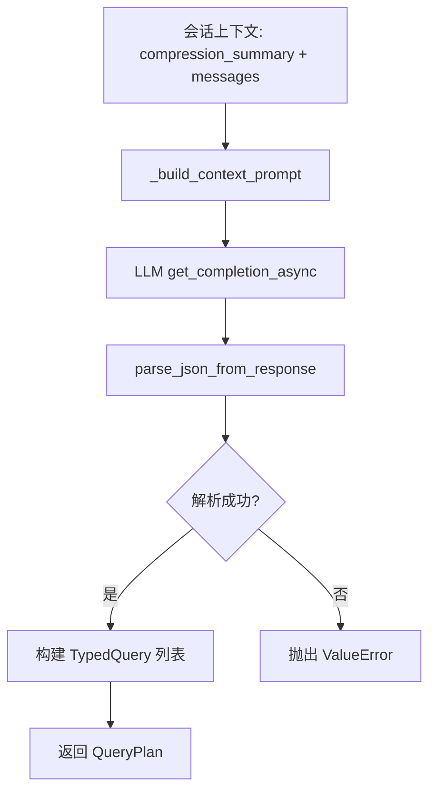

# PD-08.23 OpenViking — 目录递归层级检索与意图驱动查询规划

> 文档编号：PD-08.23
> 来源：OpenViking `openviking/retrieve/hierarchical_retriever.py`
> GitHub：https://github.com/volcengine/OpenViking.git
> 问题域：PD-08 搜索与检索 Search & Retrieval
> 状态：可复用方案

---

## 第 1 章 问题与动机

### 1.1 核心问题

Agent 系统需要从海量上下文（记忆、资源、技能）中精准检索相关信息。传统的平坦向量搜索存在两个根本缺陷：

1. **噪声问题**：全量搜索返回大量低相关结果，尤其在多租户、多类型上下文共存时
2. **深度不足**：单次 top-k 搜索无法发现嵌套在子目录中的高质量内容

OpenViking 的核心洞察是：上下文天然具有层级结构（目录 → 子目录 → 叶子文件），检索应该利用这种结构，先定位高相关目录，再递归下钻到具体内容。

### 1.2 OpenViking 的解法概述

1. **IntentAnalyzer 意图分析**：用 LLM 分析会话上下文，生成多条 TypedQuery，每条指定 context_type（memory/resource/skill）和优先级（`intent_analyzer.py:35-97`）
2. **HierarchicalRetriever 层级检索**：先全局向量搜索定位 L0/L1 级目录节点，再以目录为起点递归搜索子节点，用 heapq 优先队列按分数排序探索（`hierarchical_retriever.py:80-168`）
3. **分数传播机制**：子节点分数 = α × 自身分数 + (1-α) × 父目录分数，确保高质量目录下的内容获得排名提升（`hierarchical_retriever.py:317-318`）
4. **热度衰减融合**：最终排名混合语义相似度和 hotness_score（基于 active_count 和 updated_at 的指数衰减），让高频访问的新鲜内容排名靠前（`memory_lifecycle.py:19-64`）
5. **收敛检测**：连续 3 轮 top-k 结果不变则提前终止递归，避免无意义遍历（`hierarchical_retriever.py:344-356`）

### 1.3 设计思想

| 设计原则 | 具体实现 | 理由 | 替代方案 |
|----------|----------|------|----------|
| 层级优先于平坦 | L0/L1/L2 三级索引，先搜目录再搜内容 | 利用目录结构缩小搜索空间 | 全量 flat search |
| 意图驱动查询 | LLM 生成多条 TypedQuery 分类检索 | 不同类型上下文需要不同检索策略 | 单一查询全类型搜索 |
| 分数传播 | α=0.5 线性混合父子分数 | 高质量目录下的内容应获得排名提升 | 仅用子节点自身分数 |
| 热度衰减 | sigmoid(log1p(count)) × exp(-λt) | 兼顾访问频率和时间新鲜度 | 纯语义排序 |
| 收敛提前终止 | 3 轮 top-k 不变即停 | 避免深层无意义遍历 | 固定深度限制 |
| 混合向量 | Dense + Sparse 双向量同时检索 | 语义匹配 + 关键词匹配互补 | 仅 dense 向量 |

---

## 第 2 章 源码实现分析

### 2.1 架构概览

OpenViking 的检索系统由三个核心组件构成，形成"意图分析 → 层级检索 → 热度融合"的完整管线：

```
┌─────────────────────────────────────────────────────────────────┐
│                     IntentAnalyzer                              │
│  session context + LLM → TypedQuery[] (memory/resource/skill)   │
└──────────────────────────┬──────────────────────────────────────┘
                           │ QueryPlan
                           ▼
┌─────────────────────────────────────────────────────────────────┐
│                  HierarchicalRetriever                           │
│                                                                 │
│  Step 1: _get_root_uris_for_type()  → 确定起始 URI 空间         │
│  Step 2: _global_vector_search()    → 全局搜 L0/L1 目录节点     │
│  Step 3: _merge_starting_points()   → 合并起始点 + rerank       │
│  Step 4: _recursive_search()        → heapq 优先队列递归下钻    │
│  Step 5: _convert_to_matched_contexts() → 热度融合 + 重排序     │
│                                                                 │
│  ┌──────────┐    ┌──────────┐    ┌──────────┐                   │
│  │ L0 摘要  │───→│ L1 概览  │───→│ L2 详情  │                   │
│  │ .abstract│    │ .overview│    │ 叶子文件  │                   │
│  └──────────┘    └──────────┘    └──────────┘                   │
└──────────────────────────┬──────────────────────────────────────┘
                           │
                           ▼
┌─────────────────────────────────────────────────────────────────┐
│              VikingVectorIndexBackend                            │
│  Adapter Pattern: local / http / volcengine / vikingdb          │
│  FilterExpr AST: And / Or / Eq / In / Range / Contains          │
│  Tenant isolation: account_id + owner_space                     │
└─────────────────────────────────────────────────────────────────┘
```

### 2.2 核心实现

#### 2.2.1 IntentAnalyzer — LLM 驱动的查询规划



对应源码 `openviking/retrieve/intent_analyzer.py:35-97`：

```python
class IntentAnalyzer:
    def __init__(self, max_recent_messages: int = 5):
        self.max_recent_messages = max_recent_messages

    async def analyze(
        self,
        compression_summary: str,
        messages: List[Message],
        current_message: Optional[str] = None,
        context_type: Optional[ContextType] = None,
        target_abstract: str = "",
    ) -> QueryPlan:
        prompt = self._build_context_prompt(
            compression_summary, messages, current_message,
            context_type, target_abstract,
        )
        response = await get_openviking_config().vlm.get_completion_async(prompt)
        parsed = parse_json_from_response(response)
        if not parsed:
            raise ValueError("Failed to parse intent analysis response")

        queries = []
        for q in parsed.get("queries", []):
            try:
                context_type = ContextType(q.get("context_type", "resource"))
            except ValueError:
                context_type = ContextType.RESOURCE
            queries.append(TypedQuery(
                query=q.get("query", ""),
                context_type=context_type,
                intent=q.get("intent", ""),
                priority=q.get("priority", 3),
            ))
        return QueryPlan(queries=queries, session_context=..., reasoning=...)
```

关键设计：IntentAnalyzer 将会话压缩摘要 + 最近 5 条消息 + 当前消息拼接为 prompt，让 LLM 输出结构化 JSON，每条 TypedQuery 包含 query 文本、context_type 分类和 priority 优先级。

#### 2.2.2 HierarchicalRetriever — 递归层级检索核心

```mermaid
graph TD
    A[retrieve 入口] --> B[embedder.embed 生成 dense+sparse 向量]
    B --> C[_get_root_uris_for_type 确定起始空间]
    C --> D[_global_vector_search 搜索 L0/L1 目录]
    D --> E[_merge_starting_points 合并+rerank]
    E --> F[_recursive_search heapq 递归]
    F --> G{dir_queue 非空?}
    G -->|是| H[heappop 取最高分目录]
    H --> I[search_children_in_tenant]
    I --> J[rerank 或 vector score]
    J --> K[分数传播: α*score + (1-α)*parent]
    K --> L{passes_threshold?}
    L -->|是| M[加入 collected + 子目录入队]
    L -->|否| N[跳过]
    M --> O{收敛检测: 3轮不变?}
    O -->|否| G
    O -->|是| P[排序截断返回]
    G -->|否| P
    P --> Q[_convert_to_matched_contexts 热度融合]
```

对应源码 `openviking/retrieve/hierarchical_retriever.py:230-359`：

```python
async def _recursive_search(self, query, ctx, query_vector, sparse_query_vector,
                            starting_points, limit, mode, threshold=None,
                            score_gte=False, context_type=None, target_dirs=None,
                            scope_dsl=None) -> List[Dict[str, Any]]:
    collected: List[Dict[str, Any]] = []
    dir_queue: List[tuple] = []  # 优先队列: (-score, uri)
    visited: set = set()
    prev_topk_uris: set = set()
    convergence_rounds = 0
    alpha = self.SCORE_PROPAGATION_ALPHA  # 0.5

    for uri, score in starting_points:
        heapq.heappush(dir_queue, (-score, uri))

    while dir_queue:
        temp_score, current_uri = heapq.heappop(dir_queue)
        current_score = -temp_score
        if current_uri in visited:
            continue
        visited.add(current_uri)

        results = await self.vector_store.search_children_in_tenant(
            ctx=ctx, parent_uri=current_uri,
            query_vector=query_vector, sparse_query_vector=sparse_query_vector,
            context_type=context_type, target_directories=target_dirs,
            extra_filter=scope_dsl, limit=max(limit * 2, 20),
        )

        # Rerank 或直接用向量分数
        if self._rerank_client and mode == RetrieverMode.THINKING:
            documents = [r["abstract"] for r in results]
            query_scores = self._rerank_client.rerank_batch(query, documents)
        else:
            query_scores = [r.get("_score", 0) for r in results]

        for r, score in zip(results, query_scores):
            # 分数传播：子节点分数 = α × 自身 + (1-α) × 父目录
            final_score = alpha * score + (1 - alpha) * current_score if current_score else score
            if not passes_threshold(final_score):
                continue
            if not any(c.get("uri") == r.get("uri") for c in collected):
                r["_final_score"] = final_score
                collected.append(r)
            # level=2 是叶子节点不再入队，其他层级继续递归
            if r.get("uri") not in visited:
                if r.get("level") == 2:
                    visited.add(r.get("uri"))
                else:
                    heapq.heappush(dir_queue, (-final_score, r.get("uri")))

        # 收敛检测
        current_topk = sorted(collected, key=lambda x: x.get("_final_score", 0), reverse=True)[:limit]
        current_topk_uris = {c.get("uri", "") for c in current_topk}
        if current_topk_uris == prev_topk_uris and len(current_topk_uris) >= limit:
            convergence_rounds += 1
            if convergence_rounds >= self.MAX_CONVERGENCE_ROUNDS:  # 3
                break
        else:
            convergence_rounds = 0
            prev_topk_uris = current_topk_uris

    collected.sort(key=lambda x: x.get("_final_score", 0), reverse=True)
    return collected[:limit]
```

### 2.3 实现细节

#### 热度衰减公式

`memory_lifecycle.py:19-64` 实现了一个纯函数 `hotness_score`，公式为：

```
score = sigmoid(log1p(active_count)) × exp(-λ × age_days)
```

其中 λ = ln(2) / half_life_days（默认 7 天半衰期）。这意味着：
- 访问 1 次的内容 freq ≈ 0.62，访问 10 次 freq ≈ 0.88
- 7 天前更新的内容 recency = 0.5，14 天前 recency = 0.25

在 `_convert_to_matched_contexts`（`hierarchical_retriever.py:361-427`）中，最终分数 = (1 - HOTNESS_ALPHA) × semantic_score + HOTNESS_ALPHA × h_score，其中 HOTNESS_ALPHA = 0.2。

#### 多租户隔离

`viking_vector_index_backend.py:464-511` 通过 FilterExpr AST 构建租户过滤器：

```python
@staticmethod
def _tenant_filter(ctx: RequestContext, context_type=None) -> Optional[FilterExpr]:
    if ctx.role == Role.ROOT:
        return None
    owner_spaces = [ctx.user.user_space_name(), ctx.user.agent_space_name()]
    if context_type == "resource":
        owner_spaces.append("")  # 公共资源无 owner_space
    return And([Eq("account_id", ctx.account_id), In("owner_space", owner_spaces)])
```

#### 嵌入后端适配

`openviking/models/embedder/base.py:58-258` 定义了三层嵌入基类：
- `DenseEmbedderBase`：纯稠密向量
- `SparseEmbedderBase`：纯稀疏向量
- `HybridEmbedderBase`：同时输出 dense + sparse
- `CompositeHybridEmbedder`：组合任意 dense + sparse 实现

具体实现包括 Volcengine（`volcengine_embedders.py`）、OpenAI、Jina 等多后端。

#### 向量存储适配器工厂

`openviking/storage/vectordb_adapters/factory.py:13-29` 用注册表模式支持 4 种后端：

```python
_ADAPTER_REGISTRY = {
    "local": LocalCollectionAdapter,
    "http": HttpCollectionAdapter,
    "volcengine": VolcengineCollectionAdapter,
    "vikingdb": VikingDBPrivateCollectionAdapter,
}
```


---

## 第 3 章 迁移指南

### 3.1 迁移清单

**阶段 1：数据模型（必须）**
- [ ] 定义 L0/L1/L2 三级上下文模型，每条记录包含 `uri`、`parent_uri`、`level`、`abstract`、`context_type`
- [ ] 设计 URI 命名规范（如 `viking://user/{space}/memories/...`）
- [ ] 在向量数据库中创建 `parent_uri` 和 `level` 的标量索引

**阶段 2：嵌入层（必须）**
- [ ] 实现 `EmbedderBase` 抽象类，支持 `embed(text) -> EmbedResult(dense, sparse)`
- [ ] 至少接入一个 dense embedder（OpenAI / Volcengine / Jina）
- [ ] 可选：接入 sparse embedder 实现混合检索

**阶段 3：层级检索器（核心）**
- [ ] 实现 `_global_vector_search`：过滤 level in [0,1] 的全局搜索
- [ ] 实现 `_recursive_search`：heapq 优先队列 + 分数传播 + 收敛检测
- [ ] 实现 `hotness_score` 纯函数用于热度融合

**阶段 4：意图分析（可选增强）**
- [ ] 实现 IntentAnalyzer：LLM 分析会话上下文生成 TypedQuery 列表
- [ ] 定义 prompt 模板，输出 JSON 格式的 queries 数组

### 3.2 适配代码模板

以下是一个可直接运行的简化版层级检索器：

```python
import heapq
import math
from dataclasses import dataclass
from datetime import datetime, timezone
from typing import Any, Dict, List, Optional, Tuple


@dataclass
class EmbedResult:
    dense_vector: Optional[List[float]] = None
    sparse_vector: Optional[Dict[str, float]] = None


def hotness_score(
    active_count: int,
    updated_at: Optional[datetime],
    now: Optional[datetime] = None,
    half_life_days: float = 7.0,
) -> float:
    """Compute 0.0-1.0 hotness score: sigmoid(log1p(count)) * exp_decay(age)."""
    if now is None:
        now = datetime.now(timezone.utc)
    freq = 1.0 / (1.0 + math.exp(-math.log1p(active_count)))
    if updated_at is None:
        return 0.0
    if updated_at.tzinfo is None:
        updated_at = updated_at.replace(tzinfo=timezone.utc)
    if now.tzinfo is None:
        now = now.replace(tzinfo=timezone.utc)
    age_days = max((now - updated_at).total_seconds() / 86400.0, 0.0)
    decay_rate = math.log(2) / half_life_days
    return freq * math.exp(-decay_rate * age_days)


class SimpleHierarchicalRetriever:
    """Simplified hierarchical retriever for migration reference."""

    SCORE_PROPAGATION_ALPHA = 0.5
    MAX_CONVERGENCE_ROUNDS = 3
    HOTNESS_ALPHA = 0.2

    def __init__(self, vector_store, embedder):
        self.vector_store = vector_store
        self.embedder = embedder

    async def retrieve(self, query: str, limit: int = 5) -> List[Dict[str, Any]]:
        # Step 1: Embed query
        result = self.embedder.embed(query)

        # Step 2: Global search for L0/L1 directories
        global_results = await self.vector_store.search(
            query_vector=result.dense_vector,
            filter={"level": {"$in": [0, 1]}},
            limit=3,
        )

        # Step 3: Recursive search
        collected = []
        dir_queue = []
        visited = set()
        prev_topk = set()
        convergence = 0

        for r in global_results:
            heapq.heappush(dir_queue, (-r["score"], r["uri"]))

        while dir_queue:
            neg_score, uri = heapq.heappop(dir_queue)
            parent_score = -neg_score
            if uri in visited:
                continue
            visited.add(uri)

            children = await self.vector_store.search(
                query_vector=result.dense_vector,
                filter={"parent_uri": uri},
                limit=max(limit * 2, 20),
            )

            alpha = self.SCORE_PROPAGATION_ALPHA
            for child in children:
                score = alpha * child["score"] + (1 - alpha) * parent_score
                child["_final_score"] = score
                if not any(c["uri"] == child["uri"] for c in collected):
                    collected.append(child)
                if child.get("level", 2) != 2 and child["uri"] not in visited:
                    heapq.heappush(dir_queue, (-score, child["uri"]))

            # Convergence check
            topk = sorted(collected, key=lambda x: x["_final_score"], reverse=True)[:limit]
            topk_uris = {c["uri"] for c in topk}
            if topk_uris == prev_topk and len(topk_uris) >= limit:
                convergence += 1
                if convergence >= self.MAX_CONVERGENCE_ROUNDS:
                    break
            else:
                convergence = 0
                prev_topk = topk_uris

        collected.sort(key=lambda x: x["_final_score"], reverse=True)
        return collected[:limit]
```

### 3.3 适用场景

| 场景 | 适用度 | 说明 |
|------|--------|------|
| 知识库 RAG（文档层级结构） | ⭐⭐⭐ | 天然适合目录/文件层级 |
| Agent 记忆检索 | ⭐⭐⭐ | 记忆分类 + 热度衰减非常匹配 |
| 代码仓库搜索 | ⭐⭐ | 目录结构明确，但需要 AST 增强 |
| 平坦文档集合 | ⭐ | 无层级结构时退化为普通向量搜索 |
| 实时搜索（低延迟要求） | ⭐⭐ | 递归增加延迟，需要收敛检测控制 |

---

## 第 4 章 测试用例

```python
import math
from datetime import datetime, timezone, timedelta
import pytest

from openviking.retrieve.memory_lifecycle import hotness_score, DEFAULT_HALF_LIFE_DAYS


class TestHotnessScore:
    """Tests for hotness_score pure function."""

    def test_zero_count_with_recent_update(self):
        now = datetime(2026, 1, 15, tzinfo=timezone.utc)
        score = hotness_score(active_count=0, updated_at=now, now=now)
        # sigmoid(log1p(0)) = sigmoid(0) = 0.5, recency = 1.0
        assert abs(score - 0.5) < 0.01

    def test_high_count_recent(self):
        now = datetime(2026, 1, 15, tzinfo=timezone.utc)
        score = hotness_score(active_count=100, updated_at=now, now=now)
        # sigmoid(log1p(100)) ≈ 0.99, recency = 1.0
        assert score > 0.95

    def test_half_life_decay(self):
        now = datetime(2026, 1, 15, tzinfo=timezone.utc)
        one_week_ago = now - timedelta(days=7)
        score = hotness_score(active_count=10, updated_at=one_week_ago, now=now)
        fresh_score = hotness_score(active_count=10, updated_at=now, now=now)
        # After one half-life, score should be ~50% of fresh
        assert abs(score / fresh_score - 0.5) < 0.05

    def test_none_updated_at_returns_zero(self):
        score = hotness_score(active_count=100, updated_at=None)
        assert score == 0.0

    def test_naive_datetime_treated_as_utc(self):
        now = datetime(2026, 1, 15)  # naive
        score = hotness_score(active_count=5, updated_at=now, now=now)
        assert 0.0 < score <= 1.0


class TestHierarchicalRetriever:
    """Tests for hierarchical retriever logic."""

    def test_score_propagation(self):
        alpha = 0.5
        parent_score = 0.8
        child_score = 0.6
        final = alpha * child_score + (1 - alpha) * parent_score
        assert abs(final - 0.7) < 0.01

    def test_convergence_detection(self):
        """Simulate 3 rounds of unchanged top-k → should converge."""
        prev_topk = {"uri_a", "uri_b", "uri_c"}
        convergence_rounds = 0
        for _ in range(3):
            current_topk = {"uri_a", "uri_b", "uri_c"}
            if current_topk == prev_topk and len(current_topk) >= 3:
                convergence_rounds += 1
            else:
                convergence_rounds = 0
        assert convergence_rounds == 3

    def test_threshold_filtering(self):
        threshold = 0.3
        scores = [0.1, 0.25, 0.35, 0.5, 0.8]
        passed = [s for s in scores if s > threshold]
        assert passed == [0.35, 0.5, 0.8]

    def test_hotness_blend(self):
        """Test final score blending with HOTNESS_ALPHA=0.2."""
        alpha = 0.2
        semantic = 0.9
        hotness = 0.5
        final = (1 - alpha) * semantic + alpha * hotness
        assert abs(final - 0.82) < 0.01
```


---

## 第 5 章 跨域关联

| 关联域 | 关系类型 | 说明 |
|--------|----------|------|
| PD-01 上下文管理 | 协同 | IntentAnalyzer 依赖 compression_summary（上下文压缩的输出）作为检索输入 |
| PD-06 记忆持久化 | 依赖 | MemoryExtractor 提取的 6 类记忆（profile/preferences/entities/events/cases/patterns）是检索的数据源 |
| PD-04 工具系统 | 协同 | 检索到的 skill 类型上下文直接关联工具注册和调用 |
| PD-11 可观测性 | 协同 | ThinkingTrace 提供完整的检索决策过程追踪，包含 ScoreDistribution 统计 |
| PD-02 多 Agent 编排 | 协同 | 多 Agent 场景下每个 Agent 可独立调用 HierarchicalRetriever，通过 RequestContext 隔离 |

---

## 第 6 章 来源文件索引

| 文件 | 行范围 | 关键实现 |
|------|--------|----------|
| `openviking/retrieve/hierarchical_retriever.py` | L37-L459 | HierarchicalRetriever 完整实现：retrieve、_recursive_search、_convert_to_matched_contexts |
| `openviking/retrieve/intent_analyzer.py` | L21-L143 | IntentAnalyzer：LLM 意图分析生成 QueryPlan |
| `openviking/retrieve/memory_lifecycle.py` | L19-L64 | hotness_score 纯函数：sigmoid × 指数衰减 |
| `openviking_cli/retrieve/types.py` | L1-L413 | TypedQuery、QueryPlan、MatchedContext、FindResult、ThinkingTrace 等核心类型 |
| `openviking/storage/viking_vector_index_backend.py` | L21-L586 | VikingVectorIndexBackend：search_global_roots_in_tenant、search_children_in_tenant、tenant 过滤 |
| `openviking/models/embedder/base.py` | L58-L258 | EmbedderBase 三层继承体系 + CompositeHybridEmbedder |
| `openviking/storage/vectordb_adapters/factory.py` | L13-L29 | 4 后端适配器注册表工厂 |
| `openviking/storage/expr.py` | L1-L62 | FilterExpr AST：And/Or/Eq/In/Range/Contains/TimeRange/RawDSL |
| `openviking/core/context.py` | L50-L215 | Context 统一上下文类：URI 派生 context_type/category/owner_space |
| `openviking/storage/collection_schemas.py` | L26-L96 | CollectionSchemas：dense + sparse 双向量字段 + 12 个标量索引 |
| `openviking/models/embedder/volcengine_embedders.py` | L53-L366 | Volcengine Dense/Sparse/Hybrid 三种嵌入器实现 |

---

## 第 7 章 横向对比维度

```json comparison_data
{
  "project": "OpenViking",
  "dimensions": {
    "搜索架构": "目录递归层级检索：L0/L1 全局定位 → heapq 优先队列递归下钻 L2",
    "去重机制": "visited set 防重入 + collected 列表 URI 去重",
    "结果处理": "分数传播 α=0.5 混合父子分数 + hotness 热度衰减融合",
    "容错策略": "collection 不存在返回空结果，收敛检测 3 轮提前终止",
    "索引结构": "单 Collection 双向量字段 dense+sparse + 12 标量索引",
    "排序策略": "语义分数 × 0.8 + hotness(sigmoid×exp_decay) × 0.2 混合排序",
    "嵌入后端适配": "三层基类 Dense/Sparse/Hybrid + CompositeHybridEmbedder 组合模式",
    "组件正交": "Embedder/Storage/Retriever/IntentAnalyzer 四组件独立替换",
    "检索方式": "意图驱动多 TypedQuery 分类检索 + 目录递归",
    "扩展性": "4 后端适配器注册表工厂 + FilterExpr AST 统一过滤",
    "缓存机制": "meta_data_cache 缓存 Collection 元数据避免重复查询",
    "多模态支持": "Volcengine multimodal embedding API 支持，检索侧预留 todo"
  }
}
```

### 域元数据补充

```json domain_metadata
{
  "solution_summary": "OpenViking 用 IntentAnalyzer LLM 意图分析生成多条 TypedQuery，HierarchicalRetriever 通过 L0/L1 全局向量定位 + heapq 优先队列递归下钻 + hotness 热度衰减融合实现精准层级检索",
  "description": "层级结构感知的递归检索：利用目录树缩小搜索空间，分数传播提升深层内容排名",
  "sub_problems": [
    "目录递归深度控制：如何在层级检索中平衡搜索深度与延迟，收敛检测的轮数阈值选择",
    "分数传播系数调优：父子分数混合比例 α 对不同数据分布的敏感性",
    "热度衰减半衰期选择：不同业务场景下 half_life_days 的最优值差异",
    "意图分析可靠性：LLM 生成的 TypedQuery 解析失败时的降级策略"
  ],
  "best_practices": [
    "heapq 优先队列按分数排序探索目录：高分目录优先下钻，低分目录自然被截断",
    "收敛检测提前终止：连续 N 轮 top-k 不变即停，避免深层无意义遍历",
    "热度衰减用纯函数实现：sigmoid(log1p(count)) × exp(-λt) 可独立测试和调参"
  ]
}
```

