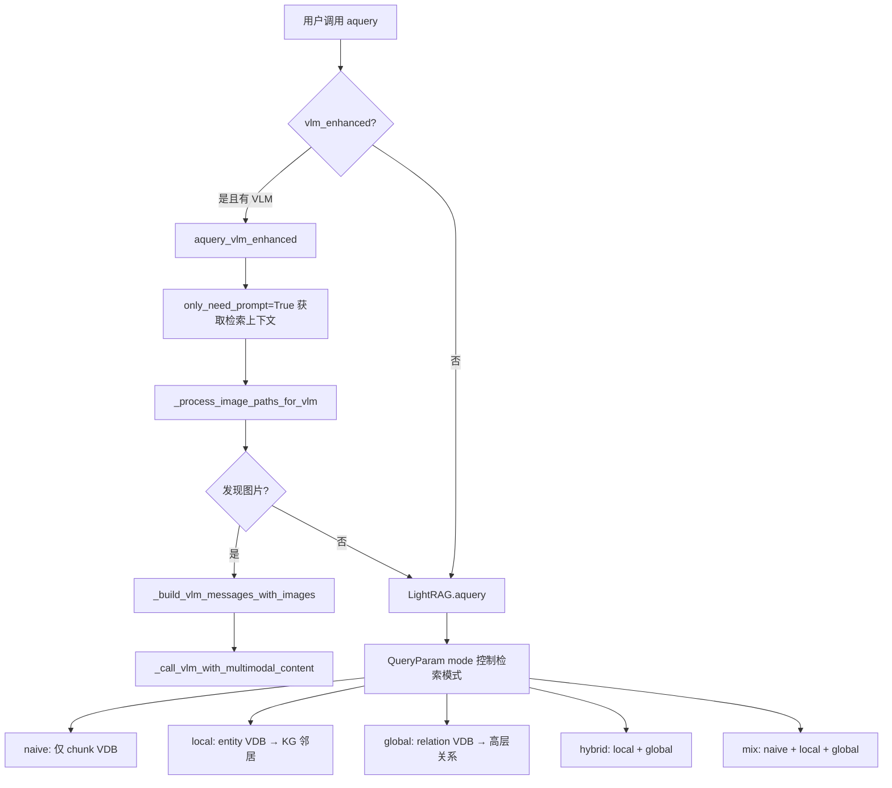
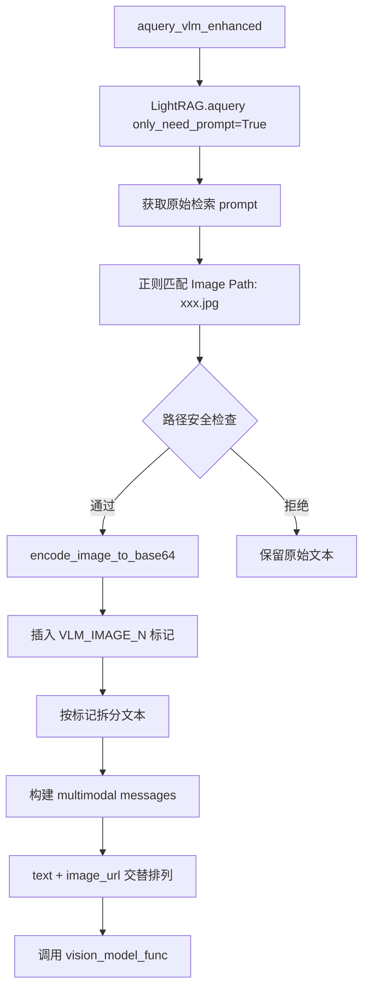
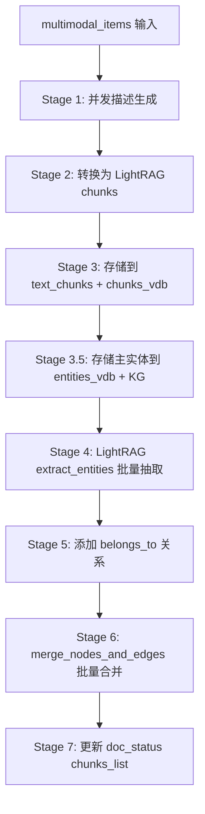

# PD-08.06 RAG-Anything — 知识图谱增强多模态三级检索

> 文档编号：PD-08.06
> 来源：RAG-Anything `raganything/query.py`, `raganything/processor.py`, `raganything/modalprocessors.py`
> GitHub：https://github.com/HKUDS/RAG-Anything.git
> 问题域：PD-08 搜索与检索 Search & Retrieval
> 状态：可复用方案

---

## 第 1 章 问题与动机

### 1.1 核心问题

传统 RAG 系统面临两个根本性限制：

1. **纯文本检索的语义天花板**：向量相似度搜索只能捕捉文本层面的语义关联，无法理解实体间的结构化关系（如"论文 A 引用了论文 B 的方法"）。当用户提出需要跨文档推理的问题时，单纯的 chunk 检索往往返回碎片化的结果。

2. **多模态内容的检索盲区**：学术论文、技术文档中大量关键信息以图表、公式形式存在。传统 RAG 要么忽略这些内容，要么仅保留 OCR 文本，丢失了视觉语义。检索时无法根据"图中展示的架构"或"表格中的实验数据"进行精确匹配。

RAG-Anything 的核心命题是：如何在保持 LightRAG 知识图谱检索能力的同时，将图像、表格、公式等多模态内容纳入统一的检索体系？

### 1.2 RAG-Anything 的解法概述

RAG-Anything 基于 LightRAG 构建，通过以下 5 个关键设计解决上述问题：

1. **三级检索索引**：实体 VDB + 关系 VDB + Chunk VDB 三个向量数据库并行检索，由 LightRAG 的 QueryParam 控制检索模式（`raganything/query.py:100-161`）
2. **多模态处理器架构**：Image/Table/Equation/Generic 四种专用处理器，每种都将非文本内容转化为结构化文本描述 + 知识图谱实体（`raganything/modalprocessors.py:360-401`）
3. **7 阶段批处理管线**：描述生成 → chunk 转换 → 存储 → 实体抽取 → belongs_to 关系 → 合并 → 状态更新（`raganything/processor.py:703-878`）
4. **VLM 增强检索**：查询时自动检测检索上下文中的图片路径，编码为 base64 发送给 VLM 进行视觉感知问答（`raganything/query.py:303-370`）
5. **上下文感知处理**：ContextExtractor 为每个多模态元素提取周围页面/chunk 的文本上下文，提升描述质量（`raganything/modalprocessors.py:49-112`）

### 1.3 设计思想

| 设计原则 | 具体实现 | 理由 | 替代方案 |
|----------|----------|------|----------|
| 知识图谱 + 向量双索引 | 实体/关系/chunk 三个 VDB + NetworkX 图存储 | 结构化关系补充语义相似度的不足 | 纯向量检索（丢失关系信息） |
| 多模态统一为文本+实体 | VLM/LLM 生成描述 → 存入 chunk VDB + 实体 VDB | 复用 LightRAG 全部检索能力 | 独立多模态索引（需要额外检索逻辑） |
| Mixin 组合模式 | QueryMixin + ProcessorMixin + BatchMixin | 关注点分离，各 Mixin 独立演进 | 单一大类（难以维护） |
| 查询时 VLM 增强 | 检索后替换图片路径为 base64 | 索引时不存图片，查询时按需加载 | 索引时存 base64（存储膨胀） |
| 渐进式 JSON 解析 | 4 策略降级：直接解析 → 清理 → 引号修复 → 正则 | LLM 输出格式不稳定，必须容错 | 严格解析（频繁失败） |

---

## 第 2 章 源码实现分析

### 2.1 架构概览

RAG-Anything 的整体架构基于 LightRAG 扩展，通过 Mixin 模式组合三大功能模块：

```
┌─────────────────────────────────────────────────────────────────┐
│                      RAGAnything (dataclass)                     │
│         QueryMixin + ProcessorMixin + BatchMixin                │
├─────────────────────────────────────────────────────────────────┤
│                                                                  │
│  ┌──────────────┐  ┌──────────────┐  ┌──────────────────────┐  │
│  │  QueryMixin   │  │ProcessorMixin│  │    BatchMixin        │  │
│  │              │  │              │  │                      │  │
│  │ aquery()     │  │ parse_doc()  │  │ process_folder()     │  │
│  │ aquery_vlm() │  │ _process_mm()│  │ batch_parse()        │  │
│  │ aquery_mm()  │  │ 7-stage pipe │  │ concurrent control   │  │
│  └──────┬───────┘  └──────┬───────┘  └──────────────────────┘  │
│         │                  │                                     │
│  ┌──────┴──────────────────┴─────────────────────────────────┐  │
│  │              Modal Processors (4 types)                    │  │
│  │  ImageModalProcessor  TableModalProcessor                  │  │
│  │  EquationModalProcessor  GenericModalProcessor             │  │
│  │         ↓ all inherit BaseModalProcessor                   │  │
│  │         ↓ share ContextExtractor                           │  │
│  └────────────────────────┬──────────────────────────────────┘  │
│                           │                                      │
│  ┌────────────────────────┴──────────────────────────────────┐  │
│  │                    LightRAG Core                           │  │
│  │  ┌─────────┐  ┌──────────┐  ┌────────────┐  ┌─────────┐ │  │
│  │  │chunk_vdb│  │entity_vdb│  │relation_vdb│  │   KG    │ │  │
│  │  └─────────┘  └──────────┘  └────────────┘  └─────────┘ │  │
│  └───────────────────────────────────────────────────────────┘  │
└─────────────────────────────────────────────────────────────────┘
```

### 2.2 核心实现

#### 2.2.1 查询路由与三级检索



对应源码 `raganything/query.py:100-161`：

```python
class QueryMixin:
    async def aquery(
        self, query: str, mode: str = "mix", system_prompt: str | None = None, **kwargs
    ) -> str:
        # Auto-determine VLM enhanced based on availability
        vlm_enhanced = kwargs.pop("vlm_enhanced", None)
        if vlm_enhanced is None:
            vlm_enhanced = (
                hasattr(self, "vision_model_func")
                and self.vision_model_func is not None
            )

        # Use VLM enhanced query if enabled and available
        if vlm_enhanced and hasattr(self, "vision_model_func") and self.vision_model_func:
            return await self.aquery_vlm_enhanced(
                query, mode=mode, system_prompt=system_prompt, **kwargs
            )

        # Create query parameters — mode 控制三级检索的组合方式
        query_param = QueryParam(mode=mode, **kwargs)
        result = await self.lightrag.aquery(query, param=query_param, system_prompt=system_prompt)
        return result
```

LightRAG 的 `QueryParam.mode` 决定了三级索引的使用方式：
- `naive`：仅搜索 chunk VDB（最简单，类似传统 RAG）
- `local`：搜索 entity VDB → 在 KG 中找邻居实体 → 收集相关 chunk
- `global`：搜索 relationship VDB → 获取高层关系描述
- `hybrid`：local + global 结果合并
- `mix`：naive + local + global 全部合并（默认模式）

#### 2.2.2 VLM 增强检索流程



对应源码 `raganything/query.py:303-370` 和 `raganything/query.py:539-656`：

```python
async def aquery_vlm_enhanced(self, query: str, mode: str = "mix", 
                               system_prompt: str | None = None,
                               extra_safe_dirs: List[str] = None, **kwargs) -> str:
    # 1. 获取原始检索 prompt（不生成最终答案）
    query_param = QueryParam(mode=mode, only_need_prompt=True, **kwargs)
    raw_prompt = await self.lightrag.aquery(query, param=query_param)

    # 2. 提取并处理图片路径
    enhanced_prompt, images_found = await self._process_image_paths_for_vlm(
        raw_prompt, extra_safe_dirs=extra_safe_dirs
    )

    if not images_found:
        # 无图片则降级为普通查询
        query_param = QueryParam(mode=mode, **kwargs)
        return await self.lightrag.aquery(query, param=query_param, system_prompt=system_prompt)

    # 3. 构建 VLM 消息格式（text + image_url 交替）
    messages = self._build_vlm_messages_with_images(enhanced_prompt, query, system_prompt)

    # 4. 调用 VLM 进行视觉感知问答
    result = await self._call_vlm_with_multimodal_content(messages)
    return result
```

安全机制值得注意（`query.py:583-620`）：VLM 增强查询会验证图片路径是否在安全目录内（working_dir / parser_output_dir / extra_safe_dirs），防止通过 prompt 注入读取任意系统文件。

#### 2.2.3 多模态 7 阶段批处理管线



对应源码 `raganything/processor.py:703-878`：

```python
async def _process_multimodal_content_batch_type_aware(
    self, multimodal_items: List[Dict[str, Any]], file_path: str, doc_id: str
):
    # Stage 1: 并发生成描述（使用 Semaphore 控制并发度）
    semaphore = asyncio.Semaphore(getattr(self.lightrag, "max_parallel_insert", 2))
    
    async def process_single_item_with_correct_processor(item, index, file_path):
        async with semaphore:
            content_type = item.get("type", "unknown")
            processor = get_processor_for_type(self.modal_processors, content_type)
            description, entity_info = await processor.generate_description_only(
                modal_content=item, content_type=content_type,
                item_info={"page_idx": item.get("page_idx", 0), "index": index, "type": content_type},
            )
            return {"description": description, "entity_info": entity_info, ...}

    tasks = [asyncio.create_task(process_single_item_with_correct_processor(item, i, file_path))
             for i, item in enumerate(multimodal_items)]
    results = await asyncio.gather(*tasks, return_exceptions=True)

    # Stage 2: 转换为 LightRAG 标准 chunk 格式
    lightrag_chunks = self._convert_to_lightrag_chunks_type_aware(multimodal_data_list, file_path, doc_id)

    # Stage 3: 存储到 text_chunks + chunks_vdb
    await self._store_chunks_to_lightrag_storage_type_aware(lightrag_chunks)

    # Stage 3.5: 存储主实体到 entities_vdb + KG 节点
    await self._store_multimodal_main_entities(multimodal_data_list, lightrag_chunks, file_path, doc_id)

    # Stage 4: 使用 LightRAG 的 extract_entities 批量抽取实体关系
    chunk_results = await self._batch_extract_entities_lightrag_style_type_aware(lightrag_chunks)

    # Stage 5: 为所有抽取的实体添加 belongs_to 关系（指向多模态主实体）
    enhanced_chunk_results = await self._batch_add_belongs_to_relations_type_aware(
        chunk_results, multimodal_data_list)

    # Stage 6: 使用 LightRAG 的 merge_nodes_and_edges 批量合并
    await self._batch_merge_lightrag_style_type_aware(enhanced_chunk_results, file_path, doc_id)

    # Stage 7: 更新 doc_status 的 chunks_list
    await self._update_doc_status_with_chunks_type_aware(doc_id, list(lightrag_chunks.keys()))
```

### 2.3 实现细节

**多模态内容如何进入检索体系：**

每个多模态元素（图片/表格/公式）经过处理后产生三种可检索数据：

1. **Chunk**：格式化的文本描述（含原始元数据 + LLM 增强描述），存入 `text_chunks` + `chunks_vdb`
2. **主实体**：如 "Figure 3: Architecture Diagram (image)"，存入 `entities_vdb` + KG 节点
3. **关系**：LLM 从描述中抽取的实体间关系 + 自动添加的 `belongs_to` 关系，存入 `relationships_vdb` + KG 边

这意味着用户查询 "架构图" 时，可以通过三条路径命中：
- naive 模式：chunk VDB 语义匹配描述文本
- local 模式：entity VDB 匹配 "Architecture Diagram" 实体 → KG 找到关联实体
- global 模式：relationship VDB 匹配 "belongs_to" 等关系

**上下文感知处理（ContextExtractor）：**

`ContextExtractor`（`modalprocessors.py:49-112`）在处理每个多模态元素时，提取其周围页面/chunk 的文本内容作为上下文，传入 LLM prompt。这解决了"孤立图片无法理解"的问题——比如一张没有标题的实验结果图，通过上下文可以知道它属于哪个实验。

**多模态查询缓存：**

`_generate_multimodal_cache_key`（`query.py:25-98`）对查询参数做 MD5 哈希，文件路径只取 basename（提高可移植性），大内容（>200 字符的表格）也做 MD5 压缩。缓存存储在 LightRAG 的 `llm_response_cache` 中。

**鲁棒 JSON 解析（4 策略降级）：**

`_robust_json_parse`（`modalprocessors.py:547-571`）处理 LLM 输出的不稳定 JSON：
1. 直接解析所有 JSON 候选（代码块内、花括号匹配、简单正则）
2. 基础清理（智能引号替换、尾逗号移除）
3. 渐进式引号修复（转义反斜杠、修复字符串内容）
4. 正则字段提取（最后手段，逐字段提取 entity_name/entity_type/summary）


---

## 第 3 章 迁移指南

### 3.1 迁移清单

**阶段 1：基础 KG+向量双索引检索（1-2 天）**
- [ ] 安装 LightRAG 作为底层引擎
- [ ] 配置三个向量数据库（chunk/entity/relationship）
- [ ] 实现 QueryParam 多模式查询路由
- [ ] 验证 naive/local/global/hybrid/mix 五种模式

**阶段 2：多模态处理器接入（2-3 天）**
- [ ] 实现 BaseModalProcessor 基类（含 ContextExtractor）
- [ ] 实现 ImageModalProcessor（需要 VLM 函数）
- [ ] 实现 TableModalProcessor + EquationModalProcessor
- [ ] 实现 GenericModalProcessor 作为兜底
- [ ] 实现 `get_processor_for_type` 路由函数

**阶段 3：7 阶段批处理管线（1-2 天）**
- [ ] 实现并发描述生成（Semaphore 控制）
- [ ] 实现 chunk 模板格式化（image_chunk/table_chunk/equation_chunk）
- [ ] 实现 belongs_to 关系自动添加
- [ ] 实现 doc_status 跟踪（text_processed + multimodal_processed）

**阶段 4：VLM 增强查询（1 天）**
- [ ] 实现图片路径正则提取
- [ ] 实现安全目录校验
- [ ] 实现 VLM_IMAGE_N 标记替换 + base64 编码
- [ ] 实现 multimodal messages 构建

### 3.2 适配代码模板

以下是一个最小可运行的多模态 RAG 检索系统模板：

```python
"""最小多模态 RAG 检索系统 — 基于 RAG-Anything 架构"""
import asyncio
import re
import base64
import json
import hashlib
from dataclasses import dataclass, field
from typing import Dict, List, Any, Tuple, Optional, Callable
from pathlib import Path

# --- 1. 三级索引存储抽象 ---

@dataclass
class TripleIndexStore:
    """三级索引：chunk VDB + entity VDB + relationship VDB"""
    chunk_vdb: Any  # 向量数据库实例（如 Qdrant/Milvus/FAISS）
    entity_vdb: Any
    relationship_vdb: Any
    knowledge_graph: Any  # 图数据库实例（如 NetworkX/Neo4j）
    
    async def search_chunks(self, query_embedding, top_k=5) -> List[Dict]:
        """naive 模式：直接搜索 chunk"""
        return await self.chunk_vdb.search(query_embedding, top_k=top_k)
    
    async def search_local(self, query_embedding, top_k=5) -> List[Dict]:
        """local 模式：entity VDB → KG 邻居 → 收集 chunk"""
        entities = await self.entity_vdb.search(query_embedding, top_k=top_k)
        related_chunks = []
        for entity in entities:
            neighbors = self.knowledge_graph.get_neighbors(entity["entity_name"])
            for neighbor in neighbors:
                chunks = await self.chunk_vdb.get_by_entity(neighbor)
                related_chunks.extend(chunks)
        return related_chunks
    
    async def search_global(self, query_embedding, top_k=5) -> List[Dict]:
        """global 模式：relationship VDB → 高层关系"""
        return await self.relationship_vdb.search(query_embedding, top_k=top_k)
    
    async def search_mix(self, query_embedding, top_k=5) -> List[Dict]:
        """mix 模式：三级索引全部搜索并合并"""
        chunks = await self.search_chunks(query_embedding, top_k)
        local = await self.search_local(query_embedding, top_k)
        global_ = await self.search_global(query_embedding, top_k)
        return self._deduplicate_and_merge(chunks + local + global_)

# --- 2. 多模态处理器 ---

class BaseModalProcessor:
    """多模态处理器基类"""
    def __init__(self, llm_func: Callable, embedding_func: Callable):
        self.llm_func = llm_func
        self.embedding_func = embedding_func
    
    async def process(self, content: Dict, context: str = "") -> Tuple[str, Dict]:
        """处理多模态内容，返回 (描述文本, 实体信息)"""
        raise NotImplementedError

    async def store_to_triple_index(self, description: str, entity_info: Dict,
                                     store: TripleIndexStore, doc_id: str):
        """将处理结果存入三级索引"""
        chunk_id = hashlib.md5(description.encode()).hexdigest()
        # 1. 存入 chunk VDB
        embedding = await self.embedding_func(description)
        await store.chunk_vdb.upsert(chunk_id, description, embedding, doc_id=doc_id)
        # 2. 存入 entity VDB + KG 节点
        entity_embedding = await self.embedding_func(
            f"{entity_info['name']}\n{entity_info['summary']}")
        await store.entity_vdb.upsert(entity_info["name"], entity_embedding)
        await store.knowledge_graph.add_node(entity_info["name"], entity_info)
        # 3. 添加 belongs_to 关系
        # （LLM 抽取的其他实体会自动关联到此主实体）

class ImageProcessor(BaseModalProcessor):
    def __init__(self, vlm_func: Callable, **kwargs):
        super().__init__(**kwargs)
        self.vlm_func = vlm_func
    
    async def process(self, content: Dict, context: str = "") -> Tuple[str, Dict]:
        image_base64 = base64.b64encode(open(content["img_path"], "rb").read()).decode()
        prompt = f"Analyze this image. Context: {context}" if context else "Analyze this image."
        description = await self.vlm_func(prompt, image_data=image_base64)
        entity_info = {"name": f"Image: {Path(content['img_path']).stem}",
                       "type": "image", "summary": description[:200]}
        return description, entity_info

# --- 3. VLM 增强查询 ---

async def vlm_enhanced_query(query: str, raw_context: str, vlm_func: Callable,
                              safe_dirs: List[str]) -> str:
    """检索后 VLM 增强：将上下文中的图片路径替换为 base64 图片"""
    pattern = r"Image Path:\s*([^\r\n]*?\.(?:jpg|jpeg|png|gif|bmp|webp))"
    images_base64 = []
    
    def replace_path(match):
        path = match.group(1).strip()
        abs_path = Path(path).resolve()
        # 安全检查：只允许安全目录内的图片
        if not any(abs_path.is_relative_to(Path(d).resolve()) for d in safe_dirs):
            return match.group(0)
        try:
            img_b64 = base64.b64encode(open(path, "rb").read()).decode()
            images_base64.append(img_b64)
            return f"Image Path: {path}\n[VLM_IMAGE_{len(images_base64)}]"
        except Exception:
            return match.group(0)
    
    enhanced = re.sub(pattern, replace_path, raw_context)
    if not images_base64:
        return None  # 无图片，降级为普通查询
    
    # 构建 multimodal messages
    messages = [{"role": "system", "content": "Answer based on context and images."}]
    content_parts = []
    parts = enhanced.split("[VLM_IMAGE_")
    for i, part in enumerate(parts):
        if i == 0:
            content_parts.append({"type": "text", "text": part})
        else:
            m = re.match(r"(\d+)\](.*)", part, re.DOTALL)
            if m:
                idx = int(m.group(1)) - 1
                if 0 <= idx < len(images_base64):
                    content_parts.append({"type": "image_url",
                        "image_url": {"url": f"data:image/jpeg;base64,{images_base64[idx]}"}})
                content_parts.append({"type": "text", "text": m.group(2)})
    content_parts.append({"type": "text", "text": f"\n\nQuestion: {query}"})
    messages.append({"role": "user", "content": content_parts})
    return await vlm_func("", messages=messages)
```

### 3.3 适用场景

| 场景 | 适用度 | 说明 |
|------|--------|------|
| 学术论文 RAG | ⭐⭐⭐ | 图表公式密集，KG 捕捉引用关系 |
| 技术文档问答 | ⭐⭐⭐ | 架构图、配置表需要多模态理解 |
| 企业知识库 | ⭐⭐ | 需要评估 VLM 调用成本 |
| 实时搜索引擎 | ⭐ | 索引构建较重，不适合实时场景 |
| 纯文本 RAG | ⭐⭐ | 可以只用 LightRAG 的 KG 检索，不启用多模态 |

---

## 第 4 章 测试用例

```python
"""RAG-Anything 检索架构核心功能测试"""
import pytest
import asyncio
import json
import hashlib
from unittest.mock import AsyncMock, MagicMock, patch
from typing import Dict, List, Any


class TestQueryMixin:
    """测试查询路由逻辑"""

    @pytest.fixture
    def query_mixin(self):
        """创建 QueryMixin 测试实例"""
        mixin = MagicMock()
        mixin.lightrag = MagicMock()
        mixin.lightrag.aquery = AsyncMock(return_value="test result")
        mixin.vision_model_func = AsyncMock(return_value="vlm result")
        mixin.logger = MagicMock()
        mixin.modal_processors = {"image": MagicMock(), "table": MagicMock()}
        return mixin

    @pytest.mark.asyncio
    async def test_aquery_auto_vlm_detection(self, query_mixin):
        """测试：有 vision_model_func 时自动启用 VLM 增强"""
        from raganything.query import QueryMixin
        # vlm_enhanced=None 时应自动检测
        assert hasattr(query_mixin, "vision_model_func")
        assert query_mixin.vision_model_func is not None

    @pytest.mark.asyncio
    async def test_aquery_fallback_without_vlm(self, query_mixin):
        """测试：无 VLM 时降级为普通查询"""
        query_mixin.vision_model_func = None
        # 应该调用 lightrag.aquery 而非 vlm_enhanced
        await query_mixin.lightrag.aquery("test query")
        query_mixin.lightrag.aquery.assert_called_once()

    def test_multimodal_cache_key_stability(self):
        """测试：相同输入产生相同缓存 key"""
        from raganything.query import QueryMixin
        mixin = QueryMixin()
        # 模拟 cache key 生成逻辑
        cache_data = {"query": "test", "mode": "mix",
                      "multimodal_content": [{"type": "image", "img_path": "test.jpg"}]}
        key1 = hashlib.md5(json.dumps(cache_data, sort_keys=True).encode()).hexdigest()
        key2 = hashlib.md5(json.dumps(cache_data, sort_keys=True).encode()).hexdigest()
        assert key1 == key2

    def test_multimodal_cache_key_portability(self):
        """测试：不同绝对路径但相同文件名产生相同 key"""
        from pathlib import Path
        # cache key 只取 basename
        path1 = Path("/home/user/docs/image.jpg").name
        path2 = Path("/tmp/output/image.jpg").name
        assert path1 == path2


class TestModalProcessors:
    """测试多模态处理器"""

    def test_robust_json_parse_direct(self):
        """测试：正常 JSON 直接解析"""
        from raganything.modalprocessors import BaseModalProcessor
        processor = MagicMock(spec=BaseModalProcessor)
        processor._robust_json_parse = BaseModalProcessor._robust_json_parse.__get__(processor)
        processor._extract_all_json_candidates = BaseModalProcessor._extract_all_json_candidates.__get__(processor)
        processor._try_parse_json = BaseModalProcessor._try_parse_json.__get__(processor)
        processor._basic_json_cleanup = BaseModalProcessor._basic_json_cleanup.__get__(processor)
        processor._progressive_quote_fix = BaseModalProcessor._progressive_quote_fix.__get__(processor)
        processor._extract_fields_with_regex = BaseModalProcessor._extract_fields_with_regex.__get__(processor)

        valid_json = '{"detailed_description": "test", "entity_info": {"entity_name": "fig1", "entity_type": "image", "summary": "test"}}'
        result = processor._robust_json_parse(valid_json)
        assert result["detailed_description"] == "test"
        assert result["entity_info"]["entity_name"] == "fig1"

    def test_robust_json_parse_with_thinking_tags(self):
        """测试：包含 <think> 标签的 LLM 输出"""
        from raganything.modalprocessors import BaseModalProcessor
        processor = MagicMock(spec=BaseModalProcessor)
        processor._extract_all_json_candidates = BaseModalProcessor._extract_all_json_candidates.__get__(processor)
        
        response = '<think>Let me analyze...</think>{"detailed_description": "ok", "entity_info": {"entity_name": "t1", "entity_type": "table", "summary": "s"}}'
        candidates = processor._extract_all_json_candidates(response)
        assert len(candidates) > 0

    def test_robust_json_parse_regex_fallback(self):
        """测试：完全无效 JSON 时的正则兜底"""
        from raganything.modalprocessors import BaseModalProcessor
        processor = MagicMock(spec=BaseModalProcessor)
        processor._extract_fields_with_regex = BaseModalProcessor._extract_fields_with_regex.__get__(processor)

        broken = 'detailed_description: "some desc", entity_name: "fig1"'
        result = processor._extract_fields_with_regex(broken)
        assert "entity_info" in result


class TestContextExtractor:
    """测试上下文提取器"""

    def test_page_context_window(self):
        """测试：页面级上下文窗口"""
        from raganything.modalprocessors import ContextExtractor, ContextConfig
        config = ContextConfig(context_window=1, context_mode="page")
        extractor = ContextExtractor(config=config)

        content_list = [
            {"type": "text", "text": "Page 0 content", "page_idx": 0},
            {"type": "image", "page_idx": 1},
            {"type": "text", "text": "Page 1 content", "page_idx": 1},
            {"type": "text", "text": "Page 2 content", "page_idx": 2},
            {"type": "text", "text": "Page 3 content", "page_idx": 3},
        ]

        context = extractor.extract_context(
            content_list, {"page_idx": 1}, content_format="minerU"
        )
        assert "Page 0 content" in context
        assert "Page 2 content" in context
        assert "Page 3 content" not in context  # 超出窗口

    def test_context_truncation(self):
        """测试：上下文截断到 max_context_tokens"""
        from raganything.modalprocessors import ContextExtractor, ContextConfig
        config = ContextConfig(max_context_tokens=50)
        extractor = ContextExtractor(config=config)

        long_text = "A" * 200
        result = extractor._truncate_context(long_text)
        assert len(result) <= 53  # 50 + "..."


class TestVLMEnhancedQuery:
    """测试 VLM 增强查询"""

    def test_image_path_regex_extraction(self):
        """测试：从检索上下文中提取图片路径"""
        import re
        pattern = r"Image Path:\s*([^\r\n]*?\.(?:jpg|jpeg|png|gif|bmp|webp|tiff|tif))"
        prompt = "Some text\nImage Path: /tmp/output/fig1.png\nMore text\nImage Path: /tmp/output/fig2.jpg"
        matches = re.findall(pattern, prompt)
        assert len(matches) == 2
        assert matches[0] == "/tmp/output/fig1.png"
        assert matches[1] == "/tmp/output/fig2.jpg"

    def test_vlm_message_building(self):
        """测试：VLM 消息格式构建"""
        enhanced = "Context text [VLM_IMAGE_1] more text [VLM_IMAGE_2] end"
        parts = enhanced.split("[VLM_IMAGE_")
        assert len(parts) == 3
        assert parts[0] == "Context text "
        assert parts[1].startswith("1]")
        assert parts[2].startswith("2]")
```


---

## 第 5 章 跨域关联

| 关联域 | 关系类型 | 说明 |
|--------|----------|------|
| PD-01 上下文管理 | 协同 | ContextExtractor 的 `max_context_tokens` 和页面窗口机制直接管理多模态处理时的上下文预算 |
| PD-03 容错与重试 | 依赖 | `_robust_json_parse` 的 4 策略降级是 LLM 输出容错的典型实现；`_process_multimodal_content` 有 batch→individual 的降级路径 |
| PD-04 工具系统 | 协同 | 多模态处理器架构（BaseModalProcessor + 4 子类）本质是一个工具注册表模式，`get_processor_for_type` 是路由函数 |
| PD-06 记忆持久化 | 依赖 | 解析缓存（parse_cache）、查询缓存（llm_response_cache）、doc_status 跟踪都依赖 LightRAG 的 KV 存储 |
| PD-07 质量检查 | 协同 | `_parse_response` 中对 LLM 输出的字段完整性校验（entity_name/entity_type/summary 必须存在）是质量门控 |
| PD-11 可观测性 | 协同 | 7 阶段管线中每个阶段都有 logger.info 进度日志，批处理有百分比进度报告 |

---

## 第 6 章 来源文件索引

| 文件 | 行范围 | 关键实现 |
|------|--------|----------|
| `raganything/query.py` | L22-98 | QueryMixin 类定义 + 多模态缓存 key 生成 |
| `raganything/query.py` | L100-161 | `aquery()` 查询路由：VLM 自动检测 + QueryParam 模式分发 |
| `raganything/query.py` | L163-301 | `aquery_with_multimodal()` 多模态查询 + 缓存读写 |
| `raganything/query.py` | L303-370 | `aquery_vlm_enhanced()` VLM 增强查询主流程 |
| `raganything/query.py` | L539-656 | `_process_image_paths_for_vlm()` 图片路径提取 + 安全校验 + base64 编码 |
| `raganything/query.py` | L658-740 | `_build_vlm_messages_with_images()` VLM 消息格式构建 |
| `raganything/processor.py` | L26-453 | ProcessorMixin：文档解析 + 缓存 + 内容分离 |
| `raganything/processor.py` | L455-546 | `_process_multimodal_content()` 多模态处理入口 + batch/individual 降级 |
| `raganything/processor.py` | L703-878 | 7 阶段批处理管线核心实现 |
| `raganything/processor.py` | L880-926 | `_convert_to_lightrag_chunks_type_aware()` chunk 格式转换 |
| `raganything/processor.py` | L1020-1112 | `_store_multimodal_main_entities()` 主实体存储到 KG + VDB |
| `raganything/processor.py` | L1202-1264 | `_batch_add_belongs_to_relations_type_aware()` belongs_to 关系添加 |
| `raganything/modalprocessors.py` | L33-46 | ContextConfig 数据类 |
| `raganything/modalprocessors.py` | L49-357 | ContextExtractor：页面/chunk 级上下文提取 + 截断 |
| `raganything/modalprocessors.py` | L360-793 | BaseModalProcessor：实体创建 + chunk 存储 + 鲁棒 JSON 解析 |
| `raganything/modalprocessors.py` | L796-1030 | ImageModalProcessor：VLM 图像分析 + base64 编码 |
| `raganything/modalprocessors.py` | L1032-1223 | TableModalProcessor：表格结构分析 |
| `raganything/modalprocessors.py` | L1226-1407 | EquationModalProcessor：公式语义分析 |
| `raganything/raganything.py` | L49-50 | RAGAnything 类定义：Mixin 组合模式 |
| `raganything/raganything.py` | L177-219 | `_initialize_processors()` 处理器初始化 + 上下文提取器创建 |
| `raganything/config.py` | L13-153 | RAGAnythingConfig：全配置项 + 环境变量支持 |
| `raganything/utils.py` | L13-56 | `separate_content()` 文本/多模态内容分离 |
| `raganything/utils.py` | L228-248 | `get_processor_for_type()` 处理器路由 |
| `raganything/base.py` | L4-12 | DocStatus 枚举：6 态文档生命周期 |

---

## 第 7 章 横向对比维度

```json comparison_data
{
  "project": "RAG-Anything",
  "dimensions": {
    "搜索架构": "LightRAG 三级索引：chunk VDB + entity VDB + relationship VDB + KG 图遍历",
    "去重机制": "MD5 哈希 chunk_id 天然去重，查询缓存用 MD5(query+mode+content) 做 key",
    "结果处理": "QueryParam.mode 控制 naive/local/global/hybrid/mix 五种结果合并策略",
    "容错策略": "4 策略 JSON 降级解析 + batch→individual 处理降级 + VLM→普通查询降级",
    "成本控制": "多模态查询缓存复用 + VLM 按需调用（仅检索到图片时触发）",
    "检索方式": "mix 模式同时搜索三级索引，local 模式通过 KG 邻居扩展检索范围",
    "索引结构": "知识图谱（实体+关系）+ 三个独立向量数据库 + text_chunks KV 存储",
    "多模态支持": "4 类专用处理器（Image/Table/Equation/Generic）+ VLM 增强查询",
    "解析容错": "4 策略渐进式 JSON 解析：直接→清理→引号修复→正则字段提取",
    "缓存机制": "解析缓存（parse_cache）+ LLM 响应缓存 + 多模态查询缓存，三层独立",
    "扩展性": "Mixin 组合模式 + BaseModalProcessor 继承体系，新模态只需加子类",
    "专家知识集成": "ContextExtractor 注入周围页面文本作为 LLM 分析上下文"
  }
}
```

### 域元数据补充

```json domain_metadata
{
  "solution_summary": "RAG-Anything 基于 LightRAG 构建 chunk/entity/relationship 三级向量索引 + 知识图谱，通过 4 类多模态处理器将图表公式转化为可检索实体，查询时 VLM 按需增强实现视觉感知问答",
  "description": "多模态内容如何统一纳入知识图谱检索体系，实现跨模态语义关联",
  "sub_problems": [
    "多模态实体归属：图表公式抽取的子实体如何通过 belongs_to 关系关联到主实体",
    "查询时视觉增强：检索上下文中的图片路径如何安全地转换为 VLM 可处理的 base64 格式",
    "多模态处理状态跟踪：文本处理和多模态处理异步完成时如何准确标记文档完整处理状态"
  ],
  "best_practices": [
    "多模态内容统一为文本描述+KG实体后复用全部文本检索能力，避免独立多模态索引的复杂度",
    "VLM 查询时按需加载图片（only_need_prompt 先获取上下文再编码），索引时不存 base64 避免存储膨胀",
    "图片路径安全校验（safe_dirs 白名单 + symlink 拒绝）防止 prompt 注入读取任意文件"
  ]
}
```

