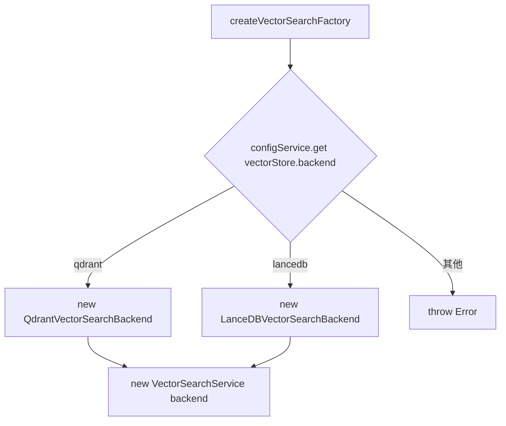
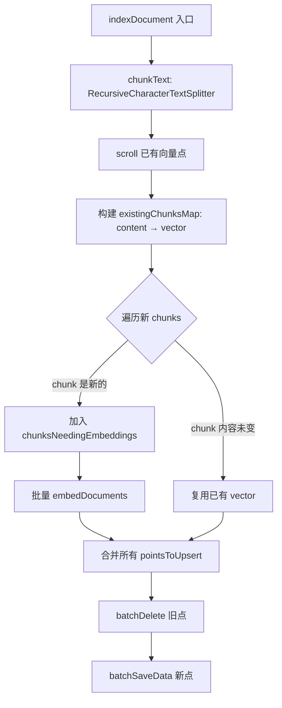
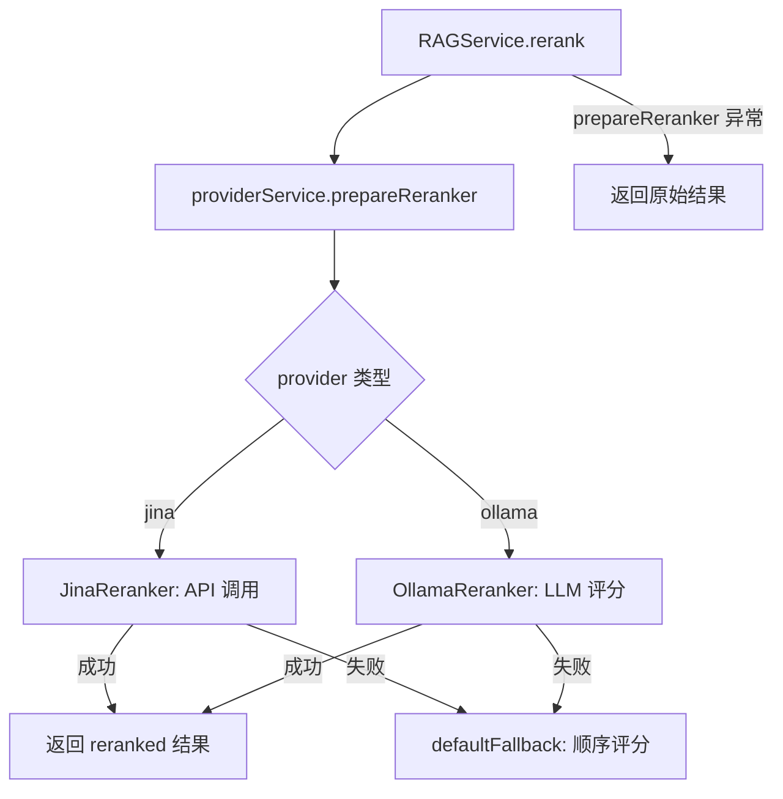

# PD-08.14 Refly — 多后端 RAG 管线与双引擎全文检索

> 文档编号：PD-08.14
> 来源：Refly `apps/api/src/modules/rag/rag.service.ts`
> GitHub：https://github.com/refly-ai/refly.git
> 问题域：PD-08 搜索与检索 Search & Retrieval
> 状态：可复用方案

---

## 第 1 章 问题与动机（≥ 30 行）

### 1.1 核心问题

知识管理平台需要同时支持语义搜索（向量检索）和关键词搜索（全文检索），且底层存储引擎不能绑死——不同部署环境（本地开发、云端生产、边缘部署）对向量数据库和全文搜索引擎的选择截然不同。此外，多租户场景下每个用户的数据必须严格隔离，嵌入模型和重排序模型也需要按用户配置动态切换。

Refly 面临的具体挑战：
1. 向量存储需要同时支持 Qdrant（生产级）和 LanceDB（轻量本地），通过配置切换
2. 全文搜索需要同时支持 Elasticsearch（生产级）和 Prisma（零依赖降级）
3. 嵌入模型需要支持 OpenAI/Fireworks/Jina/Ollama 四种后端，且所有嵌入调用自动接入 Langfuse 监控
4. 重排序需要支持 Jina API 和 Ollama LLM 两种方式，失败时自动降级到顺序评分
5. 文档更新时需要增量嵌入——只对变更的 chunk 重新计算向量，复用未变 chunk 的已有向量

### 1.2 Refly 的解法概述

1. **VectorSearchBackend 接口抽象**：定义统一的 8 方法接口（`interface.ts:119-174`），Qdrant 和 LanceDB 各自实现，通过工厂函数按配置选择后端
2. **双层过滤器转换**：`filter-utils.ts` 实现 Qdrant 结构化过滤 ↔ LanceDB SQL 字符串的双向转换，上层代码无需关心底层引擎差异
3. **增量嵌入索引**：`indexDocument()` 方法（`rag.service.ts:155-252`）先 scroll 已有向量，对比 chunk 内容，仅对新增/变更 chunk 计算嵌入
4. **三层 Reranker 降级链**：Jina API → Ollama LLM → FallbackReranker（顺序评分），每层失败自动降级
5. **Avro 序列化导出**：向量点可序列化为 Avro 二进制格式，支持跨用户/跨实例的文档复制

### 1.3 设计思想

| 设计原则 | 具体实现 | 理由 | 替代方案 |
|----------|----------|------|----------|
| 后端可插拔 | VectorSearchBackend 接口 + 工厂函数 | 不同部署环境需要不同向量引擎 | 直接依赖单一引擎 |
| 过滤器归一化 | filter-utils 双向转换 | Qdrant 用结构化 JSON，LanceDB 用 SQL，需统一 | 每个后端写独立过滤逻辑 |
| 增量嵌入 | chunk 内容比对复用已有向量 | 文档编辑频繁，全量重算浪费 API 调用 | 每次全量重建 |
| 多租户隔离 | tenantId 过滤 + payload 索引 | SaaS 场景数据隔离是硬性要求 | 每用户独立 collection |
| 嵌入监控 | Langfuse wrapper 自动包装 | 嵌入调用是主要成本来源，需追踪 | 手动埋点 |

---

## 第 2 章 源码实现分析（≥ 60 行，核心章节）

### 2.1 架构概览

Refly 的 RAG 管线分为四层：Provider 层（嵌入/重排序模型）、存储层（向量/全文双引擎）、服务层（RAG Service）、API 层（Search Service）。

```
┌─────────────────────────────────────────────────────────────┐
│                    Search Service (API 层)                    │
│  keyword / vector / hybrid 模式路由                           │
│  多域搜索: resource / document / canvas                       │
│  可选 reranker 后处理                                         │
├──────────────────────┬──────────────────────────────────────┤
│   RAG Service        │   Fulltext Search Service             │
│   ┌──────────────┐   │   ┌──────────────────────────────┐   │
│   │ chunk (1000) │   │   │ Elasticsearch (multi_match)  │   │
│   │ embed        │   │   │ Prisma (LIKE/contains)       │   │
│   │ index        │   │   └──────────────────────────────┘   │
│   │ retrieve     │   │                                      │
│   │ rerank       │   │                                      │
│   └──────────────┘   │                                      │
├──────────────────────┴──────────────────────────────────────┤
│              Vector Search Backend (接口层)                    │
│   ┌─────────────────┐    ┌─────────────────────┐            │
│   │ Qdrant Backend  │    │  LanceDB Backend    │            │
│   │ HNSW + Cosine   │    │  本地文件 + L2→sim  │            │
│   └─────────────────┘    └─────────────────────┘            │
├─────────────────────────────────────────────────────────────┤
│              Provider 层 (嵌入 + 重排序)                      │
│   Embeddings: OpenAI / Fireworks / Jina / Ollama            │
│   Reranker:   Jina API / Ollama LLM / Fallback              │
│   监控: Langfuse wrapper 自动包装所有嵌入调用                  │
└─────────────────────────────────────────────────────────────┘
```

### 2.2 核心实现

#### 2.2.1 向量后端工厂与接口



对应源码 `apps/api/src/modules/common/vector-search/index.ts:99-116`：

```typescript
export const createVectorSearchFactory = () => {
  return (configService: ConfigService) => {
    const backendType = configService.get('vectorStore.backend', 'qdrant');

    let backend: VectorSearchBackend;
    if (backendType === 'qdrant') {
      backend = new QdrantVectorSearchBackend(configService);
    } else if (backendType === 'lancedb') {
      backend = new LanceDBVectorSearchBackend(configService);
    } else {
      throw new Error(
        `Unknown vector search backend type: ${backendType}. Supported backends: qdrant, lancedb`,
      );
    }

    return new VectorSearchService(backend);
  };
};
```

VectorSearchBackend 接口定义了 8 个方法（`backend/interface.ts:119-174`）：`initialize`、`isCollectionEmpty`、`batchSaveData`、`batchDelete`、`search`、`scroll`、`updatePayload`、`estimatePointsSize`。

#### 2.2.2 增量嵌入索引



对应源码 `apps/api/src/modules/rag/rag.service.ts:155-252`：

```typescript
async indexDocument(user: User, doc: Document<DocumentPayload>): Promise<{ size: number }> {
  const { uid } = user;
  const { pageContent, metadata } = doc;
  const { nodeType, docId, resourceId } = metadata;
  const entityId = nodeType === 'document' ? docId : resourceId;

  // Get new chunks
  const newChunks = await this.chunkText(pageContent);

  // Get existing points for this document using scroll
  const existingPoints = await this.vectorSearch.scroll({
    filter: {
      must: [
        { key: 'tenantId', match: { value: uid } },
        { key: nodeType === 'document' ? 'docId' : 'resourceId', match: { value: entityId } },
      ],
    },
    with_payload: true,
    with_vector: true,
  });

  // Create a map of existing chunks for quick lookup
  const existingChunksMap = new Map(
    existingPoints.map((point) => [
      point.payload.content,
      { id: point.id, vector: point.vector as number[] },
    ]),
  );

  const pointsToUpsert: VectorPoint[] = [];
  const chunksNeedingEmbeddings: string[] = [];
  const chunkIndices: number[] = [];

  for (let i = 0; i < newChunks.length; i++) {
    const chunk = newChunks[i];
    const existing = existingChunksMap.get(chunk);
    if (existing) {
      // Reuse existing embedding for identical chunks
      pointsToUpsert.push({
        id: genResourceUuid(`${entityId}-${i}`),
        vector: existing.vector,
        payload: { ...metadata, seq: i, content: chunk, tenantId: uid },
      });
    } else {
      chunksNeedingEmbeddings.push(chunk);
      chunkIndices.push(i);
    }
  }

  // Compute embeddings only for new or modified chunks
  if (chunksNeedingEmbeddings.length > 0) {
    const embeddings = await this.providerService.prepareEmbeddings(user);
    const vectors = await embeddings.embedDocuments(chunksNeedingEmbeddings);
    chunkIndices.forEach((originalIndex, embeddingIndex) => {
      pointsToUpsert.push({
        id: genResourceUuid(`${entityId}-${originalIndex}`),
        vector: vectors[embeddingIndex],
        payload: { ...metadata, seq: originalIndex, content: chunksNeedingEmbeddings[embeddingIndex], tenantId: uid },
      });
    });
  }

  // Delete-then-insert pattern
  if (existingPoints.length > 0) {
    await this.vectorSearch.batchDelete({ must: [
      { key: 'tenantId', match: { value: uid } },
      { key: nodeType === 'document' ? 'docId' : 'resourceId', match: { value: entityId } },
    ]});
  }
  if (pointsToUpsert.length > 0) {
    await this.vectorSearch.batchSaveData(pointsToUpsert);
  }
  return { size: this.vectorSearch.estimatePointsSize(pointsToUpsert) };
}
```

#### 2.2.3 三层 Reranker 降级链



对应源码 `packages/providers/src/reranker/jina.ts:28-88`：

```typescript
async rerank(query: string, results: SearchResult[], options?: { topN?: number; relevanceThreshold?: number }) {
  const contentMap = new Map<string, SearchResult>();
  for (const r of results) {
    contentMap.set(r.snippets.map((s) => s.text).join('\n\n'), r);
  }

  try {
    const res = await fetch(this.apiEndpoint, {
      method: 'post',
      headers: { Authorization: `Bearer ${this.config.apiKey}`, 'Content-Type': 'application/json' },
      body: JSON.stringify({ query, model, top_n: topN, documents: Array.from(contentMap.keys()) }),
    });
    const data: JinaRerankerResponse = await res.json();
    return data.results
      .filter((r) => r.relevance_score >= relevanceThreshold)
      .map((r) => ({ ...contentMap.get(r.document.text), relevanceScore: r.relevance_score }));
  } catch (e) {
    return this.defaultFallback(results); // 降级到顺序评分
  }
}
```

### 2.3 实现细节

**Qdrant 后端的 Collection 自动创建**（`backend/qdrant.ts:80-104`）：首次写入时根据向量维度自动创建 collection，配置 Cosine 距离、HNSW 索引（`payload_m: 16, m: 0`）、磁盘存储（`on_disk: true`），并创建 `tenantId` 的 keyword 索引。

**LanceDB 后端的距离转相似度**（`backend/lancedb.ts:167`）：LanceDB 返回 `_distance`（越小越相似），通过 `1 - distance` 转换为与 Qdrant 一致的相似度分数。

**Jina Embeddings 的长文本处理**（`packages/providers/src/embeddings/jina.ts:130-156`）：超过 2048 字符的文档按句子边界分块，每块独立嵌入后取平均向量。支持中英文标点（`。！？`）。

**Avro 序列化**（`rag.service.ts:412-479`）：向量点序列化为 Avro 二进制格式，schema 包含 id/vector/payload/metadata 四字段，用于跨用户文档复制和数据导出。

**过滤器双向转换**（`filter-utils.ts:64-107`）：`toQdrantFilter()` 和 `toLanceDBFilter()` 实现 Qdrant 结构化过滤 ↔ SQL 字符串的双向转换，支持 match/range/IN/NOT IN/IS NULL/text LIKE 等条件。


---

## 第 3 章 迁移指南（≥ 40 行）

### 3.1 迁移清单

**阶段 1：向量后端抽象层**
- [ ] 定义 `VectorSearchBackend` 接口（8 方法：initialize/batchSaveData/batchDelete/search/scroll/updatePayload/estimatePointsSize/isCollectionEmpty）
- [ ] 实现 Qdrant 后端（推荐首选）
- [ ] 实现过滤器类型系统（QdrantFilter/LanceDBFilter/SimpleFilter 联合类型）
- [ ] 实现工厂函数，通过配置选择后端

**阶段 2：RAG 核心服务**
- [ ] 集成 RecursiveCharacterTextSplitter（Markdown 模式，chunkSize=1000）
- [ ] 实现增量嵌入索引（scroll 已有 → 比对 → 仅嵌入变更 chunk）
- [ ] 实现 retrieve 方法（嵌入查询 → 向量搜索 → tenantId 过滤）
- [ ] 集成 reranker（Jina/Ollama + fallback 降级链）

**阶段 3：全文搜索层**
- [ ] 定义 FulltextSearchBackend 接口
- [ ] 实现 Elasticsearch 后端（multi_match + highlight）
- [ ] 实现 Prisma 降级后端（contains 查询）

**阶段 4：搜索 API 层**
- [ ] 实现 SearchService，路由 keyword/vector/hybrid 模式
- [ ] 集成 Web 搜索（Serper/SearXNG）
- [ ] 实现多语言搜索 + rerank 后处理

### 3.2 适配代码模板

向量后端接口与工厂函数（可直接复用）：

```typescript
// vector-search-backend.interface.ts
export interface VectorSearchBackend {
  initialize(): Promise<void>;
  isCollectionEmpty(): Promise<boolean>;
  batchSaveData(points: VectorPoint[]): Promise<any>;
  batchDelete(filter: VectorFilter): Promise<any>;
  search(request: VectorSearchRequest, filter: VectorFilter): Promise<VectorSearchResult[]>;
  scroll(request: VectorScrollRequest): Promise<VectorPoint[]>;
  updatePayload(filter: VectorFilter, payload: Record<string, any>): Promise<any>;
  estimatePointsSize(points: VectorPoint[]): number;
}

// vector-search.factory.ts
export function createVectorSearchBackend(config: { backend: string }): VectorSearchBackend {
  switch (config.backend) {
    case 'qdrant': return new QdrantBackend(config);
    case 'lancedb': return new LanceDBBackend(config);
    default: throw new Error(`Unsupported backend: ${config.backend}`);
  }
}
```

增量嵌入索引模板：

```typescript
async function incrementalIndex(
  entityId: string,
  newContent: string,
  backend: VectorSearchBackend,
  embedFn: (texts: string[]) => Promise<number[][]>,
  splitter: TextSplitter,
) {
  const newChunks = await splitter.splitText(newContent);
  const existingPoints = await backend.scroll({
    filter: { must: [{ key: 'entityId', match: { value: entityId } }] },
    with_payload: true, with_vector: true,
  });

  const existingMap = new Map(existingPoints.map(p => [p.payload.content, p.vector]));
  const toEmbed: string[] = [];
  const toEmbedIndices: number[] = [];
  const points: VectorPoint[] = [];

  newChunks.forEach((chunk, i) => {
    const existing = existingMap.get(chunk);
    if (existing) {
      points.push({ id: `${entityId}-${i}`, vector: existing as number[], payload: { content: chunk, seq: i } });
    } else {
      toEmbed.push(chunk);
      toEmbedIndices.push(i);
    }
  });

  if (toEmbed.length > 0) {
    const vectors = await embedFn(toEmbed);
    toEmbedIndices.forEach((idx, j) => {
      points.push({ id: `${entityId}-${idx}`, vector: vectors[j], payload: { content: toEmbed[j], seq: idx } });
    });
  }

  await backend.batchDelete({ must: [{ key: 'entityId', match: { value: entityId } }] });
  await backend.batchSaveData(points);
}
```

### 3.3 适用场景

| 场景 | 适用度 | 说明 |
|------|--------|------|
| 多租户 SaaS 知识库 | ⭐⭐⭐ | tenantId 过滤 + payload 索引，天然支持 |
| 本地优先 + 云端可选 | ⭐⭐⭐ | LanceDB 本地 / Qdrant 云端，配置切换 |
| 频繁编辑的文档系统 | ⭐⭐⭐ | 增量嵌入避免重复计算，节省 API 成本 |
| 需要全文 + 语义双模式 | ⭐⭐⭐ | Elasticsearch + 向量搜索并行 |
| 单一向量引擎项目 | ⭐⭐ | 抽象层有额外复杂度，单引擎可直接用 |
| 需要混合检索融合 | ⭐ | hybrid 模式尚未实现，需自行补充 |

---

## 第 4 章 测试用例（≥ 20 行）

```typescript
import { describe, it, expect, vi, beforeEach } from 'vitest';

// 模拟 VectorSearchBackend
class MockVectorBackend {
  private points: Map<string, any> = new Map();

  async batchSaveData(points: any[]) { points.forEach(p => this.points.set(p.id, p)); }
  async batchDelete(filter: any) { this.points.clear(); }
  async scroll(req: any) { return Array.from(this.points.values()); }
  async search(req: any, filter: any) {
    return Array.from(this.points.values()).map(p => ({ id: p.id, score: 0.9, payload: p.payload }));
  }
  estimatePointsSize(points: any[]) { return points.length * 100; }
}

describe('增量嵌入索引', () => {
  let backend: MockVectorBackend;
  const mockEmbed = vi.fn(async (texts: string[]) => texts.map(() => [0.1, 0.2, 0.3]));

  beforeEach(() => {
    backend = new MockVectorBackend();
    mockEmbed.mockClear();
  });

  it('首次索引：所有 chunk 都需要嵌入', async () => {
    const chunks = ['chunk1', 'chunk2', 'chunk3'];
    // 模拟首次索引，scroll 返回空
    vi.spyOn(backend, 'scroll').mockResolvedValue([]);
    await incrementalIndex('doc-1', chunks.join('\n\n'), backend, mockEmbed, { splitText: async (t: string) => t.split('\n\n') } as any);
    expect(mockEmbed).toHaveBeenCalledWith(chunks);
  });

  it('增量索引：未变 chunk 复用已有向量', async () => {
    vi.spyOn(backend, 'scroll').mockResolvedValue([
      { id: 'doc-1-0', vector: [0.1, 0.2, 0.3], payload: { content: 'chunk1', seq: 0 } },
      { id: 'doc-1-1', vector: [0.4, 0.5, 0.6], payload: { content: 'chunk2', seq: 1 } },
    ]);
    await incrementalIndex('doc-1', 'chunk1\n\nchunk2\n\nnew-chunk3', backend, mockEmbed, { splitText: async (t: string) => t.split('\n\n') } as any);
    expect(mockEmbed).toHaveBeenCalledWith(['new-chunk3']); // 只嵌入新 chunk
  });

  it('Reranker 降级：API 失败时返回顺序评分', async () => {
    const results = [
      { id: '1', snippets: [{ text: 'doc1' }] },
      { id: '2', snippets: [{ text: 'doc2' }] },
    ];
    // 模拟 Jina API 失败
    const fallbackResults = results.map((r, i) => ({ ...r, relevanceScore: 1 - i * 0.1 }));
    expect(fallbackResults[0].relevanceScore).toBe(1);
    expect(fallbackResults[1].relevanceScore).toBe(0.9);
  });

  it('过滤器转换：Qdrant → LanceDB SQL', () => {
    const qdrantFilter = {
      must: [
        { key: 'tenantId', match: { value: 'user-123' } },
        { key: 'nodeType', match: { any: ['resource', 'document'] } },
      ],
    };
    // 期望转换为: (tenantId = 'user-123' AND nodeType IN ('resource', 'document'))
    const sql = toLanceDBFilter(qdrantFilter);
    expect(sql).toContain("tenantId = 'user-123'");
    expect(sql).toContain("nodeType IN");
  });
});
```


---

## 第 5 章 跨域关联

| 关联域 | 关系类型 | 说明 |
|--------|----------|------|
| PD-01 上下文管理 | 协同 | RecursiveCharacterTextSplitter 的 chunkSize=1000 直接影响上下文窗口利用率；Jina Embeddings 的 2048 字符限制需要二次分块 |
| PD-03 容错与重试 | 依赖 | Reranker 三层降级链（Jina→Ollama→Fallback）是容错模式的典型应用；VectorSearch 初始化有 10s 超时 + 重试 |
| PD-04 工具系统 | 协同 | 嵌入/重排序 Provider 通过工厂模式注册，与工具系统的注册机制类似 |
| PD-06 记忆持久化 | 依赖 | 向量索引本身就是记忆的持久化形式；Avro 序列化支持跨实例迁移 |
| PD-11 可观测性 | 协同 | 所有嵌入调用自动包装 Langfuse 监控；SearchService 使用 TimeTracker 追踪各步骤耗时 |

---

## 第 6 章 来源文件索引

| 文件 | 行范围 | 关键实现 |
|------|--------|----------|
| `apps/api/src/modules/rag/rag.service.ts` | L1-632 | RAG 核心服务：分块、索引、检索、重排序、Avro 序列化 |
| `apps/api/src/modules/rag/rag.dto.ts` | L1-35 | 类型定义：ContentNodeType、DocumentPayload、HybridSearchParam |
| `apps/api/src/modules/common/vector-search/backend/interface.ts` | L1-174 | VectorSearchBackend 接口 + 过滤器类型系统 |
| `apps/api/src/modules/common/vector-search/backend/qdrant.ts` | L1-254 | Qdrant 后端：HNSW+Cosine、自动建 collection、scroll 分页 |
| `apps/api/src/modules/common/vector-search/backend/lancedb.ts` | L1-275 | LanceDB 后端：本地文件存储、distance→similarity 转换 |
| `apps/api/src/modules/common/vector-search/backend/filter-utils.ts` | L1-344 | 过滤器双向转换：Qdrant ↔ SQL ↔ Simple |
| `apps/api/src/modules/common/vector-search/index.ts` | L1-121 | VectorSearchService 代理 + 工厂函数 |
| `packages/providers/src/embeddings/index.ts` | L1-66 | 嵌入工厂：OpenAI/Fireworks/Jina/Ollama + Langfuse 监控 |
| `packages/providers/src/embeddings/jina.ts` | L1-182 | Jina 嵌入：句子边界分块、长文本平均向量 |
| `packages/providers/src/reranker/base.ts` | L1-54 | Reranker 抽象基类 + defaultFallback 顺序评分 |
| `packages/providers/src/reranker/jina.ts` | L1-88 | Jina Reranker：API 调用 + contentMap 映射 |
| `packages/providers/src/reranker/ollama.ts` | L1-121 | Ollama Reranker：LLM 并行评分 + 正则提取分数 |
| `packages/providers/src/reranker/fallback.ts` | L1-46 | Fallback Reranker：顺序评分 + threshold 过滤 |
| `apps/api/src/modules/search/search.service.ts` | L1-540 | 搜索 API 层：多域路由、Web 搜索、多语言搜索 |
| `apps/api/src/modules/common/fulltext-search/backend/elasticsearch.ts` | L1-536 | Elasticsearch 后端：三索引、multi_match、highlight |
| `apps/api/src/modules/common/fulltext-search/backend/interface.ts` | L1-57 | 全文搜索接口定义 |

---

## 第 7 章 横向对比维度

```json comparison_data
{
  "project": "Refly",
  "dimensions": {
    "搜索架构": "双引擎并行：向量搜索(Qdrant/LanceDB) + 全文搜索(ES/Prisma)，配置切换",
    "去重机制": "增量嵌入：chunk 内容比对复用已有向量，delete-then-insert 更新",
    "结果处理": "三层 Reranker 降级链：Jina API → Ollama LLM → 顺序评分",
    "容错策略": "后端初始化 10s 超时+重试；Reranker 失败返回原始结果",
    "成本控制": "增量嵌入避免重复计算；Langfuse 自动监控所有嵌入调用",
    "检索方式": "keyword/vector 双模式路由，hybrid 预留未实现",
    "扩展性": "VectorSearchBackend 接口 + 工厂模式，新增后端只需实现 8 方法",
    "嵌入后端适配": "4 Provider 工厂：OpenAI/Fireworks/Jina/Ollama，统一 LangChain Embeddings 接口",
    "组件正交": "向量/全文/嵌入/重排序四层独立，通过 NestJS DI 注入组合",
    "索引结构": "Qdrant HNSW+Cosine+磁盘存储；LanceDB 本地文件表",
    "排序策略": "Jina API 相关性评分 / Ollama LLM 0-1 评分 / 顺序递减评分",
    "文档格式转换": "Avro 二进制序列化向量点，支持跨用户跨实例文档复制",
    "缓存机制": "无显式缓存层，依赖 Qdrant/ES 自身缓存机制"
  }
}
```

### 域元数据补充

```json domain_metadata
{
  "solution_summary": "Refly 用 VectorSearchBackend 接口抽象实现 Qdrant/LanceDB 双后端可切换，配合 Elasticsearch/Prisma 双全文引擎、四供应商嵌入工厂和三层 Reranker 降级链，构建完整多租户 RAG 管线",
  "description": "多后端可插拔 RAG 管线如何通过接口抽象和过滤器归一化实现引擎无关",
  "sub_problems": [
    "过滤器格式归一化：Qdrant 结构化 JSON 与 LanceDB SQL 字符串的双向自动转换",
    "增量嵌入索引：文档更新时如何通过 chunk 内容比对仅对变更部分重新计算向量",
    "向量点序列化迁移：如何用 Avro 二进制格式导出向量点实现跨用户跨实例文档复制",
    "嵌入长文本分块平均：超过 API 限制的文本如何按句子边界分块后取平均向量",
    "LLM-as-Reranker：用本地 LLM 生成 0-1 相关性评分替代专用 Reranker API"
  ],
  "best_practices": [
    "向量后端接口只需 8 个方法即可覆盖 CRUD+搜索+滚动全场景，新增后端实现成本低",
    "增量嵌入用 content→vector Map 比对，仅对变更 chunk 调用嵌入 API，大幅降低编辑场景成本",
    "过滤器归一化层让上层代码完全不感知底层是 Qdrant 还是 LanceDB",
    "Reranker 失败时静默降级到顺序评分而非抛错，保证搜索可用性"
  ]
}
```
