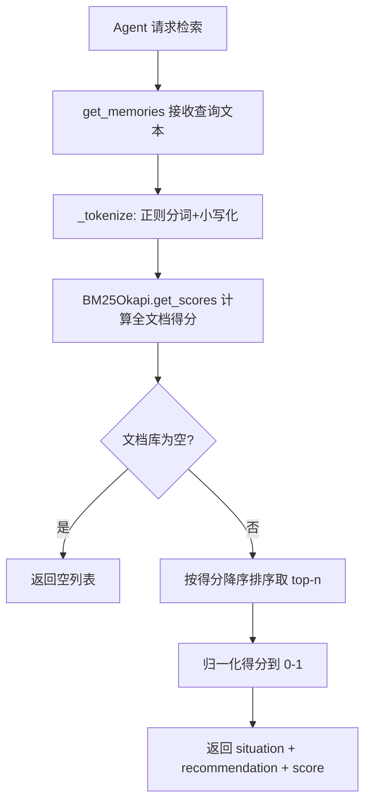
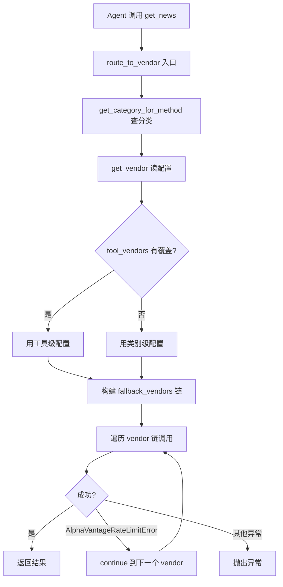

# PD-08.06 TradingAgents — BM25 记忆检索与多数据源路由聚合

> 文档编号：PD-08.06
> 来源：TradingAgents `tradingagents/agents/utils/memory.py`, `tradingagents/dataflows/interface.py`
> GitHub：https://github.com/TauricResearch/TradingAgents.git
> 问题域：PD-08 搜索与检索 Search & Retrieval
> 状态：可复用方案

---

## 第 1 章 问题与动机

### 1.1 核心问题

金融交易 Agent 系统面临两类搜索与检索需求：

1. **经验记忆检索** — 交易决策前需要从历史相似情境中检索过往经验教训，避免重复犯错。传统向量检索依赖嵌入 API（成本高、有延迟、需网络），对于金融领域的词汇匹配场景（如"高通胀+加息"匹配"通胀率上升+利率走高"）并非最优选择。
2. **多源金融数据聚合** — 股票行情、技术指标、基本面、新闻等数据分散在 yfinance、Alpha Vantage 等多个供应商，Agent 需要统一接口访问，且当某个供应商限流时能自动降级到备选源。

### 1.2 TradingAgents 的解法概述

1. **BM25Okapi 词法检索替代向量检索** — 用 `rank_bm25.BM25Okapi` 做记忆匹配，零 API 调用、零 token 消耗、完全离线可用（`memory.py:7-8`）
2. **双层供应商路由表** — `VENDOR_METHODS` 字典映射 10 个数据方法到 2 个供应商实现，`route_to_vendor` 按配置优先级调用并自动降级（`interface.py:69-162`）
3. **分类工具注册** — 4 大类（行情/指标/基本面/新闻）× 10 个工具方法，每类可独立配置供应商（`interface.py:31-61`）
4. **LangChain @tool 封装** — 所有数据获取函数用 `@tool` 装饰器暴露给 LLM Agent，Agent 通过 `bind_tools` 自主选择调用（`news_data_tools.py:5-53`）
5. **CSV 文件缓存** — 技术指标数据下载后缓存为 CSV，避免重复请求（`stockstats_utils.py:38-51`）

### 1.3 设计思想

| 设计原则 | 具体实现 | 理由 | 替代方案 |
|----------|----------|------|----------|
| 零依赖检索 | BM25Okapi 纯 Python 词法匹配 | 无需嵌入 API/向量数据库，离线可用 | FAISS + OpenAI Embedding |
| 供应商透明 | route_to_vendor 统一入口 | Agent 不感知底层数据源切换 | 硬编码 if-else 分支 |
| 配置驱动路由 | data_vendors + tool_vendors 双层配置 | 类别级默认 + 工具级覆盖，灵活度高 | 环境变量逐个配置 |
| 自动降级链 | AlphaVantageRateLimitError 触发 fallback | 限流时无缝切换，不中断交易分析 | 手动重试或报错退出 |
| 批量计算优化 | _get_stock_stats_bulk 一次下载全量计算 | 避免逐日请求 API，性能提升 10x+ | 逐日循环调用 |

---

## 第 2 章 源码实现分析

### 2.1 架构概览

TradingAgents 的搜索与检索体系分为两个独立子系统：BM25 记忆检索和多源数据路由。

```
┌─────────────────────────────────────────────────────────┐
│                    Agent Layer                           │
│  ┌──────────┐ ┌──────────┐ ┌───────────┐ ┌──────────┐  │
│  │ Market   │ │ News     │ │Fundamental│ │ Trader   │  │
│  │ Analyst  │ │ Analyst  │ │ Analyst   │ │          │  │
│  └────┬─────┘ └────┬─────┘ └─────┬─────┘ └────┬─────┘  │
│       │            │             │             │        │
│  ┌────▼────────────▼─────────────▼─────┐ ┌────▼─────┐  │
│  │     route_to_vendor (interface.py)  │ │  BM25    │  │
│  │  ┌─────────────────────────────┐    │ │ Memory   │  │
│  │  │ VENDOR_METHODS 路由表       │    │ │ (memory  │  │
│  │  │ 10 methods × 2 vendors     │    │ │  .py)    │  │
│  │  └──────────┬──────────────────┘    │ └──────────┘  │
│  │             │                       │               │
│  │  ┌──────────▼──────────┐            │               │
│  │  │  Fallback Chain     │            │               │
│  │  │  primary → others   │            │               │
│  │  └──────────┬──────────┘            │               │
│  └─────────────┼───────────────────────┘               │
│       ┌────────┴────────┐                              │
│  ┌────▼─────┐    ┌──────▼──────┐                       │
│  │ yfinance │    │Alpha Vantage│                       │
│  └──────────┘    └─────────────┘                       │
└─────────────────────────────────────────────────────────┘
```

### 2.2 核心实现

#### 2.2.1 BM25 记忆检索系统



对应源码 `tradingagents/agents/utils/memory.py:57-92`：

```python
class FinancialSituationMemory:
    def get_memories(self, current_situation: str, n_matches: int = 1) -> List[dict]:
        if not self.documents or self.bm25 is None:
            return []
        query_tokens = self._tokenize(current_situation)
        scores = self.bm25.get_scores(query_tokens)
        top_indices = sorted(range(len(scores)),
                           key=lambda i: scores[i], reverse=True)[:n_matches]
        results = []
        max_score = max(scores) if max(scores) > 0 else 1
        for idx in top_indices:
            normalized_score = scores[idx] / max_score if max_score > 0 else 0
            results.append({
                "matched_situation": self.documents[idx],
                "recommendation": self.recommendations[idx],
                "similarity_score": normalized_score,
            })
        return results
```

关键设计点：
- **双列表平行存储**（`memory.py:23-24`）：`documents` 存情境描述，`recommendations` 存对应建议，通过索引对齐
- **增量重建索引**（`memory.py:36-42`）：每次 `add_situations` 后全量重建 BM25 索引，简单但对小规模记忆库足够
- **得分归一化**（`memory.py:81-85`）：将 BM25 原始得分除以最大值，映射到 [0,1] 区间，便于跨查询比较

#### 2.2.2 多源数据供应商路由



对应源码 `tradingagents/dataflows/interface.py:134-162`：

```python
def route_to_vendor(method: str, *args, **kwargs):
    category = get_category_for_method(method)
    vendor_config = get_vendor(category, method)
    primary_vendors = [v.strip() for v in vendor_config.split(',')]

    all_available_vendors = list(VENDOR_METHODS[method].keys())
    fallback_vendors = primary_vendors.copy()
    for vendor in all_available_vendors:
        if vendor not in fallback_vendors:
            fallback_vendors.append(vendor)

    for vendor in fallback_vendors:
        if vendor not in VENDOR_METHODS[method]:
            continue
        vendor_impl = VENDOR_METHODS[method][vendor]
        impl_func = vendor_impl[0] if isinstance(vendor_impl, list) else vendor_impl
        try:
            return impl_func(*args, **kwargs)
        except AlphaVantageRateLimitError:
            continue
    raise RuntimeError(f"No available vendor for '{method}'")
```

关键设计点：
- **配置支持逗号分隔多主供应商**（`interface.py:138`）：`"yfinance,alpha_vantage"` 可指定优先级顺序
- **自动补全降级链**（`interface.py:144-148`）：主供应商之外的可用供应商自动追加到尾部
- **仅限流触发降级**（`interface.py:159-160`）：只有 `AlphaVantageRateLimitError` 才 fallback，其他异常直接抛出，避免掩盖真实错误

### 2.3 实现细节

**记忆消费模式** — Trader、ResearchManager、BullResearcher、BearResearcher 四个角色共享同一个 `memory` 实例，每次决策前拼接当前 4 份报告为查询文本，检索 top-2 历史经验注入 prompt（`trader.py:15-16`，`research_manager.py:15-16`）：

```python
curr_situation = f"{market_research_report}\n\n{sentiment_report}\n\n{news_report}\n\n{fundamentals_report}"
past_memories = memory.get_memories(curr_situation, n_matches=2)
```

**新闻去重** — `get_global_news_yfinance` 用 `seen_titles` 集合按标题去重（`yfinance_news.py:130-152`），跨 4 个搜索查询词聚合全球新闻。

**技术指标批量优化** — `_get_stock_stats_bulk` 一次下载 15 年历史数据，用 `stockstats.wrap` 批量计算指标，返回 date→value 字典，避免逐日 API 调用（`y_finance.py:187-267`）。失败时降级到逐日调用的 `get_stockstats_indicator`（`y_finance.py:165-175`）。

**CSV 缓存策略** — `StockstatsUtils` 和 `_get_stock_stats_bulk` 都使用文件名 `{symbol}-YFin-data-{start}-{end}.csv` 作为缓存键，存在则直接读取（`stockstats_utils.py:38-51`）。


---

## 第 3 章 迁移指南

### 3.1 迁移清单

**阶段 1：BM25 记忆检索（1 个文件）**
- [ ] 安装依赖：`pip install rank-bm25`
- [ ] 复制 `FinancialSituationMemory` 类，改名为 `BM25MemoryStore`
- [ ] 将 `documents` / `recommendations` 泛化为 `keys` / `values`
- [ ] 添加持久化（JSON/SQLite），原实现仅内存存储

**阶段 2：多源数据路由（3 个文件）**
- [ ] 定义 `VENDOR_METHODS` 路由表：方法名 → {供应商: 实现函数}
- [ ] 实现 `route_to_vendor` 降级链逻辑
- [ ] 定义供应商特定异常类（如 `RateLimitError`）作为降级触发条件
- [ ] 配置文件支持类别级 + 工具级双层覆盖

**阶段 3：Agent 工具集成**
- [ ] 用 `@tool` 装饰器包装数据获取函数
- [ ] 在 Agent 创建时通过 `llm.bind_tools(tools)` 绑定

### 3.2 适配代码模板

#### BM25 记忆检索（可直接运行）

```python
from rank_bm25 import BM25Okapi
from typing import List, Tuple, Dict, Any
import re
import json
from pathlib import Path


class BM25MemoryStore:
    """通用 BM25 记忆检索，支持持久化。"""

    def __init__(self, name: str, persist_path: str = None):
        self.name = name
        self.persist_path = persist_path
        self.keys: List[str] = []
        self.values: List[Any] = []
        self.bm25 = None
        if persist_path and Path(persist_path).exists():
            self._load()

    def _tokenize(self, text: str) -> List[str]:
        return re.findall(r'\b\w+\b', text.lower())

    def _rebuild_index(self):
        if self.keys:
            self.bm25 = BM25Okapi([self._tokenize(k) for k in self.keys])
        else:
            self.bm25 = None

    def add(self, entries: List[Tuple[str, Any]]):
        for key, value in entries:
            self.keys.append(key)
            self.values.append(value)
        self._rebuild_index()
        if self.persist_path:
            self._save()

    def search(self, query: str, top_k: int = 3) -> List[Dict]:
        if not self.keys or self.bm25 is None:
            return []
        scores = self.bm25.get_scores(self._tokenize(query))
        top_indices = sorted(range(len(scores)),
                           key=lambda i: scores[i], reverse=True)[:top_k]
        max_score = max(scores) if max(scores) > 0 else 1
        return [{
            "key": self.keys[i],
            "value": self.values[i],
            "score": scores[i] / max_score if max_score > 0 else 0,
        } for i in top_indices if scores[i] > 0]

    def _save(self):
        Path(self.persist_path).write_text(
            json.dumps({"keys": self.keys, "values": self.values}, ensure_ascii=False))

    def _load(self):
        data = json.loads(Path(self.persist_path).read_text())
        self.keys, self.values = data["keys"], data["values"]
        self._rebuild_index()
```

#### 多源路由（可直接运行）

```python
from typing import Callable, Dict, Any


class VendorRateLimitError(Exception):
    pass


class DataRouter:
    """多供应商路由器，支持配置驱动 + 自动降级。"""

    def __init__(self, vendor_methods: Dict[str, Dict[str, Callable]],
                 config: Dict[str, str] = None):
        self.vendor_methods = vendor_methods
        self.config = config or {}

    def route(self, method: str, *args, **kwargs) -> Any:
        if method not in self.vendor_methods:
            raise ValueError(f"Unknown method: {method}")

        primary = self.config.get(method, "").split(",")
        primary = [v.strip() for v in primary if v.strip()]

        all_vendors = list(self.vendor_methods[method].keys())
        chain = primary + [v for v in all_vendors if v not in primary]

        for vendor in chain:
            if vendor not in self.vendor_methods[method]:
                continue
            try:
                return self.vendor_methods[method][vendor](*args, **kwargs)
            except VendorRateLimitError:
                continue
        raise RuntimeError(f"All vendors exhausted for '{method}'")
```

### 3.3 适用场景

| 场景 | 适用度 | 说明 |
|------|--------|------|
| 金融/交易 Agent 经验检索 | ⭐⭐⭐ | BM25 对金融术语词汇匹配效果好，零成本 |
| 小规模记忆库（<10K 条） | ⭐⭐⭐ | BM25 内存索引足够，无需向量数据库 |
| 多 API 供应商聚合 | ⭐⭐⭐ | 路由表模式通用，适合任何多源数据场景 |
| 大规模语义检索（>100K 条） | ⭐ | BM25 词法匹配不如向量检索，需混合方案 |
| 跨语言检索 | ⭐ | BM25 依赖词汇重叠，跨语言效果差 |

---

## 第 4 章 测试用例

```python
import pytest
from rank_bm25 import BM25Okapi
import re


class FinancialSituationMemory:
    """从 TradingAgents memory.py 提取的核心实现。"""
    def __init__(self, name: str):
        self.name = name
        self.documents, self.recommendations = [], []
        self.bm25 = None

    def _tokenize(self, text):
        return re.findall(r'\b\w+\b', text.lower())

    def _rebuild_index(self):
        self.bm25 = BM25Okapi([self._tokenize(d) for d in self.documents]) if self.documents else None

    def add_situations(self, data):
        for sit, rec in data:
            self.documents.append(sit)
            self.recommendations.append(rec)
        self._rebuild_index()

    def get_memories(self, query, n_matches=1):
        if not self.documents or not self.bm25:
            return []
        scores = self.bm25.get_scores(self._tokenize(query))
        top = sorted(range(len(scores)), key=lambda i: scores[i], reverse=True)[:n_matches]
        mx = max(scores) if max(scores) > 0 else 1
        return [{"matched_situation": self.documents[i],
                 "recommendation": self.recommendations[i],
                 "similarity_score": scores[i] / mx} for i in top]


class TestBM25MemoryRetrieval:
    def setup_method(self):
        self.mem = FinancialSituationMemory("test")
        self.mem.add_situations([
            ("High inflation with rising interest rates", "Buy defensive sectors"),
            ("Tech sector high volatility institutional selling", "Reduce tech exposure"),
            ("Strong dollar affecting emerging markets", "Hedge currency exposure"),
        ])

    def test_normal_retrieval(self):
        results = self.mem.get_memories("inflation and interest rates rising", n_matches=1)
        assert len(results) == 1
        assert "inflation" in results[0]["matched_situation"].lower()
        assert results[0]["similarity_score"] > 0

    def test_top_k_retrieval(self):
        results = self.mem.get_memories("market volatility", n_matches=2)
        assert len(results) == 2

    def test_empty_memory(self):
        empty = FinancialSituationMemory("empty")
        assert empty.get_memories("anything") == []

    def test_score_normalization(self):
        results = self.mem.get_memories("inflation rates", n_matches=3)
        assert results[0]["similarity_score"] == 1.0  # 最高分归一化为 1
        assert all(0 <= r["similarity_score"] <= 1 for r in results)

    def test_incremental_add(self):
        self.mem.add_situations([("Oil prices surging", "Energy sector long")])
        results = self.mem.get_memories("oil price increase", n_matches=1)
        assert "oil" in results[0]["matched_situation"].lower()


class TestVendorRouting:
    def test_primary_vendor_called(self):
        called = []
        def yf(*a): called.append("yf"); return "yf_data"
        def av(*a): called.append("av"); return "av_data"
        methods = {"get_data": {"yfinance": yf, "alpha_vantage": av}}
        router = type('R', (), {
            'route': lambda self, m, *a: methods[m]["yfinance"](*a)
        })()
        assert router.route("get_data") == "yf_data"
        assert called == ["yf"]

    def test_fallback_on_rate_limit(self):
        class RateLimit(Exception): pass
        def yf(*a): raise RateLimit()
        def av(*a): return "av_data"
        methods = {"get_data": {"yfinance": yf, "alpha_vantage": av}}
        # 模拟 route_to_vendor 降级逻辑
        result = None
        for vendor in ["yfinance", "alpha_vantage"]:
            try:
                result = methods["get_data"][vendor]()
                break
            except RateLimit:
                continue
        assert result == "av_data"

    def test_all_vendors_exhausted(self):
        class RateLimit(Exception): pass
        def yf(*a): raise RateLimit()
        def av(*a): raise RateLimit()
        methods = {"get_data": {"yfinance": yf, "alpha_vantage": av}}
        result = None
        for vendor in ["yfinance", "alpha_vantage"]:
            try:
                result = methods["get_data"][vendor]()
                break
            except RateLimit:
                continue
        assert result is None  # 所有供应商耗尽
```


---

## 第 5 章 跨域关联

| 关联域 | 关系类型 | 说明 |
|--------|----------|------|
| PD-06 记忆持久化 | 强依赖 | BM25 记忆检索是 PD-06 记忆系统的检索层，`FinancialSituationMemory` 同时承担存储和检索职责 |
| PD-03 容错与重试 | 协同 | `route_to_vendor` 的 `AlphaVantageRateLimitError` 降级链是 PD-03 容错策略在数据层的具体实现 |
| PD-04 工具系统 | 协同 | 所有数据获取函数通过 `@tool` 装饰器注册为 LangChain 工具，供 Agent 自主调用 |
| PD-02 多 Agent 编排 | 消费方 | 4 个 Analyst Agent 各自绑定不同工具子集，通过编排层协调调用顺序 |
| PD-11 可观测性 | 潜在扩展 | 当前路由层无日志/指标，可在 `route_to_vendor` 中添加供应商调用计数和延迟追踪 |
| PD-07 质量检查 | 协同 | 辩论式多 Agent 架构（Bull/Bear Researcher）本身是检索结果质量的对抗验证机制 |

---

## 第 6 章 来源文件索引

| 文件 | 行范围 | 关键实现 |
|------|--------|----------|
| `tradingagents/agents/utils/memory.py` | L1-145 | BM25 记忆检索核心类 `FinancialSituationMemory` |
| `tradingagents/dataflows/interface.py` | L1-162 | 多源路由表 `VENDOR_METHODS` + `route_to_vendor` 降级链 |
| `tradingagents/dataflows/config.py` | L1-31 | 全局配置管理（`data_vendors` + `tool_vendors`） |
| `tradingagents/default_config.py` | L24-33 | 默认供应商配置（4 类均默认 yfinance） |
| `tradingagents/agents/utils/news_data_tools.py` | L1-53 | `@tool` 封装的新闻检索工具 |
| `tradingagents/dataflows/yfinance_news.py` | L49-191 | yfinance 新闻获取 + 标题去重 + 日期过滤 |
| `tradingagents/dataflows/y_finance.py` | L49-267 | 技术指标批量计算 + CSV 缓存 |
| `tradingagents/dataflows/alpha_vantage_common.py` | L38-83 | `AlphaVantageRateLimitError` + API 请求封装 |
| `tradingagents/dataflows/alpha_vantage_news.py` | L1-71 | Alpha Vantage NEWS_SENTIMENT API 封装 |
| `tradingagents/dataflows/stockstats_utils.py` | L1-65 | `StockstatsUtils` 单日指标计算 + CSV 缓存 |
| `tradingagents/agents/trader/trader.py` | L6-46 | Trader 消费 BM25 记忆的模式 |
| `tradingagents/agents/managers/research_manager.py` | L5-55 | ResearchManager 消费 BM25 记忆的模式 |
| `tradingagents/agents/analysts/market_analyst.py` | L8-85 | MarketAnalyst 绑定 get_stock_data + get_indicators |
| `tradingagents/agents/analysts/news_analyst.py` | L8-58 | NewsAnalyst 绑定 get_news + get_global_news |

---

## 第 7 章 横向对比维度

```json comparison_data
{
  "project": "TradingAgents",
  "dimensions": {
    "搜索架构": "BM25Okapi 词法检索 + 多源供应商路由表",
    "去重机制": "新闻按标题 seen_titles 集合去重",
    "结果处理": "BM25 得分归一化到 [0,1]，取 top-n 返回",
    "容错策略": "AlphaVantageRateLimitError 触发供应商降级链",
    "成本控制": "BM25 零 API 调用 + CSV 文件缓存避免重复下载",
    "检索方式": "纯词法 BM25，无向量嵌入",
    "扩展性": "VENDOR_METHODS 字典注册新供应商，无需改调用方",
    "搜索源热切换": "config data_vendors 类别级 + tool_vendors 工具级双层配置",
    "缓存机制": "CSV 文件缓存，文件名含 symbol+日期范围作为键",
    "索引结构": "BM25Okapi 内存倒排索引，增量全量重建",
    "排序策略": "BM25 TF-IDF 变体得分降序",
    "组件正交": "记忆检索与数据路由完全独立，各 Agent 按需绑定工具子集"
  }
}
```

### 域元数据补充

```json domain_metadata
{
  "solution_summary": "TradingAgents 用 BM25Okapi 做零成本记忆检索 + VENDOR_METHODS 路由表实现 yfinance/AlphaVantage 双源自动降级聚合",
  "description": "金融领域词汇匹配场景下 BM25 可替代向量检索实现零成本经验检索",
  "sub_problems": [
    "供应商降级触发条件：仅限流降级 vs 所有异常降级的权衡",
    "记忆索引增量更新：全量重建 vs 增量追加的性能取舍",
    "多报告拼接检索：多份分析报告拼接为单一查询的信噪比问题"
  ],
  "best_practices": [
    "BM25 适合金融术语词汇匹配场景，零 API 成本且离线可用",
    "供应商路由仅对限流异常降级，其他异常直接抛出避免掩盖真实错误",
    "技术指标批量计算一次下载全量数据，比逐日请求性能提升 10x+"
  ]
}
```

