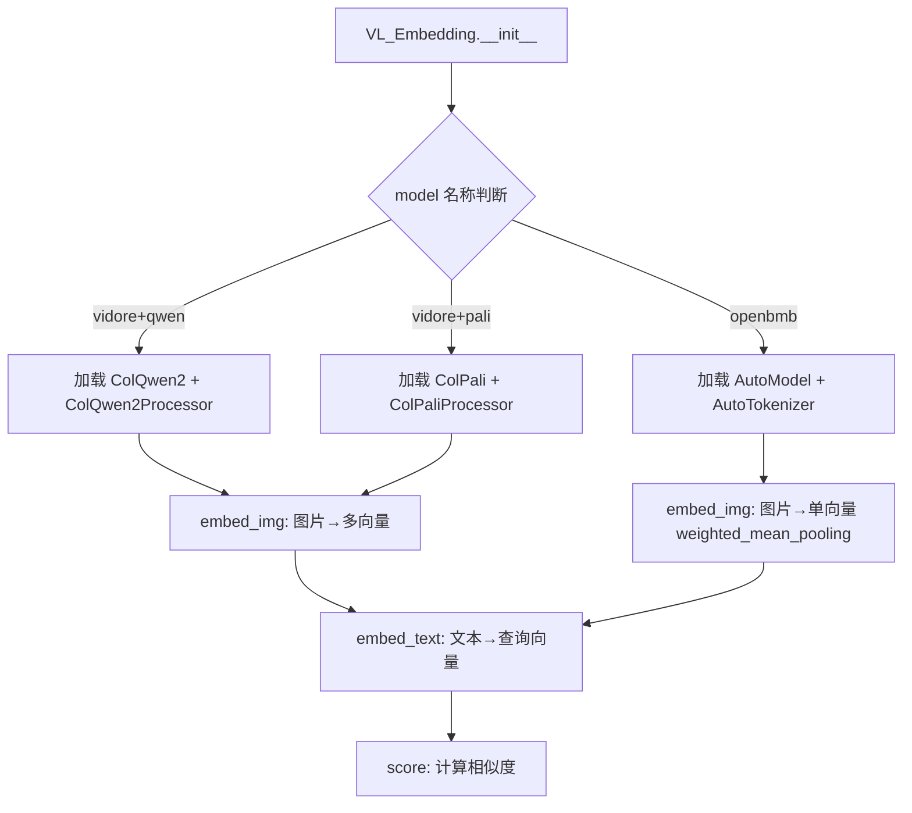
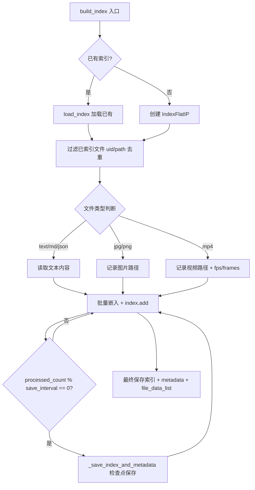
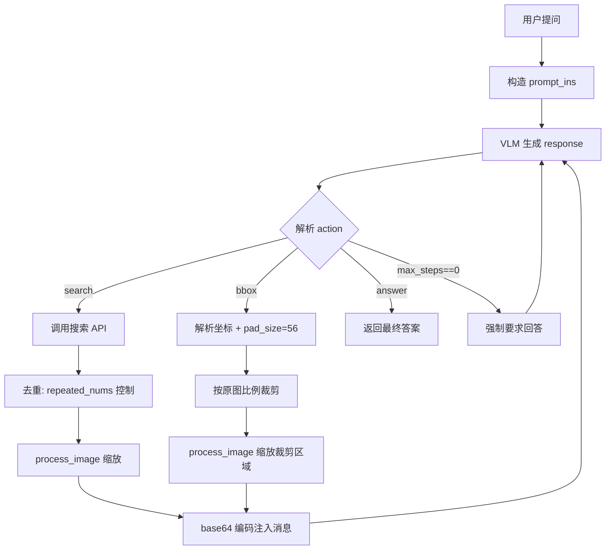

# PD-08.VRAG VRAG — 多模态视觉检索与渐进式信息获取

> 文档编号：PD-08.VRAG
> 来源：VRAG `search_engine/search_engine.py` `search_engine/search_engine_faiss.py` `search_engine/vl_embedding.py`
> GitHub：https://github.com/Alibaba-NLP/VRAG.git
> 问题域：PD-08 搜索与检索 Search & Retrieval
> 状态：可复用方案

---

## 第 1 章 问题与动机

### 1.1 核心问题

传统 RAG 系统以文本为中心，面对包含图表、公式、信息图的视觉密集型文档（如 PDF 报告、幻灯片）时，文本提取会丢失大量视觉信息。核心挑战包括：

1. **视觉信息不可文本化**：图表中的趋势、信息图中的空间关系无法通过 OCR 完整还原
2. **粒度不匹配**：用户问题可能指向文档页面中的某个局部区域（如某个柱状图的某根柱子），全页检索粒度太粗
3. **多模态嵌入异构性**：文本查询与图像文档之间的语义对齐需要专门的视觉-语言嵌入模型
4. **检索与推理脱节**：传统 RAG 一次检索后直接生成，缺乏"看不清就放大"的渐进式信息获取能力

### 1.2 VRAG 的解法概述

VRAG（Visual Retrieval-Augmented Generation）构建了一个纯视觉 RAG Agent，核心设计：

1. **双引擎架构**：ColQwen2/ColPali 多向量引擎（`search_engine/search_engine.py:23`）+ GVE/bge-m3 单向量 FAISS 引擎（`search_engine/search_engine_faiss.py:10`），分别适配不同精度需求
2. **LlamaIndex 摄取管道**：通过 `IngestionPipeline` + `SimpleFileNodeParser` + `VL_Embedding` 三阶段管道将文档图片转为带嵌入的 Node（`search_engine/ingestion.py:21-24`）
3. **渐进式视觉检索**：Agent 通过 `<search>` 获取页面级图片，再通过 `<bbox>` 裁剪感兴趣区域，实现从粗到细的信息获取（`demo/vrag_agent.py:124-168`）
4. **FastAPI 批量搜索 API**：两套 API 服务分别暴露 ColQwen2 引擎（`search_engine/search_engine_api.py`）和 FAISS 引擎（`search_engine/search_engine_faiss_api.py`）
5. **RL 训练闭环**：`VRAG-RL/vrag_agent/generation.py` 中的 `LLMGenerationManager` 将搜索-裁剪-回答循环封装为可训练的多轮环境

### 1.3 设计思想

| 设计原则 | 具体实现 | 理由 | 替代方案 |
|----------|----------|------|----------|
| 纯视觉检索 | 直接对 PDF 页面图片做嵌入，不做 OCR | 保留图表/布局等视觉信息 | OCR + 文本嵌入（丢失视觉） |
| 多向量 vs 单向量双引擎 | ColQwen2 输出 token 级多向量；GVE 输出单向量 | 多向量精度高但索引大，单向量适合大规模 | 仅用单向量（精度不足） |
| 渐进式粒度 | search → 全页 → bbox → 裁剪区域 | 模拟人类"先看全局再看细节"的阅读行为 | 一次检索直接回答（粒度不够） |
| 嵌入模型可插拔 | `VL_Embedding` 通过 model 名称分支加载不同后端 | 支持 ColQwen2/ColPali/OpenBMB 等多种模型 | 硬编码单一模型 |
| 离线索引 + 在线检索 | `build_index` 离线构建 FAISS 索引，`search` 在线查询 | 索引构建耗时但只需一次 | 每次查询实时嵌入（太慢） |

---

## 第 2 章 源码实现分析

### 2.1 架构概览

VRAG 的搜索与检索系统由三层组成：嵌入层、索引层、Agent 交互层。

```
┌─────────────────────────────────────────────────────────────┐
│                    Agent 交互层                              │
│  ┌──────────┐    ┌──────────┐    ┌──────────┐              │
│  │ <search> │───→│ 全页图片  │───→│ <bbox>   │───→ 裁剪区域 │
│  │ 文本查询  │    │ 检索结果  │    │ 坐标裁剪  │    细粒度图片 │
│  └──────────┘    └──────────┘    └──────────┘              │
├─────────────────────────────────────────────────────────────┤
│                    索引层                                    │
│  ┌─────────────────────┐  ┌──────────────────────────┐     │
│  │ ColQwen2 多向量引擎   │  │ GVE/bge-m3 FAISS 引擎    │     │
│  │ score_multi_vector   │  │ IndexFlatIP              │     │
│  │ (search_engine.py)   │  │ (search_engine_faiss.py) │     │
│  └─────────────────────┘  └──────────────────────────┘     │
├─────────────────────────────────────────────────────────────┤
│                    嵌入层                                    │
│  ┌──────────┐  ┌──────────┐  ┌──────────┐  ┌──────────┐   │
│  │ ColQwen2 │  │ ColPali  │  │ GVE-3B/7B│  │ bge-m3   │   │
│  │ 多向量    │  │ 多向量    │  │ 单向量    │  │ 文本单向量│   │
│  └──────────┘  └──────────┘  └──────────┘  └──────────┘   │
├─────────────────────────────────────────────────────────────┤
│                    摄取层                                    │
│  SimpleDirectoryReader → SimpleFileNodeParser → VL_Embedding│
│  (ingestion.py)                                             │
└─────────────────────────────────────────────────────────────┘
```

### 2.2 核心实现

#### 2.2.1 VL_Embedding 多模态嵌入适配器



对应源码 `search_engine/vl_embedding.py:23-78`：

```python
class VL_Embedding(MultiModalEmbedding):
    model: str = Field(description="The Multi-model to use.")
    embed_model: Union[ColQwen2, AutoModel, None] = Field(default=None)
    processor: Optional[ColQwen2Processor] = Field(default=None)
    
    def __init__(self, model: str = "vidore/colqwen2-v1.0", 
                 dimensions: Optional[int] = 1024, mode: str = 'text', **kwargs):
        super().__init__(model=model, dimensions=dimensions, **kwargs)
        self.mode = mode
        if 'openbmb' in model:
            self.tokenizer = AutoTokenizer.from_pretrained(model, trust_remote_code=True)
            self.embed_model = AutoModel.from_pretrained(model, torch_dtype=torch.bfloat16,
                trust_remote_code=True, device_map='cuda:1').cuda().eval()
        elif 'vidore' in model and 'qwen' in model:
            self.embed_model = ColQwen2.from_pretrained(model,
                torch_dtype=torch.bfloat16, device_map='cuda:1').eval()
            self.processor = ColQwen2Processor.from_pretrained(model)
        elif 'vidore' in model and 'pali' in model:
            self.embed_model = ColPali.from_pretrained(model,
                torch_dtype=torch.bfloat16, device_map='cuda').eval()
            self.processor = ColPaliProcessor.from_pretrained(model)
```

关键设计：`VL_Embedding` 继承 LlamaIndex 的 `MultiModalEmbedding`，通过 model 名称字符串匹配分支加载不同后端。`__call__` 方法（`vl_embedding.py:196-220`）直接接受 LlamaIndex Node 列表，为每个 node 设置 embedding 属性，实现与 IngestionPipeline 的无缝集成。

#### 2.2.2 FAISS 索引引擎与增量构建



对应源码 `search_engine/search_engine_faiss.py:81-211`：

```python
def build_index(self, input_dir, index_output_path, corpus_output_path, bs=2, save_interval=512):
    os.makedirs(index_output_path, exist_ok=True)
    # Step 1: 加载现有索引（增量构建）
    if os.path.exists(index_path) and os.path.exists(meta_data_path):
        self.load_index(index_output_path)
    else:
        self.index = faiss.IndexFlatIP(self.dimension)
        self.file_data_list = []
    
    # Step 2: uid/path 去重过滤
    already_file_uid = {entry['uid'] for entry in self.file_data_list}
    # ...过滤已索引文件...
    
    # Step 3: 批量嵌入 + 周期性检查点
    for i in tqdm(range(0, len(input_data_list), bs)):
        try:
            outputs = self.model.encode(inputs).detach().cpu().float().numpy()
            self.index.add(outputs.astype('float32'))
        except Exception as e:
            print(f"处理文件 {file_batch} 时出错: {e}")
            continue  # 跳过失败文件，不中断整体流程
        if processed_count % save_interval == 0:
            self._save_index_and_metadata(...)
```

关键设计点：
- **增量索引**：通过 `uid` 集合或 `file_path` 集合去重，已索引文件不重复处理（`search_engine_faiss.py:102-117`）
- **检查点保存**：每 `save_interval` 个样本保存一次，防止长时间构建中断丢失进度（`search_engine_faiss.py:187-190`）
- **元数据一致性校验**：`load_index` 时断言 `meta_data.num_vectors == index.ntotal == len(file_data_list)`（`search_engine_faiss.py:47-49`）
- **多索引合并**：`load_multi_index_corpus_together` 通过 `faiss.merge_from` 合并多个语料库索引（`search_engine_faiss.py:51-79`）

#### 2.2.3 Agent 渐进式检索循环



对应源码 `demo/vrag_agent.py:67-179`：

```python
def run(self, question):
    self.image_raw, self.image_input, self.image_path = [], [], []
    prompt = prompt_ins.format(question=question)
    messages = [dict(role="user", content=[{"type": "text", "text": prompt}])]
    max_steps = self.max_steps
    while True:
        response = self.client.chat.completions.create(
            model="Qwen/Qwen2.5-VL-7B-Instruct", messages=messages, stream=False)
        response_content = response.choices[0].message.content
        # 解析 <think>...</think>
        thought = re.search(r'<think>(.*?)</think>', response_content, re.DOTALL).group(1)
        # 解析 <search|answer|bbox>
        match = re.search(r'<(search|answer|bbox)>(.*?)</\1>', response_content, re.DOTALL)
        if action == 'search':
            search_results = self.search(content)
            while len(search_results) > 0:
                image_path = search_results.pop(0)
                if self.image_path.count(image_path) >= self.repeated_nums:
                    continue  # 去重：同一图片最多检索 repeated_nums 次
                else:
                    self.image_path.append(image_path); break
        elif action == 'bbox':
            bbox = json.loads(content)
            # 坐标从 input 尺寸映射回原图尺寸
            crop_region_bbox = bbox[0]*raw_w/input_w, bbox[1]*raw_h/input_h, ...
            pad_size = 56  # 裁剪区域外扩 56 像素
            crop_region = self.image_raw[-1].crop(crop_region_bbox)
```

### 2.3 实现细节

**GVE 模型架构**（`search_engine/models/GVE/models.py:34-147`）：基于 Qwen2.5-VL 的 `Qwen25VLForEmbedding`，支持 last pooling 和 mean pooling 两种策略，L2 归一化后输出嵌入向量。GVE-3B 输出 2048 维，GVE-7B 输出 3584 维（`search_engine_faiss.py:22-27`）。

**多索引语料库路由**（`search_engine_faiss.py:239-288`）：`search` 方法支持 `search_corpus` 参数，通过 `self.index_dict[search_corpus]` 路由到特定语料库的索引和文件列表，实现多数据集隔离检索。

**图片像素预算控制**（`demo/vrag_agent.py:31-46`）：`process_image` 将图片缩放到 `[min_pixels, max_pixels]` 范围内（默认 256×28×28 到 512×28×28），控制 VLM 输入 token 数量。

**RL 训练中的搜索环境**（`VRAG-RL/vrag_agent/generation.py:574-637`）：`execute_predictions` 将搜索查询批量发送到搜索 API（batch_size=100），支持 search/bbox/answer 三种 action，无效 action 返回错误提示让模型重试。

---

## 第 3 章 迁移指南

### 3.1 迁移清单

**阶段 1：嵌入层搭建**
- [ ] 安装依赖：`colpali-engine`、`llama-index-core`、`faiss-cpu/faiss-gpu`、`transformers`
- [ ] 选择嵌入模型：ColQwen2（多向量高精度）或 GVE（单向量大规模）
- [ ] 实现 `VL_Embedding` 适配器，继承 LlamaIndex `MultiModalEmbedding`

**阶段 2：索引构建**
- [ ] 将文档转为图片（PDF → JPG）
- [ ] 配置 `IngestionPipeline`：`SimpleFileNodeParser` + 自定义 `VL_Embedding`
- [ ] 运行离线索引构建，配置检查点间隔

**阶段 3：检索服务**
- [ ] 部署 FastAPI 搜索 API
- [ ] 实现批量搜索接口（支持 top_k 和 corpus 路由）

**阶段 4：Agent 集成**
- [ ] 实现 `<search>` / `<bbox>` / `<answer>` 三动作解析
- [ ] 集成 VLM（如 Qwen2.5-VL）作为推理引擎
- [ ] 实现图片去重和像素预算控制

### 3.2 适配代码模板

以下是一个可直接运行的最小化视觉检索引擎模板：

```python
"""最小化视觉检索引擎 — 基于 VRAG 架构迁移"""
import faiss
import json
import numpy as np
import torch
from typing import List, Dict, Optional
from dataclasses import dataclass, field


@dataclass
class IndexMetadata:
    model_name: str
    vector_dimension: int
    num_vectors: int = 0


class VisualSearchEngine:
    """单向量 FAISS 视觉检索引擎，参考 VRAG search_engine_faiss.py"""
    
    def __init__(self, embed_model, dimension: int):
        self.embed_model = embed_model
        self.dimension = dimension
        self.index = faiss.IndexFlatIP(dimension)
        self.file_data_list: List[Dict] = []
        self._indexed_ids: set = set()
    
    def build_index(self, items: List[Dict], batch_size: int = 16,
                    save_fn=None, save_interval: int = 512):
        """增量构建索引，跳过已索引项"""
        new_items = [item for item in items if item['uid'] not in self._indexed_ids]
        if not new_items:
            return
        
        for i in range(0, len(new_items), batch_size):
            batch = new_items[i:i + batch_size]
            try:
                vectors = self.embed_model.encode(batch)
                self.index.add(vectors.astype('float32'))
                self.file_data_list.extend(batch)
                self._indexed_ids.update(item['uid'] for item in batch)
            except Exception as e:
                print(f"Batch {i} failed: {e}")
                continue
            
            if save_fn and (i + batch_size) % save_interval == 0:
                save_fn(self)
    
    def search(self, query_vectors: np.ndarray, top_k: int = 5) -> List[Dict]:
        """向量检索，返回 top_k 结果"""
        top_k = min(top_k, len(self.file_data_list))
        if top_k == 0:
            return []
        similarities, indices = self.index.search(query_vectors.astype('float32'), top_k)
        return [
            {"score": float(s), "data": self.file_data_list[idx]}
            for s, idx in zip(similarities[0].tolist(), indices[0].tolist())
        ]
    
    def merge_index(self, other: 'VisualSearchEngine'):
        """合并另一个引擎的索引，参考 load_multi_index_corpus_together"""
        self.index.merge_from(other.index)
        self.file_data_list.extend(other.file_data_list)
        self._indexed_ids.update(other._indexed_ids)


class ProgressiveVisualAgent:
    """渐进式视觉检索 Agent，参考 VRAG demo/vrag_agent.py"""
    
    def __init__(self, search_engine: VisualSearchEngine, vlm_client,
                 max_steps: int = 10, repeated_nums: int = 1):
        self.engine = search_engine
        self.vlm = vlm_client
        self.max_steps = max_steps
        self.repeated_nums = repeated_nums
    
    def run(self, question: str):
        retrieved_paths = []
        messages = [{"role": "user", "content": question}]
        
        for step in range(self.max_steps):
            response = self.vlm.generate(messages)
            action, content = self._parse_action(response)
            
            if action == 'answer':
                return content
            elif action == 'search':
                results = self.engine.search(
                    self.embed_model.encode_query(content), top_k=10)
                # 去重过滤
                for r in results:
                    path = r['data'].get('file_path', '')
                    if retrieved_paths.count(path) < self.repeated_nums:
                        retrieved_paths.append(path)
                        messages.append({"role": "user", "content": {"image": path}})
                        break
            elif action == 'bbox':
                # 裁剪感兴趣区域
                bbox = json.loads(content)
                cropped = self._crop_with_padding(retrieved_paths[-1], bbox)
                messages.append({"role": "user", "content": {"image": cropped}})
        
        return "Max steps reached"
    
    @staticmethod
    def _parse_action(response: str):
        import re
        match = re.search(r'<(search|answer|bbox)>(.*?)</\1>', response, re.DOTALL)
        if match:
            return match.group(1), match.group(2).strip()
        return None, ''
    
    @staticmethod
    def _crop_with_padding(image_path: str, bbox: list, pad: int = 56):
        from PIL import Image
        img = Image.open(image_path)
        w, h = img.size
        crop_box = [max(0, bbox[0]-pad), max(0, bbox[1]-pad),
                     min(w, bbox[2]+pad), min(h, bbox[3]+pad)]
        return img.crop(crop_box)
```

### 3.3 适用场景

| 场景 | 适用度 | 说明 |
|------|--------|------|
| PDF/幻灯片视觉问答 | ⭐⭐⭐ | VRAG 的核心场景，图表密集型文档效果最佳 |
| 多模态知识库检索 | ⭐⭐⭐ | 图片+文本混合语料库，GVE 支持文本/图片/视频统一嵌入 |
| 细粒度图表分析 | ⭐⭐⭐ | bbox 裁剪机制适合需要放大查看的场景 |
| 纯文本 RAG | ⭐ | 杀鸡用牛刀，bge-m3 分支可用但不如专用文本检索 |
| 实时流式检索 | ⭐⭐ | FAISS IndexFlatIP 适合中等规模，大规模需换 IVF/HNSW |
| RL 训练视觉 Agent | ⭐⭐⭐ | VRAG-RL 提供完整的多轮搜索训练环境 |

---

## 第 4 章 测试用例

```python
import pytest
import numpy as np
import json
import os
import tempfile


class TestFAISSSearchEngine:
    """测试 FAISS 索引引擎核心功能，基于 search_engine_faiss.py"""
    
    def test_build_index_incremental(self):
        """测试增量索引构建：已索引文件不重复处理"""
        # 模拟 SearchEngine 的增量逻辑
        existing_uids = {'uid_001', 'uid_002'}
        new_items = [
            {'uid': 'uid_001', 'type': 'image', 'file_path': '/a.jpg'},
            {'uid': 'uid_003', 'type': 'image', 'file_path': '/c.jpg'},
        ]
        filtered = [item for item in new_items if item['uid'] not in existing_uids]
        assert len(filtered) == 1
        assert filtered[0]['uid'] == 'uid_003'
    
    def test_metadata_consistency_check(self):
        """测试元数据一致性校验：num_vectors 必须匹配 index.ntotal"""
        import faiss
        dimension = 128
        index = faiss.IndexFlatIP(dimension)
        vectors = np.random.randn(5, dimension).astype('float32')
        index.add(vectors)
        file_data_list = [{'uid': f'uid_{i}'} for i in range(5)]
        metadata = {'num_vectors': 5, 'model_name': 'test'}
        
        assert metadata['num_vectors'] == index.ntotal == len(file_data_list)
    
    def test_multi_index_merge(self):
        """测试多索引合并：merge_from 后总数正确"""
        import faiss
        dim = 64
        idx1 = faiss.IndexFlatIP(dim)
        idx2 = faiss.IndexFlatIP(dim)
        idx1.add(np.random.randn(10, dim).astype('float32'))
        idx2.add(np.random.randn(20, dim).astype('float32'))
        idx1.merge_from(idx2)
        assert idx1.ntotal == 30
    
    def test_search_top_k_clamp(self):
        """测试 top_k 不超过索引大小"""
        import faiss
        dim = 64
        index = faiss.IndexFlatIP(dim)
        vectors = np.random.randn(3, dim).astype('float32')
        index.add(vectors)
        file_data_list = [{'uid': f'uid_{i}'} for i in range(3)]
        
        top_k = min(10, len(file_data_list))
        assert top_k == 3
    
    def test_checkpoint_save_and_reload(self):
        """测试检查点保存与重新加载"""
        import faiss
        dim = 64
        index = faiss.IndexFlatIP(dim)
        vectors = np.random.randn(5, dim).astype('float32')
        index.add(vectors)
        
        with tempfile.TemporaryDirectory() as tmpdir:
            index_path = os.path.join(tmpdir, 'test.bin')
            faiss.write_index(index, index_path)
            reloaded = faiss.read_index(index_path)
            assert reloaded.ntotal == 5


class TestVLEmbeddingAdapter:
    """测试 VL_Embedding 适配器，基于 vl_embedding.py"""
    
    def test_embed_img_batch_input(self):
        """测试图片嵌入接受单路径和列表"""
        # 验证输入归一化逻辑
        single = "test.jpg"
        if isinstance(single, str):
            single = [single]
        assert isinstance(single, list) and len(single) == 1
    
    def test_embed_text_batch_input(self):
        """测试文本嵌入接受单字符串和列表"""
        single = "hello"
        if isinstance(single, str):
            single = [single]
        assert isinstance(single, list) and len(single) == 1


class TestProgressiveRetrieval:
    """测试渐进式检索 Agent 逻辑，基于 demo/vrag_agent.py"""
    
    def test_action_parsing(self):
        """测试 <search>/<answer>/<bbox> 标签解析"""
        import re
        response = "<think>I need to search</think><search>capital of France</search>"
        pattern = r'<(search|answer|bbox)>(.*?)</\1>'
        match = re.search(pattern, response, re.DOTALL)
        assert match.group(1) == 'search'
        assert match.group(2).strip() == 'capital of France'
    
    def test_image_dedup(self):
        """测试图片去重：同一路径不超过 repeated_nums"""
        image_path_list = ['/img/a.jpg', '/img/a.jpg', '/img/b.jpg']
        retrieved = []
        repeated_nums = 1
        for path in image_path_list:
            if retrieved.count(path) < repeated_nums:
                retrieved.append(path)
                break
        assert retrieved == ['/img/a.jpg']
        # 第二次检索同一路径应跳过
        for path in image_path_list:
            if retrieved.count(path) < repeated_nums:
                retrieved.append(path)
                break
        assert len(retrieved) == 1  # 仍然只有一个，因为 a.jpg 已达上限
    
    def test_bbox_coordinate_mapping(self):
        """测试 bbox 坐标从 input 尺寸映射到原图尺寸"""
        input_w, input_h = 512, 384
        raw_w, raw_h = 2048, 1536
        bbox = [100, 50, 200, 150]
        crop = [
            bbox[0] * raw_w / input_w,
            bbox[1] * raw_h / input_h,
            bbox[2] * raw_w / input_w,
            bbox[3] * raw_h / input_h,
        ]
        assert crop == [400.0, 200.0, 800.0, 600.0]
    
    def test_pixel_budget_control(self):
        """测试图片像素预算：缩放到 [min_pixels, max_pixels]"""
        max_pixels = 512 * 28 * 28  # 401408
        min_pixels = 256 * 28 * 28  # 200704
        # 大图缩小
        w, h = 4000, 3000
        if w * h > max_pixels:
            import math
            factor = math.sqrt(max_pixels / (w * h))
            new_w, new_h = int(w * factor), int(h * factor)
            assert new_w * new_h <= max_pixels * 1.1  # 允许小误差
        # 小图放大
        w, h = 100, 100
        if w * h < min_pixels:
            import math
            factor = math.sqrt(min_pixels / (w * h))
            new_w, new_h = int(w * factor), int(h * factor)
            assert new_w * new_h >= min_pixels * 0.9
```

---

## 第 5 章 跨域关联

| 关联域 | 关系类型 | 说明 |
|--------|----------|------|
| PD-01 上下文管理 | 协同 | Agent 多轮检索累积图片消息，`process_image` 的像素预算控制直接影响 VLM 上下文窗口消耗；RL 训练中 `max_prompt_length` 截断防止上下文溢出 |
| PD-02 多 Agent 编排 | 协同 | VRAG-RL 的 `LLMGenerationManager` 管理多个并行 Agent 的搜索-推理循环，`active_mask` 控制哪些 Agent 仍在活跃 |
| PD-03 容错与重试 | 依赖 | `build_index` 中 `try/except continue` 跳过失败文件；`execute_predictions` 对无效 bbox 返回错误提示让模型重试 |
| PD-04 工具系统 | 协同 | `<search>` / `<bbox>` / `<answer>` 三个 XML 标签本质上是工具调用协议，可扩展为 MCP 工具 |
| PD-06 记忆持久化 | 协同 | FAISS 索引 + metadata JSON + file_data_list JSONL 三文件持久化方案；`retrievaled_images` 列表作为短期检索记忆 |
| PD-07 质量检查 | 潜在 | 当前缺少检索结果质量评估，可引入 Reranker 或 VLM 自评估 |
| PD-11 可观测性 | 潜在 | 当前仅 print 日志，缺少结构化追踪；RL 训练中 `active_num_list` 记录每轮活跃 Agent 数 |
| PD-12 推理增强 | 协同 | `<think>` 标签实现显式推理，VLM 在每次获取新信息后先推理再决定下一步动作 |

---

## 第 6 章 来源文件索引

| 文件 | 行范围 | 关键实现 |
|------|--------|----------|
| `search_engine/vl_embedding.py` | L23-L78 | VL_Embedding 多模态嵌入适配器，支持 ColQwen2/ColPali/OpenBMB |
| `search_engine/vl_embedding.py` | L111-L163 | embed_img / embed_text 方法，多后端分支嵌入 |
| `search_engine/vl_embedding.py` | L196-L220 | __call__ 方法，LlamaIndex Node 批量嵌入 |
| `search_engine/search_engine.py` | L23-L78 | ColQwen2 多向量搜索引擎，score_multi_vector 批量检索 |
| `search_engine/search_engine.py` | L34-L60 | load_nodes 多线程节点加载 |
| `search_engine/search_engine_faiss.py` | L10-L36 | FAISS SearchEngine 初始化，GVE/bge-m3 模型分支 |
| `search_engine/search_engine_faiss.py` | L37-L79 | load_index / load_multi_index_corpus_together 索引加载与合并 |
| `search_engine/search_engine_faiss.py` | L81-L211 | build_index 增量索引构建，检查点保存 |
| `search_engine/search_engine_faiss.py` | L239-L288 | search 方法，支持 corpus 路由 |
| `search_engine/ingestion.py` | L13-L24 | Ingestion 类，LlamaIndex IngestionPipeline 配置 |
| `search_engine/ingestion.py` | L28-L53 | ingestion_example / ingestion_multi_session 多线程摄取 |
| `search_engine/search_engine_api.py` | L1-L49 | ColQwen2 引擎 FastAPI 服务 |
| `search_engine/search_engine_faiss_api.py` | L1-L32 | FAISS 引擎 FastAPI 服务 |
| `demo/vrag_agent.py` | L14-L66 | VRAG Agent 初始化与搜索调用 |
| `demo/vrag_agent.py` | L67-L179 | run 方法：渐进式检索循环（search → bbox → answer） |
| `search_engine/models/GVE/models.py` | L34-L147 | AutoModelForSentenceEmbedding，Qwen2.5-VL 嵌入模型 |
| `search_engine/models/GVE/processor.py` | L5-L33 | VLProcessor，Qwen2.5-VL 输入预处理 |
| `search_engine/models/Qwen3_VL_Embedding/qwen3_vl_embedding.py` | L42-L117 | Qwen3VLForEmbedding 模型定义 |
| `search_engine/models/Qwen3_VL_Embedding/qwen3_vl_embedding.py` | L160-L394 | Qwen3VLEmbedder 完整嵌入器，支持文本/图片/视频 |
| `VRAG-RL/vrag_agent/generation.py` | L55-L111 | LLMGenerationManager 响应后处理与标签提取 |
| `VRAG-RL/vrag_agent/generation.py` | L372-L511 | run_llm_loop 多轮搜索训练循环 |
| `VRAG-RL/vrag_agent/generation.py` | L574-L637 | execute_predictions 搜索环境交互 |

---

## 第 7 章 横向对比维度

```json comparison_data
{
  "project": "VRAG",
  "dimensions": {
    "搜索架构": "双引擎：ColQwen2 多向量 + GVE/bge-m3 FAISS 单向量，FastAPI 分别暴露",
    "索引结构": "FAISS IndexFlatIP 精确内积，支持多索引 merge_from 合并",
    "多模态支持": "纯视觉检索：PDF页面图片直接嵌入，不做OCR，支持图片/视频/文本统一嵌入",
    "嵌入后端适配": "VL_Embedding 通过 model 名称分支加载 ColQwen2/ColPali/OpenBMB/bge-m3",
    "去重机制": "uid/file_path 集合去重防重复索引 + repeated_nums 控制检索去重",
    "结果处理": "渐进式：search→全页图片→bbox→裁剪区域，模拟人类粗到细阅读",
    "容错策略": "try/except continue 跳过失败文件，无效 action 返回提示让模型重试",
    "排序策略": "内积相似度 top_k，多向量用 score_multi_vector 跨 token 聚合",
    "组件正交": "嵌入/索引/API/Agent 四层分离，嵌入层可独立替换不影响索引层",
    "缓存机制": "检查点式：每 save_interval 个样本持久化索引+元数据+文件列表",
    "视觉粒度控制": "像素预算 [min_pixels, max_pixels] + bbox pad_size=56 外扩裁剪"
  }
}
```

### 域元数据补充

```json domain_metadata
{
  "solution_summary": "VRAG 用 ColQwen2 多向量 + GVE FAISS 单向量双引擎实现纯视觉检索，Agent 通过 search→bbox 渐进式从粗到细获取文档图片信息",
  "description": "纯视觉检索绕过 OCR 直接对文档页面图片做嵌入和检索",
  "sub_problems": [
    "视觉粒度控制：全页检索粒度太粗时如何通过坐标裁剪获取细粒度视觉信息",
    "多向量与单向量引擎选择：token 级多向量精度高但索引大，单向量适合大规模的权衡",
    "视觉嵌入像素预算：VLM 输入 token 数与图片分辨率的平衡策略",
    "RL 训练搜索环境：如何将检索-裁剪-回答循环封装为可训练的多轮强化学习环境",
    "多模态增量索引：图片/视频/文本混合语料的增量索引构建与检查点恢复"
  ],
  "best_practices": [
    "纯视觉检索优于 OCR+文本检索：对图表密集型文档直接嵌入页面图片保留完整视觉信息",
    "渐进式粒度检索：先全页后裁剪模拟人类阅读行为，bbox 外扩 padding 避免裁剪过紧",
    "增量索引 + 检查点保存：uid 去重避免重复嵌入，周期性持久化防止长时间构建中断丢失"
  ]
}
```
