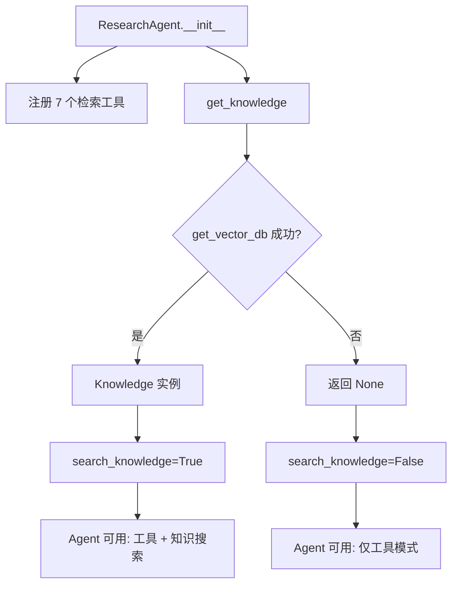
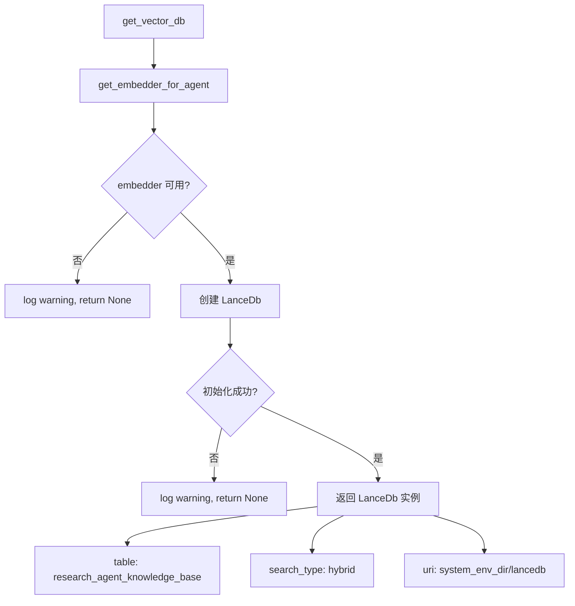
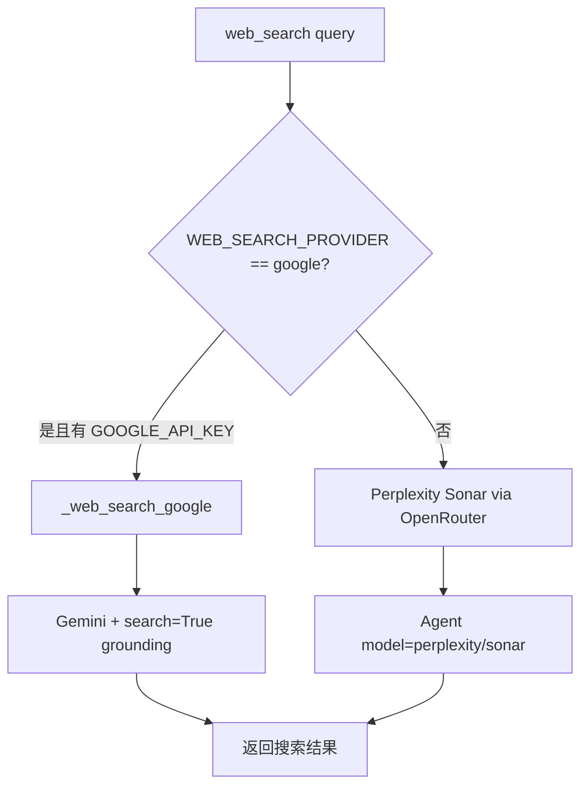

# PD-08.09 ValueCell — 多源金融检索与 LanceDB 混合搜索

> 文档编号：PD-08.09
> 来源：ValueCell `python/valuecell/agents/research_agent/`
> GitHub：https://github.com/ValueCell-ai/valuecell.git
> 问题域：PD-08 搜索与检索 Search & Retrieval
> 状态：可复用方案

---

## 第 1 章 问题与动机

### 1.1 核心问题

金融研究 Agent 需要同时访问多种异构数据源——美股 SEC 文件（10-K/10-Q/8-K）、A 股财报（巨潮资讯）、加密货币项目数据（RootData）、通用 Web 搜索——并将检索到的文档自动导入向量知识库，支持后续语义检索。核心挑战：

1. **数据源异构性**：SEC 用 `edgar` 库、A 股用 CNINFO HTTP API、Crypto 用 Playwright 浏览器自动化、Web 搜索用 LLM-as-Search（Gemini/Perplexity），四种数据源的接入方式完全不同
2. **嵌入后端多样性**：不同部署环境可用的嵌入服务不同（OpenAI/Google/SiliconFlow/Azure/Ollama），需要统一接口且支持运行时切换
3. **向量库可选性**：嵌入服务不可用时，Agent 仍需提供工具调用能力，不能因为向量库初始化失败而整体崩溃

### 1.2 ValueCell 的解法概述

1. **7 工具统一注册**：ResearchAgent 将 7 个检索工具（SEC 周期性/事件性、A 股、Web 搜索、Crypto 项目/VC/人物）统一注册到 agno Agent，由 LLM 自主选择调用（`core.py:33-41`）
2. **LanceDB Hybrid Search**：向量库配置为 `SearchType.hybrid`，同时使用向量相似度和 BM25 全文检索（`vdb.py:45`）
3. **懒初始化 + 优雅降级**：`get_vector_db()` 和 `get_knowledge()` 均返回 `Optional`，嵌入不可用时自动禁用知识搜索，Agent 退化为纯工具模式（`vdb.py:23-53`, `knowledge.py:15-43`）
4. **三层配置驱动嵌入选择**：YAML + .env + 环境变量三级优先级，支持 9 种 Provider 的嵌入后端自动发现和降级（`factory.py:1071-1098`）
5. **检索即导入**：每次工具调用获取的文档自动转 Markdown/PDF 并写入 LanceDB，知识库随使用持续增长（`sources.py:85-126`）

### 1.3 设计思想

| 设计原则 | 具体实现 | 理由 | 替代方案 |
|----------|----------|------|----------|
| LLM 自主路由 | 7 个工具注册到 Agent，由 LLM 根据 query 选择 | 避免硬编码路由规则，适应开放域金融问题 | 关键词匹配路由、分类器路由 |
| 向量库可选 | `get_vector_db()` 返回 None 时 Agent 仍可运行 | 降低部署门槛，无嵌入 API 也能用 | 强制要求嵌入配置 |
| 检索即导入 | `_write_and_ingest()` 在获取文档后立即写入知识库 | 知识库自动积累，无需单独导入步骤 | 批量离线导入 |
| 三层配置 | YAML < .env < 环境变量 | 开发用 YAML 默认值，生产用环境变量覆盖 | 单一配置文件 |
| Provider 降级链 | `ModelFactory.create_embedder()` 自动遍历可用 Provider | 单一 Provider 不可用时自动切换 | 手动指定 Provider |

---

## 第 2 章 源码实现分析

### 2.1 架构概览

```
┌──────────────────────────────────────────────────────────────────┐
│                     ResearchAgent (core.py)                       │
│  ┌────────────────────────────────────────────────────────────┐  │
│  │  agno.Agent(tools=[7个工具], knowledge=Optional[Knowledge])│  │
│  └──────────────┬─────────────────────┬───────────────────────┘  │
│                 │                     │                           │
│     ┌───────────▼──────────┐  ┌──────▼──────────┐               │
│     │   Tool Layer (7个)    │  │  Knowledge Layer │               │
│     │                      │  │                  │               │
│     │ • SEC periodic/event │  │ get_knowledge()  │               │
│     │ • A-share filings    │  │   → LanceDB      │               │
│     │ • web_search         │  │   → hybrid search│               │
│     │ • crypto project/vc  │  │   → max_results=10│              │
│     └──────────┬───────────┘  └────────┬─────────┘               │
│                │                       │                         │
│     ┌──────────▼───────────────────────▼─────────┐               │
│     │        Knowledge Ingestion Pipeline         │               │
│     │  _write_and_ingest() / insert_*_to_knowledge│               │
│     └──────────────────────┬──────────────────────┘               │
│                            │                                     │
│     ┌──────────────────────▼──────────────────────┐               │
│     │          Embedder (Multi-Provider)           │               │
│     │  ModelFactory → Provider → create_embedder() │               │
│     │  9 providers: OpenRouter/Google/SiliconFlow/  │               │
│     │  OpenAI/Azure/DashScope/Ollama/DeepSeek/...  │               │
│     └──────────────────────────────────────────────┘               │
└──────────────────────────────────────────────────────────────────┘
```

### 2.2 核心实现

#### 2.2.1 ResearchAgent 工具注册与知识库条件启用



对应源码 `python/valuecell/agents/research_agent/core.py:30-60`：

```python
class ResearchAgent(BaseAgent):
    def __init__(self, **kwargs):
        super().__init__(**kwargs)
        tools = [
            fetch_periodic_sec_filings,
            fetch_event_sec_filings,
            fetch_ashare_filings,
            web_search,
            search_crypto_projects,
            search_crypto_vcs,
            search_crypto_people,
        ]
        knowledge = get_knowledge()
        self.knowledge_research_agent = Agent(
            model=model_utils_mod.get_model_for_agent("research_agent"),
            tools=tools,
            knowledge=knowledge,
            search_knowledge=knowledge is not None,
            add_datetime_to_context=True,
            num_history_runs=3,
        )
```

关键点：`search_knowledge=knowledge is not None` 实现了条件启用——当嵌入不可用时，`knowledge` 为 None，Agent 自动跳过知识搜索，仅依赖工具调用。

#### 2.2.2 LanceDB 向量库懒初始化与 Hybrid Search



对应源码 `python/valuecell/agents/research_agent/vdb.py:23-53`：

```python
def get_vector_db() -> Optional[LanceDb]:
    try:
        embedder = model_utils_mod.get_embedder_for_agent("research_agent")
    except Exception as e:
        logger.warning(
            "ResearchAgent embeddings unavailable; disabling knowledge search. Error: {}", e,
        )
        return None
    try:
        return LanceDb(
            table_name="research_agent_knowledge_base",
            uri=resolve_lancedb_uri(),
            embedder=embedder,
            search_type=SearchType.hybrid,
            use_tantivy=False,
        )
    except Exception as e:
        logger.warning("Failed to initialize LanceDb; disabling knowledge. Error: {}", e)
        return None
```

`SearchType.hybrid` 表示同时使用向量相似度搜索和 BM25 关键词搜索。`use_tantivy=False` 禁用了 Tantivy 全文索引引擎（可能因为 LanceDB 内置的 BM25 已足够）。

#### 2.2.3 Web 搜索双 Provider 路由



对应源码 `python/valuecell/agents/research_agent/sources.py:245-299`：

```python
async def web_search(query: str) -> str:
    if os.getenv("WEB_SEARCH_PROVIDER", "google").lower() == "google" and os.getenv("GOOGLE_API_KEY"):
        return await _web_search_google(query)
    # Fallback: Perplexity Sonar via OpenRouter
    model = create_model_with_provider(
        provider="openrouter", model_id="perplexity/sonar", max_tokens=None,
    )
    response = await Agent(model=model).arun(query)
    return response.content

async def _web_search_google(query: str) -> str:
    model = create_model_with_provider(
        provider="google", model_id="gemini-2.5-flash", search=True,
    )
    response = await Agent(model=model).arun(query)
    return response.content
```

这里的 `search=True` 启用了 Google Gemini 的 Search Grounding 功能，让 LLM 直接访问实时搜索结果。Perplexity Sonar 作为默认降级方案，通过 OpenRouter 代理访问。

### 2.3 实现细节

#### 检索即导入管线

SEC 文件获取后立即转 Markdown 并写入知识库（`sources.py:85-126`）：

```python
async def _write_and_ingest(filings, knowledge_dir):
    for filing in filings:
        try:
            content = filing.document.markdown()
        except Exception:
            try:
                content = str(filing.document)
            except Exception:
                content = ""
        # 写入本地文件
        async with aiofiles.open(path, "w", encoding="utf-8") as file:
            await file.write(content)
        # 立即导入知识库
        await insert_md_file_to_knowledge(
            name=file_name, path=path, metadata=metadata.__dict__
        )
```

A 股 PDF 文件则通过 URL 直接导入（`sources.py:348-349`）：

```python
await insert_pdf_file_to_knowledge(url=pdf_url, metadata=metadata.__dict__)
```

知识库导入使用 MarkdownChunking 策略分块（`knowledge.py:46-47`）：

```python
md_reader = MarkdownReader(chunking_strategy=MarkdownChunking())
pdf_reader = PDFReader(chunking_strategy=MarkdownChunking())
```

#### 9-Provider 嵌入工厂降级链

`ModelFactory` 在 `factory.py:590-612` 注册了 9 种 Provider：

```python
class ModelFactory:
    _providers: Dict[str, type[ModelProvider]] = {
        "openrouter": OpenRouterProvider,
        "google": GoogleProvider,
        "azure": AzureProvider,
        "siliconflow": SiliconFlowProvider,
        "openai": OpenAIProvider,
        "openai-compatible": OpenAICompatibleProvider,
        "deepseek": DeepSeekProvider,
        "dashscope": DashScopeProvider,
        "ollama": OllamaProvider,
    }
```

嵌入 Provider 自动发现逻辑（`factory.py:1071-1098`）：先检查主 Provider 是否有嵌入支持，否则遍历所有已启用 Provider 找到第一个有 `default_embedding_model` 配置的。

#### A 股 CNINFO 季度过滤

A 股财报通过正则从中文标题中提取季度信息（`sources.py:42-66`）：

```python
quarter_patterns = [
    (r"第一季度|一季度|1季度|Q1", 1),
    (r"第二季度|二季度|2季度|Q2|半年度|中期", 2),
    (r"第三季度|三季度|3季度|Q3", 3),
    (r"第四季度|四季度|4季度|Q4|年度报告|年报", 4),
]
```

#### LanceDB 路径迁移

`resolve_lancedb_uri()` 支持从旧的仓库根目录一次性迁移到系统目录（`db.py:38-68`），确保升级时数据不丢失。


---

## 第 3 章 迁移指南

### 3.1 迁移清单

**阶段 1：向量库基础设施**
- [ ] 安装 LanceDB：`pip install lancedb`
- [ ] 安装 agno 框架：`pip install agno`
- [ ] 配置嵌入 Provider（至少一个）：设置对应 API Key 环境变量
- [ ] 创建 `get_vector_db()` 懒初始化函数，返回 `Optional[LanceDb]`

**阶段 2：知识库管理层**
- [ ] 实现 `Knowledge` 单例缓存（`_knowledge_cache` 模式）
- [ ] 实现 Markdown/PDF Reader + MarkdownChunking 分块策略
- [ ] 实现 `insert_*_to_knowledge()` 异步导入函数

**阶段 3：数据源接入**
- [ ] 按需接入数据源（SEC/A股/Web/Crypto），每个数据源一个 async 函数
- [ ] 每个数据源函数末尾调用 `insert_*_to_knowledge()` 实现检索即导入
- [ ] 实现 Web 搜索双 Provider 路由（Google Gemini + Perplexity 降级）

**阶段 4：Agent 集成**
- [ ] 将所有数据源函数注册为 Agent 工具
- [ ] 条件启用知识搜索：`search_knowledge=knowledge is not None`

### 3.2 适配代码模板

以下是一个可直接复用的最小化向量知识库 + 懒初始化模板：

```python
"""Minimal reusable template: LanceDB hybrid search with graceful degradation."""
from typing import Optional
from agno.vectordb.lancedb import LanceDb
from agno.vectordb.search import SearchType
from agno.knowledge.knowledge import Knowledge
from agno.knowledge.chunking.markdown import MarkdownChunking
from agno.knowledge.reader.markdown_reader import MarkdownReader
from loguru import logger


def create_vector_db(
    table_name: str,
    uri: str,
    embedder_fn,  # Callable that returns an Embedder or raises
) -> Optional[LanceDb]:
    """Create LanceDB with hybrid search, or None if embedder unavailable."""
    try:
        embedder = embedder_fn()
    except Exception as e:
        logger.warning(f"Embedder unavailable, disabling knowledge: {e}")
        return None
    try:
        return LanceDb(
            table_name=table_name,
            uri=uri,
            embedder=embedder,
            search_type=SearchType.hybrid,
        )
    except Exception as e:
        logger.warning(f"LanceDb init failed: {e}")
        return None


_knowledge: Optional[Knowledge] = None

def get_knowledge(vdb: Optional[LanceDb]) -> Optional[Knowledge]:
    """Singleton Knowledge with graceful degradation."""
    global _knowledge
    if _knowledge is not None:
        return _knowledge
    if vdb is None:
        return None
    _knowledge = Knowledge(vector_db=vdb, max_results=10)
    return _knowledge


# Usage in Agent setup:
# vdb = create_vector_db("my_table", "/path/to/lancedb", my_embedder_fn)
# knowledge = get_knowledge(vdb)
# agent = Agent(tools=[...], knowledge=knowledge, search_knowledge=knowledge is not None)
```

### 3.3 适用场景

| 场景 | 适用度 | 说明 |
|------|--------|------|
| 金融研究 Agent（多数据源） | ⭐⭐⭐ | 完美匹配：SEC/A股/Crypto/Web 多源检索 + 知识积累 |
| 通用 RAG 应用 | ⭐⭐⭐ | LanceDB hybrid search + 懒初始化模式可直接复用 |
| 嵌入服务不稳定的环境 | ⭐⭐⭐ | 优雅降级设计确保 Agent 不因嵌入失败而崩溃 |
| 需要多嵌入 Provider 切换 | ⭐⭐⭐ | 9-Provider 工厂 + 自动降级链 |
| 纯搜索（无向量库需求） | ⭐⭐ | 可以只用工具层，跳过知识库部分 |
| 高并发实时检索 | ⭐ | 单例 Knowledge + 同步写入，不适合高并发场景 |

---

## 第 4 章 测试用例

```python
"""Tests for ValueCell search & retrieval patterns."""
import pytest
from unittest.mock import AsyncMock, MagicMock, patch
from dataclasses import dataclass
from pathlib import Path
from typing import Optional


# --- Test: Vector DB graceful degradation ---

class TestVectorDbGracefulDegradation:
    """Test that get_vector_db returns None when embedder is unavailable."""

    @patch("valuecell.utils.model.get_embedder_for_agent")
    def test_returns_none_when_embedder_fails(self, mock_get_embedder):
        mock_get_embedder.side_effect = RuntimeError("No API key")
        from valuecell.agents.research_agent.vdb import get_vector_db
        result = get_vector_db()
        assert result is None

    @patch("valuecell.utils.model.get_embedder_for_agent")
    @patch("valuecell.agents.research_agent.vdb.LanceDb")
    def test_returns_none_when_lancedb_init_fails(self, mock_lancedb, mock_embedder):
        mock_embedder.return_value = MagicMock()
        mock_lancedb.side_effect = Exception("LanceDB init error")
        from valuecell.agents.research_agent.vdb import get_vector_db
        result = get_vector_db()
        assert result is None

    @patch("valuecell.utils.model.get_embedder_for_agent")
    @patch("valuecell.agents.research_agent.vdb.LanceDb")
    def test_returns_lancedb_when_all_ok(self, mock_lancedb, mock_embedder):
        mock_embedder.return_value = MagicMock()
        mock_lancedb.return_value = MagicMock()
        from valuecell.agents.research_agent.vdb import get_vector_db
        result = get_vector_db()
        assert result is not None
        mock_lancedb.assert_called_once()


# --- Test: Knowledge singleton caching ---

class TestKnowledgeSingleton:
    """Test that Knowledge is lazily created and cached."""

    def test_returns_none_when_vdb_none(self):
        from valuecell.agents.research_agent import knowledge as k_mod
        k_mod._knowledge_cache = None  # reset
        with patch.object(k_mod, "get_vector_db", return_value=None):
            result = k_mod.get_knowledge()
            assert result is None

    def test_caches_knowledge_instance(self):
        from valuecell.agents.research_agent import knowledge as k_mod
        mock_knowledge = MagicMock()
        k_mod._knowledge_cache = mock_knowledge
        result = k_mod.get_knowledge()
        assert result is mock_knowledge


# --- Test: Web search provider routing ---

class TestWebSearchRouting:
    """Test dual-provider web search routing."""

    @pytest.mark.asyncio
    @patch.dict("os.environ", {"WEB_SEARCH_PROVIDER": "google", "GOOGLE_API_KEY": "test-key"})
    @patch("valuecell.agents.research_agent.sources._web_search_google")
    async def test_routes_to_google_when_configured(self, mock_google):
        mock_google.return_value = "Google result"
        from valuecell.agents.research_agent.sources import web_search
        result = await web_search("test query")
        mock_google.assert_called_once_with("test query")
        assert result == "Google result"

    @pytest.mark.asyncio
    @patch.dict("os.environ", {"WEB_SEARCH_PROVIDER": "perplexity"}, clear=False)
    @patch("valuecell.agents.research_agent.sources.create_model_with_provider")
    @patch("valuecell.agents.research_agent.sources.Agent")
    async def test_falls_back_to_perplexity(self, mock_agent_cls, mock_create):
        mock_agent = MagicMock()
        mock_agent.arun = AsyncMock(return_value=MagicMock(content="Perplexity result"))
        mock_agent_cls.return_value = mock_agent
        from valuecell.agents.research_agent.sources import web_search
        result = await web_search("test query")
        mock_create.assert_called_once_with(
            provider="openrouter", model_id="perplexity/sonar", max_tokens=None,
        )


# --- Test: Quarter extraction from Chinese titles ---

class TestQuarterExtraction:
    def test_extracts_q1(self):
        from valuecell.agents.research_agent.sources import _extract_quarter_from_title
        assert _extract_quarter_from_title("2024年第一季度报告") == 1
        assert _extract_quarter_from_title("Q1 Report") == 1

    def test_extracts_q4_from_annual(self):
        from valuecell.agents.research_agent.sources import _extract_quarter_from_title
        assert _extract_quarter_from_title("2024年年度报告") == 4

    def test_returns_none_for_unknown(self):
        from valuecell.agents.research_agent.sources import _extract_quarter_from_title
        assert _extract_quarter_from_title("公司公告") is None
        assert _extract_quarter_from_title("") is None
```


---

## 第 5 章 跨域关联

| 关联域 | 关系类型 | 说明 |
|--------|----------|------|
| PD-01 上下文管理 | 协同 | `num_history_runs=3` + `enable_session_summaries=True` 控制对话历史注入量，与知识检索结果共同竞争上下文窗口 |
| PD-03 容错与重试 | 依赖 | `get_vector_db()` 的双层 try-except 和 `_write_and_ingest()` 的 markdown→str→空字符串三级降级是容错模式的典型应用 |
| PD-04 工具系统 | 依赖 | 7 个检索工具通过 agno Agent 的 `tools=[]` 参数注册，LLM 自主选择调用，工具系统是搜索能力的载体 |
| PD-06 记忆持久化 | 协同 | LanceDB 持久化到 `system_env_dir/lancedb`，检索即导入模式使知识库成为长期记忆的一部分 |
| PD-11 可观测性 | 协同 | `ToolCallStarted`/`ToolCallCompleted` 事件流（`core.py:88-95`）为搜索工具调用提供可观测性 |

---

## 第 6 章 来源文件索引

| 文件 | 行范围 | 关键实现 |
|------|--------|----------|
| `python/valuecell/agents/research_agent/core.py` | L30-L98 | ResearchAgent 类定义，7 工具注册，知识库条件启用，流式事件分发 |
| `python/valuecell/agents/research_agent/vdb.py` | L23-L53 | `get_vector_db()` 懒初始化，LanceDB hybrid search 配置 |
| `python/valuecell/agents/research_agent/knowledge.py` | L15-L78 | `get_knowledge()` 单例缓存，Markdown/PDF Reader，异步导入函数 |
| `python/valuecell/agents/research_agent/sources.py` | L85-L126 | `_write_and_ingest()` SEC 文件检索即导入管线 |
| `python/valuecell/agents/research_agent/sources.py` | L245-L299 | `web_search()` 双 Provider 路由（Google Gemini / Perplexity） |
| `python/valuecell/agents/research_agent/sources.py` | L405-L571 | `_fetch_cninfo_data()` A 股 CNINFO API 数据获取 |
| `python/valuecell/agents/research_agent/sources.py` | L622-L709 | `fetch_ashare_filings()` A 股财报检索入口 |
| `python/valuecell/agents/research_agent/sources.py` | L717-L831 | Crypto 数据源（RootData 项目/VC/人物搜索） |
| `python/valuecell/agents/research_agent/schemas.py` | L1-L42 | SECFilingMetadata/Result, AShareFilingMetadata/Result 数据类 |
| `python/valuecell/adapters/models/factory.py` | L590-L612 | ModelFactory 9-Provider 注册表 |
| `python/valuecell/adapters/models/factory.py` | L879-L969 | `create_embedder_for_agent()` Agent 级嵌入创建与降级 |
| `python/valuecell/adapters/models/factory.py` | L1071-L1098 | `_find_embedding_provider()` 嵌入 Provider 自动发现 |
| `python/valuecell/utils/db.py` | L38-L68 | `resolve_lancedb_uri()` LanceDB 路径解析与迁移 |
| `python/configs/agents/research_agent.yaml` | L1-L47 | 三层配置：模型 ID、Provider、嵌入维度、环境变量覆盖 |
| `python/configs/config.yaml` | L1-L67 | 全局配置：Provider 注册表、API Key 环境变量映射 |

---

## 第 7 章 横向对比维度

```json comparison_data
{
  "project": "ValueCell",
  "dimensions": {
    "搜索架构": "LLM 自主路由 7 工具 + LanceDB hybrid search（向量+BM25）",
    "去重机制": "LanceDB 表级去重，同名文件覆盖写入",
    "结果处理": "检索即导入：工具获取文档后立即写入向量库",
    "容错策略": "双层 try-except 懒初始化，嵌入不可用时退化为纯工具模式",
    "成本控制": "Web 搜索用 LLM-as-Search 替代传统 API，嵌入用 SiliconFlow 低成本模型",
    "检索方式": "LanceDB SearchType.hybrid（向量相似度 + BM25 全文）",
    "扩展性": "9-Provider 工厂模式，新增 Provider 只需继承 ModelProvider 基类",
    "搜索源热切换": "WEB_SEARCH_PROVIDER 环境变量切换 Google/Perplexity",
    "嵌入后端适配": "ModelFactory 9 种 Provider 统一 create_embedder() 接口",
    "索引结构": "LanceDB 单表 research_agent_knowledge_base，hybrid 模式",
    "金融数据源集成": "SEC EDGAR + CNINFO A股 + RootData Crypto 三大金融数据源",
    "文档格式转换": "SEC filing.document.markdown() + PDF URL 直接导入"
  }
}
```

### 域元数据补充

```json domain_metadata
{
  "solution_summary": "ValueCell 用 LLM 自主路由 7 个金融检索工具（SEC/A股/Crypto/Web）+ LanceDB hybrid search，9-Provider 嵌入工厂支持运行时降级，检索即导入模式自动积累知识库",
  "description": "金融多源异构数据的统一检索与自动知识积累",
  "sub_problems": [
    "LLM-as-Search：用 LLM 的搜索 grounding 能力替代传统搜索 API 的可行性与成本权衡",
    "金融数据源认证：SEC EDGAR 身份配置、CNINFO 反爬 Header 伪装、RootData Playwright 自动化的差异化接入",
    "检索即导入一致性：工具调用获取文档后立即写入向量库时的幂等性和并发安全"
  ],
  "best_practices": [
    "向量库懒初始化返回 Optional：嵌入不可用时 Agent 退化为纯工具模式，不阻塞启动",
    "LLM 自主路由优于硬编码：将多个检索工具注册给 Agent 由 LLM 选择，比关键词匹配路由更灵活",
    "三层配置驱动嵌入选择：YAML 默认值 + .env 开发覆盖 + 环境变量生产覆盖，一套代码适配多环境"
  ]
}
```
