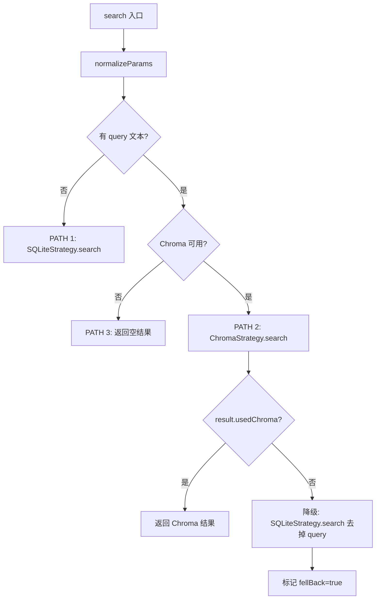
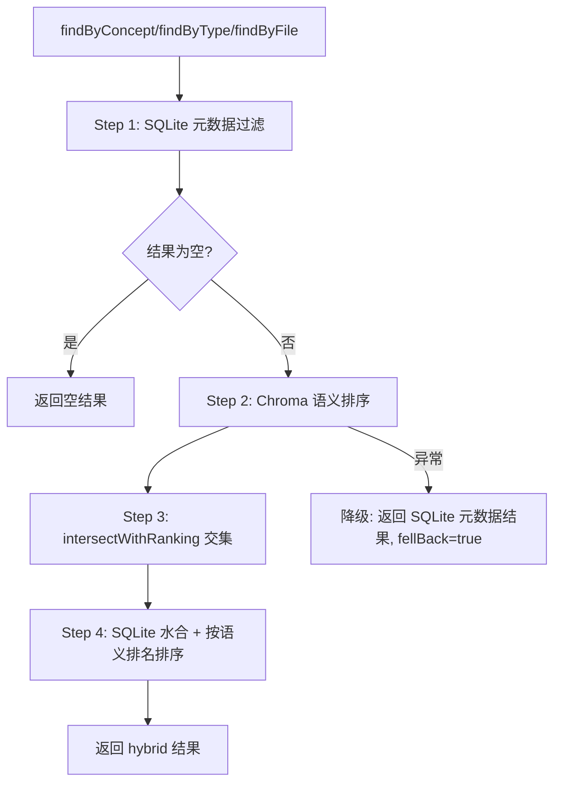
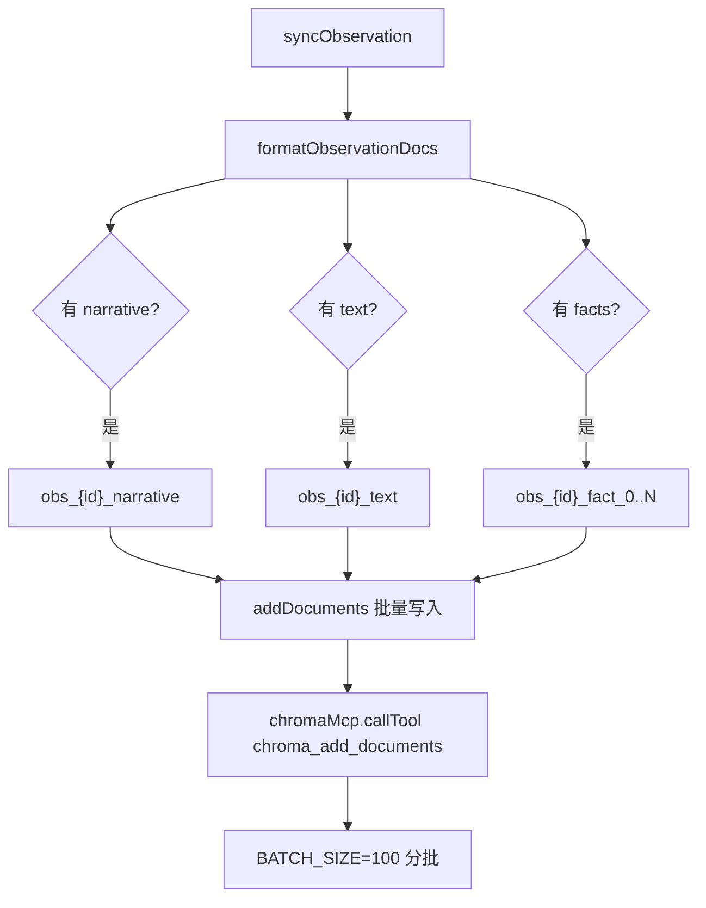

# PD-08.11 claude-mem — 混合搜索与 MCP 向量同步方案

> 文档编号：PD-08.11
> 来源：claude-mem `src/services/worker/search/SearchOrchestrator.ts`
> GitHub：https://github.com/thedotmack/claude-mem.git
> 问题域：PD-08 搜索与检索 Search & Retrieval
> 状态：可复用方案

---

## 第 1 章 问题与动机

### 1.1 核心问题

Agent 记忆系统需要同时支持两种检索模式：**结构化过滤**（按概念、类型、文件、日期精确筛选）和**语义搜索**（自然语言查询找到语义相关的记忆）。单一引擎无法兼顾：SQLite 擅长结构化过滤但不支持语义相似度，ChromaDB 擅长向量检索但元数据过滤能力有限。

更关键的问题是：向量数据库的可用性不可靠。ChromaDB 作为外部依赖可能因进程崩溃、连接超时、平台兼容性（如 Windows 上 FTS5 不可用）等原因不可用。搜索系统必须在向量引擎不可用时仍能提供有意义的结果。

### 1.2 claude-mem 的解法概述

claude-mem 实现了一个三策略搜索架构，通过 SearchOrchestrator 协调策略选择与回退：

1. **ChromaSearchStrategy** — 纯语义向量搜索，通过 MCP 协议与 chroma-mcp 子进程通信，90 天时间窗口过滤 + 按文档类型分类 + SQLite 水合（`src/services/worker/search/strategies/ChromaSearchStrategy.ts:1`）
2. **SQLiteSearchStrategy** — 纯结构化过滤搜索，直接查询 SQLite，支持 project/type/date/concept/file 多维过滤（`src/services/worker/search/strategies/SQLiteSearchStrategy.ts:1`）
3. **HybridSearchStrategy** — 混合策略：先 SQLite 元数据过滤获取候选集，再 Chroma 语义排序，交集保留语义排名顺序（`src/services/worker/search/strategies/HybridSearchStrategy.ts:1`）
4. **SearchOrchestrator** — 三路径决策树：无查询文本走 SQLite，有查询文本且 Chroma 可用走 Chroma，Chroma 失败自动降级到 SQLite（`src/services/worker/search/SearchOrchestrator.ts:81-121`）
5. **ChromaSync** — 粒度化文档同步：每个 observation 的 narrative/text/facts 拆分为独立向量文档，通过 MCP 协议批量写入 ChromaDB（`src/services/sync/ChromaSync.ts:122-183`）

### 1.3 设计思想

| 设计原则 | 具体实现 | 理由 | 替代方案 |
|----------|----------|------|----------|
| 策略模式解耦 | SearchStrategy 接口 + 3 个策略实现 | 每种搜索路径独立演进，新增策略不影响已有逻辑 | 单一搜索类内 if-else 分支 |
| 向量引擎可选 | Chroma 通过 MCP 子进程连接，不可用时整个搜索栈仍工作 | 向量搜索是增强而非必需，降低部署门槛 | 硬依赖向量数据库 |
| 粒度化向量文档 | 一个 observation 拆分为 narrative/text/fact_0..N 多个 Chroma 文档 | 每个语义单元独立嵌入，提高检索精度 | 整个 observation 作为单一文档 |
| SQLite 作为真相源 | Chroma 只存 ID 和元数据，完整数据从 SQLite 水合 | 避免数据不一致，SQLite 是持久化层 | Chroma 存完整文档 |
| MCP 协议通信 | ChromaMcpManager 通过 stdio MCP 与 chroma-mcp 交互 | 消除 chromadb npm 包和 ONNX/WASM 依赖 | 直接 HTTP API 调用 |
| 交集排序 | Hybrid 策略先 SQLite 过滤再 Chroma 排序，取交集 | 精确过滤 + 语义排序两全 | 先 Chroma 搜索再 SQLite 过滤 |

---

## 第 2 章 源码实现分析

### 2.1 架构概览

claude-mem 的搜索架构分为四层：编排层、策略层、引擎层、同步层。

```
┌─────────────────────────────────────────────────────────┐
│                  SearchOrchestrator                      │
│  ┌──────────┐  ┌──────────┐  ┌──────────────────────┐  │
│  │ normalize │→│ decision │→│ executeWithFallback   │  │
│  │  Params   │  │   tree   │  │ PATH1→SQLite         │  │
│  │           │  │          │  │ PATH2→Chroma→SQLite  │  │
│  │           │  │          │  │ PATH3→empty           │  │
│  └──────────┘  └──────────┘  └──────────────────────┘  │
├─────────────────────────────────────────────────────────┤
│  ChromaSearch    SQLiteSearch    HybridSearch            │
│  Strategy        Strategy        Strategy                │
│  (semantic)      (filter-only)   (filter+rank)           │
├─────────────────────────────────────────────────────────┤
│  ChromaSync ←──MCP stdio──→ chroma-mcp (uvx subprocess) │
│  SessionSearch ←──bun:sqlite──→ SQLite (WAL mode)        │
├─────────────────────────────────────────────────────────┤
│  ChromaMcpManager (singleton, lazy-connect, auto-reconnect) │
└─────────────────────────────────────────────────────────┘
```

### 2.2 核心实现

#### 2.2.1 SearchOrchestrator 三路径决策树



对应源码 `src/services/worker/search/SearchOrchestrator.ts:81-121`：

```typescript
private async executeWithFallback(
  options: NormalizedParams
): Promise<StrategySearchResult> {
  // PATH 1: FILTER-ONLY (no query text) - Use SQLite
  if (!options.query) {
    logger.debug('SEARCH', 'Orchestrator: Filter-only query, using SQLite', {});
    return await this.sqliteStrategy.search(options);
  }

  // PATH 2: CHROMA SEMANTIC SEARCH (query text + Chroma available)
  if (this.chromaStrategy) {
    logger.debug('SEARCH', 'Orchestrator: Using Chroma semantic search', {});
    const result = await this.chromaStrategy.search(options);

    // If Chroma succeeded (even with 0 results), return
    if (result.usedChroma) {
      return result;
    }

    // Chroma failed - fall back to SQLite for filter-only
    logger.debug('SEARCH', 'Orchestrator: Chroma failed, falling back to SQLite', {});
    const fallbackResult = await this.sqliteStrategy.search({
      ...options,
      query: undefined // Remove query for SQLite fallback
    });

    return {
      ...fallbackResult,
      fellBack: true
    };
  }

  // PATH 3: No Chroma available
  return {
    results: { observations: [], sessions: [], prompts: [] },
    usedChroma: false,
    fellBack: false,
    strategy: 'sqlite'
  };
}
```

#### 2.2.2 HybridSearchStrategy 四步交集排序



对应源码 `src/services/worker/search/strategies/HybridSearchStrategy.ts:64-124`：

```typescript
async findByConcept(
  concept: string,
  options: StrategySearchOptions
): Promise<StrategySearchResult> {
  const { limit = SEARCH_CONSTANTS.DEFAULT_LIMIT, project, dateRange, orderBy } = options;
  const filterOptions = { limit, project, dateRange, orderBy };

  try {
    // Step 1: SQLite metadata filter
    const metadataResults = this.sessionSearch.findByConcept(concept, filterOptions);
    if (metadataResults.length === 0) {
      return this.emptyResult('hybrid');
    }

    // Step 2: Chroma semantic ranking
    const ids = metadataResults.map(obs => obs.id);
    const chromaResults = await this.chromaSync.queryChroma(
      concept,
      Math.min(ids.length, SEARCH_CONSTANTS.CHROMA_BATCH_SIZE)
    );

    // Step 3: Intersect - keep only IDs from metadata, in Chroma rank order
    const rankedIds = this.intersectWithRanking(ids, chromaResults.ids);

    // Step 4: Hydrate in semantic rank order
    if (rankedIds.length > 0) {
      const observations = this.sessionStore.getObservationsByIds(rankedIds, { limit });
      observations.sort((a, b) => rankedIds.indexOf(a.id) - rankedIds.indexOf(b.id));
      return {
        results: { observations, sessions: [], prompts: [] },
        usedChroma: true,
        fellBack: false,
        strategy: 'hybrid'
      };
    }
    return this.emptyResult('hybrid');
  } catch (error) {
    // Fall back to metadata-only results
    const results = this.sessionSearch.findByConcept(concept, filterOptions);
    return {
      results: { observations: results, sessions: [], prompts: [] },
      usedChroma: false,
      fellBack: true,
      strategy: 'hybrid'
    };
  }
}
```

#### 2.2.3 ChromaSync 粒度化文档同步



对应源码 `src/services/sync/ChromaSync.ts:122-183`：

```typescript
private formatObservationDocs(obs: StoredObservation): ChromaDocument[] {
  const documents: ChromaDocument[] = [];
  const facts = obs.facts ? JSON.parse(obs.facts) : [];
  const concepts = obs.concepts ? JSON.parse(obs.concepts) : [];
  const baseMetadata: Record<string, string | number> = {
    sqlite_id: obs.id,
    doc_type: 'observation',
    memory_session_id: obs.memory_session_id,
    project: obs.project,
    created_at_epoch: obs.created_at_epoch,
    type: obs.type || 'discovery',
    title: obs.title || 'Untitled'
  };

  // Narrative as separate document
  if (obs.narrative) {
    documents.push({
      id: `obs_${obs.id}_narrative`,
      document: obs.narrative,
      metadata: { ...baseMetadata, field_type: 'narrative' }
    });
  }

  // Each fact as separate document
  facts.forEach((fact: string, index: number) => {
    documents.push({
      id: `obs_${obs.id}_fact_${index}`,
      document: fact,
      metadata: { ...baseMetadata, field_type: 'fact', fact_index: index }
    });
  });

  return documents;
}
```

### 2.3 实现细节

**ChromaMcpManager 连接管理**（`src/services/sync/ChromaMcpManager.ts:56-176`）：

- **单例模式**：全局唯一实例，避免多个 MCP 连接
- **懒连接**：首次 `callTool()` 时才建立连接
- **连接锁**：`this.connecting` Promise 防止并发连接
- **退避重连**：失败后 10 秒内不重试（`RECONNECT_BACKOFF_MS`）
- **传输错误重试**：`callTool()` 遇到传输错误时自动重连并重试一次（`ChromaMcpManager.ts:247-275`）
- **僵尸进程防护**：连接超时后主动 kill 子进程（`ChromaMcpManager.ts:142-154`）
- **stale onclose 防护**：通过引用检查防止旧 transport 的 onclose 覆盖当前连接状态（`ChromaMcpManager.ts:164-175`）

**Chroma 查询去重**（`src/services/sync/ChromaSync.ts:706-743`）：

一个 SQLite observation 在 Chroma 中对应多个文档（narrative + facts），查询时需要去重。`queryChroma()` 通过正则从文档 ID 提取 sqlite_id，用 `seen` Set 去重，保留首次出现（最高排名）的距离和元数据。

**智能回填**（`src/services/sync/ChromaSync.ts:517-681`）：

`ensureBackfilled()` 先从 Chroma 获取已有文档的 sqlite_id 集合，再用 `NOT IN` 排除已同步的记录，只同步缺失的数据。避免全量重建的开销。


---

## 第 3 章 迁移指南

### 3.1 迁移清单

**阶段 1：基础搜索层（SQLite）**
- [ ] 定义 `SearchStrategy` 接口（`canHandle`, `search`, `name`）
- [ ] 实现 `SQLiteSearchStrategy`：支持 project/type/date/concept/file 过滤
- [ ] 实现 `SessionSearch` 类：FTS5 表创建 + 结构化过滤查询
- [ ] 实现 `SearchOrchestrator`：参数归一化 + PATH 1 (filter-only)

**阶段 2：向量搜索层（Chroma via MCP）**
- [ ] 实现 `ChromaMcpManager`：单例 + 懒连接 + 退避重连 + 传输错误重试
- [ ] 实现 `ChromaSync`：粒度化文档格式化 + 批量写入 + 智能回填
- [ ] 实现 `ChromaSearchStrategy`：语义搜索 + 90 天时间窗口 + 文档类型分类 + SQLite 水合
- [ ] 扩展 `SearchOrchestrator`：PATH 2 (Chroma) + 降级逻辑

**阶段 3：混合搜索**
- [ ] 实现 `HybridSearchStrategy`：元数据过滤 → 语义排序 → 交集 → 水合
- [ ] 扩展 `SearchOrchestrator`：`findByConcept`/`findByType`/`findByFile` 路由到 Hybrid

### 3.2 适配代码模板

以下是可直接复用的策略模式搜索框架（TypeScript）：

```typescript
// === 策略接口 ===
interface SearchStrategy {
  readonly name: string;
  canHandle(options: SearchOptions): boolean;
  search(options: SearchOptions): Promise<SearchResult>;
}

abstract class BaseSearchStrategy implements SearchStrategy {
  abstract readonly name: string;
  abstract canHandle(options: SearchOptions): boolean;
  abstract search(options: SearchOptions): Promise<SearchResult>;

  protected emptyResult(strategy: string): SearchResult {
    return { results: [], usedVector: false, fellBack: false, strategy };
  }
}

// === 编排器 ===
class SearchOrchestrator {
  private vectorStrategy: VectorSearchStrategy | null;
  private filterStrategy: FilterSearchStrategy;
  private hybridStrategy: HybridSearchStrategy | null;

  constructor(
    filterStore: FilterStore,
    vectorSync: VectorSync | null
  ) {
    this.filterStrategy = new FilterSearchStrategy(filterStore);
    this.vectorStrategy = vectorSync
      ? new VectorSearchStrategy(vectorSync, filterStore)
      : null;
    this.hybridStrategy = vectorSync
      ? new HybridSearchStrategy(vectorSync, filterStore)
      : null;
  }

  async search(args: Record<string, any>): Promise<SearchResult> {
    const options = this.normalizeParams(args);

    // PATH 1: Filter-only
    if (!options.query) {
      return this.filterStrategy.search(options);
    }

    // PATH 2: Vector search with fallback
    if (this.vectorStrategy) {
      const result = await this.vectorStrategy.search(options);
      if (result.usedVector) return result;

      // Fallback: strip query, use filter-only
      const fallback = await this.filterStrategy.search({
        ...options,
        query: undefined
      });
      return { ...fallback, fellBack: true };
    }

    // PATH 3: No vector engine
    return { results: [], usedVector: false, fellBack: false, strategy: 'none' };
  }
}

// === 混合策略核心：交集排序 ===
function intersectWithRanking(
  filterIds: number[],
  vectorIds: number[]
): number[] {
  const filterSet = new Set(filterIds);
  const ranked: number[] = [];
  for (const id of vectorIds) {
    if (filterSet.has(id) && !ranked.includes(id)) {
      ranked.push(id);
    }
  }
  return ranked;
}
```

### 3.3 适用场景

| 场景 | 适用度 | 说明 |
|------|--------|------|
| Agent 记忆系统 | ⭐⭐⭐ | 核心场景：结构化记忆 + 语义检索 |
| 知识库搜索 | ⭐⭐⭐ | 多维过滤 + 语义相似度排序 |
| 日志/事件检索 | ⭐⭐ | 时间范围过滤 + 关键词语义搜索 |
| 代码搜索 | ⭐⭐ | 文件路径过滤 + 语义理解 |
| 实时搜索（低延迟） | ⭐ | MCP 子进程通信有额外延迟 |

---

## 第 4 章 测试用例

```typescript
import { describe, it, expect, vi, beforeEach } from 'vitest';

// === SearchOrchestrator 测试 ===
describe('SearchOrchestrator', () => {
  let orchestrator: SearchOrchestrator;
  let mockSqliteStrategy: any;
  let mockChromaStrategy: any;

  beforeEach(() => {
    mockSqliteStrategy = {
      search: vi.fn().mockResolvedValue({
        results: { observations: [{ id: 1 }], sessions: [], prompts: [] },
        usedChroma: false, fellBack: false, strategy: 'sqlite'
      })
    };
    mockChromaStrategy = {
      search: vi.fn().mockResolvedValue({
        results: { observations: [{ id: 2 }], sessions: [], prompts: [] },
        usedChroma: true, fellBack: false, strategy: 'chroma'
      })
    };
  });

  it('PATH 1: filter-only query routes to SQLite', async () => {
    const result = await orchestrator.search({ project: 'test' });
    expect(result.strategy).toBe('sqlite');
    expect(result.usedChroma).toBe(false);
  });

  it('PATH 2: query text routes to Chroma', async () => {
    const result = await orchestrator.search({ query: 'authentication' });
    expect(result.strategy).toBe('chroma');
    expect(result.usedChroma).toBe(true);
  });

  it('PATH 2 fallback: Chroma failure degrades to SQLite', async () => {
    mockChromaStrategy.search.mockResolvedValue({
      results: { observations: [], sessions: [], prompts: [] },
      usedChroma: false, fellBack: false, strategy: 'chroma'
    });
    const result = await orchestrator.search({ query: 'auth' });
    expect(result.fellBack).toBe(true);
    expect(result.strategy).toBe('sqlite');
  });
});

// === HybridSearchStrategy 测试 ===
describe('HybridSearchStrategy', () => {
  it('intersects metadata IDs with Chroma ranking', () => {
    const metadataIds = [1, 2, 3, 4, 5];
    const chromaIds = [3, 5, 1, 7, 9]; // 7,9 not in metadata
    const result = intersectWithRanking(metadataIds, chromaIds);
    expect(result).toEqual([3, 5, 1]); // Chroma rank order, only metadata IDs
  });

  it('falls back to SQLite on Chroma error', async () => {
    // Mock Chroma to throw
    vi.spyOn(chromaSync, 'queryChroma').mockRejectedValue(new Error('connection lost'));
    const result = await hybridStrategy.findByConcept('auth', {});
    expect(result.fellBack).toBe(true);
    expect(result.usedChroma).toBe(false);
    expect(result.results.observations.length).toBeGreaterThan(0);
  });
});

// === ChromaSync 粒度化文档测试 ===
describe('ChromaSync.formatObservationDocs', () => {
  it('splits observation into granular documents', () => {
    const obs = {
      id: 42,
      narrative: 'Implemented auth flow',
      text: null,
      facts: JSON.stringify(['JWT tokens used', 'Refresh token rotation']),
      concepts: JSON.stringify(['auth', 'security']),
      // ... other fields
    };
    const docs = formatObservationDocs(obs);
    expect(docs).toHaveLength(3); // 1 narrative + 2 facts
    expect(docs[0].id).toBe('obs_42_narrative');
    expect(docs[1].id).toBe('obs_42_fact_0');
    expect(docs[2].id).toBe('obs_42_fact_1');
  });

  it('deduplicates Chroma query results by sqlite_id', () => {
    // Chroma returns multiple docs per observation
    const chromaResult = {
      ids: [[
        'obs_42_narrative', 'obs_42_fact_0',
        'obs_99_narrative'
      ]],
      metadatas: [[
        { sqlite_id: 42, doc_type: 'observation' },
        { sqlite_id: 42, doc_type: 'observation' },
        { sqlite_id: 99, doc_type: 'observation' }
      ]],
      distances: [[0.1, 0.2, 0.3]]
    };
    // After dedup: [42, 99] with distances [0.1, 0.3]
    expect(deduplicatedIds).toEqual([42, 99]);
  });
});

// === ChromaMcpManager 连接管理测试 ===
describe('ChromaMcpManager', () => {
  it('applies backoff after connection failure', async () => {
    // First call fails
    await expect(manager.callTool('test', {})).rejects.toThrow();
    // Immediate retry should hit backoff
    await expect(manager.callTool('test', {})).rejects.toThrow(/backoff/);
  });

  it('retries once on transport error', async () => {
    // First callTool throws transport error, reconnect succeeds
    const spy = vi.spyOn(manager, 'ensureConnected');
    await manager.callTool('chroma_query_documents', { query_texts: ['test'] });
    expect(spy).toHaveBeenCalledTimes(2); // initial + retry
  });
});
```


---

## 第 5 章 跨域关联

| 关联域 | 关系类型 | 说明 |
|--------|----------|------|
| PD-03 容错与重试 | 协同 | ChromaMcpManager 的退避重连、传输错误重试、僵尸进程防护都是容错模式 |
| PD-04 工具系统 | 依赖 | 通过 MCP 协议调用 chroma-mcp 工具，是 MCP 工具集成的典型案例 |
| PD-06 记忆持久化 | 协同 | 搜索系统是记忆持久化的消费端，SQLite 存储 + Chroma 索引构成完整记忆栈 |
| PD-10 中间件管道 | 协同 | SearchOrchestrator 的参数归一化 + 策略选择 + 结果格式化构成搜索管道 |
| PD-11 可观测性 | 协同 | 每个策略和同步操作都有 logger.debug/info/error 日志，支持搜索行为追踪 |

---

## 第 6 章 来源文件索引

| 文件 | 行范围 | 关键实现 |
|------|--------|----------|
| `src/services/worker/search/SearchOrchestrator.ts` | L44-L290 | 搜索编排器：三路径决策树、参数归一化、策略路由 |
| `src/services/worker/search/strategies/SearchStrategy.ts` | L1-L55 | 策略接口定义 + BaseSearchStrategy 抽象基类 |
| `src/services/worker/search/strategies/ChromaSearchStrategy.ts` | L1-L200 | Chroma 语义搜索：where 过滤构建、90 天时间窗口、文档类型分类、SQLite 水合 |
| `src/services/worker/search/strategies/SQLiteSearchStrategy.ts` | L1-L120 | SQLite 过滤搜索：filter-only 路径、findByConcept/Type/File 代理 |
| `src/services/worker/search/strategies/HybridSearchStrategy.ts` | L1-L270 | 混合搜索：四步交集排序（元数据过滤→语义排序→交集→水合） |
| `src/services/worker/search/types.ts` | L1-L120 | 搜索类型定义：SEARCH_CONSTANTS、ChromaMetadata、StrategySearchResult |
| `src/services/worker/search/ResultFormatter.ts` | L1-L250 | 结果格式化：Markdown 表格、日期/文件分组、token 估算 |
| `src/services/worker/search/filters/DateFilter.ts` | L1-L103 | 日期过滤工具：parseDateRange、isRecent、getDateBoundaries |
| `src/services/sync/ChromaSync.ts` | L1-L812 | Chroma 同步服务：粒度化文档格式化、批量写入、智能回填、查询去重 |
| `src/services/sync/ChromaMcpManager.ts` | L1-L456 | MCP 连接管理：单例、懒连接、退避重连、传输错误重试、僵尸进程防护 |
| `src/services/sqlite/SessionSearch.ts` | L1-L607 | SQLite 搜索层：FTS5 表管理、结构化过滤查询、JSON 数组搜索 |

---

## 第 7 章 横向对比维度

```json comparison_data
{
  "project": "claude-mem",
  "dimensions": {
    "搜索架构": "三策略模式：Chroma 语义 + SQLite 过滤 + Hybrid 交集排序，Orchestrator 三路径决策树",
    "去重机制": "Chroma 粒度化文档按 sqlite_id 正则提取去重，seen Set 保留最高排名",
    "结果处理": "Chroma 返回 ID → SQLite 水合完整数据 → ResultFormatter Markdown 表格输出",
    "容错策略": "Chroma 不可用自动降级 SQLite，MCP 传输错误重试一次，退避重连 10s",
    "成本控制": "chroma-mcp 本地子进程零 API 费用，90 天时间窗口限制搜索范围",
    "检索方式": "语义向量检索（Chroma embedding）+ 结构化过滤（SQLite WHERE）+ 混合交集",
    "索引结构": "SQLite FTS5（已弃用保留兼容）+ ChromaDB 向量集合，粒度化拆分 narrative/fact",
    "排序策略": "Hybrid 四步：SQLite 过滤候选集 → Chroma 语义排名 → 交集保留排名 → 水合",
    "缓存机制": "ChromaMcpManager 单例持久连接，collectionCreated 标志避免重复创建",
    "扩展性": "策略模式 + MCP 协议，新增搜索引擎只需实现 SearchStrategy 接口"
  }
}
```

### 域元数据补充

```json domain_metadata
{
  "solution_summary": "claude-mem 用三策略模式（Chroma 语义 + SQLite 过滤 + Hybrid 交集排序）+ MCP 协议通信 chroma-mcp 子进程实现混合搜索，SearchOrchestrator 三路径决策树自动降级",
  "description": "本地记忆系统中向量引擎可选的混合搜索架构设计",
  "sub_problems": [
    "向量引擎可选性：向量数据库不可用时搜索系统如何仍提供有意义结果",
    "粒度化向量文档：一条记录拆分为多个语义单元独立嵌入时的去重与排名合并",
    "MCP 协议搜索集成：通过 MCP stdio 与向量数据库子进程通信的连接管理与容错"
  ],
  "best_practices": [
    "交集排序优于串行过滤：先 SQLite 精确过滤再 Chroma 语义排序取交集，兼顾精度与相关性",
    "向量引擎作为增强而非必需：搜索栈在无向量引擎时仍完整工作，降低部署门槛",
    "粒度化文档提升检索精度：将 narrative/facts 拆分为独立向量文档，按 sqlite_id 去重合并"
  ]
}
```
