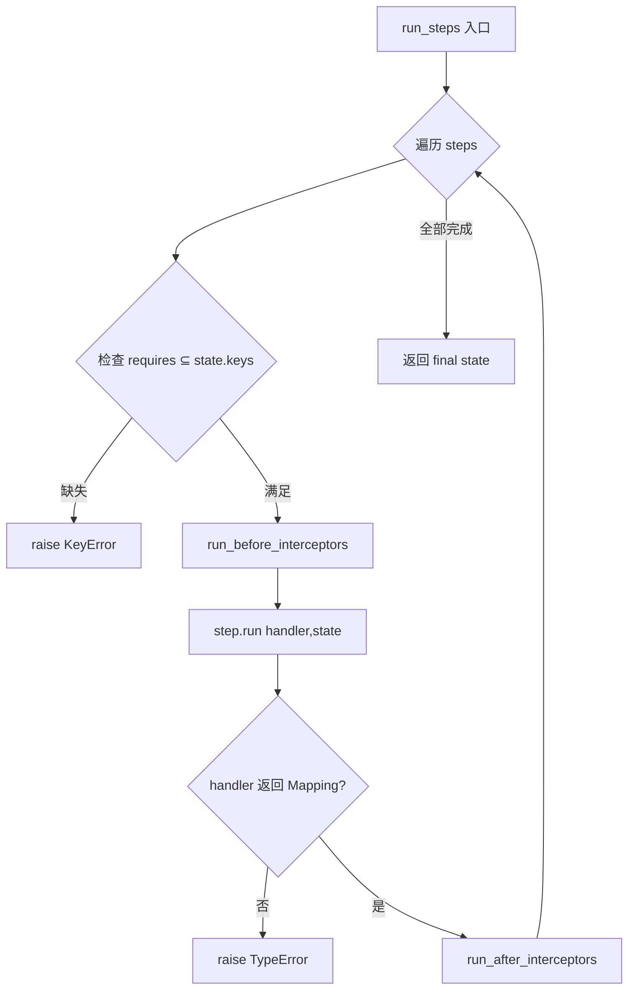
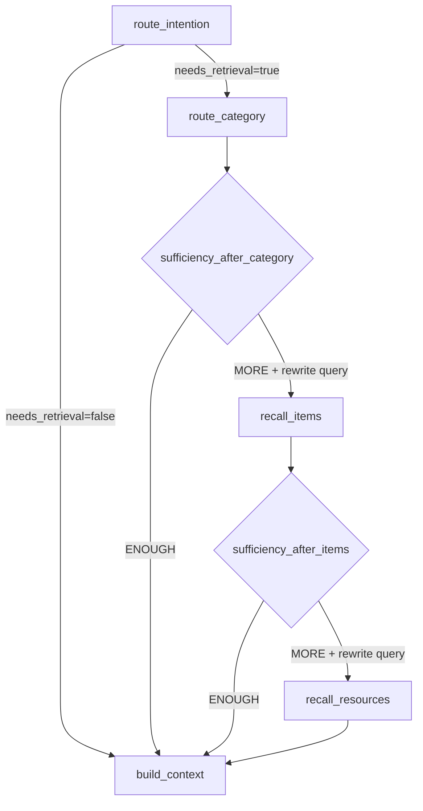
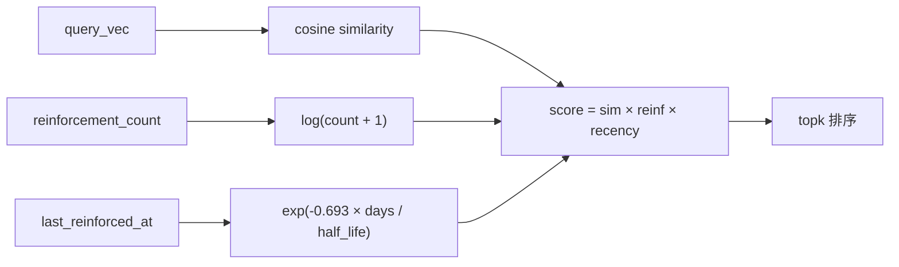

# PD-08.NN memU — 双模式三层级递进检索与 LLM 充分性判断

> 文档编号：PD-08.NN
> 来源：memU `src/memu/app/retrieve.py`, `src/memu/database/inmemory/vector.py`
> GitHub：https://github.com/NevaMind-AI/memU.git
> 问题域：PD-08 搜索与检索 Search & Retrieval
> 状态：可复用方案

---

## 第 1 章 问题与动机

### 1.1 核心问题

个人记忆系统的检索面临三重挑战：

1. **层级粒度不匹配**：用户查询可能指向宏观分类（"我喜欢什么运动"）、具体记忆条目（"上周跑步的配速"）或原始资源（"那张跑步照片"），单一粒度检索无法覆盖所有场景。
2. **过度检索浪费**：如果分类层已经能回答问题，继续检索条目和资源层是纯粹的 token 和延迟浪费。
3. **检索模式选择**：纯向量检索（RAG）速度快但语义理解浅，纯 LLM 排序理解深但成本高，需要在两者间灵活切换。

### 1.2 memU 的解法概述

memU 设计了一套双模式（RAG / LLM）三层级（Category → Item → Resource）递进检索系统，核心特征：

1. **双模式可切换**：通过 `RetrieveConfig.method` 配置选择 `"rag"`（embedding cosine topk）或 `"llm"`（语言模型排序），两套 workflow 共享相同的 7 步管道结构（`retrieve.py:106-210` vs `retrieve.py:454-536`）
2. **三层级递进搜索**：Category → Item → Resource，每层独立启用/禁用，每层有独立 `top_k` 配置（`settings.py:146-172`）
3. **层间充分性判断**：每层检索后调用 `_decide_if_retrieval_needed()` 让 LLM 判断当前结果是否足够，不够则自动 rewrite query 并继续下一层（`retrieve.py:746-784`）
4. **意图路由前置**：检索前先判断查询是否需要记忆检索（闲聊/通用知识直接跳过），避免无效检索（`retrieve.py:228-258`）
5. **Salience 感知排序**：Item 层支持 `similarity × log(reinforcement+1) × recency_decay` 三因子加权排序（`vector.py:16-53`）

### 1.3 设计思想

| 设计原则 | 具体实现 | 理由 | 替代方案 |
|----------|----------|------|----------|
| 递进式检索 | Category→Item→Resource 三层，每层后 sufficiency check | 避免过度检索，粗粒度能回答就不深入 | 全量检索后截断（浪费 token） |
| 双模式对称 | RAG 和 LLM 两套 workflow 共享 7 步结构 | 不同场景选最优模式，接口统一 | 只用一种模式（灵活性不足） |
| Query Rewriting | 每层 sufficiency check 同时输出 rewritten_query | 下一层用更精确的查询，提升召回率 | 始终用原始查询（语义漂移无法修正） |
| Salience 三因子 | cosine × log(reinforcement) × exp(-decay) | 高频强化记忆更重要，但用 log 防止垄断 | 纯 cosine（忽略记忆强度和时效） |
| 配置驱动 | 每层 enabled/top_k/ranking 独立配置 | 不同部署场景灵活裁剪检索深度 | 硬编码参数（无法调优） |

---

## 第 2 章 源码实现分析

### 2.1 架构概览

memU 的检索系统由 `RetrieveMixin` 提供，通过 `MemoryService` 多继承组合：

```
┌─────────────────────────────────────────────────────────────┐
│                     MemoryService                           │
│  (service.py:49)                                            │
│  ┌──────────────┐ ┌──────────────┐ ┌──────────────┐        │
│  │ MemorizeMixin│ │RetrieveMixin │ │  CRUDMixin   │        │
│  └──────────────┘ └──────┬───────┘ └──────────────┘        │
│                          │                                   │
│              ┌───────────┴───────────┐                      │
│              │  retrieve(queries)    │                      │
│              │  (retrieve.py:42)     │                      │
│              └───────────┬───────────┘                      │
│                          │                                   │
│         ┌────────────────┼────────────────┐                 │
│         ▼                                 ▼                 │
│  ┌──────────────┐                 ┌──────────────┐          │
│  │ retrieve_rag │                 │ retrieve_llm │          │
│  │  7-step WF   │                 │  7-step WF   │          │
│  └──────┬───────┘                 └──────┬───────┘          │
│         │                                │                  │
│  ┌──────┴──────────────────────────────┐ │                  │
│  │ 1. route_intention                  │ │                  │
│  │ 2. route_category (vector/LLM)      │ │                  │
│  │ 3. sufficiency_after_category       │ │                  │
│  │ 4. recall_items (vector/LLM)        │ │                  │
│  │ 5. sufficiency_after_items          │ │                  │
│  │ 6. recall_resources (vector/LLM)    │ │                  │
│  │ 7. build_context                    │ │                  │
│  └─────────────────────────────────────┘ │                  │
│                                          │                  │
│  ┌───────────────────────────────────────┘                  │
│  │ InMemoryVectorDB                                         │
│  │  cosine_topk / cosine_topk_salience                      │
│  │  (vector.py:56-127)                                      │
│  └──────────────────────────────────────────────────────────┘
└─────────────────────────────────────────────────────────────┘
```

### 2.2 核心实现

#### 2.2.1 WorkflowStep 管道引擎

memU 用 `WorkflowStep` dataclass 定义每个检索步骤，通过 `run_steps()` 顺序执行，每步声明 `requires`（输入键）和 `produces`（输出键），运行时自动校验依赖。



对应源码 `src/memu/workflow/step.py:50-101`：
```python
async def run_steps(
    name: str,
    steps: list[WorkflowStep],
    initial_state: WorkflowState,
    context: WorkflowContext = None,
    interceptor_registry: WorkflowInterceptorRegistry | None = None,
) -> WorkflowState:
    snapshot = interceptor_registry.snapshot() if interceptor_registry else None
    state = dict(initial_state)
    for step in steps:
        missing = step.requires - state.keys()
        if missing:
            msg = f"Workflow '{name}' missing required keys for step '{step.step_id}': {', '.join(sorted(missing))}"
            raise KeyError(msg)
        step_context: dict[str, Any] = dict(context) if context else {}
        step_context["step_id"] = step.step_id
        if step.config:
            step_context["step_config"] = step.config
        # ... interceptor hooks ...
        state = await step.run(state, step_context)
    return state
```

#### 2.2.2 三层级递进检索（RAG 模式）

RAG 模式的 7 步 workflow 定义在 `retrieve.py:106-210`，核心是每层检索后插入 sufficiency check：



对应源码 `src/memu/app/retrieve.py:288-322`（category sufficiency check）：
```python
async def _rag_category_sufficiency(self, state: WorkflowState, step_context: Any) -> WorkflowState:
    if not state.get("needs_retrieval"):
        state["proceed_to_items"] = False
        return state
    if not state.get("retrieve_category") or not state.get("sufficiency_check"):
        state["proceed_to_items"] = True
        return state

    retrieved_content = ""
    store = state["store"]
    where_filters = state.get("where") or {}
    category_pool = state.get("category_pool") or store.memory_category_repo.list_categories(where_filters)
    hits = state.get("category_hits") or []
    if hits:
        retrieved_content = self._format_category_content(
            hits, state.get("category_summary_lookup", {}), store, categories=category_pool,
        )

    llm_client = self._get_step_llm_client(step_context)
    needs_more, rewritten_query = await self._decide_if_retrieval_needed(
        state["active_query"], state["context_queries"],
        retrieved_content=retrieved_content or "No content retrieved yet.",
        llm_client=llm_client,
    )
    state["next_step_query"] = rewritten_query
    state["active_query"] = rewritten_query
    state["proceed_to_items"] = needs_more
    if needs_more:
        embed_client = self._get_step_embedding_client(step_context)
        state["query_vector"] = (await embed_client.embed([state["active_query"]]))[0]
    return state
```

#### 2.2.3 Salience 三因子排序

Item 层支持 salience 排序模式，公式为 `similarity × log(reinforcement_count + 1) × exp(-0.693 × days_ago / half_life)`：



对应源码 `src/memu/database/inmemory/vector.py:16-53`：
```python
def salience_score(
    similarity: float,
    reinforcement_count: int,
    last_reinforced_at: datetime | None,
    recency_decay_days: float = 30.0,
) -> float:
    # Reinforcement factor (logarithmic to prevent runaway scores)
    reinforcement_factor = math.log(reinforcement_count + 1)
    # Recency factor (exponential decay with half-life)
    if last_reinforced_at is None:
        recency_factor = 0.5  # Unknown recency gets neutral score
    else:
        now = datetime.now(last_reinforced_at.tzinfo) if last_reinforced_at.tzinfo else datetime.utcnow()
        days_ago = (now - last_reinforced_at).total_seconds() / 86400
        recency_factor = math.exp(-0.693 * days_ago / recency_decay_days)
    return similarity * reinforcement_factor * recency_factor
```

### 2.3 实现细节

#### 向量化 cosine topk

`cosine_topk` 使用 numpy 矩阵运算一次计算所有相似度，再用 `argpartition` 实现 O(n) topk 选择（`vector.py:56-91`）：

```python
def cosine_topk(query_vec, corpus, k=5):
    q = np.array(query_vec, dtype=np.float32)
    matrix = np.array(vecs, dtype=np.float32)  # shape: (n, dim)
    scores = matrix @ q / (vec_norms * q_norm + 1e-9)
    # O(n) topk via argpartition instead of O(n log n) sort
    topk_indices = np.argpartition(scores, -actual_k)[-actual_k:]
    topk_indices = topk_indices[np.argsort(scores[topk_indices])[::-1]]
```

#### 意图路由与 Query Rewriting

`_decide_if_retrieval_needed()` 复用同一个 LLM prompt 完成两个任务（`retrieve.py:746-784`）：
- 判断是否需要检索（`<decision>RETRIEVE/NO_RETRIEVE</decision>`）
- 同时输出重写后的查询（`<rewritten_query>...</rewritten_query>`）

Prompt 定义在 `pre_retrieval_decision.py:1-53`，规则清晰：闲聊/通用知识 → NO_RETRIEVE，历史记忆/用户偏好 → RETRIEVE。

#### 引用追踪检索

LLM 模式下，Item 检索支持 `use_category_references` 选项（`retrieve.py:626-639`）：当 Category 的 summary 中包含 `[ref:ITEM_ID]` 引用时，直接按引用 ID 获取 Item，跳过全量搜索。引用解析由 `utils/references.py:20-49` 的 `extract_references()` 完成。

#### 数据流：state 字典传递

整个 workflow 通过 `WorkflowState`（`dict[str, Any]`）传递状态，关键字段：

| 字段 | 类型 | 产生步骤 | 消费步骤 |
|------|------|----------|----------|
| `needs_retrieval` | bool | route_intention | 所有后续步骤 |
| `active_query` | str | route_intention / sufficiency | 所有检索步骤 |
| `query_vector` | list[float] | route_category / sufficiency | recall_items, recall_resources |
| `category_hits` | list[tuple] | route_category | sufficiency, recall_items |
| `proceed_to_items` | bool | sufficiency_after_category | recall_items |
| `proceed_to_resources` | bool | sufficiency_after_items | recall_resources |

---

## 第 3 章 迁移指南

### 3.1 迁移清单

**阶段 1：基础向量检索**
- [ ] 实现 `cosine_topk()` 向量化相似度计算（numpy 矩阵乘法 + argpartition）
- [ ] 定义三层数据模型：Category（含 summary + embedding）、Item（含 memory_type + embedding + extra）、Resource（含 caption + embedding）
- [ ] 实现单层 embedding 检索（query → embed → cosine_topk → 返回 top_k）

**阶段 2：递进式检索管道**
- [ ] 实现 WorkflowStep 管道引擎（requires/produces 依赖校验 + 顺序执行）
- [ ] 构建 7 步 RAG workflow：route_intention → route_category → sufficiency → recall_items → sufficiency → recall_resources → build_context
- [ ] 实现 `_decide_if_retrieval_needed()` 充分性判断（LLM 调用 + XML tag 解析）

**阶段 3：高级特性**
- [ ] 添加 Salience 排序模式（reinforcement × recency × similarity）
- [ ] 实现 LLM 排序 workflow（替换 vector search 为 LLM rank）
- [ ] 添加引用追踪检索（`[ref:ITEM_ID]` 解析 + 定向获取）

### 3.2 适配代码模板

#### 最小可用的递进检索框架

```python
"""
Minimal progressive retrieval framework inspired by memU.
Supports 3-tier search with sufficiency checks.
"""
from __future__ import annotations

import math
import re
from dataclasses import dataclass, field
from datetime import datetime
from typing import Any, Callable, Awaitable

import numpy as np


# --- Vector utilities ---

def cosine_topk(
    query_vec: list[float],
    corpus: list[tuple[str, list[float]]],
    k: int = 5,
) -> list[tuple[str, float]]:
    """Vectorized cosine similarity top-k with O(n) selection."""
    if not corpus:
        return []
    ids, vecs = zip(*corpus)
    q = np.array(query_vec, dtype=np.float32)
    matrix = np.array(list(vecs), dtype=np.float32)
    q_norm = np.linalg.norm(q)
    vec_norms = np.linalg.norm(matrix, axis=1)
    scores = matrix @ q / (vec_norms * q_norm + 1e-9)
    actual_k = min(k, len(scores))
    if actual_k == len(scores):
        topk_idx = np.argsort(scores)[::-1]
    else:
        topk_idx = np.argpartition(scores, -actual_k)[-actual_k:]
        topk_idx = topk_idx[np.argsort(scores[topk_idx])[::-1]]
    return [(ids[i], float(scores[i])) for i in topk_idx]


def salience_score(
    similarity: float,
    reinforcement_count: int,
    last_reinforced_at: datetime | None,
    recency_decay_days: float = 30.0,
) -> float:
    """Score = similarity × log(reinforcement+1) × exp(-0.693 × days/half_life)"""
    reinf = math.log(reinforcement_count + 1)
    if last_reinforced_at is None:
        recency = 0.5
    else:
        days_ago = (datetime.utcnow() - last_reinforced_at).total_seconds() / 86400
        recency = math.exp(-0.693 * days_ago / recency_decay_days)
    return similarity * reinf * recency


# --- Workflow engine ---

@dataclass
class WorkflowStep:
    step_id: str
    handler: Callable[[dict, Any], Awaitable[dict]]
    requires: set[str] = field(default_factory=set)
    produces: set[str] = field(default_factory=set)


async def run_workflow(steps: list[WorkflowStep], state: dict) -> dict:
    for step in steps:
        missing = step.requires - state.keys()
        if missing:
            raise KeyError(f"Step '{step.step_id}' missing: {missing}")
        state = await step.handler(state, None)
    return state


# --- Sufficiency check ---

SUFFICIENCY_PROMPT = """
Given the query and retrieved content, decide:
- RETRIEVE: need more information from deeper layers
- NO_RETRIEVE: current content is sufficient

<decision>RETRIEVE or NO_RETRIEVE</decision>
<rewritten_query>optimized query if RETRIEVE</rewritten_query>

Query: {query}
Retrieved Content: {content}
"""


def parse_decision(raw: str) -> tuple[bool, str]:
    """Parse LLM sufficiency response → (needs_more, rewritten_query)"""
    match = re.search(r"<decision>(.*?)</decision>", raw, re.DOTALL)
    needs_more = True  # default to retrieve
    if match and "NO_RETRIEVE" in match.group(1).upper():
        needs_more = False
    qmatch = re.search(r"<rewritten_query>(.*?)</rewritten_query>", raw, re.DOTALL)
    rewritten = qmatch.group(1).strip() if qmatch else ""
    return needs_more, rewritten


# --- Progressive retrieval ---

async def progressive_retrieve(
    query: str,
    categories: list[tuple[str, list[float]]],
    items: list[tuple[str, list[float]]],
    resources: list[tuple[str, list[float]]],
    embed_fn: Callable[[str], Awaitable[list[float]]],
    llm_fn: Callable[[str], Awaitable[str]],
    top_k: int = 5,
) -> dict[str, list]:
    """3-tier progressive retrieval with sufficiency checks."""
    result = {"categories": [], "items": [], "resources": []}
    qvec = await embed_fn(query)
    active_query = query

    # Tier 1: Categories
    cat_hits = cosine_topk(qvec, categories, k=top_k)
    result["categories"] = cat_hits
    if cat_hits:
        content = "\n".join(f"{cid}: {score:.3f}" for cid, score in cat_hits)
        prompt = SUFFICIENCY_PROMPT.format(query=active_query, content=content)
        resp = await llm_fn(prompt)
        needs_more, rewritten = parse_decision(resp)
        if not needs_more:
            return result
        if rewritten:
            active_query = rewritten
            qvec = await embed_fn(active_query)

    # Tier 2: Items
    item_hits = cosine_topk(qvec, items, k=top_k)
    result["items"] = item_hits
    if item_hits:
        content = "\n".join(f"{iid}: {score:.3f}" for iid, score in item_hits)
        prompt = SUFFICIENCY_PROMPT.format(query=active_query, content=content)
        resp = await llm_fn(prompt)
        needs_more, rewritten = parse_decision(resp)
        if not needs_more:
            return result
        if rewritten:
            active_query = rewritten
            qvec = await embed_fn(active_query)

    # Tier 3: Resources
    res_hits = cosine_topk(qvec, resources, k=top_k)
    result["resources"] = res_hits
    return result
```

### 3.3 适用场景

| 场景 | 适用度 | 说明 |
|------|--------|------|
| 个人记忆/知识库检索 | ⭐⭐⭐ | 天然适配层级结构（分类→条目→附件） |
| 企业知识管理 | ⭐⭐⭐ | 部门→文档→段落的层级映射 |
| 对话式 RAG | ⭐⭐ | sufficiency check 可减少不必要的检索轮次 |
| 大规模文档搜索 | ⭐ | 内存向量库不适合大规模，需替换为 FAISS/Qdrant |
| 实时搜索引擎 | ⭐ | LLM sufficiency check 引入额外延迟 |

---

## 第 4 章 测试用例

```python
"""Tests for memU-style progressive retrieval with sufficiency checks."""
import math
from datetime import datetime, timedelta

import numpy as np
import pytest


# --- cosine_topk tests ---

class TestCosineTopk:
    def test_basic_ranking(self):
        """Top-k returns items sorted by cosine similarity."""
        query = [1.0, 0.0, 0.0]
        corpus = [
            ("a", [1.0, 0.0, 0.0]),   # perfect match
            ("b", [0.7, 0.7, 0.0]),   # partial match
            ("c", [0.0, 1.0, 0.0]),   # orthogonal
        ]
        hits = cosine_topk(query, corpus, k=2)
        assert len(hits) == 2
        assert hits[0][0] == "a"
        assert hits[0][1] > hits[1][1]

    def test_empty_corpus(self):
        """Empty corpus returns empty results."""
        assert cosine_topk([1.0, 0.0], [], k=5) == []

    def test_k_larger_than_corpus(self):
        """k > corpus size returns all items."""
        corpus = [("a", [1.0, 0.0])]
        hits = cosine_topk([1.0, 0.0], corpus, k=10)
        assert len(hits) == 1


# --- salience_score tests ---

class TestSalienceScore:
    def test_reinforcement_logarithmic(self):
        """Reinforcement uses log scaling to prevent dominance."""
        score_1 = salience_score(0.9, reinforcement_count=1, last_reinforced_at=datetime.utcnow())
        score_100 = salience_score(0.9, reinforcement_count=100, last_reinforced_at=datetime.utcnow())
        # 100x reinforcement should NOT give 100x score (log dampening)
        assert score_100 / score_1 < 10

    def test_recency_decay(self):
        """Recent memories score higher than old ones."""
        now = datetime.utcnow()
        score_recent = salience_score(0.9, 1, now)
        score_old = salience_score(0.9, 1, now - timedelta(days=60))
        assert score_recent > score_old

    def test_half_life(self):
        """After half_life days, recency factor ≈ 0.5."""
        now = datetime.utcnow()
        half_life = 30.0
        score_now = salience_score(1.0, 0, now, recency_decay_days=half_life)
        score_half = salience_score(1.0, 0, now - timedelta(days=half_life), recency_decay_days=half_life)
        # recency at half_life should be ~0.5 of recency at now
        ratio = score_half / score_now if score_now > 0 else 0
        assert 0.4 < ratio < 0.6

    def test_none_reinforced_at(self):
        """None last_reinforced_at gets neutral 0.5 recency."""
        score = salience_score(1.0, 1, None)
        expected = 1.0 * math.log(2) * 0.5
        assert abs(score - expected) < 0.01


# --- sufficiency decision parsing ---

class TestDecisionParsing:
    def test_retrieve_decision(self):
        raw = "<decision>RETRIEVE</decision><rewritten_query>what sports do I like</rewritten_query>"
        needs_more, rewritten = parse_decision(raw)
        assert needs_more is True
        assert rewritten == "what sports do I like"

    def test_no_retrieve_decision(self):
        raw = "<decision>NO_RETRIEVE</decision><rewritten_query>original query</rewritten_query>"
        needs_more, _ = parse_decision(raw)
        assert needs_more is False

    def test_malformed_defaults_to_retrieve(self):
        """Malformed response defaults to RETRIEVE (safe fallback)."""
        needs_more, _ = parse_decision("some random text")
        assert needs_more is True
```

---

## 第 5 章 跨域关联

| 关联域 | 关系类型 | 说明 |
|--------|----------|------|
| PD-01 上下文管理 | 协同 | sufficiency check 本质是上下文窗口的动态管理——够了就停，不够才继续填充 |
| PD-06 记忆持久化 | 依赖 | 三层级检索依赖 Category/Item/Resource 的持久化存储和 embedding 索引 |
| PD-07 质量检查 | 协同 | sufficiency check 是检索质量的在线评估，与离线质量检查互补 |
| PD-10 中间件管道 | 协同 | WorkflowStep 管道引擎支持 before/after/on_error interceptor，与中间件模式同构 |
| PD-12 推理增强 | 协同 | query rewriting 是推理增强的一种形式，LLM 排序模式本身就是推理驱动检索 |

---

## 第 6 章 来源文件索引

| 文件 | 行范围 | 关键实现 |
|------|--------|----------|
| `src/memu/app/retrieve.py` | L27-L41 | RetrieveMixin 类定义与类型声明 |
| `src/memu/app/retrieve.py` | L42-L85 | `retrieve()` 主入口，构建 state 并执行 workflow |
| `src/memu/app/retrieve.py` | L106-L210 | `_build_rag_retrieve_workflow()` RAG 模式 7 步定义 |
| `src/memu/app/retrieve.py` | L228-L258 | `_rag_route_intention()` 意图路由 |
| `src/memu/app/retrieve.py` | L260-L286 | `_rag_route_category()` 向量检索分类 |
| `src/memu/app/retrieve.py` | L288-L322 | `_rag_category_sufficiency()` 分类层充分性判断 |
| `src/memu/app/retrieve.py` | L346-L367 | `_rag_recall_items()` 向量检索条目（支持 salience） |
| `src/memu/app/retrieve.py` | L369-L398 | `_rag_item_sufficiency()` 条目层充分性判断 |
| `src/memu/app/retrieve.py` | L400-L424 | `_rag_recall_resources()` 向量检索资源 |
| `src/memu/app/retrieve.py` | L454-L536 | `_build_llm_retrieve_workflow()` LLM 模式 7 步定义 |
| `src/memu/app/retrieve.py` | L746-L784 | `_decide_if_retrieval_needed()` 充分性判断核心 |
| `src/memu/app/retrieve.py` | L841-L865 | `_extract_decision()` / `_extract_rewritten_query()` XML 解析 |
| `src/memu/app/retrieve.py` | L1216-L1239 | `_llm_rank_categories()` LLM 排序分类 |
| `src/memu/database/inmemory/vector.py` | L11-L13 | `_cosine()` 基础余弦相似度 |
| `src/memu/database/inmemory/vector.py` | L16-L53 | `salience_score()` 三因子加权评分 |
| `src/memu/database/inmemory/vector.py` | L56-L91 | `cosine_topk()` 向量化 topk 检索 |
| `src/memu/database/inmemory/vector.py` | L94-L127 | `cosine_topk_salience()` salience 感知 topk |
| `src/memu/database/inmemory/repositories/memory_item_repo.py` | L169-L196 | `vector_search_items()` 双模式排序实现 |
| `src/memu/workflow/step.py` | L16-L38 | `WorkflowStep` dataclass 定义 |
| `src/memu/workflow/step.py` | L50-L101 | `run_steps()` 管道执行引擎 |
| `src/memu/app/settings.py` | L146-L202 | `RetrieveConfig` 及子配置定义 |
| `src/memu/prompts/retrieve/pre_retrieval_decision.py` | L1-L53 | 意图路由 / 充分性判断 prompt |
| `src/memu/prompts/retrieve/llm_category_ranker.py` | L1-L35 | LLM 分类排序 prompt |
| `src/memu/prompts/retrieve/llm_item_ranker.py` | L1-L40 | LLM 条目排序 prompt |
| `src/memu/utils/references.py` | L17-L49 | `extract_references()` 引用解析 |
| `src/memu/app/service.py` | L49-L95 | `MemoryService` 多继承组合 |

---

## 第 7 章 横向对比维度

> **重要：** 本章用于自动填充 Butcher Wiki 的横向对比表。
> 必须严格按以下 JSON 格式输出，放在 `comparison_data` 代码块中。

```json comparison_data
{
  "project": "memU",
  "dimensions": {
    "搜索架构": "双模式（RAG cosine topk / LLM 排序）三层级递进（Category→Item→Resource），每层后 sufficiency check",
    "去重机制": "WorkflowState 单一 query_vector 传递，同层不重复 embed；引用追踪按 ID 精确获取避免重复",
    "结果处理": "三层结果分别 materialize 为 dict，含 score 字段，统一 response 结构返回",
    "容错策略": "LLM 解析失败默认 RETRIEVE（安全降级）；JSON 解析异常 catch 后返回空列表",
    "成本控制": "sufficiency check 实现 early termination，粗粒度够用就不深入；route_intention 跳过闲聊查询",
    "排序策略": "RAG 模式支持 similarity/salience 双排序；salience = cosine × log(reinforcement+1) × exp(-decay)",
    "检索方式": "RAG: numpy 矩阵乘法 + argpartition O(n) topk；LLM: prompt 驱动排序返回 JSON ID 列表",
    "索引结构": "内存 dict 存储，无外部向量数据库；corpus 按需构建 numpy 矩阵",
    "搜索后反思": "每层检索后 LLM 判断 RETRIEVE/NO_RETRIEVE + 输出 rewritten_query，驱动下一层",
    "层级递进深度控制": "三层各自 enabled/top_k 独立配置，sufficiency_check 全局开关控制是否启用层间判断"
  }
}
```

### 域元数据补充

```json domain_metadata
{
  "solution_summary": "memU 用双模式（RAG cosine topk / LLM 排序）三层级递进检索（Category→Item→Resource），每层后 LLM sufficiency check 决定是否继续，支持 salience 三因子加权和 query rewriting",
  "description": "层级记忆系统中粗粒度到细粒度的递进检索与动态终止",
  "sub_problems": [
    "层级递进深度控制：三层检索中如何通过 LLM 充分性判断实现 early termination 避免过度检索",
    "双模式检索统一接口：RAG 向量检索与 LLM 排序两套实现如何共享相同的 workflow 步骤结构",
    "引用追踪检索：Category summary 中的 [ref:ITEM_ID] 引用如何跳过全量搜索直接定向获取关联 Item",
    "Salience 三因子平衡：cosine similarity × reinforcement log × recency decay 三因子的权重平衡与半衰期选择"
  ],
  "best_practices": [
    "充分性判断默认 RETRIEVE：LLM 解析失败时安全降级为继续检索，宁可多检索不可漏信息",
    "Query Rewriting 与 sufficiency check 合一：一次 LLM 调用同时完成充分性判断和查询重写，减少调用次数",
    "argpartition O(n) topk：大规模向量检索用 numpy argpartition 替代全排序，从 O(n log n) 降到 O(n)"
  ]
}
```
