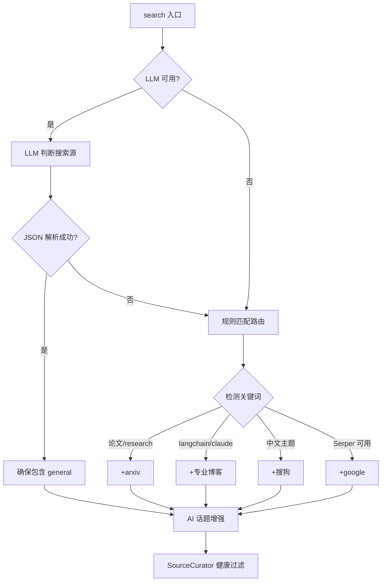
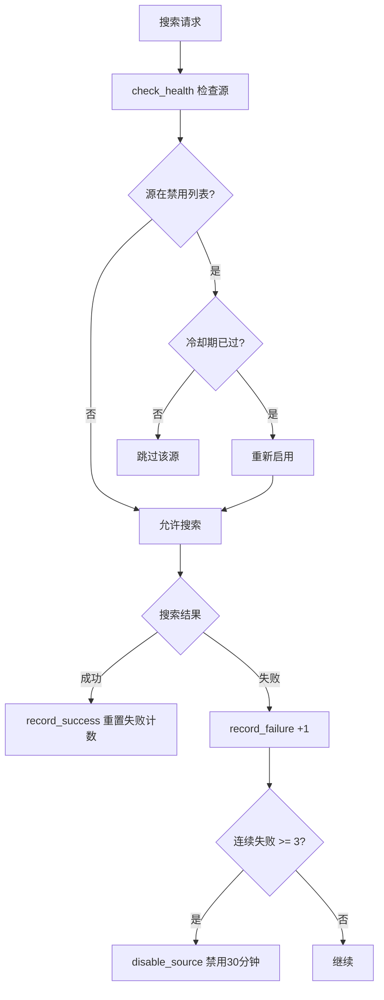
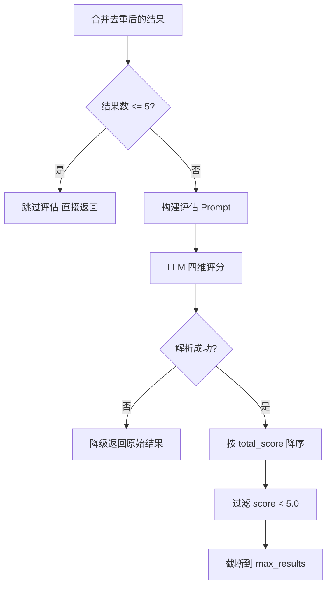

# PD-08.09 vibe-blog — SmartSearch 多源路由与四维可信度评估

> 文档编号：PD-08.09
> 来源：vibe-blog `backend/services/blog_generator/services/smart_search_service.py`
> GitHub：https://github.com/datawhalechina/vibe-blog.git
> 问题域：PD-08 搜索与检索 Search & Retrieval
> 状态：可复用方案

---

## 第 1 章 问题与动机

### 1.1 核心问题

博客自动生成系统需要从互联网获取高质量素材，但单一搜索引擎存在三个致命缺陷：

1. **覆盖盲区**：Google 搜不到微信公众号文章，arXiv 搜不到实践案例，智谱搜不到英文前沿论文
2. **质量参差**：通用搜索返回的结果中混杂广告、SEO 垃圾、过时内容，直接喂给 LLM 会污染生成质量
3. **可用性脆弱**：单一 API 挂掉（限流、Key 过期、网络超时）整个搜索链路就断了

vibe-blog 面对的场景更复杂——它是一个面向中文 AI 技术社区的博客生成器，需要同时覆盖中英文学术论文、官方技术博客、社区讨论、微信公众号等多种内容源。

### 1.2 vibe-blog 的解法概述

vibe-blog 构建了一个 **五层搜索管线**，从路由到过滤形成完整闭环：

1. **LLM 智能路由 + 规则降级**：`SmartSearchService._route_search_sources()` 先用 LLM 判断需要哪些搜索源，LLM 不可用时降级到关键词规则匹配（`smart_search_service.py:323-411`）
2. **AI 话题自动增强**：检测到 AI 相关话题时自动注入 7 个权威博客源 + arXiv（`smart_search_service.py:413-440`）
3. **ThreadPoolExecutor 并行搜索**：最多 5 种搜索源（智谱/Serper/搜狗/arXiv/专业博客）并行执行（`smart_search_service.py:258-293`）
4. **SourceCurator 健康检查 + 质量排序**：连续 3 次失败自动禁用源，30 分钟冷却后重试（`source_curator.py:21-118`）
5. **SourceCredibilityFilter 四维 LLM 评估**：权威性/时效性/相关性/深度四维加权评分，筛选高质量结果（`source_credibility_filter.py:29-142`）

此外还有两个辅助系统：
- **SubQueryEngine 子查询并行引擎**：LLM 生成 N 个语义互补子查询 → 并行搜索 → 合并去重（`sub_query_engine.py:22-235`）
- **KnowledgeGapDetector 知识空白检测**：LLM 分析搜索结果缺失的关键信息，生成补充查询（`knowledge_gap_detector.py:40-115`）

### 1.3 设计思想

| 设计原则 | 具体实现 | 理由 | 替代方案 |
|----------|----------|------|----------|
| LLM 优先 + 规则兜底 | 路由先走 LLM JSON 输出，失败降级到关键词匹配 | LLM 能理解语义（如"Transformer 注意力机制"应搜 arXiv），规则只能匹配字面 | 纯规则路由（无法理解语义）/ 纯 LLM（不可用时全挂） |
| 源质量分级 | PROFESSIONAL_BLOGS 字典为每个源配 quality_weight（0.70-0.95） | 官方研究博客（Anthropic 0.95）比社区帖子（Dev.to 0.70）可信度高 | 所有源平等对待（质量无法保证） |
| 熔断 + 冷却 | SourceCurator 连续 3 次失败禁用，30 分钟后自动恢复 | 避免反复请求已挂的 API 浪费时间和配额 | 无熔断（每次都尝试）/ 永久禁用（需人工恢复） |
| 两级过滤管线 | SourceCurator（规则排序）→ SourceCredibilityFilter（LLM 评估） | 规则过滤成本为零，LLM 评估精准但有成本，先粗筛再精评 | 只用 LLM（成本高）/ 只用规则（精度低） |
| 按域限流 | GlobalRateLimiter 为每个搜索源配独立间隔（arXiv 3s，搜狗 0.5s） | 不同 API 限流策略不同，统一间隔要么太慢要么被封 | 全局统一限流（无法适配不同 API） |

---

## 第 2 章 源码实现分析

### 2.1 架构概览

vibe-blog 的搜索系统由 7 个核心组件组成，形成"路由 → 并行搜索 → 去重 → 过滤"的四阶段管线：

```
┌─────────────────────────────────────────────────────────────────┐
│                    SmartSearchService.search()                   │
│                                                                  │
│  ┌──────────────┐    ┌──────────────┐    ┌──────────────────┐   │
│  │ LLM 路由     │───→│ AI 话题增强  │───→│ SourceCurator    │   │
│  │ + 规则降级   │    │ (AI_BOOST)   │    │ 健康检查过滤     │   │
│  └──────────────┘    └──────────────┘    └──────────────────┘   │
│         │                                        │               │
│         ▼                                        ▼               │
│  ┌──────────────────────────────────────────────────────────┐   │
│  │           ThreadPoolExecutor (max_workers=3)              │   │
│  │  ┌────────┐ ┌────────┐ ┌────────┐ ┌────────┐ ┌────────┐ │   │
│  │  │ 智谱   │ │ Serper │ │ 搜狗   │ │ arXiv  │ │ Blog×N │ │   │
│  │  │ WebAPI │ │ Google │ │ 腾讯云 │ │ XML    │ │ site:  │ │   │
│  │  └────────┘ └────────┘ └────────┘ └────────┘ └────────┘ │   │
│  └──────────────────────────────────────────────────────────┘   │
│         │                                                        │
│         ▼                                                        │
│  ┌──────────────┐    ┌──────────────────────────────────────┐   │
│  │ URL 去重     │───→│ SourceCredibilityFilter              │   │
│  │ + HTML 清洗  │    │ LLM 四维评估 (authority/freshness/   │   │
│  │ + 质量排序   │    │ relevance/depth) → 加权排序截断      │   │
│  └──────────────┘    └──────────────────────────────────────┘   │
└─────────────────────────────────────────────────────────────────┘

辅助系统：
┌──────────────────┐    ┌──────────────────────┐
│ SubQueryEngine   │    │ KnowledgeGapDetector  │
│ LLM 生成子查询   │    │ LLM 检测知识空白      │
│ → 并行搜索合并   │    │ → 生成补充查询        │
└──────────────────┘    └──────────────────────┘
```

### 2.2 核心实现

#### 2.2.1 LLM 智能路由 + 规则降级



对应源码 `smart_search_service.py:323-411`：

```python
def _route_search_sources(self, topic: str) -> Dict[str, Any]:
    """使用 LLM 判断需要哪些搜索源"""
    if not self.llm:
        return self._rule_based_routing(topic)

    from ..prompts import get_prompt_manager
    prompt = get_prompt_manager().render_search_router(topic)

    try:
        response = self.llm.chat(
            messages=[{"role": "user", "content": prompt}],
            response_format={"type": "json_object"}
        )
        result = self._extract_json(response)
        # 确保 general 始终包含
        if 'general' not in result.get('sources', []):
            result['sources'].append('general')
        return result
    except Exception as e:
        logger.warning(f"LLM 路由失败，使用规则匹配: {e}")
        return self._rule_based_routing(topic)
```

关键设计点：
- LLM 路由使用 `response_format={"type": "json_object"}` 强制 JSON 输出，减少解析失败
- `general` 搜索源始终包含，作为兜底（`smart_search_service.py:340-341`）
- 规则路由中动态检测 Serper/搜狗服务可用性（`smart_search_service.py:387-405`），避免硬编码

#### 2.2.2 SourceCurator 熔断与质量排序



对应源码 `source_curator.py:79-118`：

```python
def check_health(self, source_id: str) -> bool:
    """检查源是否健康（可用）"""
    if source_id in self._disabled_sources:
        disabled_at = self._disabled_sources[source_id]
        if time.time() - disabled_at >= HEALTH_COOLDOWN:
            # 冷却期已过，重新启用
            logger.info(f"源 {source_id} 冷却期已过，重新启用")
            self.enable_source(source_id)
            return True
        return False
    return True

def record_failure(self, source_id: str) -> None:
    """记录一次失败"""
    self._failure_counts[source_id] = self._failure_counts.get(source_id, 0) + 1
    count = self._failure_counts[source_id]
    if count >= MAX_CONSECUTIVE_FAILURES:
        self.disable_source(source_id)
```

SourceCurator 还维护了一个 20+ 源的质量权重表（`source_curator.py:25-54`），用于搜索结果排序：官方研究博客（Anthropic/OpenAI/DeepMind）权重 0.95，技术社区（HN/GitHub/SO）权重 0.75，通用搜索权重 0.50。

#### 2.2.3 SourceCredibilityFilter 四维 LLM 评估



对应源码 `source_credibility_filter.py:41-96`：

```python
def curate(self, query: str, search_results: List[Dict],
           max_results: Optional[int] = None) -> List[Dict]:
    """执行 LLM 可信度评估，返回筛选后的结果列表"""
    # 短路：数据量太少时跳过评估
    if len(search_results) <= SKIP_THRESHOLD:
        return search_results

    try:
        prompt = self._build_prompt(query, search_results, effective_max)
        response = self.llm.chat(
            messages=[{"role": "user", "content": prompt}],
            caller="source_credibility_filter",
        )
        scores = self._parse_response(response)
        if not scores:
            return search_results  # 降级

        # 按 total_score 降序排列，过滤低分，截断
        filtered = []
        for item in scores:
            idx = item.get('index', 0) - 1
            if 0 <= idx < len(search_results) and item.get('total_score', 0) >= self.min_score:
                result = search_results[idx].copy()
                result['credibility_score'] = item.get('total_score', 0)
                result['credibility_detail'] = {
                    'authority': item.get('authority', 0),
                    'freshness': item.get('freshness', 0),
                    'relevance': item.get('relevance', 0),
                    'depth': item.get('depth', 0),
                    'reason': item.get('reason', ''),
                }
                filtered.append(result)
        filtered.sort(key=lambda x: x.get('credibility_score', 0), reverse=True)
        return filtered[:effective_max]
    except Exception as e:
        return search_results  # 降级
```

四维加权公式（`source_credibility_filter.py:15-21`）：
- authority × 0.30 + freshness × 0.25 + relevance × 0.30 + depth × 0.15

### 2.3 实现细节

#### 查询去重与回滚保护

`QueryDeduplicator`（`query_deduplicator.py:16-103`）按 Agent 隔离缓存，使用 OrderedDict 实现 LRU 淘汰（上限 1000 条/Agent）。连续回滚超过 5 次时拒绝回滚，防止死循环。

#### 多域限流器

`GlobalRateLimiter`（`rate_limiter.py:41-170`）是线程安全的单例，为每个搜索域配置独立间隔：
- arXiv: 3.0s（免费 API，限流严格）
- Serper: 1.0s
- 搜狗: 0.5s
- 通用搜索: 0.5s

同时提供 `wait_sync` 和 `wait_async` 双模式，适配 ThreadPoolExecutor 和 asyncio 两种并发模型。

#### 子查询并行引擎

`SubQueryEngine`（`sub_query_engine.py:22-235`）实现三级降级生成子查询：
1. LLM + 初始搜索 context → 精准子查询
2. LLM 无 context → 通用子查询
3. 硬编码模板（"核心概念"/"最佳实践"/"实际案例"/"最新进展"）

生成后用独立的 ThreadPoolExecutor（max_workers=4）并行搜索，URL 去重后合并。

#### 知识空白检测

`KnowledgeGapDetector`（`knowledge_gap_detector.py:40-115`）用 LLM 分析搜索结果中缺失的概念、数据、实例，输出 `[{"gap": "...", "refined_query": "..."}]`。按文章类型控制最大搜索轮数（mini:2, short:3, medium:5, long:8）。

---

## 第 3 章 迁移指南

### 3.1 迁移清单

**Phase 1：基础多源搜索（1-2 天）**
- [ ] 定义搜索源注册表（类似 `PROFESSIONAL_BLOGS` 字典），每个源包含 site、keywords、quality_weight
- [ ] 实现基础 SearchService 接口：`search(query, max_results) -> Dict`
- [ ] 接入至少 2 个搜索源（如 Serper + arXiv）
- [ ] 用 ThreadPoolExecutor 并行执行搜索
- [ ] URL 去重 + HTML 标签清洗

**Phase 2：智能路由（1 天）**
- [ ] 实现 LLM 路由：输入 topic → 输出 sources 列表
- [ ] 实现规则降级路由：关键词匹配 → 源列表
- [ ] 添加 AI 话题自动增强逻辑

**Phase 3：质量保障（1 天）**
- [ ] 实现 SourceCurator：健康检查 + 熔断 + 质量排序
- [ ] 实现 SourceCredibilityFilter：LLM 四维评估
- [ ] 实现 QueryDeduplicator：查询去重 + 回滚保护

**Phase 4：高级特性（可选）**
- [ ] SubQueryEngine：LLM 生成子查询 → 并行搜索
- [ ] KnowledgeGapDetector：知识空白检测 → 迭代搜索
- [ ] GlobalRateLimiter：按域限流

### 3.2 适配代码模板

以下是一个可直接运行的最小多源搜索路由实现：

```python
"""多源搜索路由 — 迁移自 vibe-blog SmartSearchService"""
import json
import logging
import time
from concurrent.futures import ThreadPoolExecutor, as_completed
from typing import Dict, Any, List, Optional

logger = logging.getLogger(__name__)

# 源注册表：每个源配 quality_weight 用于排序
SOURCE_REGISTRY = {
    'serper': {'name': 'Google', 'weight': 0.80},
    'arxiv': {'name': 'arXiv', 'weight': 0.90},
    'zhipu': {'name': '智谱搜索', 'weight': 0.70},
}

# 熔断配置
MAX_FAILURES = 3
COOLDOWN_SECONDS = 30 * 60


class SourceHealthTracker:
    """源健康追踪（迁移自 SourceCurator）"""

    def __init__(self):
        self._failures: Dict[str, int] = {}
        self._disabled: Dict[str, float] = {}

    def is_healthy(self, source_id: str) -> bool:
        if source_id in self._disabled:
            if time.time() - self._disabled[source_id] >= COOLDOWN_SECONDS:
                self._disabled.pop(source_id)
                self._failures.pop(source_id, None)
                return True
            return False
        return True

    def record_result(self, source_id: str, success: bool):
        if success:
            self._failures.pop(source_id, None)
        else:
            self._failures[source_id] = self._failures.get(source_id, 0) + 1
            if self._failures[source_id] >= MAX_FAILURES:
                self._disabled[source_id] = time.time()


class MultiSourceSearcher:
    """多源并行搜索（迁移自 SmartSearchService）"""

    def __init__(self, search_fns: Dict[str, callable], llm=None):
        """
        Args:
            search_fns: {source_id: fn(query, max_results) -> List[Dict]}
            llm: 可选的 LLM 客户端，用于智能路由
        """
        self.search_fns = search_fns
        self.llm = llm
        self.health = SourceHealthTracker()

    def search(self, topic: str, max_results_per_source: int = 5) -> List[Dict]:
        # 1. 路由
        sources = self._route(topic)
        # 2. 健康过滤
        sources = [s for s in sources if self.health.is_healthy(s)]
        # 3. 并行搜索
        results = []
        with ThreadPoolExecutor(max_workers=min(len(sources), 4)) as pool:
            futures = {
                pool.submit(self.search_fns[s], topic, max_results_per_source): s
                for s in sources if s in self.search_fns
            }
            for future in as_completed(futures):
                src = futures[future]
                try:
                    items = future.result()
                    results.extend(items)
                    self.health.record_result(src, True)
                except Exception as e:
                    logger.error(f"{src} 搜索失败: {e}")
                    self.health.record_result(src, False)
        # 4. URL 去重 + 质量排序
        return self._dedupe_and_rank(results)

    def _route(self, topic: str) -> List[str]:
        """LLM 路由 + 规则降级"""
        if self.llm:
            try:
                resp = self.llm.chat([{"role": "user", "content":
                    f"判断搜索'{topic}'需要哪些源，返回 JSON: {{\"sources\": [...]}}\n"
                    f"可选源: {list(self.search_fns.keys())}"}])
                data = json.loads(resp)
                return data.get('sources', list(self.search_fns.keys()))
            except Exception:
                pass
        return list(self.search_fns.keys())  # 降级：全部搜索

    def _dedupe_and_rank(self, results: List[Dict]) -> List[Dict]:
        seen = set()
        deduped = []
        for r in results:
            url = r.get('url', '')
            if url and url not in seen:
                seen.add(url)
                deduped.append(r)
        # 按源质量权重排序
        deduped.sort(
            key=lambda r: SOURCE_REGISTRY.get(
                r.get('_source', ''), {}
            ).get('weight', 0.5),
            reverse=True,
        )
        return deduped
```

### 3.3 适用场景

| 场景 | 适用度 | 说明 |
|------|--------|------|
| 博客/文章自动生成 | ⭐⭐⭐ | 完美匹配，vibe-blog 的原生场景 |
| Deep Research Agent | ⭐⭐⭐ | SubQueryEngine + KnowledgeGapDetector 提供迭代深入能力 |
| RAG 知识库构建 | ⭐⭐ | 多源搜索 + 可信度过滤适合构建高质量语料，但缺少向量索引 |
| 实时问答系统 | ⭐⭐ | 并行搜索延迟可控，但 LLM 可信度评估增加 1-2s 延迟 |
| 纯学术搜索 | ⭐ | arXiv 单源即可，多源路由反而增加复杂度 |

---

## 第 4 章 测试用例

```python
"""测试用例 — 基于 vibe-blog 真实函数签名"""
import json
import time
import pytest
from unittest.mock import MagicMock, patch


class TestSmartSearchRouting:
    """测试 LLM 路由 + 规则降级"""

    def test_rule_based_routing_arxiv(self):
        """中文学术关键词应触发 arXiv 源"""
        from services.blog_generator.services.smart_search_service import SmartSearchService
        svc = SmartSearchService(llm_client=None)
        result = svc._rule_based_routing("Transformer 注意力机制 论文")
        assert 'arxiv' in result['sources']
        assert 'general' in result['sources']

    def test_rule_based_routing_blog_match(self):
        """LangChain 关键词应触发 langchain 博客源"""
        from services.blog_generator.services.smart_search_service import SmartSearchService
        svc = SmartSearchService(llm_client=None)
        result = svc._rule_based_routing("langchain agent 教程")
        assert 'langchain' in result['sources']

    def test_llm_routing_fallback(self):
        """LLM 路由失败时降级到规则匹配"""
        mock_llm = MagicMock()
        mock_llm.chat.side_effect = Exception("LLM timeout")
        from services.blog_generator.services.smart_search_service import SmartSearchService
        svc = SmartSearchService(llm_client=mock_llm)
        result = svc._route_search_sources("AI Agent 开发")
        assert 'general' in result['sources']

    def test_ai_topic_boost(self):
        """AI 话题应自动增强搜索源"""
        from services.blog_generator.services.smart_search_service import SmartSearchService
        svc = SmartSearchService(llm_client=None)
        sources = ['general']
        boosted = svc._boost_ai_sources(sources, "Claude 3.5 Sonnet 评测")
        assert 'anthropic' in boosted
        assert 'arxiv' in boosted
        assert len(boosted) > len(sources)


class TestSourceCurator:
    """测试熔断与健康检查"""

    def test_consecutive_failures_disable(self):
        """连续 3 次失败应禁用源"""
        from services.blog_generator.services.source_curator import SourceCurator
        curator = SourceCurator()
        for _ in range(3):
            curator.record_failure('serper')
        assert not curator.check_health('serper')

    def test_success_resets_failure_count(self):
        """成功应重置失败计数"""
        from services.blog_generator.services.source_curator import SourceCurator
        curator = SourceCurator()
        curator.record_failure('serper')
        curator.record_failure('serper')
        curator.record_success('serper')
        curator.record_failure('serper')  # 重新开始计数
        assert curator.check_health('serper')

    def test_cooldown_re_enables(self):
        """冷却期过后应重新启用"""
        from services.blog_generator.services.source_curator import SourceCurator
        curator = SourceCurator()
        curator.disable_source('serper')
        # 模拟 30 分钟后
        curator._disabled_sources['serper'] = time.time() - 31 * 60
        assert curator.check_health('serper')

    def test_rank_by_weight(self):
        """排序应按源质量权重降序"""
        from services.blog_generator.services.source_curator import SourceCurator
        curator = SourceCurator()
        results = [
            {'source': '通用搜索', 'title': 'A'},
            {'source': 'Anthropic Research', 'title': 'B'},
            {'source': 'GitHub', 'title': 'C'},
        ]
        ranked = curator.rank(results)
        assert ranked[0]['source'] == 'Anthropic Research'
        assert ranked[-1]['source'] == '通用搜索'


class TestCredibilityFilter:
    """测试四维 LLM 可信度评估"""

    def test_skip_when_few_results(self):
        """结果数 <= 5 时跳过评估"""
        from services.blog_generator.services.source_credibility_filter import SourceCredibilityFilter
        mock_llm = MagicMock()
        f = SourceCredibilityFilter(mock_llm)
        results = [{'title': f'r{i}', 'url': f'http://example.com/{i}'} for i in range(3)]
        filtered = f.curate(query="test", search_results=results)
        assert len(filtered) == 3
        mock_llm.chat.assert_not_called()

    def test_fallback_on_parse_failure(self):
        """LLM 返回无法解析时降级返回原始结果"""
        mock_llm = MagicMock()
        mock_llm.chat.return_value = "invalid json"
        from services.blog_generator.services.source_credibility_filter import SourceCredibilityFilter
        f = SourceCredibilityFilter(mock_llm)
        results = [{'title': f'r{i}', 'url': f'http://example.com/{i}'} for i in range(10)]
        filtered = f.curate(query="test", search_results=results)
        assert len(filtered) == 10  # 降级返回全部


class TestKnowledgeGapDetector:
    """测试知识空白检测"""

    def test_no_llm_returns_empty(self):
        """无 LLM 时返回空列表"""
        from services.blog_generator.services.knowledge_gap_detector import KnowledgeGapDetector
        detector = KnowledgeGapDetector(llm_service=None)
        gaps = detector.detect([], "test topic")
        assert gaps == []

    def test_should_continue_logic(self):
        """轮数控制逻辑"""
        from services.blog_generator.services.knowledge_gap_detector import KnowledgeGapDetector
        assert KnowledgeGapDetector.should_continue(
            [{"gap": "x", "refined_query": "y"}], current_round=2, max_rounds=5
        )
        assert not KnowledgeGapDetector.should_continue([], current_round=1, max_rounds=5)
        assert not KnowledgeGapDetector.should_continue(
            [{"gap": "x", "refined_query": "y"}], current_round=5, max_rounds=5
        )


class TestQueryDeduplicator:
    """测试查询去重"""

    def test_duplicate_detection(self):
        """重复查询应被检测"""
        from utils.query_deduplicator import QueryDeduplicator
        dedup = QueryDeduplicator()
        dedup.record("hello world", agent="test")
        assert dedup.is_duplicate("hello world", agent="test")
        assert not dedup.is_duplicate("hello world", agent="other")

    def test_rollback_limit(self):
        """连续回滚超过上限应拒绝"""
        from utils.query_deduplicator import QueryDeduplicator
        dedup = QueryDeduplicator(max_consecutive_rollbacks=3)
        assert dedup.rollback()  # 1
        assert dedup.rollback()  # 2
        assert dedup.rollback()  # 3
        assert not dedup.rollback()  # 超限
```

---

## 第 5 章 跨域关联

| 关联域 | 关系类型 | 说明 |
|--------|----------|------|
| PD-01 上下文管理 | 协同 | SourceCredibilityFilter 的 LLM 评估 prompt 需要控制 token 预算（每条结果截取 500 字），KnowledgeGapDetector 截取搜索结果前 200 字构建摘要 |
| PD-02 多 Agent 编排 | 协同 | SmartSearchService 作为 Researcher Agent 的工具被调用，SubQueryEngine 的并行搜索本质上是子任务编排 |
| PD-03 容错与重试 | 依赖 | SourceCurator 的熔断机制（3 次失败禁用 30 分钟）是容错的核心实现；Serper/搜狗均有 3 次指数退避重试 |
| PD-04 工具系统 | 协同 | 每个搜索源（智谱/Serper/搜狗/arXiv）本质上是一个工具，SmartSearchService 是工具路由器 |
| PD-06 记忆持久化 | 协同 | QueryDeduplicator 的 OrderedDict 缓存是短期记忆，防止同一会话内重复搜索 |
| PD-07 质量检查 | 依赖 | SourceCredibilityFilter 的四维评估是搜索结果的质量检查环节，KnowledgeGapDetector 检测信息完整性 |
| PD-10 中间件管道 | 协同 | 搜索管线（路由 → 并行搜索 → 去重 → 可信度过滤）本身就是一个中间件管道 |
| PD-11 可观测性 | 协同 | GlobalRateLimiter 暴露 metrics（total_waits, total_wait_seconds），SourceCurator 记录每个源的成功/失败次数 |

---

## 第 6 章 来源文件索引

| 文件 | 行范围 | 关键实现 |
|------|--------|----------|
| `backend/services/blog_generator/services/smart_search_service.py` | L1-L558 | SmartSearchService 核心类：LLM 路由、AI 话题增强、并行搜索、合并去重 |
| `backend/services/blog_generator/services/source_credibility_filter.py` | L1-L143 | SourceCredibilityFilter：LLM 四维评估（authority/freshness/relevance/depth） |
| `backend/services/blog_generator/services/source_curator.py` | L1-L119 | SourceCurator：20+ 源质量权重表、熔断健康检查（3 次失败/30 分钟冷却） |
| `backend/services/blog_generator/services/knowledge_gap_detector.py` | L1-L116 | KnowledgeGapDetector：LLM 知识空白检测、按文章类型控制迭代轮数 |
| `backend/services/blog_generator/services/sub_query_engine.py` | L1-L236 | SubQueryEngine：三级降级子查询生成、ThreadPoolExecutor 并行搜索 |
| `backend/services/blog_generator/services/search_service.py` | L1-L219 | SearchService：智谱 Web Search API 封装 |
| `backend/services/blog_generator/services/serper_search_service.py` | L1-L164 | SerperSearchService：Google 搜索（Serper API）、语言感知路由、Answer Box/Knowledge Graph 解析 |
| `backend/services/blog_generator/services/sogou_search_service.py` | L1-L206 | SogouSearchService：搜狗搜索（腾讯云 SearchPro）、TC3-HMAC-SHA256 签名、微信公众号标记 |
| `backend/services/blog_generator/services/arxiv_service.py` | L1-L167 | ArxivService：arXiv Atom XML 解析、免费无 Key |
| `backend/utils/query_deduplicator.py` | L1-L103 | QueryDeduplicator：按 Agent 隔离 LRU 缓存、回滚上限保护 |
| `backend/utils/rate_limiter.py` | L1-L171 | GlobalRateLimiter：单例多域限流、同步/异步双模式、环境变量配置 |

---

## 第 7 章 横向对比维度

```json comparison_data
{
  "project": "vibe-blog",
  "dimensions": {
    "搜索架构": "LLM 智能路由 + 规则降级，5 源并行（智谱/Serper/搜狗/arXiv/专业博客×17）",
    "去重机制": "URL 集合去重 + QueryDeduplicator 按 Agent 隔离 LRU 查询去重",
    "结果处理": "HTML 标签清洗 + SourceCurator 质量排序 + SourceCredibilityFilter LLM 四维评估",
    "容错策略": "SourceCurator 熔断（3 次失败/30 分钟冷却）+ Serper/搜狗 3 次指数退避重试",
    "成本控制": "可信度评估 ≤5 条跳过、GlobalRateLimiter 按域限流、AI 话题增强环境变量开关",
    "搜索源热切换": "环境变量控制源可用性（SERPER_API_KEY/TENCENTCLOUD_SECRET_ID），规则路由动态检测",
    "页面内容净化": "re.sub 正则清洗 HTML 标签，搜狗结果标记微信公众号来源",
    "排序策略": "两级排序：SourceCurator 静态权重（0.50-0.95）→ CredibilityFilter LLM 动态评分",
    "扩展性": "PROFESSIONAL_BLOGS 字典注册新源，AI_BOOST_SOURCES 列表控制增强范围",
    "检索方式": "纯 Web 搜索（无向量索引），5 种 API 并行调用"
  }
}
```

### 域元数据补充

```json domain_metadata
{
  "solution_summary": "vibe-blog 用 SmartSearchService 实现 LLM 智能路由 + 规则降级的 5 源并行搜索，配合 SourceCurator 熔断健康检查和 SourceCredibilityFilter 四维 LLM 可信度评估形成两级过滤管线",
  "description": "搜索源质量分级与 LLM 驱动的可信度评估是多源搜索的关键质量保障环节",
  "sub_problems": [
    "搜索源质量分级：如何为 20+ 搜索源建立静态质量权重体系并用于结果排序",
    "AI 话题自动增强：检测到特定领域话题时如何自动扩展搜索源覆盖范围",
    "查询回滚保护：重复查询检测后的回滚操作如何防止死循环",
    "语言感知搜索路由：中英文混合查询如何自动选择对应语言区域的搜索引擎",
    "微信公众号搜索：如何通过搜狗/腾讯云 SearchPro 搜索微信生态内容"
  ],
  "best_practices": [
    "两级过滤管线降低成本：先用零成本规则排序粗筛，再用 LLM 精评，结果 ≤5 条时跳过 LLM 评估",
    "LLM 路由 + 规则兜底双保险：LLM 理解语义选源，失败时关键词规则匹配保底，general 源始终包含",
    "源健康熔断避免无效请求：连续 N 次失败自动禁用 + 冷却期自动恢复，比永久禁用或无限重试都更合理",
    "按域独立限流适配不同 API：arXiv 免费但限流严（3s），商业 API 间隔短（0.5s），统一间隔无法兼顾"
  ]
}
```
