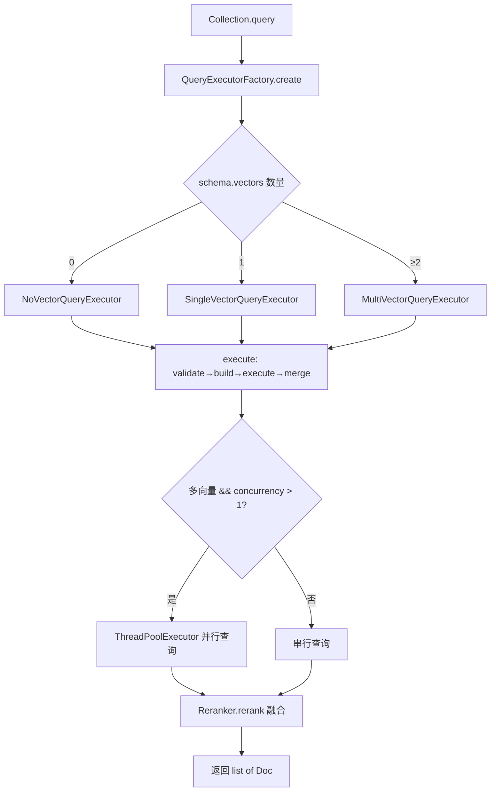
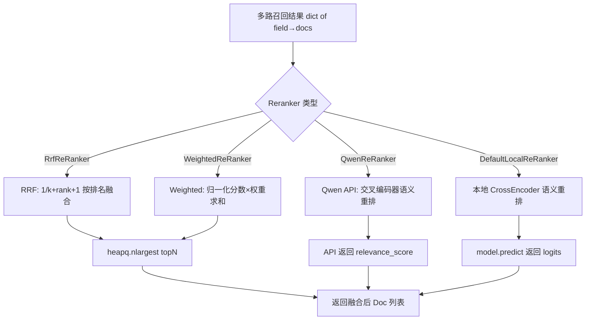

# PD-08.31 zvec — HNSW/IVF/Flat 三索引 + BM25 稀疏向量混合检索与 RRF/Weighted/Qwen 三策略 Reranker 融合

> 文档编号：PD-08.31
> 来源：zvec `python/zvec/executor/query_executor.py`, `python/zvec/extension/multi_vector_reranker.py`
> GitHub：https://github.com/alibaba/zvec.git
> 问题域：PD-08 搜索与检索 Search & Retrieval
> 状态：可复用方案

---

## 第 1 章 问题与动机

### 1.1 核心问题

向量检索系统面临三个核心挑战：

1. **索引算法选择困境**：HNSW 适合低延迟在线查询但内存占用大，IVF 适合大规模离线场景但需要训练聚类中心，Flat 精确但不可扩展。不同业务场景需要不同索引策略，系统需要在同一 Collection 中支持多种索引类型。

2. **语义鸿沟与词汇匹配的矛盾**：Dense embedding 擅长语义相似度但会丢失精确关键词匹配能力，BM25 稀疏向量擅长词汇匹配但缺乏语义理解。单一检索方式无法同时满足两种需求。

3. **多路召回结果融合**：当同一文档集合上存在多个向量字段（如 dense + sparse），每路召回的分数尺度不同（L2 距离 vs BM25 分数 vs 余弦相似度），直接合并会导致某一路主导结果。

### 1.2 zvec 的解法概述

zvec 是阿里巴巴开源的嵌入式向量搜索引擎，C++ 核心 + Python SDK，提供了一套完整的混合检索方案：

1. **三索引并存**：同一 Collection 的不同向量字段可分别创建 HNSW、IVF、Flat 索引，通过 `CollectionSchema` 的多 `VectorSchema` 定义实现（`python/zvec/model/schema/collection_schema.py:59`）

2. **Dense + Sparse 双向量字段**：Schema 层面原生支持 `VECTOR_FP32/FP16/FP64/INT8` 密集向量和 `SPARSE_VECTOR_FP32/FP16` 稀疏向量共存，BM25 通过 `BM25EmbeddingFunction` 生成稀疏向量写入同一 Collection（`python/zvec/extension/bm25_embedding_function.py:24`）

3. **策略模式 Reranker 体系**：`RerankFunction` 抽象基类定义统一接口，RRF/Weighted/Qwen/LocalCrossEncoder 四种实现可插拔替换（`python/zvec/extension/rerank_function.py:22`）

4. **QueryExecutor 工厂 + 并行执行**：`QueryExecutorFactory` 根据 Schema 向量字段数量自动选择 No/Single/Multi 三种执行器，多向量查询通过 `ThreadPoolExecutor` 并行执行（`python/zvec/executor/query_executor.py:299`）

5. **Protocol 级嵌入抽象**：`DenseEmbeddingFunction` 和 `SparseEmbeddingFunction` 使用 Python `Protocol` 定义，支持 OpenAI/Qwen/Jina/SentenceTransformer/BM25 六种后端无缝切换（`python/zvec/extension/embedding_function.py:22`）

### 1.3 设计思想

| 设计原则 | 具体实现 | 理由 | 替代方案 |
|----------|----------|------|----------|
| 索引与查询正交 | Schema 定义向量字段类型，索引类型通过 `create_index()` 独立绑定 | 同一向量字段可在不同阶段切换索引策略 | 索引类型写死在 Schema 中 |
| 策略模式 Reranker | `RerankFunction` ABC + 4 种实现，通过 `query(reranker=)` 参数注入 | 业务层按需选择融合策略，无需修改查询逻辑 | if-else 硬编码融合逻辑 |
| 工厂自动适配 | `QueryExecutorFactory.create()` 按向量字段数量返回对应执行器 | 用户无需关心单/多向量差异，API 统一 | 用户手动选择执行器 |
| Protocol 而非继承 | `DenseEmbeddingFunction` 用 `@runtime_checkable Protocol` | 第三方实现无需继承基类，duck typing 即可 | ABC 强制继承 |
| C++ 核心 + Python 胶水 | 索引/查询/存储全在 C++ `_zvec` 模块，Python 层只做编排和扩展 | 性能关键路径零 Python 开销 | 纯 Python 实现 |

---

## 第 2 章 源码实现分析

### 2.1 架构概览

zvec 的混合检索架构分为三层：C++ 核心引擎、Python 查询编排层、Python 扩展层。

```
┌─────────────────────────────────────────────────────────────────┐
│                     Python SDK (zvec)                           │
│  ┌──────────────┐  ┌──────────────────┐  ┌──────────────────┐  │
│  │  Collection   │  │  QueryExecutor   │  │   Extension      │  │
│  │  .query()     │──│  Factory→Exec    │──│  Embedding +     │  │
│  │  .insert()    │  │  Single/Multi    │  │  Reranker        │  │
│  └──────────────┘  └──────────────────┘  └──────────────────┘  │
│         │                   │                      │            │
│         ▼                   ▼                      ▼            │
│  ┌──────────────────────────────────────────────────────────┐  │
│  │              _zvec (C++ pybind11 模块)                    │  │
│  │  _Collection.Query() / CreateIndex() / Insert()          │  │
│  │  HNSW / IVF / Flat 索引实现 + 距离计算 + 存储引擎        │  │
│  └──────────────────────────────────────────────────────────┘  │
└─────────────────────────────────────────────────────────────────┘
```

### 2.2 核心实现

#### 2.2.1 QueryExecutor 工厂与策略分发



对应源码 `python/zvec/executor/query_executor.py:228-238`：

```python
@final
def execute(self, ctx: QueryContext, collection: _Collection) -> list[Doc]:
    # 1. validate query
    self._do_validate(ctx)
    # 2. build query vector
    query_vectors = self._do_build(ctx, collection)
    if not query_vectors:
        raise ValueError("No query to execute")
    # 3. execute query
    docs = self._do_execute(query_vectors, collection)
    # 4. merge and rerank result
    return self._do_merge_rerank_results(ctx, docs)
```

`execute()` 方法用 `@final` 装饰器锁定模板方法，子类只能覆写 `_do_validate` 和 `_do_build`。`MultiVectorQueryExecutor` 在 `_do_validate` 中强制要求多向量查询必须提供 Reranker（`query_executor.py:283`）。

并行执行逻辑（`query_executor.py:196-211`）：

```python
with ThreadPoolExecutor(max_workers=self._concurrency) as executor:
    future_to_query = {
        executor.submit(collection.Query, query): query.field_name
        for query in vectors
    }
    for future in as_completed(future_to_query):
        field_name = future_to_query[future]
        docs = future.result()
        results[field_name] = [
            convert_to_py_doc(doc, self._schema) for doc in docs
        ]
```

并发度通过环境变量 `ZVEC_QUERY_CONCURRENCY` 控制（`query_executor.py:122`），默认为 1（串行），生产环境可设为 CPU 核数。

#### 2.2.2 三策略 Reranker 融合



RRF 实现（`python/zvec/extension/multi_vector_reranker.py:62-88`）：

```python
def rerank(self, query_results: dict[str, list[Doc]]) -> list[Doc]:
    rrf_scores: dict[str, float] = defaultdict(float)
    id_to_doc: dict[str, Doc] = {}
    for _, query_result in query_results.items():
        for rank, doc in enumerate(query_result):
            doc_id = doc.id
            rrf_score = self._rrf_score(rank)  # 1/(k + rank + 1)
            rrf_scores[doc_id] += rrf_score
            if doc_id not in id_to_doc:
                id_to_doc[doc_id] = doc
    top_docs = heapq.nlargest(self.topn, rrf_scores.items(), key=lambda x: x[1])
    results: list[Doc] = []
    for doc_id, rrf_score in top_docs:
        doc = id_to_doc[doc_id]
        new_doc = doc._replace(score=rrf_score)
        results.append(new_doc)
    return results
```

WeightedReRanker 的分数归一化（`multi_vector_reranker.py:167-174`）支持三种距离度量：
- L2: `1.0 - 2 * atan(score) / π`（距离越小分数越高）
- IP: `0.5 + atan(score) / π`（内积映射到 [0,1]）
- COSINE: `1.0 - score / 2.0`（余弦距离转相似度）

### 2.3 实现细节

#### 嵌入后端 Protocol 体系

zvec 的嵌入层使用 `@runtime_checkable Protocol` 而非 ABC 继承，这意味着任何实现了 `embed(input) -> DenseVectorType` 方法的类都自动满足接口约束（`python/zvec/extension/embedding_function.py:22-84`）。

当前内置 6 种嵌入后端：

| 后端 | 类型 | 模型 | 是否需要 API |
|------|------|------|-------------|
| `DefaultLocalDenseEmbedding` | Dense | all-MiniLM-L6-v2 / GTE-small | 否 |
| `DefaultLocalSparseEmbedding` | Sparse | SPLADE-cocondenser | 否 |
| `OpenAIDenseEmbedding` | Dense | text-embedding-3-small/large | 是 |
| `QwenDenseEmbedding` | Dense | text-embedding-v4 | 是 |
| `QwenSparseEmbedding` | Sparse | text-embedding-v4 (sparse) | 是 |
| `BM25EmbeddingFunction` | Sparse | DashText BM25 | 否 |

BM25 实现的关键设计：区分 `encoding_type="query"` 和 `"document"` 两种编码模式（`bm25_embedding_function.py:351-354`），query 模式用 `encode_queries()`，document 模式用 `encode_documents()`，这对非对称检索至关重要。同时支持内置编码器（中英文 Wikipedia 预训练）和自定义语料训练两种模式。

#### SPLADE 模型缓存

`DefaultLocalSparseEmbedding` 使用类级别 `_model_cache: ClassVar[dict]` 缓存已加载模型（`sentence_transformer_embedding_function.py:513`），多个实例共享同一模型实例。缓存键为 `(model_name, model_source, device)` 三元组，不同 `encoding_type` 的实例可共享模型但独立编码。


---

## 第 3 章 迁移指南

### 3.1 迁移清单

**阶段 1：基础向量检索（1-2 天）**
- [ ] 安装 zvec：`pip install zvec`
- [ ] 定义 CollectionSchema，包含至少一个 VectorSchema 字段
- [ ] 选择嵌入后端（本地 SentenceTransformer 或 API）
- [ ] 实现 insert + query 基本流程

**阶段 2：混合检索（1-2 天）**
- [ ] 添加第二个向量字段（sparse），使用 BM25 或 SPLADE 生成稀疏向量
- [ ] 为两个向量字段分别创建索引（HNSW + Flat/InvertIndex）
- [ ] 配置 Reranker（推荐从 RRF 开始）
- [ ] 调整 `ZVEC_QUERY_CONCURRENCY` 环境变量启用并行查询

**阶段 3：生产优化（1-2 天）**
- [ ] 根据数据规模选择索引类型（<100K 用 Flat，100K-10M 用 HNSW，>10M 用 IVF）
- [ ] 调优 HNSW 参数（ef_construction, M）和 IVF 参数（nlist, nprobe）
- [ ] 评估 WeightedReRanker 权重分配或引入 QwenReRanker 语义重排
- [ ] 配置 `zvec.init()` 的 `memory_limit_mb` 和 `query_threads`

### 3.2 适配代码模板

#### 混合检索完整示例

```python
import zvec
from zvec import (
    CollectionSchema, FieldSchema, VectorSchema, DataType,
    VectorQuery, HnswIndexParam, Doc
)
from zvec.extension import (
    DefaultLocalDenseEmbedding, BM25EmbeddingFunction,
    RrfReRanker, WeightedReRanker
)

# 1. 初始化引擎
zvec.init(memory_limit_mb=2048, query_threads=4)

# 2. 定义 Schema：dense + sparse 双向量字段
schema = CollectionSchema(
    name="hybrid_search",
    fields=[
        FieldSchema("title", DataType.STRING),
        FieldSchema("content", DataType.STRING),
    ],
    vectors=[
        VectorSchema("dense_emb", dim=384, data_type=DataType.VECTOR_FP32),
        VectorSchema("sparse_emb", data_type=DataType.SPARSE_VECTOR_FP32),
    ],
)

# 3. 创建 Collection 并建索引
coll = zvec.create_and_open("./my_hybrid_collection", schema)
coll.create_index("dense_emb", HnswIndexParam(m=16, ef_construction=200))

# 4. 初始化嵌入函数
dense_fn = DefaultLocalDenseEmbedding()
sparse_fn = BM25EmbeddingFunction(language="zh", encoding_type="document")

# 5. 写入文档
docs_to_insert = [
    {"title": "向量搜索入门", "content": "向量搜索是一种基于相似度的检索方法..."},
    {"title": "BM25 算法详解", "content": "BM25 是经典的概率检索模型..."},
]
for doc_data in docs_to_insert:
    doc = Doc(
        id=doc_data["title"],
        fields={"title": doc_data["title"], "content": doc_data["content"]},
        vectors={
            "dense_emb": dense_fn.embed(doc_data["content"]),
            "sparse_emb": sparse_fn.embed(doc_data["content"]),
        },
    )
    coll.insert(doc)
coll.flush()

# 6. 混合检索 + RRF 融合
query_text = "什么是向量检索"
dense_query_fn = DefaultLocalDenseEmbedding()
sparse_query_fn = BM25EmbeddingFunction(language="zh", encoding_type="query")

results = coll.query(
    vectors=[
        VectorQuery("dense_emb", vector=dense_query_fn.embed(query_text)),
        VectorQuery("sparse_emb", vector=sparse_query_fn.embed(query_text)),
    ],
    topk=10,
    reranker=RrfReRanker(topn=5, rank_constant=60),
    output_fields=["title", "content"],
)

for doc in results:
    print(f"[{doc.score:.4f}] {doc.field('title')}")
```

#### 自定义 Reranker 实现

```python
from zvec.extension.rerank_function import RerankFunction
from zvec.model.doc import Doc

class MyCustomReRanker(RerankFunction):
    """自定义 Reranker：基于业务规则的加权融合"""

    def __init__(self, topn: int = 10, boost_field: str = "is_premium"):
        super().__init__(topn=topn)
        self._boost_field = boost_field

    def rerank(self, query_results: dict[str, list[Doc]]) -> list[Doc]:
        all_docs: dict[str, Doc] = {}
        scores: dict[str, float] = {}
        for field_name, docs in query_results.items():
            for rank, doc in enumerate(docs):
                if doc.id not in all_docs:
                    all_docs[doc.id] = doc
                    scores[doc.id] = 0.0
                scores[doc.id] += 1.0 / (60 + rank + 1)
                # 业务加权：premium 文档加分
                if doc.field(self._boost_field):
                    scores[doc.id] *= 1.5
        sorted_ids = sorted(scores, key=scores.get, reverse=True)[:self.topn]
        return [all_docs[did]._replace(score=scores[did]) for did in sorted_ids]
```

### 3.3 适用场景

| 场景 | 适用度 | 说明 |
|------|--------|------|
| 嵌入式向量数据库 | ⭐⭐⭐ | zvec 是嵌入式引擎，无需部署服务端，适合单机/边缘场景 |
| 混合检索（语义+关键词） | ⭐⭐⭐ | Dense+Sparse 双向量 + Reranker 是核心能力 |
| 多模态检索 | ⭐⭐ | Schema 支持多向量字段，但当前嵌入扩展主要面向文本 |
| 大规模分布式检索 | ⭐ | 嵌入式架构，不支持分布式部署，>10M 级别需考虑 IVF |
| RAG 管道集成 | ⭐⭐⭐ | Protocol 接口 + 多嵌入后端，易于集成到 LangChain/LlamaIndex |
| 实时写入+查询 | ⭐⭐ | 支持 upsert/flush，但无 WAL，crash 可能丢失未 flush 数据 |

---

## 第 4 章 测试用例

```python
import pytest
from collections import defaultdict
from unittest.mock import MagicMock
from zvec.extension.multi_vector_reranker import RrfReRanker, WeightedReRanker
from zvec.model.doc import Doc
from zvec.typing import MetricType


class TestRrfReRanker:
    """RRF 融合策略测试"""

    def _make_doc(self, doc_id: str, score: float = 0.0) -> Doc:
        return Doc(id=doc_id, score=score, fields={"content": f"doc {doc_id}"})

    def test_single_field_ranking(self):
        """单路召回：RRF 分数 = 1/(k+rank+1)"""
        reranker = RrfReRanker(topn=3, rank_constant=60)
        results = {
            "dense": [self._make_doc("a"), self._make_doc("b"), self._make_doc("c")]
        }
        ranked = reranker.rerank(results)
        assert len(ranked) == 3
        assert ranked[0].id == "a"  # rank=0, score=1/61
        assert ranked[1].id == "b"  # rank=1, score=1/62
        assert abs(ranked[0].score - 1.0 / 61) < 1e-6

    def test_multi_field_fusion(self):
        """多路召回：同一文档在多路中出现，RRF 分数累加"""
        reranker = RrfReRanker(topn=2, rank_constant=60)
        results = {
            "dense": [self._make_doc("a"), self._make_doc("b")],
            "sparse": [self._make_doc("b"), self._make_doc("c")],
        }
        ranked = reranker.rerank(results)
        # b 在两路中都出现：1/61 + 1/61 > a 的 1/61
        assert ranked[0].id == "b"

    def test_topn_limit(self):
        """topn 限制返回数量"""
        reranker = RrfReRanker(topn=1)
        results = {"dense": [self._make_doc("a"), self._make_doc("b")]}
        ranked = reranker.rerank(results)
        assert len(ranked) == 1

    def test_empty_results(self):
        """空结果不报错"""
        reranker = RrfReRanker(topn=5)
        results = {"dense": []}
        ranked = reranker.rerank(results)
        assert len(ranked) == 0


class TestWeightedReRanker:
    """加权融合策略测试"""

    def _make_doc(self, doc_id: str, score: float) -> Doc:
        return Doc(id=doc_id, score=score)

    def test_l2_normalization(self):
        """L2 距离归一化：距离越小分数越高"""
        reranker = WeightedReRanker(topn=2, metric=MetricType.L2)
        score_0 = reranker._normalize_score(0.0, MetricType.L2)
        score_large = reranker._normalize_score(100.0, MetricType.L2)
        assert score_0 > score_large  # 距离 0 的分数最高

    def test_cosine_normalization(self):
        """余弦距离归一化：cosine_distance=0 → score=1.0"""
        reranker = WeightedReRanker(topn=2, metric=MetricType.COSINE)
        score = reranker._normalize_score(0.0, MetricType.COSINE)
        assert abs(score - 1.0) < 1e-6

    def test_weighted_fusion(self):
        """权重融合：dense 权重 0.7，sparse 权重 0.3"""
        reranker = WeightedReRanker(
            topn=2,
            metric=MetricType.COSINE,
            weights={"dense": 0.7, "sparse": 0.3},
        )
        results = {
            "dense": [self._make_doc("a", 0.1), self._make_doc("b", 0.5)],
            "sparse": [self._make_doc("b", 0.2), self._make_doc("a", 0.8)],
        }
        ranked = reranker.rerank(results)
        assert len(ranked) == 2


class TestQueryExecutorFactory:
    """执行器工厂测试"""

    def test_factory_selects_correct_executor(self):
        """工厂根据向量字段数量选择执行器"""
        from zvec.executor.query_executor import (
            QueryExecutorFactory, NoVectorQueryExecutor,
            SingleVectorQueryExecutor, MultiVectorQueryExecutor,
        )
        # 需要 mock schema，参见源项目 test_query_executor.py
        # 0 向量 → NoVectorQueryExecutor
        # 1 向量 → SingleVectorQueryExecutor
        # ≥2 向量 → MultiVectorQueryExecutor
```


---

## 第 5 章 跨域关联

| 关联域 | 关系类型 | 说明 |
|--------|----------|------|
| PD-01 上下文管理 | 协同 | 检索结果需要经过 token 预算裁剪后注入 LLM 上下文，zvec 的 `topk` 和 `output_fields` 可控制返回数据量 |
| PD-03 容错与重试 | 协同 | `QwenReRanker` 依赖外部 API，需要容错降级到本地 `DefaultLocalReRanker` 或 `RrfReRanker` |
| PD-04 工具系统 | 依赖 | zvec 的 `Collection.query()` 可封装为 Agent 工具，通过 MCP 协议暴露向量检索能力 |
| PD-06 记忆持久化 | 协同 | zvec 的 Collection 本身就是持久化存储，可作为 Agent 长期记忆的向量索引后端 |
| PD-11 可观测性 | 协同 | `zvec.init()` 支持 `LogType.FILE` + 日志轮转，可追踪查询性能；`ZVEC_QUERY_CONCURRENCY` 影响并发度 |

---

## 第 6 章 来源文件索引

| 文件 | 行范围 | 关键实现 |
|------|--------|----------|
| `python/zvec/executor/query_executor.py` | L119-L308 | QueryExecutor 抽象基类 + Factory + No/Single/Multi 三种执行器 |
| `python/zvec/extension/multi_vector_reranker.py` | L26-L175 | RrfReRanker + WeightedReRanker 实现 |
| `python/zvec/extension/rerank_function.py` | L22-L69 | RerankFunction 抽象基类 |
| `python/zvec/extension/qwen_rerank_function.py` | L23-L163 | QwenReRanker：DashScope API 交叉编码器重排 |
| `python/zvec/extension/sentence_transformer_rerank_function.py` | L24-L385 | DefaultLocalReRanker：本地 CrossEncoder 重排 |
| `python/zvec/extension/embedding_function.py` | L22-L148 | DenseEmbeddingFunction + SparseEmbeddingFunction Protocol |
| `python/zvec/extension/bm25_embedding_function.py` | L24-L376 | BM25EmbeddingFunction：DashText BM25 稀疏向量 |
| `python/zvec/extension/sentence_transformer_embedding_function.py` | L25-L840 | DefaultLocalDenseEmbedding + DefaultLocalSparseEmbedding (SPLADE) |
| `python/zvec/extension/openai_embedding_function.py` | L24-L239 | OpenAIDenseEmbedding |
| `python/zvec/extension/qwen_embedding_function.py` | L24-L538 | QwenDenseEmbedding + QwenSparseEmbedding |
| `python/zvec/model/collection.py` | L44-L380 | Collection 类：DDL/DML/DQL 统一入口 |
| `python/zvec/model/schema/collection_schema.py` | L28-L216 | CollectionSchema：多向量字段 Schema 定义 |
| `python/zvec/model/param/vector_query.py` | L25-L81 | VectorQuery：向量查询参数 dataclass |
| `python/zvec/model/doc.py` | L26-L174 | Doc：文档数据模型，支持 _replace 不可变更新 |
| `python/zvec/zvec.py` | L29-L227 | zvec.init() / create_and_open() / open() 顶层 API |
| `python/tests/test_query_executor.py` | L1-L298 | QueryExecutor 单元测试 |

---

## 第 7 章 横向对比维度

```json comparison_data
{
  "project": "zvec",
  "dimensions": {
    "搜索架构": "C++ 嵌入式引擎 + Python SDK，HNSW/IVF/Flat 三索引 + BM25/SPLADE 稀疏向量混合检索",
    "索引结构": "HNSW（在线低延迟）/ IVF（大规模离线）/ Flat（精确暴力搜索）三种可选",
    "排序策略": "RRF/Weighted/Qwen-API/LocalCrossEncoder 四种 Reranker 策略模式可插拔",
    "去重机制": "Reranker 层 id_to_doc 字典自动去重，多路召回同一文档只保留一份",
    "结果处理": "QueryExecutor 模板方法：validate→build→execute→merge_rerank 四步流水线",
    "嵌入后端适配": "Protocol 接口 + 6 种内置后端（OpenAI/Qwen/Jina/ST/SPLADE/BM25）",
    "组件正交": "Schema/Index/Embedding/Reranker 四层独立，任意组合不互相影响",
    "容错策略": "API Reranker 可降级到本地 CrossEncoder 或无模型 RRF",
    "成本控制": "本地 SentenceTransformer/BM25 零 API 成本，LRU 缓存减少重复嵌入调用",
    "缓存机制": "嵌入函数 LRU cache(maxsize=10) + SPLADE 类级别模型缓存共享实例"
  }
}
```

### 域元数据补充

```json domain_metadata
{
  "solution_summary": "zvec 用 C++ 嵌入式引擎支持 HNSW/IVF/Flat 三索引，通过 Dense+Sparse 双向量字段实现混合检索，RRF/Weighted/Qwen/CrossEncoder 四种 Reranker 策略模式融合多路召回",
  "description": "嵌入式向量引擎的多索引混合检索与可插拔 Reranker 融合策略",
  "sub_problems": [
    "多索引类型共存：同一 Collection 不同向量字段如何绑定不同索引算法（HNSW/IVF/Flat）",
    "距离度量归一化：L2/IP/COSINE 不同度量的分数如何统一到 [0,1] 区间进行加权融合",
    "嵌入函数 Protocol 设计：如何用 duck typing 而非继承实现嵌入后端可插拔",
    "查询并发度控制：多向量并行查询的线程池大小如何根据部署环境自适应"
  ],
  "best_practices": [
    "Protocol 优于 ABC：嵌入接口用 @runtime_checkable Protocol 定义，第三方实现无需继承即可接入",
    "模板方法锁定流程：QueryExecutor.execute() 用 @final 固定 validate→build→execute→merge 四步，子类只覆写策略点",
    "RRF 是最稳健的多路融合起点：不依赖分数尺度，rank_constant=60 是经验最优值",
    "类级别模型缓存：SPLADE 等大模型用 ClassVar dict 缓存，多实例共享避免重复加载"
  ]
}
```

