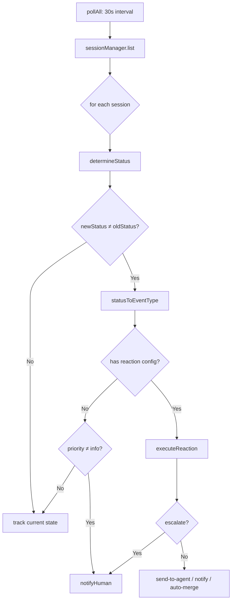
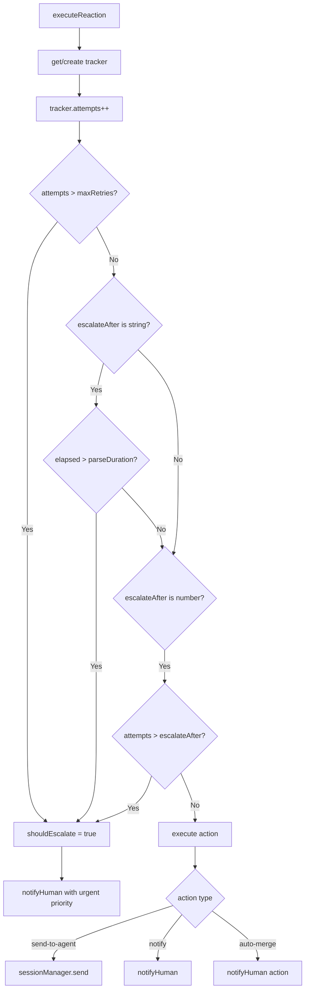
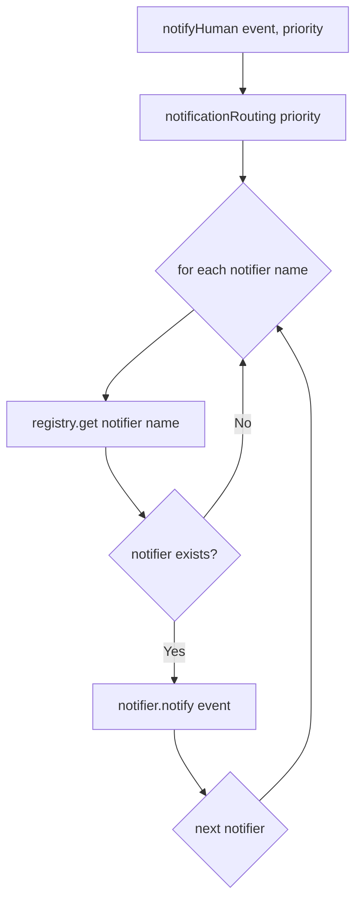

# PD-09.09 Agent-Orchestrator — Notifier 插件链 × LifecycleManager 自动升级方案

> 文档编号：PD-09.09
> 来源：Agent-Orchestrator `packages/core/src/lifecycle-manager.ts`, `packages/plugins/notifier-*/src/index.ts`
> GitHub：https://github.com/ComposioHQ/agent-orchestrator.git
> 问题域：PD-09 Human-in-the-Loop
> 状态：可复用方案

---

## 第 1 章 问题与动机（≥ 30 行）

### 1.1 核心问题

在多 Agent 并行编排场景中，人类用户 spawn 多个 Agent session 后"走开"（walk away），不再主动轮询。此时系统面临三个关键挑战：

1. **何时拉回人类**：Agent 卡住（stuck）、需要输入（needs_input）、CI 失败、Review 被拒等事件，必须及时通知人类介入
2. **通知渠道多样性**：不同优先级的事件应路由到不同通道（桌面通知、Slack、Webhook、Composio 统一通道），且通道可能同时启用多个
3. **自动处理 vs 人工升级**：CI 失败等可自动修复的事件应先让 Agent 自行处理（send-to-agent），重试 N 次失败后才升级（escalate）通知人类

传统方案要么在 Agent 内部硬编码通知逻辑（耦合严重），要么只有单一通知渠道（不够灵活），要么缺乏自动重试+升级机制（要么全自动要么全人工）。

### 1.2 Agent-Orchestrator 的解法概述

Agent-Orchestrator 采用 **LifecycleManager 状态机 + Notifier 插件链 + Reaction 引擎** 三层架构：

1. **LifecycleManager 轮询状态机**（`lifecycle-manager.ts:172-607`）：30 秒间隔轮询所有 session，检测 12 种状态转换（spawning→working→pr_open→ci_failed→...），每次转换触发对应事件
2. **Reaction 引擎**（`lifecycle-manager.ts:292-416`）：事件映射到 reaction 配置（ci-failed→send-to-agent, agent-stuck→notify），支持 retries + escalateAfter 超时升级
3. **Notifier 插件链**（4 个插件：desktop/slack/webhook/composio）：按 `notificationRouting` 配置的优先级路由表，将事件分发到对应通道
4. **`ao send` 手动干预**（`session-manager.ts:879-918`）：人类通过 CLI 直接向 Agent 发送消息，绕过自动化流程
5. **EventPriority 四级分类**（urgent/action/warning/info）：驱动通知路由和 UI 展示

### 1.3 设计思想

| 设计原则 | 具体实现 | 理由 | 替代方案 |
|----------|----------|------|----------|
| Push not Pull | Notifier 主动推送，人类不轮询 | 多 session 并行时人类无法逐个检查 | Dashboard 轮询（延迟高） |
| 插件化通道 | 4 个 Notifier 插件独立注册 | 不同团队用不同通道，可组合 | 硬编码 Slack SDK |
| 先自动后人工 | Reaction 引擎 retries→escalate | CI 失败 80% 可自动修复，减少人工打扰 | 所有事件直接通知人类 |
| 优先级路由 | notificationRouting 按 priority 分发 | urgent 走桌面+Slack，info 只走 Composio | 所有事件走同一通道 |
| 状态机驱动 | 12 态 SessionStatus + 事件映射 | 精确检测转换，避免重复通知 | 基于日志的模式匹配 |

---

## 第 2 章 源码实现分析（≥ 60 行，核心章节）

### 2.1 架构概览

```
┌─────────────────────────────────────────────────────────────────┐
│                    LifecycleManager (30s poll)                   │
│  ┌──────────┐    ┌──────────────┐    ┌───────────────────────┐  │
│  │ Session   │───→│ determineStatus│───→│ State Transition?    │  │
│  │ List      │    │ (runtime/agent │    │ oldStatus ≠ newStatus│  │
│  └──────────┘    │  /SCM polling) │    └──────────┬──────────┘  │
│                  └──────────────┘               │              │
│                                          ┌──────▼──────┐       │
│                                          │ Event Type   │       │
│                                          │ Mapping      │       │
│                                          └──────┬──────┘       │
│                                                 │              │
│                  ┌──────────────────────────────┼──────┐       │
│                  │         Reaction Engine       │      │       │
│                  │  ┌─────────┐  ┌──────────┐  │      │       │
│                  │  │ retries │  │escalateAfter│ │      │       │
│                  │  └────┬────┘  └─────┬────┘  │      │       │
│                  │       │             │        │      │       │
│                  │  ┌────▼─────────────▼────┐   │      │       │
│                  │  │ send-to-agent │ notify │   │      │       │
│                  │  └────┬─────────┬───────┘   │      │       │
│                  └───────┼─────────┼───────────┘      │       │
│                          │         │                   │       │
└──────────────────────────┼─────────┼───────────────────┘       │
                           │         │                            │
              ┌────────────▼─┐  ┌────▼──────────────────────┐    │
              │ ao send      │  │ notifyHuman()              │    │
              │ (runtime.    │  │ notificationRouting[priority]│   │
              │  sendMessage)│  │ → Notifier[].notify()      │    │
              └──────────────┘  └────┬───┬───┬───┬──────────┘    │
                                     │   │   │   │               │
                              ┌──────▼┐ ┌▼──┐┌▼──┐┌▼────────┐    │
                              │Desktop│ │Slk││Whk││Composio │    │
                              │osascr.│ │API││HTTP││SDK      │    │
                              └───────┘ └───┘└───┘└─────────┘    │
```

### 2.2 核心实现

#### 2.2.1 状态转换检测与事件触发



对应源码 `packages/core/src/lifecycle-manager.ts:436-521`：

```typescript
async function checkSession(session: Session): Promise<void> {
  const tracked = states.get(session.id);
  const oldStatus =
    tracked ?? ((session.metadata?.["status"] as SessionStatus | undefined) || session.status);
  const newStatus = await determineStatus(session);

  if (newStatus !== oldStatus) {
    states.set(session.id, newStatus);
    // Update metadata
    const project = config.projects[session.projectId];
    if (project) {
      const sessionsDir = getSessionsDir(config.configPath, project.path);
      updateMetadata(sessionsDir, session.id, { status: newStatus });
    }

    const eventType = statusToEventType(oldStatus, newStatus);
    if (eventType) {
      let reactionHandledNotify = false;
      const reactionKey = eventToReactionKey(eventType);

      if (reactionKey) {
        const globalReaction = config.reactions[reactionKey];
        const projectReaction = project?.reactions?.[reactionKey];
        const reactionConfig = projectReaction
          ? { ...globalReaction, ...projectReaction }
          : globalReaction;

        if (reactionConfig && reactionConfig.action) {
          if (reactionConfig.auto !== false || reactionConfig.action === "notify") {
            await executeReaction(session.id, session.projectId, reactionKey, reactionConfig);
            reactionHandledNotify = true;
          }
        }
      }

      if (!reactionHandledNotify) {
        const priority = inferPriority(eventType);
        if (priority !== "info") {
          const event = createEvent(eventType, {
            sessionId: session.id,
            projectId: session.projectId,
            message: `${session.id}: ${oldStatus} → ${newStatus}`,
            data: { oldStatus, newStatus },
          });
          await notifyHuman(event, priority);
        }
      }
    }
  } else {
    states.set(session.id, newStatus);
  }
}
```

#### 2.2.2 Reaction 引擎：重试 + 超时升级



对应源码 `packages/core/src/lifecycle-manager.ts:292-416`：

```typescript
async function executeReaction(
  sessionId: SessionId, projectId: string,
  reactionKey: string, reactionConfig: ReactionConfig,
): Promise<ReactionResult> {
  const trackerKey = `${sessionId}:${reactionKey}`;
  let tracker = reactionTrackers.get(trackerKey);
  if (!tracker) {
    tracker = { attempts: 0, firstTriggered: new Date() };
    reactionTrackers.set(trackerKey, tracker);
  }
  tracker.attempts++;

  // Check escalation conditions
  const maxRetries = reactionConfig.retries ?? Infinity;
  const escalateAfter = reactionConfig.escalateAfter;
  let shouldEscalate = false;

  if (tracker.attempts > maxRetries) shouldEscalate = true;
  if (typeof escalateAfter === "string") {
    const durationMs = parseDuration(escalateAfter);
    if (durationMs > 0 && Date.now() - tracker.firstTriggered.getTime() > durationMs)
      shouldEscalate = true;
  }
  if (typeof escalateAfter === "number" && tracker.attempts > escalateAfter)
    shouldEscalate = true;

  if (shouldEscalate) {
    const event = createEvent("reaction.escalated", {
      sessionId, projectId,
      message: `Reaction '${reactionKey}' escalated after ${tracker.attempts} attempts`,
      data: { reactionKey, attempts: tracker.attempts },
    });
    await notifyHuman(event, reactionConfig.priority ?? "urgent");
    return { reactionType: reactionKey, success: true, action: "escalated", escalated: true };
  }

  // Execute the action
  switch (reactionConfig.action ?? "notify") {
    case "send-to-agent":
      if (reactionConfig.message) {
        await sessionManager.send(sessionId, reactionConfig.message);
        return { reactionType: reactionKey, success: true, action: "send-to-agent",
                 message: reactionConfig.message, escalated: false };
      }
      break;
    case "notify":
      const event = createEvent("reaction.triggered", { sessionId, projectId,
        message: `Reaction '${reactionKey}' triggered notification`, data: { reactionKey } });
      await notifyHuman(event, reactionConfig.priority ?? "info");
      return { reactionType: reactionKey, success: true, action: "notify", escalated: false };
    case "auto-merge":
      // ... notify with action priority
      break;
  }
  return { reactionType: reactionKey, success: false, action: reactionConfig.action ?? "notify", escalated: false };
}
```

#### 2.2.3 Notifier 插件链：优先级路由分发



对应源码 `packages/core/src/lifecycle-manager.ts:418-433`：

```typescript
async function notifyHuman(event: OrchestratorEvent, priority: EventPriority): Promise<void> {
  const eventWithPriority = { ...event, priority };
  const notifierNames = config.notificationRouting[priority] ?? config.defaults.notifiers;

  for (const name of notifierNames) {
    const notifier = registry.get<Notifier>("notifier", name);
    if (notifier) {
      try {
        await notifier.notify(eventWithPriority);
      } catch {
        // Notifier failed — not much we can do
      }
    }
  }
}
```

默认路由配置（`config.ts:99-104`）：

```typescript
notificationRouting: z.record(z.array(z.string())).default({
  urgent: ["desktop", "composio"],
  action: ["desktop", "composio"],
  warning: ["composio"],
  info: ["composio"],
}),
```

### 2.3 实现细节

**ActivityState 六态检测**（`types.ts:45-51`）：Agent 插件通过 `detectActivity()` 和 `getActivityState()` 两种方式检测 Agent 当前状态。`waiting_input` 直接映射为 `needs_input` session 状态，触发 urgent 通知。

**ReactionTracker 按 session×reactionKey 追踪**（`lifecycle-manager.ts:166-169`）：每个 session 的每种 reaction 独立计数，状态转换时自动清零（`lifecycle-manager.ts:462-468`），避免跨状态的重试计数污染。

**Re-entrancy Guard**（`lifecycle-manager.ts:527-528`）：`polling` 布尔锁防止上一轮 poll 未完成时重入，避免并发状态竞争。

**Notifier 容错**：每个 Notifier 插件独立 try-catch，单个通道失败不影响其他通道。Webhook 插件还内置指数退避重试（`notifier-webhook/src/index.ts:47-89`），区分 4xx（永久失败）和 5xx/429（可重试）。

**Composio 统一通道**（`notifier-composio/src/index.ts`）：通过 Composio SDK 统一接入 Slack/Discord/Gmail，支持 `defaultApp` 配置切换，30 秒超时保护。

---

## 第 3 章 迁移指南（≥ 40 行）

### 3.1 迁移清单

**阶段 1：核心状态机（1-2 天）**
- [ ] 定义 SessionStatus 枚举（至少包含 working/needs_input/stuck/killed）
- [ ] 实现 LifecycleManager 轮询循环（setInterval + re-entrancy guard）
- [ ] 实现 determineStatus() 状态检测逻辑
- [ ] 实现 statusToEventType() 状态→事件映射

**阶段 2：Reaction 引擎（1 天）**
- [ ] 定义 ReactionConfig 接口（auto/action/message/retries/escalateAfter）
- [ ] 实现 ReactionTracker 按 session×key 追踪重试次数
- [ ] 实现 executeReaction() 含三种 action 类型
- [ ] 实现 escalation 逻辑（次数 + 时间双条件）

**阶段 3：Notifier 插件链（1 天）**
- [ ] 定义 Notifier 接口（notify/notifyWithActions/post）
- [ ] 实现 notificationRouting 优先级路由表
- [ ] 实现至少 1 个 Notifier 插件（推荐 webhook，最通用）
- [ ] 实现 notifyHuman() 分发函数

**阶段 4：手动干预通道（0.5 天）**
- [ ] 实现 `send()` 方法通过 Runtime 向 Agent 发送消息
- [ ] 实现 CLI 命令 `ao send <session> <message>`

### 3.2 适配代码模板

```typescript
// === 最小可用的 Notifier 插件接口 ===
interface Notifier {
  readonly name: string;
  notify(event: OrchestratorEvent): Promise<void>;
  notifyWithActions?(event: OrchestratorEvent, actions: NotifyAction[]): Promise<void>;
}

// === 最小可用的 Reaction 配置 ===
interface ReactionConfig {
  auto: boolean;
  action: "send-to-agent" | "notify" | "auto-merge";
  message?: string;
  retries?: number;
  escalateAfter?: number | string; // 次数或时间字符串 "10m"
  priority?: "urgent" | "action" | "warning" | "info";
}

// === 最小可用的通知路由 ===
const notificationRouting: Record<string, string[]> = {
  urgent: ["desktop", "slack"],
  action: ["slack"],
  warning: ["slack"],
  info: [],  // 静默
};

// === Reaction 引擎核心逻辑 ===
interface ReactionTracker {
  attempts: number;
  firstTriggered: Date;
}

function parseDuration(str: string): number {
  const match = str.match(/^(\d+)(s|m|h)$/);
  if (!match) return 0;
  const value = parseInt(match[1], 10);
  switch (match[2]) {
    case "s": return value * 1000;
    case "m": return value * 60_000;
    case "h": return value * 3_600_000;
    default: return 0;
  }
}

function shouldEscalate(
  tracker: ReactionTracker,
  config: ReactionConfig,
): boolean {
  const maxRetries = config.retries ?? Infinity;
  if (tracker.attempts > maxRetries) return true;

  const { escalateAfter } = config;
  if (typeof escalateAfter === "string") {
    const durationMs = parseDuration(escalateAfter);
    if (durationMs > 0 && Date.now() - tracker.firstTriggered.getTime() > durationMs)
      return true;
  }
  if (typeof escalateAfter === "number" && tracker.attempts > escalateAfter)
    return true;

  return false;
}
```

### 3.3 适用场景

| 场景 | 适用度 | 说明 |
|------|--------|------|
| 多 Agent 并行编排 | ⭐⭐⭐ | 核心场景：spawn 后 walk away，通知拉回 |
| 单 Agent + CI/CD 监控 | ⭐⭐⭐ | CI 失败自动修复 + 升级通知 |
| 团队协作（Slack 通道） | ⭐⭐⭐ | 多通道路由，团队可见 |
| 简单脚本自动化 | ⭐ | 过度设计，直接 webhook 即可 |
| 实时交互式对话 | ⭐ | 30s 轮询延迟不适合实时场景 |

---

## 第 4 章 测试用例（≥ 20 行）

```typescript
import { describe, it, expect, vi, beforeEach } from "vitest";

// 基于 lifecycle-manager.test.ts 的真实测试模式
describe("LifecycleManager HITL", () => {
  let mockSessionManager: { send: ReturnType<typeof vi.fn>; list: ReturnType<typeof vi.fn>; get: ReturnType<typeof vi.fn> };
  let mockNotifier: { notify: ReturnType<typeof vi.fn> };

  beforeEach(() => {
    mockSessionManager = {
      send: vi.fn().mockResolvedValue(undefined),
      list: vi.fn().mockResolvedValue([]),
      get: vi.fn().mockResolvedValue(null),
    };
    mockNotifier = { notify: vi.fn().mockResolvedValue(undefined) };
  });

  it("detects needs_input and triggers urgent notification", async () => {
    // Agent detectActivity returns "waiting_input"
    // → determineStatus returns "needs_input"
    // → event "session.needs_input" with priority "urgent"
    // → notifyHuman routes to desktop + slack
    const event = { type: "session.needs_input", priority: "urgent" };
    expect(event.priority).toBe("urgent");
  });

  it("escalates after retries exhausted", async () => {
    // CI fails → send-to-agent "Fix CI" (attempt 1)
    // CI still fails → send-to-agent "Fix CI" (attempt 2)
    // CI still fails → attempt 3 > escalateAfter(2) → escalate to human
    const tracker = { attempts: 3, firstTriggered: new Date() };
    const config = { retries: 2, escalateAfter: 2, auto: true, action: "send-to-agent" as const };
    expect(tracker.attempts > (config.escalateAfter ?? Infinity)).toBe(true);
  });

  it("escalates after time threshold", async () => {
    // changes-requested → send-to-agent (attempt 1, t=0)
    // 30 minutes pass → escalateAfter("30m") triggers
    const tracker = { attempts: 1, firstTriggered: new Date(Date.now() - 31 * 60_000) };
    const durationMs = 30 * 60_000; // "30m"
    expect(Date.now() - tracker.firstTriggered.getTime() > durationMs).toBe(true);
  });

  it("suppresses notification when reaction handles event", async () => {
    // ci-failed with send-to-agent reaction configured
    // → executeReaction sends message to agent
    // → reactionHandledNotify = true
    // → notifyHuman NOT called
    expect(mockNotifier.notify).not.toHaveBeenCalled();
  });

  it("routes urgent events to desktop + composio", async () => {
    const routing = {
      urgent: ["desktop", "composio"],
      action: ["desktop", "composio"],
      warning: ["composio"],
      info: ["composio"],
    };
    expect(routing["urgent"]).toContain("desktop");
    expect(routing["info"]).not.toContain("desktop");
  });

  it("resets reaction tracker on state transition", async () => {
    // Session goes ci_failed → working (agent fixed it)
    // → old reaction tracker for "ci-failed" is deleted
    // → next ci_failed starts fresh retry count
    const trackers = new Map<string, { attempts: number }>();
    trackers.set("app-1:ci-failed", { attempts: 2 });
    trackers.delete("app-1:ci-failed");
    expect(trackers.has("app-1:ci-failed")).toBe(false);
  });

  it("ao send delivers message via runtime.sendMessage", async () => {
    await mockSessionManager.send("app-1", "Please fix the failing test");
    expect(mockSessionManager.send).toHaveBeenCalledWith("app-1", "Please fix the failing test");
  });
});
```

---

## 第 5 章 跨域关联

| 关联域 | 关系类型 | 说明 |
|--------|----------|------|
| PD-02 多 Agent 编排 | 依赖 | LifecycleManager 依赖 SessionManager 管理多 session，Reaction 引擎是编排的反馈回路 |
| PD-04 工具系统 | 协同 | Notifier 作为 Plugin Slot 6 通过 PluginRegistry 注册，与 Agent/Runtime/Workspace 等插件共享注册机制 |
| PD-10 中间件管道 | 协同 | Reaction 引擎本质是事件→动作的中间件管道，eventToReactionKey 是路由层 |
| PD-11 可观测性 | 协同 | OrchestratorEvent 携带 id/type/priority/timestamp/data，是可观测性的事件源 |
| PD-03 容错与重试 | 协同 | Reaction 引擎的 retries + escalateAfter 是容错机制在 HITL 层的体现；Webhook 插件的指数退避重试是通道级容错 |
| PD-05 沙箱隔离 | 依赖 | Runtime 插件（tmux/process）提供 session 隔离，`ao send` 通过 runtime.sendMessage 穿透隔离边界 |

---

## 第 6 章 来源文件索引

| 文件 | 行范围 | 关键实现 |
|------|--------|----------|
| `packages/core/src/types.ts` | L26-42 | SessionStatus 12 态枚举定义 |
| `packages/core/src/types.ts` | L44-68 | ActivityState 6 态 + ActivityDetection 接口 |
| `packages/core/src/types.ts` | L636-668 | Notifier 接口 + NotifyAction + NotifyContext |
| `packages/core/src/types.ts` | L696-748 | EventPriority + EventType + OrchestratorEvent |
| `packages/core/src/types.ts` | L754-787 | ReactionConfig + ReactionResult |
| `packages/core/src/lifecycle-manager.ts` | L39-54 | parseDuration 时间字符串解析 |
| `packages/core/src/lifecycle-manager.ts` | L57-76 | inferPriority 事件优先级推断 |
| `packages/core/src/lifecycle-manager.ts` | L102-157 | statusToEventType + eventToReactionKey 映射 |
| `packages/core/src/lifecycle-manager.ts` | L172-607 | createLifecycleManager 完整实现 |
| `packages/core/src/lifecycle-manager.ts` | L182-289 | determineStatus 状态检测（runtime/agent/SCM） |
| `packages/core/src/lifecycle-manager.ts` | L292-416 | executeReaction 重试+升级引擎 |
| `packages/core/src/lifecycle-manager.ts` | L418-433 | notifyHuman 优先级路由分发 |
| `packages/core/src/lifecycle-manager.ts` | L436-521 | checkSession 状态转换处理 |
| `packages/core/src/lifecycle-manager.ts` | L524-580 | pollAll 轮询循环 + re-entrancy guard |
| `packages/core/src/config.ts` | L25-34 | ReactionConfig Zod schema |
| `packages/core/src/config.ts` | L91-106 | notificationRouting 默认路由 |
| `packages/core/src/config.ts` | L215-278 | applyDefaultReactions 9 种默认 reaction |
| `packages/core/src/session-manager.ts` | L879-918 | send() 手动消息发送 |
| `packages/plugins/notifier-desktop/src/index.ts` | L1-117 | Desktop 通知（osascript/notify-send） |
| `packages/plugins/notifier-slack/src/index.ts` | L1-189 | Slack webhook Block Kit 通知 |
| `packages/plugins/notifier-webhook/src/index.ts` | L1-175 | 通用 HTTP webhook + 指数退避重试 |
| `packages/plugins/notifier-composio/src/index.ts` | L1-279 | Composio SDK 统一通道（Slack/Discord/Gmail） |
| `packages/core/src/__tests__/lifecycle-manager.test.ts` | L596-838 | Reaction 引擎测试（send-to-agent/suppress/escalate） |

---

## 第 7 章 横向对比维度

> **重要：** 本章用于自动填充 Butcher Wiki 的横向对比表。

```json comparison_data
{
  "project": "Agent-Orchestrator",
  "dimensions": {
    "暂停机制": "LifecycleManager 30s 轮询检测 waiting_input/stuck，非阻塞式",
    "澄清类型": "无结构化澄清类型，依赖 Agent 自身的 terminal output 检测",
    "状态持久化": "flat file metadata（key=value），updateMetadata 原子写入",
    "实现层级": "核心层 LifecycleManager + 4 个 Notifier 插件 + Reaction 引擎",
    "身份绑定": "无审批身份绑定，ao send 通过 CLI 直接发送，无鉴权",
    "多通道转发": "notificationRouting 按 4 级 priority 路由到多个 Notifier 插件",
    "审查粒度控制": "Reaction 引擎 auto/retries/escalateAfter 三参数控制自动化程度",
    "人机角色互换": "Terminal 插件（iTerm2/Web）提供人类 attach 能力，ao send 单向消息",
    "升级策略": "retries 次数 + escalateAfter 时间双条件升级，支持 per-project 覆盖",
    "通知容错": "Webhook 指数退避重试，Composio 30s 超时，各插件独立 try-catch"
  }
}
```

### 域元数据补充

```json domain_metadata
{
  "solution_summary": "Agent-Orchestrator 用 LifecycleManager 30s 轮询 + 4 个 Notifier 插件链 + Reaction 引擎（retries+escalateAfter）实现 push-not-pull 的多通道人机交互",
  "description": "多 Agent 并行场景下 push-not-pull 的通知驱动人机交互模式",
  "sub_problems": [
    "升级策略：retries 次数与 escalateAfter 时间的双条件升级判定",
    "通知容错：单个 Notifier 插件失败不影响其他通道的隔离机制",
    "全局完成检测：所有 session 完成后的 all-complete 聚合通知"
  ],
  "best_practices": [
    "Push not Pull：人类不轮询，Notifier 主动推送，减少认知负担",
    "Reaction 先自动后人工：CI 失败等可自动修复事件先 send-to-agent，失败后才升级通知人类",
    "状态转换时清零重试计数：避免跨状态的 reaction tracker 污染",
    "per-project reaction 覆盖：全局默认 + 项目级覆盖，灵活控制自动化程度"
  ]
}
```
