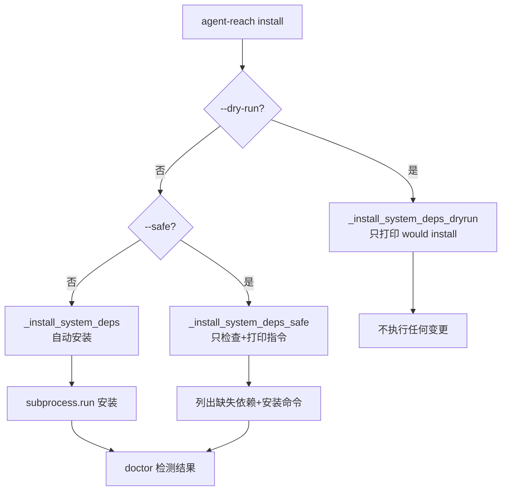
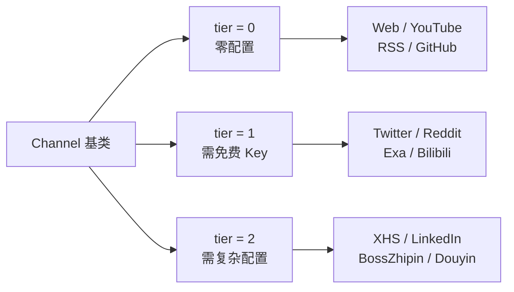
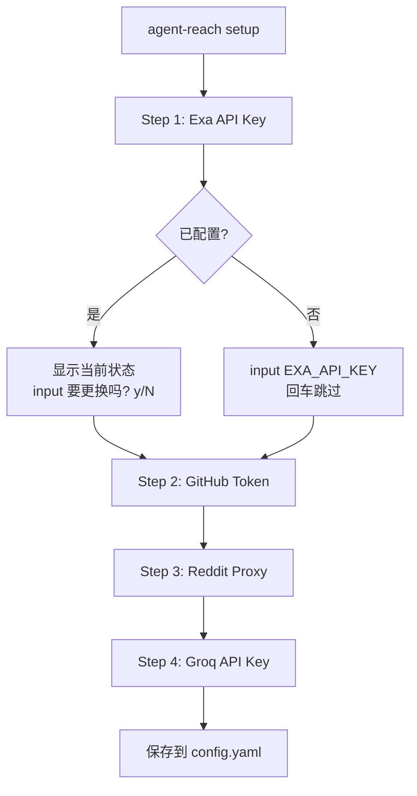

# PD-09.AR AgentReach — 三模式安装向导与 Tier 分级人机协作

> 文档编号：PD-09.AR
> 来源：AgentReach `agent_reach/cli.py`, `agent_reach/channels/base.py`, `docs/install.md`
> GitHub：https://github.com/Panniantong/Agent-Reach.git
> 问题域：PD-09 Human-in-the-Loop
> 状态：可复用方案

---

## 第 1 章 问题与动机（≥ 30 行）

### 1.1 核心问题

AI Agent 在执行系统级操作（安装软件包、修改系统配置、读取浏览器凭据）时，面临一个根本性的信任边界问题：**Agent 应该自主做多少，什么时候必须停下来问人？**

传统方案要么全自动（用户失去控制权，可能造成不可逆的系统变更），要么全手动（Agent 只输出指令让用户复制粘贴，效率极低）。Agent Reach 面对的场景更复杂——它需要在 12+ 个平台上安装上游工具、配置凭据、检测环境，每个平台的人机边界不同：

- **零配置平台**（YouTube、RSS）：Agent 可以完全自主安装
- **需要免费 Key 的平台**（Exa、Twitter）：Agent 可以安装工具，但需要用户提供凭据
- **需要复杂配置的平台**（小红书、LinkedIn）：需要 Docker、浏览器登录、扫码等人工操作

如果用统一的"全部问用户"策略，用户会被 12 个平台的配置问题淹没；如果用"全部自动"策略，Agent 可能在生产服务器上执行 `sudo apt install` 导致事故。

### 1.2 AgentReach 的解法概述

Agent Reach 通过三层机制解决人机协作问题：

1. **三模式安装**（`cli.py:113-233`）：`--safe` / `--dry-run` / 默认自动，将系统变更的决策权分级交给用户
2. **Tier 分级渠道**（`channels/base.py:24`）：tier 0/1/2 三级，明确定义每个平台需要多少人工介入
3. **Doctor 驱动的交互式修复**（`doctor.py:12-24` + `SKILL.md:46-54`）：Agent 不记忆修复步骤，而是每次运行 `doctor` 获取当前状态，根据输出决定下一步——能自动修的自动修，需要人的才问人
4. **Setup 向导**（`cli.py:704-789`）：通过 `input()` 交互式逐步收集 API Key，每步都有"回车跳过"选项
5. **Boundary 文档**（`docs/install.md:27-34`）：用 DO NOT 清单明确定义 Agent 自主操作的边界

### 1.3 设计思想

| 设计原则 | 具体实现 | 理由 | 替代方案 |
|----------|----------|------|----------|
| 渐进式信任 | `--dry-run` → `--safe` → 默认自动三档 | 用户可以先预览再决定信任级别 | 单一模式 + 逐条确认（太繁琐） |
| Tier 分级人机边界 | Channel.tier: 0=零配置, 1=免费Key, 2=需配置 | 不同平台的人工介入程度不同，统一分级 | 每个平台独立定义交互逻辑（不可维护） |
| Doctor 驱动而非记忆驱动 | SKILL.md 明确写"Do NOT memorize per-channel steps" | 平台变化快，硬编码步骤会过时 | Agent 记忆每个平台的配置步骤 |
| 显式边界声明 | install.md 的 DO NOT 清单 | 防止 Agent 越权执行危险操作 | 隐式依赖 Agent 的安全判断 |
| Cookie 统一导入流程 | Cookie-Editor → Header String → Agent 配置 | 所有需要登录的平台用同一个流程 | 每个平台独立的登录方式 |

---

## 第 2 章 源码实现分析（≥ 60 行，核心章节）

### 2.1 架构概览

Agent Reach 的 HITL 架构围绕"安装-诊断-修复"循环展开：

```
┌─────────────────────────────────────────────────────────┐
│                    用户 / AI Agent                        │
│                                                          │
│  "帮我安装 Agent Reach"                                   │
│         │                                                │
│         ▼                                                │
│  ┌──────────────┐    ┌──────────────┐    ┌────────────┐ │
│  │ install      │───→│ doctor       │───→│ configure  │ │
│  │ --safe       │    │ (诊断)       │    │ (修复)     │ │
│  │ --dry-run    │    │              │    │            │ │
│  │ (默认自动)   │    │ Tier 0: ✅   │    │ 自动修复   │ │
│  └──────────────┘    │ Tier 1: ⬜   │    │ 或         │ │
│                      │ Tier 2: ⬜   │    │ 告诉用户   │ │
│                      └──────────────┘    └────────────┘ │
│                             │                    │       │
│                             └────── 循环 ────────┘       │
└─────────────────────────────────────────────────────────┘
                              │
                    ┌─────────┴─────────┐
                    │  Channel Registry  │
                    │  (12 个渠道)       │
                    ├───────────────────┤
                    │ Tier 0: Web,      │
                    │   YouTube, RSS,   │
                    │   GitHub          │
                    │ Tier 1: Twitter,  │
                    │   Reddit, Exa,    │
                    │   Bilibili        │
                    │ Tier 2: XHS,      │
                    │   LinkedIn,       │
                    │   BossZhipin,     │
                    │   Douyin          │
                    └───────────────────┘
```

### 2.2 核心实现

#### 2.2.1 三模式安装：safe / dry-run / 默认自动



对应源码 `agent_reach/cli.py:113-160`：

```python
def _cmd_install(args):
    """One-shot deterministic installer."""
    safe_mode = args.safe
    dry_run = args.dry_run

    config = Config()
    if dry_run:
        print("🔍 DRY RUN — showing what would be done (no changes)")
    if safe_mode:
        print("🛡️  SAFE MODE — skipping automatic system changes")

    # Auto-detect environment
    env = args.env
    if env == "auto":
        env = _detect_environment()

    # ── Install system dependencies ──
    if dry_run:
        _install_system_deps_dryrun()
    elif safe_mode:
        _install_system_deps_safe()
    else:
        _install_system_deps()
```

三个函数的职责分离清晰（`cli.py:277-421`）：
- `_install_system_deps()`：直接执行 `subprocess.run(["apt-get", "install", ...])` 安装
- `_install_system_deps_safe()`：只用 `shutil.which()` 检查，打印 `"To install: ..."` 指令
- `_install_system_deps_dryrun()`：打印 `"[dry-run] Would install via: ..."` 预览

#### 2.2.2 Tier 分级渠道体系



对应源码 `agent_reach/channels/base.py:18-37`：

```python
class Channel(ABC):
    """Base class for all channels."""
    name: str = ""
    description: str = ""
    backends: List[str] = []
    tier: int = 0  # 0=zero-config, 1=needs free key, 2=needs setup

    @abstractmethod
    def can_handle(self, url: str) -> bool:
        """Check if this channel can handle this URL."""
        ...

    def check(self, config=None) -> Tuple[str, str]:
        """Check if this channel's upstream tool is available.
        Returns (status, message) where status is 'ok'/'warn'/'off'/'error'."""
        return "ok", f"{'、'.join(self.backends) if self.backends else '内置'}"
```

Doctor 按 Tier 分组展示（`doctor.py:36-70`），让用户一眼看出哪些需要人工介入：
- Tier 0 标题："✅ 装好即用"
- Tier 1 标题："🔍 搜索（mcporter 即可解锁）"
- Tier 2 标题："🔧 配置后可用"

#### 2.2.3 Setup 向导的交互式收集



对应源码 `agent_reach/cli.py:704-789`：

```python
def _cmd_setup():
    config = Config()
    # Step 1: Exa
    print("【推荐】全网搜索 — Exa Search API")
    current = config.get("exa_api_key")
    if current:
        print(f"  当前状态: ✅ 已配置 ({current[:8]}...)")
        change = input("  要更换吗？[y/N]: ").strip().lower()
        if change != "y":
            print()
        else:
            key = input("  EXA_API_KEY: ").strip()
            if key:
                config.set("exa_api_key", key)
    else:
        print("  当前状态: ⬜ 未配置")
        key = input("  EXA_API_KEY (回车跳过): ").strip()
        if key:
            config.set("exa_api_key", key)
```

### 2.3 实现细节

**环境自动检测**（`cli.py:510-548`）：通过 SSH_CONNECTION、/.dockerenv、DISPLAY、云厂商标识文件等多信号加权判断是本地还是服务器，不同环境给出不同的人机交互建议（本地自动提取 Cookie，服务器提示配置代理）。

**Cookie 自动提取 vs 手动导入**（`cookie_extract.py:38-112`）：本地环境自动尝试从 Chrome/Firefox 提取 Cookie（`cli.py:172-193`），失败时静默降级；服务器环境跳过自动提取，引导用户通过 Cookie-Editor 手动导出。

**凭据安全**（`config.py:54-58`）：配置文件保存后立即 `chmod 0o600`，Doctor 检查时还会验证权限是否过宽（`doctor.py:77-89`）。

**Boundary 文档**（`docs/install.md:27-34`）：用 5 条 DO NOT 规则明确 Agent 的操作边界：
- 不用 sudo（除非用户明确批准）
- 不修改 `~/.agent-reach/` 以外的系统文件
- 不安装指南外的包
- 不关闭防火墙/安全设置
- 需要提权时告诉用户让用户决定


---

## 第 3 章 迁移指南（≥ 40 行）

### 3.1 迁移清单

**阶段 1：三模式安装框架**
- [ ] 为 CLI 添加 `--safe` 和 `--dry-run` 参数
- [ ] 将每个系统变更操作拆分为三个函数：`_do_X()` / `_do_X_safe()` / `_do_X_dryrun()`
- [ ] safe 模式只检查 + 打印指令，dry-run 模式只打印预览

**阶段 2：Tier 分级渠道**
- [ ] 定义 Channel 基类，包含 `tier` 字段和 `check()` 方法
- [ ] 为每个功能模块分配 tier 级别（0=零配置, 1=需免费凭据, 2=需复杂配置）
- [ ] Doctor 命令按 tier 分组展示状态

**阶段 3：交互式凭据收集**
- [ ] Setup 向导逐步收集凭据，每步支持"回车跳过"
- [ ] 已配置的项显示当前状态，提供"要更换吗？"选项
- [ ] 凭据保存后立即 chmod 600

**阶段 4：Boundary 文档**
- [ ] 编写 Agent 操作边界的 DO NOT 清单
- [ ] 在 SKILL.md 中写明"不要记忆步骤，依赖 doctor 输出"

### 3.2 适配代码模板

**三模式安装框架模板：**

```python
import argparse
import shutil
import subprocess
from abc import ABC, abstractmethod
from typing import List, Tuple


class InstallMode:
    """三模式安装控制器。"""
    def __init__(self, safe: bool = False, dry_run: bool = False):
        self.safe = safe
        self.dry_run = dry_run

    def install_dependency(self, name: str, check_cmd: List[str],
                           install_cmd: List[str], install_hint: str):
        """统一的依赖安装入口，根据模式分流。"""
        found = shutil.which(check_cmd[0])
        if found:
            print(f"  ✅ {name} already installed")
            return True

        if self.dry_run:
            print(f"  📥 [dry-run] Would install {name} via: {' '.join(install_cmd)}")
            return False

        if self.safe:
            print(f"  ⬜ {name} not found. Install: {install_hint}")
            return False

        # 默认自动模式
        try:
            subprocess.run(install_cmd, capture_output=True, timeout=120)
            if shutil.which(check_cmd[0]):
                print(f"  ✅ {name} installed")
                return True
            print(f"  ⚠️ {name} install failed. Try: {install_hint}")
            return False
        except Exception:
            print(f"  ⚠️ {name} install failed. Try: {install_hint}")
            return False


class Feature(ABC):
    """Tier 分级功能基类。"""
    name: str = ""
    description: str = ""
    tier: int = 0  # 0=零配置, 1=需免费凭据, 2=需复杂配置

    @abstractmethod
    def check(self, config: dict) -> Tuple[str, str]:
        """返回 (status, message)，status: ok/warn/off/error"""
        ...


def interactive_collect(key: str, prompt: str, current_value: str = None,
                        skip_hint: str = "回车跳过") -> str:
    """交互式收集单个凭据，支持跳过和更换。"""
    if current_value:
        print(f"  当前状态: ✅ 已配置 ({current_value[:8]}...)")
        change = input("  要更换吗？[y/N]: ").strip().lower()
        if change != "y":
            return current_value
    else:
        print(f"  当前状态: ⬜ 未配置")

    value = input(f"  {prompt} ({skip_hint}): ").strip()
    return value or current_value or ""
```

### 3.3 适用场景

| 场景 | 适用度 | 说明 |
|------|--------|------|
| CLI 工具安装器 | ⭐⭐⭐ | 完美匹配：多依赖安装 + 凭据收集 |
| Agent 自主运维 | ⭐⭐⭐ | Doctor 驱动循环非常适合自动修复 |
| 多平台集成配置 | ⭐⭐⭐ | Tier 分级让不同平台有不同的人机边界 |
| 单一 SaaS 产品 | ⭐⭐ | 过度设计，单产品不需要 Tier 分级 |
| 实时对话式 Agent | ⭐ | input() 阻塞式交互不适合异步场景 |

---

## 第 4 章 测试用例（≥ 20 行）

```python
import pytest
from unittest.mock import patch, MagicMock


class TestInstallMode:
    """测试三模式安装的分流逻辑。"""

    def test_dry_run_no_changes(self, capsys):
        """dry-run 模式不执行任何安装。"""
        from agent_reach.cli import _install_system_deps_dryrun
        _install_system_deps_dryrun()
        output = capsys.readouterr().out
        assert "[dry-run]" in output
        # 确认没有调用 subprocess
        # (dry-run 函数内部只用 shutil.which 检查)

    def test_safe_mode_prints_instructions(self, capsys):
        """safe 模式只打印安装指令，不执行。"""
        from agent_reach.cli import _install_system_deps_safe
        _install_system_deps_safe()
        output = capsys.readouterr().out
        assert "safe mode" in output

    @patch("shutil.which", return_value=None)
    def test_safe_mode_lists_missing(self, mock_which, capsys):
        """safe 模式列出所有缺失依赖。"""
        from agent_reach.cli import _install_system_deps_safe
        _install_system_deps_safe()
        output = capsys.readouterr().out
        assert "not found" in output
        assert "To install" in output


class TestTierClassification:
    """测试 Tier 分级的正确性。"""

    def test_tier_0_channels_need_no_config(self):
        """Tier 0 渠道不需要任何配置即可用。"""
        from agent_reach.channels import get_all_channels
        tier0 = [ch for ch in get_all_channels() if ch.tier == 0]
        assert len(tier0) >= 3  # Web, YouTube, RSS, GitHub
        for ch in tier0:
            status, _ = ch.check()
            # Tier 0 应该至少是 ok 或 warn（工具未安装）
            assert status in ("ok", "warn", "off")

    def test_tier_2_channels_need_setup(self):
        """Tier 2 渠道需要额外配置。"""
        from agent_reach.channels import get_all_channels
        tier2 = [ch for ch in get_all_channels() if ch.tier == 2]
        assert len(tier2) >= 2  # XHS, LinkedIn, BossZhipin, Douyin


class TestDoctorReport:
    """测试 Doctor 报告的分组展示。"""

    def test_report_groups_by_tier(self):
        """Doctor 报告按 Tier 分组。"""
        from agent_reach.config import Config
        from agent_reach.doctor import check_all, format_report
        config = Config()
        results = check_all(config)
        report = format_report(results)
        assert "装好即用" in report  # Tier 0 标题
        assert "配置后可用" in report  # Tier 2 标题

    def test_report_checks_config_permissions(self):
        """Doctor 检查配置文件权限。"""
        from agent_reach.doctor import format_report
        # 模拟结果
        results = {"web": {"status": "ok", "name": "Web", "message": "ok", "tier": 0, "backends": ["Jina"]}}
        report = format_report(results)
        assert "Agent Reach" in report


class TestSetupWizard:
    """测试 Setup 向导的交互逻辑。"""

    @patch("builtins.input", side_effect=["test-key-123", "", "", ""])
    def test_setup_collects_exa_key(self, mock_input, capsys):
        """Setup 向导收集 Exa API Key。"""
        import tempfile, os
        from agent_reach.config import Config
        with tempfile.TemporaryDirectory() as tmpdir:
            config = Config(config_path=os.path.join(tmpdir, "config.yaml"))
            # 模拟 setup 的第一步
            key = input("EXA_API_KEY: ").strip()
            if key:
                config.set("exa_api_key", key)
            assert config.get("exa_api_key") == "test-key-123"

    @patch("builtins.input", side_effect=[""])
    def test_setup_skip_on_enter(self, mock_input):
        """回车跳过不设置值。"""
        key = input("EXA_API_KEY (回车跳过): ").strip()
        assert key == ""
```


---

## 第 5 章 跨域关联

| 关联域 | 关系类型 | 说明 |
|--------|----------|------|
| PD-04 工具系统 | 协同 | Tier 分级直接对应工具注册体系——Tier 0 工具自动注册，Tier 2 工具需要人工触发安装后才注册到 mcporter |
| PD-03 容错与重试 | 协同 | safe 模式和 dry-run 本质是容错设计——让用户在不确定时有安全的退路；Cookie 提取失败时静默降级到手动导入 |
| PD-11 可观测性 | 依赖 | Doctor 命令是 HITL 的核心驱动——Agent 通过 doctor 输出判断哪些渠道需要人工介入，没有可观测性就无法驱动人机循环 |
| PD-06 记忆持久化 | 协同 | 凭据持久化到 `~/.agent-reach/config.yaml`（YAML + chmod 600），Setup 向导的"已配置"状态检测依赖持久化层 |
| PD-10 中间件管道 | 互斥 | Agent Reach 没有中间件管道——HITL 逻辑直接硬编码在 CLI 命令处理函数中，适合安装器场景但不适合复杂工作流 |

---

## 第 6 章 来源文件索引

| 文件 | 行范围 | 关键实现 |
|------|--------|----------|
| `agent_reach/cli.py` | L36-108 | CLI 入口 + argparse 参数定义（safe/dry-run/setup） |
| `agent_reach/cli.py` | L113-233 | `_cmd_install()` 三模式安装主流程 |
| `agent_reach/cli.py` | L277-401 | 三个系统依赖安装函数（默认/safe/dry-run） |
| `agent_reach/cli.py` | L510-548 | `_detect_environment()` 环境自动检测 |
| `agent_reach/cli.py` | L704-789 | `_cmd_setup()` 交互式 Setup 向导 |
| `agent_reach/channels/base.py` | L18-37 | Channel 基类定义（tier 字段 + check 方法） |
| `agent_reach/channels/__init__.py` | L25-38 | 12 渠道注册表 |
| `agent_reach/channels/twitter.py` | L9-38 | Twitter 渠道 tier=1 + Cookie 检测 |
| `agent_reach/channels/xiaohongshu.py` | L9-50 | 小红书渠道 tier=2 + MCP 检测 + 登录状态检查 |
| `agent_reach/doctor.py` | L12-91 | Doctor 检查 + 按 Tier 分组报告 + 权限安全检查 |
| `agent_reach/config.py` | L15-102 | Config 类：YAML 持久化 + chmod 600 + 环境变量回退 |
| `agent_reach/cookie_extract.py` | L38-166 | 浏览器 Cookie 自动提取 + 多平台配置 |
| `docs/install.md` | L27-34 | Agent 操作边界 DO NOT 清单 |
| `agent_reach/skill/SKILL.md` | L46-54 | "Do NOT memorize per-channel steps" 指令 |

---

## 第 7 章 横向对比维度

> **重要：** 本章用于自动填充 Butcher Wiki 的横向对比表。

```json comparison_data
{
  "project": "AgentReach",
  "dimensions": {
    "暂停机制": "三模式分流：--dry-run 纯预览 / --safe 只检查打印 / 默认自动执行",
    "澄清类型": "input() 阻塞式逐步收集，每步支持回车跳过",
    "状态持久化": "YAML 文件 ~/.agent-reach/config.yaml + chmod 600",
    "实现层级": "CLI argparse 参数级，无中间件/Hook 层",
    "审查粒度控制": "Tier 0/1/2 三级渠道分类，按平台复杂度分级",
    "dry-run 模式": "完整支持：--dry-run 打印所有操作预览不执行任何变更",
    "自动跳过机制": "Tier 0 渠道全自动，本地环境自动提取 Cookie 失败静默降级",
    "升级策略": "doctor 驱动循环：Agent 自动修能修的，不能修的才问用户",
    "身份绑定": "无身份绑定，凭据存本地文件，依赖文件系统权限保护",
    "操作边界声明": "install.md 5 条 DO NOT 规则 + SKILL.md 不记忆步骤指令"
  }
}
```

### 域元数据补充

```json domain_metadata
{
  "solution_summary": "AgentReach 通过 --safe/--dry-run/默认自动三模式 + Tier 0/1/2 渠道分级，实现安装器场景下的渐进式信任人机协作",
  "description": "安装器场景下 Agent 自主操作边界的显式声明与分级控制",
  "sub_problems": [
    "操作边界声明：用 DO NOT 清单显式定义 Agent 不可越权的操作范围",
    "环境感知交互：根据本地/服务器环境自动调整人机交互策略（自动提取 vs 手动导入）",
    "Doctor 驱动修复循环：Agent 不记忆修复步骤，每次依赖诊断输出决定下一步"
  ],
  "best_practices": [
    "Tier 分级人机边界：按功能模块的配置复杂度分 tier，不同 tier 有不同的自动化程度",
    "三模式渐进信任：dry-run→safe→auto 让用户按信任级别选择 Agent 自主程度",
    "Doctor 驱动优于步骤记忆：SKILL.md 明确禁止 Agent 记忆配置步骤，每次依赖 doctor 实时输出"
  ]
}
```

