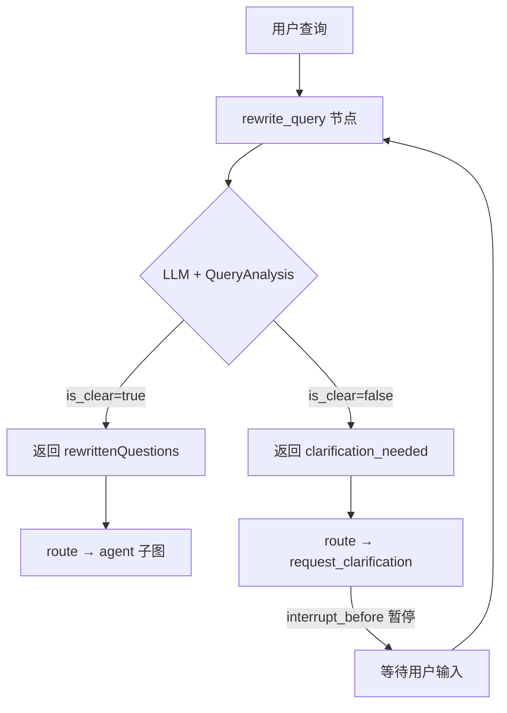
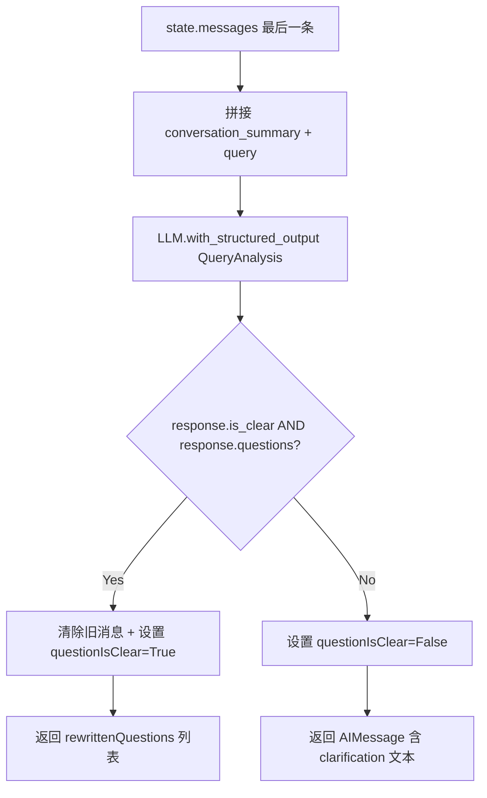
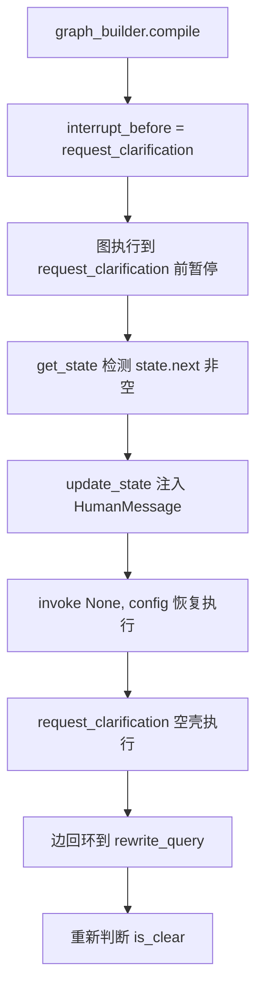

# PD-09.06 AgenticRAGForDummies — interrupt_before 查询澄清与图恢复

> 文档编号：PD-09.06
> 来源：AgenticRAGForDummies `project/rag_agent/graph.py`, `project/rag_agent/nodes.py`
> GitHub：https://github.com/GiovanniPasq/agentic-rag-for-dummies.git
> 问题域：PD-09 Human-in-the-Loop
> 状态：可复用方案

---

## 第 1 章 问题与动机（≥ 30 行）

### 1.1 核心问题

RAG 系统面对模糊查询时，如果直接检索会导致低质量结果——检索到不相关文档、浪费 token、最终给出不准确的回答。核心矛盾是：**LLM 无法自主判断何时该停下来问用户，而不是硬着头皮继续执行**。

传统 RAG 管道是单向的：用户输入 → 检索 → 生成。没有"暂停并询问"的能力。当查询含糊（如"那个文件里说了什么？"缺少上下文）时，系统要么猜测用户意图（幻觉风险），要么返回泛泛的"我不确定"（体验差）。

Human-in-the-Loop 的本质需求是：**在图执行的关键决策点插入人工干预，让用户补充信息后图能从暂停点恢复执行，而不是重新开始**。

### 1.2 AgenticRAGForDummies 的解法概述

该项目用 LangGraph 的 `interrupt_before` 机制实现了一个轻量但完整的查询澄清闭环：

1. **结构化查询分析**：`rewrite_query` 节点用 `QueryAnalysis` Pydantic 模型做结构化输出，LLM 判断 `is_clear` 布尔值（`schemas.py:4-12`）
2. **条件路由分流**：`route_after_rewrite` 边根据 `questionIsClear` 状态字段路由到 `request_clarification` 或并行 `agent` 子图（`edges.py:6-13`）
3. **interrupt_before 暂停**：图编译时声明 `interrupt_before=["request_clarification"]`，执行到该节点前自动暂停（`graph.py:48`）
4. **状态注入恢复**：用户回复后通过 `update_state` 注入新消息，`invoke(None, config)` 从暂停点恢复（`Agentic_Rag_For_Dummies.ipynb` cell-14）
5. **InMemorySaver 持久化**：checkpointer 保存暂停时的完整图状态，支持跨请求恢复（`graph.py:14`）

### 1.3 设计思想

| 设计原则 | 具体实现 | 理由 | 替代方案 |
|----------|----------|------|----------|
| 先判断再执行 | `rewrite_query` 在检索前判断查询清晰度 | 避免对模糊查询浪费检索资源 | 检索后发现结果差再回头问（延迟高） |
| 结构化输出判断 | `QueryAnalysis` Pydantic 模型含 `is_clear` 布尔字段 | 比自由文本更可靠，便于程序化路由 | 正则匹配 LLM 输出文本（脆弱） |
| 空壳节点 + interrupt | `request_clarification` 函数体为空，仅作暂停锚点 | 暂停逻辑与业务逻辑完全解耦 | 在 rewrite_query 内部阻塞等待（耦合） |
| 边回环恢复 | `request_clarification → rewrite_query` 边让用户回复后重新分析 | 用户补充信息后需要重新判断清晰度 | 直接跳到 agent 执行（跳过验证） |
| checkpointer 状态持久化 | `InMemorySaver` 保存暂停时全部状态 | 支持异步场景（HTTP 请求间恢复） | 手动序列化状态到数据库（复杂） |

---

## 第 2 章 源码实现分析（≥ 60 行，核心章节）

### 2.1 架构概览

AgenticRAGForDummies 采用双层图架构：外层主图负责查询分析和澄清，内层子图负责检索执行。Human-in-the-Loop 完全在外层主图中实现。

```
┌─────────────────────────────────────────────────────────────────┐
│                        Main Graph (State)                       │
│                                                                 │
│  START → summarize_history → rewrite_query ──┬──→ agent ×N ──→ aggregate_answers → END
│                                   ↑          │     (子图)
│                                   │          │
│                                   │    ┌─────┴──────────────┐
│                                   │    │ questionIsClear?   │
│                                   │    │  false → ★INTERRUPT│
│                                   │    └────────────────────┘
│                                   │          │
│                          request_clarification
│                          (空壳节点，interrupt_before)
│                                                                 │
│  ★ 图在此暂停，等待用户输入                                      │
│  ★ 用户回复后 update_state → invoke(None) 恢复                   │
└─────────────────────────────────────────────────────────────────┘
```

### 2.2 核心实现

#### 2.2.1 QueryAnalysis 结构化输出模型



对应源码 `project/rag_agent/schemas.py:1-12`：

```python
from typing import List
from pydantic import BaseModel, Field

class QueryAnalysis(BaseModel):
    is_clear: bool = Field(
        description="Indicates if the user's question is clear and answerable."
    )
    questions: List[str] = Field(
        description="List of rewritten, self-contained questions."
    )
    clarification_needed: str = Field(
        description="Explanation if the question is unclear."
    )
```

`QueryAnalysis` 是整个 HITL 机制的判断核心。LLM 通过 `with_structured_output(QueryAnalysis)` 被强制输出这三个字段，`is_clear` 布尔值直接驱动路由决策。`clarification_needed` 字段承载具体的澄清问题文本，会作为 `AIMessage` 返回给用户。

#### 2.2.2 rewrite_query 节点：澄清判断与路由准备



对应源码 `project/rag_agent/nodes.py:30-44`：

```python
def rewrite_query(state: State, llm):
    last_message = state["messages"][-1]
    conversation_summary = state.get("conversation_summary", "")

    context_section = (
        f"Conversation Context:\n{conversation_summary}\n"
        if conversation_summary.strip() else ""
    ) + f"User Query:\n{last_message.content}\n"

    llm_with_structure = llm.with_config(temperature=0.1).with_structured_output(QueryAnalysis)
    response = llm_with_structure.invoke([
        SystemMessage(content=get_rewrite_query_prompt()),
        HumanMessage(content=context_section)
    ])

    if response.questions and response.is_clear:
        delete_all = [RemoveMessage(id=m.id) for m in state["messages"]
                      if not isinstance(m, SystemMessage)]
        return {
            "questionIsClear": True,
            "messages": delete_all,
            "originalQuery": last_message.content,
            "rewrittenQuestions": response.questions
        }

    clarification = (response.clarification_needed
                     if response.clarification_needed
                     and len(response.clarification_needed.strip()) > 10
                     else "I need more information to understand your question.")
    return {"questionIsClear": False, "messages": [AIMessage(content=clarification)]}
```

关键细节：
- **temperature=0.1**：低温度确保判断稳定性，减少 `is_clear` 的随机翻转（`nodes.py:36`）
- **clarification 最低长度检查**：`len(...) > 10` 防止 LLM 返回空或过短的澄清文本（`nodes.py:43`）
- **消息清理**：查询清晰时用 `RemoveMessage` 清除所有非系统消息，为并行子图提供干净的起点（`nodes.py:40`）

#### 2.2.3 interrupt_before 编译与图恢复



对应源码 `project/rag_agent/graph.py:34-48`：

```python
graph_builder = StateGraph(State)
graph_builder.add_node("summarize_history", partial(summarize_history, llm=llm))
graph_builder.add_node("rewrite_query", partial(rewrite_query, llm=llm))
graph_builder.add_node(request_clarification)
graph_builder.add_node("agent", agent_subgraph)
graph_builder.add_node("aggregate_answers", partial(aggregate_answers, llm=llm))

graph_builder.add_edge(START, "summarize_history")
graph_builder.add_edge("summarize_history", "rewrite_query")
graph_builder.add_conditional_edges("rewrite_query", route_after_rewrite)
graph_builder.add_edge("request_clarification", "rewrite_query")
graph_builder.add_edge(["agent"], "aggregate_answers")
graph_builder.add_edge("aggregate_answers", END)

agent_graph = graph_builder.compile(
    checkpointer=checkpointer,
    interrupt_before=["request_clarification"]
)
```

恢复逻辑在 Notebook cell-14 (`Agentic_Rag_For_Dummies.ipynb`)：

```python
def chat_with_agent(message, history):
    current_state = agent_graph.get_state(config)
    if current_state.next:
        # 图处于暂停状态，注入用户回复并恢复
        agent_graph.update_state(
            config,
            {"messages": [HumanMessage(content=message.strip())]}
        )
        result = agent_graph.invoke(None, config)
    else:
        # 正常新查询
        result = agent_graph.invoke(
            {"messages": [HumanMessage(content=message.strip())]},
            config
        )
    return result['messages'][-1].content
```

### 2.3 实现细节

**空壳节点设计**：`request_clarification` 的函数体是 `return {}`（`nodes.py:46-47`）。它不做任何事，纯粹作为 `interrupt_before` 的锚点。真正的澄清文本已经在 `rewrite_query` 中作为 `AIMessage` 写入了 state，用户在 Gradio 界面看到的就是这条消息。

**边回环拓扑**：`request_clarification → rewrite_query` 这条边（`graph.py:44`）形成了一个闭环。用户回复后，图从 `request_clarification` 继续执行，经过这条边回到 `rewrite_query`，LLM 重新分析（此时 messages 中包含了用户的补充信息），如果仍不清晰则再次暂停，清晰则路由到 agent。

**并行子图分发**：当查询清晰时，`route_after_rewrite` 返回 `Send` 列表（`edges.py:10-13`），每个重写后的子问题独立启动一个 agent 子图实例。这意味着一次澄清可能触发多个并行检索任务。

**状态字段设计**：`State.questionIsClear` 是布尔字段（`graph_state.py:15`），不是枚举。这意味着系统只区分"清晰/不清晰"两种状态，没有"部分清晰"的中间态。


---

## 第 3 章 迁移指南（≥ 40 行）

### 3.1 迁移清单

**阶段 1：定义结构化判断模型**
- [ ] 创建 Pydantic 模型，包含 `is_clear: bool` 和 `clarification_needed: str` 字段
- [ ] 根据业务需求扩展字段（如 `confidence: float`、`clarification_type: Literal[...]`）

**阶段 2：实现查询分析节点**
- [ ] 编写 `rewrite_query` 节点，使用 `with_structured_output` 调用 LLM
- [ ] 设置低 temperature（0.1-0.2）确保判断稳定
- [ ] 添加 clarification 文本最低长度校验

**阶段 3：构建暂停-恢复拓扑**
- [ ] 创建空壳 `request_clarification` 节点
- [ ] 添加 `request_clarification → rewrite_query` 回环边
- [ ] 编译时传入 `interrupt_before=["request_clarification"]`
- [ ] 配置 checkpointer（开发用 InMemorySaver，生产用 PostgresSaver/SqliteSaver）

**阶段 4：实现前端恢复逻辑**
- [ ] 用 `get_state(config).next` 检测图是否处于暂停状态
- [ ] 暂停时用 `update_state` 注入用户回复
- [ ] 用 `invoke(None, config)` 恢复执行

### 3.2 适配代码模板

以下模板可直接复用，实现最小化的 interrupt_before 查询澄清：

```python
from typing import List
from pydantic import BaseModel, Field
from langchain_core.messages import SystemMessage, HumanMessage, AIMessage
from langgraph.graph import START, END, StateGraph, MessagesState
from langgraph.checkpoint.memory import InMemorySaver

# --- Step 1: 结构化判断模型 ---
class QueryAnalysis(BaseModel):
    is_clear: bool = Field(description="查询是否清晰可回答")
    questions: List[str] = Field(default_factory=list, description="重写后的子问题列表")
    clarification_needed: str = Field(default="", description="需要用户补充的信息")

# --- Step 2: 状态定义 ---
class State(MessagesState):
    question_is_clear: bool = False
    original_query: str = ""
    rewritten_questions: List[str] = []

# --- Step 3: 节点实现 ---
def analyze_query(state: State):
    """分析查询清晰度，决定是否需要澄清"""
    last_msg = state["messages"][-1]
    llm_structured = your_llm.with_structured_output(QueryAnalysis)
    result = llm_structured.invoke([
        SystemMessage(content="判断用户查询是否清晰，不清晰时给出具体的澄清问题。"),
        HumanMessage(content=last_msg.content)
    ])
    if result.is_clear and result.questions:
        return {
            "question_is_clear": True,
            "original_query": last_msg.content,
            "rewritten_questions": result.questions
        }
    clarification = result.clarification_needed or "请提供更多信息。"
    return {
        "question_is_clear": False,
        "messages": [AIMessage(content=clarification)]
    }

def request_clarification(state: State):
    """空壳节点：仅作为 interrupt_before 锚点"""
    return {}

def execute_task(state: State):
    """查询清晰后的实际执行逻辑"""
    # 你的业务逻辑
    return {"messages": [AIMessage(content="执行结果...")]}

# --- Step 4: 路由函数 ---
def route_after_analysis(state: State):
    return "request_clarification" if not state["question_is_clear"] else "execute"

# --- Step 5: 图构建 ---
graph = StateGraph(State)
graph.add_node("analyze", analyze_query)
graph.add_node("request_clarification", request_clarification)
graph.add_node("execute", execute_task)

graph.add_edge(START, "analyze")
graph.add_conditional_edges("analyze", route_after_analysis)
graph.add_edge("request_clarification", "analyze")  # 回环！
graph.add_edge("execute", END)

app = graph.compile(
    checkpointer=InMemorySaver(),
    interrupt_before=["request_clarification"]
)

# --- Step 6: 交互循环 ---
config = {"configurable": {"thread_id": "demo-thread"}}

def chat(user_input: str) -> str:
    state = app.get_state(config)
    if state.next:  # 图处于暂停状态
        app.update_state(config, {"messages": [HumanMessage(content=user_input)]})
        result = app.invoke(None, config)
    else:
        result = app.invoke({"messages": [HumanMessage(content=user_input)]}, config)
    return result["messages"][-1].content
```

### 3.3 适用场景

| 场景 | 适用度 | 说明 |
|------|--------|------|
| RAG 查询澄清 | ⭐⭐⭐ | 本项目的核心场景，检索前判断查询清晰度 |
| 表单填写引导 | ⭐⭐⭐ | 缺少必填字段时暂停询问用户 |
| 危险操作确认 | ⭐⭐ | 可用但缺少审批粒度控制，需扩展 |
| 多轮任务规划 | ⭐⭐ | 回环支持多轮，但无迭代上限保护 |
| 高并发 Web 服务 | ⭐ | InMemorySaver 不支持多进程，需换 PostgresSaver |

---

## 第 4 章 测试用例（≥ 20 行）

```python
import pytest
from unittest.mock import MagicMock, patch
from pydantic import BaseModel, Field
from typing import List
from langchain_core.messages import HumanMessage, AIMessage, SystemMessage


class QueryAnalysis(BaseModel):
    is_clear: bool = Field(description="查询是否清晰")
    questions: List[str] = Field(default_factory=list)
    clarification_needed: str = Field(default="")


class TestRewriteQueryClarification:
    """测试 rewrite_query 节点的澄清判断逻辑"""

    def test_clear_query_returns_rewritten_questions(self):
        """清晰查询应返回 questionIsClear=True 和重写后的问题列表"""
        mock_llm = MagicMock()
        mock_structured = MagicMock()
        mock_llm.with_config.return_value.with_structured_output.return_value = mock_structured
        mock_structured.invoke.return_value = QueryAnalysis(
            is_clear=True,
            questions=["What is the capital of France?"],
            clarification_needed=""
        )
        state = {
            "messages": [HumanMessage(content="What is the capital of France?")],
            "conversation_summary": ""
        }
        # 模拟 rewrite_query 核心逻辑
        response = mock_structured.invoke([])
        assert response.is_clear is True
        assert len(response.questions) == 1

    def test_unclear_query_triggers_clarification(self):
        """模糊查询应返回 questionIsClear=False 和澄清文本"""
        mock_structured = MagicMock()
        mock_structured.invoke.return_value = QueryAnalysis(
            is_clear=False,
            questions=[],
            clarification_needed="Which document are you referring to? Please specify the file name."
        )
        response = mock_structured.invoke([])
        assert response.is_clear is False
        assert len(response.clarification_needed) > 10

    def test_short_clarification_uses_fallback(self):
        """过短的澄清文本应使用默认回退消息"""
        clarification = "unclear"
        fallback = "I need more information to understand your question."
        result = clarification if len(clarification.strip()) > 10 else fallback
        assert result == fallback

    def test_empty_questions_with_is_clear_true(self):
        """is_clear=True 但 questions 为空时不应路由到 agent"""
        response = QueryAnalysis(is_clear=True, questions=[], clarification_needed="")
        should_proceed = response.questions and response.is_clear
        assert should_proceed is False  # 空列表为 falsy


class TestRouteAfterRewrite:
    """测试 route_after_rewrite 路由逻辑"""

    def test_unclear_routes_to_clarification(self):
        """questionIsClear=False 应路由到 request_clarification"""
        state = {"questionIsClear": False}
        result = "request_clarification" if not state.get("questionIsClear", False) else "agent"
        assert result == "request_clarification"

    def test_clear_routes_to_agent(self):
        """questionIsClear=True 应路由到 agent"""
        state = {"questionIsClear": True, "rewrittenQuestions": ["q1", "q2"]}
        result = "request_clarification" if not state.get("questionIsClear", False) else "agent"
        assert result == "agent"


class TestInterruptResumeFlow:
    """测试 interrupt-resume 交互流程"""

    def test_get_state_detects_interrupt(self):
        """暂停状态下 state.next 应非空"""
        mock_state = MagicMock()
        mock_state.next = ("request_clarification",)
        assert mock_state.next  # truthy 表示图已暂停

    def test_get_state_normal_flow(self):
        """正常状态下 state.next 应为空"""
        mock_state = MagicMock()
        mock_state.next = ()
        assert not mock_state.next  # falsy 表示图未暂停
```


---

## 第 5 章 跨域关联

| 关联域 | 关系类型 | 说明 |
|--------|----------|------|
| PD-01 上下文管理 | 协同 | `rewrite_query` 依赖 `summarize_history` 提供的对话摘要来判断跟进查询的上下文；澄清回复也会增加消息历史长度，影响上下文窗口 |
| PD-02 多 Agent 编排 | 依赖 | 澄清通过后 `route_after_rewrite` 用 `Send` 并行分发多个子图，HITL 是编排的前置门控 |
| PD-03 容错与重试 | 协同 | 澄清回环本身是一种"重试"机制——查询不清晰时回到 `rewrite_query` 重新分析，但缺少最大重试次数限制 |
| PD-04 工具系统 | 互斥 | 本项目的 HITL 不涉及工具调用审批，工具（search_child_chunks、retrieve_parent_chunks）在子图内自由执行无需人工确认 |
| PD-12 推理增强 | 协同 | `QueryAnalysis` 的结构化输出本身是一种推理增强——LLM 被迫输出判断理由（`clarification_needed`），而非直接行动 |

---

## 第 6 章 来源文件索引

| 文件 | 行范围 | 关键实现 |
|------|--------|----------|
| `project/rag_agent/schemas.py` | L1-L12 | QueryAnalysis Pydantic 模型定义 |
| `project/rag_agent/nodes.py` | L30-L47 | rewrite_query 澄清判断 + request_clarification 空壳节点 |
| `project/rag_agent/edges.py` | L6-L13 | route_after_rewrite 条件路由（clarification vs agent） |
| `project/rag_agent/graph.py` | L34-L48 | 主图构建 + interrupt_before 编译 + 回环边 |
| `project/rag_agent/graph_state.py` | L13-L19 | State 定义含 questionIsClear 布尔字段 |
| `project/rag_agent/prompts.py` | L21-L56 | get_rewrite_query_prompt 查询分析提示词 |
| `project/core/chat_interface.py` | L8-L21 | ChatInterface.chat 简化版交互（无 interrupt 恢复） |
| `project/ui/gradio_app.py` | L36-L37 | Gradio chat_handler 入口 |
| `Agentic_Rag_For_Dummies.ipynb` cell-14 | 全部 | chat_with_agent 含完整 interrupt 检测与恢复逻辑 |
| `project/config.py` | L21-L22 | MAX_TOOL_CALLS / MAX_ITERATIONS 限制常量 |

---

## 第 7 章 横向对比维度

> **重要：** 本章用于自动填充 Butcher Wiki 的横向对比表。
> 必须严格按以下 JSON 格式输出，放在 `comparison_data` 代码块中。

```json comparison_data
{
  "project": "AgenticRAGForDummies",
  "dimensions": {
    "暂停机制": "LangGraph interrupt_before 在 request_clarification 节点前暂停",
    "澄清类型": "QueryAnalysis Pydantic 结构化输出，is_clear 布尔判断",
    "状态持久化": "InMemorySaver checkpointer，支持跨请求恢复",
    "实现层级": "图拓扑级：空壳节点 + 条件边 + 回环边",
    "多轮交互支持": "回环边支持无限轮澄清，但无迭代上限保护",
    "自动确认降级": "无降级机制，查询不清晰时必须等待用户回复",
    "反馈分类路由": "无分类，用户回复统一注入 messages 重新分析",
    "悬挂工具调用修复": "不涉及，interrupt 发生在工具调用之前的查询分析阶段",
    "澄清与执行的图拓扑选择": "interrupt_before 暂停模式，非 END 返回",
    "空壳节点设计": "request_clarification 函数体为空，纯锚点"
  }
}
```

### 域元数据补充

```json domain_metadata
{
  "solution_summary": "AgenticRAGForDummies 用 LangGraph interrupt_before + QueryAnalysis 结构化输出实现检索前查询澄清，空壳节点作暂停锚点，回环边驱动多轮澄清闭环",
  "description": "检索前置的查询清晰度门控，避免对模糊查询浪费检索资源",
  "sub_problems": [
    "澄清回环无上限保护：用户反复提供模糊回复时缺少最大轮次熔断",
    "Gradio 前端与 interrupt 的集成模式：chat_handler 需区分新查询与暂停恢复两种调用路径"
  ],
  "best_practices": [
    "空壳节点作 interrupt 锚点：函数体为空，暂停逻辑与业务逻辑零耦合",
    "结构化输出低温度调用：temperature=0.1 确保 is_clear 判断稳定性，减少随机翻转"
  ]
}
```

