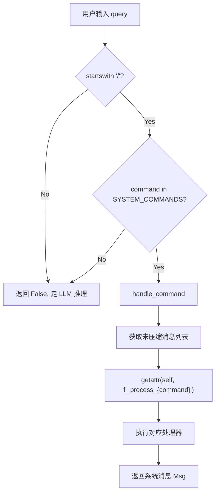
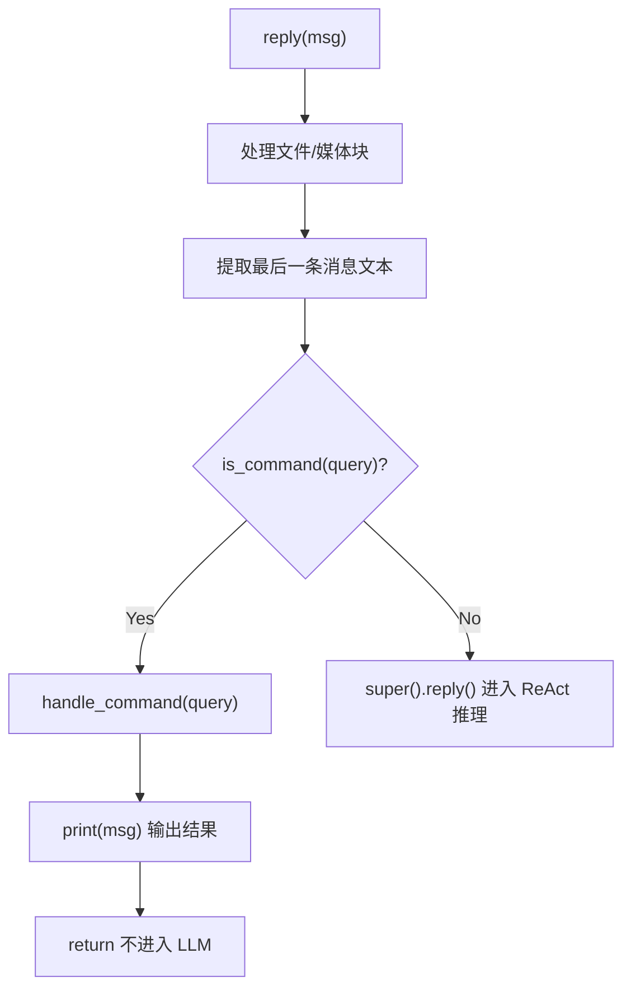
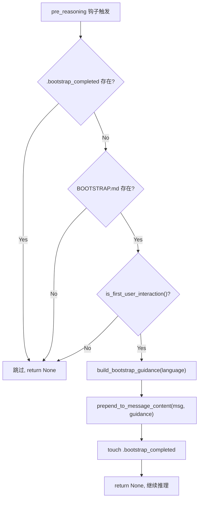

# PD-09.07 CoPaw — 三层命令式 HITL 与引导式首次交互

> 文档编号：PD-09.07
> 来源：CoPaw `src/copaw/agents/command_handler.py`, `src/copaw/agents/hooks/bootstrap.py`, `src/copaw/app/crons/manager.py`
> GitHub：https://github.com/agentscope-ai/CoPaw.git
> 问题域：PD-09 Human-in-the-Loop
> 状态：可复用方案

---

## 第 1 章 问题与动机

### 1.1 核心问题

Agent 系统在长期运行中面临三个层次的人机交互需求：

1. **即时控制**：用户需要在对话中直接控制 Agent 行为（清空记忆、压缩上下文、查看历史），而不是等 Agent 自行决策。这些操作不应经过 LLM 推理，必须确定性执行。
2. **首次引导**：新用户首次使用时需要完成身份配置（PROFILE.md、MEMORY.md），但不能强制——用户可以跳过直接提问。引导流程必须是一次性的，不能每次对话都触发。
3. **定时任务控制**：Cron 定时任务（如心跳检测、定期汇报）需要人工 pause/resume 能力，且暂停期间不丢失任务定义。

CoPaw 的核心设计思想是：**命令式 HITL 优于请求式 HITL**。用户通过 `/command` 直接控制 Agent，而不是向 Agent "请求"执行某操作。这消除了 LLM 理解歧义，保证操作的确定性。

### 1.2 CoPaw 的解法概述

1. **CommandHandler 命令拦截层**（`command_handler.py:89-363`）：在 `reply()` 入口处拦截 `/compact`、`/new`、`/clear`、`/history`、`/compact_str`、`/await_summary` 六个系统命令，绕过 LLM 推理直接执行。命令通过 `frozenset` 白名单注册，`getattr` 动态分发。
2. **BootstrapHook 引导钩子**（`hooks/bootstrap.py:20-103`）：作为 `pre_reasoning` 钩子注册，在首次用户交互时检测 `BOOTSTRAP.md` 文件存在性，将引导指令注入到用户消息前部。通过 `.bootstrap_completed` 文件标记完成，保证一次性触发。
3. **CronManager pause/resume**（`crons/manager.py:111-117`）：基于 APScheduler 的 `pause_job`/`resume_job` 原语，通过 FastAPI REST API 和 Click CLI 双通道暴露给用户，支持运行时暂停/恢复定时任务。

### 1.3 设计思想

| 设计原则 | 具体实现 | 理由 | 替代方案 |
|----------|----------|------|----------|
| 命令式 > 请求式 | `/compact` 直接执行，不经 LLM | 消除 LLM 理解歧义，确定性执行 | 让 LLM 判断用户意图后调用工具 |
| 白名单注册 | `SYSTEM_COMMANDS = frozenset(...)` | 防止命令注入，明确边界 | 正则匹配或前缀树 |
| 文件标记 > 数据库标记 | `.bootstrap_completed` 文件 | 零依赖，重启后状态保留 | Redis/SQLite 标记 |
| 钩子注入 > 硬编码 | `register_instance_hook("pre_reasoning", ...)` | 引导逻辑与推理逻辑解耦 | 在 reply() 中 if-else |
| 双通道暴露 | REST API + CLI 同时支持 pause/resume | 前端和运维都能控制 | 仅 API 或仅 CLI |
| 用户可跳过 | Bootstrap 明确声明"如果用户想跳过" | 尊重用户意愿，不强制流程 | 强制完成引导才能使用 |

---

## 第 2 章 源码实现分析

### 2.1 架构概览

CoPaw 的 HITL 架构分三层，每层有独立的触发机制和执行路径：

```
┌─────────────────────────────────────────────────────────┐
│                    用户输入                               │
│                      │                                   │
│              ┌───────▼────────┐                          │
│              │  reply() 入口   │  react_agent.py:267      │
│              └───────┬────────┘                          │
│                      │                                   │
│         ┌────────────▼────────────┐                      │
│         │  is_command(query)?     │  command_handler.py:120│
│         └────┬───────────┬───────┘                      │
│              │Yes        │No                             │
│     ┌────────▼──────┐   │                               │
│     │ CommandHandler │   │                               │
│     │ 直接执行命令   │   │                               │
│     │ (无 LLM 推理)  │   │                               │
│     └───────────────┘   │                               │
│                    ┌────▼─────────────┐                  │
│                    │ pre_reasoning    │                  │
│                    │ hooks 管道       │                  │
│                    ├─────────────────┤                  │
│                    │ 1. BootstrapHook │ 首次引导         │
│                    │ 2. CompactHook   │ 自动压缩         │
│                    └────┬────────────┘                  │
│                         │                               │
│                    ┌────▼────────┐                      │
│                    │ LLM 推理    │                      │
│                    │ ReActAgent  │                      │
│                    └─────────────┘                      │
│                                                         │
│  ═══════════════════════════════════════════════════════ │
│                                                         │
│  ┌──────────────────────────────────────────────┐       │
│  │          CronManager (独立层)                 │       │
│  │  APScheduler ──→ pause_job / resume_job      │       │
│  │       ↑              ↑                       │       │
│  │   REST API        CLI cmd                    │       │
│  └──────────────────────────────────────────────┘       │
└─────────────────────────────────────────────────────────┘
```

### 2.2 核心实现

#### 2.2.1 CommandHandler：命令拦截与动态分发



对应源码 `src/copaw/agents/command_handler.py:89-131`：

```python
class CommandHandler:
    """Handler for agent system commands."""

    SYSTEM_COMMANDS = frozenset(
        {"compact", "new", "clear", "history", "compact_str", "await_summary"},
    )

    def __init__(self, agent_name, memory, formatter,
                 memory_manager=None, enable_memory_manager=True):
        self.agent_name = agent_name
        self.memory = memory
        self.formatter = formatter
        self.memory_manager = memory_manager
        self._enable_memory_manager = enable_memory_manager

    def is_command(self, query: str | None) -> bool:
        if not isinstance(query, str) or not query.startswith("/"):
            return False
        return query.strip().lstrip("/") in self.SYSTEM_COMMANDS

    async def handle_command(self, query: str) -> Msg:
        messages = await self.memory.get_memory(
            exclude_mark=_MemoryMark.COMPRESSED, prepend_summary=False,
        )
        command = query.strip().lstrip("/")
        handler = getattr(self, f"_process_{command}", None)
        if handler is None:
            raise RuntimeError(f"Unknown command: {query}")
        return await handler(messages)
```

关键设计点：
- `frozenset` 白名单保证命令集不可变（`command_handler.py:93-95`）
- `getattr` 动态分发避免 if-elif 链（`command_handler.py:360`）
- 命令处理器统一签名 `async def _process_xxx(self, messages) -> Msg`

#### 2.2.2 reply() 入口的命令拦截



对应源码 `src/copaw/agents/react_agent.py:267-298`：

```python
async def reply(self, msg=None, structured_model=None) -> Msg:
    if msg is not None:
        await process_file_and_media_blocks_in_message(msg)

    last_msg = msg[-1] if isinstance(msg, list) else msg
    query = last_msg.get_text_content() if isinstance(last_msg, Msg) else None

    if self.command_handler.is_command(query):
        logger.info(f"Received command: {query}")
        msg = await self.command_handler.handle_command(query)
        await self.print(msg)
        return msg

    return await super().reply(msg=msg, structured_model=structured_model)
```

#### 2.2.3 BootstrapHook：一次性引导注入



对应源码 `src/copaw/agents/hooks/bootstrap.py:42-103`：

```python
async def __call__(self, agent, kwargs):
    try:
        bootstrap_path = self.working_dir / "BOOTSTRAP.md"
        bootstrap_completed_flag = self.working_dir / ".bootstrap_completed"

        if bootstrap_completed_flag.exists():
            return None
        if not bootstrap_path.exists():
            return None

        messages = await agent.memory.get_memory()
        if not is_first_user_interaction(messages):
            return None

        bootstrap_guidance = build_bootstrap_guidance(self.language)
        # 跳过 system prompt，找到第一条 user 消息注入引导
        system_prompt_count = sum(1 for msg in messages if msg.role == "system")
        for msg in messages[system_prompt_count:]:
            if msg.role == "user":
                prepend_to_message_content(msg, bootstrap_guidance)
                break

        bootstrap_completed_flag.touch()
    except Exception as e:
        logger.error("Failed to process bootstrap: %s", e, exc_info=True)
    return None
```

`is_first_user_interaction` 的判定逻辑（`utils/message_processing.py:271-291`）：

```python
def is_first_user_interaction(messages: list) -> bool:
    system_prompt_count = sum(1 for msg in messages if msg.role == "system")
    non_system_messages = messages[system_prompt_count:]
    user_msg_count = sum(1 for msg in non_system_messages if msg.role == "user")
    assistant_msg_count = sum(1 for msg in non_system_messages if msg.role == "assistant")
    return user_msg_count == 1 and assistant_msg_count == 0
```

### 2.3 实现细节

#### CronManager 的 pause/resume 双通道

CronManager 通过 APScheduler 的原生 `pause_job`/`resume_job` 实现暂停恢复（`crons/manager.py:111-117`），并通过两个通道暴露：

**REST API 通道**（`crons/api.py:71-89`）：
```python
@router.post("/jobs/{job_id}/pause")
async def pause_job(job_id, mgr=Depends(get_cron_manager)):
    await mgr.pause_job(job_id)
    return {"paused": True}

@router.post("/jobs/{job_id}/resume")
async def resume_job(job_id, mgr=Depends(get_cron_manager)):
    await mgr.resume_job(job_id)
    return {"resumed": True}
```

**CLI 通道**（`cli/cron_cmd.py:341-385`）：
```python
@cron_group.command("pause")
def pause_job(ctx, job_id, base_url):
    """Pause a cron job. Use 'resume' to re-enable."""
    base_url = _base_url(ctx, base_url)
    with client(base_url) as c:
        r = c.post(f"/cron/jobs/{job_id}/pause")
        r.raise_for_status()
        print_json(r.json())
```

#### CronJobSpec 的 enabled 字段与初始暂停

注册任务时，如果 `spec.enabled == False`，CronManager 会立即暂停该任务（`crons/manager.py:192-193`）：

```python
if not spec.enabled:
    self._scheduler.pause_job(spec.id)
```

这意味着用户可以创建"默认暂停"的任务，后续手动 resume 启用。

#### 并发控制与错误推送

每个 Cron 任务有独立的 `asyncio.Semaphore` 控制并发（`crons/manager.py:172-174`），执行失败时通过 `console_push_store` 将错误推送到前端（`crons/manager.py:161-167`）：

```python
error_text = f"❌ Cron job [{job.name}] failed: {exc}"
asyncio.ensure_future(push_store_append(session_id, error_text))
```

---

## 第 3 章 迁移指南

### 3.1 迁移清单

**阶段 1：命令拦截层（1 个文件）**

- [ ] 创建 `CommandHandler` 类，定义 `SYSTEM_COMMANDS` 白名单
- [ ] 实现 `is_command()` 前缀检测 + 白名单校验
- [ ] 实现 `handle_command()` 的 `getattr` 动态分发
- [ ] 在 Agent 的 `reply()` 入口处添加命令拦截逻辑
- [ ] 为每个命令实现 `_process_xxx()` 处理器

**阶段 2：引导钩子（2 个文件）**

- [ ] 创建 `BootstrapHook` 类，实现 `__call__` 异步钩子接口
- [ ] 实现 `is_first_user_interaction()` 判定函数
- [ ] 实现 `prepend_to_message_content()` 消息注入函数
- [ ] 准备 `BOOTSTRAP.md` 引导模板
- [ ] 在 Agent 初始化时注册 `pre_reasoning` 钩子

**阶段 3：Cron 控制（3 个文件）**

- [ ] 创建 `CronManager` 封装 APScheduler
- [ ] 实现 `pause_job()`/`resume_job()` 方法
- [ ] 创建 FastAPI 路由暴露 REST API
- [ ] 创建 CLI 命令暴露终端控制

### 3.2 适配代码模板

#### 模板 1：通用命令拦截器

```python
from typing import Callable, Awaitable
from dataclasses import dataclass, field

@dataclass
class CommandRegistry:
    """通用命令注册与分发器，可移植到任何 Agent 框架。"""
    
    _handlers: dict[str, Callable[..., Awaitable]] = field(default_factory=dict)
    prefix: str = "/"
    
    def register(self, name: str, handler: Callable[..., Awaitable]) -> None:
        self._handlers[name] = handler
    
    def is_command(self, text: str | None) -> bool:
        if not text or not text.startswith(self.prefix):
            return False
        cmd = text.strip().lstrip(self.prefix).split()[0]
        return cmd in self._handlers
    
    async def dispatch(self, text: str, **context) -> str:
        cmd = text.strip().lstrip(self.prefix).split()[0]
        handler = self._handlers.get(cmd)
        if not handler:
            raise ValueError(f"Unknown command: {cmd}")
        return await handler(**context)


# 使用示例
registry = CommandRegistry()

async def handle_clear(memory=None, **_):
    memory.clear()
    return "History cleared."

registry.register("clear", handle_clear)

# 在 Agent reply() 中拦截
async def reply(self, user_input: str):
    if registry.is_command(user_input):
        return await registry.dispatch(user_input, memory=self.memory)
    return await self.llm_reasoning(user_input)
```

#### 模板 2：一次性引导钩子

```python
from pathlib import Path

class OneTimeBootstrapHook:
    """一次性引导钩子，首次交互后不再触发。"""
    
    def __init__(self, working_dir: Path, guide_file: str = "BOOTSTRAP.md"):
        self.working_dir = working_dir
        self.guide_file = guide_file
        self._flag_file = working_dir / ".bootstrap_completed"
    
    def should_trigger(self, messages: list) -> bool:
        if self._flag_file.exists():
            return False
        guide_path = self.working_dir / self.guide_file
        if not guide_path.exists():
            return False
        # 判断是否首次交互：仅 1 条 user 消息，0 条 assistant 消息
        user_count = sum(1 for m in messages if m.role == "user")
        assistant_count = sum(1 for m in messages if m.role == "assistant")
        return user_count == 1 and assistant_count == 0
    
    def inject_guidance(self, messages: list, guidance: str) -> None:
        for msg in messages:
            if msg.role == "user":
                msg.content = guidance + "\n\n" + msg.content
                break
        self._flag_file.touch()  # 标记完成
```

#### 模板 3：Cron 暂停/恢复封装

```python
import asyncio
from apscheduler.schedulers.asyncio import AsyncIOScheduler

class CronController:
    """Cron 任务暂停/恢复控制器。"""
    
    def __init__(self, timezone: str = "UTC"):
        self._scheduler = AsyncIOScheduler(timezone=timezone)
        self._lock = asyncio.Lock()
    
    async def pause(self, job_id: str) -> None:
        async with self._lock:
            self._scheduler.pause_job(job_id)
    
    async def resume(self, job_id: str) -> None:
        async with self._lock:
            self._scheduler.resume_job(job_id)
    
    async def run_once(self, job_id: str) -> None:
        """手动触发一次执行（fire-and-forget）。"""
        job = self._scheduler.get_job(job_id)
        if not job:
            raise KeyError(f"Job not found: {job_id}")
        asyncio.create_task(job.func(*job.args, **job.kwargs))
```

### 3.3 适用场景

| 场景 | 适用度 | 说明 |
|------|--------|------|
| 个人 AI 助手（长期对话） | ⭐⭐⭐ | 命令式控制 + 首次引导完美匹配 |
| 企业内部 Agent | ⭐⭐⭐ | Cron 控制 + 双通道暴露适合运维 |
| 多用户 SaaS Agent | ⭐⭐ | 需要扩展为 per-user 引导状态 |
| 一次性任务 Agent | ⭐ | 无长期对话，命令和引导价值低 |
| 需要审批流的 Agent | ⭐ | CoPaw 无审批机制，需额外实现 |

---

## 第 4 章 测试用例

```python
import pytest
from unittest.mock import AsyncMock, MagicMock, patch
from pathlib import Path


class TestCommandHandler:
    """测试 CommandHandler 命令拦截与分发。"""

    def setup_method(self):
        self.memory = AsyncMock()
        self.memory.get_memory = AsyncMock(return_value=[])
        self.memory.get_compressed_summary = MagicMock(return_value="")
        self.memory.update_compressed_summary = AsyncMock()
        self.memory.update_messages_mark = AsyncMock(return_value=0)
        self.formatter = AsyncMock()
        self.handler = CommandHandler(
            agent_name="test",
            memory=self.memory,
            formatter=self.formatter,
            memory_manager=None,
            enable_memory_manager=False,
        )

    def test_is_command_valid(self):
        assert self.handler.is_command("/compact") is True
        assert self.handler.is_command("/new") is True
        assert self.handler.is_command("/clear") is True
        assert self.handler.is_command("/history") is True

    def test_is_command_invalid(self):
        assert self.handler.is_command("hello") is False
        assert self.handler.is_command("/unknown") is False
        assert self.handler.is_command(None) is False
        assert self.handler.is_command("") is False

    @pytest.mark.asyncio
    async def test_clear_command(self):
        self.memory.content = MagicMock()
        msg = await self.handler.handle_command("/clear")
        self.memory.content.clear.assert_called_once()
        assert msg.role == "assistant"

    @pytest.mark.asyncio
    async def test_compact_without_memory_manager(self):
        msg = await self.handler.handle_command("/compact")
        assert "Disabled" in msg.content[0]["text"]

    @pytest.mark.asyncio
    async def test_unknown_command_raises(self):
        # 绕过 is_command 检查直接调用
        with pytest.raises(RuntimeError, match="Unknown command"):
            await self.handler.handle_command("/nonexistent")


class TestBootstrapHook:
    """测试 BootstrapHook 一次性引导。"""

    @pytest.mark.asyncio
    async def test_skip_when_flag_exists(self, tmp_path):
        (tmp_path / ".bootstrap_completed").touch()
        (tmp_path / "BOOTSTRAP.md").write_text("guide")
        hook = BootstrapHook(working_dir=tmp_path)
        result = await hook(agent=MagicMock(), kwargs={})
        assert result is None

    @pytest.mark.asyncio
    async def test_skip_when_no_bootstrap_md(self, tmp_path):
        hook = BootstrapHook(working_dir=tmp_path)
        result = await hook(agent=MagicMock(), kwargs={})
        assert result is None

    @pytest.mark.asyncio
    async def test_trigger_on_first_interaction(self, tmp_path):
        (tmp_path / "BOOTSTRAP.md").write_text("guide content")
        hook = BootstrapHook(working_dir=tmp_path, language="en")

        user_msg = MagicMock()
        user_msg.role = "user"
        user_msg.content = "Hello"
        agent = MagicMock()
        agent.memory.get_memory = AsyncMock(return_value=[user_msg])

        await hook(agent=agent, kwargs={})
        # 验证 flag 文件已创建
        assert (tmp_path / ".bootstrap_completed").exists()
        # 验证引导内容已注入
        assert "BOOTSTRAP" in user_msg.content

    @pytest.mark.asyncio
    async def test_no_trigger_on_second_interaction(self, tmp_path):
        (tmp_path / "BOOTSTRAP.md").write_text("guide")
        hook = BootstrapHook(working_dir=tmp_path)

        user_msg = MagicMock(role="user")
        assistant_msg = MagicMock(role="assistant")
        agent = MagicMock()
        agent.memory.get_memory = AsyncMock(
            return_value=[user_msg, assistant_msg, MagicMock(role="user")]
        )
        result = await hook(agent=agent, kwargs={})
        assert result is None
        assert not (tmp_path / ".bootstrap_completed").exists()


class TestCronPauseResume:
    """测试 CronManager 暂停/恢复。"""

    def setup_method(self):
        self.scheduler = MagicMock()
        self.manager = CronManager.__new__(CronManager)
        self.manager._scheduler = self.scheduler
        self.manager._lock = asyncio.Lock()
        self.manager._started = True

    @pytest.mark.asyncio
    async def test_pause_job(self):
        await self.manager.pause_job("job-1")
        self.scheduler.pause_job.assert_called_once_with("job-1")

    @pytest.mark.asyncio
    async def test_resume_job(self):
        await self.manager.resume_job("job-1")
        self.scheduler.resume_job.assert_called_once_with("job-1")
```

---

## 第 5 章 跨域关联

| 关联域 | 关系类型 | 说明 |
|--------|----------|------|
| PD-01 上下文管理 | 强依赖 | `/compact` 和 `/new` 命令直接触发上下文压缩，MemoryCompactionHook 是自动版本。CommandHandler 依赖 `memory.get_memory(exclude_mark=COMPRESSED)` 获取未压缩消息 |
| PD-04 工具系统 | 协同 | CommandHandler 的命令与 Agent 工具系统并行存在：命令绕过 LLM 直接执行，工具通过 LLM 调用。两者共享 memory 实例但执行路径完全隔离 |
| PD-10 中间件管道 | 依赖 | BootstrapHook 和 MemoryCompactionHook 都注册为 `pre_reasoning` 钩子，依赖 AgentScope 的 `register_instance_hook` 钩子管道机制。钩子执行顺序由注册顺序决定 |
| PD-06 记忆持久化 | 协同 | `/compact` 命令调用 `memory_manager.compact_memory()` 生成压缩摘要，`/await_summary` 等待后台摘要任务完成。BootstrapHook 通过 `.bootstrap_completed` 文件实现跨会话状态持久化 |
| PD-11 可观测性 | 协同 | `/history` 命令提供 token 计数、上下文使用率等可观测信息。Cron 任务失败时通过 `console_push_store` 推送错误到前端 |

---

## 第 6 章 来源文件索引

| 文件 | 行范围 | 关键实现 |
|------|--------|----------|
| `src/copaw/agents/command_handler.py` | L89-L131 | CommandHandler 类定义、SYSTEM_COMMANDS 白名单、is_command() 检测、handle_command() 动态分发 |
| `src/copaw/agents/command_handler.py` | L159-L227 | _process_compact()、_process_new()、_process_clear() 命令处理器 |
| `src/copaw/agents/command_handler.py` | L242-L363 | _process_history() token 统计、_process_await_summary() 等待摘要 |
| `src/copaw/agents/hooks/bootstrap.py` | L20-L103 | BootstrapHook 类、三重条件检测、引导注入、完成标记 |
| `src/copaw/agents/hooks/__init__.py` | L1-L36 | 钩子包导出、注册示例 |
| `src/copaw/agents/hooks/memory_compaction.py` | L65-L205 | MemoryCompactionHook 自动压缩钩子 |
| `src/copaw/agents/react_agent.py` | L267-L298 | reply() 入口命令拦截逻辑 |
| `src/copaw/agents/react_agent.py` | L217-L244 | _register_hooks() 钩子注册 |
| `src/copaw/agents/prompt.py` | L164-L210 | build_bootstrap_guidance() 双语引导消息构建 |
| `src/copaw/agents/utils/message_processing.py` | L271-L313 | is_first_user_interaction() 判定、prepend_to_message_content() 注入 |
| `src/copaw/app/crons/manager.py` | L32-L274 | CronManager 类、pause_job/resume_job、_execute_once 并发控制 |
| `src/copaw/app/crons/api.py` | L71-L100 | REST API pause/resume/run 端点 |
| `src/copaw/app/crons/models.py` | L82-L132 | CronJobSpec、CronJobState Pydantic 模型 |
| `src/copaw/cli/cron_cmd.py` | L341-L385 | CLI pause/resume 命令 |

---

## 第 7 章 横向对比维度

```json comparison_data
{
  "project": "CoPaw",
  "dimensions": {
    "暂停机制": "APScheduler pause_job/resume_job + asyncio.Lock 保护",
    "澄清类型": "无澄清机制，用户通过 /command 直接控制",
    "状态持久化": "文件标记（.bootstrap_completed）+ 内存状态（CronJobState）",
    "实现层级": "三层：reply() 命令拦截 → pre_reasoning 钩子 → Cron REST/CLI",
    "身份绑定": "BootstrapHook 引导用户创建 PROFILE.md 建立身份",
    "自动跳过机制": "Bootstrap 明确支持用户跳过引导直接提问",
    "操作边界声明": "SYSTEM_COMMANDS frozenset 白名单限定可用命令集",
    "多轮交互支持": "Bootstrap 引导为单轮注入，命令为单次执行无多轮",
    "自动确认降级": "命令式设计无需确认，直接执行",
    "命令分发模式": "getattr 动态分发，统一 _process_{cmd} 签名",
    "双通道控制": "Cron 同时暴露 REST API 和 Click CLI 两个控制通道",
    "首次交互检测": "计数 user/assistant 消息数判定首次交互"
  }
}
```

### 域元数据补充

```json domain_metadata
{
  "solution_summary": "CoPaw 用 CommandHandler 白名单拦截 + BootstrapHook 一次性引导注入 + CronManager 双通道 pause/resume 实现三层命令式 HITL",
  "description": "命令式 HITL 通过确定性命令绕过 LLM 推理，适合需要精确控制的场景",
  "sub_problems": [
    "命令式 vs 请求式 HITL：用户直接发命令绕过 LLM 与通过 LLM 理解意图的取舍",
    "首次交互检测：如何准确判定用户是否为首次使用并触发引导流程",
    "引导可跳过性：强制引导 vs 允许跳过的用户体验权衡",
    "双通道控制一致性：REST API 和 CLI 对同一资源操作时的状态同步"
  ],
  "best_practices": [
    "frozenset 白名单注册命令：不可变集合防止运行时篡改命令列表",
    "文件标记实现跨会话一次性触发：零依赖、重启安全、易于调试",
    "getattr 动态分发优于 if-elif 链：新增命令只需添加 _process_xxx 方法",
    "命令拦截在 LLM 推理之前：避免 token 浪费和理解歧义"
  ]
}
```
