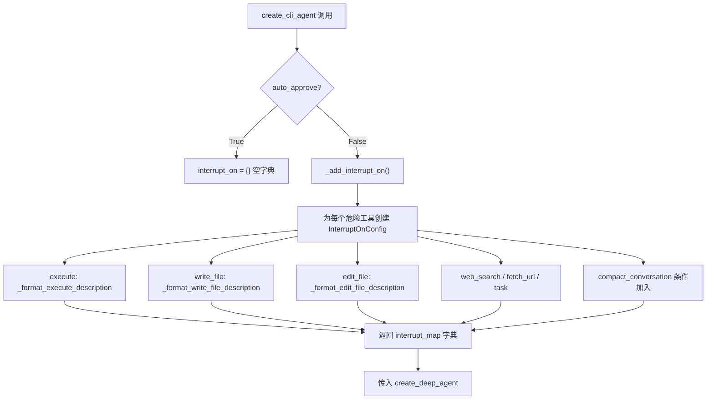
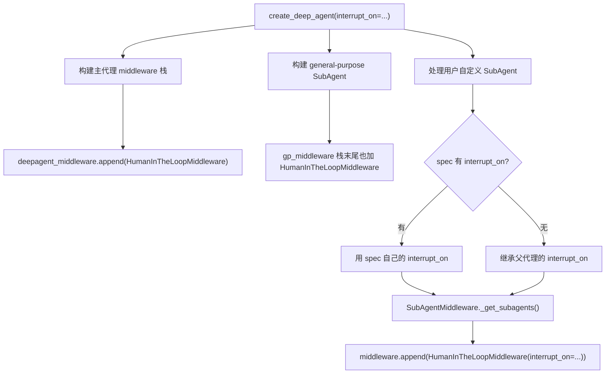
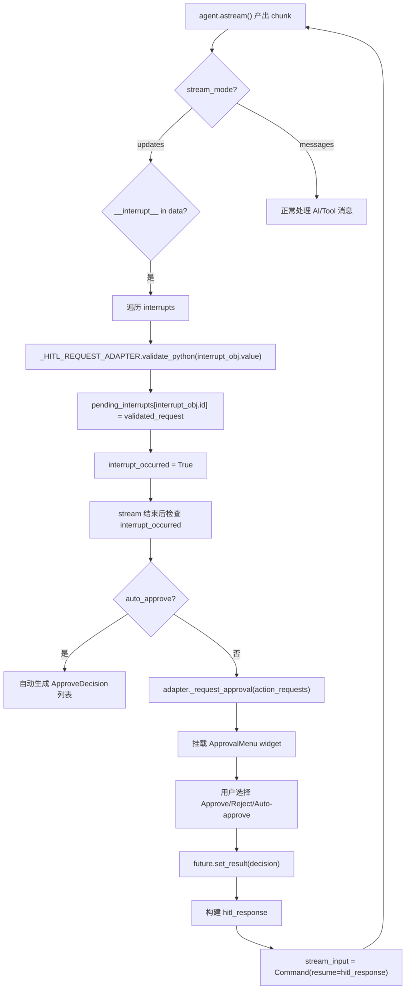

# PD-09.19 DeepAgents — HumanInTheLoopMiddleware 工具级审批与 Command 回传

> 文档编号：PD-09.19
> 来源：DeepAgents `libs/deepagents/deepagents/graph.py`, `libs/cli/deepagents_cli/agent.py`, `libs/cli/deepagents_cli/textual_adapter.py`
> GitHub：https://github.com/langchain-ai/deepagents.git
> 问题域：PD-09 Human-in-the-Loop
> 状态：可复用方案

---

## 第 1 章 问题与动机

### 1.1 核心问题

Agent 系统中工具调用具有不可逆的副作用——执行 shell 命令、写入文件、发起网络请求——一旦执行就无法撤回。用户需要在 Agent 执行危险操作前获得审批机会，同时不能让审批流程阻塞整个系统或破坏 Agent 的状态一致性。

核心挑战包括：
- **粒度控制**：不同工具的风险等级不同，需要按工具名精确配置哪些需要审批
- **状态持久化**：审批等待期间 Agent 的执行状态必须可序列化，支持进程重启后恢复
- **批量审批**：Agent 可能并行调用多个工具，用户需要一次性审批整批操作
- **多模式适配**：同一审批逻辑需要在交互式 CLI（Textual TUI）和非交互式（headless）模式下工作
- **子代理继承**：SubAgent 应继承父代理的审批配置，避免权限泄漏

### 1.2 DeepAgents 的解法概述

DeepAgents 采用三层架构实现 HITL：

1. **中间件层**：`HumanInTheLoopMiddleware`（来自 langchain SDK）通过 `interrupt_on` 字典按工具名配置中断策略，每个工具可自定义 `description` 格式化函数（`libs/cli/deepagents_cli/agent.py:324-385`）
2. **图执行层**：LangGraph 的 `interrupt()` 原语暂停图执行，通过 checkpointer 持久化状态，在 stream 中发射 `Interrupt` 对象（`libs/cli/deepagents_cli/textual_adapter.py:368-383`）
3. **UI 层**：CLI 的 `ApprovalMenu`（Textual widget）提供 Approve/Reject/Auto-approve 三种决策，审批结果通过 `Command(resume=hitl_response)` 回传恢复图执行（`libs/cli/deepagents_cli/textual_adapter.py:779`）

### 1.3 设计思想

| 设计原则 | 具体实现 | 理由 | 替代方案 |
|----------|----------|------|----------|
| 中间件拦截 | `HumanInTheLoopMiddleware` 作为 middleware 栈末尾元素 | 与业务逻辑解耦，不侵入工具实现 | 在每个工具内部硬编码审批逻辑 |
| 声明式配置 | `interrupt_on` 字典按工具名映射 `InterruptOnConfig` | 一处配置控制所有工具的审批策略 | 每个工具单独设置 interrupt 标志 |
| LangGraph interrupt | 使用 `interrupt()` 而非 `threading.Event` | 不阻塞线程，支持 checkpointer 持久化 | 用 asyncio.Event 阻塞等待 |
| Command 回传 | `Command(resume=hitl_response)` 恢复图执行 | 与 LangGraph 状态机原生集成 | 通过消息队列传递审批结果 |
| 批量审批 | 一个 `ApprovalMenu` 处理多个并行工具调用 | 减少用户交互次数 | 每个工具调用弹出独立审批对话框 |
| 自动审批降级 | `auto_approve` 标志 + shell allow-list | 非交互模式下无需人工介入 | 始终要求人工审批 |

---

## 第 2 章 源码实现分析

### 2.1 架构概览

```
┌─────────────────────────────────────────────────────────────┐
│                    create_deep_agent()                       │
│  graph.py:85                                                │
│                                                             │
│  Middleware Stack (按顺序):                                  │
│  ┌─────────────────────┐                                    │
│  │ TodoListMiddleware   │                                    │
│  │ MemoryMiddleware     │                                    │
│  │ SkillsMiddleware     │                                    │
│  │ FilesystemMiddleware │                                    │
│  │ SubAgentMiddleware   │ ← 子代理也注入 HITL middleware     │
│  │ SummarizationMW      │                                    │
│  │ PromptCachingMW      │                                    │
│  │ PatchToolCallsMW     │                                    │
│  │ [user middleware]     │                                    │
│  │ HumanInTheLoopMW  ◄─┤── 末尾：拦截所有工具调用            │
│  └─────────────────────┘                                    │
│           │                                                  │
│           ▼                                                  │
│  interrupt_on = {                                            │
│    "execute": {desc_fn},                                     │
│    "write_file": {desc_fn},                                  │
│    "edit_file": {desc_fn},                                   │
│    "web_search": {desc_fn},                                  │
│    "fetch_url": {desc_fn},                                   │
│    "task": {desc_fn},                                        │
│    "compact_conversation": {desc}                            │
│  }                                                           │
└─────────────────────────────────────────────────────────────┘
         │ interrupt()
         ▼
┌─────────────────────┐    ┌──────────────────────┐
│  LangGraph Stream   │───→│  TextualUIAdapter    │
│  __interrupt__ event│    │  textual_adapter.py  │
└─────────────────────┘    └──────────┬───────────┘
                                      │
                           ┌──────────▼───────────┐
                           │   ApprovalMenu       │
                           │   approval.py        │
                           │                      │
                           │  [1] Approve (y)     │
                           │  [2] Reject (n)      │
                           │  [3] Auto-approve (a)│
                           └──────────┬───────────┘
                                      │ decision
                                      ▼
                           Command(resume=hitl_response)
                                      │
                                      ▼
                           Graph resumes execution
```

### 2.2 核心实现

#### 2.2.1 interrupt_on 配置构建



对应源码 `libs/cli/deepagents_cli/agent.py:324-385`：

```python
def _add_interrupt_on() -> dict[str, InterruptOnConfig]:
    """Configure human-in-the-loop interrupt settings for all gated tools."""
    execute_interrupt_config: InterruptOnConfig = {
        "allowed_decisions": ["approve", "reject"],
        "description": _format_execute_description,
    }
    write_file_interrupt_config: InterruptOnConfig = {
        "allowed_decisions": ["approve", "reject"],
        "description": _format_write_file_description,
    }
    # ... 每个工具一个 config
    interrupt_map: dict[str, InterruptOnConfig] = {
        "execute": execute_interrupt_config,
        "write_file": write_file_interrupt_config,
        "edit_file": edit_file_interrupt_config,
        "web_search": web_search_interrupt_config,
        "fetch_url": fetch_url_interrupt_config,
        "task": task_interrupt_config,
    }
    if REQUIRE_COMPACT_TOOL_APPROVAL:
        interrupt_map["compact_conversation"] = {
            "allowed_decisions": ["approve", "reject"],
            "description": "Summarizes older messages...",
        }
    return interrupt_map
```

每个 `InterruptOnConfig` 的 `description` 字段可以是字符串或 `Callable[[ToolCall, AgentState, Runtime], str]`，用于在审批 UI 中展示工具调用的上下文信息。例如 `_format_write_file_description`（`agent.py:208-223`）会显示文件路径、操作类型（Create/Overwrite）和行数。

#### 2.2.2 中间件注入与子代理继承



对应源码 `libs/deepagents/deepagents/graph.py:215-216`（主代理注入）：

```python
if interrupt_on is not None:
    gp_middleware.append(HumanInTheLoopMiddleware(interrupt_on=interrupt_on))
```

以及 `libs/deepagents/deepagents/graph.py:300-301`（主代理栈末尾）：

```python
if interrupt_on is not None:
    deepagent_middleware.append(HumanInTheLoopMiddleware(interrupt_on=interrupt_on))
```

子代理继承逻辑在 `libs/deepagents/deepagents/middleware/subagents.py:353-355`：

```python
interrupt_on = agent_.get("interrupt_on", default_interrupt_on)
if interrupt_on:
    _middleware.append(HumanInTheLoopMiddleware(interrupt_on=interrupt_on))
```

#### 2.2.3 Stream 中断捕获与审批流程



对应源码 `libs/cli/deepagents_cli/textual_adapter.py:368-383`（中断捕获）：

```python
if "__interrupt__" in data:
    interrupts: list[Interrupt] = data["__interrupt__"]
    if interrupts:
        for interrupt_obj in interrupts:
            try:
                validated_request = (
                    _HITL_REQUEST_ADAPTER.validate_python(
                        interrupt_obj.value
                    )
                )
                pending_interrupts[interrupt_obj.id] = validated_request
                interrupt_occurred = True
            except ValidationError:
                raise
```

审批结果回传（`textual_adapter.py:770-779`）：

```python
if interrupt_occurred and hitl_response:
    if suppress_resumed_output:
        await adapter._mount_message(
            AppMessage("Command rejected. Tell the agent what you'd like instead.")
        )
        return
    stream_input = Command(resume=hitl_response)
```

### 2.3 实现细节

#### ApprovalMenu 三选项设计

`ApprovalMenu`（`libs/cli/deepagents_cli/widgets/approval.py:31-344`）是一个 Textual `Container` widget，提供三种决策：

- **Approve (y/1)**：批准当前工具调用，工具开始执行
- **Reject (n/2)**：拒绝工具调用，Agent 收到拒绝消息后可调整策略
- **Auto-approve for this thread (a/3)**：设置 `session_state.auto_approve = True`，本次会话后续所有工具调用自动批准

关键设计：
- `can_focus_children = False` 防止焦点被子 widget 抢走
- `on_blur` 事件中 `call_after_refresh(self.focus)` 强制保持焦点，确保用户必须做出决策
- 通过 `asyncio.Future` 与 `TextualUIAdapter` 通信，`set_future()` 设置 future，`_handle_selection()` 中 `future.set_result(decision)` 解析

#### 非交互模式的 allow-list 门控

`libs/cli/deepagents_cli/non_interactive.py:309-367` 实现了 headless 模式下的自动审批逻辑：

- Shell 工具：检查命令是否在 `shell_allow_list` 中，匹配则 approve，否则 reject 并附带错误消息
- 非 Shell 工具：无条件 approve
- 安全上限：`_MAX_HITL_ITERATIONS = 50`，防止 Agent 反复重试被拒绝的命令导致死循环

#### 工具描述格式化器

每个受审批工具都有专用的 description 格式化函数（`agent.py:208-308`），在审批 UI 中展示上下文：

- `_format_write_file_description`：显示文件路径、Create/Overwrite、行数
- `_format_edit_file_description`：显示文件路径、替换范围（single/all occurrences）
- `_format_execute_description`：显示命令和工作目录
- `_format_task_description`：显示子代理类型和任务指令预览（截断到 500 字符）

#### 批量审批

当 Agent 并行调用多个工具时，所有工具调用被收集到一个 `action_requests` 列表中，由单个 `ApprovalMenu` 一次性处理。用户的 Approve/Reject 决策应用到整批操作（`textual_adapter.py:651-766`）。


---

## 第 3 章 迁移指南

### 3.1 迁移清单

**阶段 1：基础 HITL 中间件**
- [ ] 安装 `langchain` SDK（含 `HumanInTheLoopMiddleware`）和 `langgraph`
- [ ] 定义 `interrupt_on` 字典，为每个需要审批的工具配置 `InterruptOnConfig`
- [ ] 将 `HumanInTheLoopMiddleware` 添加到 middleware 栈末尾
- [ ] 配置 checkpointer（如 `InMemorySaver` 或 `PostgresSaver`）以支持 interrupt 状态持久化

**阶段 2：审批 UI 适配**
- [ ] 实现审批回调函数，接收 `HITLRequest`，返回 `HITLResponse`
- [ ] 在 stream 消费循环中捕获 `__interrupt__` 事件
- [ ] 用 `Command(resume=hitl_response)` 恢复图执行

**阶段 3：高级特性**
- [ ] 实现 auto-approve 会话级开关
- [ ] 为非交互模式实现 allow-list 门控
- [ ] 配置子代理的 interrupt_on 继承策略
- [ ] 添加 HITL 迭代次数上限防止死循环

### 3.2 适配代码模板

```python
"""可直接复用的 HITL 审批模板，基于 DeepAgents 架构。"""

from typing import Any, Callable
from langchain.agents import create_agent
from langchain.agents.middleware import HumanInTheLoopMiddleware, InterruptOnConfig
from langchain_core.messages import ToolMessage
from langgraph.checkpoint.memory import InMemorySaver
from langgraph.types import Command, Interrupt
from pydantic import TypeAdapter

# ---- Step 1: 定义 interrupt_on 配置 ----

def format_shell_description(tool_call, state, runtime) -> str:
    """自定义审批描述格式化器。"""
    command = tool_call["args"].get("command", "")
    return f"Execute: {command}\nWorking dir: {state.get('cwd', '.')}"

interrupt_on: dict[str, bool | InterruptOnConfig] = {
    "execute": {
        "allowed_decisions": ["approve", "reject"],
        "description": format_shell_description,
    },
    "write_file": {
        "allowed_decisions": ["approve", "reject"],
        "description": "Write file operation",
    },
    # 简单布尔值也可以：True 表示使用默认配置
    "dangerous_tool": True,
}

# ---- Step 2: 创建带 HITL 的 Agent ----

checkpointer = InMemorySaver()
agent = create_agent(
    "anthropic:claude-sonnet-4-5-20250929",
    tools=[...],
    middleware=[
        # ... 其他中间件 ...
        HumanInTheLoopMiddleware(interrupt_on=interrupt_on),
    ],
    checkpointer=checkpointer,
)

# ---- Step 3: Stream 消费 + 审批循环 ----

async def run_with_approval(agent, user_message: str, thread_id: str):
    """带审批循环的 Agent 执行函数。"""
    config = {"configurable": {"thread_id": thread_id}}
    stream_input = {"messages": [{"role": "user", "content": user_message}]}
    max_iterations = 50  # 安全上限

    for iteration in range(max_iterations):
        pending_interrupts = {}
        interrupt_occurred = False

        async for chunk in agent.astream(
            stream_input,
            stream_mode=["messages", "updates"],
            config=config,
        ):
            if not isinstance(chunk, tuple) or len(chunk) != 3:
                continue
            namespace, mode, data = chunk
            if mode == "updates" and isinstance(data, dict):
                if "__interrupt__" in data:
                    for interrupt_obj in data["__interrupt__"]:
                        pending_interrupts[interrupt_obj.id] = interrupt_obj.value
                        interrupt_occurred = True
            elif mode == "messages":
                # 正常处理消息...
                pass

        if not interrupt_occurred:
            break  # 正常完成

        # 构建审批响应
        hitl_response = {}
        for interrupt_id, request in pending_interrupts.items():
            action_requests = request.get("action_requests", [])
            # 这里接入你的审批 UI
            decisions = [await get_user_decision(req) for req in action_requests]
            hitl_response[interrupt_id] = {"decisions": decisions}

        stream_input = Command(resume=hitl_response)

async def get_user_decision(action_request: dict) -> dict:
    """替换为你的审批 UI 实现。"""
    tool_name = action_request.get("name", "")
    # 示例：自动批准读操作，其他需要人工确认
    if tool_name in ("read_file", "glob", "grep"):
        return {"type": "approve"}
    user_input = input(f"Approve {tool_name}? (y/n): ")
    return {"type": "approve" if user_input == "y" else "reject"}
```

### 3.3 适用场景

| 场景 | 适用度 | 说明 |
|------|--------|------|
| CLI 工具 Agent | ⭐⭐⭐ | 完美匹配：Textual TUI + 工具级审批 |
| Web 应用 Agent | ⭐⭐⭐ | 将 ApprovalMenu 替换为 WebSocket 推送的前端组件 |
| CI/CD 自动化 | ⭐⭐ | 使用 allow-list 门控 + auto-approve，无需人工介入 |
| 多租户 SaaS | ⭐⭐ | 需要扩展 interrupt_on 支持租户级策略 |
| 纯 API 服务 | ⭐ | 审批流程需要异步回调，LangGraph interrupt 需要持久化 checkpointer |

---

## 第 4 章 测试用例

```python
"""基于 DeepAgents HITL 架构的测试用例。"""

import asyncio
import pytest
from unittest.mock import AsyncMock, MagicMock, patch
from typing import Any


class TestInterruptOnConfig:
    """测试 interrupt_on 配置构建。"""

    def test_add_interrupt_on_returns_all_gated_tools(self):
        """_add_interrupt_on 应返回所有需要审批的工具。"""
        # 模拟 agent.py 中的 _add_interrupt_on 逻辑
        interrupt_map = {
            "execute": {"allowed_decisions": ["approve", "reject"]},
            "write_file": {"allowed_decisions": ["approve", "reject"]},
            "edit_file": {"allowed_decisions": ["approve", "reject"]},
            "web_search": {"allowed_decisions": ["approve", "reject"]},
            "fetch_url": {"allowed_decisions": ["approve", "reject"]},
            "task": {"allowed_decisions": ["approve", "reject"]},
        }
        assert len(interrupt_map) == 6
        for config in interrupt_map.values():
            assert "approve" in config["allowed_decisions"]
            assert "reject" in config["allowed_decisions"]

    def test_auto_approve_disables_all_interrupts(self):
        """auto_approve=True 时 interrupt_on 应为空字典。"""
        auto_approve = True
        interrupt_on = {} if auto_approve else {"execute": True}
        assert interrupt_on == {}

    def test_description_formatter_write_file(self):
        """write_file 描述格式化器应显示文件路径和操作类型。"""
        from pathlib import Path
        tool_call = {"args": {"file_path": "/tmp/test.py", "content": "print('hello')\n"}}
        file_path = tool_call["args"]["file_path"]
        content = tool_call["args"]["content"]
        action = "Create" if not Path(file_path).exists() else "Overwrite"
        line_count = len(content.splitlines())
        desc = f"File: {file_path}\nAction: {action} file\nLines: {line_count}"
        assert "test.py" in desc
        assert "Lines: 1" in desc


class TestApprovalDecisions:
    """测试审批决策处理。"""

    def test_approve_decision_structure(self):
        """approve 决策应包含 type 字段。"""
        decision = {"type": "approve"}
        assert decision["type"] == "approve"

    def test_reject_decision_structure(self):
        """reject 决策应包含 type 字段。"""
        decision = {"type": "reject"}
        assert decision["type"] == "reject"

    def test_auto_approve_all_sets_session_flag(self):
        """auto_approve_all 决策应设置会话级标志。"""
        class SessionState:
            auto_approve: bool = False
        state = SessionState()
        decision = {"type": "auto_approve_all"}
        if decision["type"] == "auto_approve_all":
            state.auto_approve = True
        assert state.auto_approve is True

    def test_batch_approval_applies_to_all_requests(self):
        """批量审批应对所有 action_requests 生效。"""
        action_requests = [
            {"name": "write_file", "args": {"file_path": "/a.py"}},
            {"name": "write_file", "args": {"file_path": "/b.py"}},
        ]
        decision_type = "approve"
        decisions = [{"type": decision_type} for _ in action_requests]
        assert len(decisions) == 2
        assert all(d["type"] == "approve" for d in decisions)


class TestNonInteractiveHITL:
    """测试非交互模式的 HITL 门控。"""

    def test_shell_command_in_allow_list_approved(self):
        """allow-list 中的命令应自动批准。"""
        allow_list = ["git", "npm", "python"]
        command = "git status"
        base_cmd = command.split()[0]
        approved = base_cmd in allow_list
        assert approved is True

    def test_shell_command_not_in_allow_list_rejected(self):
        """不在 allow-list 中的命令应被拒绝。"""
        allow_list = ["git", "npm"]
        command = "rm -rf /"
        base_cmd = command.split()[0]
        approved = base_cmd in allow_list
        assert approved is False

    def test_max_hitl_iterations_prevents_infinite_loop(self):
        """超过最大迭代次数应抛出异常。"""
        MAX_HITL_ITERATIONS = 50
        iterations = 51
        assert iterations > MAX_HITL_ITERATIONS

    def test_non_shell_tools_auto_approved_in_headless(self):
        """非交互模式下非 shell 工具应自动批准。"""
        SHELL_TOOL_NAMES = {"execute", "bash", "shell"}
        action_name = "write_file"
        is_shell = action_name in SHELL_TOOL_NAMES
        assert is_shell is False  # 非 shell 工具，自动批准


class TestSubAgentInterruptInheritance:
    """测试子代理的 interrupt_on 继承。"""

    def test_subagent_inherits_parent_interrupt_on(self):
        """子代理未指定 interrupt_on 时应继承父代理配置。"""
        default_interrupt_on = {"execute": True, "write_file": True}
        subagent_spec = {"name": "researcher", "description": "Research agent"}
        interrupt_on = subagent_spec.get("interrupt_on", default_interrupt_on)
        assert interrupt_on == default_interrupt_on

    def test_subagent_overrides_parent_interrupt_on(self):
        """子代理指定 interrupt_on 时应覆盖父代理配置。"""
        default_interrupt_on = {"execute": True, "write_file": True}
        subagent_spec = {
            "name": "researcher",
            "interrupt_on": {"web_search": True},
        }
        interrupt_on = subagent_spec.get("interrupt_on", default_interrupt_on)
        assert interrupt_on == {"web_search": True}
```


---

## 第 5 章 跨域关联

| 关联域 | 关系类型 | 说明 |
|--------|----------|------|
| PD-01 上下文管理 | 协同 | `SummarizationMiddleware` 的 `compact_conversation` 工具也受 HITL 审批门控（`REQUIRE_COMPACT_TOOL_APPROVAL = True`），上下文压缩操作需要用户确认 |
| PD-02 多 Agent 编排 | 依赖 | `SubAgentMiddleware` 的 `task` 工具受 HITL 审批，子代理继承父代理的 `interrupt_on` 配置；子代理内部的工具调用也独立触发审批 |
| PD-04 工具系统 | 依赖 | HITL 的粒度控制完全依赖工具系统的工具名注册机制，`interrupt_on` 字典的 key 就是工具名 |
| PD-05 沙箱隔离 | 协同 | 沙箱模式下 `execute` 工具在远程环境执行，但审批仍在本地 CLI 进行；`_format_execute_description` 显示工作目录帮助用户判断执行环境 |
| PD-10 中间件管道 | 依赖 | `HumanInTheLoopMiddleware` 必须在 middleware 栈末尾，确保在所有其他中间件处理完毕后才拦截工具调用 |
| PD-11 可观测性 | 协同 | LangSmith tracing 通过 `thread_id` 追踪 HITL 中断和恢复事件，非交互模式的 header 中包含可点击的 LangSmith thread URL |

---

## 第 6 章 来源文件索引

| 文件 | 行范围 | 关键实现 |
|------|--------|----------|
| `libs/deepagents/deepagents/graph.py` | L85-324 | `create_deep_agent()` 工厂函数，组装 middleware 栈，注入 `HumanInTheLoopMiddleware` |
| `libs/deepagents/deepagents/graph.py` | L215-216 | general-purpose SubAgent 的 HITL middleware 注入 |
| `libs/deepagents/deepagents/graph.py` | L300-301 | 主代理 middleware 栈末尾注入 HITL |
| `libs/cli/deepagents_cli/agent.py` | L324-385 | `_add_interrupt_on()` 构建 7 个工具的 `InterruptOnConfig` |
| `libs/cli/deepagents_cli/agent.py` | L208-308 | 6 个工具描述格式化函数 |
| `libs/cli/deepagents_cli/agent.py` | L388-597 | `create_cli_agent()` 根据 `auto_approve` 决定是否启用 HITL |
| `libs/cli/deepagents_cli/textual_adapter.py` | L234-912 | `execute_task_textual()` stream 消费循环，中断捕获与审批回传 |
| `libs/cli/deepagents_cli/textual_adapter.py` | L368-383 | `__interrupt__` 事件捕获与 `HITLRequest` 验证 |
| `libs/cli/deepagents_cli/textual_adapter.py` | L648-779 | 审批决策处理：auto-approve / approve / reject / auto_approve_all |
| `libs/cli/deepagents_cli/widgets/approval.py` | L31-344 | `ApprovalMenu` Textual widget，三选项审批 UI |
| `libs/cli/deepagents_cli/widgets/approval.py` | L63-74 | `Decided` 消息类，携带决策字典 |
| `libs/cli/deepagents_cli/widgets/approval.py` | L325-339 | `_handle_selection()` 通过 Future 回传决策 |
| `libs/cli/deepagents_cli/non_interactive.py` | L309-367 | `_make_hitl_decision()` headless 模式 allow-list 门控 |
| `libs/cli/deepagents_cli/non_interactive.py` | L420-474 | `_run_agent_loop()` 带 50 次迭代上限的 HITL 循环 |
| `libs/cli/deepagents_cli/widgets/tool_renderers.py` | L1-80 | 工具审批 widget 渲染器注册表（write_file diff、edit_file diff） |
| `libs/deepagents/deepagents/middleware/subagents.py` | L74 | `SubAgent.interrupt_on` 字段定义 |
| `libs/deepagents/deepagents/middleware/subagents.py` | L318-319 | general-purpose SubAgent 注入 HITL middleware |
| `libs/deepagents/deepagents/middleware/subagents.py` | L353-355 | 自定义 SubAgent 的 interrupt_on 继承/覆盖逻辑 |
| `libs/cli/deepagents_cli/app.py` | L824-903 | `_request_approval()` 挂载 ApprovalMenu 到消息区域 |

---

## 第 7 章 横向对比维度

```json comparison_data
{
  "project": "DeepAgents",
  "dimensions": {
    "暂停机制": "LangGraph interrupt() + checkpointer 持久化，Command(resume=) 恢复",
    "澄清类型": "无独立澄清机制，仅工具级 Approve/Reject/Auto-approve 三选项",
    "状态持久化": "依赖 LangGraph checkpointer（InMemorySaver 或 PostgresSaver）",
    "实现层级": "三层：HumanInTheLoopMiddleware → LangGraph interrupt → CLI ApprovalMenu",
    "审查粒度控制": "interrupt_on 字典按工具名配置，每个工具独立 InterruptOnConfig",
    "自动跳过机制": "auto_approve 会话标志 + shell allow-list 白名单门控",
    "多轮交互支持": "最多 50 次 HITL 迭代循环，reject 后 Agent 可调整策略重试",
    "悬挂工具调用修复": "_build_interrupted_ai_message 重建中断时的 AIMessage + tool_calls",
    "工具优先级排序": "无显式优先级，所有受审批工具平等对待",
    "passthrough 旁路": "auto_approve=True 时 interrupt_on={} 空字典，完全跳过审批",
    "SubAgent 权限继承控制": "子代理默认继承父代理 interrupt_on，可通过 spec 覆盖",
    "身份绑定": "无显式身份绑定，审批通过 asyncio.Future 在同一进程内传递",
    "多通道转发": "交互式用 Textual ApprovalMenu，非交互式用 allow-list 自动决策",
    "升级策略": "无自动升级，reject 后由 Agent 自主决定下一步",
    "熔断器保护": "_MAX_HITL_ITERATIONS=50 防止无限重试循环"
  }
}
```

### 域元数据补充

```json domain_metadata
{
  "solution_summary": "DeepAgents 通过 HumanInTheLoopMiddleware + interrupt_on 字典实现按工具名配置的审批拦截，CLI 层 ApprovalMenu 提供三选项决策，审批结果通过 LangGraph Command(resume=) 回传恢复图执行",
  "description": "工具级审批配置与多模式（交互/非交互）适配的统一 HITL 架构",
  "sub_problems": [
    "批量并行工具调用的一次性审批：多个工具同时触发 interrupt 时的合并审批策略",
    "审批 UI 焦点锁定：防止用户在未做决策前切换焦点导致审批悬挂",
    "工具描述格式化器：为不同工具类型定制审批上下文展示（diff、命令、文件路径）",
    "HITL 迭代上限：Agent 反复重试被拒绝命令时的安全熔断"
  ],
  "best_practices": [
    "interrupt_on 字典声明式配置优于逐工具硬编码：一处定义所有审批策略",
    "HumanInTheLoopMiddleware 放在 middleware 栈末尾：确保其他中间件先完成处理",
    "子代理默认继承父代理审批配置：防止权限泄漏，同时允许 spec 级覆盖",
    "非交互模式用 allow-list + 迭代上限双重保护：防止无人值守时的安全风险和死循环"
  ]
}
```

