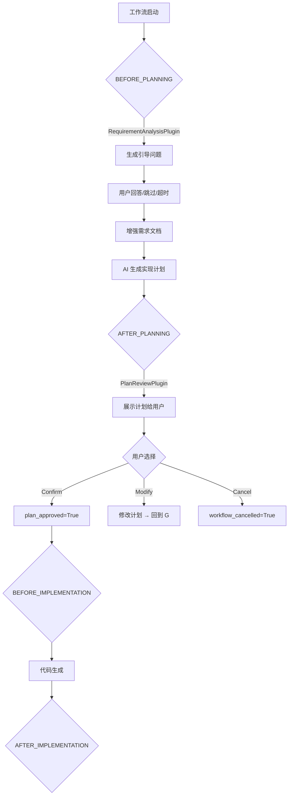
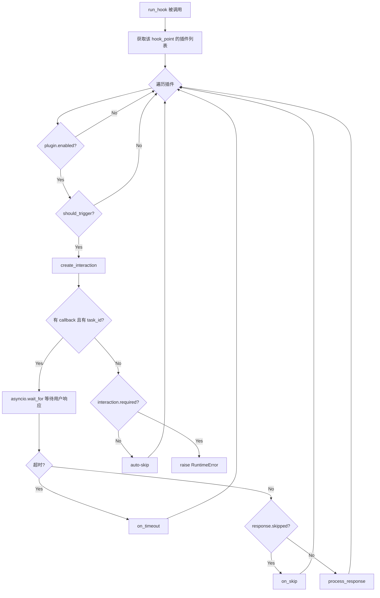
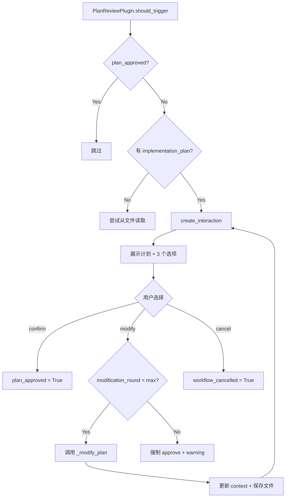

# PD-09.04 DeepCode — Plugin-based User-in-Loop 系统

> 文档编号：PD-09.04
> 来源：DeepCode `workflows/plugins/base.py`, `workflows/plugins/plan_review.py`, `workflows/plugins/requirement_analysis.py`
> GitHub：https://github.com/HKUDS/DeepCode.git
> 问题域：PD-09 Human-in-the-Loop
> 状态：可复用方案

---

## 第 1 章 问题与动机

### 1.1 核心问题

在 AI 驱动的代码生成工作流中，用户需求往往模糊不完整，AI 生成的实现计划可能偏离用户意图。如果工作流完全自动化，用户只能在最终输出时才发现问题，导致大量计算资源浪费。核心挑战是：如何在不侵入核心工作流代码的前提下，在关键决策点插入人工交互？

传统做法是在工作流代码中硬编码 `input()` 或条件分支，但这导致交互逻辑与业务逻辑耦合，难以按需启用/禁用，也无法适配不同的前端通道（WebSocket、CLI、API）。

### 1.2 DeepCode 的解法概述

DeepCode 实现了一套完整的 Plugin-based User-in-Loop 系统，核心设计：

1. **Hook Point 枚举** — 在工作流的 7 个关键位置定义 `InteractionPoint` 枚举（`workflows/plugins/base.py:34-55`），插件声明自己挂载到哪个 hook point
2. **三方法抽象基类** — `InteractionPlugin` 定义 `should_trigger()` → `create_interaction()` → `process_response()` 三步协议（`base.py:79-155`），每个插件独立决定是否触发、构造交互请求、处理用户响应
3. **优先级排序的 PluginRegistry** — 注册表按 priority 排序执行同一 hook point 的多个插件（`base.py:193-354`），支持动态 enable/disable
4. **asyncio.wait_for 超时保护** — 每个交互请求有独立超时（默认 300s），超时自动调用 `on_timeout()` 降级处理（`base.py:322-336`）
5. **WebSocket 全链路集成** — `WorkflowPluginIntegration` 通过 `asyncio.Future` 桥接后端插件与前端 WebSocket，实现异步等待用户响应（`integration.py:115-181`）

### 1.3 设计思想

| 设计原则 | 具体实现 | 理由 | 替代方案 |
|----------|----------|------|----------|
| 插件式无侵入 | `run_hook()` 一行代码插入交互点 | 核心工作流零修改，交互逻辑完全解耦 | 在工作流中硬编码 if/else 分支 |
| 三步协议 | should_trigger → create_interaction → process_response | 每步职责清晰，插件可独立测试 | 单一 execute() 方法 |
| 优先级排序 | priority 数值越小越先执行 | 需求分析(priority=10)必须在计划审批前运行 | 注册顺序决定执行顺序 |
| 超时降级 | asyncio.wait_for + on_timeout 回调 | 用户不响应时工作流不会永久挂起 | 无限等待或固定超时 |
| 上下文传递 | Dict[str, Any] context 在插件间流转 | 前一个插件的输出可作为后一个插件的输入 | 每个插件独立上下文 |

---

## 第 2 章 源码实现分析

### 2.1 架构概览

DeepCode 的 User-in-Loop 系统分为四层：

```
┌─────────────────────────────────────────────────────────────────┐
│                    Frontend (React + WebSocket)                   │
│  useStreaming.ts → setPendingInteraction() → UI 渲染交互面板      │
├─────────────────────────────────────────────────────────────────┤
│                    API Layer (FastAPI)                            │
│  POST /respond/{task_id} → submit_response() → Future.set_result │
├─────────────────────────────────────────────────────────────────┤
│                    Integration Layer                              │
│  WorkflowPluginIntegration → _handle_interaction() → broadcast   │
│  asyncio.Future 桥接后端等待与前端响应                              │
├─────────────────────────────────────────────────────────────────┤
│                    Plugin Layer                                   │
│  PluginRegistry → run_hook() → InteractionPlugin 子类             │
│  RequirementAnalysisPlugin | PlanReviewPlugin | 自定义插件         │
├─────────────────────────────────────────────────────────────────┤
│                    Workflow Layer                                 │
│  execute_chat_based_planning_pipeline()                          │
│  context = await plugins.run_hook(BEFORE_PLANNING, context)      │
└─────────────────────────────────────────────────────────────────┘
```

### 2.2 核心实现

#### 2.2.1 InteractionPoint 枚举与 InteractionPlugin 基类



对应源码 `workflows/plugins/base.py:34-55`：

```python
class InteractionPoint(Enum):
    """Defines hook points where plugins can be inserted in the workflow."""
    # Chat Planning Pipeline hooks
    BEFORE_PLANNING = "before_planning"
    AFTER_PLANNING = "after_planning"
    # Paper-to-Code Pipeline hooks
    BEFORE_RESEARCH_ANALYSIS = "before_research_analysis"
    AFTER_RESEARCH_ANALYSIS = "after_research_analysis"
    AFTER_CODE_PLANNING = "after_code_planning"
    # Common hooks
    BEFORE_IMPLEMENTATION = "before_implementation"
    AFTER_IMPLEMENTATION = "after_implementation"
```

对应源码 `workflows/plugins/base.py:79-155`，三方法抽象基类：

```python
class InteractionPlugin(ABC):
    name: str = "base_plugin"
    hook_point: InteractionPoint = InteractionPoint.BEFORE_PLANNING
    priority: int = 100  # Lower number = higher priority

    @abstractmethod
    async def should_trigger(self, context: Dict[str, Any]) -> bool: ...

    @abstractmethod
    async def create_interaction(self, context: Dict[str, Any]) -> InteractionRequest: ...

    @abstractmethod
    async def process_response(self, response: InteractionResponse, context: Dict[str, Any]) -> Dict[str, Any]: ...

    async def on_skip(self, context: Dict[str, Any]) -> Dict[str, Any]:
        return context

    async def on_timeout(self, context: Dict[str, Any]) -> Dict[str, Any]:
        return await self.on_skip(context)
```

#### 2.2.2 PluginRegistry 的 run_hook 执行引擎



对应源码 `workflows/plugins/base.py:271-354`：

```python
async def run_hook(self, hook_point: InteractionPoint,
                   context: Dict[str, Any],
                   task_id: Optional[str] = None) -> Dict[str, Any]:
    plugins = self._plugins.get(hook_point, [])
    for plugin in plugins:
        if not plugin.enabled:
            continue
        if not await plugin.should_trigger(context):
            continue
        interaction = await plugin.create_interaction(context)
        if self._interaction_callback and task_id:
            try:
                response = await asyncio.wait_for(
                    self._interaction_callback(task_id, interaction),
                    timeout=interaction.timeout_seconds,
                )
                if response.skipped:
                    context = await plugin.on_skip(context)
                else:
                    context = await plugin.process_response(response, context)
            except asyncio.TimeoutError:
                context = await plugin.on_timeout(context)
        else:
            if not interaction.required:
                context = await plugin.on_skip(context)
            else:
                raise RuntimeError(f"Plugin '{plugin.name}' requires interaction but no callback provided")
    return context
```

#### 2.2.3 PlanReviewPlugin 的多轮修改机制



对应源码 `workflows/plugins/plan_review.py:115-182`：

```python
async def process_response(self, response: InteractionResponse,
                           context: Dict[str, Any]) -> Dict[str, Any]:
    action = response.action.lower()
    if action == "confirm":
        context["plan_approved"] = True
    elif action == "modify":
        feedback = response.data.get("feedback", "")
        modification_round = context.get("plan_modification_round", 0) + 1
        if modification_round > self._max_modification_rounds:
            context["plan_approved"] = True
            context["plan_modification_warning"] = "Maximum modification rounds reached"
            return context
        modified_plan = await self._modify_plan(
            context.get("implementation_plan", ""), feedback, context
        )
        context["implementation_plan"] = modified_plan
        context["plan_modification_round"] = modification_round
    elif action == "cancel":
        context["workflow_cancelled"] = True
        context["cancel_reason"] = response.data.get("reason", "User cancelled at plan review")
    return context
```

### 2.3 实现细节

**asyncio.Future 桥接模式**（`integration.py:115-181`）：

WorkflowPluginIntegration 的 `_handle_interaction` 方法创建一个 `asyncio.Future`，通过 WebSocket 广播交互请求到前端，然后 `await` 这个 Future。当用户通过 REST API `POST /respond/{task_id}` 提交响应时，`submit_response()` 调用 `future.set_result()` 唤醒等待中的插件。

这种设计的关键优势：
- 后端插件代码是纯 async/await，不需要轮询
- 前端可以是任意通道（WebSocket、HTTP 轮询、CLI）
- 超时由 `asyncio.wait_for` 统一管理

**WorkflowTask 状态机**（`workflow_service.py:20-36`）：

```
pending → running → waiting_for_input → running → completed
                                      ↘ cancelled
                  ↘ error
```

当插件请求交互时，task.status 变为 `waiting_for_input`，task.pending_interaction 存储当前交互请求。WebSocket 连接时会检查 pending_interaction 并补发（解决竞态条件）。


---

## 第 3 章 迁移指南

### 3.1 迁移清单

**阶段 1：核心框架（必须）**
- [ ] 复制 `InteractionPoint` 枚举，根据自己的工作流定义 hook points
- [ ] 复制 `InteractionRequest` / `InteractionResponse` 数据类
- [ ] 复制 `InteractionPlugin` 抽象基类（三方法协议）
- [ ] 复制 `PluginRegistry`，保留 priority 排序和 run_hook 逻辑

**阶段 2：具体插件（按需）**
- [ ] 实现 RequirementAnalysisPlugin（需求澄清）
- [ ] 实现 PlanReviewPlugin（计划审批）
- [ ] 实现自定义插件（如危险操作确认）

**阶段 3：前后端集成（按通道选择）**
- [ ] WebSocket 通道：复制 WorkflowPluginIntegration 的 Future 桥接模式
- [ ] CLI 通道：用 `input()` 替代 WebSocket callback
- [ ] API 轮询通道：用 Redis/DB 存储 pending interaction

### 3.2 适配代码模板

**最小可运行的 Plugin 框架：**

```python
import asyncio
from abc import ABC, abstractmethod
from dataclasses import dataclass, field
from enum import Enum
from typing import Any, Callable, Dict, List, Optional, Awaitable


class InteractionPoint(Enum):
    """根据你的工作流定义 hook points"""
    BEFORE_PLANNING = "before_planning"
    AFTER_PLANNING = "after_planning"
    BEFORE_EXECUTION = "before_execution"


@dataclass
class InteractionRequest:
    interaction_type: str
    title: str
    description: str
    data: Dict[str, Any]
    options: Dict[str, str] = field(default_factory=dict)
    required: bool = False
    timeout_seconds: int = 300


@dataclass
class InteractionResponse:
    action: str
    data: Dict[str, Any] = field(default_factory=dict)
    skipped: bool = False


class InteractionPlugin(ABC):
    name: str = "base"
    hook_point: InteractionPoint = InteractionPoint.BEFORE_PLANNING
    priority: int = 100

    def __init__(self, enabled: bool = True):
        self.enabled = enabled

    @abstractmethod
    async def should_trigger(self, context: Dict[str, Any]) -> bool: ...

    @abstractmethod
    async def create_interaction(self, context: Dict[str, Any]) -> InteractionRequest: ...

    @abstractmethod
    async def process_response(self, response: InteractionResponse,
                               context: Dict[str, Any]) -> Dict[str, Any]: ...

    async def on_skip(self, context: Dict[str, Any]) -> Dict[str, Any]:
        return context

    async def on_timeout(self, context: Dict[str, Any]) -> Dict[str, Any]:
        return await self.on_skip(context)


InteractionCallback = Callable[
    [str, InteractionRequest], Awaitable[InteractionResponse]
]


class PluginRegistry:
    def __init__(self):
        self._plugins: Dict[InteractionPoint, List[InteractionPlugin]] = {
            p: [] for p in InteractionPoint
        }
        self._callback: Optional[InteractionCallback] = None

    def register(self, plugin: InteractionPlugin) -> None:
        self._plugins[plugin.hook_point].append(plugin)
        self._plugins[plugin.hook_point].sort(key=lambda p: p.priority)

    def set_callback(self, callback: InteractionCallback) -> None:
        self._callback = callback

    async def run_hook(self, hook_point: InteractionPoint,
                       context: Dict[str, Any],
                       task_id: Optional[str] = None) -> Dict[str, Any]:
        for plugin in self._plugins.get(hook_point, []):
            if not plugin.enabled or not await plugin.should_trigger(context):
                continue
            interaction = await plugin.create_interaction(context)
            if self._callback and task_id:
                try:
                    response = await asyncio.wait_for(
                        self._callback(task_id, interaction),
                        timeout=interaction.timeout_seconds,
                    )
                    if response.skipped:
                        context = await plugin.on_skip(context)
                    else:
                        context = await plugin.process_response(response, context)
                except asyncio.TimeoutError:
                    context = await plugin.on_timeout(context)
            elif not interaction.required:
                context = await plugin.on_skip(context)
            else:
                raise RuntimeError(f"Plugin '{plugin.name}' requires interaction but no callback")
        return context
```

**CLI 通道适配示例：**

```python
async def cli_interaction_callback(task_id: str,
                                   request: InteractionRequest) -> InteractionResponse:
    """CLI 环境下的交互回调 — 用 input() 替代 WebSocket"""
    print(f"\n{'='*60}")
    print(f"  {request.title}")
    print(f"  {request.description}")
    print(f"{'='*60}")

    for key, label in request.options.items():
        print(f"  [{key}] {label}")

    choice = input("\n> Your choice: ").strip().lower()
    data = {}

    if choice == "modify":
        data["feedback"] = input("> Modification feedback: ")

    return InteractionResponse(
        action=choice or "skip",
        data=data,
        skipped=(choice == "skip"),
    )

# 使用
registry = PluginRegistry()
registry.set_callback(cli_interaction_callback)
```

### 3.3 适用场景

| 场景 | 适用度 | 说明 |
|------|--------|------|
| 代码生成工作流（计划审批） | ⭐⭐⭐ | DeepCode 的核心场景，直接复用 |
| 多步骤 Agent 编排（关键决策点） | ⭐⭐⭐ | hook point 机制天然适合 DAG 编排 |
| 危险操作确认（删除/部署） | ⭐⭐⭐ | 自定义插件 + required=True |
| 实时对话式交互 | ⭐⭐ | 更适合 LangGraph interrupt，本方案偏批处理 |
| 高频低延迟交互 | ⭐ | asyncio.Future 有一定开销，不适合毫秒级交互 |

---

## 第 4 章 测试用例

```python
import asyncio
import pytest
from unittest.mock import AsyncMock, MagicMock


# 假设已导入上述迁移模板中的类
# from your_project.plugins import (
#     InteractionPlugin, InteractionPoint, InteractionRequest,
#     InteractionResponse, PluginRegistry
# )


class MockPlugin(InteractionPlugin):
    """测试用插件"""
    name = "mock_plugin"
    hook_point = InteractionPoint.BEFORE_PLANNING
    priority = 10

    def __init__(self, should_trigger_val=True, **kwargs):
        super().__init__(**kwargs)
        self._should_trigger_val = should_trigger_val
        self.triggered = False

    async def should_trigger(self, context):
        return self._should_trigger_val

    async def create_interaction(self, context):
        return InteractionRequest(
            interaction_type="test",
            title="Test Interaction",
            description="Please confirm",
            data={"key": "value"},
            options={"confirm": "OK", "skip": "Skip"},
            timeout_seconds=5,
        )

    async def process_response(self, response, context):
        self.triggered = True
        context["mock_processed"] = True
        context["mock_action"] = response.action
        return context


class TestPluginRegistry:
    """PluginRegistry 核心功能测试"""

    @pytest.fixture
    def registry(self):
        return PluginRegistry()

    def test_register_and_priority_sort(self, registry):
        """插件按 priority 排序"""
        p1 = MockPlugin()
        p1.priority = 50
        p2 = MockPlugin()
        p2.priority = 10
        registry.register(p1)
        registry.register(p2)
        plugins = registry._plugins[InteractionPoint.BEFORE_PLANNING]
        assert plugins[0].priority == 10
        assert plugins[1].priority == 50

    @pytest.mark.asyncio
    async def test_run_hook_with_callback(self, registry):
        """正常交互流程：callback 返回 confirm"""
        plugin = MockPlugin()
        registry.register(plugin)

        async def mock_callback(task_id, request):
            return InteractionResponse(action="confirm", data={})

        registry.set_callback(mock_callback)
        context = {"user_input": "test"}
        result = await registry.run_hook(
            InteractionPoint.BEFORE_PLANNING, context, task_id="task-1"
        )
        assert result.get("mock_processed") is True
        assert result.get("mock_action") == "confirm"

    @pytest.mark.asyncio
    async def test_run_hook_skip(self, registry):
        """用户跳过交互"""
        plugin = MockPlugin()
        registry.register(plugin)

        async def mock_callback(task_id, request):
            return InteractionResponse(action="skip", skipped=True)

        registry.set_callback(mock_callback)
        context = {}
        result = await registry.run_hook(
            InteractionPoint.BEFORE_PLANNING, context, task_id="task-1"
        )
        assert plugin.triggered is False  # process_response 未被调用

    @pytest.mark.asyncio
    async def test_run_hook_timeout(self, registry):
        """超时降级测试"""
        plugin = MockPlugin()
        registry.register(plugin)

        async def slow_callback(task_id, request):
            await asyncio.sleep(10)  # 超过 timeout_seconds=5
            return InteractionResponse(action="confirm")

        registry.set_callback(slow_callback)
        context = {}
        result = await registry.run_hook(
            InteractionPoint.BEFORE_PLANNING, context, task_id="task-1"
        )
        # 超时后走 on_skip 路径，plugin.triggered 应为 False
        assert plugin.triggered is False

    @pytest.mark.asyncio
    async def test_disabled_plugin_skipped(self, registry):
        """禁用的插件不执行"""
        plugin = MockPlugin(enabled=False)
        registry.register(plugin)

        async def mock_callback(task_id, request):
            return InteractionResponse(action="confirm")

        registry.set_callback(mock_callback)
        context = {}
        result = await registry.run_hook(
            InteractionPoint.BEFORE_PLANNING, context, task_id="task-1"
        )
        assert "mock_processed" not in result

    @pytest.mark.asyncio
    async def test_should_trigger_false(self, registry):
        """should_trigger 返回 False 时跳过"""
        plugin = MockPlugin(should_trigger_val=False)
        registry.register(plugin)

        async def mock_callback(task_id, request):
            return InteractionResponse(action="confirm")

        registry.set_callback(mock_callback)
        context = {}
        result = await registry.run_hook(
            InteractionPoint.BEFORE_PLANNING, context, task_id="task-1"
        )
        assert "mock_processed" not in result

    @pytest.mark.asyncio
    async def test_no_callback_auto_skip(self, registry):
        """无 callback 时自动跳过非必需交互"""
        plugin = MockPlugin()
        registry.register(plugin)
        # 不设置 callback
        context = {}
        result = await registry.run_hook(
            InteractionPoint.BEFORE_PLANNING, context, task_id="task-1"
        )
        assert plugin.triggered is False

    @pytest.mark.asyncio
    async def test_no_callback_required_raises(self, registry):
        """无 callback 时必需交互抛出异常"""
        plugin = MockPlugin()
        registry.register(plugin)

        # 修改 create_interaction 返回 required=True
        original = plugin.create_interaction
        async def required_interaction(context):
            req = await original(context)
            req.required = True
            return req
        plugin.create_interaction = required_interaction

        context = {}
        with pytest.raises(RuntimeError, match="requires interaction"):
            await registry.run_hook(
                InteractionPoint.BEFORE_PLANNING, context, task_id="task-1"
            )
```


---

## 第 5 章 跨域关联

| 关联域 | 关系类型 | 说明 |
|--------|----------|------|
| PD-02 多 Agent 编排 | 协同 | PluginRegistry 的 hook point 机制可嵌入 DAG 编排的节点间，在 Agent 切换时插入人工审批 |
| PD-03 容错与重试 | 协同 | on_timeout() 降级机制与重试策略互补：超时后可触发自动重试或降级到默认行为 |
| PD-04 工具系统 | 依赖 | RequirementAnalysisPlugin 内部使用 RequirementAnalysisAgent（MCP Agent），依赖工具系统的 LLM 调用能力 |
| PD-10 中间件管道 | 协同 | Plugin 系统本质上是一种中间件模式，run_hook 类似 middleware.process()，context 类似 request/response |
| PD-11 可观测性 | 协同 | 每个插件的 trigger/skip/timeout 事件都有 logger 记录，可接入 Langfuse 等追踪系统 |

---

## 第 6 章 来源文件索引

| 文件 | 行范围 | 关键实现 |
|------|--------|----------|
| `workflows/plugins/base.py` | L34-L55 | InteractionPoint 枚举（7 个 hook points） |
| `workflows/plugins/base.py` | L57-L77 | InteractionRequest / InteractionResponse 数据类 |
| `workflows/plugins/base.py` | L79-L183 | InteractionPlugin 抽象基类（三方法协议 + on_skip/on_timeout） |
| `workflows/plugins/base.py` | L193-L354 | PluginRegistry（注册、排序、run_hook 执行引擎） |
| `workflows/plugins/base.py` | L361-L393 | 全局默认 registry + 自动注册 |
| `workflows/plugins/requirement_analysis.py` | L24-L186 | RequirementAnalysisPlugin（需求澄清插件） |
| `workflows/plugins/plan_review.py` | L24-L222 | PlanReviewPlugin（计划审批 + 多轮修改） |
| `workflows/plugins/integration.py` | L42-L283 | WorkflowPluginIntegration（WebSocket 桥接 + Future 模式） |
| `workflows/agents/requirement_analysis_agent.py` | L17-L411 | RequirementAnalysisAgent（LLM 驱动的问题生成与需求总结） |
| `new_ui/backend/services/workflow_service.py` | L20-L36 | WorkflowTask 数据类（含 pending_interaction 字段） |
| `new_ui/backend/services/workflow_service.py` | L39-L61 | WorkflowService 的 plugin_integration 懒加载 |
| `new_ui/backend/api/routes/workflows.py` | L113-L150 | POST /respond/{task_id} 交互响应 API |
| `new_ui/backend/api/websockets/workflow_ws.py` | L102-L118 | WebSocket 补发 pending_interaction（竞态条件修复） |
| `new_ui/frontend/src/hooks/useStreaming.ts` | L74-L86 | 前端处理 interaction_required 消息 |
| `workflows/plugins/USAGE.md` | L1-L220 | 官方使用指南（含集成示例） |

---

## 第 7 章 横向对比维度

> **重要：** 本章用于自动填充 Butcher Wiki 的横向对比表。

```json comparison_data
{
  "project": "DeepCode",
  "dimensions": {
    "暂停机制": "Plugin hook point + asyncio.Future 异步等待，工作流在 run_hook 处暂停",
    "澄清类型": "结构化 InteractionRequest（type/title/data/options），LLM 生成引导问题",
    "状态持久化": "WorkflowTask.pending_interaction 内存存储，WebSocket 补发解决竞态",
    "实现层级": "四层架构：Plugin → Registry → Integration → WebSocket/API",
    "身份绑定": "task_id 绑定，POST /respond/{task_id} 需匹配 waiting_for_input 状态",
    "多通道转发": "WebSocket 广播 + REST API 响应，前端 useStreaming 统一处理"
  }
}
```

### 域元数据补充

```json domain_metadata
{
  "solution_summary": "DeepCode 用 PluginRegistry + InteractionPlugin 三方法协议实现无侵入式 User-in-Loop，通过 asyncio.Future 桥接 WebSocket 前端与后端插件，支持需求澄清和计划审批两个交互点",
  "description": "插件式交互系统可在不修改核心工作流代码的前提下插入人工决策点",
  "sub_problems": [
    "插件优先级冲突：同一 hook point 多个插件的执行顺序与上下文竞争",
    "交互补发机制：WebSocket 连接晚于交互请求时的竞态条件处理",
    "多轮修改上限：用户反复修改计划时的收敛策略（max_modification_rounds）"
  ],
  "best_practices": [
    "三方法协议（should_trigger→create_interaction→process_response）让插件可独立测试",
    "asyncio.Future 桥接模式：后端 await Future + 前端 REST set_result，解耦通道与逻辑",
    "全局默认 registry + 懒加载：避免循环导入，支持按需启用插件"
  ]
}
```
