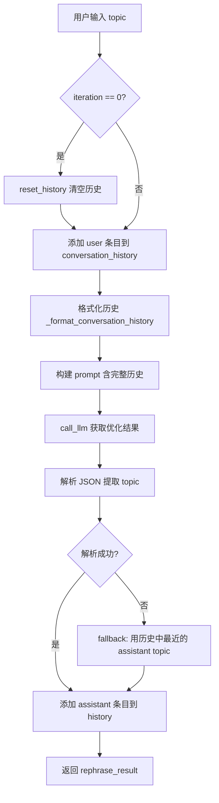
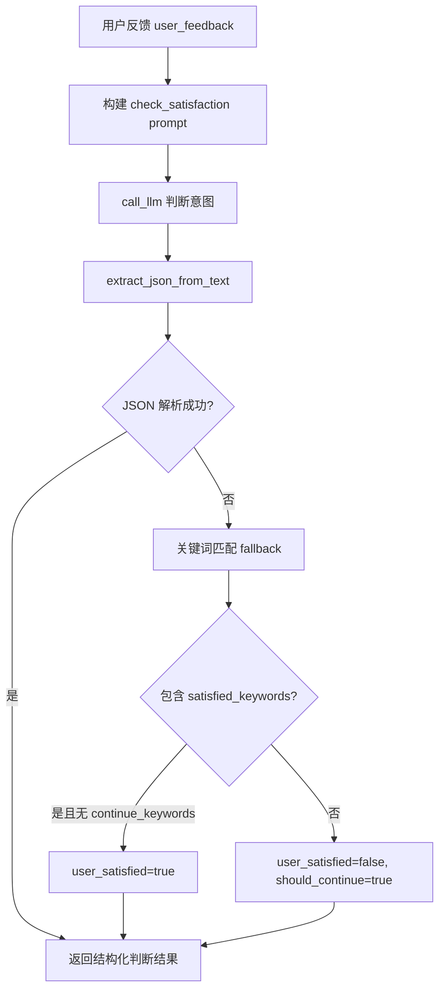
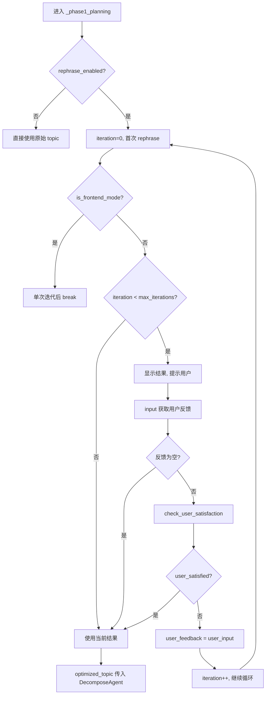

# PD-09.06 DeepTutor — Topic Rephrase 人机迭代优化方案

> 文档编号：PD-09.06
> 来源：DeepTutor `src/agents/research/agents/rephrase_agent.py`
> GitHub：https://github.com/HKUDS/DeepTutor.git
> 问题域：PD-09 Human-in-the-Loop
> 状态：可复用方案

---

## 第 1 章 问题与动机

### 1.1 核心问题

在深度研究系统中，用户输入的研究主题往往模糊、宽泛或缺乏聚焦。如果 Agent 直接使用原始输入进行研究分解和检索，会导致：

1. **研究方向偏移**：模糊主题被 LLM 自行解读，可能偏离用户真实意图
2. **资源浪费**：在错误方向上消耗大量 token 和工具调用
3. **结果不满意**：最终报告与用户期望不符，需要从头重来

DeepTutor 的解法是在研究流水线的最前端（Phase 1 Planning）插入一个**人机迭代优化环节**：RephraseAgent 先优化主题，然后征求用户意见，最多迭代 3 轮，确保研究方向与用户意图对齐后再进入耗时的研究阶段。

### 1.2 DeepTutor 的解法概述

1. **RephraseAgent 独立职责**：专门负责主题优化的 Agent，维护完整对话历史，支持多轮迭代（`rephrase_agent.py:20-41`）
2. **LLM 意图判断 + 关键词兜底**：`check_user_satisfaction()` 先用 LLM 判断用户反馈意图，解析失败时回退到关键词匹配（`rephrase_agent.py:173-260`）
3. **CLI/前端双模式适配**：通过 `progress_callback is not None` 检测运行环境，CLI 模式用 `input()` 交互，前端模式单次迭代后由 UI 控制（`research_pipeline.py:534-566`）
4. **配置驱动开关**：rephrase 功能可通过 `planning.rephrase.enabled` 关闭，`max_iterations` 控制最大迭代轮数（`config/main.yaml:71-73`）
5. **API 异步控制**：前端通过 `POST /optimize_topic` 端点独立调用 RephraseAgent，支持任意轮次的异步迭代（`src/api/routers/research.py:46-79`）

### 1.3 设计思想

| 设计原则 | 具体实现 | 理由 | 替代方案 |
|----------|----------|------|----------|
| 前置拦截 | 在 Phase 1 Planning 最前端插入 rephrase 环节 | 越早对齐意图，后续浪费越少 | 在研究中途插入检查点（成本更高） |
| Agent 化封装 | RephraseAgent 继承 BaseAgent，独立管理对话历史 | 职责单一，可独立测试和复用 | 在 Pipeline 中内联 LLM 调用（耦合度高） |
| 双层意图判断 | LLM 结构化判断 + 关键词 fallback | LLM 理解自然语言更准确，关键词保底 | 纯关键词匹配（不够智能）或纯 LLM（不够稳定） |
| 环境自适应 | `progress_callback` 检测 CLI vs 前端 | 同一 Pipeline 代码适配两种交互模式 | 两套 Pipeline 分别实现（代码重复） |
| 配置可控 | enabled/max_iterations 均可配置 | 不同场景（快速/深度）需要不同交互策略 | 硬编码迭代次数（不灵活） |

---

## 第 2 章 源码实现分析

### 2.1 架构概览

DeepTutor 的 Human-in-the-Loop 实现集中在研究流水线的 Phase 1 Planning 阶段，核心组件关系如下：

```
┌─────────────────────────────────────────────────────────────────┐
│                    ResearchPipeline                              │
│  ┌──────────────────────────────────────────────────────────┐   │
│  │ Phase 1: _phase1_planning()                              │   │
│  │  ┌─────────────┐    ┌──────────────┐    ┌────────────┐  │   │
│  │  │ Rephrase    │───→│ User Input / │───→│ Satisfaction│  │   │
│  │  │ Agent       │    │ API Feedback │    │ Check (LLM) │  │   │
│  │  │ .process()  │    │              │    │ + Keyword   │  │   │
│  │  └──────┬──────┘    └──────────────┘    └──────┬──────┘  │   │
│  │         │                                       │         │   │
│  │         └──── max 3 iterations ────────────────┘         │   │
│  │                        │                                  │   │
│  │                        ▼                                  │   │
│  │              ┌─────────────────┐                          │   │
│  │              │ DecomposeAgent  │                          │   │
│  │              │ (topic → subs)  │                          │   │
│  │              └─────────────────┘                          │   │
│  └──────────────────────────────────────────────────────────┘   │
│                                                                  │
│  Phase 2: Researching ──→ Phase 3: Reporting                    │
└─────────────────────────────────────────────────────────────────┘

外部入口:
  CLI:  python research_pipeline.py --topic "..."  → input() 交互
  API:  POST /optimize_topic                       → 异步迭代
  WS:   WebSocket /run (skip_rephrase=false)       → 前端模式单次
```

### 2.2 核心实现

#### 2.2.1 RephraseAgent 多轮对话管理



对应源码 `src/agents/research/agents/rephrase_agent.py:69-171`：

```python
class RephraseAgent(BaseAgent):
    def __init__(self, config, api_key=None, base_url=None, api_version=None):
        # ...
        # Store complete conversation history for multi-turn optimization
        self.conversation_history: list[dict[str, Any]] = []

    async def process(
        self, user_input: str, iteration: int = 0, previous_result: dict = None
    ) -> dict[str, Any]:
        # Reset history for new session (iteration 0)
        if iteration == 0:
            self.reset_history()

        # Add current user input to history
        self.conversation_history.append({
            "role": "user",
            "content": user_input,
            "iteration": iteration,
        })

        # Format conversation history for prompt
        history_text = self._format_conversation_history()

        # Format user prompt with full history
        user_prompt = user_prompt_template.format(
            user_input=user_input,
            iteration=iteration,
            conversation_history=history_text,
            previous_result=history_text,
        )

        # Call LLM
        response = await self.call_llm(
            user_prompt=user_prompt, system_prompt=system_prompt, stage="rephrase"
        )

        # Parse JSON output with fallback
        data = extract_json_from_text(response)
        try:
            result = ensure_json_dict(data)
            ensure_keys(result, ["topic"])
        except Exception:
            # Fallback: use last assistant topic from history
            fallback_topic = user_input
            for entry in reversed(self.conversation_history):
                if entry.get("role") == "assistant":
                    content = entry.get("content", {})
                    if isinstance(content, dict) and content.get("topic"):
                        fallback_topic = content["topic"]
                        break
            result = {"topic": fallback_topic}

        # Add assistant response to history
        self.conversation_history.append({
            "role": "assistant", "content": result, "iteration": iteration,
        })
        return result
```

关键设计点：
- **完整历史注入 prompt**：每次迭代都将全部对话历史格式化后注入 LLM prompt，确保 LLM 理解完整上下文（`rephrase_agent.py:124-131`）
- **JSON 解析 + fallback**：先尝试结构化解析，失败时从历史中回溯最近的有效 topic（`rephrase_agent.py:140-155`）
- **iteration 0 自动重置**：新会话自动清空历史，防止跨会话污染（`rephrase_agent.py:93-94`）

#### 2.2.2 LLM 意图判断 + 关键词兜底



对应源码 `src/agents/research/agents/rephrase_agent.py:173-260`：

```python
async def check_user_satisfaction(
    self, rephrase_result: dict, user_feedback: str
) -> dict[str, Any]:
    # Call LLM to judge user intent
    response = await self.call_llm(
        user_prompt=user_prompt, system_prompt=system_prompt,
        stage="check_satisfaction", verbose=False,
    )

    # Parse JSON output
    data = extract_json_from_text(response)
    try:
        result = ensure_json_dict(data)
        ensure_keys(result, ["user_satisfied", "should_continue", "interpretation"])
    except Exception:
        # Fallback: judge based on keywords
        feedback_lower = user_feedback.lower()
        satisfied_keywords = ["ok", "yes", "satisfied", "good", "fine", "agree", "approved"]
        continue_keywords = ["modify", "change", "adjust", "no", "need", "want", "should", "hope"]

        user_satisfied = any(kw in feedback_lower for kw in satisfied_keywords) and not any(
            kw in feedback_lower for kw in continue_keywords
        )

        result = {
            "user_satisfied": user_satisfied,
            "should_continue": not user_satisfied,
            "interpretation": "Judged based on keywords",
            "suggested_action": "Continue rephrasing" if not user_satisfied else "Proceed to next stage",
        }
    return result
```

### 2.3 实现细节

#### CLI 模式交互循环

Pipeline 的 `_phase1_planning()` 方法中，CLI 模式的交互循环实现在 `research_pipeline.py:536-606`：



核心代码 `research_pipeline.py:568-606`：

```python
# CLI mode: Ask user opinion (unless max iterations reached)
if iteration < max_iterations:
    self.logger.info("\n💬 Are you satisfied with this rephrasing result?")
    self.logger.info("   - Enter 'satisfied', 'ok', etc. to indicate satisfaction")
    self.logger.info("   - Enter specific modification suggestions")
    self.logger.info("   - Press Enter directly to use current result")

    user_input = input("\nYour choice: ").strip()

    if not user_input:
        self.logger.success("Using current result, proceeding to next stage")
        break

    # Determine user intent
    satisfaction = await self.agents["rephrase"].check_user_satisfaction(
        rephrase_result, user_input
    )

    if satisfaction.get("user_satisfied", False):
        self.logger.success("User satisfied, proceeding to next stage")
        break

    if not satisfaction.get("should_continue", True):
        self.logger.success("Proceeding to next stage")
        break

    # Continue iteration, use user input as feedback
    user_feedback = user_input
```

#### 前端 API 异步控制

前端模式下，用户通过 `POST /optimize_topic` 端点独立控制迭代（`src/api/routers/research.py:46-79`）：

```python
class OptimizeRequest(BaseModel):
    topic: str
    iteration: int = 0
    previous_result: dict[str, Any] | None = None
    kb_name: str | None = "ai_textbook"

@router.post("/optimize_topic")
async def optimize_topic(request: OptimizeRequest):
    agent = RephraseAgent(config=config, api_key=api_key, base_url=base_url)
    if request.iteration == 0:
        result = await agent.process(request.topic, iteration=0)
    else:
        result = await agent.process(
            request.topic, iteration=request.iteration,
            previous_result=request.previous_result
        )
    return result
```

关键设计：前端每次调用都创建新的 RephraseAgent 实例，`previous_result` 通过请求参数传递而非依赖服务端状态。这意味着前端需要自行维护迭代状态。

#### WebSocket 模式的 skip_rephrase 控制

WebSocket `/run` 端点支持 `skip_rephrase` 参数（`research.py:101`），设为 `true` 时直接禁用 rephrase 步骤：

```python
skip_rephrase = data.get("skip_rephrase", False)
# ...
if skip_rephrase:
    config["planning"]["rephrase"]["enabled"] = False
```

---

## 第 3 章 迁移指南

### 3.1 迁移清单

#### 阶段一：核心交互循环（最小可用）

- [ ] 创建 `RephraseAgent` 类，继承你的 BaseAgent，实现 `process()` 和 `check_user_satisfaction()` 两个方法
- [ ] 添加 `conversation_history` 列表，支持多轮对话上下文
- [ ] 编写 rephrase prompt 模板（含 `{user_input}`, `{iteration}`, `{conversation_history}` 占位符）
- [ ] 编写 check_satisfaction prompt 模板（输出 `user_satisfied` / `should_continue` / `interpretation`）
- [ ] 在 Pipeline 的 Planning 阶段插入 while 循环，调用 `input()` 获取用户反馈

#### 阶段二：双模式适配

- [ ] 添加 `progress_callback` 参数检测前端/CLI 模式
- [ ] 前端模式：单次迭代后返回，由前端 UI 控制后续迭代
- [ ] 创建 `POST /optimize_topic` API 端点，支持 `iteration` 和 `previous_result` 参数
- [ ] 添加 `skip_rephrase` 配置项，允许跳过整个 rephrase 环节

#### 阶段三：健壮性增强

- [ ] 实现 JSON 解析 fallback：解析失败时从历史中回溯最近有效结果
- [ ] 实现关键词匹配 fallback：LLM 意图判断失败时用关键词兜底
- [ ] 添加 `max_iterations` 配置上限，防止无限循环
- [ ] 空输入处理：用户直接回车时使用当前结果

### 3.2 适配代码模板

以下是一个可直接复用的最小实现，不依赖 DeepTutor 的 BaseAgent：

```python
"""
Minimal RephraseAgent — 可独立运行的人机迭代主题优化模块
从 DeepTutor 提取，适配任意 LLM 后端
"""
import json
from typing import Any

# 替换为你的 LLM 调用函数
async def call_llm(system_prompt: str, user_prompt: str) -> str:
    """你的 LLM 调用实现"""
    raise NotImplementedError("Replace with your LLM call")


REPHRASE_SYSTEM = "You are a research topic optimization expert."

REPHRASE_PROMPT = """Analyze and optimize the following user input. Output JSON only:

User Input: {user_input}
Iteration: {iteration}
Conversation History:
{conversation_history}

Output JSON:
{{"topic": "A clear, complete research topic description"}}

Rules:
1. When iteration=0, provide reasonable focus and optimization
2. When iteration>0, adjust based on user feedback in history
"""

CHECK_SATISFACTION_PROMPT = """Analyze user feedback. Output JSON only:

Current Topic: {topic}
User Feedback: {user_feedback}

Output JSON:
{{"user_satisfied": true/false, "should_continue": true/false, "interpretation": "..."}}

Criteria:
- satisfied/ok/yes/good → user_satisfied=true
- modify/change/adjust/no → should_continue=true
"""

SATISFIED_KEYWORDS = {"ok", "yes", "satisfied", "good", "fine", "agree", "approved"}
CONTINUE_KEYWORDS = {"modify", "change", "adjust", "no", "need", "want", "should"}


class RephraseLoop:
    """人机迭代主题优化循环"""

    def __init__(self, max_iterations: int = 3):
        self.max_iterations = max_iterations
        self.history: list[dict[str, Any]] = []

    def _format_history(self) -> str:
        parts = []
        for entry in self.history:
            role, it, content = entry["role"], entry["iteration"], entry["content"]
            if role == "user":
                label = "Initial Input" if it == 0 else f"Feedback (Round {it})"
                parts.append(f"[User - {label}]\n{content}")
            elif role == "assistant":
                topic = content.get("topic", "") if isinstance(content, dict) else str(content)
                parts.append(f"[Assistant - Rephrased (Round {it})]\n{topic}")
        return "\n\n".join(parts)

    async def rephrase(self, user_input: str, iteration: int) -> dict[str, Any]:
        if iteration == 0:
            self.history.clear()

        self.history.append({"role": "user", "content": user_input, "iteration": iteration})

        prompt = REPHRASE_PROMPT.format(
            user_input=user_input,
            iteration=iteration,
            conversation_history=self._format_history(),
        )
        response = await call_llm(REPHRASE_SYSTEM, prompt)

        try:
            result = json.loads(response)
            assert "topic" in result
        except Exception:
            result = {"topic": user_input}  # fallback

        result["iteration"] = iteration
        self.history.append({"role": "assistant", "content": result, "iteration": iteration})
        return result

    async def check_satisfaction(self, topic: str, feedback: str) -> dict[str, Any]:
        prompt = CHECK_SATISFACTION_PROMPT.format(topic=topic, user_feedback=feedback)
        response = await call_llm(REPHRASE_SYSTEM, prompt)

        try:
            result = json.loads(response)
            assert "user_satisfied" in result
            return result
        except Exception:
            # Keyword fallback (mirrors DeepTutor rephrase_agent.py:228-253)
            words = set(feedback.lower().split())
            satisfied = bool(words & SATISFIED_KEYWORDS) and not bool(words & CONTINUE_KEYWORDS)
            return {
                "user_satisfied": satisfied,
                "should_continue": not satisfied,
                "interpretation": "keyword fallback",
            }

    async def run_cli(self, topic: str) -> str:
        """CLI 模式完整交互循环"""
        result = await self.rephrase(topic, iteration=0)

        for i in range(1, self.max_iterations):
            print(f"\nOptimized Topic: {result['topic']}")
            feedback = input("Your feedback (Enter to accept): ").strip()

            if not feedback:
                break

            satisfaction = await self.check_satisfaction(result["topic"], feedback)
            if satisfaction.get("user_satisfied", False):
                break

            result = await self.rephrase(feedback, iteration=i)

        return result["topic"]
```

### 3.3 适用场景

| 场景 | 适用度 | 说明 |
|------|--------|------|
| 研究/分析类 Agent | ⭐⭐⭐ | 研究主题优化是最典型的应用场景 |
| 代码生成 Agent | ⭐⭐ | 需求澄清阶段可复用此模式 |
| 多步骤工作流 | ⭐⭐⭐ | 任何需要在执行前确认方向的流水线 |
| 实时对话 Agent | ⭐ | 对话本身就是交互，不需要额外的 rephrase 环节 |
| 批量处理 | ⭐ | 无人值守场景应禁用交互，直接使用 LLM 优化结果 |

---

## 第 4 章 测试用例

```python
"""
Tests for RephraseLoop — 基于 DeepTutor RephraseAgent 的测试设计
覆盖：正常路径、边界情况、降级行为
"""
import pytest
from unittest.mock import AsyncMock, patch


class TestRephraseLoop:
    """测试人机迭代主题优化循环"""

    @pytest.fixture
    def loop(self):
        from rephrase_loop import RephraseLoop
        return RephraseLoop(max_iterations=3)

    @pytest.mark.asyncio
    async def test_first_iteration_resets_history(self, loop):
        """iteration=0 时应清空历史"""
        loop.history = [{"role": "user", "content": "old", "iteration": 0}]

        with patch("rephrase_loop.call_llm", new_callable=AsyncMock) as mock_llm:
            mock_llm.return_value = '{"topic": "optimized topic"}'
            result = await loop.rephrase("new input", iteration=0)

        assert len(loop.history) == 2  # user + assistant
        assert loop.history[0]["content"] == "new input"
        assert result["topic"] == "optimized topic"

    @pytest.mark.asyncio
    async def test_subsequent_iteration_preserves_history(self, loop):
        """iteration>0 时应保留历史"""
        loop.history = [
            {"role": "user", "content": "initial", "iteration": 0},
            {"role": "assistant", "content": {"topic": "v1"}, "iteration": 0},
        ]

        with patch("rephrase_loop.call_llm", new_callable=AsyncMock) as mock_llm:
            mock_llm.return_value = '{"topic": "v2 based on feedback"}'
            result = await loop.rephrase("add more focus on X", iteration=1)

        assert len(loop.history) == 4  # 2 old + 1 user + 1 assistant
        assert result["topic"] == "v2 based on feedback"

    @pytest.mark.asyncio
    async def test_json_parse_fallback(self, loop):
        """LLM 返回非 JSON 时应 fallback 到用户输入"""
        with patch("rephrase_loop.call_llm", new_callable=AsyncMock) as mock_llm:
            mock_llm.return_value = "This is not JSON at all"
            result = await loop.rephrase("my topic", iteration=0)

        assert result["topic"] == "my topic"  # fallback to user_input

    @pytest.mark.asyncio
    async def test_satisfaction_check_satisfied(self, loop):
        """用户满意时应返回 user_satisfied=True"""
        with patch("rephrase_loop.call_llm", new_callable=AsyncMock) as mock_llm:
            mock_llm.return_value = '{"user_satisfied": true, "should_continue": false, "interpretation": "user agrees"}'
            result = await loop.check_satisfaction("topic", "looks good")

        assert result["user_satisfied"] is True
        assert result["should_continue"] is False

    @pytest.mark.asyncio
    async def test_satisfaction_keyword_fallback(self, loop):
        """LLM 判断失败时应回退到关键词匹配"""
        with patch("rephrase_loop.call_llm", new_callable=AsyncMock) as mock_llm:
            mock_llm.return_value = "invalid response"

            # 满意关键词
            result = await loop.check_satisfaction("topic", "ok fine")
            assert result["user_satisfied"] is True

            # 修改关键词
            result = await loop.check_satisfaction("topic", "need to change focus")
            assert result["user_satisfied"] is False
            assert result["should_continue"] is True

    @pytest.mark.asyncio
    async def test_satisfaction_mixed_keywords(self, loop):
        """同时包含满意和修改关键词时，应倾向继续"""
        with patch("rephrase_loop.call_llm", new_callable=AsyncMock) as mock_llm:
            mock_llm.return_value = "invalid"
            # "good but need change" 包含 good(satisfied) 和 need+change(continue)
            result = await loop.check_satisfaction("topic", "good but need change")
            assert result["user_satisfied"] is False

    @pytest.mark.asyncio
    async def test_max_iterations_respected(self, loop):
        """不应超过 max_iterations"""
        call_count = 0

        async def mock_llm(sys, usr):
            nonlocal call_count
            call_count += 1
            return '{"topic": "v' + str(call_count) + '"}'

        with patch("rephrase_loop.call_llm", side_effect=mock_llm):
            with patch("builtins.input", side_effect=["change it", "change again", "change more"]):
                with patch.object(loop, "check_satisfaction", new_callable=AsyncMock) as mock_sat:
                    mock_sat.return_value = {"user_satisfied": False, "should_continue": True}
                    result = await loop.run_cli("initial topic")

        # max_iterations=3, so rephrase called at most 3 times (iteration 0,1,2)
        assert call_count <= 3
```
