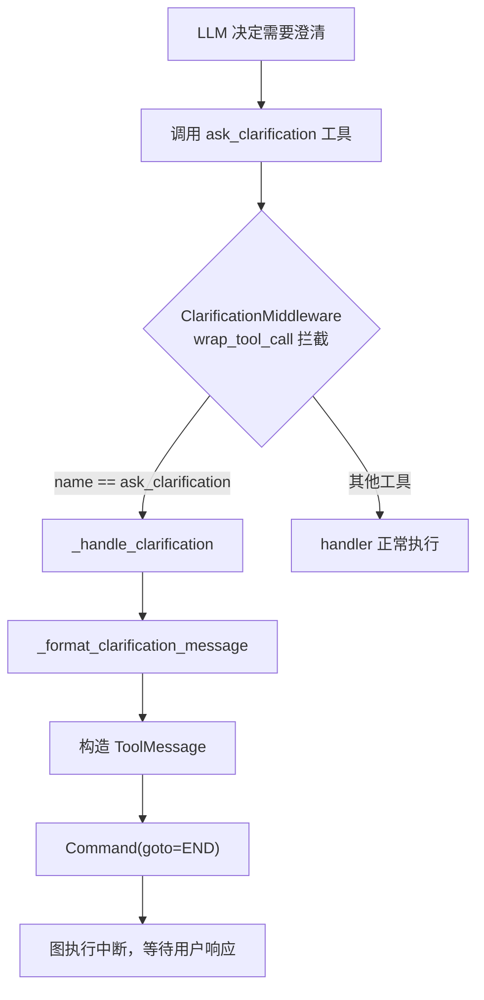
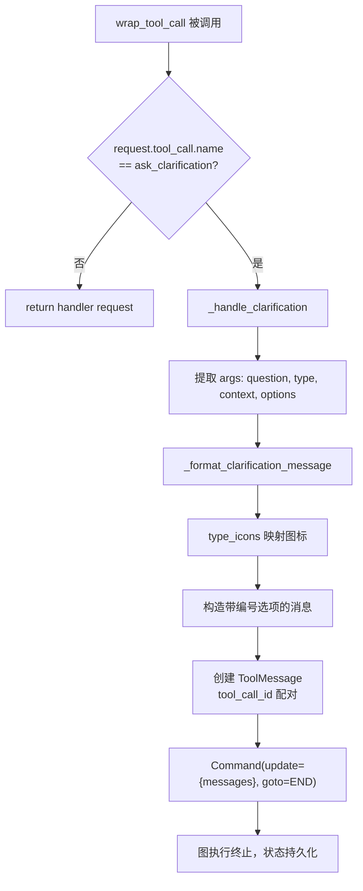

# PD-09.02 DeerFlow — ClarificationMiddleware 中间件拦截与 Command+END 中断

> 文档编号：PD-09.02
> 来源：DeerFlow 2.0 `backend/src/agents/middlewares/clarification_middleware.py`
> GitHub：https://github.com/bytedance/deer-flow.git
> 问题域：PD-09 Human-in-the-Loop
> 状态：可复用方案

---

## 第 1 章 问题与动机

### 1.1 核心问题

Agent 系统在执行用户任务时，经常面临信息不完整、需求模糊、存在多种可行方案等情况。如果 Agent 在不确定时直接猜测并执行，轻则浪费计算资源产出无用结果，重则执行破坏性操作（如删除文件、修改生产配置）造成不可逆损失。

Human-in-the-Loop 的核心挑战在于：**如何在不阻塞线程、不破坏执行流的前提下，优雅地暂停 Agent 执行、向用户提问、等待响应、然后恢复执行？**

传统做法是在 Agent 节点内部硬编码 `if need_clarification: ask_user()` 逻辑，但这导致澄清逻辑与业务逻辑深度耦合，难以复用和测试。DeerFlow 2.0 选择了一条更优雅的路径：**将澄清行为建模为工具调用，用中间件拦截实现解耦，用 LangGraph Command+END 实现非阻塞中断**。

### 1.2 DeerFlow 的解法概述

DeerFlow 2.0 的 HITL 方案由三层协作组成：

1. **Prompt 层强制优先级**：系统 prompt 中定义 `CLARIFY → PLAN → ACT` 工作流优先级，通过 `<clarification_system>` XML 标签注入 5 种澄清场景的强制规则（`backend/src/agents/lead_agent/prompt.py:166-232`）
2. **工具层类型化建模**：`ask_clarification` 工具用 `Literal` 类型约束 5 种澄清类型，工具本身是空壳——实际逻辑由中间件处理（`backend/src/tools/builtins/clarification_tool.py:6-55`）
3. **中间件层拦截中断**：`ClarificationMiddleware.wrap_tool_call` 拦截 `ask_clarification` 调用，构造 `Command(goto=END)` 中断执行流，将格式化的澄清消息写入状态（`backend/src/agents/middlewares/clarification_middleware.py:131-151`）
4. **悬挂修复层**：`DanglingToolCallMiddleware` 在 `before_model` 阶段检测因中断导致的未配对 tool_call，注入合成 ToolMessage 防止 LLM 报错（`backend/src/agents/middlewares/dangling_tool_call_middleware.py:30-66`）
5. **前端层分组渲染**：前端 `groupMessages` 函数识别 `ask_clarification` 类型的 ToolMessage，创建独立的 `assistant:clarification` 消息组，以 Markdown 格式渲染澄清问题（`frontend/src/core/messages/utils.ts:47-63`）

### 1.3 设计思想

| 设计原则 | 具体实现 | 理由 | 替代方案 |
|----------|----------|------|----------|
| 工具即协议 | `ask_clarification` 是空壳工具，真实逻辑在中间件 | LLM 只需学会调用工具，不需要理解中断机制 | 在节点内硬编码 `interrupt()` 调用 |
| 中间件解耦 | `ClarificationMiddleware.wrap_tool_call` 拦截 | 澄清逻辑与业务逻辑完全分离，可独立测试 | 在每个 Agent 节点内判断是否需要澄清 |
| Command+END 非阻塞 | `Command(goto=END)` 中断图执行 | 不阻塞线程，支持 LangGraph 持久化，可恢复 | `threading.Event.wait()` 阻塞线程 |
| 类型化澄清 | 5 种 `Literal` 类型 + 图标映射 | 前端可按类型渲染不同 UI，结构化便于统计 | 自由文本 question 字段 |
| 悬挂修复 | `DanglingToolCallMiddleware` 注入合成 ToolMessage | 防止中断后消息历史不完整导致 LLM 报错 | 忽略不完整消息（会导致 API 错误） |
| Prompt 强制 | `STRICT ENFORCEMENT` 规则 + ❌/✅ 清单 | 仅靠工具存在不够，需要 prompt 强制 Agent 优先澄清 | 仅注册工具，不在 prompt 中强调优先级 |

---

## 第 2 章 源码实现分析

### 2.1 架构概览

DeerFlow 2.0 的 HITL 架构是一个四层管道，从 Prompt 注入到前端渲染形成完整闭环：

```
┌─────────────────────────────────────────────────────────────────┐
│                    System Prompt Layer                          │
│  <clarification_system>                                        │
│    CLARIFY → PLAN → ACT 优先级                                  │
│    5 种澄清场景 + STRICT ENFORCEMENT 规则                        │
│  </clarification_system>                                       │
├─────────────────────────────────────────────────────────────────┤
│                    Tool Layer                                   │
│  ask_clarification(question, type, context, options)            │
│  → 空壳实现，return "processed by middleware"                    │
├─────────────────────────────────────────────────────────────────┤
│                    Middleware Layer                             │
│  ClarificationMiddleware.wrap_tool_call()                      │
│    → 拦截 ask_clarification                                     │
│    → _format_clarification_message() 格式化                     │
│    → Command(update={messages: [ToolMessage]}, goto=END)        │
│                                                                 │
│  DanglingToolCallMiddleware.before_model()                      │
│    → 检测未配对 tool_call                                        │
│    → 注入合成 ToolMessage(status="error")                       │
├─────────────────────────────────────────────────────────────────┤
│                    Frontend Layer                               │
│  groupMessages() → "assistant:clarification" 消息组              │
│  isClarificationToolMessage() → 类型检测                        │
│  MessageGroup → MessageCircleQuestionMarkIcon 渲染              │
└─────────────────────────────────────────────────────────────────┘
```

中间件注册顺序至关重要。在 `agent.py:186-235` 的 `_build_middlewares` 函数中，`ClarificationMiddleware` 被显式放在最后位置，确保它在所有其他中间件处理完毕后才拦截工具调用：

```
ThreadData → Uploads → Sandbox → DanglingToolCall → Summarization
→ TodoList → Title → Memory → ViewImage → SubagentLimit → Clarification(最后)
```

### 2.2 核心实现

#### 2.2.1 工具定义：类型化的空壳



对应源码 `backend/src/tools/builtins/clarification_tool.py:6-55`：

```python
@tool("ask_clarification", parse_docstring=True, return_direct=True)
def ask_clarification_tool(
    question: str,
    clarification_type: Literal[
        "missing_info",
        "ambiguous_requirement",
        "approach_choice",
        "risk_confirmation",
        "suggestion",
    ],
    context: str | None = None,
    options: list[str] | None = None,
) -> str:
    """Ask the user for clarification when you need more information to proceed.
    ...
    """
    # This is a placeholder implementation
    # The actual logic is handled by ClarificationMiddleware
    return "Clarification request processed by middleware"
```

关键设计点：
- `return_direct=True` 标记告诉 LangGraph 该工具的返回值直接作为最终输出，不再经过 LLM 处理
- `Literal` 类型约束确保 LLM 只能选择预定义的 5 种澄清类型
- `parse_docstring=True` 让 LangChain 从 docstring 自动生成工具 schema，LLM 能看到完整的使用说明
- 工具函数体是空壳——真正的逻辑在 `ClarificationMiddleware` 中

#### 2.2.2 中间件拦截：Command+END 中断



对应源码 `backend/src/agents/middlewares/clarification_middleware.py:91-151`：

```python
def _handle_clarification(self, request: ToolCallRequest) -> Command:
    args = request.tool_call.get("args", {})
    question = args.get("question", "")
    print("[ClarificationMiddleware] Intercepted clarification request")
    print(f"[ClarificationMiddleware] Question: {question}")

    formatted_message = self._format_clarification_message(args)
    tool_call_id = request.tool_call.get("id", "")

    # 创建配对的 ToolMessage，写入消息历史
    tool_message = ToolMessage(
        content=formatted_message,
        tool_call_id=tool_call_id,
        name="ask_clarification",
    )

    # Command(goto=END) 中断图执行
    return Command(
        update={"messages": [tool_message]},
        goto=END,
    )

@override
def wrap_tool_call(
    self,
    request: ToolCallRequest,
    handler: Callable[[ToolCallRequest], ToolMessage | Command],
) -> ToolMessage | Command:
    if request.tool_call.get("name") != "ask_clarification":
        return handler(request)  # 非澄清工具，正常执行
    return self._handle_clarification(request)
```

核心机制解析：
- `Command(goto=END)` 是 LangGraph 的图控制原语，将执行流导向 `__end__` 节点，图执行终止但状态保留
- `update={"messages": [tool_message]}` 将格式化的澄清消息写入 `ThreadState.messages`，确保消息历史完整
- `tool_call_id` 配对确保 ToolMessage 与 AIMessage 中的 tool_call 正确关联，防止消息历史格式错误
- 同时提供 `wrap_tool_call`（同步）和 `awrap_tool_call`（异步）两个版本，适配不同运行模式

### 2.3 实现细节

#### 2.3.1 澄清消息格式化

`_format_clarification_message` 方法（`clarification_middleware.py:46-89`）将结构化参数转换为用户友好的文本：

```python
type_icons = {
    "missing_info": "❓",
    "ambiguous_requirement": "🤔",
    "approach_choice": "🔀",
    "risk_confirmation": "⚠️",
    "suggestion": "💡",
}
```

格式化逻辑：有 context 时先展示背景再提问，有 options 时生成编号列表。这种结构化输出让前端可以按类型渲染不同的 UI 组件。

#### 2.3.2 悬挂工具调用修复

当 `ClarificationMiddleware` 通过 `Command(goto=END)` 中断执行时，如果 AIMessage 中包含多个 tool_call（例如 LLM 同时调用了 `ask_clarification` 和 `web_search`），只有 `ask_clarification` 会得到 ToolMessage 响应，其他 tool_call 成为"悬挂"状态。

`DanglingToolCallMiddleware`（`dangling_tool_call_middleware.py:30-66`）在下一轮 `before_model` 阶段修复这个问题：

```python
def _fix_dangling_tool_calls(self, state: AgentState) -> dict | None:
    messages = state.get("messages", [])
    existing_tool_msg_ids: set[str] = set()
    for msg in messages:
        if isinstance(msg, ToolMessage):
            existing_tool_msg_ids.add(msg.tool_call_id)

    patches: list[ToolMessage] = []
    for msg in messages:
        if getattr(msg, "type", None) != "ai":
            continue
        tool_calls = getattr(msg, "tool_calls", None)
        if not tool_calls:
            continue
        for tc in tool_calls:
            tc_id = tc.get("id")
            if tc_id and tc_id not in existing_tool_msg_ids:
                patches.append(ToolMessage(
                    content="[Tool call was interrupted and did not return a result.]",
                    tool_call_id=tc_id,
                    name=tc.get("name", "unknown"),
                    status="error",
                ))
                existing_tool_msg_ids.add(tc_id)

    if not patches:
        return None
    return {"messages": patches}
```

#### 2.3.3 前端消息分组

前端通过 `groupMessages` 函数（`frontend/src/core/messages/utils.ts:29-126`）将消息流分组，`isClarificationToolMessage` 检测 `ask_clarification` 类型的 ToolMessage，创建独立的 `assistant:clarification` 消息组。在 `message-list.tsx:68-80` 中，该组被渲染为 Markdown 内容，直接展示格式化后的澄清问题。

#### 2.3.4 中间件注册顺序

`_build_middlewares`（`agent.py:186-235`）中的注释明确说明了顺序设计：

```
# ClarificationMiddleware should always be last
middlewares.append(ClarificationMiddleware())
```

这确保：
- `DanglingToolCallMiddleware` 先于 `ClarificationMiddleware` 注册，在 `before_model` 阶段修复上一轮的悬挂调用
- `SummarizationMiddleware` 在 `ClarificationMiddleware` 之前处理，避免澄清消息被意外压缩
- `SubagentLimitMiddleware` 在 `ClarificationMiddleware` 之前截断多余的 task 调用

#### 2.3.5 Prompt 层强制优先级

系统 prompt（`prompt.py:165-232`）通过 `<clarification_system>` 标签注入强制规则：

- `WORKFLOW PRIORITY: CLARIFY → PLAN → ACT` 定义三步优先级
- 5 种 `MANDATORY Clarification Scenarios` 逐一列举触发条件和示例
- `STRICT ENFORCEMENT` 用 ❌/✅ 清单明确禁止和要求的行为
- `thinking_style` 中也强调：`If anything is unclear, missing, or has multiple interpretations, you MUST ask for clarification FIRST`


---

## 第 3 章 迁移指南

### 3.1 迁移清单

**阶段 1：工具定义（30 分钟）**
- [ ] 创建 `ask_clarification` 工具，定义 `Literal` 类型约束的澄清类型枚举
- [ ] 工具函数体留空（返回占位字符串），标记 `return_direct=True`
- [ ] 在工具 docstring 中详细描述每种澄清类型的使用场景

**阶段 2：中间件实现（1-2 小时）**
- [ ] 实现 `ClarificationMiddleware`，继承 `AgentMiddleware`
- [ ] 在 `wrap_tool_call` 中拦截 `ask_clarification` 调用
- [ ] 构造 `Command(update={messages: [ToolMessage]}, goto=END)` 中断执行
- [ ] 实现 `_format_clarification_message` 格式化逻辑
- [ ] 实现 `DanglingToolCallMiddleware` 修复悬挂工具调用

**阶段 3：Prompt 注入（30 分钟）**
- [ ] 在系统 prompt 中添加 `CLARIFY → PLAN → ACT` 优先级规则
- [ ] 列举所有澄清场景和示例
- [ ] 添加 `STRICT ENFORCEMENT` 规则

**阶段 4：前端适配（1-2 小时）**
- [ ] 实现消息分组逻辑，识别 `ask_clarification` 类型的 ToolMessage
- [ ] 为澄清消息设计独立的 UI 组件
- [ ] 处理用户响应后的图恢复逻辑

### 3.2 适配代码模板

以下是一个最小可运行的 ClarificationMiddleware 实现，可直接用于任何 LangGraph 项目：

```python
"""Minimal ClarificationMiddleware for LangGraph projects."""

from typing import Literal, Callable, override
from langchain.tools import tool
from langchain.agents import AgentState
from langchain.agents.middleware import AgentMiddleware
from langchain_core.messages import ToolMessage
from langgraph.graph import END
from langgraph.prebuilt.tool_node import ToolCallRequest
from langgraph.types import Command


# === Step 1: 工具定义 ===

CLARIFICATION_TYPES = Literal[
    "missing_info",
    "ambiguous_requirement",
    "approach_choice",
    "risk_confirmation",
    "suggestion",
]

@tool("ask_clarification", parse_docstring=True, return_direct=True)
def ask_clarification_tool(
    question: str,
    clarification_type: CLARIFICATION_TYPES,
    context: str | None = None,
    options: list[str] | None = None,
) -> str:
    """Ask the user for clarification. Intercepted by middleware."""
    return "Processed by middleware"


# === Step 2: 中间件 ===

TYPE_ICONS = {
    "missing_info": "❓",
    "ambiguous_requirement": "🤔",
    "approach_choice": "🔀",
    "risk_confirmation": "⚠️",
    "suggestion": "💡",
}

class ClarificationMiddleware(AgentMiddleware[AgentState]):
    """Intercepts ask_clarification and interrupts with Command(goto=END)."""

    def _format_message(self, args: dict) -> str:
        question = args.get("question", "")
        ctype = args.get("clarification_type", "missing_info")
        context = args.get("context")
        options = args.get("options", [])
        icon = TYPE_ICONS.get(ctype, "❓")

        parts = []
        if context:
            parts.append(f"{icon} {context}")
            parts.append(f"\n{question}")
        else:
            parts.append(f"{icon} {question}")

        if options:
            parts.append("")
            for i, opt in enumerate(options, 1):
                parts.append(f"  {i}. {opt}")

        return "\n".join(parts)

    @override
    def wrap_tool_call(self, request, handler):
        if request.tool_call.get("name") != "ask_clarification":
            return handler(request)

        args = request.tool_call.get("args", {})
        tool_message = ToolMessage(
            content=self._format_message(args),
            tool_call_id=request.tool_call.get("id", ""),
            name="ask_clarification",
        )
        return Command(update={"messages": [tool_message]}, goto=END)

    @override
    async def awrap_tool_call(self, request, handler):
        if request.tool_call.get("name") != "ask_clarification":
            return await handler(request)

        args = request.tool_call.get("args", {})
        tool_message = ToolMessage(
            content=self._format_message(args),
            tool_call_id=request.tool_call.get("id", ""),
            name="ask_clarification",
        )
        return Command(update={"messages": [tool_message]}, goto=END)


# === Step 3: 悬挂修复中间件 ===

class DanglingToolCallMiddleware(AgentMiddleware[AgentState]):
    """Patches dangling tool calls with synthetic error ToolMessages."""

    @override
    def before_model(self, state, runtime):
        messages = state.get("messages", [])
        existing_ids = {
            msg.tool_call_id for msg in messages
            if isinstance(msg, ToolMessage)
        }
        patches = []
        for msg in messages:
            if getattr(msg, "type", None) != "ai":
                continue
            for tc in getattr(msg, "tool_calls", []) or []:
                tc_id = tc.get("id")
                if tc_id and tc_id not in existing_ids:
                    patches.append(ToolMessage(
                        content="[Tool call was interrupted.]",
                        tool_call_id=tc_id,
                        name=tc.get("name", "unknown"),
                        status="error",
                    ))
                    existing_ids.add(tc_id)
        return {"messages": patches} if patches else None


# === Step 4: 注册 ===

def build_middlewares():
    return [
        DanglingToolCallMiddleware(),
        # ... 其他中间件 ...
        ClarificationMiddleware(),  # 必须放最后
    ]
```

### 3.3 适用场景

| 场景 | 适用度 | 说明 |
|------|--------|------|
| LangGraph Agent 系统 | ⭐⭐⭐ | 原生支持 Command+END，直接复用 |
| LangChain Agent（非 LangGraph） | ⭐⭐ | 需要自行实现中断恢复机制 |
| 自研 Agent 框架 | ⭐⭐ | 中间件模式可移植，但 Command 需替换为框架等价物 |
| 单轮对话系统 | ⭐ | 无需中断恢复，直接在响应中提问即可 |
| 批处理 Agent | ⭐ | 无人值守场景，需改为超时自动降级 |

---

## 第 4 章 测试用例

```python
"""Tests for DeerFlow ClarificationMiddleware HITL pattern."""

import pytest
from unittest.mock import MagicMock, AsyncMock
from langchain_core.messages import ToolMessage, AIMessage
from langgraph.graph import END
from langgraph.types import Command


class TestClarificationTool:
    """Test ask_clarification tool definition."""

    def test_tool_returns_placeholder(self):
        """Tool body is a stub — real logic is in middleware."""
        from clarification_tool import ask_clarification_tool
        result = ask_clarification_tool.invoke({
            "question": "Which env?",
            "clarification_type": "approach_choice",
        })
        assert "middleware" in result.lower()

    def test_tool_accepts_all_five_types(self):
        """All 5 clarification types are valid."""
        valid_types = [
            "missing_info", "ambiguous_requirement",
            "approach_choice", "risk_confirmation", "suggestion",
        ]
        for ctype in valid_types:
            # Should not raise validation error
            result = ask_clarification_tool.invoke({
                "question": "test?",
                "clarification_type": ctype,
            })
            assert result is not None

    def test_tool_rejects_invalid_type(self):
        """Invalid clarification type raises error."""
        with pytest.raises(Exception):
            ask_clarification_tool.invoke({
                "question": "test?",
                "clarification_type": "invalid_type",
            })


class TestClarificationMiddleware:
    """Test ClarificationMiddleware interception and Command generation."""

    def _make_request(self, name="ask_clarification", args=None):
        return MagicMock(tool_call={
            "name": name,
            "id": "call_123",
            "args": args or {
                "question": "Which environment?",
                "clarification_type": "approach_choice",
                "context": "Deployment target needed",
                "options": ["dev", "staging", "prod"],
            },
        })

    def test_non_clarification_passes_through(self):
        """Non-clarification tools are forwarded to handler."""
        from clarification_middleware import ClarificationMiddleware
        mw = ClarificationMiddleware()
        handler = MagicMock(return_value=ToolMessage(content="ok", tool_call_id="x"))
        request = self._make_request(name="web_search")
        result = mw.wrap_tool_call(request, handler)
        handler.assert_called_once_with(request)

    def test_clarification_returns_command_end(self):
        """ask_clarification is intercepted and returns Command(goto=END)."""
        from clarification_middleware import ClarificationMiddleware
        mw = ClarificationMiddleware()
        handler = MagicMock()
        request = self._make_request()
        result = mw.wrap_tool_call(request, handler)

        assert isinstance(result, Command)
        assert result.goto == END
        handler.assert_not_called()

    def test_command_contains_tool_message(self):
        """Command update includes formatted ToolMessage."""
        from clarification_middleware import ClarificationMiddleware
        mw = ClarificationMiddleware()
        request = self._make_request()
        result = mw.wrap_tool_call(request, MagicMock())

        messages = result.update["messages"]
        assert len(messages) == 1
        msg = messages[0]
        assert isinstance(msg, ToolMessage)
        assert msg.tool_call_id == "call_123"
        assert msg.name == "ask_clarification"
        assert "Which environment?" in msg.content
        assert "🔀" in msg.content  # approach_choice icon

    def test_options_formatted_as_numbered_list(self):
        """Options are rendered as numbered list."""
        from clarification_middleware import ClarificationMiddleware
        mw = ClarificationMiddleware()
        request = self._make_request()
        result = mw.wrap_tool_call(request, MagicMock())
        content = result.update["messages"][0].content
        assert "1. dev" in content
        assert "2. staging" in content
        assert "3. prod" in content


class TestDanglingToolCallMiddleware:
    """Test dangling tool call detection and patching."""

    def test_no_dangling_returns_none(self):
        """No dangling calls → no patches."""
        from dangling_tool_call_middleware import DanglingToolCallMiddleware
        mw = DanglingToolCallMiddleware()
        state = {"messages": [
            AIMessage(content="", tool_calls=[{"id": "c1", "name": "search", "args": {}}]),
            ToolMessage(content="result", tool_call_id="c1"),
        ]}
        assert mw.before_model(state, MagicMock()) is None

    def test_dangling_call_gets_patched(self):
        """Dangling tool call gets synthetic error ToolMessage."""
        from dangling_tool_call_middleware import DanglingToolCallMiddleware
        mw = DanglingToolCallMiddleware()
        state = {"messages": [
            AIMessage(content="", tool_calls=[
                {"id": "c1", "name": "ask_clarification", "args": {}},
                {"id": "c2", "name": "web_search", "args": {}},
            ]),
            ToolMessage(content="clarification", tool_call_id="c1"),
            # c2 has no matching ToolMessage → dangling
        ]}
        result = mw.before_model(state, MagicMock())
        assert result is not None
        assert len(result["messages"]) == 1
        patch = result["messages"][0]
        assert patch.tool_call_id == "c2"
        assert patch.status == "error"
        assert "interrupted" in patch.content.lower()
```


---

## 第 5 章 跨域关联

| 关联域 | 关系类型 | 说明 |
|--------|----------|------|
| PD-01 上下文管理 | 协同 | 澄清消息写入 `ThreadState.messages`，增加上下文长度；`SummarizationMiddleware` 在 `ClarificationMiddleware` 之前处理，避免澄清消息被压缩 |
| PD-02 多 Agent 编排 | 协同 | `SubagentLimitMiddleware` 在 `ClarificationMiddleware` 之前截断多余 task 调用；子代理（general_purpose/bash_agent）不注册 `ask_clarification` 工具，只有 lead_agent 可以向用户提问 |
| PD-04 工具系统 | 依赖 | `ask_clarification` 作为 `BUILTIN_TOOLS` 注册在 `tools.py:11-14`，与 `present_file` 并列；工具的 `return_direct=True` 和 `parse_docstring=True` 依赖 LangChain 工具系统 |
| PD-06 记忆持久化 | 协同 | `MemoryMiddleware` 在 `ClarificationMiddleware` 之前注册，澄清对话会被记忆系统捕获；`Command(goto=END)` 中断后状态通过 LangGraph checkpointer 持久化 |
| PD-10 中间件管道 | 依赖 | 整个 HITL 方案建立在中间件管道之上；`_build_middlewares` 的注册顺序是方案正确性的关键；`DanglingToolCallMiddleware` 的 `before_model` 钩子与 `ClarificationMiddleware` 的 `wrap_tool_call` 钩子协作 |
| PD-11 可观测性 | 协同 | `_handle_clarification` 中的 `print` 语句提供基础日志；LangSmith trace 中 `ClarificationMiddleware` 的拦截事件可被追踪 |

---

## 第 6 章 来源文件索引

| 文件 | 行范围 | 关键实现 |
|------|--------|----------|
| `backend/src/agents/middlewares/clarification_middleware.py` | L1-174 | ClarificationMiddleware 完整实现：wrap_tool_call 拦截、_format_clarification_message 格式化、Command(goto=END) 中断 |
| `backend/src/tools/builtins/clarification_tool.py` | L1-55 | ask_clarification 工具定义：5 种 Literal 类型、空壳实现、parse_docstring schema |
| `backend/src/agents/lead_agent/prompt.py` | L149-280 | 系统 prompt：<clarification_system> 标签、CLARIFY→PLAN→ACT 优先级、5 种场景、STRICT ENFORCEMENT |
| `backend/src/agents/lead_agent/agent.py` | L186-265 | _build_middlewares 中间件注册顺序、make_lead_agent 工具注入 |
| `backend/src/agents/middlewares/dangling_tool_call_middleware.py` | L1-75 | DanglingToolCallMiddleware：before_model 悬挂检测、合成 ToolMessage 注入 |
| `backend/src/tools/tools.py` | L1-84 | BUILTIN_TOOLS 注册：ask_clarification_tool 与 present_file_tool 并列 |
| `backend/src/tools/builtins/__init__.py` | L1-11 | 内置工具导出：ask_clarification_tool 公开接口 |
| `frontend/src/core/messages/utils.ts` | L29-126, L224-226 | groupMessages 消息分组、isClarificationToolMessage 类型检测、AssistantClarificationGroup 定义 |
| `frontend/src/components/workspace/messages/message-group.tsx` | L396-403 | ask_clarification 工具调用渲染：MessageCircleQuestionMarkIcon |
| `frontend/src/components/workspace/messages/message-list.tsx` | L68-80 | assistant:clarification 消息组渲染：MarkdownContent 展示 |

---

## 第 7 章 横向对比维度

```json comparison_data
{
  "project": "DeerFlow",
  "dimensions": {
    "暂停机制": "Command(goto=END) 中断图执行，LangGraph checkpointer 持久化状态",
    "澄清类型": "5 种 Literal 枚举：missing_info/ambiguous_requirement/approach_choice/risk_confirmation/suggestion",
    "状态持久化": "LangGraph ThreadState + checkpointer，中断后状态自动保存",
    "实现层级": "三层：Prompt 强制优先级 → 空壳工具 → 中间件拦截",
    "操作边界声明": "Prompt 中 STRICT ENFORCEMENT ❌/✅ 清单定义禁止行为",
    "多轮交互支持": "Command(goto=END) 后用户响应触发图恢复，支持多轮澄清",
    "自动跳过机制": "无显式自动跳过，依赖 Prompt 引导 LLM 判断是否需要澄清",
    "悬挂工具调用修复": "DanglingToolCallMiddleware 注入合成 error ToolMessage",
    "工具优先级排序": "Prompt 中 PRIORITY CHECK 强制先澄清再行动，❌ DO NOT 规则禁止跳过"
  }
}
```

### 域元数据补充

```json domain_metadata
{
  "solution_summary": "DeerFlow 2.0 用空壳工具+ClarificationMiddleware.wrap_tool_call拦截+Command(goto=END)中断实现非阻塞HITL，配合DanglingToolCallMiddleware修复悬挂调用",
  "description": "中间件拦截模式将澄清逻辑从业务节点解耦，工具即协议让LLM无需理解中断机制",
  "sub_problems": [
    "中间件注册顺序：ClarificationMiddleware 必须在管道末尾，与其他中间件的执行顺序依赖关系",
    "空壳工具与中间件的职责边界：工具定义 schema 供 LLM 调用，中间件实现真实逻辑的分工模式",
    "前端消息分组渲染：将 ToolMessage 按工具名分类为独立消息组的 UI 适配策略"
  ],
  "best_practices": [
    "空壳工具模式：工具函数体留空，用 return_direct=True 标记，真实逻辑委托给中间件处理",
    "ToolMessage 配对完整性：中断时必须为 tool_call 生成配对的 ToolMessage，否则 LLM API 报错",
    "中间件顺序即架构：ClarificationMiddleware 放最后确保其他中间件先完成处理"
  ]
}
```

