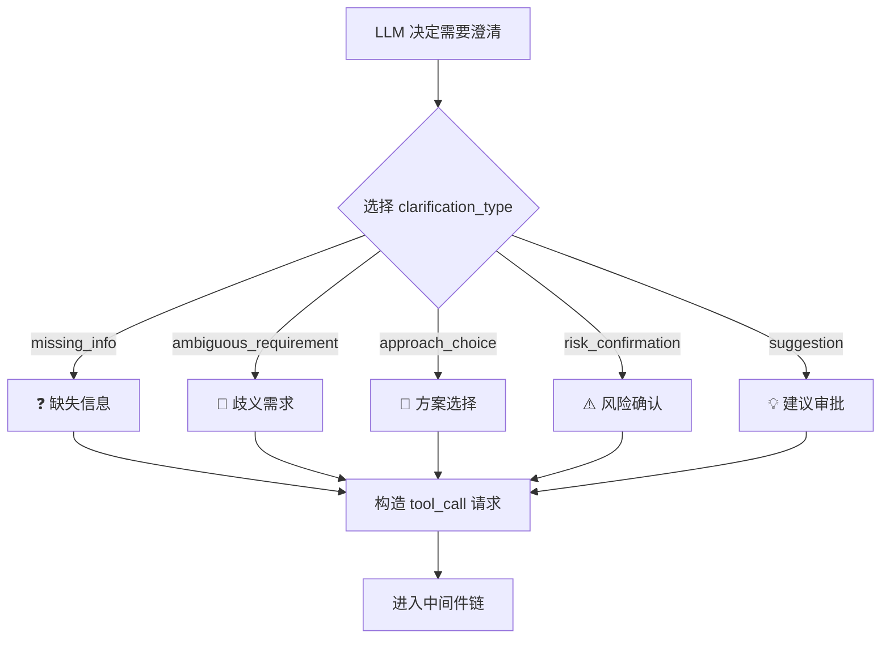
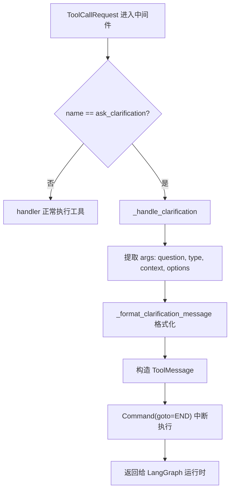

# PD-09.03 DeerFlow — ClarificationMiddleware 澄清中断方案

> 文档编号：PD-09.03
> 来源：DeerFlow `backend/src/agents/middlewares/clarification_middleware.py`
> GitHub：https://github.com/bytedance/deer-flow
> 问题域：PD-09 Human-in-the-Loop
> 状态：可复用方案

---

## 第 1 章 问题与动机（≥ 30 行）

### 1.1 核心问题

Agent 在执行任务时经常遇到信息不足、需求模糊或需要用户确认的场景。如果 Agent 自行猜测并继续执行，可能产生不可逆的错误结果（如删除错误文件、选择错误的技术方案）。因此需要一种机制让 Agent 能够：

1. **主动暂停执行**：在不确定时停下来，而不是带着假设继续
2. **结构化提问**：用类型化的澄清请求（缺失信息、歧义需求、方案选择、风险确认、建议审批）替代自由文本，便于前端渲染差异化 UI
3. **无阻塞中断**：不使用线程阻塞（如 `threading.Event`），而是利用 LangGraph 的 `Command(goto=END)` 实现协程级中断，支持状态持久化和多中断点扩展
4. **业务解耦**：澄清逻辑不应硬编码在业务节点中，而应作为横切关注点在中间件层统一处理

### 1.2 DeerFlow 的解法概述

DeerFlow 采用 **工具定义 + 中间件拦截 + LangGraph Command 中断** 的三层架构：

1. **工具层**：定义 `ask_clarification` 工具（`backend/src/tools/builtins/clarification_tool.py:6-55`），声明 5 种澄清类型的 Literal 枚举，工具体本身是空壳（placeholder），实际逻辑由中间件接管
2. **中间件层**：`ClarificationMiddleware`（`backend/src/agents/middlewares/clarification_middleware.py:20-173`）通过 `wrap_tool_call` 钩子拦截 `ask_clarification` 调用，格式化消息后返回 `Command(goto=END)` 中断执行
3. **Prompt 层**：系统提示词（`backend/src/agents/lead_agent/prompt.py:165-232`）用 `<clarification_system>` XML 块强制 CLARIFY→PLAN→ACT 优先级，确保 LLM 在不确定时先调用澄清工具
4. **前端层**：消息分组工具（`frontend/src/core/messages/utils.ts:224-226`）识别 `ask_clarification` 类型的 ToolMessage，创建独立的 `AssistantClarificationGroup` 用于突出显示
5. **容错层**：`DanglingToolCallMiddleware`（`backend/src/agents/middlewares/dangling_tool_call_middleware.py:22-74`）处理用户中断导致的悬挂工具调用，注入合成错误 ToolMessage 防止 LLM 格式错误

### 1.3 设计思想

| 设计原则 | 具体实现 | 理由 | 替代方案 |
|----------|----------|------|----------|
| 工具即接口 | `ask_clarification` 定义为 LangChain tool，LLM 通过 function calling 触发 | LLM 原生理解工具调用语义，无需特殊 token 或格式约定 | 特殊 stop token、自定义 output parser |
| 中间件拦截 | `wrap_tool_call` 钩子在工具执行前拦截 | 澄清逻辑与业务逻辑完全解耦，可独立开关 | 在每个 Agent 节点内 if-else 判断 |
| Command 中断 | `Command(goto=END)` 终止当前图执行 | 不阻塞线程，LangGraph 原生支持状态持久化和恢复 | `threading.Event.wait()`、`interrupt()` |
| 类型化澄清 | 5 种 Literal 枚举 + 类型图标映射 | 前端可按类型渲染不同 UI（选项列表、确认按钮等） | 自由文本 question 字段 |
| Prompt 强制 | `<clarification_system>` 块 + STRICT ENFORCEMENT 规则 | 防止 LLM 跳过澄清直接行动 | 仅靠工具描述引导（不够强） |

---

## 第 2 章 源码实现分析（≥ 60 行，核心章节）

### 2.1 架构概览

DeerFlow 的 Human-in-the-Loop 实现跨越后端中间件、工具定义、系统提示词和前端消息渲染四层：

```
┌─────────────────────────────────────────────────────────────┐
│                    System Prompt Layer                       │
│  <clarification_system> CLARIFY→PLAN→ACT 优先级强制         │
│  prompt.py:165-232                                          │
└──────────────────────────┬──────────────────────────────────┘
                           │ LLM 决定调用 ask_clarification
                           ▼
┌─────────────────────────────────────────────────────────────┐
│                    Tool Definition Layer                     │
│  ask_clarification_tool: 5 种 Literal 类型枚举              │
│  clarification_tool.py:6-55 (placeholder body)              │
└──────────────────────────┬──────────────────────────────────┘
                           │ tool_call 请求进入中间件链
                           ▼
┌─────────────────────────────────────────────────────────────┐
│                   Middleware Layer                           │
│  ClarificationMiddleware.wrap_tool_call()                   │
│  → 拦截 name=="ask_clarification"                           │
│  → _format_clarification_message() 格式化                   │
│  → Command(goto=END) 中断执行                               │
│  clarification_middleware.py:131-151                         │
└──────────────────────────┬──────────────────────────────────┘
                           │ ToolMessage + Command 返回前端
                           ▼
┌─────────────────────────────────────────────────────────────┐
│                    Frontend Layer                            │
│  isClarificationToolMessage() 检测                          │
│  → AssistantClarificationGroup 分组                         │
│  → MarkdownContent 渲染 + MessageCircleQuestionMarkIcon     │
│  utils.ts:224-226, message-list.tsx:68-79                   │
└─────────────────────────────────────────────────────────────┘
```

### 2.2 核心实现

#### 2.2.1 工具定义：类型化澄清接口



对应源码 `backend/src/tools/builtins/clarification_tool.py:6-55`：

```python
@tool("ask_clarification", parse_docstring=True, return_direct=True)
def ask_clarification_tool(
    question: str,
    clarification_type: Literal[
        "missing_info",
        "ambiguous_requirement",
        "approach_choice",
        "risk_confirmation",
        "suggestion",
    ],
    context: str | None = None,
    options: list[str] | None = None,
) -> str:
    """Ask the user for clarification when you need more information to proceed.
    ...
    """
    # Placeholder — actual logic handled by ClarificationMiddleware
    return "Clarification request processed by middleware"
```

关键设计：`return_direct=True` 标记告诉 LangGraph 该工具的返回值直接作为最终输出，配合中间件的 `Command(goto=END)` 实现执行流中断。工具体本身是空壳，5 种 `Literal` 类型通过 `parse_docstring=True` 自动生成 JSON Schema 供 LLM function calling 使用。

#### 2.2.2 中间件拦截：wrap_tool_call 钩子



对应源码 `backend/src/agents/middlewares/clarification_middleware.py:131-151`：

```python
@override
def wrap_tool_call(
    self,
    request: ToolCallRequest,
    handler: Callable[[ToolCallRequest], ToolMessage | Command],
) -> ToolMessage | Command:
    # Check if this is an ask_clarification tool call
    if request.tool_call.get("name") != "ask_clarification":
        # Not a clarification call, execute normally
        return handler(request)
    return self._handle_clarification(request)
```

`_handle_clarification` 方法（`clarification_middleware.py:91-129`）的核心逻辑：

```python
def _handle_clarification(self, request: ToolCallRequest) -> Command:
    args = request.tool_call.get("args", {})
    formatted_message = self._format_clarification_message(args)
    tool_call_id = request.tool_call.get("id", "")

    tool_message = ToolMessage(
        content=formatted_message,
        tool_call_id=tool_call_id,
        name="ask_clarification",
    )

    return Command(
        update={"messages": [tool_message]},
        goto=END,
    )
```

`Command(goto=END)` 是关键——它告诉 LangGraph 将 ToolMessage 写入状态后立即终止图执行，而不是继续下一个节点。用户响应后，LangGraph 从持久化状态恢复，用户消息作为新的 HumanMessage 追加到 messages 中，图从头开始新一轮执行。

#### 2.2.3 消息格式化：类型图标 + 选项列表

`_format_clarification_message`（`clarification_middleware.py:46-89`）将结构化参数转为用户友好的文本：

```python
type_icons = {
    "missing_info": "❓",
    "ambiguous_requirement": "🤔",
    "approach_choice": "🔀",
    "risk_confirmation": "⚠️",
    "suggestion": "💡",
}
icon = type_icons.get(clarification_type, "❓")

# 有 context 时先展示背景再提问
if context:
    message_parts.append(f"{icon} {context}")
    message_parts.append(f"\n{question}")
else:
    message_parts.append(f"{icon} {question}")

# 选项列表
if options and len(options) > 0:
    for i, option in enumerate(options, 1):
        message_parts.append(f"  {i}. {option}")
```

### 2.3 实现细节

#### 中间件注册顺序

`ClarificationMiddleware` 被放在中间件链的**最后一个**位置（`backend/src/agents/lead_agent/agent.py:233-234`）：

```python
# ClarificationMiddleware should always be last
middlewares.append(ClarificationMiddleware())
```

这确保了：
- `ThreadDataMiddleware` 已设置 thread_id（第 1 个）
- `DanglingToolCallMiddleware` 已修补悬挂调用（第 4 个）
- `SummarizationMiddleware` 已压缩上下文（第 5 个）
- 所有前置中间件的 `before_model` 钩子已执行完毕

#### 悬挂工具调用容错

当用户在 Agent 执行中途中断（如关闭页面），`DanglingToolCallMiddleware`（`dangling_tool_call_middleware.py:30-66`）在下次 model 调用前扫描消息历史，为缺少 ToolMessage 的 tool_call 注入合成错误响应：

```python
patches.append(
    ToolMessage(
        content="[Tool call was interrupted and did not return a result.]",
        tool_call_id=tc_id,
        name=tc.get("name", "unknown"),
        status="error",
    )
)
```

#### 前端消息分组

前端通过 `isClarificationToolMessage()`（`utils.ts:224-226`）识别澄清消息：

```typescript
export function isClarificationToolMessage(message: Message) {
  return message.type === "tool" && message.name === "ask_clarification";
}
```

在 `groupMessages()`（`utils.ts:48-63`）中，澄清消息被创建为独立的 `AssistantClarificationGroup`，在 `message-list.tsx:68-79` 中用 `MarkdownContent` 组件渲染，与普通工具调用的折叠卡片不同，澄清内容直接全文展示。

在 `message-group.tsx:396-403` 中，工具调用面板用 `MessageCircleQuestionMarkIcon` 图标和 "Need your help" 标签标识澄清请求。

#### 工具注册

`ask_clarification_tool` 作为 `BUILTIN_TOOLS` 的一部分（`tools.py:11-14`），始终可用，不受工具分组过滤影响：

```python
BUILTIN_TOOLS = [
    present_file_tool,
    ask_clarification_tool,
]
```

---

## 第 3 章 迁移指南（≥ 40 行）

### 3.1 迁移清单

**阶段 1：工具定义（1 个文件）**
- [ ] 创建 `ask_clarification` 工具，定义 `clarification_type` Literal 枚举
- [ ] 设置 `return_direct=True`，工具体为 placeholder
- [ ] 将工具注册到 Agent 的工具列表中

**阶段 2：中间件实现（1 个文件）**
- [ ] 实现 `ClarificationMiddleware`，继承 `AgentMiddleware`
- [ ] 在 `wrap_tool_call` 中拦截 `ask_clarification` 调用
- [ ] 实现消息格式化（类型图标 + 选项列表）
- [ ] 返回 `Command(goto=END)` 中断执行
- [ ] 同时实现 `awrap_tool_call` 异步版本

**阶段 3：中间件注册（修改 Agent 工厂）**
- [ ] 将 `ClarificationMiddleware` 添加到中间件链**末尾**
- [ ] 可选：添加 `DanglingToolCallMiddleware` 处理中断容错

**阶段 4：Prompt 工程（修改系统提示词）**
- [ ] 添加 `<clarification_system>` 块，强制 CLARIFY→PLAN→ACT 优先级
- [ ] 列出 5 种必须澄清的场景 + STRICT ENFORCEMENT 规则
- [ ] 提供使用示例

**阶段 5：前端适配（可选）**
- [ ] 实现 `isClarificationToolMessage()` 检测函数
- [ ] 在消息分组逻辑中创建独立的澄清消息组
- [ ] 用差异化 UI 渲染澄清内容（全文展示而非折叠卡片）

### 3.2 适配代码模板

#### 最小可用版本（纯后端，不依赖 LangGraph 中间件 API）

```python
"""Minimal clarification middleware for any LangGraph agent."""

from typing import Literal
from langchain.tools import tool
from langchain_core.messages import ToolMessage
from langgraph.graph import END
from langgraph.types import Command


# Step 1: 工具定义
@tool("ask_clarification", parse_docstring=True, return_direct=True)
def ask_clarification_tool(
    question: str,
    clarification_type: Literal[
        "missing_info", "ambiguous_requirement",
        "approach_choice", "risk_confirmation", "suggestion",
    ],
    context: str | None = None,
    options: list[str] | None = None,
) -> str:
    """Ask the user for clarification. Execution will be interrupted."""
    return "Handled by middleware"


# Step 2: 中间件（适配 LangGraph AgentMiddleware 接口）
TYPE_ICONS = {
    "missing_info": "❓",
    "ambiguous_requirement": "🤔",
    "approach_choice": "🔀",
    "risk_confirmation": "⚠️",
    "suggestion": "💡",
}


def format_clarification(args: dict) -> str:
    question = args.get("question", "")
    ctype = args.get("clarification_type", "missing_info")
    context = args.get("context")
    options = args.get("options", [])
    icon = TYPE_ICONS.get(ctype, "❓")

    parts = []
    if context:
        parts.append(f"{icon} {context}\n{question}")
    else:
        parts.append(f"{icon} {question}")
    if options:
        parts.append("")
        for i, opt in enumerate(options, 1):
            parts.append(f"  {i}. {opt}")
    return "\n".join(parts)


def handle_clarification_tool_call(tool_call: dict) -> Command | None:
    """Call this in your tool execution node to intercept clarification requests.

    Returns Command(goto=END) if it's a clarification call, None otherwise.
    """
    if tool_call.get("name") != "ask_clarification":
        return None

    args = tool_call.get("args", {})
    formatted = format_clarification(args)
    tool_message = ToolMessage(
        content=formatted,
        tool_call_id=tool_call.get("id", ""),
        name="ask_clarification",
    )
    return Command(update={"messages": [tool_message]}, goto=END)


# Step 3: 在 LangGraph 图的 tool node 中使用
def tool_node(state):
    """Example tool node that checks for clarification before executing."""
    last_message = state["messages"][-1]
    for tool_call in last_message.tool_calls:
        cmd = handle_clarification_tool_call(tool_call)
        if cmd is not None:
            return cmd
        # ... 正常执行其他工具
```

### 3.3 适用场景

| 场景 | 适用度 | 说明 |
|------|--------|------|
| LangGraph Agent 需要用户确认 | ⭐⭐⭐ | 原生 Command(goto=END) 支持，最佳适配 |
| 多步骤任务中的关键决策点 | ⭐⭐⭐ | 5 种类型覆盖常见决策场景 |
| 危险操作前的风险确认 | ⭐⭐⭐ | risk_confirmation 类型 + Prompt 强制 |
| 非 LangGraph 框架 | ⭐⭐ | 需要替换 Command 为框架对应的中断机制 |
| 纯 CLI Agent（无前端） | ⭐⭐ | 格式化消息可直接打印到终端，但失去类型化 UI |
| 批处理/无人值守场景 | ⭐ | 需要额外实现超时降级策略 |

---

## 第 4 章 测试用例（≥ 20 行）

```python
import pytest
from unittest.mock import MagicMock
from langgraph.graph import END
from langgraph.types import Command
from langchain_core.messages import ToolMessage


class TestClarificationMiddleware:
    """Tests for ClarificationMiddleware based on actual DeerFlow implementation."""

    def _make_request(self, name: str, args: dict, tool_call_id: str = "tc-001"):
        """Helper to create a mock ToolCallRequest."""
        request = MagicMock()
        request.tool_call = {"name": name, "args": args, "id": tool_call_id}
        return request

    def test_non_clarification_passes_through(self):
        """Non-clarification tool calls should be forwarded to handler."""
        from src.agents.middlewares.clarification_middleware import ClarificationMiddleware

        mw = ClarificationMiddleware()
        handler = MagicMock(return_value=ToolMessage(content="ok", tool_call_id="tc-001"))
        request = self._make_request("web_search", {"query": "test"})

        result = mw.wrap_tool_call(request, handler)
        handler.assert_called_once_with(request)
        assert isinstance(result, ToolMessage)

    def test_clarification_returns_command_goto_end(self):
        """ask_clarification should return Command(goto=END)."""
        from src.agents.middlewares.clarification_middleware import ClarificationMiddleware

        mw = ClarificationMiddleware()
        handler = MagicMock()
        request = self._make_request("ask_clarification", {
            "question": "Which environment?",
            "clarification_type": "approach_choice",
            "options": ["dev", "staging", "prod"],
        })

        result = mw.wrap_tool_call(request, handler)
        handler.assert_not_called()  # 不应执行原始 handler
        assert isinstance(result, Command)
        assert result.goto == END

    def test_formatted_message_contains_icon_and_options(self):
        """Formatted message should include type icon and numbered options."""
        from src.agents.middlewares.clarification_middleware import ClarificationMiddleware

        mw = ClarificationMiddleware()
        args = {
            "question": "Which DB?",
            "clarification_type": "approach_choice",
            "context": "Multiple databases available",
            "options": ["PostgreSQL", "MySQL", "SQLite"],
        }
        msg = mw._format_clarification_message(args)
        assert "🔀" in msg  # approach_choice icon
        assert "1. PostgreSQL" in msg
        assert "2. MySQL" in msg
        assert "3. SQLite" in msg
        assert "Multiple databases available" in msg

    def test_risk_confirmation_icon(self):
        """risk_confirmation type should use ⚠️ icon."""
        from src.agents.middlewares.clarification_middleware import ClarificationMiddleware

        mw = ClarificationMiddleware()
        args = {
            "question": "Delete all files in /tmp?",
            "clarification_type": "risk_confirmation",
        }
        msg = mw._format_clarification_message(args)
        assert "⚠️" in msg

    def test_tool_message_has_correct_name_and_id(self):
        """Returned ToolMessage should preserve tool_call_id and name."""
        from src.agents.middlewares.clarification_middleware import ClarificationMiddleware

        mw = ClarificationMiddleware()
        request = self._make_request("ask_clarification", {
            "question": "What format?",
            "clarification_type": "missing_info",
        }, tool_call_id="tc-xyz")

        result = mw._handle_clarification(request)
        assert isinstance(result, Command)
        tool_msg = result.update["messages"][0]
        assert tool_msg.tool_call_id == "tc-xyz"
        assert tool_msg.name == "ask_clarification"


class TestDanglingToolCallMiddleware:
    """Tests for dangling tool call recovery."""

    def test_injects_error_for_missing_tool_message(self):
        """Should inject synthetic error ToolMessage for dangling tool calls."""
        from src.agents.middlewares.dangling_tool_call_middleware import DanglingToolCallMiddleware
        from langchain_core.messages import AIMessage

        mw = DanglingToolCallMiddleware()
        ai_msg = AIMessage(content="", tool_calls=[{"id": "tc-001", "name": "ask_clarification", "args": {}}])
        state = {"messages": [ai_msg]}  # No corresponding ToolMessage

        result = mw._fix_dangling_tool_calls(state)
        assert result is not None
        assert len(result["messages"]) == 1
        assert result["messages"][0].status == "error"
        assert "interrupted" in result["messages"][0].content
```
