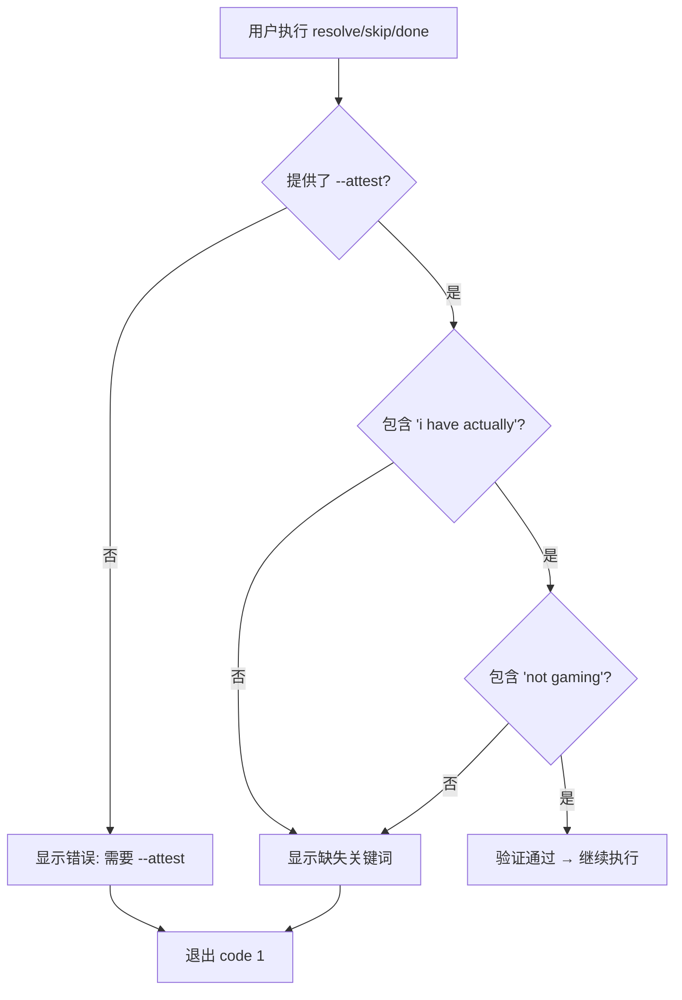
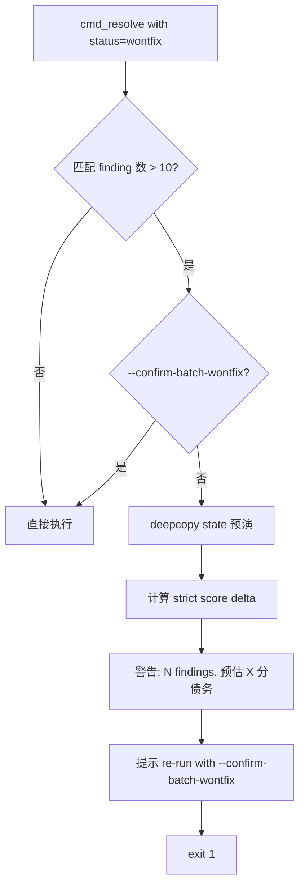
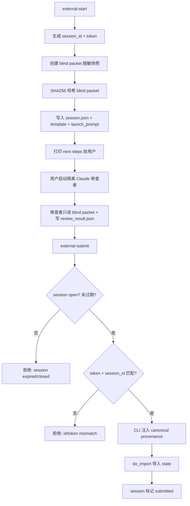

# PD-09.10 Desloppify — 四层 Attestation 反作弊与盲审会话协议

> 文档编号：PD-09.10
> 来源：Desloppify `desloppify/app/commands/resolve/selection.py`, `desloppify/app/commands/review/external.py`
> GitHub：https://github.com/peteromallet/desloppify.git
> 问题域：PD-09 Human-in-the-Loop
> 状态：可复用方案

---

## 第 1 章 问题与动机

### 1.1 核心问题

代码质量评分系统中，人工操作（resolve、wontfix、skip、ignore）直接影响分数。如果没有防护机制，用户可以通过批量 resolve 未修复的 finding 来"刷分"——分数上升但代码质量未改善。这是所有带评分的 HITL 系统的核心信任问题。

同时，外部审查（如让另一个 Claude 实例做盲审）需要保证审查者不受已有分数的锚定效应影响，审查结果的来源可追溯、不可篡改。

Desloppify 面对的 HITL 挑战可归纳为三个层面：
1. **反作弊**：如何阻止用户在不做实际修复的情况下提升分数
2. **盲审隔离**：如何确保外部审查者不受先验分数影响
3. **批量安全**：如何防止大规模 wontfix 操作意外引入技术债

### 1.2 Desloppify 的解法概述

1. **关键词 Attestation 机制**：所有分数影响操作必须提供包含 "I have actually" 和 "not gaming" 两个关键短语的自然语言声明（`selection.py:14`）
2. **四级风险分层**：temporary skip 无需 attestation → permanent/false_positive 需要 attestation → wontfix 额外需要 --note → 批量 wontfix >10 条需要 --confirm-batch-wontfix 二次确认（`override_handlers.py:93-114`）
3. **盲审会话协议**：external-start 创建带 TTL、token、SHA256 哈希的隔离会话，审查者只能看到脱敏的 blind packet（`external.py:244-371`）
4. **Provenance 注入**：CLI 层在 submit 时注入规范化来源元数据，审查者无法伪造 provenance（`external.py:374-429`）
5. **审计日志**：所有 attestation 记录到 state 的 `attestation_log` 和 `assessment_import_audit`，支持事后追溯

### 1.3 设计思想

| 设计原则 | 具体实现 | 理由 | 替代方案 |
|----------|----------|------|----------|
| 自然语言 attestation 优于 checkbox | 要求包含 "I have actually" + "not gaming" 的自由文本 | 强迫用户描述具体修改内容，比勾选框更难作弊 | 布尔 --confirm 标志（太容易绕过） |
| 风险分层而非一刀切 | 4 级确认强度：无→attestation→attestation+note→二次确认 | 低风险操作不打断流程，高风险操作层层设防 | 所有操作统一要求确认（用户体验差） |
| CLI 注入 provenance 而非信任审查者 | external-submit 时 CLI 覆盖 provenance 字段 | 审查者可能被篡改或伪造，CLI 是可信边界 | 信任审查者自报来源（不安全） |
| 会话 TTL + token 双重绑定 | session 有过期时间 + 随机 token 验证 | 防止过期会话被重放，token 防止跨会话冒用 | 仅用 session_id（可预测） |
| 批量操作预估影响 | wontfix >10 条时计算 strict score delta 并警告 | 让用户在确认前看到分数影响，知情决策 | 直接执行不警告（可能意外引入大量技术债） |

---

## 第 2 章 源码实现分析

### 2.1 架构概览

Desloppify 的 HITL 系统分布在三个命令层：resolve（解决 finding）、plan（管理工作队列）、review（外部审查）。核心防护逻辑集中在 attestation 验证和会话管理两个模块。

```
┌─────────────────────────────────────────────────────────────────┐
│                        CLI 命令层                                │
│  ┌──────────┐  ┌──────────────┐  ┌───────────────────────────┐  │
│  │ resolve  │  │ plan skip/   │  │ review --external-start/  │  │
│  │ --attest │  │ done --attest│  │ --external-submit         │  │
│  └────┬─────┘  └──────┬───────┘  └─────────────┬─────────────┘  │
│       │               │                        │                │
│  ┌────▼───────────────▼────┐  ┌────────────────▼──────────────┐ │
│  │  Attestation Validator  │  │  External Session Manager     │ │
│  │  (selection.py)         │  │  (external.py)                │ │
│  │  • keyword check        │  │  • TTL + token                │ │
│  │  • batch wontfix gate   │  │  • blind packet + SHA256      │ │
│  │  • score delta preview  │  │  • provenance injection       │ │
│  └────┬────────────────────┘  └────────────────┬──────────────┘ │
│       │                                        │                │
│  ┌────▼────────────────────────────────────────▼──────────────┐ │
│  │                    State Layer                              │ │
│  │  • resolve_findings() with attestation                     │ │
│  │  • attestation_log / assessment_import_audit               │ │
│  │  • score_snapshot() for before/after comparison            │ │
│  └────────────────────────────────────────────────────────────┘ │
└─────────────────────────────────────────────────────────────────┘
```

### 2.2 核心实现

#### 2.2.1 Attestation 关键词验证



对应源码 `desloppify/app/commands/resolve/selection.py:14-65`：

```python
_REQUIRED_ATTESTATION_PHRASES = ("i have actually", "not gaming")
_ATTESTATION_KEYWORD_HINT = ("I have actually", "not gaming")

def _missing_attestation_keywords(attestation: str | None) -> list[str]:
    normalized = " ".join((attestation or "").strip().lower().split())
    return [
        phrase for phrase in _REQUIRED_ATTESTATION_PHRASES if phrase not in normalized
    ]

def validate_attestation(attestation: str | None) -> bool:
    return not _missing_attestation_keywords(attestation)

def show_attestation_requirement(
    label: str,
    attestation: str | None,
    example: str,
) -> None:
    missing = _missing_attestation_keywords(attestation)
    if not attestation:
        _emit_warning(f"{label} requires --attest.")
    elif missing:
        missing_str = ", ".join(f"'{keyword}'" for keyword in missing)
        _emit_warning(
            f"{label} attestation is missing required keyword(s): {missing_str}."
        )
    _emit_warning(
        f"Required keywords: '{_ATTESTATION_KEYWORD_HINT[0]}' and '{_ATTESTATION_KEYWORD_HINT[1]}'."
    )
    print(colorize(f'Example: --attest "{example}"', "dim"), file=sys.stderr)
```

ATTEST_EXAMPLE 常量定义在 `desloppify/engine/_work_queue/helpers.py:20-23`：

```python
ATTEST_EXAMPLE = (
    "I have actually [DESCRIBE THE CONCRETE CHANGE YOU MADE] "
    "and I am not gaming the score by resolving without fixing."
)
```

#### 2.2.2 批量 Wontfix 安全阀



对应源码 `desloppify/app/commands/resolve/selection.py:101-149`：

```python
def _estimate_wontfix_strict_delta(
    state: dict,
    args: argparse.Namespace,
    *,
    attestation: str | None,
    resolve_all_patterns_fn,
) -> float:
    """Estimate strict score drop if this resolve command is applied as wontfix."""
    before = state_mod.get_strict_score(state)
    if before is None:
        return 0.0
    preview_state = copy.deepcopy(state)
    resolve_all_patterns_fn(preview_state, args, attestation=attestation)
    after = state_mod.get_strict_score(preview_state)
    if after is None:
        return 0.0
    return max(0.0, before - after)

def _enforce_batch_wontfix_confirmation(
    state: dict,
    args: argparse.Namespace,
    *,
    attestation: str | None,
    resolve_all_patterns_fn,
) -> None:
    if args.status != "wontfix":
        return
    preview_count = _preview_resolve_count(state, args.patterns)
    if preview_count <= 10:
        return
    if getattr(args, "confirm_batch_wontfix", False):
        return
    strict_delta = _estimate_wontfix_strict_delta(
        state, args,
        attestation=attestation,
        resolve_all_patterns_fn=resolve_all_patterns_fn,
    )
    _emit_warning(f"Large wontfix batch detected ({preview_count} findings).")
    if strict_delta > 0:
        _emit_warning(f"Estimated strict-score debt added now: {strict_delta:.1f} points.")
    _emit_warning("Re-run with --confirm-batch-wontfix if this debt is intentional.")
    sys.exit(1)
```

#### 2.2.3 盲审会话协议



对应源码 `desloppify/app/commands/review/external.py:244-371`（do_external_start）：

```python
def do_external_start(args, state, lang, *, config: dict[str, Any] | None = None) -> None:
    """Start an external review session with CLI-issued provenance context."""
    # ... runner validation, TTL check ...
    packet, packet_path, blind_path = _prepare_packet_snapshot(args, state, lang, config=config)
    packet_hash = runner_helpers_mod.sha256_file(blind_path)

    now = _utc_now()
    expires = now + timedelta(hours=ttl_hours)
    session_id = _session_id()       # ext_{timestamp}_{random_hex}
    token = secrets.token_hex(16)     # 128-bit random token
    session_dir = _session_dir(session_id)
    session_dir.mkdir(parents=True, exist_ok=True)

    session_payload = {
        "session_id": session_id,
        "status": "open",
        "runner": runner,
        "created_at": _iso_seconds(now),
        "expires_at": _iso_seconds(expires),
        "ttl_hours": ttl_hours,
        "token": token,
        "attest": EXTERNAL_ATTEST_TEXT,
        "packet_path": str(packet_path),
        "blind_packet_path": str(blind_path),
        "packet_sha256": packet_hash,
        # ... template, instructions, launch prompt paths ...
    }
```

Provenance 注入（`external.py:374-429`）：

```python
def _canonical_external_payload(
    raw_payload: dict[str, Any],
    *,
    session: dict[str, Any],
) -> dict[str, Any]:
    """Return import payload with canonical provenance and required session token."""
    # Validate session_id + token match
    payload_id = str(session_meta.get("id", "")).strip()
    payload_token = str(session_meta.get("token", "")).strip()
    if payload_id != expected_id or payload_token != expected_token:
        # ... exit with mismatch error ...

    payload = dict(raw_payload)
    payload.pop("session", None)
    payload.pop("provenance", None)  # 审查者不能自定义 provenance
    payload["provenance"] = {
        "kind": "blind_review_batch_import",
        "blind": True,
        "runner": str(session.get("runner", "claude")),
        "run_stamp": str(session.get("session_id", "")),
        "created_at": _iso_seconds(_utc_now()),
        "packet_path": str(session.get("blind_packet_path", "")),
        "packet_sha256": str(session.get("packet_sha256", "")),
        "external_session_id": expected_id,
    }
    return payload
```

### 2.3 实现细节

**四级风险分层的完整路径**（`override_handlers.py:72-157`）：

| 操作 | 风险等级 | 需要 attestation | 需要 note | 需要二次确认 | 影响分数 |
|------|----------|-----------------|-----------|-------------|---------|
| plan skip（temporary） | 低 | ✗ | ✗ | ✗ | ✗ |
| plan skip --permanent | 高 | ✓ | ✓ | ✗ | ✓（wontfix） |
| plan skip --false-positive | 高 | ✓ | ✗ | ✗ | ✓（false_positive） |
| plan done | 高 | ✓ | 可选 | ✗ | ✓（fixed） |
| resolve --status wontfix | 高 | ✓ | ✓ | >10 条时 ✓ | ✓ |
| ignore --pattern | 高 | ✓ | ✗ | ✗ | ✓ |

**Plan 命令的人工控制能力**（`plan/cmd.py:69-133`）：

- `plan show`：查看队列状态、skip 统计、cluster 聚焦
- `plan move --position top/bottom/up/down`：人工重排优先级
- `plan focus <cluster>`：聚焦到特定 cluster 只处理子集
- `plan skip/unskip`：暂时或永久跳过 finding
- `plan done`：标记修复完成（委托给 resolve）
- `plan describe/note`：为 finding 添加人工注释

**外部审查的 attestation 文本**（`external.py:31-33`）：

```python
EXTERNAL_ATTEST_TEXT = (
    "I validated this review was completed without awareness of overall score and is unbiased."
)
```

这与 resolve 的 attestation 不同——外部审查要求声明"不知道总分且无偏见"，而 resolve 要求声明"做了实际修改且不是刷分"。两种 attestation 针对不同的信任威胁。

---

## 第 3 章 迁移指南

### 3.1 迁移清单

**阶段 1：Attestation 验证器（1 个文件）**
- [ ] 定义 `REQUIRED_PHRASES` 常量和 `ATTEST_EXAMPLE` 模板
- [ ] 实现 `validate_attestation()` 关键词检查
- [ ] 实现 `show_attestation_requirement()` 错误提示

**阶段 2：风险分层（集成到现有命令）**
- [ ] 为每个分数影响操作添加 `--attest` 参数
- [ ] 按风险等级决定哪些操作需要 attestation
- [ ] 实现批量操作的 preview + 二次确认

**阶段 3：盲审会话（可选，适合有外部审查需求的系统）**
- [ ] 实现 session 创建（ID + token + TTL + blind packet）
- [ ] 实现 session 提交（token 验证 + provenance 注入）
- [ ] 实现 session 过期检查

### 3.2 适配代码模板

```python
"""Attestation validator — 可直接复用的反作弊模块。"""
from __future__ import annotations
import sys
from dataclasses import dataclass

REQUIRED_PHRASES: tuple[str, ...] = ("i have actually", "not gaming")
ATTEST_EXAMPLE = (
    "I have actually [DESCRIBE THE CONCRETE CHANGE YOU MADE] "
    "and I am not gaming the score by resolving without fixing."
)

def missing_keywords(attestation: str | None) -> list[str]:
    """Return list of missing required phrases."""
    normalized = " ".join((attestation or "").strip().lower().split())
    return [p for p in REQUIRED_PHRASES if p not in normalized]

def validate(attestation: str | None) -> bool:
    return not missing_keywords(attestation)

def require_attestation(label: str, attestation: str | None) -> None:
    """Validate attestation or exit with helpful error."""
    if validate(attestation):
        return
    missing = missing_keywords(attestation)
    if not attestation:
        print(f"Error: {label} requires --attest.", file=sys.stderr)
    else:
        print(f"Error: missing keyword(s): {', '.join(missing)}", file=sys.stderr)
    print(f'Example: --attest "{ATTEST_EXAMPLE}"', file=sys.stderr)
    sys.exit(1)

@dataclass(frozen=True)
class BatchGuard:
    """Batch operation safety valve."""
    threshold: int = 10

    def check(
        self,
        count: int,
        *,
        confirmed: bool = False,
        score_delta: float = 0.0,
    ) -> None:
        if count <= self.threshold or confirmed:
            return
        print(f"Warning: large batch ({count} items).", file=sys.stderr)
        if score_delta > 0:
            print(f"Estimated score debt: {score_delta:.1f} points.", file=sys.stderr)
        print("Re-run with --confirm-batch to proceed.", file=sys.stderr)
        sys.exit(1)
```

```python
"""Blind review session — 可直接复用的盲审会话模块。"""
from __future__ import annotations
import hashlib
import json
import secrets
from datetime import UTC, datetime, timedelta
from pathlib import Path

def create_session(
    blind_packet: dict,
    *,
    ttl_hours: int = 24,
    session_dir: Path,
) -> dict:
    """Create a blind review session with token + TTL."""
    now = datetime.now(UTC)
    session_id = f"ext_{now.strftime('%Y%m%d_%H%M%S')}_{secrets.token_hex(4)}"
    token = secrets.token_hex(16)

    blind_path = session_dir / session_id / "blind_packet.json"
    blind_path.parent.mkdir(parents=True, exist_ok=True)
    blind_path.write_text(json.dumps(blind_packet, indent=2))

    packet_hash = hashlib.sha256(blind_path.read_bytes()).hexdigest()

    session = {
        "session_id": session_id,
        "status": "open",
        "token": token,
        "created_at": now.isoformat(),
        "expires_at": (now + timedelta(hours=ttl_hours)).isoformat(),
        "packet_sha256": packet_hash,
        "blind_packet_path": str(blind_path),
    }
    session_path = session_dir / session_id / "session.json"
    session_path.write_text(json.dumps(session, indent=2))
    return session

def submit_session(
    session: dict,
    reviewer_output: dict,
) -> dict:
    """Validate and inject canonical provenance into reviewer output."""
    if session["status"] != "open":
        raise ValueError(f"Session not open: {session['status']}")
    expires = datetime.fromisoformat(session["expires_at"])
    if datetime.now(UTC) > expires:
        raise ValueError("Session expired")

    meta = reviewer_output.get("session", {})
    if meta.get("id") != session["session_id"] or meta.get("token") != session["token"]:
        raise ValueError("Session id/token mismatch")

    payload = dict(reviewer_output)
    payload.pop("session", None)
    payload.pop("provenance", None)
    payload["provenance"] = {
        "kind": "blind_review",
        "blind": True,
        "session_id": session["session_id"],
        "packet_sha256": session["packet_sha256"],
        "submitted_at": datetime.now(UTC).isoformat(),
    }
    return payload
```

### 3.3 适用场景

| 场景 | 适用度 | 说明 |
|------|--------|------|
| 代码质量评分系统 | ⭐⭐⭐ | 核心场景：防止 resolve 刷分 |
| CI/CD 审批流水线 | ⭐⭐⭐ | 危险操作（部署、回滚）需要 attestation |
| Agent 自主修复系统 | ⭐⭐ | Agent 标记 "已修复" 时需要人工 attestation |
| 外部代码审查 | ⭐⭐⭐ | 盲审会话协议直接适用 |
| 简单 TODO 管理 | ⭐ | 过度设计，checkbox 即可 |

---

## 第 4 章 测试用例

```python
"""Tests for attestation validation and blind review session."""
import copy
import json
import secrets
from datetime import UTC, datetime, timedelta
from pathlib import Path
from unittest.mock import patch

import pytest


# --- Attestation Tests ---

REQUIRED_PHRASES = ("i have actually", "not gaming")

def _missing_keywords(attestation: str | None) -> list[str]:
    normalized = " ".join((attestation or "").strip().lower().split())
    return [p for p in REQUIRED_PHRASES if p not in normalized]

def _validate(attestation: str | None) -> bool:
    return not _missing_keywords(attestation)


class TestAttestationValidation:
    """Tests for keyword-based attestation validation."""

    def test_valid_attestation_passes(self):
        text = "I have actually fixed the null check and I am not gaming the score."
        assert _validate(text) is True

    def test_missing_both_keywords_fails(self):
        assert _validate("just resolving this") is False
        assert set(_missing_keywords("just resolving this")) == {"i have actually", "not gaming"}

    def test_missing_one_keyword_fails(self):
        assert _validate("I have actually fixed it") is False
        assert _missing_keywords("I have actually fixed it") == ["not gaming"]

    def test_none_attestation_fails(self):
        assert _validate(None) is False

    def test_empty_string_fails(self):
        assert _validate("") is False
        assert _validate("   ") is False

    def test_case_insensitive(self):
        assert _validate("I HAVE ACTUALLY done work and NOT GAMING") is True

    def test_extra_whitespace_normalized(self):
        assert _validate("I  have   actually   done  work  not   gaming") is True


class TestBatchWontfixGuard:
    """Tests for batch wontfix confirmation gate."""

    def test_small_batch_passes_without_confirmation(self):
        """Batches <= 10 should not require --confirm-batch-wontfix."""
        # Simulates _enforce_batch_wontfix_confirmation logic
        count = 5
        threshold = 10
        assert count <= threshold  # No exit

    def test_large_batch_without_confirmation_blocked(self):
        """Batches > 10 without --confirm-batch-wontfix should be blocked."""
        count = 15
        threshold = 10
        confirmed = False
        assert count > threshold and not confirmed  # Would exit(1)

    def test_large_batch_with_confirmation_passes(self):
        """Batches > 10 with --confirm-batch-wontfix should proceed."""
        count = 15
        confirmed = True
        assert confirmed  # Passes through

    def test_score_delta_estimation(self):
        """Score delta should be non-negative."""
        before = 85.0
        after = 78.5
        delta = max(0.0, before - after)
        assert delta == pytest.approx(6.5)

    def test_non_wontfix_status_skips_check(self):
        """Only wontfix status triggers batch confirmation."""
        for status in ("fixed", "open", "false_positive"):
            assert status != "wontfix"  # Guard skipped


class TestBlindReviewSession:
    """Tests for external blind review session protocol."""

    def _make_session(self, tmp_path: Path, *, ttl_hours: int = 24) -> dict:
        now = datetime.now(UTC)
        session_id = f"ext_test_{secrets.token_hex(4)}"
        token = secrets.token_hex(16)
        return {
            "session_id": session_id,
            "status": "open",
            "token": token,
            "created_at": now.isoformat(),
            "expires_at": (now + timedelta(hours=ttl_hours)).isoformat(),
            "packet_sha256": "abc123",
        }

    def test_valid_submit_injects_provenance(self, tmp_path):
        session = self._make_session(tmp_path)
        reviewer_output = {
            "session": {"id": session["session_id"], "token": session["token"]},
            "assessments": {"quality": 80},
            "findings": [],
        }
        # Simulate _canonical_external_payload
        payload = dict(reviewer_output)
        payload.pop("session", None)
        payload["provenance"] = {
            "kind": "blind_review_batch_import",
            "blind": True,
            "session_id": session["session_id"],
            "packet_sha256": session["packet_sha256"],
        }
        assert payload["provenance"]["blind"] is True
        assert "session" not in payload

    def test_token_mismatch_rejected(self, tmp_path):
        session = self._make_session(tmp_path)
        reviewer_output = {
            "session": {"id": session["session_id"], "token": "wrong_token"},
        }
        assert reviewer_output["session"]["token"] != session["token"]

    def test_expired_session_rejected(self, tmp_path):
        session = self._make_session(tmp_path, ttl_hours=0)
        # Force expiry
        session["expires_at"] = (datetime.now(UTC) - timedelta(hours=1)).isoformat()
        expires = datetime.fromisoformat(session["expires_at"])
        assert datetime.now(UTC) > expires

    def test_closed_session_rejected(self, tmp_path):
        session = self._make_session(tmp_path)
        session["status"] = "submitted"
        assert session["status"] != "open"

    def test_provenance_cannot_be_forged(self, tmp_path):
        """Reviewer-supplied provenance is stripped and replaced by CLI."""
        session = self._make_session(tmp_path)
        reviewer_output = {
            "session": {"id": session["session_id"], "token": session["token"]},
            "provenance": {"kind": "forged", "blind": False},
            "assessments": {},
            "findings": [],
        }
        payload = dict(reviewer_output)
        payload.pop("provenance", None)
        payload["provenance"] = {"kind": "blind_review_batch_import", "blind": True}
        assert payload["provenance"]["kind"] == "blind_review_batch_import"
        assert payload["provenance"]["blind"] is True
```

---

## 第 5 章 跨域关联

| 关联域 | 关系类型 | 说明 |
|--------|----------|------|
| PD-07 质量检查 | 强依赖 | Attestation 是质量评分系统的信任基础；review --external-start 本身就是质量检查流程 |
| PD-06 记忆持久化 | 协同 | attestation_log 和 assessment_import_audit 是持久化的审计记录 |
| PD-11 可观测性 | 协同 | 所有 attestation 操作写入 query log，支持成本和操作追踪 |
| PD-10 中间件管道 | 互补 | Desloppify 用 CLI 命令分发而非中间件管道，但 attestation 验证逻辑可抽象为中间件 |
| PD-03 容错与重试 | 协同 | 批量 wontfix 的 deepcopy 预演是一种"dry-run 容错"——先模拟再执行 |

---

## 第 6 章 来源文件索引

| 文件 | 行范围 | 关键实现 |
|------|--------|----------|
| `desloppify/app/commands/resolve/selection.py` | L14-L149 | Attestation 验证 + 批量 wontfix 安全阀 |
| `desloppify/app/commands/resolve/cmd.py` | L58-L159 | resolve 命令主流程 + attestation 集成 |
| `desloppify/app/commands/resolve/apply.py` | L30-L60 | 模式匹配 + cluster 展开 + state 写入 |
| `desloppify/app/commands/review/external.py` | L244-L553 | 盲审会话创建 + 提交 + provenance 注入 |
| `desloppify/app/commands/plan/override_handlers.py` | L72-L313 | skip/unskip/done/focus 人工控制 |
| `desloppify/app/commands/plan/cmd.py` | L69-L133 | plan 命令分发器 |
| `desloppify/app/commands/plan/move_handlers.py` | L14-L41 | 队列优先级重排 |
| `desloppify/engine/_work_queue/helpers.py` | L20-L23 | ATTEST_EXAMPLE 常量 |
| `desloppify/app/commands/review/import_cmd.py` | L132-L334 | 审查结果导入 + 审计日志 |

---

## 第 7 章 横向对比维度

```json comparison_data
{
  "project": "Desloppify",
  "dimensions": {
    "暂停机制": "CLI 命令式暂停：用户主动执行 resolve/skip/done 命令触发确认，非自动 interrupt",
    "澄清类型": "关键词 attestation：要求自然语言包含 'I have actually' + 'not gaming' 两个短语",
    "状态持久化": "JSON state 文件持久化 attestation_log + assessment_import_audit 审计链",
    "实现层级": "CLI 命令层：attestation 验证在 argparse handler 中，非中间件或图节点",
    "身份绑定": "session token 绑定：128-bit 随机 token + session_id 双重验证防重放",
    "审查粒度控制": "四级风险分层：temporary(无)→permanent(attest+note)→batch(二次确认)→external(盲审token)",
    "dry-run 模式": "deepcopy 预演：批量 wontfix 前 deepcopy state 计算 strict score delta",
    "自动跳过机制": "temporary skip 支持 review_after 参数，N 次扫描后自动 resurface",
    "命令分发模式": "plan action 分发器：cmd_plan 按 plan_action 字符串分发到独立 handler 函数",
    "多轮交互支持": "plan describe/note 支持多轮注释，skip→unskip→reopen 支持状态反转",
    "操作边界声明": "ATTEST_EXAMPLE 模板显式要求用户描述具体修改内容，不允许空泛声明",
    "反作弊评分保护": "wontfix 计入 strict score 债务，批量 >10 条强制预估分数影响",
    "盲审隔离协议": "blind packet + SHA256 哈希 + TTL 过期 + CLI 注入 provenance 四重保护",
    "审计追溯链": "attestation_log + assessment_import_audit + query log 三层审计记录"
  }
}
```

```json domain_metadata
{
  "solution_summary": "Desloppify 用关键词 attestation + 四级风险分层 + blind packet 盲审会话协议实现反作弊 HITL，所有分数影响操作需自然语言声明且不可绕过",
  "description": "评分系统中人工操作的反作弊信任机制与外部盲审隔离协议",
  "sub_problems": [
    "反作弊 attestation 设计：如何用关键词检查而非 checkbox 强制用户描述具体修改",
    "批量操作分数影响预估：大规模 wontfix 前 deepcopy 预演计算 strict score delta",
    "盲审 provenance 注入：CLI 层覆盖审查者自报来源，确保来源不可伪造",
    "skip 自动 resurface：temporary skip 设置 review_after 扫描次数后自动回到队列",
    "外部审查 attestation 差异化：resolve 要求 'not gaming'，external 要求 'without awareness' + 'unbiased'"
  ],
  "best_practices": [
    "自然语言 attestation 优于 checkbox：要求包含特定短语的自由文本，强迫用户描述具体行为",
    "风险分层确认：按操作影响程度分 4 级确认强度，低风险不打断流程",
    "批量操作 deepcopy 预演：执行前在副本上模拟，展示分数影响后再让用户决策",
    "CLI 层 provenance 注入：不信任外部审查者的自报来源，由可信 CLI 覆盖写入",
    "session TTL + token 双重绑定：防止过期重放和跨会话冒用"
  ]
}
```
