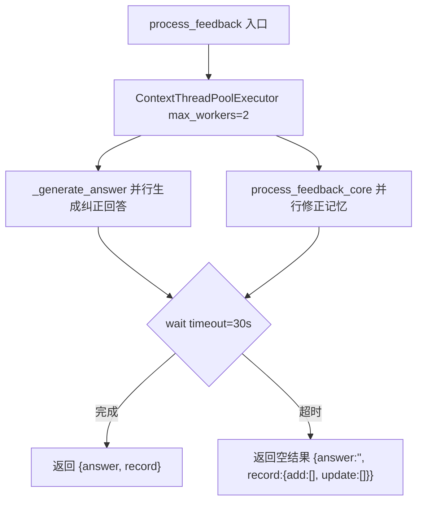
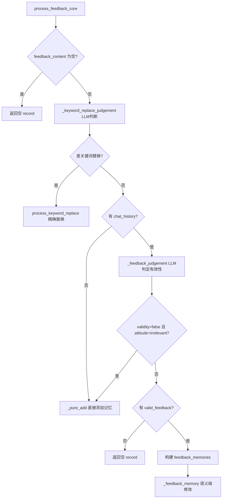
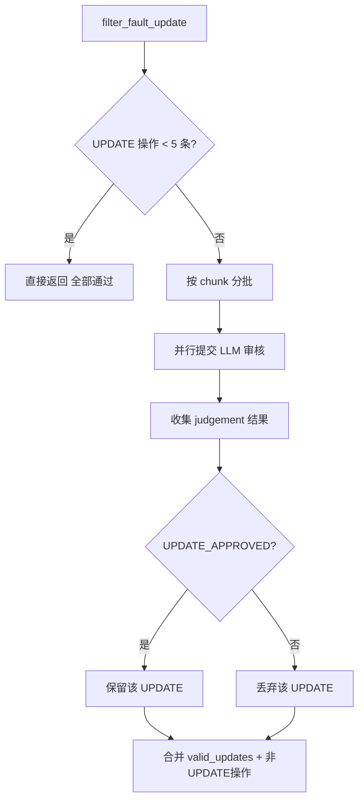

# PD-09.NN MemOS — LLM 反馈判定驱动记忆修正

> 文档编号：PD-09.NN
> 来源：MemOS `src/memos/mem_feedback/feedback.py`
> GitHub：https://github.com/MemTensor/MemOS.git
> 问题域：PD-09 Human-in-the-Loop
> 状态：可复用方案

---

## 第 1 章 问题与动机

### 1.1 核心问题

在记忆增强型 AI 系统中，AI 基于已有记忆生成回答，但记忆可能过时、错误或不完整。用户发现回答有误时，需要一种机制让用户反馈直接修正底层记忆，而非仅仅修正当次回答。这是 Human-in-the-Loop 在记忆系统中的核心应用场景：**用户反馈不只是对话层面的纠错，而是知识层面的持久化修正**。

传统 HITL 方案聚焦于"暂停-确认-继续"的工作流控制，而 MemOS 的 MemFeedback 模块解决的是一个更深层的问题：如何将用户的自然语言反馈转化为对结构化记忆的精确增删改操作。

### 1.2 MemOS 的解法概述

1. **LLM 驱动的反馈有效性判定**：通过 `_feedback_judgement` 方法（`feedback.py:196`），用 LLM 分析用户反馈的有效性（validity）、用户态度（satisfied/dissatisfied/irrelevant），以及提取纠正后的事实信息（corrected_info）
2. **双模式反馈处理**：先用 `_keyword_replace_judgement`（`feedback.py:177`）判断是否为关键词替换请求，是则走精确替换路径 `process_keyword_replace`；否则走语义级修改路径 `semantics_feedback`
3. **LLM 二次审核安全阀**：当 UPDATE 操作超过 5 条时，`filter_fault_update`（`feedback.py:747`）用 LLM 对每条 UPDATE 做 APPROVED/REJECTED 判定，防止 LLM 幻觉导致的错误批量修改
4. **ID 去幻觉机制**：`standard_operations`（`feedback.py:793`）用 difflib 模糊匹配修正 LLM 输出中可能错误的记忆 ID，防止操作指向不存在的记忆
5. **并发反馈处理**：`process_feedback`（`feedback.py:1154`）用 `ContextThreadPoolExecutor` 并行执行答案生成和记忆修正，30 秒超时保护

### 1.3 设计思想

| 设计原则 | 具体实现 | 理由 | 替代方案 |
|----------|----------|------|----------|
| 反馈先分类再处理 | 关键词替换 vs 语义修改双路径 | 关键词替换是精确操作，不需要 LLM 语义理解 | 统一走语义路径（成本高、精度低） |
| LLM-as-Judge 多级审核 | judgement → compare → compare_judge 三级 LLM 调用 | 单次 LLM 判断不可靠，多级审核降低幻觉风险 | 规则引擎硬编码（灵活性差） |
| 修改比例安全阀 | `should_keep_update` 按文本长度动态调整修改比例阈值 | 防止 LLM 生成与原文完全不同的"更新" | 固定阈值（不适应不同长度文本） |
| 边修改边归档 | UPDATE 操作不删除旧记忆，而是标记 `status: archived` | 保留修改历史，支持回溯 | 直接覆盖（丢失历史） |
| 双语 Prompt 适配 | 每个 LLM 调用都有 en/zh 两套 Prompt | 中英文语义理解差异大，分开优化效果更好 | 统一英文 Prompt（中文场景效果差） |

---

## 第 2 章 源码实现分析

### 2.1 架构概览

MemOS 的反馈系统由 4 层组成：API 层接收请求 → SingleCubeView 路由到同步/异步模式 → MemFeedback 核心处理 → GraphStore 持久化。

```
┌─────────────────────────────────────────────────────────────────┐
│                     API Layer (FastAPI)                          │
│  FeedbackHandler.handle_feedback_memories()                     │
│  → APIFeedbackRequest (Pydantic 校验)                           │
└──────────────────────┬──────────────────────────────────────────┘
                       │
┌──────────────────────▼──────────────────────────────────────────┐
│                  SingleCubeView                                  │
│  feedback_memories() → async: 提交到 MemScheduler               │
│                      → sync:  直接调用 process_feedback          │
└──────────────────────┬──────────────────────────────────────────┘
                       │
┌──────────────────────▼──────────────────────────────────────────┐
│                  MemFeedback Core                                │
│  ┌─────────────────┐  ┌──────────────────────┐                  │
│  │ _keyword_replace │  │ _feedback_judgement   │                  │
│  │ _judgement()     │  │ (LLM 有效性判定)      │                  │
│  └────────┬────────┘  └──────────┬───────────┘                  │
│           │                      │                               │
│  ┌────────▼────────┐  ┌─────────▼────────────┐                  │
│  │ process_keyword  │  │ semantics_feedback    │                  │
│  │ _replace()       │  │ (LLM 语义级修改)      │                  │
│  └────────┬────────┘  └─────────┬────────────┘                  │
│           │                      │                               │
│           │            ┌─────────▼────────────┐                  │
│           │            │ filter_fault_update   │                  │
│           │            │ (LLM 二次审核)        │                  │
│           │            └─────────┬────────────┘                  │
│           └──────────┬───────────┘                               │
│                      │                                           │
│           ┌──────────▼───────────┐                               │
│           │ _single_add/update   │                               │
│           │ _operation()         │                               │
│           └──────────┬───────────┘                               │
└──────────────────────┼──────────────────────────────────────────┘
                       │
┌──────────────────────▼──────────────────────────────────────────┐
│              PolarDB GraphStore                                  │
│  add_node / update_node / delete_node / search_by_embedding     │
└─────────────────────────────────────────────────────────────────┘
```

### 2.2 核心实现

#### 2.2.1 反馈入口与并发处理



对应源码 `src/memos/mem_feedback/feedback.py:1154-1217`：
```python
def process_feedback(
    self,
    user_id: str,
    user_name: str,
    chat_history: list[MessageDict],
    feedback_content: str,
    info: dict[str, Any] | None = None,
    **kwargs,
):
    corrected_answer = kwargs.get("corrected_answer", False)

    with ContextThreadPoolExecutor(max_workers=2) as ex:
        answer_future = ex.submit(
            self._generate_answer,
            chat_history,
            feedback_content,
            corrected_answer=corrected_answer,
        )
        core_future = ex.submit(
            self.process_feedback_core,
            user_id, user_name, chat_history,
            feedback_content, info, **kwargs,
        )
        _done, pending = concurrent.futures.wait(
            [answer_future, core_future], timeout=30
        )
        for fut in pending:
            fut.cancel()
```

#### 2.2.2 核心处理流程：双路径分发



对应源码 `src/memos/mem_feedback/feedback.py:1029-1098`：
```python
def process_feedback_core(self, user_id, user_name, chat_history,
                          feedback_content, info=None, **kwargs) -> dict:
    if feedback_content.strip() == "":
        return {"record": {"add": [], "update": []}}
    # 第一步：关键词替换判断
    kwp_judge = self._keyword_replace_judgement(feedback_content)
    if (kwp_judge and kwp_judge["if_keyword_replace"].lower() == "true"
        and kwp_judge.get("original", "NONE") != "NONE"
        and kwp_judge.get("target", "NONE") != "NONE"):
        return self.process_keyword_replace(user_id, user_name,
                                            kwp_judge=kwp_judge, info=info)
    # 第二步：LLM 有效性判定
    if not chat_history:
        return self._pure_add(user_name, feedback_content, feedback_time, info)
    else:
        raw_judge = self._feedback_judgement(
            chat_history, feedback_content, feedback_time=feedback_time)
        valid_feedback = [item for item in raw_judge if check_validity(item)]
        if (raw_judge and raw_judge[0]["validity"].lower() == "false"
            and raw_judge[0]["user_attitude"].lower() == "irrelevant"):
            return self._pure_add(user_name, feedback_content, feedback_time, info)
```

#### 2.2.3 LLM 二次审核安全阀



对应源码 `src/memos/mem_feedback/feedback.py:747-791`：
```python
def filter_fault_update(self, operations: list[dict]):
    updated_operations = [item for item in operations
                          if item["operation"] == "UPDATE"]
    if len(updated_operations) < 5:
        return operations

    lang = detect_lang("".join(updated_operations[0]["text"]))
    template = FEEDBACK_PROMPT_DICT["compare_judge"][lang]

    all_judge = []
    operations_chunks = general_split_into_chunks(updated_operations)
    with ContextThreadPoolExecutor(max_workers=10) as executor:
        future_to_chunk_idx = {}
        for chunk in operations_chunks:
            raw_operations_str = {"operations": chunk}
            prompt = template.format(raw_operations=str(raw_operations_str))
            future = executor.submit(self._get_llm_response, prompt,
                                     load_type="bracket")
            future_to_chunk_idx[future] = chunk
        for future in concurrent.futures.as_completed(future_to_chunk_idx):
            judge_res = future.result()
            if (judge_res and "operations_judgement" in judge_res):
                all_judge.extend(judge_res["operations_judgement"])

    id2op = {item["id"]: item for item in updated_operations}
    valid_updates = []
    for judge in all_judge:
        if judge["judgement"] == "UPDATE_APPROVED":
            valid_update = id2op.get(judge["id"], None)
            if valid_update:
                valid_updates.append(valid_update)
    return valid_updates + [item for item in operations
                            if item["operation"] != "UPDATE"]
```

### 2.3 实现细节

#### ID 去幻觉（De-hallucination）

LLM 在输出 UPDATE 操作时可能生成错误的记忆 ID。`standard_operations`（`feedback.py:793-880`）用三级策略修正：

1. 精确匹配：`original_id in right_ids`
2. 大小写容错：`lower_id in right_lower_map`
3. 模糊匹配：`difflib.get_close_matches(original_id, right_ids, n=1, cutoff=0.8)`

#### 修改比例安全阀

`should_keep_update`（`utils.py:30-60`）根据文本长度动态调整阈值：
- 短文本（< 200 tokens）：修改比例 < 70% 才允许
- 长文本（≥ 200 tokens）：修改比例 < 20% 才允许
- 完全相同（change_ratio = 0）：拒绝（无意义更新）

#### 边修改边归档

`_single_update_operation`（`feedback.py:265-330`）对 WorkingMemory 直接原地更新，对 LongTermMemory 则新增一条 + 旧记忆标记 `status: archived`，通过 `covered_history` 字段建立版本链。

#### 异步/同步双模式

`SingleCubeView.feedback_memories`（`single_cube.py:170-200`）支持两种模式：
- `async`：序列化请求后提交到 `MemScheduler` 的 Redis Stream 队列
- `sync`：直接调用 `process_feedback`，阻塞等待结果

---

## 第 3 章 迁移指南

### 3.1 迁移清单

**阶段 1：基础反馈判定（1 个文件）**
- [ ] 实现 `FeedbackJudge` 类，封装 LLM 反馈有效性判定
- [ ] 定义 `FeedbackJudgement` 数据模型（validity, user_attitude, corrected_info, key, tags）
- [ ] 编写中英文 Prompt 模板

**阶段 2：双路径处理（2 个文件）**
- [ ] 实现关键词替换路径：LLM 判断 → 全文检索 → 批量替换
- [ ] 实现语义修改路径：检索相关记忆 → LLM 比较 → ADD/UPDATE/NONE 决策

**阶段 3：安全机制（集成到现有文件）**
- [ ] 实现 `should_keep_update` 修改比例安全阀
- [ ] 实现 `filter_fault_update` LLM 二次审核（UPDATE ≥ 5 条时触发）
- [ ] 实现 ID 去幻觉（精确匹配 → 大小写容错 → difflib 模糊匹配）

**阶段 4：归档与版本链**
- [ ] 记忆更新时旧记忆标记 `status: archived`
- [ ] 新记忆通过 `covered_history` 字段指向旧记忆 ID

### 3.2 适配代码模板

以下是一个可独立运行的反馈判定模块，不依赖 MemOS 的 GraphStore：

```python
import json
import re
from dataclasses import dataclass
from enum import Enum
from typing import Any, Callable


class UserAttitude(str, Enum):
    SATISFIED = "satisfied"
    DISSATISFIED = "dissatisfied"
    IRRELEVANT = "irrelevant"


@dataclass
class FeedbackJudgement:
    validity: bool
    user_attitude: UserAttitude
    corrected_info: str
    key: str
    tags: list[str]


FEEDBACK_JUDGEMENT_PROMPT = """You are a feedback analysis expert.
Analyze the chat history and user feedback:

Chat History:
{chat_history}

User Feedback:
{user_feedback}

Output JSON:
[{{"validity": "true/false", "user_attitude": "dissatisfied/satisfied/irrelevant",
   "corrected_info": "factual statement", "key": "2-5 word title",
   "tags": ["tag1", "tag2"]}}]"""


class FeedbackJudge:
    def __init__(self, llm_call: Callable[[str], str]):
        self.llm_call = llm_call

    def judge(self, chat_history: list[dict], feedback: str) -> list[FeedbackJudgement]:
        history_str = "\n".join(
            f"{msg['role']}: {msg['content']}" for msg in chat_history[-4:]
        )
        prompt = FEEDBACK_JUDGEMENT_PROMPT.format(
            chat_history=history_str, user_feedback=feedback
        )
        raw = self.llm_call(prompt)
        # 清理 LLM 输出中的 markdown 标记
        cleaned = re.sub(r"```json?\s*", "", raw).replace("```", "")
        items = json.loads(cleaned)
        return [
            FeedbackJudgement(
                validity=item["validity"].lower() == "true",
                user_attitude=UserAttitude(item["user_attitude"].lower()),
                corrected_info=item["corrected_info"],
                key=item["key"],
                tags=item["tags"],
            )
            for item in items
        ]


def should_keep_update(new_text: str, old_text: str) -> bool:
    """MemOS 的修改比例安全阀，防止 LLM 生成完全不同的'更新'。"""
    old_chars = set(old_text)
    new_chars = set(new_text)
    if not old_chars and not new_chars:
        return False
    intersection = len(old_chars & new_chars)
    union = len(old_chars | new_chars)
    similarity = intersection / union if union > 0 else 0.0
    change_ratio = 1 - similarity
    if change_ratio == 0:
        return False  # 完全相同，无意义更新
    token_estimate = len(old_text.split())
    if token_estimate < 200:
        return change_ratio < 0.7
    return change_ratio < 0.2
```

### 3.3 适用场景

| 场景 | 适用度 | 说明 |
|------|--------|------|
| 记忆增强型聊天机器人 | ⭐⭐⭐ | 核心场景：用户纠正 AI 基于记忆的错误回答 |
| 知识库纠错系统 | ⭐⭐⭐ | 用户反馈驱动知识条目的增删改 |
| 个性化推荐系统 | ⭐⭐ | 用户反馈修正偏好记录（MemOS 已支持 preference 记忆） |
| 实时对话系统（无记忆） | ⭐ | 无持久化记忆则无需此机制 |
| 批量数据清洗 | ⭐ | 关键词替换路径可复用，但语义路径成本过高 |

---

## 第 4 章 测试用例

```python
import pytest
from unittest.mock import MagicMock, patch


class TestFeedbackJudgement:
    """测试 _feedback_judgement 的 LLM 判定逻辑"""

    def test_dissatisfied_feedback_extracts_corrected_info(self):
        """用户纠正错误回答时，应提取纠正后的事实"""
        mock_llm_response = json.dumps([{
            "validity": "true",
            "user_attitude": "dissatisfied",
            "corrected_info": "User is allergic to seafood",
            "key": "dietary restrictions",
            "tags": ["allergic", "seafood"]
        }])
        judge = FeedbackJudge(llm_call=lambda _: mock_llm_response)
        results = judge.judge(
            chat_history=[
                {"role": "user", "content": "What food should I avoid?"},
                {"role": "assistant", "content": "You can eat anything!"},
            ],
            feedback="No! I'm allergic to seafood!"
        )
        assert len(results) == 1
        assert results[0].validity is True
        assert results[0].user_attitude == UserAttitude.DISSATISFIED
        assert "seafood" in results[0].corrected_info

    def test_irrelevant_feedback_marked_invalid(self):
        """无关反馈应标记为 irrelevant"""
        mock_llm_response = json.dumps([{
            "validity": "false",
            "user_attitude": "irrelevant",
            "corrected_info": "",
            "key": "",
            "tags": []
        }])
        judge = FeedbackJudge(llm_call=lambda _: mock_llm_response)
        results = judge.judge(
            chat_history=[{"role": "user", "content": "Tell me about Python"}],
            feedback="What's the weather today?"
        )
        assert results[0].validity is False
        assert results[0].user_attitude == UserAttitude.IRRELEVANT


class TestShouldKeepUpdate:
    """测试修改比例安全阀"""

    def test_identical_text_rejected(self):
        """完全相同的文本应拒绝更新"""
        assert should_keep_update("hello world", "hello world") is False

    def test_small_change_on_short_text_accepted(self):
        """短文本的小幅修改应接受"""
        assert should_keep_update("hello world!", "hello world") is True

    def test_large_change_on_long_text_rejected(self):
        """长文本的大幅修改应拒绝"""
        old = "This is a very long text " * 50
        new = "Completely different content " * 50
        assert should_keep_update(new, old) is False


class TestKeywordReplaceJudgement:
    """测试关键词替换判定"""

    def test_keyword_replace_detected(self):
        """明确的替换请求应被识别"""
        mock_response = json.dumps({
            "if_keyword_replace": "true",
            "doc_scope": "NONE",
            "original": "Homepage",
            "target": "Front Page"
        })
        # 模拟 _keyword_replace_judgement 的行为
        result = json.loads(mock_response)
        assert result["if_keyword_replace"] == "true"
        assert result["original"] == "Homepage"
        assert result["target"] == "Front Page"

    def test_non_replace_feedback_rejected(self):
        """非替换反馈应返回 false"""
        mock_response = json.dumps({
            "if_keyword_replace": "false",
            "doc_scope": None,
            "original": None,
            "target": None
        })
        result = json.loads(mock_response)
        assert result["if_keyword_replace"] == "false"


class TestStandardOperations:
    """测试 ID 去幻觉和操作标准化"""

    def test_id_case_insensitive_match(self):
        """ID 大小写不敏感匹配"""
        right_ids = ["abc-123-DEF"]
        right_lower_map = {x.lower(): x for x in right_ids}
        test_id = "ABC-123-def"
        assert test_id.lower() in right_lower_map
        assert right_lower_map[test_id.lower()] == "abc-123-DEF"

    def test_update_takes_precedence_over_add(self):
        """有 UPDATE 时应跳过 ADD 操作"""
        operations = [
            {"operation": "UPDATE", "id": "mem-1", "text": "new", "old_memory": "old"},
            {"operation": "ADD", "text": "something new"},
        ]
        has_update = any(op["operation"].lower() == "update" for op in operations)
        assert has_update is True
        # MemOS 逻辑：有 update 时过滤掉 add
        filtered = [op for op in operations if op["operation"].lower() != "add"]
        assert len(filtered) == 1
        assert filtered[0]["operation"] == "UPDATE"
```

---

## 第 5 章 跨域关联

| 关联域 | 关系类型 | 说明 |
|--------|----------|------|
| PD-01 上下文管理 | 协同 | `_feedback_judgement` 只取 `chat_history[-4:]` 最近 4 条消息，是上下文窗口管理的体现；`split_into_chunks` 按 500 token 分块也是上下文控制 |
| PD-03 容错与重试 | 依赖 | `_embed_once` 用 `@retry(stop=stop_after_attempt(4))` 指数退避重试；`_retry_db_operation` 对数据库操作做 3 次重试；`process_feedback` 有 30 秒超时保护 |
| PD-06 记忆持久化 | 强依赖 | 反馈的最终效果是修改持久化记忆（GraphStore 的 add_node/update_node），归档机制（`status: archived` + `covered_history`）是记忆版本管理的一部分 |
| PD-07 质量检查 | 协同 | `filter_fault_update` 是 LLM-as-Judge 模式的质量检查，`should_keep_update` 是规则引擎质量检查，两者互补 |
| PD-08 搜索与检索 | 依赖 | `_retrieve` 方法用向量搜索 + 全文检索定位相关记忆；`process_keyword_replace` 用 TF-IDF/fulltext/LIKE 三级检索策略 |
| PD-12 推理增强 | 协同 | 三级 LLM 调用链（judgement → compare → compare_judge）本身就是推理增强的实践，通过多轮 LLM 推理提高决策质量 |

---

## 第 6 章 来源文件索引

| 文件 | 行范围 | 关键实现 |
|------|--------|----------|
| `src/memos/mem_feedback/feedback.py` | L67-100 | `MemFeedback.__init__` — 初始化 LLM、Embedder、GraphStore、MemoryManager |
| `src/memos/mem_feedback/feedback.py` | L177-219 | `_keyword_replace_judgement` + `_feedback_judgement` — LLM 双路径判定 |
| `src/memos/mem_feedback/feedback.py` | L265-330 | `_single_update_operation` — 记忆更新 + 归档机制 |
| `src/memos/mem_feedback/feedback.py` | L418-546 | `semantics_feedback` — 语义级记忆修改核心逻辑 |
| `src/memos/mem_feedback/feedback.py` | L747-880 | `filter_fault_update` + `standard_operations` — 安全阀 + ID 去幻觉 |
| `src/memos/mem_feedback/feedback.py` | L929-1027 | `process_keyword_replace` — 关键词替换路径 |
| `src/memos/mem_feedback/feedback.py` | L1029-1152 | `process_feedback_core` — 核心处理流程 |
| `src/memos/mem_feedback/feedback.py` | L1154-1217 | `process_feedback` — 入口方法，并发处理 |
| `src/memos/mem_feedback/base.py` | L1-16 | `BaseMemFeedback` — 抽象基类定义 |
| `src/memos/mem_feedback/utils.py` | L30-60 | `should_keep_update` — 修改比例安全阀 |
| `src/memos/mem_feedback/utils.py` | L95-152 | `split_into_chunks` + `make_mem_item` — 分块与记忆构建 |
| `src/memos/api/product_models.py` | L718-760 | `APIFeedbackRequest` — 反馈 API 请求模型 |
| `src/memos/multi_mem_cube/single_cube.py` | L170-200 | `SingleCubeView.feedback_memories` — 同步/异步路由 |
| `src/memos/templates/mem_feedback_prompts.py` | L1-55 | `KEYWORDS_REPLACE` — 关键词替换 Prompt |
| `src/memos/templates/mem_feedback_prompts.py` | L117-216 | `FEEDBACK_JUDGEMENT_PROMPT` — 反馈有效性判定 Prompt |

---

## 第 7 章 横向对比维度

```json comparison_data
{
  "project": "MemOS",
  "dimensions": {
    "暂停机制": "无显式暂停，反馈通过独立 API 端点异步提交，不中断对话流",
    "澄清类型": "LLM 判定三类态度（dissatisfied/satisfied/irrelevant），非枚举式澄清",
    "状态持久化": "GraphStore 持久化，旧记忆 archived + covered_history 版本链",
    "实现层级": "独立 MemFeedback 模块，与对话引擎解耦，通过 SingleCubeView 路由",
    "审查粒度控制": "LLM 三级审核链：judgement → compare → compare_judge，≥5 条 UPDATE 触发二次审核",
    "自动跳过机制": "validity=false 且 attitude=irrelevant 时自动跳过修改，降级为纯添加",
    "多轮交互支持": "单轮反馈模式，取 chat_history[-4:] 作为上下文，不支持多轮反馈对话",
    "反馈分类路由": "关键词替换 vs 语义修改双路径，LLM 自动分类路由",
    "ID去幻觉": "三级策略：精确匹配→大小写容错→difflib模糊匹配(cutoff=0.8)",
    "修改比例安全阀": "短文本<70%、长文本<20%的动态阈值，防止LLM生成完全不同的更新"
  }
}
```

### 域元数据补充

```json domain_metadata
{
  "solution_summary": "MemOS 用 LLM 三级审核链（judgement→compare→compare_judge）判定用户反馈有效性，支持关键词替换和语义修改双路径，通过 ID 去幻觉和修改比例安全阀防止 LLM 幻觉导致的错误记忆修改",
  "description": "用户反馈不仅是对话纠错，更是对持久化记忆的增删改操作",
  "sub_problems": [
    "反馈有效性判定：用户反馈是纠正、补充还是无关内容的自动分类",
    "LLM 输出 ID 幻觉：LLM 生成的记忆 ID 可能不存在，需要去幻觉修正",
    "修改比例失控：LLM 可能生成与原文完全不同的'更新'，需要比例安全阀",
    "关键词替换 vs 语义修改路由：同一反馈入口需自动分流到精确替换或语义理解路径",
    "批量 UPDATE 审核：多条更新操作时 LLM 幻觉风险累积，需二次审核机制"
  ],
  "best_practices": [
    "LLM 多级审核优于单次判定：judgement→compare→compare_judge 三级链降低幻觉风险",
    "修改比例动态阈值：短文本允许更大修改幅度，长文本严格限制，防止语义漂移",
    "归档而非删除：旧记忆标记 archived 而非物理删除，covered_history 建立版本链支持回溯",
    "ID 去幻觉三级策略：精确匹配→大小写容错→模糊匹配，逐级放宽容忍度"
  ]
}
```
