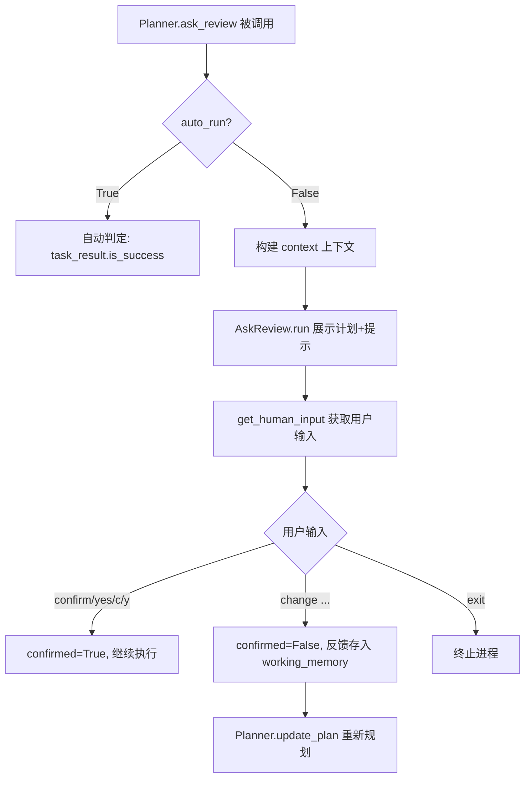
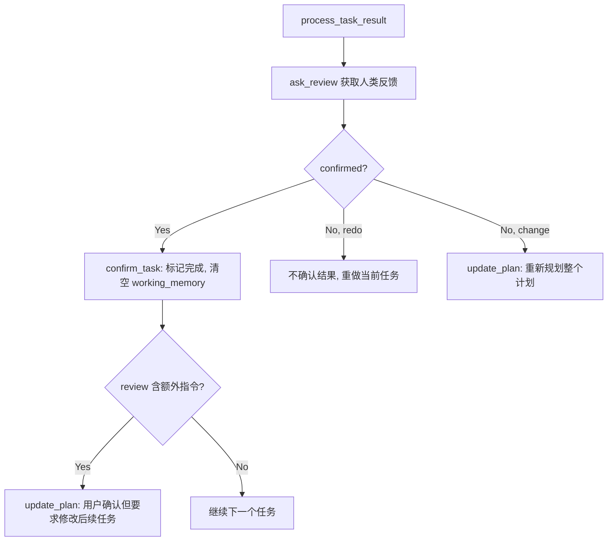
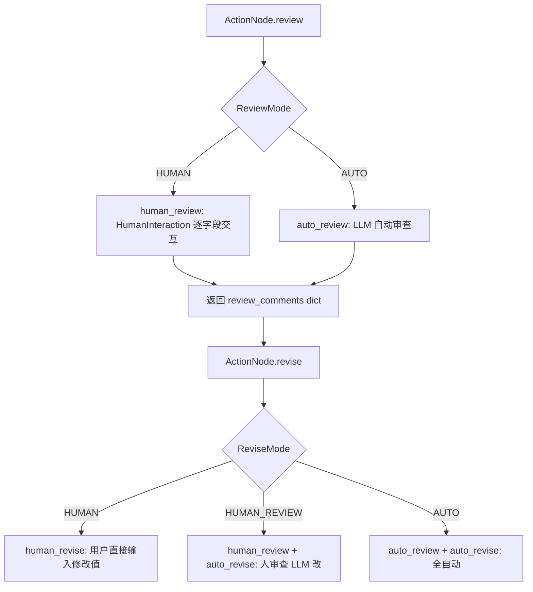

# PD-09.08 MetaGPT — 三层人机交互审查系统

> 文档编号：PD-09.08
> 来源：MetaGPT `metagpt/strategy/planner.py` `metagpt/actions/action_node.py` `metagpt/provider/human_provider.py`
> GitHub：https://github.com/FoundationAgents/MetaGPT.git
> 问题域：PD-09 Human-in-the-Loop
> 状态：可复用方案

---

## 第 1 章 问题与动机（≥ 30 行）

### 1.1 核心问题

在多 Agent 协作的软件工程框架中，Agent 自主执行的结果往往需要人类确认才能继续推进。MetaGPT 面临三个层次的人机交互需求：

1. **计划级审查**：Agent 生成的任务计划是否合理？用户可能需要修改、增删任务
2. **任务级审查**：每个任务执行完毕后，结果是否符合预期？用户可能要求重做或修改后续计划
3. **节点级审查**：ActionNode 产出的结构化内容（如设计文档、代码审查意见）是否准确？用户可能需要逐字段修改

传统做法是在每个需要人工介入的地方硬编码 `input()` 调用，但这导致：
- 交互逻辑与业务逻辑耦合
- 无法在不同环境（CLI/Web/API）间切换输入源
- 无法在自动模式和人工模式间灵活切换
- 结构化数据的人工修改缺乏类型校验

### 1.2 MetaGPT 的解法概述

MetaGPT 设计了一套三层人机交互体系，每层解决不同粒度的审查需求：

1. **Planner.ask_review** — 计划/任务级审查：在 `plan_and_act` 模式下，每次生成计划或完成任务后暂停等待人类确认，支持 confirm/change/redo/exit 四种响应（`metagpt/strategy/planner.py:119-141`）
2. **ActionNode ReviewMode/ReviseMode** — 节点级审查：通过枚举模式（HUMAN/AUTO/HUMAN_REVIEW）控制每个 ActionNode 的审查和修订策略，支持逐字段交互式修改（`metagpt/actions/action_node.py:32-40`）
3. **HumanProvider** — LLM 替换层：将人类包装为 BaseLLM 接口的实现，任何使用 LLM 的地方都可以无缝替换为人类输入（`metagpt/provider/human_provider.py:14-57`）
4. **可插拔输入源** — `set_human_input_func` 允许运行时替换人类输入的获取方式，默认为 `input()`，可替换为 WebSocket/API 回调（`metagpt/logs.py:110-112, 148`）
5. **auto_run 开关** — 全局控制是否跳过人工审查，`auto_run=True` 时以代码执行成功与否自动判定（`metagpt/strategy/planner.py:63, 131-141`）

### 1.3 设计思想

| 设计原则 | 具体实现 | 理由 | 替代方案 |
|----------|----------|------|----------|
| 分层审查 | Planner(计划级) + ActionNode(节点级) + HumanProvider(LLM级) | 不同粒度的审查需求用不同机制，避免一刀切 | 统一审查中间件（但粒度不够灵活） |
| 模式枚举 | ReviewMode.HUMAN/AUTO, ReviseMode.HUMAN/HUMAN_REVIEW/AUTO | 编译时确定审查策略，避免运行时字符串判断 | 配置文件驱动（但缺乏类型安全） |
| LLM 接口统一 | HumanProvider 实现 BaseLLM 的 ask/aask 接口 | 人类和 LLM 可互换，Role.is_human=True 即切换 | 独立的 HumanAgent 类（但需要修改所有调用方） |
| 输入源可插拔 | set_human_input_func 全局替换 _get_human_input | 一处修改，所有人机交互点自动生效 | 依赖注入到每个组件（但侵入性太强） |
| 自动/手动双模式 | auto_run 布尔开关控制是否跳过人工 | 开发调试时自动运行，生产环境人工审查 | 环境变量控制（但不够灵活） |

---

## 第 2 章 源码实现分析（≥ 60 行，核心章节）

### 2.1 架构概览

MetaGPT 的人机交互体系分布在三个层次，从上到下分别是计划编排层、动作节点层和 LLM 提供者层：

```
┌─────────────────────────────────────────────────────────┐
│                    Role._plan_and_act()                  │
│  ┌──────────────┐    ┌──────────────┐    ┌───────────┐  │
│  │ update_plan  │───→│ _act_on_task │───→│ process_  │  │
│  │  (生成计划)   │    │  (执行任务)   │    │task_result│  │
│  └──────┬───────┘    └──────────────┘    └─────┬─────┘  │
│         │                                       │        │
│         ▼                                       ▼        │
│  ┌──────────────────────────────────────────────────┐   │
│  │           Planner.ask_review()                    │   │
│  │  auto_run=False → AskReview Action → 人类输入     │   │
│  │  auto_run=True  → 自动判定 is_success             │   │
│  └──────────────────────────────────────────────────┘   │
├─────────────────────────────────────────────────────────┤
│                    ActionNode 层                         │
│  ┌────────────┐  ┌──────────────┐  ┌────────────────┐  │
│  │ ReviewMode │  │  ReviseMode  │  │ HumanInteract  │  │
│  │ HUMAN/AUTO │  │ HUMAN/H_REV/ │  │ ion 逐字段交互  │  │
│  │            │  │ AUTO         │  │                 │  │
│  └────────────┘  └──────────────┘  └────────────────┘  │
├─────────────────────────────────────────────────────────┤
│                   LLM Provider 层                        │
│  ┌──────────────────────────────────────────────────┐   │
│  │  HumanProvider(BaseLLM)                           │   │
│  │  Role.is_human=True → self.llm = HumanProvider    │   │
│  └──────────────────────────────────────────────────┘   │
├─────────────────────────────────────────────────────────┤
│                   输入源抽象层                            │
│  ┌──────────────────────────────────────────────────┐   │
│  │  logs._get_human_input = input  (默认)             │   │
│  │  set_human_input_func(custom_func) → 替换输入源    │   │
│  └──────────────────────────────────────────────────┘   │
└─────────────────────────────────────────────────────────┘
```

### 2.2 核心实现

#### 2.2.1 Planner.ask_review — 计划/任务级审查



对应源码 `metagpt/strategy/planner.py:119-141`：
```python
async def ask_review(
    self,
    task_result: TaskResult = None,
    auto_run: bool = None,
    trigger: str = ReviewConst.TASK_REVIEW_TRIGGER,
    review_context_len: int = 5,
):
    auto_run = auto_run if auto_run is not None else self.auto_run
    if not auto_run:
        context = self.get_useful_memories()
        review, confirmed = await AskReview().run(
            context=context[-review_context_len:], plan=self.plan, trigger=trigger
        )
        if not confirmed:
            self.working_memory.add(Message(content=review, role="user", cause_by=AskReview))
        return review, confirmed
    confirmed = task_result.is_success if task_result else True
    return "", confirmed
```

关键设计点：
- `review_context_len=5` 限制传给人类的上下文长度，避免信息过载（`planner.py:124`）
- 未确认的反馈被存入 `working_memory`，在下次 `update_plan` 时作为 LLM 输入，实现"人类反馈→LLM 重新规划"闭环（`planner.py:138`）
- `trigger` 参数区分 task review 和 code review 两种审查场景，展示不同的提示文本（`ask_review.py:41-45`）

#### 2.2.2 process_task_result — 三路分支处理



对应源码 `metagpt/strategy/planner.py:102-117`：
```python
async def process_task_result(self, task_result: TaskResult):
    review, task_result_confirmed = await self.ask_review(task_result)

    if task_result_confirmed:
        await self.confirm_task(self.current_task, task_result, review)
    elif "redo" in review:
        pass  # simply pass, not confirming the result
    else:
        await self.update_plan()
```

这里的 `confirm_task` 还有一个精妙设计（`planner.py:148-153`）：如果用户输入 "confirm, but change task 3 to ..."，系统会同时确认当前任务并触发计划更新，实现"确认+修改"的复合操作。

#### 2.2.3 ActionNode 双模式审查/修订



对应源码 `metagpt/actions/action_node.py:665-670, 752-758`：
```python
async def human_review(self) -> dict[str, str]:
    review_comments = HumanInteraction().interact_with_instruct_content(
        instruct_content=self.instruct_content, interact_type="review"
    )
    return review_comments

async def human_revise(self) -> dict[str, str]:
    review_contents = HumanInteraction().interact_with_instruct_content(
        instruct_content=self.instruct_content,
        mapping=self.get_mapping(mode="auto"),
        interact_type="revise"
    )
    self.update_instruct_content(review_contents)
    return review_contents
```

`ReviseMode.HUMAN_REVIEW` 是一个混合模式（`action_node.py:775-776`）：人类提供审查意见，LLM 根据意见自动修改内容。这比纯人工修改效率更高，又比纯自动修改更可控。

### 2.3 实现细节

#### HumanInteraction 类型校验机制

`HumanInteraction.check_input_type`（`metagpt/utils/human_interaction.py:29-47`）在用户输入修改值时，动态创建 Pydantic 模型进行类型校验：

```python
def check_input_type(self, input_str: str, req_type: Type) -> Tuple[bool, Any]:
    check_ret = True
    if req_type == str:
        return check_ret, input_str
    try:
        data = json.loads(input_str.strip())
    except Exception:
        return False, None
    actionnode_class = import_class("ActionNode", "metagpt.actions.action_node")
    tmp_cls = actionnode_class.create_model_class(
        class_name="TMP", mapping={"tmp": (req_type, ...)}
    )
    try:
        _ = tmp_cls(**{"tmp": data})
    except Exception:
        check_ret = False
    return check_ret, data
```

这确保了人类输入的修改值必须符合 ActionNode 定义的字段类型，避免类型不匹配导致下游错误。

#### 可插拔输入源

`metagpt/logs.py:148` 定义了默认输入源：
```python
_get_human_input = input  # get human input from console by default
```

`set_human_input_func`（`logs.py:110-112`）允许运行时替换：
```python
def set_human_input_func(func):
    global _get_human_input
    _get_human_input = func
```

`get_human_input`（`logs.py:86-91`）同时支持同步和异步函数：
```python
async def get_human_input(prompt: str = ""):
    if inspect.iscoroutinefunction(_get_human_input):
        return await _get_human_input(prompt)
    else:
        return _get_human_input(prompt)
```

#### HumanProvider — 人类即 LLM

`metagpt/provider/human_provider.py:14-28` 将人类包装为 LLM 接口：
```python
class HumanProvider(BaseLLM):
    """Humans provide themselves as a 'model', which actually takes in
    human input as its response."""

    def ask(self, msg: str, timeout=USE_CONFIG_TIMEOUT) -> str:
        rsp = input(msg)
        if rsp in ["exit", "quit"]:
            exit()
        return rsp

    async def aask(self, msg: str, ...) -> str:
        return self.ask(msg, timeout=self.get_timeout(timeout))
```

通过 `Role.is_human = True`（`metagpt/roles/role.py:135, 169-170`），任何 Role 都可以切换为人类驱动模式：
```python
if self.is_human:
    self.llm = HumanProvider(None)
```

---

## 第 3 章 迁移指南（≥ 40 行）

### 3.1 迁移清单

**阶段 1：基础审查机制（最小可用）**
- [ ] 定义 `ReviewConst` 常量类，统一确认/修改/退出关键词
- [ ] 实现 `AskReview` Action，支持 task/code 两种审查触发器
- [ ] 在 Planner 中集成 `ask_review`，支持 `auto_run` 开关
- [ ] 实现 `process_task_result` 三路分支（confirm/redo/change）

**阶段 2：节点级审查（结构化交互）**
- [ ] 定义 `ReviewMode` 和 `ReviseMode` 枚举
- [ ] 实现 `HumanInteraction` 类，支持逐字段交互和类型校验
- [ ] 在 ActionNode 中集成 `human_review` / `human_revise` 方法
- [ ] 支持 `HUMAN_REVIEW` 混合模式（人审查 + LLM 修改）

**阶段 3：LLM 替换层（高级）**
- [ ] 实现 `HumanProvider(BaseLLM)`，包装人类输入为 LLM 接口
- [ ] 在 Role 基类中支持 `is_human` 属性切换
- [ ] 实现 `set_human_input_func` 可插拔输入源

### 3.2 适配代码模板

#### 最小可用的计划级审查系统

```python
from enum import Enum
from typing import Tuple, Callable, Optional
import asyncio

# --- 常量定义 ---
class ReviewConst:
    CONTINUE_WORDS = ["confirm", "continue", "c", "yes", "y"]
    CHANGE_WORDS = ["change"]
    EXIT_WORDS = ["exit"]

# --- 可插拔输入源 ---
_human_input_func: Callable = input

def set_human_input_func(func: Callable):
    global _human_input_func
    _human_input_func = func

async def get_human_input(prompt: str = "") -> str:
    import inspect
    if inspect.iscoroutinefunction(_human_input_func):
        return await _human_input_func(prompt)
    return _human_input_func(prompt)

# --- 审查 Action ---
async def ask_review(
    context: str,
    trigger: str = "task",
    auto_run: bool = False,
) -> Tuple[str, bool]:
    """请求人类审查，返回 (review_text, confirmed)"""
    if auto_run:
        return "", True

    prompt = (
        f"[{trigger} review]\n"
        f"Context: {context[:500]}...\n"
        f"Type '{ReviewConst.CONTINUE_WORDS[0]}' to confirm, "
        f"'{ReviewConst.CHANGE_WORDS[0]} ...' to modify, "
        f"'{ReviewConst.EXIT_WORDS[0]}' to quit:\n"
    )
    rsp = await get_human_input(prompt)

    if rsp.lower() in ReviewConst.EXIT_WORDS:
        raise SystemExit("User requested exit")

    confirmed = (
        rsp.lower() in ReviewConst.CONTINUE_WORDS
        or ReviewConst.CONTINUE_WORDS[0] in rsp.lower()
    )
    return rsp, confirmed

# --- 任务结果处理 ---
async def process_task_result(
    task_result: dict,
    on_confirm: Callable,
    on_replan: Callable,
) -> None:
    """三路分支处理任务结果"""
    review, confirmed = await ask_review(
        context=str(task_result),
        trigger="task",
    )
    if confirmed:
        await on_confirm(task_result, review)
    elif "redo" in review:
        pass  # 不确认，重做当前任务
    else:
        await on_replan(review)
```

#### 节点级结构化审查模板

```python
from pydantic import BaseModel
from typing import Any, Type, Tuple
import json

class ReviewMode(Enum):
    HUMAN = "human"
    AUTO = "auto"

class ReviseMode(Enum):
    HUMAN = "human"
    HUMAN_REVIEW = "human_review"
    AUTO = "auto"

class StructuredReviewer:
    """逐字段结构化审查器，移植自 MetaGPT HumanInteraction"""

    def review_fields(self, content: BaseModel) -> dict[str, str]:
        """逐字段收集审查意见"""
        fields = content.model_dump()
        comments = {}
        for i, (key, value) in enumerate(fields.items()):
            print(f"[{i}] {key}: {value}")
        print("Enter field number to review, 'q' to finish:")

        while True:
            choice = input("> ").strip()
            if choice in ("q", "quit", "exit"):
                break
            try:
                idx = int(choice)
                key = list(fields.keys())[idx]
                comment = input(f"Review comment for '{key}': ")
                comments[key] = comment
            except (ValueError, IndexError):
                print("Invalid input, try again")
        return comments

    def revise_fields(
        self, content: BaseModel, field_types: dict[str, Type]
    ) -> dict[str, Any]:
        """逐字段收集修改值，带类型校验"""
        fields = content.model_dump()
        revisions = {}
        for i, (key, value) in enumerate(fields.items()):
            print(f"[{i}] {key}: {value}")
        print("Enter field number to revise, 'q' to finish:")

        while True:
            choice = input("> ").strip()
            if choice in ("q", "quit", "exit"):
                break
            try:
                idx = int(choice)
                key = list(fields.keys())[idx]
                req_type = field_types.get(key, str)
                value = self._input_with_validation(key, req_type)
                revisions[key] = value
            except (ValueError, IndexError):
                print("Invalid input, try again")
        return revisions

    def _input_with_validation(self, field: str, req_type: Type) -> Any:
        while True:
            raw = input(f"New value for '{field}' ({req_type.__name__}): ")
            if req_type == str:
                return raw
            try:
                return json.loads(raw)
            except json.JSONDecodeError:
                print(f"Invalid {req_type.__name__}, try again")
```

### 3.3 适用场景

| 场景 | 适用度 | 说明 |
|------|--------|------|
| 数据分析 Agent（plan_and_act 模式） | ⭐⭐⭐ | MetaGPT DataInterpreter 的核心场景，每步代码执行后人工确认 |
| 软件工程多角色协作 | ⭐⭐⭐ | ProductManager/Architect 等角色的设计文档需要人工审查 |
| 教育/辅导类 Agent | ⭐⭐ | 可用 HumanProvider 让学生扮演某个角色参与协作 |
| 高频自动化流水线 | ⭐ | auto_run=True 可跳过人工，但失去了 HITL 的价值 |
| Web/API 集成环境 | ⭐⭐ | 需要通过 set_human_input_func 替换输入源，有一定适配成本 |

---

## 第 4 章 测试用例（≥ 20 行）

```python
import pytest
from unittest.mock import AsyncMock, patch, MagicMock
from enum import Enum

# 模拟 MetaGPT 的核心类型
class ReviewConst:
    CONTINUE_WORDS = ["confirm", "continue", "c", "yes", "y"]
    CHANGE_WORDS = ["change"]
    EXIT_WORDS = ["exit"]

class ReviewMode(Enum):
    HUMAN = "human"
    AUTO = "auto"

class ReviseMode(Enum):
    HUMAN = "human"
    HUMAN_REVIEW = "human_review"
    AUTO = "auto"


class TestAskReview:
    """测试 Planner.ask_review 的审查逻辑"""

    @pytest.mark.asyncio
    async def test_auto_run_skips_human(self):
        """auto_run=True 时跳过人工审查，根据 is_success 自动判定"""
        task_result = MagicMock(is_success=True)
        # 模拟 ask_review 的 auto_run 分支
        auto_run = True
        confirmed = task_result.is_success if task_result else True
        assert confirmed is True

    @pytest.mark.asyncio
    async def test_auto_run_failure_not_confirmed(self):
        """auto_run=True 但任务失败时，confirmed=False"""
        task_result = MagicMock(is_success=False)
        auto_run = True
        confirmed = task_result.is_success if task_result else True
        assert confirmed is False

    @pytest.mark.asyncio
    async def test_confirm_keywords(self):
        """测试各种确认关键词"""
        for word in ReviewConst.CONTINUE_WORDS:
            confirmed = (
                word.lower() in ReviewConst.CONTINUE_WORDS
                or ReviewConst.CONTINUE_WORDS[0] in word.lower()
            )
            assert confirmed is True

    @pytest.mark.asyncio
    async def test_change_not_confirmed(self):
        """change 开头的输入不应被确认"""
        review = "change task 2 to add error handling"
        confirmed = (
            review.lower() in ReviewConst.CONTINUE_WORDS
            or ReviewConst.CONTINUE_WORDS[0] in review.lower()
        )
        assert confirmed is False

    @pytest.mark.asyncio
    async def test_confirm_with_extra_instructions(self):
        """'confirm, but change task 3' 应被确认（含 confirm 关键词）"""
        review = "confirm, but change task 3 to use async"
        confirmed = (
            review.lower() in ReviewConst.CONTINUE_WORDS
            or ReviewConst.CONTINUE_WORDS[0] in review.lower()
        )
        assert confirmed is True
        # 同时检测是否有额外指令
        has_extra = (
            ReviewConst.CONTINUE_WORDS[0] in review.lower()
            and review.lower() not in ReviewConst.CONTINUE_WORDS[0]
        )
        assert has_extra is True


class TestProcessTaskResult:
    """测试三路分支处理"""

    @pytest.mark.asyncio
    async def test_confirmed_path(self):
        """确认路径：标记任务完成"""
        confirmed = True
        review = "confirm"
        task_confirmed = False
        plan_updated = False

        if confirmed:
            task_confirmed = True
        assert task_confirmed is True
        assert plan_updated is False

    @pytest.mark.asyncio
    async def test_redo_path(self):
        """redo 路径：不确认，重做当前任务"""
        confirmed = False
        review = "redo this task with better error handling"
        should_redo = "redo" in review
        assert should_redo is True

    @pytest.mark.asyncio
    async def test_change_path(self):
        """change 路径：触发重新规划"""
        confirmed = False
        review = "change the approach to use streaming"
        should_redo = "redo" in review
        should_replan = not confirmed and not should_redo
        assert should_replan is True


class TestReviewReviseMode:
    """测试 ActionNode 的审查/修订模式"""

    def test_review_mode_enum(self):
        assert ReviewMode.HUMAN.value == "human"
        assert ReviewMode.AUTO.value == "auto"

    def test_revise_mode_enum(self):
        assert ReviseMode.HUMAN.value == "human"
        assert ReviseMode.HUMAN_REVIEW.value == "human_review"
        assert ReviseMode.AUTO.value == "auto"

    def test_revise_mode_human_review_is_hybrid(self):
        """HUMAN_REVIEW 是混合模式：人审查 + LLM 修改"""
        mode = ReviseMode.HUMAN_REVIEW
        is_human_involved = mode in (ReviseMode.HUMAN, ReviseMode.HUMAN_REVIEW)
        is_auto_revise = mode != ReviseMode.HUMAN
        assert is_human_involved is True
        assert is_auto_revise is True


class TestHumanInputPluggable:
    """测试可插拔输入源"""

    def test_default_input_is_builtin(self):
        """默认输入源是 Python 内置 input"""
        # 模拟 logs.py 的默认行为
        _get_human_input = input
        assert _get_human_input is input

    def test_set_custom_input_func(self):
        """替换为自定义输入函数"""
        custom_func = lambda prompt: "auto_response"
        _get_human_input = custom_func
        assert _get_human_input("test") == "auto_response"

    @pytest.mark.asyncio
    async def test_async_input_func(self):
        """支持异步输入函数"""
        import inspect
        async def async_input(prompt):
            return "async_response"

        assert inspect.iscoroutinefunction(async_input)
        result = await async_input("test")
        assert result == "async_response"
```

---

## 第 5 章 跨域关联

| 关联域 | 关系类型 | 说明 |
|--------|----------|------|
| PD-01 上下文管理 | 协同 | `Planner.get_useful_memories` 用 `review_context_len` 限制传给人类的上下文长度，避免信息过载；`working_memory` 在任务确认后清空，控制上下文增长 |
| PD-02 多 Agent 编排 | 协同 | `Role._plan_and_act` 是 MetaGPT 的核心编排模式，HITL 审查嵌入在 plan→act→review 循环中；`is_human=True` 可让某个 Role 完全由人类驱动 |
| PD-03 容错与重试 | 协同 | `process_task_result` 的 redo 分支本质上是人工触发的重试；`update_plan` 的 `max_retries=3` 在计划校验失败时自动重试 |
| PD-04 工具系统 | 依赖 | `AskReview` 本身是一个 Action（MetaGPT 的工具抽象），遵循 Action 的 `run()` 接口规范 |
| PD-07 质量检查 | 协同 | ActionNode 的 `review()` + `revise()` 循环是质量检查的人工版本，与 `auto_review()` 共享相同的接口 |
| PD-11 可观测性 | 协同 | 所有人机交互通过 `logger.info` 记录，`get_human_input` 的调用可被追踪 |

---

## 第 6 章 来源文件索引

| 文件 | 行范围 | 关键实现 |
|------|--------|----------|
| `metagpt/strategy/planner.py` | L58-193 | Planner 类：ask_review, process_task_result, update_plan, confirm_task |
| `metagpt/actions/di/ask_review.py` | L1-63 | AskReview Action + ReviewConst 常量定义 |
| `metagpt/actions/action_node.py` | L32-40 | ReviewMode / ReviseMode 枚举定义 |
| `metagpt/actions/action_node.py` | L665-670 | ActionNode.human_review 逐字段审查 |
| `metagpt/actions/action_node.py` | L718-750 | ActionNode.review / simple_review 策略分发 |
| `metagpt/actions/action_node.py` | L752-830 | ActionNode.human_revise / auto_revise / simple_revise / revise |
| `metagpt/utils/human_interaction.py` | L14-107 | HumanInteraction 类：多行输入、类型校验、逐字段交互 |
| `metagpt/provider/human_provider.py` | L14-57 | HumanProvider(BaseLLM)：人类即 LLM |
| `metagpt/logs.py` | L86-91, 110-112, 148 | get_human_input / set_human_input_func / 默认输入源 |
| `metagpt/roles/role.py` | L135, 169-170, 250-255 | Role.is_human 属性 + HumanProvider 切换 |
| `metagpt/roles/role.py` | L261-282 | _set_react_mode: plan_and_act 模式初始化 Planner |
| `metagpt/roles/role.py` | L472-496 | _plan_and_act: 计划→执行→审查循环 |
| `metagpt/roles/di/data_interpreter.py` | L36-148 | DataInterpreter: auto_run 控制 + plan_and_act 集成 |

---

## 第 7 章 横向对比维度

> **重要：** 本章用于自动填充 Butcher Wiki 的横向对比表。

```json comparison_data
{
  "project": "MetaGPT",
  "dimensions": {
    "暂停机制": "Planner.ask_review 在 plan 生成和 task 完成后同步阻塞等待人类输入",
    "澄清类型": "confirm/change/redo/exit 四种关键词 + 自由文本复合指令",
    "状态持久化": "working_memory 暂存未确认反馈，confirm 后清空，无磁盘持久化",
    "实现层级": "三层：Planner(计划级) + ActionNode(节点级) + HumanProvider(LLM级)",
    "身份绑定": "无身份绑定，任何终端用户均可响应审查请求",
    "多通道转发": "set_human_input_func 全局替换输入源，支持 CLI/WebSocket/API 切换",
    "审查粒度控制": "ReviewMode/ReviseMode 枚举按 ActionNode 粒度控制 HUMAN/AUTO 策略",
    "人机角色互换": "HumanProvider 实现 BaseLLM 接口，Role.is_human=True 即切换为人类驱动"
  }
}
```

### 域元数据补充

```json domain_metadata
{
  "solution_summary": "MetaGPT 通过三层架构（Planner 计划审查 + ActionNode 字段级 Review/Revise + HumanProvider LLM 替换）实现从粗到细的人机交互，支持 auto_run 双模式和可插拔输入源",
  "description": "人机交互不仅是暂停确认，还包括结构化字段级审查修订和人类作为 LLM 替身的角色互换",
  "sub_problems": [
    "结构化字段级修订：用户逐字段修改 Agent 产出的结构化内容时的类型校验与交互流程",
    "复合确认指令：用户在确认当前任务的同时附带修改后续任务的指令解析",
    "人机角色互换：将人类包装为 LLM 接口，使任何 Agent 角色可无缝切换为人类驱动"
  ],
  "best_practices": [
    "三层审查粒度：计划级(Planner)→节点级(ActionNode)→LLM级(HumanProvider)，不同场景选择不同粒度",
    "HUMAN_REVIEW 混合模式：人类提供审查意见 + LLM 自动修改，兼顾可控性和效率",
    "输入源全局可插拔：一处 set_human_input_func 替换，所有交互点自动生效，避免逐组件适配"
  ]
}
```
