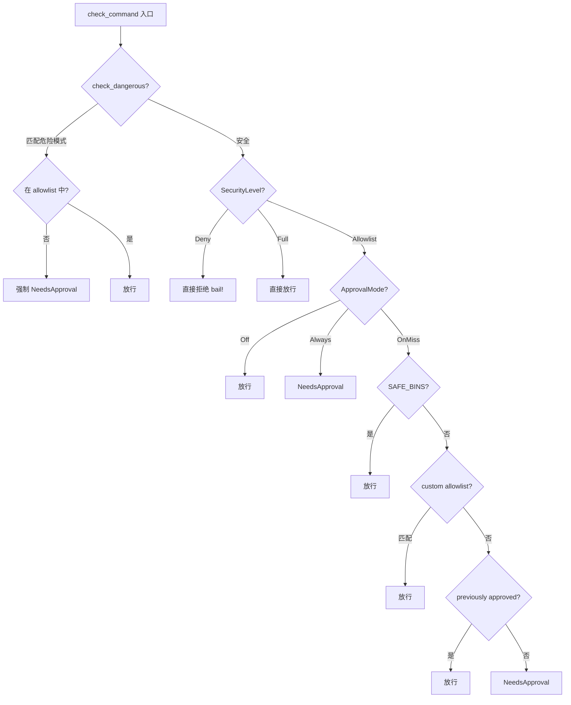
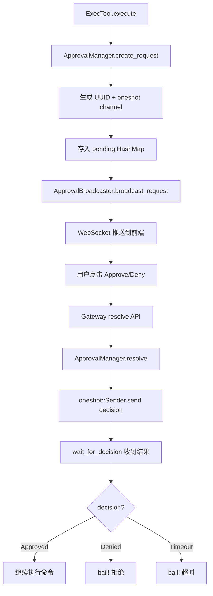
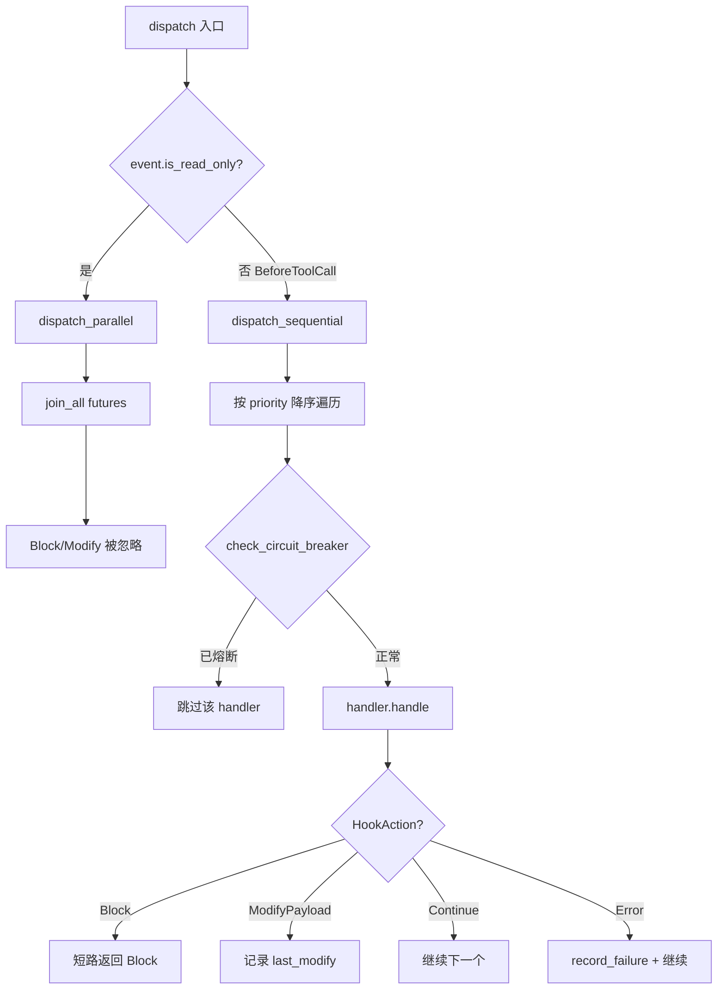

# PD-09.07 Moltis — 三层审批与 BeforeToolCall Hook 拦截

> 文档编号：PD-09.07
> 来源：Moltis `crates/tools/src/approval.rs` `crates/common/src/hooks.rs`
> GitHub：https://github.com/moltis-org/moltis.git
> 问题域：PD-09 Human-in-the-Loop
> 状态：可复用方案

---

## 第 1 章 问题与动机

### 1.1 核心问题

Agent 系统中的 exec 工具可以执行任意 shell 命令，这带来两个层面的风险：

1. **安全风险**：LLM 可能生成 `rm -rf /`、`git push --force`、`DROP TABLE` 等破坏性命令
2. **信任边界**：不同部署场景（沙箱 vs 裸机、CI vs 交互式）对命令执行的信任级别不同

传统做法是简单的"全部允许"或"全部拒绝"，但这无法满足实际需求：开发者希望 `ls`、`cat` 等安全命令自动放行，`curl`、`pip install` 等需要审批，而 `rm -rf /` 必须强制拦截。

### 1.2 Moltis 的解法概述

Moltis 实现了一套三层防御体系，从内到外分别是：

1. **ApprovalManager**（`crates/tools/src/approval.rs:244`）— 命令级审批引擎，包含 ApprovalMode（Off/OnMiss/Always）× SecurityLevel（Deny/Allowlist/Full）的决策矩阵，SAFE_BINS 白名单 60+ 安全命令，DANGEROUS_PATTERN_DEFS 14 条正则检测破坏性命令
2. **HookRegistry + BeforeToolCall**（`crates/common/src/hooks.rs:324`）— 事件驱动的工具调用拦截系统，17 种生命周期事件，支持 Block/ModifyPayload/Continue 三种响应，带熔断器和 dry-run 模式
3. **ShellHookHandler**（`crates/plugins/src/shell_hook.rs:35`）— 外部脚本集成层，允许用户通过 shell 脚本订阅 BeforeToolCall 事件，用 exit code 控制放行/拦截
4. **oneshot 通道等待**（`crates/tools/src/approval.rs:307-318`）— 审批请求通过 UUID + tokio oneshot channel 实现异步等待，Gateway 通过 WebSocket 广播到前端
5. **ToolPolicy 六层策略合并**（`crates/tools/src/policy.rs:106`）— Global → Provider → Agent → Group → Sender → Sandbox 六层策略叠加，deny 始终优先

### 1.3 设计思想

| 设计原则 | 具体实现 | 理由 | 替代方案 |
|----------|----------|------|----------|
| 安全地板不可绕过 | `check_dangerous()` 在所有模式前执行（`approval.rs:271`） | 即使 mode=Off 或 security=Full，`rm -rf /` 仍需审批 | 仅依赖 mode 判断（可被配置错误绕过） |
| 白名单优于黑名单 | SAFE_BINS 60+ 安全命令 + Allowlist 模式为默认 | 未知命令默认需要审批，比黑名单更安全 | 黑名单模式（遗漏新危险命令） |
| 沙箱内跳过审批 | `exec.rs:382` `if !is_sandboxed` 条件 | 沙箱已提供隔离，重复审批降低效率 | 沙箱内也审批（过度保守） |
| 事件驱动解耦 | HookRegistry 的 BeforeToolCall 事件 | 审批逻辑与工具实现解耦，可插拔 | 在每个工具内硬编码审批逻辑 |
| 熔断器保护 | HookStats + circuit_breaker（`hooks.rs:405`） | 外部 hook 脚本故障不阻塞主流程 | 无保护（一个坏 hook 拖垮整个系统） |

---

## 第 2 章 源码实现分析

### 2.1 架构概览

Moltis 的 HITL 系统由三个独立但协作的子系统组成：

```
┌─────────────────────────────────────────────────────────────────┐
│                        ExecTool.execute()                       │
│                      crates/tools/src/exec.rs                   │
├─────────────────────────────────────────────────────────────────┤
│                                                                 │
│  ┌──────────────┐    ┌──────────────────┐    ┌───────────────┐ │
│  │ ToolPolicy   │    │ ApprovalManager  │    │ HookRegistry  │ │
│  │ (6层策略)    │    │ (命令级审批)     │    │ (事件拦截)    │ │
│  │              │    │                  │    │               │ │
│  │ allow/deny   │    │ Mode × Security  │    │ BeforeToolCall│ │
│  │ glob 匹配    │    │ SAFE_BINS        │    │ Block/Modify  │ │
│  │              │    │ DANGEROUS regex  │    │ Continue      │ │
│  └──────────────┘    │ oneshot channel  │    │               │ │
│                      └────────┬─────────┘    │ ShellHook     │ │
│                               │              │ NativeHook    │ │
│                               ▼              └───────────────┘ │
│                    ┌──────────────────┐                         │
│                    │ WebSocket 广播   │                         │
│                    │ Gateway → 前端   │                         │
│                    │ oneshot 等待决策  │                         │
│                    └──────────────────┘                         │
└─────────────────────────────────────────────────────────────────┘
```

### 2.2 核心实现

#### 2.2.1 ApprovalManager 决策流程



对应源码 `crates/tools/src/approval.rs:269-304`：

```rust
pub async fn check_command(&self, command: &str) -> Result<ApprovalAction> {
    // Safety floor: dangerous patterns force approval regardless of mode.
    if let Some(desc) = check_dangerous(command) {
        if !matches_allowlist(command, &self.allowlist) {
            warn!(command, pattern = %desc, "dangerous command detected, forcing approval");
            return Ok(ApprovalAction::NeedsApproval);
        }
        debug!(command, pattern = %desc, "dangerous command allowed by explicit allowlist");
    }

    match self.security_level {
        SecurityLevel::Deny => bail!("exec denied: security level is 'deny'"),
        SecurityLevel::Full => return Ok(ApprovalAction::Proceed),
        SecurityLevel::Allowlist => {},
    }

    match self.mode {
        ApprovalMode::Off => Ok(ApprovalAction::Proceed),
        ApprovalMode::Always => Ok(ApprovalAction::NeedsApproval),
        ApprovalMode::OnMiss => {
            if is_safe_command(command) {
                return Ok(ApprovalAction::Proceed);
            }
            if matches_allowlist(command, &self.allowlist) {
                return Ok(ApprovalAction::Proceed);
            }
            if self.approved_commands.read().await.contains(command) {
                return Ok(ApprovalAction::Proceed);
            }
            Ok(ApprovalAction::NeedsApproval)
        },
    }
}
```

#### 2.2.2 oneshot 通道审批等待



对应源码 `crates/tools/src/exec.rs:381-408`：

```rust
// Approval gating.
if !is_sandboxed && let Some(ref mgr) = self.approval_manager {
    let action = mgr.check_command(command).await?;
    if action == ApprovalAction::NeedsApproval {
        info!(command, "command needs approval, waiting...");
        let (req_id, rx) = mgr.create_request(command).await;

        // Broadcast to connected clients.
        if let Some(ref bc) = self.broadcaster
            && let Err(e) = bc.broadcast_request(&req_id, command).await
        {
            warn!(error = %e, "failed to broadcast approval request");
        }

        let decision = mgr.wait_for_decision(rx).await;
        match decision {
            ApprovalDecision::Approved => {
                info!(command, "command approved");
            },
            ApprovalDecision::Denied => {
                bail!("command denied by user: {command}");
            },
            ApprovalDecision::Timeout => {
                bail!("approval timed out for command: {command}");
            },
        }
    }
}
```

#### 2.2.3 HookRegistry 事件分发



对应源码 `crates/common/src/hooks.rs:521-571`：

```rust
async fn dispatch_sequential(
    &self,
    event: HookEvent,
    payload: &HookPayload,
    handlers: &[HandlerEntry],
) -> Result<HookAction> {
    let mut last_modify: Option<Value> = None;

    for entry in handlers {
        if self.check_circuit_breaker(entry) {
            continue;
        }

        let start = Instant::now();
        let result = entry.handler.handle(event, payload).await;
        let latency = start.elapsed();

        match result {
            Ok(HookAction::Continue) => {
                entry.stats.record_success(latency);
            },
            Ok(HookAction::ModifyPayload(v)) => {
                entry.stats.record_success(latency);
                if self.dry_run {
                    info!(handler = entry.handler.name(), "hook modify (dry-run)");
                } else {
                    last_modify = Some(v);
                }
            },
            Ok(HookAction::Block(reason)) => {
                entry.stats.record_success(latency);
                if self.dry_run {
                    info!(handler = entry.handler.name(), reason = %reason, "hook block (dry-run)");
                } else {
                    return Ok(HookAction::Block(reason));
                }
            },
            Err(e) => {
                entry.stats.record_failure(latency);
                warn!(handler = entry.handler.name(), error = %e, "hook handler failed");
            },
        }
    }

    match last_modify {
        Some(v) => Ok(HookAction::ModifyPayload(v)),
        None => Ok(HookAction::Continue),
    }
}
```

### 2.3 实现细节

**危险命令正则检测**（`approval.rs:138-177`）：14 条预编译正则覆盖文件系统破坏（rm -rf /、mkfs、dd）、Git 破坏操作（reset --hard、force push、clean -f）、数据库破坏（DROP TABLE、TRUNCATE）、基础设施破坏（docker prune、kubectl delete namespace、terraform destroy）。使用 `LazyLock<RegexSet>` 一次编译、O(n) 匹配。

**ShellHookHandler 协议**（`shell_hook.rs:89-197`）：外部脚本通过 stdin 接收 JSON payload，exit 0 + 空 stdout = Continue，exit 0 + `{"action":"modify","data":{...}}` = ModifyPayload，exit 1 = Block（stderr 作为原因）。超时可配置，默认 10s。

**已审批命令缓存**（`approval.rs:324-328`）：用户批准某命令后，该命令被加入 `approved_commands: HashSet<String>`，后续相同命令自动放行，避免重复打扰。

**ToolPolicy 六层合并**（`policy.rs:106-185`）：Global → Provider → Agent → Group → Sender → Sandbox 六层策略叠加。allow 列表后者覆盖前者，deny 列表累积合并（deny 始终优先于 allow）。

---

## 第 3 章 迁移指南

### 3.1 迁移清单

**阶段 1：命令级审批引擎（核心，1 个文件）**

- [ ] 定义 `ApprovalMode`（Off/OnMiss/Always）和 `SecurityLevel`（Deny/Allowlist/Full）枚举
- [ ] 实现 `SAFE_BINS` 白名单和 `DANGEROUS_PATTERN_DEFS` 正则集
- [ ] 实现 `ApprovalManager` 的 `check_command()` 决策逻辑
- [ ] 实现 oneshot channel 的 `create_request()` / `resolve()` / `wait_for_decision()` 流程
- [ ] 在 exec 工具中集成审批检查（沙箱内跳过）

**阶段 2：事件驱动 Hook 系统（可选，增强扩展性）**

- [ ] 定义 `HookEvent` 枚举和 `HookPayload` 类型
- [ ] 实现 `HookHandler` trait 和 `HookRegistry` 分发器
- [ ] 实现 `ShellHookHandler` 外部脚本集成
- [ ] 添加熔断器（circuit breaker）保护

**阶段 3：Gateway 集成（可选，需要 WebSocket）**

- [ ] 实现 `ApprovalBroadcaster` trait 的 WebSocket 版本
- [ ] 实现 `ExecApprovalService` 的 resolve API
- [ ] 前端审批 UI 组件

### 3.2 适配代码模板

以下是 Python 版本的核心审批引擎，可直接用于 LangChain/LangGraph 项目：

```python
import asyncio
import re
import uuid
from dataclasses import dataclass, field
from enum import Enum
from typing import Optional

class ApprovalMode(Enum):
    OFF = "off"
    ON_MISS = "on-miss"
    ALWAYS = "always"

class SecurityLevel(Enum):
    DENY = "deny"
    ALLOWLIST = "allowlist"
    FULL = "full"

class ApprovalDecision(Enum):
    APPROVED = "approved"
    DENIED = "denied"
    TIMEOUT = "timeout"

SAFE_BINS = frozenset([
    "cat", "echo", "printf", "head", "tail", "wc", "sort", "uniq",
    "cut", "tr", "grep", "awk", "sed", "jq", "date", "ls", "pwd",
    "whoami", "hostname", "uname", "env", "diff", "file", "stat",
    "du", "df", "which", "test", "seq", "rev", "fold",
])

DANGEROUS_PATTERNS = [
    (re.compile(r"rm\s+(-\S*[rR]\S*\s+)*/(\s|$|\*)"), "rm -r on root"),
    (re.compile(r"git\s+reset\s+--hard"), "git reset --hard"),
    (re.compile(r"git\s+push\s+.*(-\S*f\S*|--force\b)"), "git force push"),
    (re.compile(r"(?i)\bDROP\s+(TABLE|DATABASE)\b"), "DROP TABLE/DATABASE"),
    (re.compile(r"\bmkfs\b"), "make filesystem"),
    (re.compile(r"terraform\s+destroy"), "terraform destroy"),
]

def check_dangerous(command: str) -> Optional[str]:
    for pattern, desc in DANGEROUS_PATTERNS:
        if pattern.search(command):
            return desc
    return None

def extract_first_bin(command: str) -> Optional[str]:
    for part in command.strip().split():
        if "=" not in part:
            return part.rsplit("/", 1)[-1]
    return None

@dataclass
class ApprovalManager:
    mode: ApprovalMode = ApprovalMode.ON_MISS
    security_level: SecurityLevel = SecurityLevel.ALLOWLIST
    allowlist: list[str] = field(default_factory=list)
    timeout: float = 120.0
    _pending: dict[str, asyncio.Future] = field(default_factory=dict, repr=False)
    _approved: set[str] = field(default_factory=set, repr=False)

    def check_command(self, command: str) -> str:
        """Returns 'proceed' or 'needs_approval'."""
        # Safety floor: dangerous patterns always need approval
        danger = check_dangerous(command)
        if danger and not self._matches_allowlist(command):
            return "needs_approval"

        if self.security_level == SecurityLevel.DENY:
            raise PermissionError("exec denied: security level is 'deny'")
        if self.security_level == SecurityLevel.FULL:
            return "proceed"

        if self.mode == ApprovalMode.OFF:
            return "proceed"
        if self.mode == ApprovalMode.ALWAYS:
            return "needs_approval"

        # ON_MISS mode
        bin_name = extract_first_bin(command)
        if bin_name and bin_name in SAFE_BINS:
            return "proceed"
        if self._matches_allowlist(command):
            return "proceed"
        if command in self._approved:
            return "proceed"
        return "needs_approval"

    async def request_approval(self, command: str) -> ApprovalDecision:
        """Create a pending request and wait for resolution."""
        req_id = str(uuid.uuid4())
        future = asyncio.get_event_loop().create_future()
        self._pending[req_id] = future

        # TODO: broadcast req_id + command to your UI/WebSocket
        try:
            decision = await asyncio.wait_for(future, timeout=self.timeout)
        except asyncio.TimeoutError:
            decision = ApprovalDecision.TIMEOUT
        finally:
            self._pending.pop(req_id, None)

        if decision == ApprovalDecision.APPROVED:
            self._approved.add(command)
        return decision

    def resolve(self, req_id: str, decision: ApprovalDecision):
        """Called by the UI/API to resolve a pending request."""
        if req_id in self._pending:
            self._pending[req_id].set_result(decision)

    def _matches_allowlist(self, command: str) -> bool:
        bin_name = extract_first_bin(command) or ""
        for pattern in self.allowlist:
            if pattern == "*":
                return True
            if pattern == bin_name:
                return True
            if pattern.endswith("*") and (
                command.startswith(pattern[:-1]) or bin_name.startswith(pattern[:-1])
            ):
                return True
        return False
```

### 3.3 适用场景

| 场景 | 适用度 | 说明 |
|------|--------|------|
| CLI Agent（交互式） | ⭐⭐⭐ | 最佳场景：用户在终端直接审批 |
| WebSocket Gateway | ⭐⭐⭐ | Moltis 原生场景：前端 UI 审批 |
| CI/CD 自动化 | ⭐⭐ | 用 mode=Off + DANGEROUS 兜底，或 allowlist 预配置 |
| 多租户 SaaS | ⭐⭐⭐ | ToolPolicy 六层策略支持 per-tenant 配置 |
| 沙箱环境 | ⭐ | 沙箱内自动跳过审批，无需此系统 |

---

## 第 4 章 测试用例

基于 Moltis 真实函数签名的测试代码（Python 适配版）：

```python
import asyncio
import pytest
from approval_manager import (
    ApprovalManager, ApprovalMode, SecurityLevel,
    ApprovalDecision, check_dangerous, extract_first_bin,
    SAFE_BINS,
)

class TestDangerousPatternDetection:
    def test_rm_rf_root(self):
        assert check_dangerous("rm -rf /") == "rm -r on root"
        assert check_dangerous("rm -rf /*") == "rm -r on root"

    def test_git_reset_hard(self):
        assert check_dangerous("git reset --hard") == "git reset --hard"
        assert check_dangerous("git reset --hard HEAD~1") == "git reset --hard"

    def test_git_force_push(self):
        assert check_dangerous("git push --force origin main") == "git force push"
        assert check_dangerous("git push -f origin main") == "git force push"

    def test_drop_table(self):
        assert check_dangerous('psql -c "DROP TABLE users"') == "DROP TABLE/DATABASE"

    def test_safe_commands_not_flagged(self):
        assert check_dangerous("git status") is None
        assert check_dangerous("ls -la") is None
        assert check_dangerous("cargo build") is None

class TestExtractFirstBin:
    def test_simple(self):
        assert extract_first_bin("echo hello") == "echo"

    def test_with_path(self):
        assert extract_first_bin("/usr/bin/jq .") == "jq"

    def test_with_env_var(self):
        assert extract_first_bin("FOO=bar echo hi") == "echo"

class TestApprovalManager:
    def test_off_mode_proceeds(self):
        mgr = ApprovalManager(mode=ApprovalMode.OFF)
        assert mgr.check_command("curl https://example.com") == "proceed"

    def test_always_mode_needs_approval(self):
        mgr = ApprovalManager(mode=ApprovalMode.ALWAYS)
        assert mgr.check_command("echo hi") == "needs_approval"

    def test_on_miss_safe_bin_proceeds(self):
        mgr = ApprovalManager()
        assert mgr.check_command("echo hi") == "proceed"

    def test_on_miss_unsafe_needs_approval(self):
        mgr = ApprovalManager()
        assert mgr.check_command("curl https://evil.com") == "needs_approval"

    def test_deny_security_raises(self):
        mgr = ApprovalManager(security_level=SecurityLevel.DENY)
        with pytest.raises(PermissionError):
            mgr.check_command("echo hi")

    def test_dangerous_overrides_off_mode(self):
        mgr = ApprovalManager(mode=ApprovalMode.OFF)
        assert mgr.check_command("rm -rf /") == "needs_approval"

    def test_dangerous_overridden_by_allowlist(self):
        mgr = ApprovalManager(mode=ApprovalMode.OFF, allowlist=["rm*"])
        assert mgr.check_command("rm -rf /") == "proceed"

    def test_allowlist_glob_matching(self):
        mgr = ApprovalManager(allowlist=["git", "cargo*", "npm"])
        assert mgr.check_command("git status") == "proceed"
        assert mgr.check_command("cargo build") == "proceed"
        assert mgr.check_command("rm -rf /tmp") == "needs_approval"

    @pytest.mark.asyncio
    async def test_approval_flow(self):
        mgr = ApprovalManager(timeout=5.0)
        # Simulate async approval
        async def approve_after_delay():
            await asyncio.sleep(0.1)
            for req_id in list(mgr._pending.keys()):
                mgr.resolve(req_id, ApprovalDecision.APPROVED)

        asyncio.create_task(approve_after_delay())
        decision = await mgr.request_approval("pip install requests")
        assert decision == ApprovalDecision.APPROVED
        assert "pip install requests" in mgr._approved

    @pytest.mark.asyncio
    async def test_approval_timeout(self):
        mgr = ApprovalManager(timeout=0.1)
        decision = await mgr.request_approval("dangerous-cmd")
        assert decision == ApprovalDecision.TIMEOUT

class TestCircuitBreaker:
    """Tests for HookRegistry circuit breaker behavior (conceptual)."""

    def test_trips_after_consecutive_failures(self):
        """Mirrors hooks.rs:764-805 test."""
        threshold = 3
        consecutive_failures = 0
        disabled = False

        for _ in range(threshold):
            consecutive_failures += 1
            if consecutive_failures >= threshold:
                disabled = True

        assert disabled is True

    def test_resets_after_cooldown(self):
        """After cooldown, handler should be re-enabled."""
        disabled = True
        cooldown_elapsed = True
        if disabled and cooldown_elapsed:
            disabled = False
        assert disabled is False
```

---

## 第 5 章 跨域关联

| 关联域 | 关系类型 | 说明 |
|--------|----------|------|
| PD-03 容错与重试 | 协同 | HookRegistry 的熔断器（circuit breaker）是容错机制的一部分：连续失败 3 次自动禁用 handler，冷却后恢复（`hooks.rs:405-447`） |
| PD-04 工具系统 | 依赖 | ApprovalManager 嵌入在 ExecTool 中（`exec.rs:166`），ToolPolicy 控制工具级别的 allow/deny（`policy.rs:56-77`） |
| PD-05 沙箱隔离 | 互斥 | 沙箱内命令跳过审批（`exec.rs:382` `if !is_sandboxed`），两个系统互补而非叠加 |
| PD-10 中间件管道 | 协同 | HookRegistry 本质上是中间件管道：BeforeToolCall 事件的 handler 链按 priority 顺序执行，支持 Block 短路和 ModifyPayload 变换 |
| PD-11 可观测性 | 协同 | HookStats 记录每个 handler 的调用次数、失败次数、平均延迟（`hooks.rs:262-306`），为可观测性提供数据源 |

---

## 第 6 章 来源文件索引

| 文件 | 行范围 | 关键实现 |
|------|--------|----------|
| `crates/tools/src/approval.rs` | L14-L18 | ApprovalDecision 枚举（Approved/Denied/Timeout） |
| `crates/tools/src/approval.rs` | L24-L29 | ApprovalMode 枚举（Off/OnMiss/Always） |
| `crates/tools/src/approval.rs` | L51-L56 | SecurityLevel 枚举（Deny/Allowlist/Full） |
| `crates/tools/src/approval.rs` | L76-L134 | SAFE_BINS 白名单（60+ 安全命令） |
| `crates/tools/src/approval.rs` | L138-L192 | DANGEROUS_PATTERN_DEFS 正则集（14 条危险模式） |
| `crates/tools/src/approval.rs` | L244-L358 | ApprovalManager 完整实现（check_command/create_request/resolve/wait_for_decision） |
| `crates/common/src/hooks.rs` | L29-L47 | HookEvent 枚举（17 种生命周期事件） |
| `crates/common/src/hooks.rs` | L98-L206 | HookPayload 类型化载荷 |
| `crates/common/src/hooks.rs` | L212-L220 | HookAction 枚举（Continue/ModifyPayload/Block） |
| `crates/common/src/hooks.rs` | L226-L257 | HookHandler trait（name/events/priority/handle/handle_sync） |
| `crates/common/src/hooks.rs` | L262-L312 | HookStats 健康统计（call_count/failure_count/avg_latency） |
| `crates/common/src/hooks.rs` | L324-L628 | HookRegistry 完整实现（register/dispatch/circuit_breaker/dry_run） |
| `crates/plugins/src/shell_hook.rs` | L35-L197 | ShellHookHandler（外部脚本集成，stdin JSON/exit code 协议） |
| `crates/gateway/src/approval.rs` | L19-L80 | LiveExecApprovalService（Gateway 审批服务） |
| `crates/gateway/src/approval.rs` | L83-L108 | GatewayApprovalBroadcaster（WebSocket 广播） |
| `crates/tools/src/exec.rs` | L42-L45 | ApprovalBroadcaster trait 定义 |
| `crates/tools/src/exec.rs` | L162-L236 | ExecTool 结构体与 builder 方法 |
| `crates/tools/src/exec.rs` | L381-L408 | 审批门控集成点（check → create → broadcast → wait） |
| `crates/tools/src/policy.rs` | L8-L95 | ToolPolicy allow/deny glob 匹配 |
| `crates/tools/src/policy.rs` | L106-L185 | resolve_effective_policy 六层策略合并 |

---

## 第 7 章 横向对比维度

> **重要：** 本章用于自动填充 Butcher Wiki 的横向对比表。

```json comparison_data
{
  "project": "Moltis",
  "dimensions": {
    "暂停机制": "oneshot channel + tokio::timeout 120s 异步等待",
    "澄清类型": "无结构化澄清，仅 Approved/Denied/Timeout 三态决策",
    "状态持久化": "内存 HashMap + HashSet，进程重启丢失已审批缓存",
    "实现层级": "三层：ApprovalManager 命令级 + HookRegistry 事件级 + ToolPolicy 策略级",
    "身份绑定": "requestId 为 UUID，resolve 时无身份校验（任何客户端可响应）",
    "多通道转发": "GatewayApprovalBroadcaster 广播到所有 WebSocket 客户端",
    "审查粒度控制": "ApprovalMode×SecurityLevel 矩阵 + SAFE_BINS + DANGEROUS regex 三层过滤",
    "升级策略": "超时直接 bail!，无自动升级或降级",
    "通知容错": "broadcast 失败仅 warn 日志，不阻塞审批流程",
    "多轮交互支持": "单轮审批，approved_commands 缓存避免重复询问",
    "passthrough 旁路": "沙箱内自动跳过审批（is_sandboxed 条件）",
    "自动跳过机制": "SAFE_BINS 60+ 命令 + custom allowlist + 已审批缓存三级自动放行",
    "熔断器保护": "HookStats 连续失败计数 + 冷却期自动恢复",
    "dry-run 模式": "HookRegistry.dry_run 标志，Block/Modify 仅日志不生效"
  }
}
```

### 域元数据补充

```json domain_metadata
{
  "solution_summary": "Moltis 用 ApprovalMode×SecurityLevel 决策矩阵 + SAFE_BINS/DANGEROUS 双名单 + oneshot channel 异步等待 + HookRegistry BeforeToolCall 事件拦截实现三层 HITL 审批",
  "description": "命令级安全分类（安全白名单 vs 危险正则）与事件驱动 Hook 拦截的组合防御",
  "sub_problems": [
    "安全地板设计：即使审批关闭，危险命令仍强制拦截的不可绕过机制",
    "已审批命令缓存：用户批准后相同命令自动放行的记忆策略",
    "Hook 熔断器：外部脚本 handler 连续失败后的自动禁用与冷却恢复",
    "dry-run 审计：Block/Modify 仅记录日志不实际生效的调试模式",
    "六层策略合并：Global→Provider→Agent→Group→Sender→Sandbox 的 deny 累积优先策略"
  ],
  "best_practices": [
    "安全地板不可绕过：dangerous pattern 检测在所有 mode/security 判断之前执行",
    "白名单默认模式：OnMiss + Allowlist 为默认值，未知命令需审批比黑名单更安全",
    "沙箱内跳过审批：已有隔离保护的环境不重复审批，避免效率损失",
    "oneshot channel 优于共享状态轮询：零拷贝单次通知，无锁竞争",
    "熔断器保护外部 Hook：连续失败自动禁用，冷却后恢复，防止坏 hook 拖垮系统"
  ]
}
```
