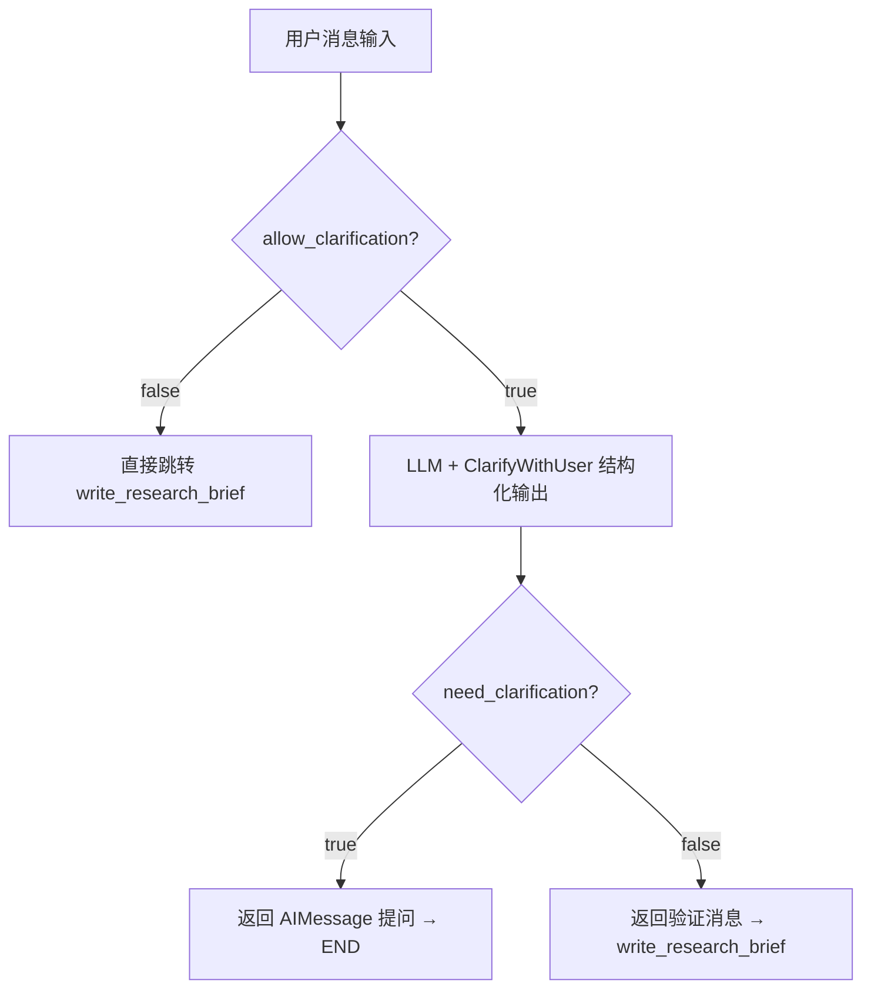
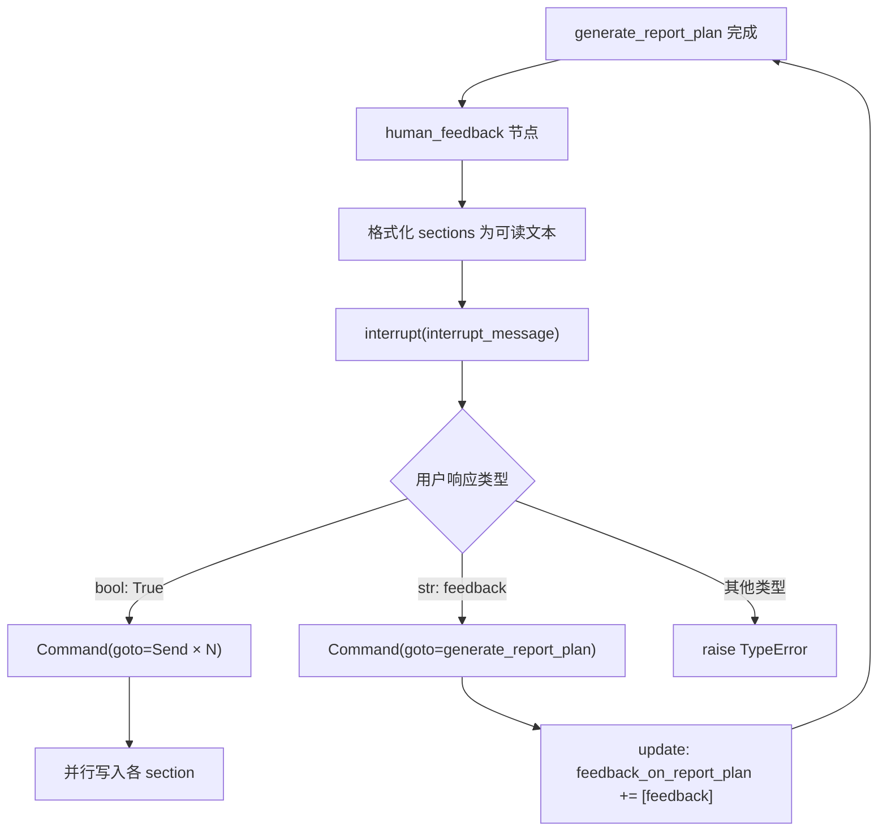

# PD-09.06 Open Deep Research — 双层澄清与计划审批

> 文档编号：PD-09.06
> 来源：Open Deep Research `src/open_deep_research/deep_researcher.py`, `src/legacy/graph.py`
> GitHub：https://github.com/langchain-ai/open_deep_research.git
> 问题域：PD-09 Human-in-the-Loop
> 状态：可复用方案

---

## 第 1 章 问题与动机

### 1.1 核心问题

深度研究 Agent 面临一个根本性矛盾：用户的研究请求往往模糊或不完整（"帮我调研 MCP"），但 Agent 一旦启动研究就会消耗大量 token 和时间。如果研究方向偏了，所有投入都浪费了。

这个问题在两个层面上表现：

1. **研究范围不清晰** — 用户的初始请求可能包含缩写、歧义词或缺少关键约束条件。Agent 需要在启动昂贵的研究流程之前判断是否需要向用户提问。
2. **研究计划不符合预期** — 即使研究范围清晰了，Agent 生成的报告计划（章节划分、研究重点）可能不符合用户的真实需求。用户需要在计划执行前审批或修改。

Open Deep Research 项目在两个独立的实现版本中分别解决了这两个层面的问题：主版本（deep_researcher.py）用 LLM 结构化输出实现自动澄清判断，Legacy 版本（graph.py）用 LangGraph `interrupt()` 实现计划审批。两种方案互补，覆盖了 HITL 的"澄清"和"审批"两大核心场景。

### 1.2 Open Deep Research 的解法概述

1. **LLM 驱动的澄清判断**（`clarify_with_user` 节点）— 用 `ClarifyWithUser` 结构化输出让 LLM 自主判断是否需要向用户提问，而非硬编码规则 (`deep_researcher.py:60-115`)
2. **配置化开关控制** — `allow_clarification` 布尔开关让用户可以跳过澄清步骤，适配不同场景（API 调用 vs 交互式使用）(`configuration.py:54-63`)
3. **interrupt() 计划审批** — Legacy 版本在报告计划生成后用 `interrupt()` 暂停图执行，等待用户 approve 或提供 feedback (`graph.py:142-192`)
4. **反馈驱动的计划重生成** — 用户的 feedback 字符串被追加到 `feedback_on_report_plan` 列表，触发 `generate_report_plan` 节点重新执行 (`graph.py:186-190`)
5. **多轮交互支持** — 通过 LangGraph 的 `Command(goto=...)` 路由机制，支持用户多次提供 feedback 直到满意后 approve (`graph.py:178-192`)

### 1.3 设计思想

| 设计原则 | 具体实现 | 理由 | 替代方案 |
|----------|----------|------|----------|
| LLM 判断优于规则判断 | `ClarifyWithUser` 结构化输出让 LLM 决定是否需要澄清 | 规则无法覆盖所有歧义场景，LLM 能理解语义 | 关键词匹配、正则规则 |
| 配置化降级 | `allow_clarification` 开关 | API 调用场景不需要交互，测试场景需要跳过 | 环境变量、运行时参数 |
| interrupt() 优于轮询 | LangGraph `interrupt()` 原语暂停图执行 | 不阻塞线程，支持持久化，可恢复 | `threading.Event`、WebSocket 轮询 |
| 反馈累积而非覆盖 | `Annotated[list[str], operator.add]` 累积所有反馈 | 保留历史反馈上下文，LLM 可参考之前的修改意见 | 只保留最新反馈 |
| 类型化路由 | `isinstance(feedback, bool)` vs `isinstance(feedback, str)` 分流 | 明确区分"批准"和"修改"两种用户意图 | 字符串匹配 "approve" |

---

## 第 2 章 源码实现分析

### 2.1 架构概览

Open Deep Research 的 HITL 实现分布在两个独立的图架构中：

**主版本（Deep Researcher）— 澄清层：**

```
┌──────────────────┐     ┌─────────────────────┐     ┌─────────────────────┐
│  START (用户输入)  │────→│  clarify_with_user   │────→│  write_research_brief│
│                  │     │  (LLM 判断是否澄清)   │     │  (生成研究简报)       │
└──────────────────┘     └─────────┬────────────┘     └──────────┬──────────┘
                                   │ need_clarification=true              │
                                   ▼                                      ▼
                              ┌────────┐                    ┌──────────────────┐
                              │  END   │                    │research_supervisor│
                              │(返回问题)│                    │  (执行研究)        │
                              └────────┘                    └──────────────────┘
```

**Legacy 版本 — 审批层：**

```
┌──────────────────┐     ┌─────────────────────┐     ┌──────────────────┐
│      START       │────→│ generate_report_plan │────→│  human_feedback   │
│                  │     │  (生成报告计划)        │     │  (interrupt 暂停)  │
└──────────────────┘     └─────────────────────┘     └────────┬─────────┘
                                   ▲                          │
                                   │ feedback (string)        │ approve (true)
                                   └──────────────────────────┤
                                                              ▼
                                                   ┌─────────────────────────┐
                                                   │build_section_with_web_  │
                                                   │research (并行 Send)      │
                                                   └─────────────────────────┘
```

### 2.2 核心实现

#### 2.2.1 ClarifyWithUser 结构化输出模型



对应源码 `src/open_deep_research/state.py:30-41`：

```python
class ClarifyWithUser(BaseModel):
    """Model for user clarification requests."""
    
    need_clarification: bool = Field(
        description="Whether the user needs to be asked a clarifying question.",
    )
    question: str = Field(
        description="A question to ask the user to clarify the report scope",
    )
    verification: str = Field(
        description="Verify message that we will start research after the user has provided the necessary information.",
    )
```

对应源码 `src/open_deep_research/deep_researcher.py:60-115`：

```python
async def clarify_with_user(state: AgentState, config: RunnableConfig) -> Command[Literal["write_research_brief", "__end__"]]:
    # Step 1: Check if clarification is enabled in configuration
    configurable = Configuration.from_runnable_config(config)
    if not configurable.allow_clarification:
        return Command(goto="write_research_brief")
    
    # Step 2: Prepare the model for structured clarification analysis
    messages = state["messages"]
    clarification_model = (
        configurable_model
        .with_structured_output(ClarifyWithUser)
        .with_retry(stop_after_attempt=configurable.max_structured_output_retries)
        .with_config(model_config)
    )
    
    # Step 3: Analyze whether clarification is needed
    prompt_content = clarify_with_user_instructions.format(
        messages=get_buffer_string(messages), date=get_today_str()
    )
    response = await clarification_model.ainvoke([HumanMessage(content=prompt_content)])
    
    # Step 4: Route based on clarification analysis
    if response.need_clarification:
        return Command(goto=END, update={"messages": [AIMessage(content=response.question)]})
    else:
        return Command(goto="write_research_brief", 
                       update={"messages": [AIMessage(content=response.verification)]})
```

#### 2.2.2 interrupt() 计划审批机制



对应源码 `src/legacy/graph.py:142-192`：

```python
def human_feedback(state: ReportState, config: RunnableConfig) -> Command[Literal["generate_report_plan","build_section_with_web_research"]]:
    # Get sections
    topic = state["topic"]
    sections = state['sections']
    sections_str = "\n\n".join(
        f"Section: {section.name}\n"
        f"Description: {section.description}\n"
        f"Research needed: {'Yes' if section.research else 'No'}\n"
        for section in sections
    )

    # Get feedback on the report plan from interrupt
    interrupt_message = f"""Please provide feedback on the following report plan. 
                        \n\n{sections_str}\n
                        \nDoes the report plan meet your needs?\nPass 'true' to approve the report plan.\nOr, provide feedback to regenerate the report plan:"""
    
    feedback = interrupt(interrupt_message)

    # If the user approves the report plan, kick off section writing
    if isinstance(feedback, bool) and feedback is True:
        return Command(goto=[
            Send("build_section_with_web_research", {"topic": topic, "section": s, "search_iterations": 0}) 
            for s in sections if s.research
        ])
    
    # If the user provides feedback, regenerate the report plan 
    elif isinstance(feedback, str):
        return Command(goto="generate_report_plan", 
                       update={"feedback_on_report_plan": [feedback]})
    else:
        raise TypeError(f"Interrupt value of type {type(feedback)} is not supported.")
```

### 2.3 实现细节

#### 澄清 Prompt 的防重复提问机制

`clarify_with_user_instructions` prompt 中包含关键约束 (`prompts.py:12-13`)：

> "IMPORTANT: If you can see in the messages history that you have already asked a clarifying question, you almost always do not need to ask another one. Only ask another question if ABSOLUTELY NECESSARY."

这防止了 LLM 在多轮对话中反复提问导致用户体验恶化。

#### 反馈累积的 Reducer 设计

Legacy 版本的 `ReportState` 使用 `Annotated[list[str], operator.add]` 作为 feedback 字段的 reducer (`legacy/state.py:51`)：

```python
class ReportState(TypedDict):
    feedback_on_report_plan: Annotated[list[str], operator.add]
```

这意味着每次用户提供 feedback，新的字符串被追加到列表中而非覆盖。在 `generate_report_plan` 中，所有历史 feedback 被拼接为单个字符串传给 LLM (`graph.py:64-67`)：

```python
feedback_list = state.get("feedback_on_report_plan", [])
feedback = " /// ".join(feedback_list) if feedback_list else ""
```

#### Multi-Agent 版本的 Question 工具模式

Legacy 的 `multi_agent.py` 采用了不同的澄清策略：将 `Question` 定义为一个工具，通过 `ask_for_clarification` 配置开关决定是否注入到 supervisor 的工具列表中 (`multi_agent.py:87-91, 166-167`)：

```python
class Question(BaseModel):
    """Ask a follow-up question to clarify the report scope."""
    question: str = Field(
        description="A specific question to ask the user to clarify the scope, focus, or requirements of the report."
    )

# In get_supervisor_tools:
if configurable.ask_for_clarification:
    tools.append(tool(Question))
```

这是"空壳工具"模式的典型应用 — 工具定义 schema 供 LLM 调用，但实际逻辑由外部处理。

#### 图编译与 Checkpointer 集成

interrupt() 的正确工作依赖 LangGraph 的 checkpointer。在测试代码中可以看到 (`legacy/tests/test_report_quality.py:204-223`)：

```python
checkpointer = MemorySaver()
graph = builder.compile(checkpointer=checkpointer)

async for event in graph.astream({"topic": topic_query}, thread, stream_mode="updates"):
    if '__interrupt__' in event:
        interrupt_value = event['__interrupt__'][0].value
```

没有 checkpointer，interrupt() 无法持久化暂停状态，图恢复时会丢失上下文。

---

## 第 3 章 迁移指南

### 3.1 迁移清单

**阶段 1：澄清层（ClarifyWithUser 模式）**

- [ ] 定义 `ClarifyWithUser` Pydantic 模型（need_clarification + question + verification 三字段）
- [ ] 编写澄清 prompt，包含防重复提问约束
- [ ] 在图入口添加 `clarify_with_user` 节点，用 `Command(goto=END)` 返回提问
- [ ] 添加 `allow_clarification` 配置开关
- [ ] 处理多轮对话：用户回答后重新进入 clarify_with_user 节点

**阶段 2：审批层（interrupt 模式）**

- [ ] 在计划生成节点后添加 `human_feedback` 节点
- [ ] 使用 `interrupt(message)` 暂停图执行
- [ ] 实现 `bool` / `str` 类型分流路由
- [ ] 配置 checkpointer（MemorySaver 或 PostgresSaver）
- [ ] 在 state 中用 `Annotated[list[str], operator.add]` 累积反馈

**阶段 3：集成与测试**

- [ ] 编写 interrupt 恢复测试（astream + `__interrupt__` 事件检测）
- [ ] 测试 allow_clarification=False 的跳过路径
- [ ] 测试多轮 feedback → approve 的完整流程

### 3.2 适配代码模板

#### 模板 1：通用澄清节点

```python
from pydantic import BaseModel, Field
from langchain_core.messages import AIMessage, HumanMessage
from langchain.chat_models import init_chat_model
from langgraph.graph import END
from langgraph.types import Command

class ClarifyWithUser(BaseModel):
    """LLM 判断是否需要向用户澄清。"""
    need_clarification: bool = Field(description="是否需要向用户提问")
    question: str = Field(description="澄清问题内容")
    verification: str = Field(description="确认开始执行的消息")

CLARIFY_PROMPT = """
分析以下用户消息，判断是否需要澄清：
<Messages>{messages}</Messages>

规则：
1. 如果消息历史中已经问过澄清问题，除非绝对必要否则不再提问
2. 如果有缩写、歧义词或缺少关键约束，需要澄清
3. 返回 JSON: {{"need_clarification": bool, "question": str, "verification": str}}
"""

async def clarify_with_user(state, config):
    """通用澄清节点 — 可直接复用到任何 LangGraph 图中。"""
    # 配置开关检查
    if not config.get("configurable", {}).get("allow_clarification", True):
        return Command(goto="next_node")
    
    model = init_chat_model(model="openai:gpt-4.1")
    clarify_model = model.with_structured_output(ClarifyWithUser)
    
    messages_str = "\n".join(str(m.content) for m in state["messages"])
    prompt = CLARIFY_PROMPT.format(messages=messages_str)
    result = await clarify_model.ainvoke([HumanMessage(content=prompt)])
    
    if result.need_clarification:
        return Command(goto=END, update={"messages": [AIMessage(content=result.question)]})
    return Command(goto="next_node", update={"messages": [AIMessage(content=result.verification)]})
```

#### 模板 2：通用计划审批节点

```python
from langgraph.types import interrupt, Command
from langgraph.constants import Send

def human_review_plan(state, config):
    """通用计划审批节点 — interrupt + 类型化路由。"""
    plan = state.get("plan", [])
    plan_str = format_plan_for_display(plan)  # 自定义格式化函数
    
    feedback = interrupt(f"请审批以下计划：\n\n{plan_str}\n\n传入 true 批准，或提供修改意见：")
    
    if isinstance(feedback, bool) and feedback is True:
        # 批准 → 并行执行各步骤
        return Command(goto=[
            Send("execute_step", {"step": step}) for step in plan
        ])
    elif isinstance(feedback, str):
        # 修改 → 重新生成计划
        return Command(
            goto="generate_plan",
            update={"feedback_history": [feedback]}
        )
    else:
        raise TypeError(f"不支持的反馈类型: {type(feedback)}")

def format_plan_for_display(plan):
    """将计划格式化为人类可读文本。"""
    return "\n\n".join(
        f"步骤 {i+1}: {step.name}\n描述: {step.description}"
        for i, step in enumerate(plan)
    )
```

### 3.3 适用场景

| 场景 | 适用度 | 说明 |
|------|--------|------|
| 研究类 Agent（报告生成、调研） | ⭐⭐⭐ | 完美匹配：研究范围澄清 + 计划审批 |
| 代码生成 Agent | ⭐⭐ | 澄清层适用，审批层需改为代码 review |
| 客服/对话 Agent | ⭐⭐⭐ | 澄清层非常适合，审批层不需要 |
| 批量处理 Pipeline | ⭐ | 通常不需要交互，用 allow_clarification=False |
| CI/CD 自动化 | ⭐ | 需要自动确认降级，不适合 interrupt |

---

## 第 4 章 测试用例

```python
import pytest
import uuid
from unittest.mock import AsyncMock, patch
from langchain_core.messages import HumanMessage, AIMessage
from langgraph.checkpoint.memory import MemorySaver
from pydantic import BaseModel, Field


class ClarifyWithUser(BaseModel):
    need_clarification: bool = Field(description="是否需要澄清")
    question: str = Field(default="")
    verification: str = Field(default="")


class TestClarifyWithUser:
    """测试澄清节点的核心行为。"""

    @pytest.mark.asyncio
    async def test_skip_when_disabled(self):
        """allow_clarification=False 时直接跳过澄清。"""
        from open_deep_research.deep_researcher import clarify_with_user
        
        state = {"messages": [HumanMessage(content="研究 MCP 协议")]}
        config = {"configurable": {"allow_clarification": False}}
        
        result = await clarify_with_user(state, config)
        assert result.goto == "write_research_brief"

    @pytest.mark.asyncio
    async def test_clarification_needed(self):
        """模糊请求触发澄清提问。"""
        mock_response = ClarifyWithUser(
            need_clarification=True,
            question="请问您说的 MCP 是指 Model Context Protocol 还是其他含义？",
            verification=""
        )
        
        with patch("open_deep_research.deep_researcher.configurable_model") as mock_model:
            mock_chain = AsyncMock()
            mock_chain.ainvoke.return_value = mock_response
            mock_model.with_structured_output.return_value.with_retry.return_value.with_config.return_value = mock_chain
            
            state = {"messages": [HumanMessage(content="帮我调研 MCP")]}
            config = {"configurable": {"allow_clarification": True, "research_model": "openai:gpt-4.1"}}
            
            # 验证返回 END 并包含提问消息
            result = await clarify_with_user(state, config)
            assert result.goto == "__end__"

    @pytest.mark.asyncio
    async def test_no_clarification_needed(self):
        """清晰请求直接进入研究。"""
        mock_response = ClarifyWithUser(
            need_clarification=False,
            question="",
            verification="好的，我将开始研究 Model Context Protocol 的技术架构和生态系统。"
        )
        
        with patch("open_deep_research.deep_researcher.configurable_model") as mock_model:
            mock_chain = AsyncMock()
            mock_chain.ainvoke.return_value = mock_response
            mock_model.with_structured_output.return_value.with_retry.return_value.with_config.return_value = mock_chain
            
            state = {"messages": [HumanMessage(content="详细调研 Model Context Protocol 的技术架构、主要实现和生态系统")]}
            config = {"configurable": {"allow_clarification": True, "research_model": "openai:gpt-4.1"}}
            
            result = await clarify_with_user(state, config)
            assert result.goto == "write_research_brief"


class TestHumanFeedback:
    """测试 Legacy 版本的 interrupt 审批机制。"""

    def test_approve_plan(self):
        """用户传入 True 批准计划，触发并行 section 写入。"""
        from legacy.graph import human_feedback
        from legacy.state import Section
        
        sections = [
            Section(name="Introduction", description="Overview", research=False, content=""),
            Section(name="Architecture", description="Technical details", research=True, content=""),
            Section(name="Ecosystem", description="Tools and integrations", research=True, content=""),
        ]
        state = {"topic": "MCP Protocol", "sections": sections}
        
        with patch("legacy.graph.interrupt", return_value=True):
            result = human_feedback(state, {})
            # 只有 research=True 的 section 被 Send
            assert len(result.goto) == 2

    def test_feedback_triggers_regeneration(self):
        """用户提供字符串 feedback，触发计划重新生成。"""
        from legacy.graph import human_feedback
        from legacy.state import Section
        
        sections = [
            Section(name="Intro", description="Overview", research=False, content=""),
        ]
        state = {"topic": "MCP", "sections": sections}
        
        with patch("legacy.graph.interrupt", return_value="请增加一个安全性分析章节"):
            result = human_feedback(state, {})
            assert result.goto == "generate_report_plan"
            assert "请增加一个安全性分析章节" in result.update["feedback_on_report_plan"]

    def test_invalid_feedback_type_raises(self):
        """非 bool/str 类型的 feedback 抛出 TypeError。"""
        from legacy.graph import human_feedback
        from legacy.state import Section
        
        sections = [Section(name="Intro", description="Overview", research=False, content="")]
        state = {"topic": "MCP", "sections": sections}
        
        with patch("legacy.graph.interrupt", return_value=42):
            with pytest.raises(TypeError):
                human_feedback(state, {})

    @pytest.mark.asyncio
    async def test_interrupt_with_checkpointer(self):
        """验证 interrupt 在有 checkpointer 时正确暂停和恢复。"""
        from legacy.graph import builder
        
        checkpointer = MemorySaver()
        graph = builder.compile(checkpointer=checkpointer)
        thread = {"configurable": {"thread_id": str(uuid.uuid4())}}
        
        # 第一次运行：应该在 human_feedback 处暂停
        interrupt_hit = False
        async for event in graph.astream({"topic": "Test topic"}, thread, stream_mode="updates"):
            if '__interrupt__' in event:
                interrupt_hit = True
                break
        
        assert interrupt_hit, "图应该在 human_feedback 节点处暂停"


class TestFeedbackAccumulation:
    """测试反馈累积机制。"""

    def test_feedback_list_accumulates(self):
        """多轮 feedback 应该累积而非覆盖。"""
        import operator
        from typing import Annotated
        
        # 模拟 operator.add reducer 行为
        feedback_list: Annotated[list[str], operator.add] = []
        feedback_list = operator.add(feedback_list, ["第一轮：增加安全章节"])
        feedback_list = operator.add(feedback_list, ["第二轮：减少介绍篇幅"])
        
        assert len(feedback_list) == 2
        combined = " /// ".join(feedback_list)
        assert "第一轮" in combined
        assert "第二轮" in combined
```

---

## 第 5 章 跨域关联

| 关联域 | 关系类型 | 说明 |
|--------|----------|------|
| PD-01 上下文管理 | 协同 | 澄清对话和反馈累积增加消息历史长度，需要配合上下文压缩策略。`clarify_with_user_instructions` prompt 将完整消息历史传入 LLM，长对话可能触发 token 限制 |
| PD-02 多 Agent 编排 | 依赖 | interrupt() 审批后通过 `Send()` API 并行启动多个 section 写入子图，审批是编排的前置门控 |
| PD-04 工具系统 | 协同 | Multi-Agent 版本将 `Question` 定义为工具注入 supervisor，体现了"空壳工具"模式 — 工具定义 schema 供 LLM 调用，实际逻辑由外部处理 |
| PD-06 记忆持久化 | 依赖 | interrupt() 的正确工作依赖 checkpointer（MemorySaver/PostgresSaver）持久化图状态，无 checkpointer 则暂停后无法恢复 |
| PD-07 质量检查 | 协同 | Legacy 版本的 section 写入后有 `Feedback` 模型（grade: pass/fail）做质量评估，与 HITL 的计划审批形成双层质量保障 |
| PD-10 中间件管道 | 互补 | 本项目的澄清逻辑直接编码在图节点中，而非通过中间件拦截。与 DeerFlow 的 ClarificationMiddleware 方案形成对比 |

---

## 第 6 章 来源文件索引

| 文件 | 行范围 | 关键实现 |
|------|--------|----------|
| `src/open_deep_research/state.py` | L30-L41 | `ClarifyWithUser` 结构化输出模型定义 |
| `src/open_deep_research/deep_researcher.py` | L60-L115 | `clarify_with_user` 澄清节点完整实现 |
| `src/open_deep_research/deep_researcher.py` | L700-L719 | 主图构建：clarify_with_user → write_research_brief → supervisor → report |
| `src/open_deep_research/configuration.py` | L54-L63 | `allow_clarification` 配置开关定义 |
| `src/open_deep_research/prompts.py` | L3-L41 | `clarify_with_user_instructions` 澄清 prompt 模板 |
| `src/legacy/graph.py` | L142-L192 | `human_feedback` 节点：interrupt() + 类型化路由 |
| `src/legacy/graph.py` | L486-L503 | Legacy 图构建：generate_report_plan → human_feedback → build_section |
| `src/legacy/state.py` | L32-L38 | `Feedback` 模型（grade + follow_up_queries） |
| `src/legacy/state.py` | L49-L58 | `ReportState` 含 `feedback_on_report_plan` 累积字段 |
| `src/legacy/multi_agent.py` | L87-L91 | `Question` 工具类定义（空壳工具模式） |
| `src/legacy/multi_agent.py` | L161-L173 | `get_supervisor_tools` 中条件注入 Question 工具 |
| `src/legacy/configuration.py` | L84 | `ask_for_clarification` 配置开关 |
| `src/legacy/tests/test_report_quality.py` | L204-L224 | interrupt 恢复测试：astream + `__interrupt__` 事件检测 |

---

## 第 7 章 横向对比维度

```json comparison_data
{
  "project": "OpenDeepResearch",
  "dimensions": {
    "暂停机制": "主版本用 Command(goto=END) 返回提问终止图；Legacy 用 LangGraph interrupt() 原语暂停",
    "澄清类型": "ClarifyWithUser 结构化输出（need_clarification + question + verification 三字段）",
    "状态持久化": "interrupt 依赖 MemorySaver checkpointer；主版本无需持久化（END 后重新进入）",
    "实现层级": "图节点级：clarify_with_user 和 human_feedback 均为独立图节点",
    "自动跳过机制": "allow_clarification=False 配置开关跳过澄清；ask_for_clarification=False 跳过 Question 工具注入",
    "多轮交互支持": "Legacy 通过 feedback_on_report_plan 列表累积多轮反馈，用 operator.add reducer",
    "反馈分类路由": "isinstance(feedback, bool) vs isinstance(feedback, str) 类型化分流",
    "工具优先级排序": "Multi-Agent 版本通过 ask_for_clarification 开关控制 Question 工具是否注入",
    "自动确认降级": "测试中 ask_for_clarification=False 跳过交互；无超时自动批准机制"
  }
}
```

### 域元数据补充

```json domain_metadata
{
  "solution_summary": "Open Deep Research 用 ClarifyWithUser 结构化输出让 LLM 自主判断是否需要澄清研究范围，Legacy 版本用 LangGraph interrupt() 实现报告计划的多轮审批与反馈累积",
  "description": "LLM 驱动的语义级澄清判断，替代规则匹配的交互触发",
  "sub_problems": [
    "防重复提问：LLM 在多轮对话中反复提出相同澄清问题的抑制策略",
    "澄清与执行的图拓扑选择：END 返回 vs interrupt 暂停两种暂停模式的适用场景",
    "空壳工具注入：将澄清能力定义为工具 schema 而非图节点的条件注入策略"
  ],
  "best_practices": [
    "prompt 内置防重复提问约束：在澄清 prompt 中显式要求 LLM 检查历史是否已问过",
    "反馈累积优于覆盖：用 Annotated[list, operator.add] 保留所有历史反馈供 LLM 参考",
    "类型化路由区分意图：用 isinstance 区分 bool(批准) 和 str(修改) 而非字符串匹配"
  ]
}
```
