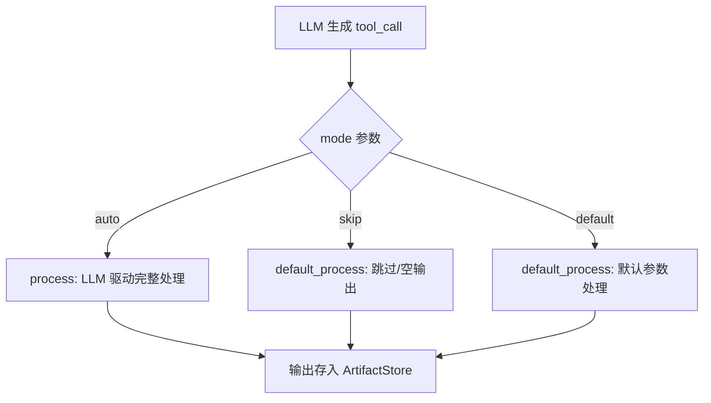
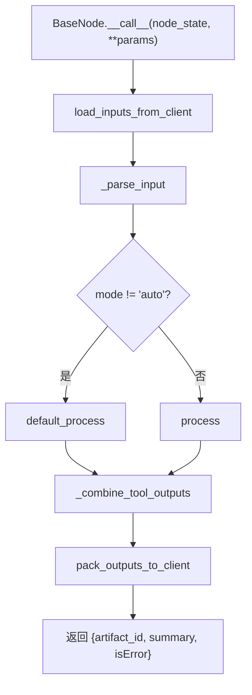
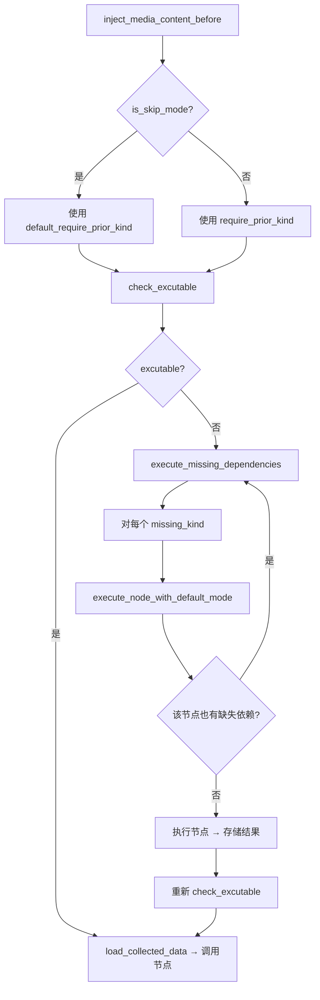

# PD-09.14 OpenStoryline — 三模式节点控制与 Prompt 驱动计划审批

> 文档编号：PD-09.14
> 来源：OpenStoryline `prompts/tasks/instruction/en/system.md` `src/open_storyline/nodes/node_schema.py` `src/open_storyline/mcp/hooks/node_interceptors.py`
> GitHub：https://github.com/FireRedTeam/FireRed-OpenStoryline.git
> 问题域：PD-09 Human-in-the-Loop
> 状态：可复用方案

---

## 第 1 章 问题与动机（≥ 30 行）

### 1.1 核心问题

在 AI 驱动的视频编辑流水线中，用户需要对 Agent 的行为拥有细粒度控制权。核心矛盾在于：

1. **自动化 vs 可控性**：11 步编辑管道（load_media → render_video）中，用户可能只想跳过某些步骤（如不要配音），或让某些步骤用默认参数快速通过
2. **依赖链完整性**：当用户跳过某个节点时，下游节点的前置依赖可能缺失，系统需要自动补全而不是报错
3. **计划先行**：Agent 不应直接执行工具，而应先向用户展示编辑计划，获得确认后再逐步执行
4. **对话式迭代**：用户在看到中间结果后可能要求修改（如"去掉配音"、"换个背景音乐"），系统需要支持多轮修改而不重新执行整个管道

### 1.2 OpenStoryline 的解法概述

OpenStoryline 采用**双层 HITL 架构**：Prompt 层强制 Agent 先展示计划再执行，Node 层通过三模式（auto/skip/default）让用户控制每个节点的执行策略。

1. **Prompt 驱动的计划审批**：系统提示词（`prompts/tasks/instruction/en/system.md:26-31`）明确要求 Agent 在首次编辑请求时先列出计划步骤，用户确认后才开始调用工具
2. **三模式节点控制**：每个节点的输入 schema 都包含 `mode: Literal["auto", "skip", "default"]` 字段（`node_schema.py:175-178`），LLM 根据用户意图选择模式
3. **递归依赖自动补全**：当节点以 skip/default 模式执行时，拦截器自动检测缺失依赖并以 default 模式递归执行前置节点（`node_interceptors.py:112-228`）
4. **会话级状态持久化**：ArtifactStore 按 session_id 隔离存储每个节点的执行结果（`agent_memory.py:23-28`），支持跨轮次复用中间产物
5. **对话式迭代修改**：用户可在后续对话中要求修改特定步骤，Agent 通过设置 mode=skip 跳过不需要的节点（`system.md:173-188`）

### 1.3 设计思想

| 设计原则 | 具体实现 | 理由 | 替代方案 |
|----------|----------|------|----------|
| Prompt 即合约 | 系统提示词硬编码"先计划后执行"规则 | 无需修改代码即可调整 HITL 行为，LLM 原生理解自然语言约束 | 代码级 interrupt（如 LangGraph interrupt()），但需要前端配合 |
| 模式即参数 | mode 字段作为工具参数由 LLM 填写 | LLM 根据对话上下文自主决定模式，无需额外的路由逻辑 | 独立的模式选择节点，但增加图复杂度 |
| 拦截器补全 | 缺失依赖时自动以 default 模式递归执行 | 用户跳过节点不会导致下游崩溃，保证管道完整性 | 要求用户手动执行所有前置节点，但体验差 |
| 会话隔离 | session_id + ArtifactStore 隔离状态 | 多用户并发安全，支持跨轮次复用 | 全局状态，但无法支持多用户 |

---

## 第 2 章 源码实现分析（≥ 60 行，核心章节）

### 2.1 架构概览

OpenStoryline 的 HITL 架构分为三层：Prompt 层（LLM 行为约束）、拦截器层（依赖补全与模式路由）、节点层（双路径执行）。

```
┌─────────────────────────────────────────────────────────┐
│                    CLI / Web 前端                         │
│  用户输入 → HumanMessage → Agent Loop → AIMessage 输出    │
└──────────────────────┬──────────────────────────────────┘
                       │
┌──────────────────────▼──────────────────────────────────┐
│              LangChain Agent (create_agent)              │
│  SystemMessage: "先列计划，用户确认后再调用工具"            │
│  middleware: [log_tool_request, handle_tool_errors]       │
│  tool_interceptors: [inject_media_content_before,        │
│                      save_media_content_after]            │
└──────────────────────┬──────────────────────────────────┘
                       │ tool_call(name, args={mode, ...})
┌──────────────────────▼──────────────────────────────────┐
│           ToolInterceptor.inject_media_content_before     │
│  1. 检测 mode → 选择依赖集                                │
│  2. check_excutable() → 缺失依赖?                        │
│  3. 递归 execute_missing_dependencies(default mode)       │
│  4. 注入 input_data → 调用真实节点                        │
└──────────────────────┬──────────────────────────────────┘
                       │
┌──────────────────────▼──────────────────────────────────┐
│              BaseNode.__call__(mode)                      │
│  mode == "auto" → process()    (LLM 驱动的完整处理)       │
│  mode != "auto" → default_process()  (轻量默认/跳过)      │
└─────────────────────────────────────────────────────────┘
```

### 2.2 核心实现

#### 2.2.1 三模式 Schema 定义



对应源码 `src/open_storyline/nodes/node_schema.py:174-178`：

```python
class BaseInput(BaseModel):
    mode: Literal["auto", "skip", "default"] = Field(
        default="auto",
        description="auto: Automatic mode; skip: Skip mode; default: Default mode"
    )
```

每个具体节点继承 BaseInput 并为 mode 字段提供语义化描述。例如 `SplitShotsInput`（`node_schema.py:206-212`）：

```python
class SplitShotsInput(BaseInput):
    mode: Literal["auto", "skip", "default"] = Field(
        default="auto",
        description="auto: Automatically segment shots based on scene changes, "
                    "treat images as single shots; "
                    "skip: Do not segment shots; "
                    "default: Use default segmentation method"
    )
    min_shot_duration: Annotated[int, Field(default=1000, ...)]
    max_shot_duration: Annotated[int, Field(default=10000, ...)]
```

#### 2.2.2 BaseNode 双路径分发



对应源码 `src/open_storyline/nodes/core_nodes/base_node.py:206-230`：

```python
async def __call__(self, node_state: NodeState, **params) -> Dict[str, Any]:
    try:
        mode = params.get("mode", "auto")
        inputs = self.load_inputs_from_client(node_state, params.copy())
        parsed_inputs = self._parse_input(node_state, inputs)

        if mode != 'auto':
            outputs = await self.default_process(node_state, parsed_inputs)
        else:
            outputs = await self.process(node_state, parsed_inputs)

        processed_outputs = self._combine_tool_outputs(node_state, outputs)
        packed_output = self.pack_outputs_to_client(node_state, processed_outputs)
        
        return {
            'artifact_id': node_state.artifact_id,
            'summary': node_state.node_summary.get_summary(node_state.artifact_id),
            'tool_excute_result': packed_output,
            'isError': False
        }
    except Exception as e:
        ...
```

#### 2.2.3 拦截器递归依赖补全



对应源码 `src/open_storyline/mcp/hooks/node_interceptors.py:86-232`：

```python
# 1. 根据 mode 选择依赖集
is_skip_mode = request.args.get('mode', 'auto') != 'auto'
require_kind = (
    meta_collector.id_to_default_require_prior_kind[node_id] 
    if is_skip_mode 
    else meta_collector.id_to_require_prior_kind[node_id]
)

# 2. 检查依赖是否满足
collect_result = meta_collector.check_excutable(session_id, store, require_kind)

# 3. 缺失时递归补全
if not collect_result['excutable']:
    missing_kinds = collect_result['missing_kind']
    await execute_missing_dependencies(missing_kinds, for_node_id=node_id)
    # 补全后重新收集
    collect_result = meta_collector.check_excutable(session_id, store, require_kind)
    load_collected_data(collect_result['collected_node'], input_data, store)
```

递归执行缺失节点时，始终使用 default 模式（`node_interceptors.py:181-184`）：

```python
tool_call_input = {
    'artifact_id': store.generate_artifact_id(miss_id),
    'mode': 'default'
}
```

### 2.3 实现细节

#### Prompt 层计划审批

系统提示词（`prompts/tasks/instruction/en/system.md:26-33`）定义了严格的"先计划后执行"协议：

```markdown
### 1) First editing request: plan first, then execute

When the user makes an initial request like "help me edit / process my footage":
1. First, list your planned steps in natural language (Markdown format),
   including how you'll use the given tools and why each step is needed;
2. Only start calling tools after the user confirms.
```

这是一种**纯 Prompt 驱动的 HITL**——不依赖任何代码级中断机制（如 LangGraph interrupt），而是通过自然语言约束 LLM 行为。LLM 在首次请求时输出 Markdown 计划，等待用户回复确认后才开始调用工具。

#### 对话式迭代修改

系统提示词还定义了修改协议（`system.md:173-188`）。当用户说"去掉配音"时，Agent 理解意图后调用 `generate_voiceover` 工具并设置 `mode=skip`。这种设计让修改操作复用了同一套工具接口，无需额外的"撤销"或"回滚"机制。

#### NodeManager 依赖图

`NodeManager`（`node_manager.py:11-168`）维护了完整的节点依赖图：

- `id_to_require_prior_kind`：auto 模式下的完整依赖列表
- `id_to_default_require_prior_kind`：default/skip 模式下的最小依赖列表
- `kind_to_node_ids`：同一 kind 可有多个实现（按 priority 排序），拦截器按优先级尝试

例如 `FilterClipsNode`（`filter_clips.py:14-22`）：

```python
meta = NodeMeta(
    name="filter_clips",
    node_id="filter_clips",
    node_kind="filter_clips",
    require_prior_kind=['split_shots', 'understand_clips'],      # auto 需要完整依赖
    default_require_prior_kind=['split_shots', 'understand_clips'], # default 也需要
    next_available_node=['group_clips', 'group_clips_pro'],
)
```

而 `GenerateScriptNode`（`generate_script.py:13-22`）展示了差异化依赖：

```python
meta = NodeMeta(
    name="generate_script",
    node_id="generate_script",
    node_kind="generate_script",
    require_prior_kind=['split_shots', 'group_clips', 'understand_clips'],  # auto 需要 3 个
    default_require_prior_kind=['split_shots', 'group_clips'],              # default 只需 2 个
    next_available_node=['generate_voiceover'],
)
```

#### 中间件管道

Agent 构建时注册了两层中间件（`agent.py:119-125`）：

```python
agent = create_agent(
    model=llm,
    tools=tools + skills,
    middleware=[log_tool_request, handle_tool_errors],
    store=store,
    context_schema=ClientContext,
)
```

- `log_tool_request`（`chat_middleware.py:94-207`）：记录工具调用事件（tool_start/tool_end），脱敏 API key，通过 contextvars 的 `_MCP_LOG_SINK` 推送到 GUI
- `handle_tool_errors`（`chat_middleware.py:223-268`）：捕获异常并返回结构化错误消息，引导 LLM 自行修复参数或重试


---

## 第 3 章 迁移指南（≥ 40 行）

### 3.1 迁移清单

**阶段 1：三模式 Schema**

- [ ] 定义 `BaseInput` 基类，包含 `mode: Literal["auto", "skip", "default"]` 字段
- [ ] 每个节点的 Input Schema 继承 BaseInput，为 mode 提供语义化 description
- [ ] 在节点基类的 `__call__` 中根据 mode 分发到 `process()` 或 `default_process()`

**阶段 2：依赖图与拦截器**

- [ ] 实现 NodeManager，维护 `require_prior_kind` 和 `default_require_prior_kind` 两套依赖
- [ ] 实现 ArtifactStore，按 session_id 隔离存储节点执行结果
- [ ] 实现拦截器 `inject_before`：检测 mode → 选择依赖集 → check_excutable → 递归补全

**阶段 3：Prompt 层计划审批**

- [ ] 在系统提示词中添加"先计划后执行"规则
- [ ] 定义严格的响应格式：每次回复只能是工具调用或自然语言（不混合）
- [ ] 添加迭代修改示例（如 mode=skip 跳过步骤）

### 3.2 适配代码模板

#### 三模式基类

```python
from abc import ABC, abstractmethod
from typing import Any, Dict, Literal
from pydantic import BaseModel, Field

class BaseInput(BaseModel):
    mode: Literal["auto", "skip", "default"] = Field(
        default="auto",
        description="auto: Full processing; skip: Skip entirely; default: Lightweight defaults"
    )

class BaseNode(ABC):
    @abstractmethod
    async def process(self, state, inputs: Dict[str, Any]) -> Any:
        """Full LLM-driven processing (auto mode)"""
        ...

    @abstractmethod
    async def default_process(self, state, inputs: Dict[str, Any]) -> Any:
        """Lightweight/skip processing (skip/default mode)"""
        ...

    async def __call__(self, state, **params) -> Dict[str, Any]:
        mode = params.get("mode", "auto")
        if mode != "auto":
            outputs = await self.default_process(state, params)
        else:
            outputs = await self.process(state, params)
        return {"result": outputs, "is_error": False}
```

#### 递归依赖补全拦截器

```python
from typing import List, Dict, Set

class DependencyResolver:
    def __init__(self, node_registry, artifact_store):
        self.registry = node_registry
        self.store = artifact_store

    async def resolve(self, node_id: str, mode: str, session_id: str):
        """Resolve and auto-execute missing dependencies."""
        is_skip = mode != "auto"
        deps = (
            self.registry.get_default_deps(node_id) if is_skip
            else self.registry.get_full_deps(node_id)
        )
        
        missing = self._check_missing(deps, session_id)
        if missing:
            await self._execute_missing(missing, session_id, depth=0)
        
        return self._collect_outputs(deps, session_id)

    async def _execute_missing(
        self, missing_kinds: List[str], session_id: str, depth: int
    ):
        for kind in missing_kinds:
            node_id = self.registry.get_primary_node(kind)
            # Check if this node also has missing deps (recursive)
            sub_deps = self.registry.get_default_deps(node_id)
            sub_missing = self._check_missing(sub_deps, session_id)
            if sub_missing:
                await self._execute_missing(sub_missing, session_id, depth + 1)
            # Execute with default mode
            await self.registry.execute(node_id, mode="default", session_id=session_id)

    def _check_missing(self, deps: List[str], session_id: str) -> List[str]:
        return [d for d in deps if not self.store.has_result(d, session_id)]

    def _collect_outputs(self, deps: List[str], session_id: str) -> Dict:
        return {d: self.store.get_latest(d, session_id) for d in deps}
```

### 3.3 适用场景

| 场景 | 适用度 | 说明 |
|------|--------|------|
| 多步骤 AI 管道（视频/音频/文档处理） | ⭐⭐⭐ | 天然适合有固定流水线的场景，用户可跳过/定制每一步 |
| 对话式 Agent（通用问答） | ⭐ | 通用对话没有固定管道，三模式设计过重 |
| 工作流编排（LangGraph/Prefect） | ⭐⭐⭐ | 可直接映射为图节点的 mode 参数 |
| CI/CD 管道 | ⭐⭐ | 可用于可选步骤（如跳过 lint），但 CI 通常不需要对话式交互 |
| 多 Agent 协作 | ⭐⭐ | 每个 Agent 可作为一个节点，mode 控制是否启用 |

---

## 第 4 章 测试用例（≥ 20 行）

```python
import pytest
from unittest.mock import AsyncMock, MagicMock
from typing import Any, Dict

# --- Test BaseNode mode dispatch ---

class MockNode:
    """Simulates BaseNode.__call__ dispatch logic"""
    async def process(self, state, inputs):
        return {"result": "full_processing", "clips": inputs.get("clips", [])}

    async def default_process(self, state, inputs):
        return {"result": "default_passthrough", "clips": []}

    async def __call__(self, state, **params):
        mode = params.get("mode", "auto")
        if mode != "auto":
            return await self.default_process(state, params)
        return await self.process(state, params)


class TestModeDispatch:
    @pytest.mark.asyncio
    async def test_auto_mode_calls_process(self):
        node = MockNode()
        result = await node(None, mode="auto", clips=["c1", "c2"])
        assert result["result"] == "full_processing"
        assert result["clips"] == ["c1", "c2"]

    @pytest.mark.asyncio
    async def test_skip_mode_calls_default_process(self):
        node = MockNode()
        result = await node(None, mode="skip")
        assert result["result"] == "default_passthrough"
        assert result["clips"] == []

    @pytest.mark.asyncio
    async def test_default_mode_calls_default_process(self):
        node = MockNode()
        result = await node(None, mode="default")
        assert result["result"] == "default_passthrough"


# --- Test dependency resolution ---

class TestDependencyCheck:
    def test_all_deps_satisfied(self):
        """When all required kinds have artifacts, excutable=True"""
        store = MagicMock()
        store.get_latest_meta.return_value = MagicMock(created_at=1.0)
        
        manager = MagicMock()
        manager.kind_to_node_ids = {"split_shots": ["split_shots"], "understand_clips": ["understand_clips"]}
        
        # Simulate check_excutable logic
        all_require = ["split_shots", "understand_clips"]
        collected = {}
        for kind in all_require:
            output = store.get_latest_meta(node_id=manager.kind_to_node_ids[kind][0], session_id="s1")
            if output:
                collected[kind] = output
        
        assert len(collected) == len(all_require)

    def test_missing_deps_detected(self):
        """When a required kind has no artifact, it appears in missing_kind"""
        all_require = ["split_shots", "understand_clips"]
        collected_kinds = {"split_shots"}  # only one satisfied
        missing = list(set(all_require) - collected_kinds)
        assert "understand_clips" in missing

    def test_mode_selects_correct_deps(self):
        """skip mode uses default_require, auto uses full require"""
        full_deps = ["split_shots", "group_clips", "understand_clips"]
        default_deps = ["split_shots", "group_clips"]
        
        # auto mode
        mode = "auto"
        selected = default_deps if mode != "auto" else full_deps
        assert len(selected) == 3
        
        # skip mode
        mode = "skip"
        selected = default_deps if mode != "auto" else full_deps
        assert len(selected) == 2


# --- Test Prompt-driven plan approval ---

class TestPromptPlanApproval:
    def test_system_prompt_contains_plan_first_rule(self):
        """System prompt must enforce plan-before-execute"""
        system_prompt = (
            "When the user makes an initial request:\n"
            "1. First, list your planned steps in natural language;\n"
            "2. Only start calling tools after the user confirms."
        )
        assert "list your planned steps" in system_prompt
        assert "after the user confirms" in system_prompt

    def test_response_format_is_exclusive(self):
        """Each reply must be exactly one of: tool call OR natural language"""
        # Simulating the constraint
        response_types = ["tool_call", "natural_language"]
        # A valid response picks exactly one
        response = "natural_language"
        assert response in response_types
```


---

## 第 5 章 跨域关联

| 关联域 | 关系类型 | 说明 |
|--------|----------|------|
| PD-04 工具系统 | 依赖 | 三模式控制通过 MCP 工具的 mode 参数实现，依赖工具注册系统将 BaseNode 转换为 MCP Tool |
| PD-10 中间件管道 | 协同 | log_tool_request 和 handle_tool_errors 中间件为 HITL 提供可观测性和错误恢复能力 |
| PD-06 记忆持久化 | 依赖 | ArtifactStore 的 session 级持久化是依赖补全和跨轮次复用的基础 |
| PD-02 多 Agent 编排 | 协同 | NodeManager 的依赖图本质上是一个 DAG 编排器，递归补全等价于自动执行子图 |
| PD-03 容错与重试 | 协同 | handle_tool_errors 中间件捕获异常并引导 LLM 重试，拦截器中 ToolException 触发候选节点降级 |
| PD-01 上下文管理 | 协同 | 系统提示词中的计划审批规则占用上下文窗口，多轮对话中 messages 列表持续增长需要管理 |

---

## 第 6 章 来源文件索引

| 文件 | 行范围 | 关键实现 |
|------|--------|----------|
| `prompts/tasks/instruction/en/system.md` | L1-L188 | 系统提示词：计划审批规则、响应格式约束、迭代修改示例 |
| `src/open_storyline/nodes/node_schema.py` | L174-L178 | BaseInput 三模式定义（auto/skip/default） |
| `src/open_storyline/nodes/node_schema.py` | L206-L212 | SplitShotsInput 语义化 mode 描述示例 |
| `src/open_storyline/nodes/core_nodes/base_node.py` | L20-L51 | NodeMeta 数据类：双依赖列表定义 |
| `src/open_storyline/nodes/core_nodes/base_node.py` | L206-L245 | BaseNode.__call__：mode 分发到 process/default_process |
| `src/open_storyline/mcp/hooks/node_interceptors.py` | L40-L249 | ToolInterceptor：模式检测、依赖检查、递归补全 |
| `src/open_storyline/mcp/hooks/node_interceptors.py` | L86-L92 | is_skip_mode 判断与依赖集选择 |
| `src/open_storyline/mcp/hooks/node_interceptors.py` | L112-L228 | execute_missing_dependencies 递归补全 |
| `src/open_storyline/nodes/node_manager.py` | L11-L168 | NodeManager：依赖图构建、check_excutable、优先级排序 |
| `src/open_storyline/mcp/hooks/chat_middleware.py` | L94-L207 | log_tool_request：工具调用日志与脱敏 |
| `src/open_storyline/mcp/hooks/chat_middleware.py` | L223-L268 | handle_tool_errors：异常捕获与结构化错误消息 |
| `src/open_storyline/agent.py` | L35-L126 | build_agent：Agent 构建、中间件注册、拦截器注入 |
| `src/open_storyline/storage/agent_memory.py` | L23-L152 | ArtifactStore：session 级持久化、get_latest_meta |
| `src/open_storyline/mcp/register_tools.py` | L21-L89 | create_tool_wrapper：BaseNode → MCP Tool 转换 |
| `src/open_storyline/nodes/core_nodes/filter_clips.py` | L12-L51 | FilterClipsNode：process vs default_process 实现示例 |
| `src/open_storyline/nodes/core_nodes/generate_script.py` | L12-L22 | GenerateScriptNode：差异化依赖（auto 3 个 vs default 2 个） |
| `cli.py` | L28-L99 | CLI 入口：多轮对话循环、消息管理 |

---

## 第 7 章 横向对比维度

> **重要：** 本章用于自动填充 Butcher Wiki 的横向对比表。

```json comparison_data
{
  "project": "OpenStoryline",
  "dimensions": {
    "暂停机制": "Prompt 驱动：系统提示词要求 Agent 先输出 Markdown 计划，用户文字确认后才调用工具，无代码级 interrupt",
    "澄清类型": "自然语言对话式：Agent 用 Markdown 展示计划，用户用自然语言确认或修改",
    "状态持久化": "ArtifactStore 按 session_id + node_id 隔离存储 JSON，支持跨轮次复用",
    "实现层级": "三层：Prompt 层（计划审批）+ 拦截器层（依赖补全）+ 节点层（mode 分发）",
    "自动跳过机制": "三模式 mode 参数（auto/skip/default），LLM 根据对话上下文自主选择",
    "操作边界声明": "系统提示词声明 Agent 只能使用可用工具列表中的工具，不可用时必须告知用户",
    "多轮交互支持": "CLI while-True 循环 + messages 列表累积，支持无限轮次对话式迭代修改",
    "自动确认降级": "拦截器自动以 default 模式递归执行缺失依赖，无需用户手动确认前置步骤",
    "审查粒度控制": "节点级：每个节点独立的 mode 参数，用户可逐节点控制执行策略",
    "递归依赖补全": "拦截器检测缺失 kind 后递归执行前置节点（default 模式），按 priority 尝试候选实现"
  }
}
```

### 域元数据补充

```json domain_metadata
{
  "solution_summary": "OpenStoryline 通过 Prompt 层强制 Agent 先展示 Markdown 计划再执行，Node 层三模式（auto/skip/default）参数让 LLM 自主选择执行策略，拦截器递归补全缺失依赖",
  "description": "Prompt 驱动的计划审批与参数化节点模式控制的轻量级 HITL 方案",
  "sub_problems": [
    "Prompt 驱动 vs 代码驱动 HITL：纯靠系统提示词约束 LLM 行为的可靠性与可审计性权衡",
    "递归依赖补全深度控制：缺失依赖链过长时的递归深度限制与性能影响",
    "三模式语义一致性：不同节点对 skip 和 default 的语义定义不统一时的用户困惑",
    "计划与执行的一致性验证：Agent 展示的计划与实际工具调用序列不一致时的检测机制"
  ],
  "best_practices": [
    "mode 作为工具参数而非图拓扑：将执行模式编码为工具参数让 LLM 自主决策，避免修改图结构",
    "双依赖集设计：auto 和 default 模式使用不同的依赖列表，skip 时只需最小依赖集",
    "拦截器层自动补全优于用户手动执行：缺失依赖时静默以 default 模式递归执行，不打断用户流程"
  ]
}
```

