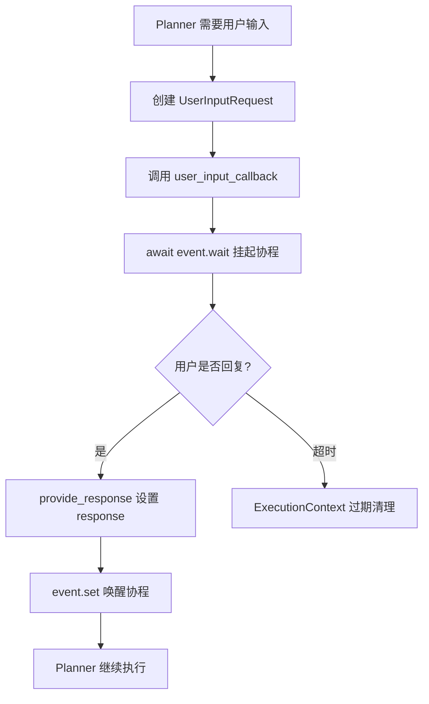
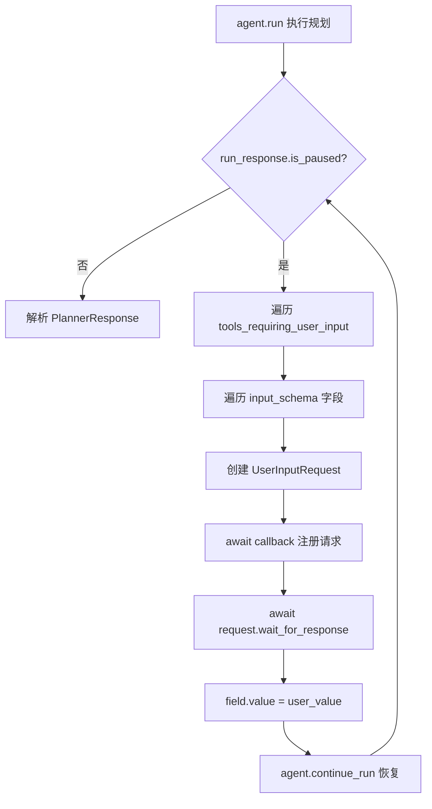
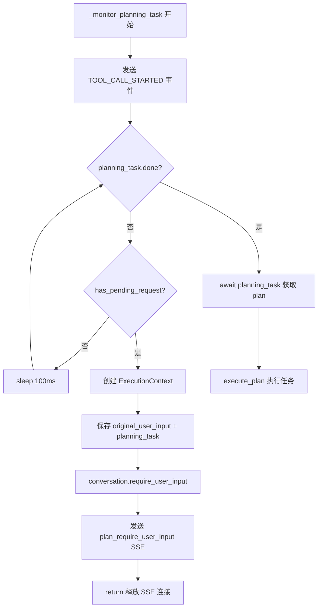

# PD-09.06 ValueCell — asyncio.Event 驱动的 HITL 暂停恢复机制

> 文档编号：PD-09.06
> 来源：ValueCell `python/valuecell/core/plan/planner.py`, `python/valuecell/core/coordinate/orchestrator.py`
> GitHub：https://github.com/ValueCell-ai/valuecell.git
> 问题域：PD-09 Human-in-the-Loop
> 状态：可复用方案

---

## 第 1 章 问题与动机

### 1.1 核心问题

在 Agent 编排系统中，Planner 将用户请求分解为可执行任务时，经常遇到信息不足的情况——用户的意图模糊、缺少关键参数（如定时任务的频率）、或需要确认危险操作。此时系统需要：

1. **非阻塞暂停**：Planner 暂停执行但不阻塞事件循环，其他会话可继续处理
2. **状态保持**：暂停期间保存完整的执行上下文（规划任务、原始输入、回调函数）
3. **身份校验**：恢复时验证是同一用户在回复，防止跨会话重放
4. **超时清理**：用户长时间不响应时自动过期清理，避免资源泄漏
5. **多轮交互**：支持 Planner 连续多次请求用户输入，而非仅一次

传统方案用 `threading.Event` 或数据库轮询，前者阻塞线程、后者延迟高。ValueCell 选择了 `asyncio.Event` 作为核心同步原语，配合 SSE 推送实现了零阻塞的 HITL 流程。

### 1.2 ValueCell 的解法概述

1. **UserInputRequest 信号对象**：封装 `asyncio.Event` + prompt + response，Planner 创建后 `await event.wait()` 暂停，外部调用 `provide_response()` 唤醒（`planner.py:37-72`）
2. **UserInputRegistry 注册表**：以 `conversation_id` 为键的内存字典，管理所有待处理的用户输入请求（`service.py:26-50`）
3. **ExecutionContext 上下文快照**：保存暂停时的 stage、conversation_id、thread_id、user_id 和任意 metadata，支持 TTL 过期检测和用户身份校验（`orchestrator.py:31-65`）
4. **Orchestrator 轮询监控**：`_monitor_planning_task` 以 100ms 间隔轮询 `has_pending_request()`，发现暂停后保存上下文、推送 SSE 事件、返回控制权（`orchestrator.py:419-510`）
5. **ConversationStatus 三态机**：ACTIVE → REQUIRE_USER_INPUT → ACTIVE，驱动 Orchestrator 在恢复时走 `_handle_conversation_continuation` 分支（`models.py:8-13`）

### 1.3 设计思想

| 设计原则 | 具体实现 | 理由 | 替代方案 |
|----------|----------|------|----------|
| 非阻塞等待 | `asyncio.Event.wait()` 挂起协程 | 不占线程，事件循环可服务其他请求 | `threading.Event`（阻塞线程） |
| 信号对象模式 | `UserInputRequest` 封装 prompt/response/event | 单一职责，Planner 只关心等待和获取结果 | 直接在 Planner 中轮询数据库 |
| 注册表解耦 | `UserInputRegistry` 按 conversation_id 索引 | Planner 和 Orchestrator 通过注册表间接通信 | Planner 直接持有 Orchestrator 引用 |
| 上下文快照 | `ExecutionContext` 保存 asyncio.Task 引用 | 恢复时无需重新创建规划任务 | 序列化到数据库（asyncio.Task 不可序列化） |
| TTL 过期 | `is_expired()` 基于事件循环时钟 | 避免僵尸上下文占用内存 | 外部定时器清理 |

---

## 第 2 章 源码实现分析

### 2.1 架构概览

ValueCell 的 HITL 实现分布在 4 层：

```
┌─────────────────────────────────────────────────────────────┐
│                    FastAPI SSE Endpoint                       │
│              POST /agents/stream (agent_stream.py)           │
├─────────────────────────────────────────────────────────────┤
│                   AgentOrchestrator                          │
│  ┌──────────────┐  ┌──────────────┐  ┌──────────────────┐  │
│  │ _handle_new  │  │ _monitor_    │  │ _handle_conver-  │  │
│  │ _request()   │→ │ planning_    │  │ sation_contin-   │  │
│  │              │  │ task()       │  │ uation()         │  │
│  └──────────────┘  └──────┬───────┘  └────────┬─────────┘  │
│                           │                    │             │
│  ┌────────────────────────┴────────────────────┘             │
│  │  ExecutionContext (stage, user_id, metadata, TTL)         │
│  └───────────────────────────────────────────────            │
├─────────────────────────────────────────────────────────────┤
│                      PlanService                             │
│  ┌──────────────────┐  ┌──────────────────────────┐         │
│  │ UserInputRegistry│  │ start_planning_task()     │         │
│  │ {conv_id: req}   │  │ → asyncio.create_task()   │         │
│  └──────────────────┘  └──────────────────────────┘         │
├─────────────────────────────────────────────────────────────┤
│                   ExecutionPlanner                            │
│  ┌──────────────────────────────────────────────────┐       │
│  │ UserInputRequest(prompt, response, asyncio.Event) │       │
│  │ → await event.wait() → provide_response() → set()│       │
│  └──────────────────────────────────────────────────┘       │
├─────────────────────────────────────────────────────────────┤
│                ConversationService                            │
│  ConversationStatus: ACTIVE ↔ REQUIRE_USER_INPUT             │
└─────────────────────────────────────────────────────────────┘
```

### 2.2 核心实现

#### 2.2.1 UserInputRequest — asyncio.Event 信号对象



对应源码 `python/valuecell/core/plan/planner.py:37-72`：

```python
class UserInputRequest:
    """
    Represents a request for user input during plan creation or execution.
    This class uses asyncio.Event to enable non-blocking waiting for user responses
    in the Human-in-the-Loop workflow.
    """

    def __init__(self, prompt: str):
        self.prompt = prompt
        self.response: Optional[str] = None
        self.event = asyncio.Event()

    async def wait_for_response(self) -> str:
        """Block until a response is provided and return it."""
        await self.event.wait()
        return self.response

    def provide_response(self, response: str):
        """Supply the user's response and wake any waiter."""
        self.response = response
        self.event.set()
```

关键设计：`asyncio.Event` 是协程级同步原语，`await event.wait()` 只挂起当前协程，不阻塞事件循环。`provide_response` 可从任意协程调用，实现跨协程通信。

#### 2.2.2 Planner 的 HITL 循环



对应源码 `python/valuecell/core/plan/planner.py:231-248`：

```python
# Handle user input requests through Human-in-the-Loop workflow
while run_response.is_paused:
    for tool in run_response.tools_requiring_user_input:
        input_schema = tool.user_input_schema

        for field in input_schema:
            request = UserInputRequest(field.description)
            await user_input_callback(request)
            user_value = await request.wait_for_response()
            field.value = user_value

    # Continue agent execution with updated inputs
    run_response = agent.continue_run(
        run_response=run_response,
        updated_tools=run_response.tools,
    )

    if not run_response.is_paused:
        break
```

这段代码展示了 Agno 框架的 `UserControlFlowTools` 集成：当 LLM Agent 调用需要用户输入的工具时，`run_response.is_paused` 为 True，Planner 逐字段请求用户输入，收集完毕后调用 `agent.continue_run` 恢复 Agent 执行。

#### 2.2.3 Orchestrator 的监控与上下文保存



对应源码 `python/valuecell/core/coordinate/orchestrator.py:456-478`：

```python
while not planning_task.done():
    if self.plan_service.has_pending_request(conversation_id):
        # Save planning context
        context = ExecutionContext(
            "planning", conversation_id, thread_id, user_id
        )
        context.add_metadata(
            original_user_input=user_input,
            planning_task=planning_task,
            planner_callback=callback,
        )
        self._execution_contexts[conversation_id] = context

        # Update conversation status and send user input request
        await self.conversation_service.require_user_input(conversation_id)
        prompt = self.plan_service.get_request_prompt(conversation_id) or ""
        response = self.event_service.factory.plan_require_user_input(
            conversation_id, thread_id, prompt,
        )
        yield await self.event_service.emit(response)
        return
    await asyncio.sleep(ASYNC_SLEEP_INTERVAL)
```

### 2.3 实现细节

#### ExecutionContext 的 TTL 与身份校验

`ExecutionContext`（`orchestrator.py:31-65`）使用事件循环时钟而非 `datetime.now()`，避免系统时钟调整导致的误判：

```python
class ExecutionContext:
    def __init__(self, stage, conversation_id, thread_id, user_id):
        self.stage = stage
        self.conversation_id = conversation_id
        self.thread_id = thread_id
        self.user_id = user_id
        self.created_at = asyncio.get_event_loop().time()
        self.metadata: Dict = {}

    def is_expired(self, max_age_seconds=3600) -> bool:
        current_time = asyncio.get_event_loop().time()
        return current_time - self.created_at > max_age_seconds

    def validate_user(self, user_id: str) -> bool:
        return self.user_id == user_id
```

恢复时的三重校验（`orchestrator.py:512-529`）：
1. `context.stage` 非空 — 确保上下文完整
2. `context.validate_user(user_id)` — 防止跨用户重放
3. `context.is_expired()` — 默认 1 小时 TTL

#### ConversationStatus 三态驱动

`ConversationStatus`（`conversation/models.py:8-13`）定义了三个状态：

- `ACTIVE`：正常处理中
- `REQUIRE_USER_INPUT`：等待用户回复
- `INACTIVE`：会话结束

Orchestrator 在 `_generate_responses`（`orchestrator.py:199-207`）中根据状态分流：

```python
if conversation.status == ConversationStatus.REQUIRE_USER_INPUT:
    async for response in self._handle_conversation_continuation(user_input):
        yield response
else:
    async for response in self._handle_new_request(user_input):
        yield response
```

#### Planner 的 adequate/guidance_message 双信号

除了 `UserControlFlowTools` 的工具级暂停，ValueCell 还实现了 Planner 级的"软暂停"：当 `PlannerResponse.adequate == false` 时，返回 `guidance_message` 提示用户补充信息（`planner.py:266-270`）。这种双层暂停机制覆盖了两种场景：

- **工具级暂停**：Agno 框架的 `is_paused` 机制，用于结构化字段收集
- **Planner 级暂停**：`adequate: false` + `guidance_message`，用于自然语言澄清（如"请确认定时频率"）


---

## 第 3 章 迁移指南

### 3.1 迁移清单

**阶段 1：核心信号对象（1 个文件）**
- [ ] 实现 `UserInputRequest` 类：`asyncio.Event` + prompt + response
- [ ] 确保 `provide_response` 线程安全（`asyncio.Event.set()` 本身是线程安全的）

**阶段 2：注册表与服务层（2 个文件）**
- [ ] 实现 `UserInputRegistry`：`Dict[str, UserInputRequest]` 内存注册表
- [ ] 封装为 `PlanService`，暴露 `register_user_input` / `has_pending_request` / `provide_user_response` / `clear_pending_request`

**阶段 3：执行上下文（1 个文件）**
- [ ] 实现 `ExecutionContext`：stage + conversation_id + user_id + TTL
- [ ] 添加 `validate_user()` 身份校验
- [ ] 添加 `is_expired()` 基于 `asyncio.get_event_loop().time()`

**阶段 4：Orchestrator 集成（1 个文件）**
- [ ] 在规划监控循环中检测 `has_pending_request`
- [ ] 保存 `ExecutionContext` 到 `_execution_contexts` 字典
- [ ] 实现 `_handle_conversation_continuation` 恢复分支
- [ ] 实现 `_continue_planning` 多轮交互支持
- [ ] 添加 `_cleanup_expired_contexts` 定期清理

**阶段 5：前端集成（SSE 事件）**
- [ ] 定义 `PLAN_REQUIRE_USER_INPUT` 事件类型
- [ ] 前端监听该事件，展示输入框
- [ ] 用户回复后发送到同一 `conversation_id`

### 3.2 适配代码模板

以下是一个可直接运行的最小化 HITL 实现：

```python
import asyncio
from typing import Optional, Dict, Callable, Awaitable
from dataclasses import dataclass, field


class UserInputRequest:
    """asyncio.Event 驱动的用户输入请求信号。"""

    def __init__(self, prompt: str):
        self.prompt = prompt
        self.response: Optional[str] = None
        self.event = asyncio.Event()

    async def wait_for_response(self) -> str:
        await self.event.wait()
        return self.response

    def provide_response(self, response: str):
        self.response = response
        self.event.set()


class UserInputRegistry:
    """按 session_id 索引的待处理请求注册表。"""

    def __init__(self):
        self._pending: Dict[str, UserInputRequest] = {}

    def register(self, session_id: str, request: UserInputRequest):
        self._pending[session_id] = request

    def has_pending(self, session_id: str) -> bool:
        return session_id in self._pending

    def get_prompt(self, session_id: str) -> Optional[str]:
        req = self._pending.get(session_id)
        return req.prompt if req else None

    def resolve(self, session_id: str, response: str) -> bool:
        if session_id not in self._pending:
            return False
        req = self._pending.pop(session_id)
        req.provide_response(response)
        return True

    def clear(self, session_id: str):
        self._pending.pop(session_id, None)


@dataclass
class ExecutionContext:
    """暂停执行的上下文快照。"""
    stage: str
    session_id: str
    user_id: str
    created_at: float = field(default_factory=lambda: asyncio.get_event_loop().time())
    metadata: Dict = field(default_factory=dict)

    def is_expired(self, max_age: int = 3600) -> bool:
        return asyncio.get_event_loop().time() - self.created_at > max_age

    def validate_user(self, user_id: str) -> bool:
        return self.user_id == user_id


# 使用示例
async def planner_with_hitl(
    query: str,
    session_id: str,
    registry: UserInputRegistry,
    on_need_input: Callable[[UserInputRequest], Awaitable[None]],
) -> str:
    """模拟 Planner 在需要澄清时暂停。"""
    if "定时" in query and "频率" not in query:
        request = UserInputRequest("请指定定时频率（如：每小时、每天 9:00）")
        await on_need_input(request)
        registry.register(session_id, request)
        frequency = await request.wait_for_response()
        return f"已创建定时任务：{query}，频率：{frequency}"
    return f"已创建任务：{query}"
```

### 3.3 适用场景

| 场景 | 适用度 | 说明 |
|------|--------|------|
| 单进程 asyncio 服务 | ⭐⭐⭐ | 完美适配，`asyncio.Event` 零开销 |
| 多进程部署 | ⭐⭐ | 需要将 `UserInputRegistry` 替换为 Redis/DB，`asyncio.Event` 无法跨进程 |
| 长时间暂停（>1h） | ⭐⭐ | 内存中的 `ExecutionContext` 和 `asyncio.Task` 不可持久化，进程重启后丢失 |
| 多轮连续澄清 | ⭐⭐⭐ | `_continue_planning` 支持循环检测 `has_pending_request` |
| 需要审批链的场景 | ⭐ | 当前仅支持单用户回复，无多人审批路由 |

---

## 第 4 章 测试用例

```python
import asyncio
import pytest


class TestUserInputRequest:
    """测试 asyncio.Event 驱动的用户输入请求。"""

    @pytest.mark.asyncio
    async def test_normal_flow(self):
        """正常路径：创建请求 → 等待 → 提供响应 → 获取结果。"""
        request = UserInputRequest("请输入频率")

        async def delayed_response():
            await asyncio.sleep(0.05)
            request.provide_response("每小时")

        asyncio.create_task(delayed_response())
        result = await request.wait_for_response()
        assert result == "每小时"
        assert request.response == "每小时"

    @pytest.mark.asyncio
    async def test_immediate_response(self):
        """边界：响应在等待之前就已提供。"""
        request = UserInputRequest("确认操作")
        request.provide_response("确认")
        result = await request.wait_for_response()
        assert result == "确认"

    @pytest.mark.asyncio
    async def test_multiple_waiters_not_supported(self):
        """asyncio.Event 支持多个 waiter，但 UserInputRequest 语义上只有一个。"""
        request = UserInputRequest("输入")
        results = []

        async def waiter():
            r = await request.wait_for_response()
            results.append(r)

        t1 = asyncio.create_task(waiter())
        t2 = asyncio.create_task(waiter())
        await asyncio.sleep(0.01)
        request.provide_response("答案")
        await asyncio.gather(t1, t2)
        assert results == ["答案", "答案"]


class TestUserInputRegistry:
    """测试注册表的 CRUD 操作。"""

    def test_register_and_resolve(self):
        registry = UserInputRegistry()
        request = UserInputRequest("prompt")
        registry.register("session-1", request)

        assert registry.has_pending("session-1")
        assert registry.get_prompt("session-1") == "prompt"
        assert not registry.has_pending("session-2")

        result = registry.resolve("session-1", "answer")
        assert result is True
        assert not registry.has_pending("session-1")
        assert request.response == "answer"

    def test_resolve_nonexistent(self):
        registry = UserInputRegistry()
        assert registry.resolve("no-such-session", "x") is False

    def test_clear(self):
        registry = UserInputRegistry()
        request = UserInputRequest("prompt")
        registry.register("s1", request)
        registry.clear("s1")
        assert not registry.has_pending("s1")


class TestExecutionContext:
    """测试执行上下文的 TTL 和身份校验。"""

    @pytest.mark.asyncio
    async def test_not_expired(self):
        ctx = ExecutionContext(stage="planning", session_id="s1", user_id="u1")
        assert not ctx.is_expired(max_age=3600)

    @pytest.mark.asyncio
    async def test_expired(self):
        ctx = ExecutionContext(stage="planning", session_id="s1", user_id="u1")
        ctx.created_at = asyncio.get_event_loop().time() - 7200
        assert ctx.is_expired(max_age=3600)

    def test_validate_user(self):
        ctx = ExecutionContext(stage="planning", session_id="s1", user_id="u1")
        assert ctx.validate_user("u1")
        assert not ctx.validate_user("u2")
```


---

## 第 5 章 跨域关联

| 关联域 | 关系类型 | 说明 |
|--------|----------|------|
| PD-02 多 Agent 编排 | 依赖 | HITL 暂停发生在 Planner 阶段，Planner 是编排流程的入口；`ExecutionContext` 保存的 `planning_task` 是 asyncio.Task，与编排调度深度耦合 |
| PD-06 记忆持久化 | 协同 | `ConversationService` 将 `plan_require_user_input` 事件持久化为 `ConversationItem`，恢复时可从历史记录重建上下文 |
| PD-01 上下文管理 | 协同 | Planner Agent 配置了 `num_history_runs=5` + `read_chat_history=True`，恢复后的 `agent.continue_run` 依赖历史上下文理解用户确认意图 |
| PD-03 容错与重试 | 协同 | `ExecutionContext.is_expired()` 提供 TTL 过期清理；`_cancel_execution` 在上下文失效时取消 planning_task 并重置会话状态 |
| PD-11 可观测性 | 协同 | 每次暂停/恢复都通过 `EventResponseService.emit()` 发送结构化事件，可用于追踪 HITL 交互频率和响应时间 |

---

## 第 6 章 来源文件索引

| 文件 | 行范围 | 关键实现 |
|------|--------|----------|
| `python/valuecell/core/plan/planner.py` | L37-L72 | `UserInputRequest` 类：asyncio.Event 信号对象 |
| `python/valuecell/core/plan/planner.py` | L132-L174 | `ExecutionPlanner.create_plan()`：接受 `user_input_callback` 参数 |
| `python/valuecell/core/plan/planner.py` | L231-L248 | HITL 循环：`while run_response.is_paused` + `agent.continue_run` |
| `python/valuecell/core/plan/service.py` | L26-L50 | `UserInputRegistry`：内存注册表 |
| `python/valuecell/core/plan/service.py` | L53-L112 | `PlanService`：封装注册表 + passthrough 逻辑 |
| `python/valuecell/core/coordinate/orchestrator.py` | L31-L65 | `ExecutionContext`：TTL + 身份校验 |
| `python/valuecell/core/coordinate/orchestrator.py` | L227-L290 | `_handle_conversation_continuation`：恢复暂停的规划 |
| `python/valuecell/core/coordinate/orchestrator.py` | L404-L417 | `_create_context_aware_callback`：闭包绑定 conversation_id |
| `python/valuecell/core/coordinate/orchestrator.py` | L419-L510 | `_monitor_planning_task`：100ms 轮询 + 上下文保存 |
| `python/valuecell/core/coordinate/orchestrator.py` | L531-L579 | `_continue_planning`：多轮交互恢复 |
| `python/valuecell/core/coordinate/orchestrator.py` | L608-L643 | `_cancel_execution` + `_cleanup_expired_contexts` |
| `python/valuecell/core/conversation/models.py` | L8-L13 | `ConversationStatus` 三态枚举 |
| `python/valuecell/core/conversation/models.py` | L58-L60 | `require_user_input()` 状态转换方法 |
| `python/valuecell/core/conversation/service.py` | L60-L66 | `ConversationService.require_user_input()`：持久化状态变更 |
| `python/valuecell/core/types.py` | L38-L46 | `SystemResponseEvent.PLAN_REQUIRE_USER_INPUT` 事件定义 |
| `python/valuecell/core/types.py` | L342-L349 | `PlanRequireUserInputResponse` 响应类型 |
| `python/valuecell/core/event/factory.py` | L280-L300 | `ResponseFactory.plan_require_user_input()` 工厂方法 |
| `python/valuecell/core/plan/models.py` | L69-L87 | `PlannerResponse`：`adequate` + `guidance_message` 双信号 |
| `python/valuecell/core/plan/prompts.py` | L38-L52 | Planner 指令中的暂停规则（schedule confirmation） |
| `python/valuecell/server/api/routers/agent_stream.py` | L31-L61 | SSE 端点：`POST /agents/stream` |

---

## 第 7 章 横向对比维度

```json comparison_data
{
  "project": "ValueCell",
  "dimensions": {
    "暂停机制": "asyncio.Event.wait() 协程级挂起，100ms 轮询检测 + SSE 推送",
    "澄清类型": "双层：Agno UserControlFlowTools 结构化字段 + PlannerResponse.adequate 自然语言",
    "状态持久化": "内存 ExecutionContext + ConversationStatus 数据库持久化，asyncio.Task 不可序列化",
    "实现层级": "四层分离：Planner(信号) → PlanService(注册表) → Orchestrator(上下文) → SSE(推送)",
    "身份绑定": "ExecutionContext.validate_user() 校验 user_id 一致性，防跨用户重放",
    "审查粒度控制": "Planner 级（adequate:false 整体暂停）+ 工具级（is_paused 逐字段收集）",
    "升级策略": "TTL 过期（默认 1h）后 _cleanup_expired_contexts 自动取消并重置会话",
    "多轮交互支持": "_continue_planning 循环检测 has_pending_request，支持 Planner 连续多次请求输入",
    "passthrough 旁路": "planner_passthrough 标记的 Agent 跳过 LLM 规划直接创建单任务 Plan"
  }
}
```

### 域元数据补充

```json domain_metadata
{
  "solution_summary": "ValueCell 用 asyncio.Event 信号对象 + ExecutionContext 内存快照实现 Planner 级 HITL：Planner 暂停时保存 asyncio.Task 引用，Orchestrator 100ms 轮询检测后推送 SSE 事件，用户回复后唤醒协程恢复规划",
  "description": "协程级非阻塞暂停恢复，区别于线程阻塞或数据库轮询方案",
  "sub_problems": [
    "passthrough 旁路：特定 Agent 跳过 Planner 直接执行时的 HITL 绕过策略",
    "asyncio.Task 不可序列化：进程重启后暂停状态丢失的恢复策略",
    "双层暂停协调：Agno 框架工具级 is_paused 与 Planner 级 adequate:false 的优先级和互斥关系"
  ],
  "best_practices": [
    "asyncio.Event 优于 threading.Event：协程级挂起不占线程，事件循环可继续服务其他请求",
    "信号对象封装：将 prompt/response/event 封装为 UserInputRequest，Planner 只需 await 不关心通信细节",
    "注册表解耦：UserInputRegistry 按 conversation_id 索引，Planner 和 Orchestrator 无直接引用",
    "事件循环时钟计时：ExecutionContext 用 asyncio.get_event_loop().time() 而非 datetime.now()，避免系统时钟调整影响 TTL"
  ]
}
```

