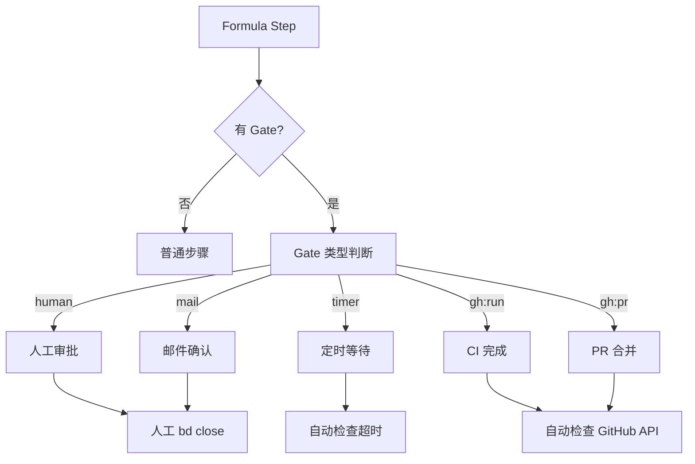
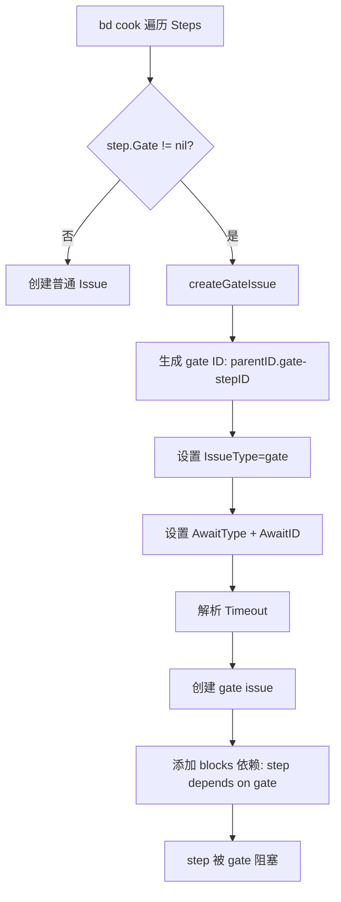
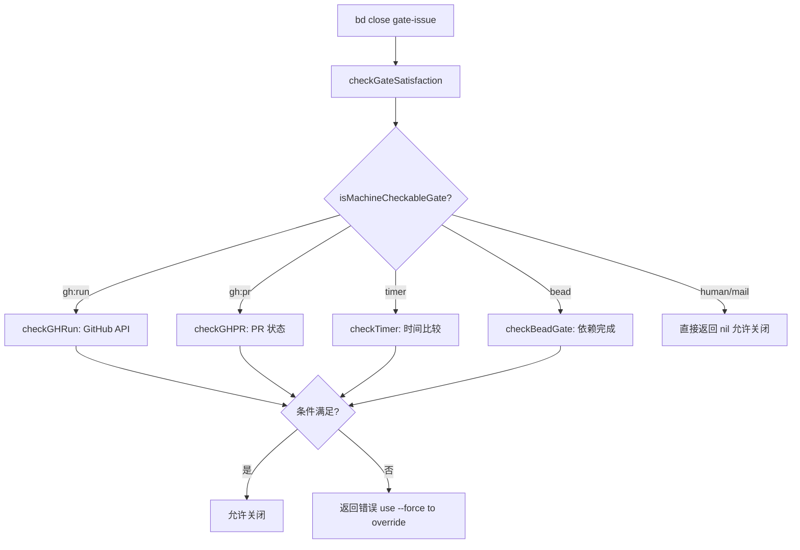

# PD-09.beads Beads — Gate 机制与角色路由人机协作

> 文档编号：PD-09.beads
> 来源：Beads `internal/formula/types.go` `internal/routing/routing.go` `cmd/bd/cook.go`
> GitHub：https://github.com/steveyegge/beads.git
> 问题域：PD-09 Human-in-the-Loop
> 状态：可复用方案

---

## 第 1 章 问题与动机

### 1.1 核心问题

在 Agent 驱动的工作流中，某些步骤不能完全自动化——需要人工审批、外部系统确认、或定时等待。传统做法是在代码中硬编码 `if needsApproval { waitForHuman() }`，导致暂停逻辑与业务逻辑耦合，且无法在工作流模板层面声明式定义人机交互点。

Beads 面临的具体挑战：
1. **工作流模板需要声明式 Gate**：Formula（工作流模板）需要在编译期定义哪些步骤需要人工审批，而非运行时动态判断
2. **多种等待条件**：人工审批（human）、邮件确认（mail）、定时器（timer）、CI 完成（gh:run）、PR 合并（gh:pr）——需要统一抽象
3. **角色路由**：Contributor 和 Maintainer 对同一仓库有不同权限，issue 需要路由到不同目标
4. **Gate 恢复发现**：当 Gate 条件满足后，系统需要自动发现哪些工作流可以恢复执行

### 1.2 Beads 的解法概述

1. **声明式 Gate 类型系统**：Formula Step 内嵌 `Gate` 结构体，支持 5 种条件类型（`internal/formula/types.go:257-269`）
2. **Cook 阶段 Gate Issue 物化**：`bd cook` 将 Gate 声明编译为独立的 gate issue，通过依赖关系阻塞后续步骤（`cmd/bd/cook.go:479-518`）
3. **机器可检查 vs 人工 Gate 分流**：`isMachineCheckableGate()` 区分自动验证和人工关闭两条路径（`cmd/bd/close.go:278-295`）
4. **Gate-Ready 发现机制**：`bd ready --gated` 扫描已关闭的 gate，发现可恢复的工作流（`cmd/bd/mol_ready_gated.go:98-212`）
5. **角色路由隔离**：`DetectUserRole()` + `DetermineTargetRepo()` 将不同权限用户的 issue 分流到不同仓库（`internal/routing/routing.go:34-118`）

### 1.3 设计思想

| 设计原则 | 具体实现 | 理由 | 替代方案 |
|----------|----------|------|----------|
| Gate 即 Issue | Gate 编译为独立 issue，通过依赖阻塞 | 复用已有 issue 生命周期（open→closed），无需新状态机 | 在 Step 上加 status 字段（增加复杂度） |
| 声明式优于命令式 | Formula JSON/TOML 中声明 gate 类型 | 工作流模板可复用、可组合、可审计 | 代码中硬编码审批逻辑 |
| 发现式恢复 | 轮询 closed gate + ready work 交集 | 无需维护 waiter 注册表，gate 关闭后自然被发现 | 事件驱动回调（需要持久化回调地址） |
| 角色推断降级 | git config → URL 启发式 → 默认 Maintainer | 渐进式检测，新用户零配置可用 | 强制要求配置角色（阻碍新用户） |
| 人机分流 | machine-checkable gate 自动验证，其余人工关闭 | 减少不必要的人工干预 | 所有 gate 都需要人工确认 |

---

## 第 2 章 源码实现分析

### 2.1 架构概览

Beads 的 HITL 系统由四个层次组成：

```
┌─────────────────────────────────────────────────────────┐
│                  Formula 声明层                          │
│  .formula.toml / .formula.json                          │
│  steps[].gate = { type: "human", timeout: "24h" }       │
└──────────────────────┬──────────────────────────────────┘
                       │ bd cook
┌──────────────────────▼──────────────────────────────────┐
│                  Gate Issue 物化层                        │
│  createGateIssue() → gate issue + blocks dependency      │
│  ID: {mol}.gate-{step}                                   │
└──────────────────────┬──────────────────────────────────┘
                       │ bd close / auto-check
┌──────────────────────▼──────────────────────────────────┐
│                  Gate 验证层                              │
│  isMachineCheckableGate() → checkGateSatisfaction()      │
│  human/mail: 直接关闭  |  gh:run/timer: 自动验证         │
└──────────────────────┬──────────────────────────────────┘
                       │ bd ready --gated
┌──────────────────────▼──────────────────────────────────┐
│                  Gate-Ready 发现层                        │
│  findGateReadyMolecules() → 可恢复工作流列表              │
│  Deacon patrol 自动 dispatch                             │
└─────────────────────────────────────────────────────────┘
```

### 2.2 核心实现

#### 2.2.1 Gate 类型定义



对应源码 `internal/formula/types.go:257-269`：

```go
// Gate defines an async wait condition for formula steps.
// When a step has a Gate, bd cook creates a gate issue that blocks the step.
// The gate must be closed (manually or via watchers) to unblock the step.
type Gate struct {
	// Type is the condition type: gh:run, gh:pr, timer, human, mail.
	Type string `json:"type"`

	// ID is the condition identifier (e.g., workflow name for gh:run).
	ID string `json:"id,omitempty"`

	// Timeout is how long to wait before escalation (e.g., "1h", "24h").
	Timeout string `json:"timeout,omitempty"`
}
```

Gate 嵌入在 Step 结构体中（`internal/formula/types.go:232-235`）：

```go
// Gate defines an async wait condition for this step.
// When set, bd cook creates a gate issue that blocks this step.
// Close the gate issue (bd close bd-xxx.gate-stepid) to unblock.
Gate *Gate `json:"gate,omitempty"`
```

#### 2.2.2 Cook 阶段 Gate Issue 物化



对应源码 `cmd/bd/cook.go:479-518`：

```go
func createGateIssue(step *formula.Step, parentID string) *types.Issue {
	if step.Gate == nil {
		return nil
	}

	// Generate gate issue ID: {parentID}.gate-{step.ID}
	gateID := fmt.Sprintf("%s.gate-%s", parentID, step.ID)

	// Build title from gate type and ID
	title := fmt.Sprintf("Gate: %s", step.Gate.Type)
	if step.Gate.ID != "" {
		title = fmt.Sprintf("Gate: %s %s", step.Gate.Type, step.Gate.ID)
	}

	// Parse timeout if specified
	var timeout time.Duration
	if step.Gate.Timeout != "" {
		if parsed, err := time.ParseDuration(step.Gate.Timeout); err == nil {
			timeout = parsed
		}
	}

	return &types.Issue{
		ID:          gateID,
		Title:       title,
		Description: fmt.Sprintf("Async gate for step %s", step.ID),
		Status:      types.StatusOpen,
		Priority:    2,
		IssueType:   "gate",
		AwaitType:   step.Gate.Type,
		AwaitID:     step.Gate.ID,
		Timeout:     timeout,
		IsTemplate:  true,
		CreatedAt:   time.Now(),
		UpdatedAt:   time.Now(),
	}
}
```

#### 2.2.3 Gate 验证与人机分流



对应源码 `cmd/bd/close.go:278-339`：

```go
func isMachineCheckableGate(issue *types.Issue) bool {
	if issue == nil || issue.IssueType != "gate" {
		return false
	}
	switch {
	case strings.HasPrefix(issue.AwaitType, "gh:pr"):
		return true
	case strings.HasPrefix(issue.AwaitType, "gh:run"):
		return true
	case issue.AwaitType == "timer":
		return true
	case issue.AwaitType == "bead":
		return true
	default:
		return false
	}
}

func checkGateSatisfaction(issue *types.Issue) error {
	if !isMachineCheckableGate(issue) {
		return nil // human/mail gates: allow manual close
	}
	// ... machine-checkable validation logic
}
```

关键设计：`human` 和 `mail` 类型的 gate 不在 `isMachineCheckableGate` 中，因此 `checkGateSatisfaction` 直接返回 nil，允许人工随时关闭。

### 2.3 实现细节

#### Gate-Ready 发现机制

`findGateReadyMolecules()`（`cmd/bd/mol_ready_gated.go:98-212`）实现了无注册表的发现式恢复：

1. 查询所有 `status=closed, type=gate` 的 issue
2. 获取当前 ready work 列表
3. 获取已 hooked 的 molecule 列表（排除已被 agent 认领的）
4. 对每个 closed gate，查找其 dependents（被它阻塞的 step）
5. 如果 dependent 在 ready 列表中且其 parent molecule 未被 hooked → 可恢复

#### 角色路由

`DetectUserRole()`（`internal/routing/routing.go:34-52`）采用三级降级策略：

1. **git config 显式配置**：`git config --get beads.role` → 最可靠
2. **URL 启发式**：SSH URL → Maintainer，HTTPS 无凭证 → Contributor
3. **默认值**：无 remote → Maintainer（本地项目）

`DetermineTargetRepo()`（`internal/routing/routing.go:95-118`）路由优先级：

1. `--repo` 显式覆盖 → 最高优先
2. auto 模式 + 角色匹配 → 按角色路由
3. 默认仓库 → 兜底
4. 当前目录 `.` → 最终兜底

---

## 第 3 章 迁移指南

### 3.1 迁移清单

**阶段 1：Gate 类型系统（1-2 天）**
- [ ] 定义 Gate 结构体（type + id + timeout）
- [ ] 在工作流 Step 中嵌入可选 Gate 字段
- [ ] 实现 Gate 类型枚举验证

**阶段 2：Gate Issue 物化（2-3 天）**
- [ ] 实现 cook/compile 阶段的 gate issue 创建
- [ ] 建立 gate issue → step 的 blocks 依赖关系
- [ ] 实现 gate ID 命名规范（`{parent}.gate-{step}`）

**阶段 3：Gate 验证分流（1-2 天）**
- [ ] 实现 `isMachineCheckableGate()` 分类器
- [ ] 对 machine-checkable gate 实现自动验证
- [ ] 对 human/mail gate 允许直接关闭
- [ ] 实现 `--force` 覆盖机制

**阶段 4：Gate-Ready 发现（1-2 天）**
- [ ] 实现 closed gate 扫描
- [ ] 实现 ready work 交集计算
- [ ] 实现 hooked molecule 排除
- [ ] 提供 JSON 输出供自动化消费

**阶段 5：角色路由（可选，1 天）**
- [ ] 实现角色检测（配置 → 启发式 → 默认值）
- [ ] 实现基于角色的 issue 路由

### 3.2 适配代码模板

#### Gate 类型定义（Go）

```go
package workflow

import "time"

// GateType enumerates supported gate conditions.
type GateType string

const (
    GateHuman  GateType = "human"   // Manual approval
    GateMail   GateType = "mail"    // Email confirmation
    GateTimer  GateType = "timer"   // Duration-based wait
    GateCI     GateType = "ci:run"  // CI pipeline completion
    GatePR     GateType = "pr"      // Pull request event
)

// Gate defines an async wait condition for workflow steps.
type Gate struct {
    Type    GateType      `json:"type"`
    ID      string        `json:"id,omitempty"`
    Timeout time.Duration `json:"timeout,omitempty"`
}

// IsMachineCheckable returns true if the gate can be auto-verified.
func (g *Gate) IsMachineCheckable() bool {
    switch g.Type {
    case GateCI, GatePR, GateTimer:
        return true
    default:
        return false // human, mail require manual close
    }
}

// Step represents a workflow step with optional gate.
type Step struct {
    ID        string   `json:"id"`
    Title     string   `json:"title"`
    DependsOn []string `json:"depends_on,omitempty"`
    Gate      *Gate    `json:"gate,omitempty"`
}
```

#### Gate Issue 物化（Go）

```go
// MaterializeGate creates a gate issue that blocks the given step.
// Returns the gate issue and a dependency linking step → gate.
func MaterializeGate(step *Step, parentID string) (*Issue, *Dependency) {
    if step.Gate == nil {
        return nil, nil
    }

    gateID := fmt.Sprintf("%s.gate-%s", parentID, step.ID)
    gateIssue := &Issue{
        ID:        gateID,
        Title:     fmt.Sprintf("Gate: %s %s", step.Gate.Type, step.Gate.ID),
        Type:      "gate",
        Status:    StatusOpen,
        AwaitType: string(step.Gate.Type),
        AwaitID:   step.Gate.ID,
        Timeout:   step.Gate.Timeout,
    }

    dep := &Dependency{
        IssueID:     fmt.Sprintf("%s.%s", parentID, step.ID),
        DependsOnID: gateID,
        Type:        DepBlocks,
    }

    return gateIssue, dep
}
```

#### Gate-Ready 发现（Go）

```go
// FindGateReadyWorkflows discovers workflows where a gate closed
// and the blocked step is now ready.
func FindGateReadyWorkflows(store Store) ([]*ReadyWorkflow, error) {
    closedGates, _ := store.FindIssues(Filter{Type: "gate", Status: "closed"})
    readyWork, _ := store.GetReadyWork()
    readyIDs := toSet(readyWork)

    var results []*ReadyWorkflow
    for _, gate := range closedGates {
        dependents, _ := store.GetDependents(gate.ID)
        for _, dep := range dependents {
            if readyIDs[dep.ID] {
                wf := findParentWorkflow(store, dep.ID)
                if wf != nil && !wf.IsHooked() {
                    results = append(results, &ReadyWorkflow{
                        WorkflowID: wf.ID,
                        ClosedGate: gate,
                        ReadyStep:  dep,
                    })
                }
            }
        }
    }
    return results, nil
}
```

### 3.3 适用场景

| 场景 | 适用度 | 说明 |
|------|--------|------|
| 声明式工作流引擎 | ⭐⭐⭐ | Gate 作为 Step 属性，天然适合模板化工作流 |
| CI/CD 流水线 | ⭐⭐⭐ | gh:run/gh:pr gate 直接对接 GitHub Actions |
| 多角色协作系统 | ⭐⭐⭐ | 角色路由 + human gate 实现审批分流 |
| 纯对话式 Agent | ⭐ | 无工作流模板概念，Gate 机制过重 |
| 实时交互系统 | ⭐⭐ | 发现式恢复有轮询延迟，不适合毫秒级响应 |

---

## 第 4 章 测试用例

```go
package workflow_test

import (
    "testing"
    "time"
)

// TestGateTypeClassification verifies machine-checkable vs human gate分流
func TestGateTypeClassification(t *testing.T) {
    tests := []struct {
        name             string
        gateType         GateType
        wantCheckable    bool
    }{
        {"human gate", GateHuman, false},
        {"mail gate", GateMail, false},
        {"timer gate", GateTimer, true},
        {"CI gate", GateCI, true},
        {"PR gate", GatePR, true},
    }

    for _, tt := range tests {
        t.Run(tt.name, func(t *testing.T) {
            g := &Gate{Type: tt.gateType}
            if got := g.IsMachineCheckable(); got != tt.wantCheckable {
                t.Errorf("IsMachineCheckable() = %v, want %v", got, tt.wantCheckable)
            }
        })
    }
}

// TestMaterializeGate verifies gate issue creation and dependency wiring
func TestMaterializeGate(t *testing.T) {
    step := &Step{
        ID:    "deploy",
        Title: "Deploy to production",
        Gate:  &Gate{Type: GateHuman, Timeout: 24 * time.Hour},
    }

    gateIssue, dep := MaterializeGate(step, "release-v1")

    if gateIssue == nil {
        t.Fatal("expected gate issue, got nil")
    }
    if gateIssue.ID != "release-v1.gate-deploy" {
        t.Errorf("gate ID = %q, want %q", gateIssue.ID, "release-v1.gate-deploy")
    }
    if gateIssue.AwaitType != "human" {
        t.Errorf("AwaitType = %q, want %q", gateIssue.AwaitType, "human")
    }
    if dep.DependsOnID != gateIssue.ID {
        t.Errorf("dependency DependsOnID = %q, want %q", dep.DependsOnID, gateIssue.ID)
    }
}

// TestMaterializeGateNilGate verifies no-op for steps without gate
func TestMaterializeGateNilGate(t *testing.T) {
    step := &Step{ID: "build", Title: "Build"}
    gateIssue, dep := MaterializeGate(step, "ci")
    if gateIssue != nil || dep != nil {
        t.Error("expected nil for step without gate")
    }
}

// TestGateReadyDiscovery verifies discovery of resumable workflows
func TestGateReadyDiscovery(t *testing.T) {
    store := NewMockStore()
    // Setup: gate closed, dependent step ready, molecule not hooked
    store.AddIssue(&Issue{ID: "mol-1.gate-deploy", Type: "gate", Status: "closed"})
    store.AddIssue(&Issue{ID: "mol-1.deploy", Status: "open"})
    store.AddDependency("mol-1.deploy", "mol-1.gate-deploy", DepBlocks)
    store.AddReadyWork("mol-1.deploy")
    store.AddIssue(&Issue{ID: "mol-1", Type: "epic"})
    store.AddDependency("mol-1.deploy", "mol-1", DepParentChild)

    results, err := FindGateReadyWorkflows(store)
    if err != nil {
        t.Fatalf("unexpected error: %v", err)
    }
    if len(results) != 1 {
        t.Fatalf("expected 1 result, got %d", len(results))
    }
    if results[0].WorkflowID != "mol-1" {
        t.Errorf("WorkflowID = %q, want %q", results[0].WorkflowID, "mol-1")
    }
}

// TestRoleDetectionFallback verifies three-tier role detection
func TestRoleDetectionFallback(t *testing.T) {
    tests := []struct {
        name     string
        gitRole  string // beads.role config value
        pushURL  string // git remote URL
        wantRole UserRole
    }{
        {"explicit maintainer", "maintainer", "", Maintainer},
        {"explicit contributor", "contributor", "", Contributor},
        {"SSH URL → maintainer", "", "git@github.com:user/repo.git", Maintainer},
        {"HTTPS URL → contributor", "", "https://github.com/user/repo.git", Contributor},
        {"no remote → maintainer", "", "", Maintainer},
    }

    for _, tt := range tests {
        t.Run(tt.name, func(t *testing.T) {
            role := detectRole(tt.gitRole, tt.pushURL)
            if role != tt.wantRole {
                t.Errorf("detectRole() = %v, want %v", role, tt.wantRole)
            }
        })
    }
}
```

---

## 第 5 章 跨域关联

| 关联域 | 关系类型 | 说明 |
|--------|----------|------|
| PD-02 多 Agent 编排 | 协同 | Gate 是 Formula 编排系统的一部分，Gate-Ready 发现驱动 Deacon patrol 的 molecule dispatch |
| PD-06 记忆持久化 | 依赖 | Gate issue 持久化在 Dolt 数据库中，gate 状态（open/closed）通过 issue 生命周期管理 |
| PD-10 中间件管道 | 协同 | Hooks 系统（on_create/on_close）可在 gate 关闭时触发自定义逻辑，类似中间件拦截 |
| PD-11 可观测性 | 协同 | Gate 的 AwaitType/AwaitID 字段提供可观测的等待条件追踪 |
| PD-03 容错与重试 | 协同 | `--force` 覆盖机制允许在 gate 验证失败时强制关闭，checkGateSatisfaction 验证失败时返回可操作的错误信息 |

---

## 第 6 章 来源文件索引

| 文件 | 行范围 | 关键实现 |
|------|--------|----------|
| `internal/formula/types.go` | L257-L269 | Gate 结构体定义（type/id/timeout） |
| `internal/formula/types.go` | L232-L235 | Step.Gate 字段嵌入 |
| `internal/formula/types.go` | L359-L369 | GateRule 组合规则定义 |
| `internal/formula/types.go` | L371-L400 | ComposeRules.Gate 声明式 gate 规则 |
| `cmd/bd/cook.go` | L479-L518 | createGateIssue() gate issue 物化 |
| `cmd/bd/close.go` | L278-L295 | isMachineCheckableGate() 分类器 |
| `cmd/bd/close.go` | L297-L339 | checkGateSatisfaction() 验证逻辑 |
| `cmd/bd/mol_ready_gated.go` | L14-L26 | GatedMolecule 结构体 |
| `cmd/bd/mol_ready_gated.go` | L98-L212 | findGateReadyMolecules() 发现算法 |
| `cmd/bd/ready.go` | L18-L48 | bd ready 命令入口（--gated/--mol 分支） |
| `internal/routing/routing.go` | L19-L25 | UserRole 类型定义 |
| `internal/routing/routing.go` | L34-L52 | DetectUserRole() 三级降级检测 |
| `internal/routing/routing.go` | L84-L118 | RoutingConfig + DetermineTargetRepo() |
| `internal/hooks/hooks.go` | L13-L25 | Hook 事件类型定义 |
| `internal/hooks/hooks.go` | L47-L72 | Run() 异步 hook 执行 |
| `cmd/bd/create.go` | L370-L405 | 创建时角色路由集成 |

---

## 第 7 章 横向对比维度

```json comparison_data
{
  "project": "beads",
  "dimensions": {
    "暂停机制": "Gate Issue 物化：gate 编译为独立 issue，通过 blocks 依赖阻塞后续 step",
    "澄清类型": "5 种 Gate 类型枚举：human/mail/timer/gh:run/gh:pr",
    "状态持久化": "Dolt 数据库持久化 gate issue，状态通过 issue 生命周期管理",
    "实现层级": "Formula 声明层 → Cook 物化层 → 验证层 → 发现层四层架构",
    "身份绑定": "gate issue 通过 ID 命名规范绑定到 molecule（{mol}.gate-{step}）",
    "多通道转发": "mail gate 通过 BD_MAIL_DELEGATE 委托外部邮件服务",
    "审查粒度控制": "Step 级粒度，每个 Step 可独立声明 Gate",
    "升级策略": "Gate.Timeout 字段支持超时升级，checkGateSatisfaction 返回 escalated 标志",
    "自动跳过机制": "isMachineCheckableGate 自动验证 CI/PR/timer gate，human/mail 跳过验证直接允许关闭",
    "dry-run 模式": "bd create --dry-run 预览 issue 创建，不实际写入数据库",
    "操作边界声明": "Gate 类型枚举限定可声明的等待条件，非法类型在 Validate() 阶段拒绝",
    "发现式恢复": "轮询 closed gate + ready work 交集，无需 waiter 注册表"
  }
}
```

### 域元数据补充

```json domain_metadata
{
  "solution_summary": "Beads 用 Formula Gate 声明式机制将人工审批编译为独立 gate issue，通过 blocks 依赖阻塞 step，isMachineCheckableGate 分流自动/人工验证，findGateReadyMolecules 轮询发现可恢复工作流",
  "description": "声明式 Gate 物化为 Issue 的编译期人机交互设计",
  "sub_problems": [
    "Gate 物化命名冲突：多个 formula 组合时 gate ID 的全局唯一性保证",
    "发现式恢复延迟：轮询间隔与 gate 关闭到工作流恢复的响应时间权衡",
    "角色推断误判：SSH URL 启发式对 fork contributor 的误分类及降级警告"
  ],
  "best_practices": [
    "Gate 即 Issue：复用 issue 生命周期管理 gate 状态，避免引入新状态机",
    "人机分流分类器：machine-checkable gate 自动验证，human/mail gate 直接放行，减少不必要人工干预",
    "发现式恢复优于回调注册：轮询 closed gate 交集无需维护 waiter 表，简化系统复杂度"
  ]
}
```
