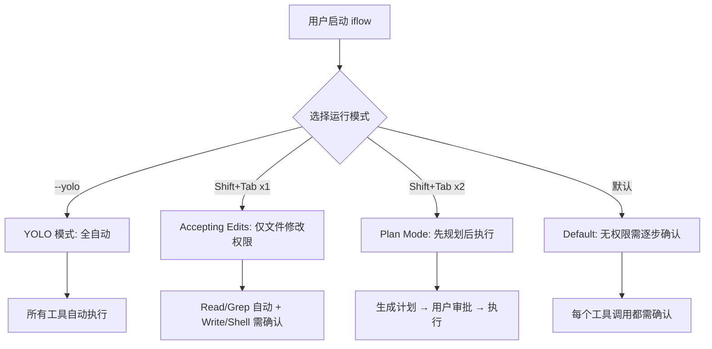
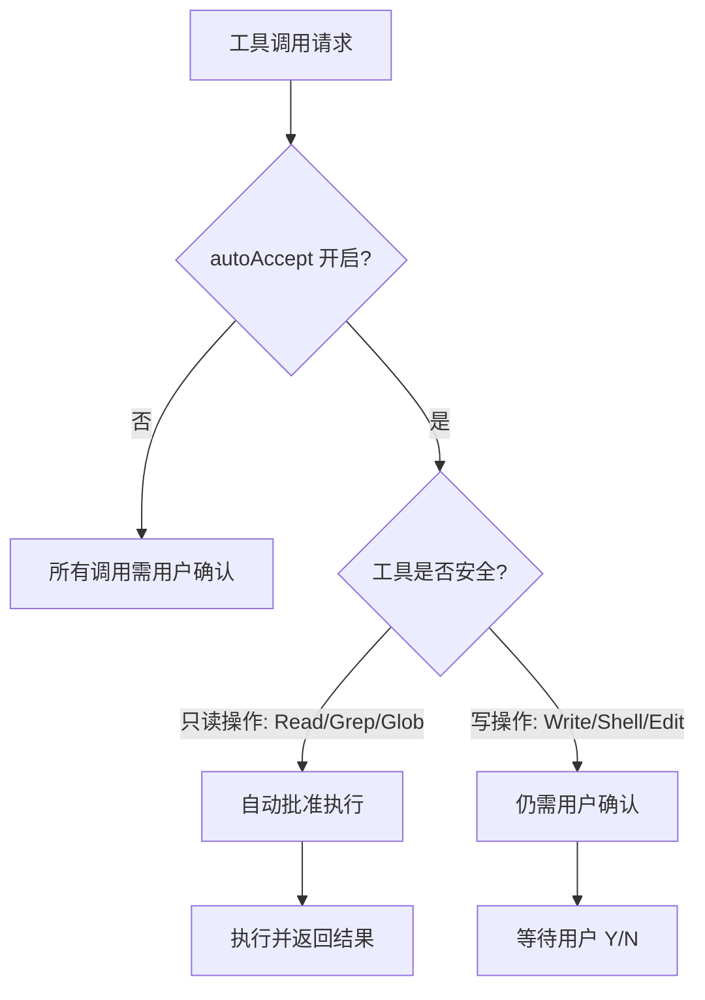
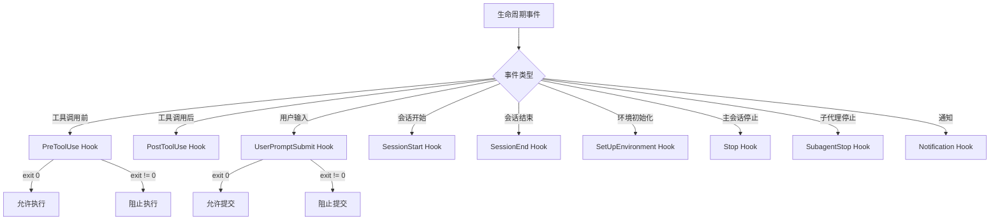

# PD-09.18 iflow-cli — 四模式分级人机交互与 Hook 拦截体系

> 文档编号：PD-09.18
> 来源：iflow-cli `docs_en/examples/hooks.md` `docs_en/features/checkpointing.md` `docs_en/configuration/settings.md`
> GitHub：https://github.com/iflow-ai/iflow-cli.git
> 问题域：PD-09 Human-in-the-Loop
> 状态：可复用方案

---

## 第 1 章 问题与动机

### 1.1 核心问题

CLI 类 AI Agent 面临一个根本矛盾：**自主性与安全性的平衡**。Agent 需要足够的权限来完成复杂任务（文件修改、Shell 执行、代码重构），但不受约束的自主操作可能导致不可逆的破坏。不同用户、不同场景对"人类介入程度"的需求差异巨大——新手希望每步确认，老手希望全自动执行，CI 环境需要零交互。

传统方案要么全开（YOLO 模式），要么全关（每步确认），缺乏中间地带。此外，工具调用前后的安全检查、用户输入过滤、敏感文件保护等横切关注点，如果硬编码在业务逻辑中会导致代码耦合。

### 1.2 iflow-cli 的解法概述

iflow-cli 通过**四层递进式人机交互模型 + 九类生命周期 Hook 拦截体系**解决上述问题：

1. **四种运行模式分级**（`docs_en/configuration/settings.md:559`）：yolo → accepting edits → plan mode → default，从完全自主到完全受控的连续光谱
2. **autoAccept 安全操作自动批准**（`docs_en/configuration/settings.md:303-306`）：只读操作自动放行，写操作仍需确认，实现"安全地板"
3. **九类 Hook 生命周期拦截**（`docs_en/examples/hooks.md:23-273`）：PreToolUse/PostToolUse/UserPromptSubmit 等 9 个拦截点，外部脚本可 Block/Modify/Log
4. **Checkpoint 快照回滚**（`docs_en/features/checkpointing.md:30-36`）：文件修改前自动创建 Git 影子仓库快照，一键 `/restore` 回滚
5. **SubAgent 权限隔离**（`docs_en/examples/subagent.md:330-367`）：每个子代理独立配置 allowedTools/allowedMcps，isInheritTools 控制权限继承

### 1.3 设计思想

| 设计原则 | 具体实现 | 理由 | 替代方案 |
|----------|----------|------|----------|
| 分级授权 | 四种运行模式 yolo/accepting edits/plan/default | 不同场景需要不同自主度，一刀切不可行 | 单一开关（Claude Code 的 --dangerously-skip-permissions） |
| 安全地板 | autoAccept 只放行只读操作，写操作始终需确认 | 即使开启自动批准，危险操作仍有兜底 | 全部自动批准（无安全保障） |
| 外部化拦截 | Hook 系统用外部脚本而非内置逻辑 | 用户可自定义安全策略，不改 CLI 源码 | 内置白名单/黑名单（不够灵活） |
| 快照回滚 | Checkpoint 用 Git 影子仓库 | 不干扰项目原有 Git 仓库，完整文件级回滚 | 简单 undo（只能撤销最后一步） |
| 最小权限 | SubAgent 的 isInheritTools=false 模式 | 安全审计 Agent 不应有写文件权限 | 所有 Agent 共享同一权限集 |

---

## 第 2 章 源码实现分析

### 2.1 架构概览

iflow-cli 的 HITL 体系由四个正交子系统组成，各自独立又协同工作：

```
┌─────────────────────────────────────────────────────────────┐
│                    iFlow CLI HITL 架构                        │
├─────────────────────────────────────────────────────────────┤
│                                                              │
│  ┌──────────────┐   ┌──────────────┐   ┌──────────────┐    │
│  │  运行模式层   │   │  Hook 拦截层  │   │ Checkpoint层 │    │
│  │              │   │              │   │              │    │
│  │ yolo         │   │ PreToolUse   │   │ Git Shadow   │    │
│  │ accept-edits │   │ PostToolUse  │   │ Repo Snapshot│    │
│  │ plan-mode    │   │ UserPrompt   │   │ /restore     │    │
│  │ default      │   │ Notification │   │ Rollback     │    │
│  └──────┬───────┘   └──────┬───────┘   └──────┬───────┘    │
│         │                  │                   │            │
│         ▼                  ▼                   ▼            │
│  ┌─────────────────────────────────────────────────────┐    │
│  │              工具执行引擎 (Tool Executor)              │    │
│  │  ┌─────────┐  ┌─────────┐  ┌─────────┐             │    │
│  │  │ Read    │  │ Write   │  │ Shell   │  ...         │    │
│  │  └─────────┘  └─────────┘  └─────────┘             │    │
│  └─────────────────────────────────────────────────────┘    │
│         │                                                    │
│         ▼                                                    │
│  ┌─────────────────────────────────────────────────────┐    │
│  │           SubAgent 权限隔离层                         │    │
│  │  allowedTools / allowedMcps / isInheritTools         │    │
│  └─────────────────────────────────────────────────────┘    │
└─────────────────────────────────────────────────────────────┘
```

### 2.2 核心实现

#### 2.2.1 四种运行模式



对应文档 `README.md:45-46`：

```markdown
* Support 4 running modes: yolo (model has maximum permissions, can perform
  any operation), accepting edits (model only has file modification
  permissions), plan mode (plan first, then execute), default (model has
  no permissions)
```

四种模式通过 `Shift+Tab` 在运行时切换（`docs_en/features/checkpointing.md:77`），无需重启 CLI。这是一个关键的 UX 设计——用户可以在任务执行过程中动态调整信任级别。

#### 2.2.2 autoAccept 安全操作自动批准



对应配置 `docs_en/configuration/settings.md:303-306`：

```json
{
  "autoAccept": true
}
```

> Controls whether the CLI automatically accepts and executes tool calls
> that are considered safe (such as read-only operations) without requiring
> explicit user confirmation. If set to `true`, the CLI will bypass
> confirmation prompts for tools considered safe.

这实现了"安全地板"设计：即使 autoAccept=true，写操作仍强制拦截。与 YOLO 模式的区别在于 YOLO 连写操作也自动批准。

#### 2.2.3 九类 Hook 生命周期拦截



对应 `docs_en/examples/hooks.md:25-273`，Hook 配置结构：

```json
{
  "hooks": {
    "PreToolUse": [
      {
        "matcher": "Edit|MultiEdit|Write",
        "hooks": [
          {
            "type": "command",
            "command": "python3 file_protection.py",
            "timeout": 10
          }
        ]
      }
    ]
  }
}
```

Hook 的核心设计特征：

1. **Matcher 模式匹配**（`docs_en/examples/hooks.md:411-428`）：支持精确匹配、正则、通配符、MCP 工具匹配
2. **退出码语义**（`docs_en/examples/hooks.md:793-807`）：PreToolUse 和 UserPromptSubmit 的非零退出码阻止执行；Notification Hook 的 exit 2 有特殊含义（不阻止通知但显示 stderr）
3. **环境变量注入**（`docs_en/examples/hooks.md:769-791`）：IFLOW_TOOL_NAME、IFLOW_TOOL_ARGS、IFLOW_SESSION_ID 等上下文信息自动注入
4. **层级配置合并**（`docs_en/examples/hooks.md:278-286`）：User → Project → System 三级配置，项目级补充用户级

#### 2.2.4 文件保护 Hook 实例

对应 `docs_en/examples/hooks.md:467-506`，一个完整的 PreToolUse 安全拦截脚本：

```python
import json, sys
data = json.load(sys.stdin)
file_path = data.get('tool_input', {}).get('file_path', '')
sensitive_files = ['.env', 'package-lock.json', '.git/']
sys.exit(2 if any(p in file_path for p in sensitive_files) else 0)
```

这个脚本通过 stdin 接收 JSON 格式的工具调用参数，检查目标文件是否在敏感文件列表中，返回 exit 2 阻止执行。

#### 2.2.5 UserPromptSubmit 输入过滤

对应 `docs_en/examples/hooks.md:598-614`：

```python
import json, sys, re
data = json.load(sys.stdin)
prompt = data.get('prompt', '')
sensitive_patterns = [
    r'password\s*[=:]\s*\S+',
    r'api[_-]?key\s*[=:]\s*\S+',
    r'secret\s*[=:]\s*\S+',
    r'\b\d{4}[\s-]?\d{4}[\s-]?\d{4}[\s-]?\d{4}\b'  # Credit card
]
for pattern in sensitive_patterns:
    if re.search(pattern, prompt, re.IGNORECASE):
        print("Sensitive information detected", file=sys.stderr)
        sys.exit(1)  # Block prompt submission
```

### 2.3 实现细节

#### Checkpoint 快照机制

Checkpoint 的数据流（`docs_en/features/checkpointing.md:30-61`）：

```
Tool Call → Permission Confirmation → State Snapshot → Tool Execution → Checkpoint Complete
    ↓
[AI Request] → [User Approval] → [File Backup] → [Safe Execution] → [State Saved]
```

存储结构：
- Git 影子仓库：`~/.iflow/snapshots/<project_hash>` — 完整文件状态
- 会话历史：`~/.iflow/cache/<project_hash>/checkpoints` — JSON 格式对话记录
- 工具调用：同目录 — 调用参数和执行上下文

关键设计：影子仓库与项目原有 Git 仓库完全隔离，不会产生冲突。

#### SubAgent 权限隔离

`docs_en/examples/subagent.md:338-367` 定义了精细的权限控制：

```markdown
---
agentType: "security-auditor"
systemPrompt: "You are a security audit expert..."
allowedTools: ["Read", "Grep", "Bash"]
allowedMcps: ["security-scanner", "vulnerability-db"]
isInheritTools: false
isInheritMcps: false
---
```

`isInheritTools: false` 意味着该 Agent 只能使用显式声明的 Read/Grep/Bash，不继承主 Agent 的 Write/Edit 等危险工具。这是最小权限原则的直接体现。


---

## 第 3 章 迁移指南

### 3.1 迁移清单

#### 阶段一：运行模式分级（1-2 天）

- [ ] 定义模式枚举：`yolo | accept-edits | plan | default`
- [ ] 实现模式切换快捷键（运行时切换，无需重启）
- [ ] 按模式过滤工具调用确认逻辑
- [ ] 实现 autoAccept 配置项，区分只读/写操作

#### 阶段二：Hook 拦截体系（2-3 天）

- [ ] 定义 Hook 事件类型枚举（至少 PreToolUse/PostToolUse/UserPromptSubmit）
- [ ] 实现 Hook 配置解析（JSON 格式，支持 matcher 正则匹配）
- [ ] 实现 Hook 执行引擎（spawn 子进程，stdin 传参，exit code 判断）
- [ ] 实现环境变量注入（TOOL_NAME/TOOL_ARGS/SESSION_ID）
- [ ] 实现超时保护和错误隔离

#### 阶段三：Checkpoint 快照（1-2 天）

- [ ] 实现 Git 影子仓库创建（`~/.app/snapshots/<hash>`）
- [ ] 在工具执行前自动 commit 快照
- [ ] 实现 `/restore` 命令回滚到指定快照
- [ ] 保存会话历史和工具调用记录

### 3.2 适配代码模板

#### Hook 执行引擎（TypeScript）

```typescript
import { spawn } from 'child_process';

interface HookConfig {
  matcher?: string;
  hooks: Array<{
    type: 'command';
    command: string;
    timeout?: number;
  }>;
}

interface HookResult {
  exitCode: number;
  stdout: string;
  stderr: string;
}

async function executeHook(
  config: HookConfig,
  toolName: string,
  toolInput: Record<string, unknown>,
  env: Record<string, string>
): Promise<HookResult> {
  // Matcher 检查
  if (config.matcher) {
    const isRegex = /[|\\^$.*+?()[\]{}]/.test(config.matcher);
    const pattern = isRegex ? new RegExp(config.matcher) : null;
    if (pattern ? !pattern.test(toolName) : config.matcher !== toolName) {
      return { exitCode: 0, stdout: '', stderr: '' };
    }
  }

  const results: HookResult[] = [];
  for (const hook of config.hooks) {
    const result = await new Promise<HookResult>((resolve) => {
      const proc = spawn('sh', ['-c', hook.command], {
        env: { ...process.env, ...env },
        stdio: ['pipe', 'pipe', 'pipe'],
      });

      let stdout = '';
      let stderr = '';
      proc.stdout.on('data', (d) => (stdout += d));
      proc.stderr.on('data', (d) => (stderr += d));

      // stdin 传入工具调用参数
      proc.stdin.write(JSON.stringify({ tool_name: toolName, tool_input: toolInput }));
      proc.stdin.end();

      // 超时保护
      const timer = hook.timeout
        ? setTimeout(() => { proc.kill('SIGTERM'); resolve({ exitCode: -1, stdout, stderr: 'Hook timeout' }); }, hook.timeout * 1000)
        : null;

      proc.on('close', (code) => {
        if (timer) clearTimeout(timer);
        resolve({ exitCode: code ?? 0, stdout, stderr });
      });
    });
    results.push(result);
    // PreToolUse: 非零退出码立即阻止
    if (result.exitCode !== 0) return result;
  }
  return results[results.length - 1] ?? { exitCode: 0, stdout: '', stderr: '' };
}

// 使用示例
async function onPreToolUse(toolName: string, toolInput: Record<string, unknown>) {
  const hooks = loadHookConfig('PreToolUse');
  const env = {
    IFLOW_TOOL_NAME: toolName,
    IFLOW_TOOL_ARGS: JSON.stringify(toolInput),
    IFLOW_SESSION_ID: getCurrentSessionId(),
  };
  for (const config of hooks) {
    const result = await executeHook(config, toolName, toolInput, env);
    if (result.exitCode !== 0) {
      throw new Error(`Hook blocked: ${result.stderr || 'Tool execution denied'}`);
    }
  }
}
```

#### 运行模式分级（TypeScript）

```typescript
type RunMode = 'yolo' | 'accept-edits' | 'plan' | 'default';

interface ToolPermission {
  autoApprove: boolean;
  requirePlan: boolean;
}

function getToolPermission(mode: RunMode, toolName: string, isReadOnly: boolean): ToolPermission {
  switch (mode) {
    case 'yolo':
      return { autoApprove: true, requirePlan: false };
    case 'accept-edits':
      return { autoApprove: isReadOnly, requirePlan: false };
    case 'plan':
      return { autoApprove: isReadOnly, requirePlan: !isReadOnly };
    case 'default':
      return { autoApprove: false, requirePlan: false };
  }
}
```

### 3.3 适用场景

| 场景 | 适用度 | 说明 |
|------|--------|------|
| CLI AI Agent（类 Claude Code） | ⭐⭐⭐ | 完美匹配，四模式 + Hook 直接复用 |
| IDE 插件 AI 助手 | ⭐⭐⭐ | Hook 体系可映射为 IDE 扩展点 |
| CI/CD 自动化 Agent | ⭐⭐ | 主要用 YOLO 模式 + Hook 安全检查 |
| Web 端 AI 对话 | ⭐ | 运行模式概念可借鉴，Hook 需改为 API 中间件 |
| 多 Agent 编排系统 | ⭐⭐⭐ | SubAgent 权限隔离模式直接适用 |

---

## 第 4 章 测试用例

```python
import pytest
import json
import subprocess
import tempfile
import os


class TestRunModePermissions:
    """测试四种运行模式的权限分级"""

    def test_yolo_mode_auto_approves_all(self):
        mode = 'yolo'
        assert get_tool_permission(mode, 'Write', False) == {'autoApprove': True, 'requirePlan': False}
        assert get_tool_permission(mode, 'Shell', False) == {'autoApprove': True, 'requirePlan': False}
        assert get_tool_permission(mode, 'Read', True) == {'autoApprove': True, 'requirePlan': False}

    def test_accept_edits_only_approves_readonly(self):
        mode = 'accept-edits'
        assert get_tool_permission(mode, 'Read', True) == {'autoApprove': True, 'requirePlan': False}
        assert get_tool_permission(mode, 'Write', False) == {'autoApprove': False, 'requirePlan': False}

    def test_plan_mode_requires_plan_for_writes(self):
        mode = 'plan'
        assert get_tool_permission(mode, 'Write', False) == {'autoApprove': False, 'requirePlan': True}
        assert get_tool_permission(mode, 'Read', True) == {'autoApprove': True, 'requirePlan': False}

    def test_default_mode_requires_all_confirmation(self):
        mode = 'default'
        assert get_tool_permission(mode, 'Read', True) == {'autoApprove': False, 'requirePlan': False}
        assert get_tool_permission(mode, 'Write', False) == {'autoApprove': False, 'requirePlan': False}


class TestHookExecution:
    """测试 Hook 拦截机制"""

    def test_pretooluse_blocks_on_nonzero_exit(self):
        """PreToolUse Hook 返回非零退出码应阻止工具执行"""
        with tempfile.NamedTemporaryFile(mode='w', suffix='.sh', delete=False) as f:
            f.write('#!/bin/bash\nexit 1\n')
            f.flush()
            os.chmod(f.name, 0o755)
            result = subprocess.run([f.name], capture_output=True)
            assert result.returncode == 1
            os.unlink(f.name)

    def test_pretooluse_allows_on_zero_exit(self):
        """PreToolUse Hook 返回 0 应允许工具执行"""
        with tempfile.NamedTemporaryFile(mode='w', suffix='.sh', delete=False) as f:
            f.write('#!/bin/bash\nexit 0\n')
            f.flush()
            os.chmod(f.name, 0o755)
            result = subprocess.run([f.name], capture_output=True)
            assert result.returncode == 0
            os.unlink(f.name)

    def test_file_protection_hook_blocks_env_file(self):
        """文件保护 Hook 应阻止 .env 文件修改"""
        script = '''
import json, sys
data = json.loads(sys.stdin.read())
file_path = data.get('tool_input', {}).get('file_path', '')
sensitive_files = ['.env', 'package-lock.json', '.git/']
sys.exit(2 if any(p in file_path for p in sensitive_files) else 0)
'''
        with tempfile.NamedTemporaryFile(mode='w', suffix='.py', delete=False) as f:
            f.write(script)
            f.flush()
            input_data = json.dumps({'tool_input': {'file_path': '/project/.env'}})
            result = subprocess.run(['python3', f.name], input=input_data, capture_output=True, text=True)
            assert result.returncode == 2  # 阻止
            os.unlink(f.name)

    def test_file_protection_hook_allows_normal_file(self):
        """文件保护 Hook 应允许普通文件修改"""
        script = '''
import json, sys
data = json.loads(sys.stdin.read())
file_path = data.get('tool_input', {}).get('file_path', '')
sensitive_files = ['.env', 'package-lock.json', '.git/']
sys.exit(2 if any(p in file_path for p in sensitive_files) else 0)
'''
        with tempfile.NamedTemporaryFile(mode='w', suffix='.py', delete=False) as f:
            f.write(script)
            f.flush()
            input_data = json.dumps({'tool_input': {'file_path': '/project/src/app.ts'}})
            result = subprocess.run(['python3', f.name], input=input_data, capture_output=True, text=True)
            assert result.returncode == 0  # 允许
            os.unlink(f.name)

    def test_matcher_regex_matching(self):
        """Matcher 正则匹配应正确过滤工具名"""
        import re
        matcher = "Edit|MultiEdit|Write"
        assert re.search(matcher, "Edit") is not None
        assert re.search(matcher, "Read") is None
        assert re.search(matcher, "MultiEdit") is not None

    def test_content_filter_blocks_api_key(self):
        """UserPromptSubmit Hook 应阻止包含 API key 的输入"""
        import re
        patterns = [r'api[_-]?key\s*[=:]\s*\S+']
        prompt = "Set api_key = sk-12345"
        blocked = any(re.search(p, prompt, re.IGNORECASE) for p in patterns)
        assert blocked is True

    def test_content_filter_allows_normal_input(self):
        """UserPromptSubmit Hook 应允许正常输入"""
        import re
        patterns = [r'api[_-]?key\s*[=:]\s*\S+']
        prompt = "Help me optimize this function"
        blocked = any(re.search(p, prompt, re.IGNORECASE) for p in patterns)
        assert blocked is False


class TestSubAgentPermissions:
    """测试 SubAgent 权限隔离"""

    def test_no_inherit_restricts_tools(self):
        config = {
            'allowedTools': ['Read', 'Grep', 'Bash'],
            'isInheritTools': False,
        }
        assert 'Write' not in config['allowedTools']
        assert 'Edit' not in config['allowedTools']
        assert config['isInheritTools'] is False

    def test_inherit_extends_parent_tools(self):
        parent_tools = ['Read', 'Write', 'Shell', 'Grep']
        config = {
            'allowedTools': ['CustomTool'],
            'isInheritTools': True,
        }
        effective = parent_tools + config['allowedTools'] if config['isInheritTools'] else config['allowedTools']
        assert 'Write' in effective
        assert 'CustomTool' in effective
```


---

## 第 5 章 跨域关联

| 关联域 | 关系类型 | 说明 |
|--------|----------|------|
| PD-04 工具系统 | 强依赖 | Hook 的 PreToolUse/PostToolUse 直接挂载在工具执行管道上，matcher 匹配工具名 |
| PD-05 沙箱隔离 | 协同 | Sandbox 模式（Docker 容器）与运行模式正交：即使 YOLO 模式也可在沙箱内执行 |
| PD-06 记忆持久化 | 协同 | Checkpoint 保存完整会话历史，`/restore` 恢复时同时恢复对话上下文 |
| PD-10 中间件管道 | 协同 | Hook 体系本质是中间件管道的外部化实现，9 个 Hook 点 = 9 个中间件插槽 |
| PD-02 多 Agent 编排 | 依赖 | SubAgent 权限隔离（isInheritTools）是编排系统的安全约束层 |
| PD-03 容错与重试 | 协同 | Hook 超时保护（timeout 配置）和 Checkpoint 回滚是容错的两个维度 |

---

## 第 6 章 来源文件索引

| 文件 | 行范围 | 关键实现 |
|------|--------|----------|
| `docs_en/examples/hooks.md` | L1-L1015 | 九类 Hook 完整定义、配置格式、执行机制、安全示例 |
| `docs_en/examples/hooks.md` | L25-L273 | 9 种 Hook 类型定义与配置示例 |
| `docs_en/examples/hooks.md` | L467-L506 | 文件保护 Hook Python 脚本 + 配置 |
| `docs_en/examples/hooks.md` | L598-L646 | UserPromptSubmit 内容过滤脚本 |
| `docs_en/examples/hooks.md` | L756-L807 | Hook 执行环境、环境变量、返回值语义 |
| `docs_en/configuration/settings.md` | L303-L306 | autoAccept 配置定义 |
| `docs_en/configuration/settings.md` | L362-L366 | checkpointing 配置定义 |
| `docs_en/configuration/settings.md` | L557-L559 | --yolo 命令行参数 |
| `docs_en/features/checkpointing.md` | L30-L61 | Checkpoint 创建流程与存储结构 |
| `docs_en/examples/subagent.md` | L318-L367 | SubAgent 权限配置属性与继承机制 |
| `README.md` | L45-L46 | 四种运行模式概述 |

---

## 第 7 章 横向对比维度

```json comparison_data
{
  "project": "iflow-cli",
  "dimensions": {
    "暂停机制": "四模式分级：yolo/accept-edits/plan/default，Shift+Tab 运行时切换",
    "审查粒度控制": "autoAccept 区分只读/写操作，只读自动放行写操作强制确认",
    "操作边界声明": "SubAgent isInheritTools=false 显式限制工具集，最小权限原则",
    "熔断器保护": "Hook timeout 超时终止，超时不中断主流程仅记录警告",
    "dry-run 模式": "Plan Mode 先生成计划供用户审批，审批通过后才执行",
    "自动跳过机制": "YOLO 模式自动批准所有工具调用，CI 环境零交互",
    "状态持久化": "Checkpoint Git 影子仓库快照，保存文件+会话+工具调用三维状态",
    "实现层级": "外部脚本 Hook（spawn 子进程）+ 配置驱动，不改 CLI 源码",
    "多通道转发": "Notification Hook 支持 Slack/Email 等多通道路由转发",
    "反馈分类路由": "UserPromptSubmit Hook 正则匹配敏感信息，exit code 区分 block/allow",
    "工具优先级排序": "coreTools/excludeTools 配置显式控制可用工具集",
    "发现式恢复": "/restore 命令交互式选择 Checkpoint 回滚点"
  }
}
```

### 域元数据补充

```json domain_metadata
{
  "solution_summary": "iflow-cli 用四种运行模式（yolo/accept-edits/plan/default）分级授权 + 九类生命周期 Hook 外部脚本拦截 + Git 影子仓库 Checkpoint 快照回滚，实现从全自动到全受控的连续人机交互光谱",
  "description": "运行模式分级与外部化 Hook 拦截的正交组合，实现细粒度人机信任调节",
  "sub_problems": [
    "运行模式运行时切换：用户在任务执行中动态调整信任级别而不中断会话",
    "Hook stdin/stdout 协议：外部脚本通过 JSON stdin 接收参数、exit code 返回决策的标准化协议",
    "影子仓库隔离：Checkpoint 快照不干扰项目原有 Git 仓库的隔离存储策略",
    "SubAgent 权限继承控制：isInheritTools 开关决定子代理是否继承父代理全部工具权限"
  ],
  "best_practices": [
    "四模式连续光谱优于二元开关：yolo/accept-edits/plan/default 覆盖从全自动到全受控的所有场景",
    "Hook 外部化优于内置逻辑：用户通过外部脚本自定义安全策略，无需修改 CLI 源码",
    "autoAccept 安全地板：即使开启自动批准，写操作仍强制拦截，防止误操作",
    "Checkpoint 三维快照：同时保存文件状态+会话历史+工具调用，支持完整状态回滚"
  ]
}
```

