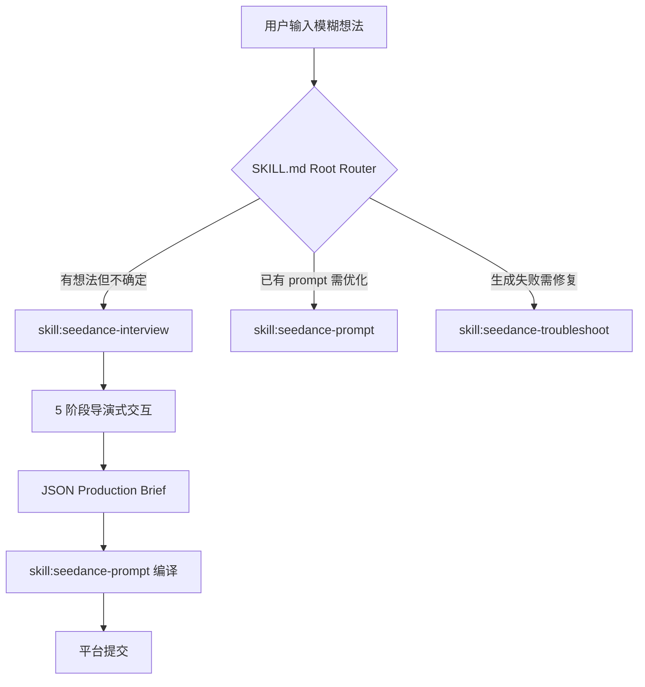
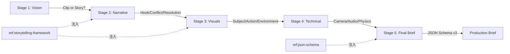

# PD-09.06 seedance-2.0 — 导演式 5 阶段交互工作流

> 文档编号：PD-09.06
> 来源：seedance-2.0 `skills/seedance-interview/SKILL.md` `references/storytelling-framework.md`
> GitHub：https://github.com/Emily2040/seedance-2.0.git
> 问题域：PD-09 Human-in-the-Loop
> 状态：可复用方案

---

## 第 1 章 问题与动机

### 1.1 核心问题

AI 视频生成工具（如 Seedance 2.0）的核心矛盾：用户脑中有模糊的创意想法，但平台需要高度结构化、精确到镜头语言级别的 prompt 才能产出高质量视频。直接让用户写 prompt 会导致两个典型失败模式：

1. **信息不足**：用户写出 "beautiful cinematic sunset"，模型收到零可测量指令，输出泛化结果
2. **信息过载**：用户堆砌术语但缺乏结构，多个动作竞争导致画面混乱

seedance-2.0 的解法不是让 Agent 自动猜测用户意图，而是设计了一套**导演式多阶段交互工作流**（Director's Journey），通过结构化提问将用户从模糊想法引导到专业制作简报（Production Brief）。这是一种纯 Prompt/Skill 层面的 Human-in-the-Loop 实现——没有代码级的 `interrupt()` 或状态机，而是通过 Markdown 技能文档定义交互协议，由 LLM Agent 在运行时执行。

### 1.2 seedance-2.0 的解法概述

1. **5 阶段渐进式引导**：Vision → Narrative → Visuals → Technical → Final Brief，每阶段聚焦一个维度，避免信息过载（`skills/seedance-interview/SKILL.md:17-41`）
2. **导演式提问模板**：预定义 "Director's Questions" 引导用户思考情感温度、微观细节、环境反应、静默声音等创意维度（`skills/seedance-interview/SKILL.md:43-49`）
3. **叙事框架参考注入**：通过 `[ref:storytelling-framework]` 将专业叙事设计原则（Hook-Conflict-Resolution、Visual Layering、Director's Toolkit）注入 Agent 上下文（`references/storytelling-framework.md:1-33`）
4. **结构化 JSON 输出**：最终产出遵循 JSON Schema v3 的制作简报，包含 meta/ref/shot/lock/exit 字段，可直接编译为平台 prompt（`references/json-schema.md:7-34`）
5. **Anti-Slop 质量门控**：在交互过程中实时过滤 AI 空话（stunning/cinematic/epic 等），确保每个词都可被摄影机、测光表或秒表测量（`skills/seedance-antislop/SKILL.md:33-37`）

### 1.3 设计思想

| 设计原则 | 具体实现 | 理由 | 替代方案 |
|----------|----------|------|----------|
| 渐进式信息收集 | 5 阶段线性流程，每阶段只问一个维度 | 避免一次性信息过载，降低用户认知负担 | 单轮自由文本输入（信息不足） |
| 导演隐喻驱动 | 用电影导演术语（Hook/Conflict/Resolution）而非技术术语 | 让非技术用户也能参与创意决策 | 直接暴露 JSON Schema 字段 |
| 参考文档注入 | `[ref:storytelling-framework]` 动态加载叙事框架 | Agent 获得专业知识而不硬编码在 prompt 中 | 将所有知识写入单个巨型 SKILL.md |
| 可测量性优先 | Anti-Slop 协议：每个描述词必须可被物理设备测量 | 消除模糊描述，提升生成质量 | 允许自由描述，后处理修正 |
| Skill 级实现 | 纯 Markdown 定义交互协议，无代码依赖 | 跨 10+ Agent 平台可移植（Claude/Gemini/Codex/Cursor 等） | 代码级 interrupt() 实现（平台绑定） |

---

## 第 2 章 源码实现分析

### 2.1 架构概览

seedance-2.0 的 Human-in-the-Loop 架构是一个**技能路由 + 阶段式交互**的双层结构：

```
┌─────────────────────────────────────────────────────────┐
│                   SKILL.md (Root Router)                 │
│  "Start: [skill:seedance-interview]"                    │
│  → 识别任务类型 → 路由到对应子技能                        │
└──────────────────────┬──────────────────────────────────┘
                       │
                       ▼
┌─────────────────────────────────────────────────────────┐
│            seedance-interview (Director's Journey)       │
│                                                         │
│  Stage 1: Vision ──→ "Single Clip or Narrative Story?"  │
│       │                                                 │
│  Stage 2: Narrative ──→ Hook / Conflict / Resolution    │
│       │                    ↑                            │
│  Stage 3: Visuals ──→ Subject / Action / Environment    │
│       │              [ref:storytelling-framework]        │
│  Stage 4: Technical ──→ Camera / Audio / Physics        │
│       │                                                 │
│  Stage 5: Final Brief ──→ JSON Schema v3 output         │
│                            [ref:json-schema]            │
└─────────────────────────────────────────────────────────┘
                       │
                       ▼
┌─────────────────────────────────────────────────────────┐
│  seedance-prompt → seedance-copyright → seedance-antislop│
│  (编译 JSON → 纯文本)  (IP 检查)       (去空话)          │
└─────────────────────────────────────────────────────────┘
```

关键特征：**没有代码级状态机**。整个交互流程由 Markdown 文档定义，LLM Agent 在运行时解释并执行。这是一种"声明式 Human-in-the-Loop"——交互协议写在技能文档中，而非编码在程序逻辑里。

### 2.2 核心实现

#### 2.2.1 入口路由与技能触发



对应源码 `SKILL.md:15`：

```markdown
# seedance-20

Seedance 2.0 quad-modal AI filmmaking (T2V · I2V · V2V · R2V).

Start: [skill:seedance-interview] — reads story/script, asks gap-fill questions,
outputs production brief.
```

根路由器通过 `Start:` 指令将所有新项目导向 interview 技能。这是一个**强制 Human-in-the-Loop 入口**——Agent 不会跳过交互直接生成，而是必须先经过导演式访谈。

#### 2.2.2 五阶段交互协议



对应源码 `skills/seedance-interview/SKILL.md:17-41`：

```markdown
### Stage 1: The Vision (The "What")
Identify the core intent. Is it a **Single Cinematic Clip** or a **Narrative Story**?
- **Single Clip**: Focus on a specific moment, texture, or visual effect
- **Narrative Story**: Focus on characters, conflict, and emotional arc

### Stage 2: The Narrative Core (The "Why")
Establish the emotional anchor and hook.
- **The Hook**: What is the first thing that grabs the viewer?
- **The Conflict/Tension**: What is the central struggle or mystery?
- **The Resolution**: How does the scene or story conclude?

### Stage 3: Visual Layering (The "How")
Build the scene in layers using the [ref:storytelling-framework].
- **Subject Layer**: Primary and secondary subjects with specific attributes.
- **Action Layer**: Primary motion + secondary micro-movements
- **Environmental Layer**: Atmosphere, weather, and props that react to the action.

### Stage 4: Technical Precision
Define the "eye" of the camera and the "ear" of the scene.
- **Camera Language**: Specific lenses, shots, and movements.
- **Audio Design**: Music mood, specific SFX, and dialogue.
- **Physics & Constraints**: How should elements behave?

### Stage 5: The Final Production Brief
Output a structured JSON-ready brief following the [ref:json-schema].
```

每个阶段的设计遵循**单一职责原则**：Stage 1 只决定类型，Stage 2 只建立叙事锚点，Stage 3 只构建视觉层次。这种分离确保用户在每一步只需要思考一个维度。

#### 2.2.3 导演式提问模板

对应源码 `skills/seedance-interview/SKILL.md:43-49`：

```markdown
## Creative Prompts for the Interviewer

When interviewing the user, use these "Director's Questions" to pull out creative details:
- "What is the **emotional temperature** of this scene? Is it cold and sterile,
   or warm and intimate?"
- "If we were to zoom in on a **micro-detail**, what would we see? A single drop
   of amber liquid? A trembling hand?"
- "How does the **environment react** to the main action? Does the wind move the
   hair? Does the shockwave disperse the clouds?"
- "What is the **sound of the silence** in this scene? Is it a low ambient hum
   or a distant temple bell?"
```

这些问题的设计特点：
- **感官导向**：不问"你想要什么效果"，而是问"你看到/听到/感受到什么"
- **二选一锚定**：每个问题提供两个极端选项（cold/warm, hum/bell），降低开放式回答的认知负担
- **物理可测量**：每个答案都能直接映射到 prompt 中的可测量参数

### 2.3 实现细节

#### 叙事框架注入机制

`[ref:storytelling-framework]` 是 seedance-2.0 的参考文档注入语法。当 Agent 执行 Stage 3 时，会加载 `references/storytelling-framework.md` 的内容作为上下文。该文档定义了 5 层专业叙事设计原则（`references/storytelling-framework.md:1-33`）：

- **Narrative Core**：Hook → Conflict → Resolution 三幕结构
- **Visual Layering**：Subject Layer → Action Layer → Environmental Layer 三层视觉堆叠
- **Director's Toolkit**：Temporal Sequence（时间序列）、Camera Language（镜头语言）、Physics & Constraints（物理约束）
- **Genre-Specific Mastery**：Luxury/Action/Anime/Documentary 四种类型的专业技巧
- **Anti-Slop Protocol**：用具体材质名（copper, brass, silk）替代空泛形容词

#### Anti-Slop 实时质量门控

在交互过程中，Agent 同时加载 `seedance-antislop` 技能作为质量过滤器。核心判定规则（`skills/seedance-antislop/SKILL.md:33-37`）：

> "Can a camera, light meter, or stopwatch measure this?" If yes → keep. If no → delete.

这意味着在 Stage 3-4 的交互中，如果用户说"我想要 cinematic lighting"，Agent 不会直接接受，而是追问"你指的是 45° 硬光从左侧打过来，还是柔和的背光？"——将不可测量的描述转化为可测量的参数。

#### JSON Schema v3 输出结构

Stage 5 的最终产出遵循严格的 JSON Schema（`references/json-schema.md:7-34`），包含：
- `meta`：模式（T2V/I2V/V2V/R2V）、委托级别（1-4）、时长、宽高比、分辨率
- `ref`：@Tag 资产引用（角色/背景/运镜/音乐）
- `shot`：五层 prompt 栈（Subject/Action/Camera/Light/Style/Sound）
- `lock`：一致性锁定目标
- `exit`：最后一帧/结束行为

这个 JSON 不直接提交给平台，而是通过 `seedance-prompt` 技能编译为纯文本 prompt。

