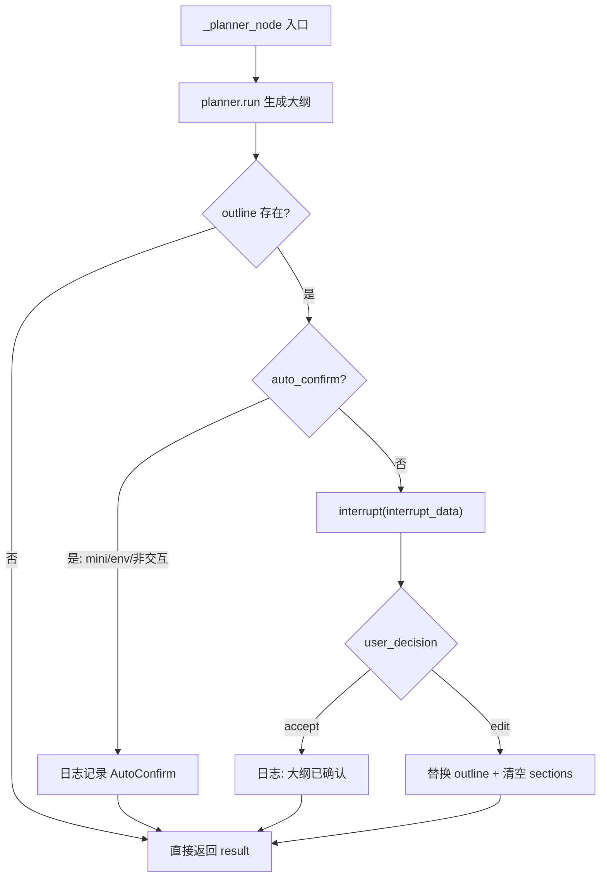
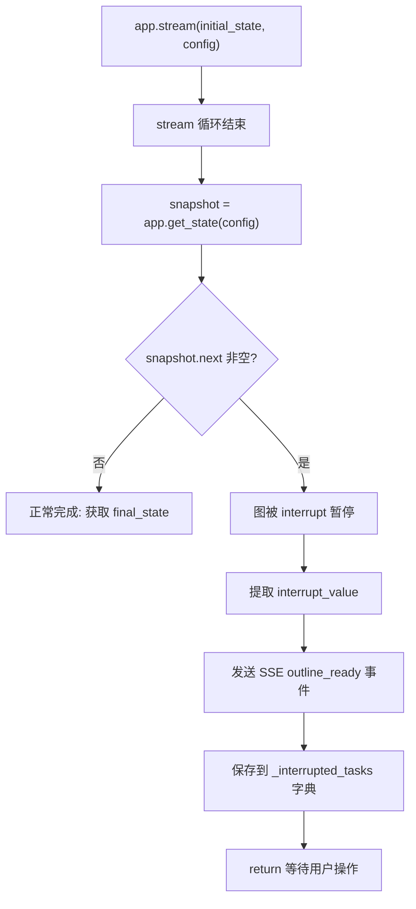
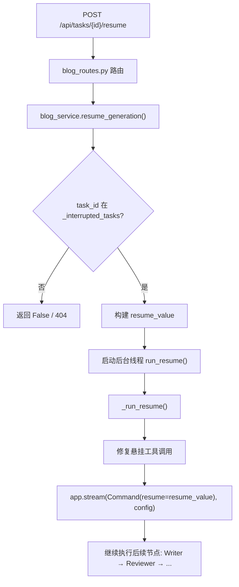

# PD-09.07 vibe-blog — LangGraph 原生 interrupt 大纲交互式确认

> 文档编号：PD-09.07
> 来源：vibe-blog `backend/services/blog_generator/generator.py`
> GitHub：https://github.com/datawhalechina/vibe-blog.git
> 问题域：PD-09 Human-in-the-Loop
> 状态：可复用方案

---

## 第 1 章 问题与动机

### 1.1 核心问题

长文博客生成是一个多 Agent 协同的流水线任务（Researcher → Planner → Writer → Reviewer → Assembler），整个流程耗时数分钟到十几分钟。如果 Planner 生成的大纲不符合用户预期，后续所有 Agent 的工作都将白费。

核心矛盾：**自动化效率 vs 用户控制权**。用户需要在关键决策点（大纲确认）介入，但不应阻塞整个系统或引入复杂的线程同步机制。

传统方案（如 `threading.Event` 阻塞等待）存在三个问题：
1. 阻塞工作线程，浪费服务器资源
2. 无法持久化中断状态，服务重启后任务丢失
3. 难以扩展到多个中断点（如后续可能增加的"写作完成确认"）

### 1.2 vibe-blog 的解法概述

vibe-blog 采用 LangGraph 原生 `interrupt()` 机制实现大纲交互式确认，核心设计：

1. **单点 interrupt**：仅在 `_planner_node` 中调用 `interrupt()`，暂停整个 StateGraph 执行（`generator.py:365`）
2. **MemorySaver 持久化**：通过 LangGraph 的 `MemorySaver` checkpointer 自动保存中断时的完整图状态（`generator.py:1202`）
3. **Command(resume=...) 恢复**：用户确认/编辑后，通过 `Command(resume=resume_value)` 恢复图执行（`blog_service.py:1387`）
4. **三条件自动跳过**：mini 模式、`OUTLINE_AUTO_CONFIRM=true` 环境变量、非交互式模式均自动跳过 interrupt（`generator.py:349-352`）
5. **SSE 事件驱动前端**：interrupt 暂停后通过 SSE 推送 `outline_ready` 事件，前端展示大纲编辑 UI（`blog_service.py:1034-1039`）

### 1.3 设计思想

| 设计原则 | 具体实现 | 理由 | 替代方案 |
|----------|----------|------|----------|
| 框架原生优先 | 使用 LangGraph `interrupt()` 而非自建暂停机制 | 自动获得状态持久化、可恢复性、多中断点支持 | `threading.Event` 阻塞等待 |
| 最小侵入 | interrupt 仅在 `_planner_node` 内部 3 行代码 | 不改变图拓扑结构，不增加额外节点 | 增加专门的 "human_review" 节点 |
| 渐进式降级 | mini/auto_confirm/非交互三条件跳过 | 测试、CI、快速生成场景无需人工介入 | 强制所有模式都走 interrupt |
| 后台线程恢复 | `resume_generation` 在新线程中执行 `Command(resume=...)` | 不阻塞 HTTP 请求线程，SSE 可继续推送进度 | 同步阻塞等待恢复完成 |
| 结构化中断数据 | interrupt 传递完整大纲结构（title/sections/narrative_mode） | 前端可直接渲染编辑 UI，无需额外查询 | 只传 task_id，前端再查询大纲 |

---

## 第 2 章 源码实现分析

### 2.1 架构概览

vibe-blog 的 HITL 实现分为三层：

```
┌─────────────────────────────────────────────────────────────┐
│                    前端 (Vue 3)                              │
│  api.ts: resumeTask() / confirmOutline()                    │
│  SSE EventSource: 监听 outline_ready 事件                    │
├─────────────────────────────────────────────────────────────┤
│                    路由层 (Flask)                             │
│  blog_routes.py: POST /api/tasks/<id>/resume                │
│  blog_routes.py: POST /api/tasks/<id>/confirm-outline       │
├─────────────────────────────────────────────────────────────┤
│                    服务层 (BlogService)                       │
│  blog_service.py: resume_generation() → _run_resume()       │
│  blog_service.py: _interrupted_tasks 字典管理中断状态         │
├─────────────────────────────────────────────────────────────┤
│                    工作流层 (BlogGenerator)                   │
│  generator.py: _planner_node() 内调用 interrupt()            │
│  generator.py: MemorySaver checkpointer 持久化图状态          │
└─────────────────────────────────────────────────────────────┘
```

### 2.2 核心实现

#### 2.2.1 Planner 节点中的 interrupt 触发



对应源码 `backend/services/blog_generator/generator.py:337-406`：

```python
def _planner_node(self, state: SharedState) -> SharedState:
    """大纲规划节点"""
    logger.info("=== Step 2: 大纲规划 ===")
    self._validate_layer("structure", state)
    on_stream = getattr(self, '_outline_stream_callback', None)
    result = self.planner.run(state, on_stream=on_stream)

    outline = result.get('outline') if isinstance(result, dict) else None

    # 三条件自动确认：mini 模式 / 环境变量 / 非交互式
    auto_confirm = (
        state.get('target_length') == 'mini'
        or os.getenv('OUTLINE_AUTO_CONFIRM', 'false').lower() == 'true'
    )

    if outline and getattr(self, '_interactive', False) and not auto_confirm:
        sections = outline.get('sections', [])
        interrupt_data = {
            "type": "confirm_outline",
            "title": outline.get("title", ""),
            "sections": sections,
            "sections_titles": [s.get("title", "") for s in sections],
            "narrative_mode": outline.get("narrative_mode", ""),
            "narrative_flow": outline.get("narrative_flow", {}),
            "sections_narrative_roles": [s.get("narrative_role", "") for s in sections],
        }
        user_decision = interrupt(interrupt_data)

        if isinstance(user_decision, dict) and user_decision.get("action") == "edit":
            edited_outline = user_decision.get("outline", outline)
            result['outline'] = edited_outline
            result['sections'] = []  # 清空已有章节，重新写作
        else:
            logger.info("大纲已被用户确认")
    elif outline and auto_confirm:
        logger.info(f"[AutoConfirm] 自动确认大纲 (target_length={state.get('target_length')})")

    return result
```

关键设计点：
- `interrupt()` 是 LangGraph 原生 API（`from langgraph.types import interrupt`，`generator.py:14`），调用后图执行立即暂停
- `interrupt_data` 包含完整的大纲结构化数据，前端可直接渲染
- 用户编辑大纲时，`result['sections'] = []` 清空已有章节，确保 Writer 基于新大纲重新写作

#### 2.2.2 中断状态检测与 SSE 推送



对应源码 `backend/services/blog_generator/blog_service.py:1021-1059`：

```python
# 101.113: 检查是否因 interrupt 暂停（交互式大纲确认）
snapshot = self.generator.app.get_state(config)
if snapshot.next:  # 图还有未完成的节点 → 被 interrupt 暂停了
    logger.info(f"图执行被 interrupt 暂停，等待用户确认大纲 [{task_id}]")
    # 提取 interrupt 数据
    interrupt_value = None
    if snapshot.tasks:
        for task in snapshot.tasks:
            if hasattr(task, 'interrupts') and task.interrupts:
                interrupt_value = task.interrupts[0].value
                break

    # 发送 outline_ready 事件到前端
    if task_manager and interrupt_value and interrupt_value.get('type') == 'confirm_outline':
        task_manager.send_event(task_id, 'outline_ready', {
            'title': interrupt_value.get('title', ''),
            'sections': interrupt_value.get('sections', []),
            'sections_titles': interrupt_value.get('sections_titles', []),
        })

    # 保存任务信息，供 resume_generation 使用
    self._interrupted_tasks[task_id] = {
        'config': config,
        'task_manager': task_manager,
        'app': self._get_flask_app(),
        'topic': topic,
        'article_type': article_type,
        'target_length': target_length,
        # ... 更多上下文
    }
```

#### 2.2.3 恢复执行流程



对应源码 `backend/services/blog_generator/blog_service.py:157-215`：

```python
def resume_generation(self, task_id: str, action: str = 'accept', outline: dict = None) -> bool:
    task_info = self._interrupted_tasks.get(task_id)
    if not task_info:
        return False

    # 构建 resume 值
    if action == 'edit' and outline:
        resume_value = {"action": "edit", "outline": outline}
    else:
        resume_value = "accept"

    # 在后台线程中恢复执行
    def run_resume():
        from langgraph.types import Command
        token = task_id_context.set(task_id)
        try:
            config = task_info['config']
            task_manager = task_info.get('task_manager')
            app_ctx = task_info.get('app')
            if app_ctx:
                with app_ctx.app_context():
                    self._run_resume(task_id=task_id, resume_value=resume_value,
                                     config=config, task_manager=task_manager, task_info=task_info)
        finally:
            task_id_context.reset(token)
            self._interrupted_tasks.pop(task_id, None)

    ctx = copy_context()
    thread = threading.Thread(target=ctx.run, args=(run_resume,), daemon=True)
    thread.start()
    return True
```

### 2.3 实现细节

**前端 API 层**（`frontend/src/services/api.ts:74-86`）：

```typescript
// 恢复中断的任务（101.113 LangGraph interrupt 方案）
export async function resumeTask(
  taskId: string,
  action: 'accept' | 'edit' = 'accept',
  outline?: any
): Promise<{ success: boolean; error?: string }> {
  const response = await fetch(`${API_BASE}/api/tasks/${taskId}/resume`, {
    method: 'POST',
    headers: { 'Content-Type': 'application/json' },
    body: JSON.stringify({ action, outline })
  })
  return response.json()
}

// 确认大纲（兼容旧接口，内部调用 resumeTask）
export async function confirmOutline(
  taskId: string,
  action: 'accept' | 'edit' = 'accept',
  outline?: any
): Promise<{ success: boolean; error?: string }> {
  return resumeTask(taskId, action, outline)
}
```

**路由层参数校验**（`backend/routes/blog_routes.py:481-507`）：

- `action` 只允许 `accept` 或 `edit`，其他值返回 400
- `action=edit` 时必须提供 `outline`，否则返回 400
- 任务不存在或未在等待确认时返回 404

**悬挂工具调用修复**（`blog_service.py:1370-1383`）：

resume 前检查 snapshot 中的消息历史，如果存在未配对的 tool_call（因 interrupt 中断导致），自动补充空的 tool_result，防止 LangGraph 恢复时报错。


---

## 第 3 章 迁移指南

### 3.1 迁移清单

**阶段 1：基础 interrupt 机制（1 个中断点）**

- [ ] 安装 `langgraph >= 0.2.0`（需要 `interrupt()` 和 `Command` 支持）
- [ ] 在 StateGraph 编译时传入 `MemorySaver()` 作为 checkpointer
- [ ] 在需要人工确认的节点内调用 `interrupt(data)`
- [ ] 实现 `resume` 方法：用 `Command(resume=value)` 恢复图执行
- [ ] 添加 HTTP 端点接收用户确认/编辑操作

**阶段 2：自动跳过与降级**

- [ ] 添加环境变量控制（如 `AUTO_CONFIRM=true`）跳过 interrupt
- [ ] 添加模式控制（如 mini 模式自动跳过）
- [ ] 添加非交互式标志（CLI/批处理场景）

**阶段 3：前端集成**

- [ ] SSE/WebSocket 推送 interrupt 事件到前端
- [ ] 前端渲染结构化编辑 UI（基于 interrupt_data）
- [ ] 前端调用 resume API 提交用户决策

### 3.2 适配代码模板

以下是一个可直接运行的最小化 LangGraph interrupt 实现：

```python
"""最小化 LangGraph interrupt 示例 — 可直接运行"""

import os
from typing import TypedDict, Literal
from langgraph.graph import StateGraph, START, END
from langgraph.checkpoint.memory import MemorySaver
from langgraph.types import interrupt, Command


class PlanState(TypedDict):
    topic: str
    outline: dict
    content: str
    auto_confirm: bool


def planner_node(state: PlanState) -> PlanState:
    """规划节点 — 生成大纲后 interrupt 等待确认"""
    outline = {
        "title": f"关于 {state['topic']} 的深度分析",
        "sections": [
            {"title": "背景介绍", "key_points": ["历史", "现状"]},
            {"title": "核心技术", "key_points": ["原理", "实现"]},
            {"title": "实践案例", "key_points": ["案例1", "案例2"]},
        ],
    }
    state["outline"] = outline

    # 三条件跳过 interrupt
    auto_confirm = (
        state.get("auto_confirm", False)
        or os.getenv("OUTLINE_AUTO_CONFIRM", "false").lower() == "true"
    )

    if not auto_confirm:
        # interrupt() 暂停图执行，返回值是用户恢复时传入的数据
        user_decision = interrupt({
            "type": "confirm_outline",
            "title": outline["title"],
            "sections": outline["sections"],
        })

        if isinstance(user_decision, dict) and user_decision.get("action") == "edit":
            state["outline"] = user_decision.get("outline", outline)

    return state


def writer_node(state: PlanState) -> PlanState:
    """写作节点 — 基于确认后的大纲生成内容"""
    sections = state["outline"].get("sections", [])
    state["content"] = "\n\n".join(
        f"## {s['title']}\n内容..." for s in sections
    )
    return state


# 构建图
workflow = StateGraph(PlanState)
workflow.add_node("planner", planner_node)
workflow.add_node("writer", writer_node)
workflow.add_edge(START, "planner")
workflow.add_edge("planner", "writer")
workflow.add_edge("writer", END)

# 编译时传入 checkpointer（interrupt 必需）
app = workflow.compile(checkpointer=MemorySaver())

# === 使用示例 ===

config = {"configurable": {"thread_id": "demo-1"}}

# 1. 启动执行（会在 planner 的 interrupt 处暂停）
for event in app.stream({"topic": "LangGraph", "auto_confirm": False}, config):
    print(f"事件: {list(event.keys())}")

# 2. 检查是否被 interrupt 暂停
snapshot = app.get_state(config)
if snapshot.next:
    print("图被 interrupt 暂停，等待用户确认...")
    # 提取 interrupt 数据
    for task in snapshot.tasks:
        if hasattr(task, 'interrupts') and task.interrupts:
            print(f"大纲: {task.interrupts[0].value}")

    # 3. 用户确认后恢复执行
    for event in app.stream(Command(resume="accept"), config):
        print(f"恢复事件: {list(event.keys())}")

# 4. 获取最终结果
final = app.get_state(config)
print(f"最终内容: {final.values.get('content', '')[:100]}...")
```

### 3.3 适用场景

| 场景 | 适用度 | 说明 |
|------|--------|------|
| LangGraph 工作流中的关键决策点 | ⭐⭐⭐ | 原生支持，零额外依赖 |
| 多步骤内容生成（大纲→写作→审核） | ⭐⭐⭐ | vibe-blog 的核心场景 |
| 需要持久化中断状态的长任务 | ⭐⭐⭐ | MemorySaver 自动处理 |
| 非 LangGraph 框架的 Agent 系统 | ⭐ | 需要自建类似机制 |
| 需要多个并发中断点 | ⭐⭐ | LangGraph 支持但 vibe-blog 未使用 |
| 实时协作编辑场景 | ⭐ | interrupt 是单次暂停-恢复，不适合持续交互 |

---

## 第 4 章 测试用例

vibe-blog 提供了三层测试覆盖：单元测试、API 路由测试、自动确认测试。

以下基于源项目真实测试（`backend/tests/unit/test_101_113_interrupt_unit.py` 和 `backend/tests/test_outline_auto_confirm.py`）：

```python
"""PD-09 Human-in-the-Loop 测试用例 — 基于 vibe-blog 真实测试"""

import os
import pytest
from unittest.mock import MagicMock, patch


class TestInterruptTrigger:
    """测试 interrupt 触发条件"""

    @patch('langgraph.types.interrupt')
    def test_interactive_mode_triggers_interrupt(self, mock_interrupt):
        """交互式模式下应触发 interrupt"""
        mock_interrupt.return_value = "accept"
        # 模拟 _planner_node 逻辑
        outline = {"title": "测试", "sections": [{"title": "S1", "narrative_role": "intro"}]}
        interactive = True
        auto_confirm = False

        if outline and interactive and not auto_confirm:
            interrupt_data = {
                "type": "confirm_outline",
                "title": outline["title"],
                "sections": outline["sections"],
            }
            mock_interrupt(interrupt_data)

        mock_interrupt.assert_called_once()
        call_data = mock_interrupt.call_args[0][0]
        assert call_data["type"] == "confirm_outline"

    @patch('langgraph.types.interrupt')
    def test_mini_mode_skips_interrupt(self, mock_interrupt):
        """mini 模式应跳过 interrupt"""
        target_length = "mini"
        auto_confirm = target_length == "mini"
        assert auto_confirm is True
        # interrupt 不应被调用

    @patch('langgraph.types.interrupt')
    def test_env_var_skips_interrupt(self, mock_interrupt):
        """OUTLINE_AUTO_CONFIRM=true 应跳过 interrupt"""
        with patch.dict(os.environ, {"OUTLINE_AUTO_CONFIRM": "true"}):
            auto_confirm = os.getenv("OUTLINE_AUTO_CONFIRM", "false").lower() == "true"
            assert auto_confirm is True


class TestEditAction:
    """测试用户编辑大纲"""

    def test_edit_replaces_outline_and_clears_sections(self):
        """edit 操作应替换大纲并清空 sections"""
        result = {
            "outline": {"title": "原始", "sections": [{"title": "旧章节"}]},
            "sections": [{"content": "旧内容"}],
        }
        user_decision = {"action": "edit", "outline": {"title": "新大纲", "sections": []}}

        if user_decision.get("action") == "edit":
            result["outline"] = user_decision.get("outline", result["outline"])
            result["sections"] = []

        assert result["outline"]["title"] == "新大纲"
        assert result["sections"] == []


class TestResumeGeneration:
    """测试恢复中断任务"""

    def test_unknown_task_returns_false(self):
        """未知任务 ID 应返回 False"""
        interrupted_tasks = {}
        task_id = "unknown"
        assert interrupted_tasks.get(task_id) is None

    def test_resume_value_construction(self):
        """resume_value 构建逻辑"""
        # accept
        action, outline = "accept", None
        resume_value = {"action": "edit", "outline": outline} if action == "edit" and outline else "accept"
        assert resume_value == "accept"

        # edit
        action, outline = "edit", {"title": "new"}
        resume_value = {"action": "edit", "outline": outline} if action == "edit" and outline else "accept"
        assert resume_value == {"action": "edit", "outline": {"title": "new"}}


class TestInterruptDataStructure:
    """测试 interrupt 数据结构完整性"""

    def test_interrupt_data_has_required_fields(self):
        """interrupt_data 应包含所有必要字段"""
        outline = {
            "title": "AI 入门",
            "sections": [
                {"title": "什么是 AI", "narrative_role": "intro"},
                {"title": "AI 应用", "narrative_role": "body"},
            ],
            "narrative_mode": "progressive",
            "narrative_flow": {"type": "linear"},
        }
        sections = outline["sections"]
        interrupt_data = {
            "type": "confirm_outline",
            "title": outline["title"],
            "sections": sections,
            "sections_titles": [s["title"] for s in sections],
            "narrative_mode": outline["narrative_mode"],
            "narrative_flow": outline["narrative_flow"],
            "sections_narrative_roles": [s["narrative_role"] for s in sections],
        }

        required_fields = ["type", "title", "sections", "sections_titles",
                          "narrative_mode", "narrative_flow", "sections_narrative_roles"]
        for field in required_fields:
            assert field in interrupt_data

        assert interrupt_data["sections_titles"] == ["什么是 AI", "AI 应用"]
        assert interrupt_data["sections_narrative_roles"] == ["intro", "body"]
```


---

## 第 5 章 跨域关联

| 关联域 | 关系类型 | 说明 |
|--------|----------|------|
| PD-02 多 Agent 编排 | 依赖 | interrupt 发生在 StateGraph 的 planner 节点内，依赖 LangGraph 的图编排能力。图的 `stream()` 循环在 interrupt 后自然结束，`snapshot.next` 检测暂停状态 |
| PD-06 记忆持久化 | 协同 | `MemorySaver` checkpointer 同时服务于 interrupt 状态持久化和会话记忆。没有 checkpointer，interrupt 无法工作 |
| PD-03 容错与重试 | 协同 | `_run_resume` 中的悬挂工具调用修复（`fix_dangling_tool_calls`）是容错机制的一部分，防止 resume 时因消息历史不完整而报错 |
| PD-10 中间件管道 | 协同 | 所有节点通过 `pipeline.wrap_node()` 包装，interrupt 发生在中间件包装后的节点内部，中间件的 tracing/error_tracking 仍然生效 |
| PD-11 可观测性 | 协同 | interrupt 暂停和 resume 恢复都通过 SSE 事件推送到前端，`task_manager.send_event` 记录完整的交互时间线 |
| PD-07 质量检查 | 下游 | 大纲确认后，后续的 Reviewer 节点对写作质量进行检查。用户在大纲阶段的修改直接影响 Reviewer 的评估基准 |

---

## 第 6 章 来源文件索引

| 文件 | 行范围 | 关键实现 |
|------|--------|----------|
| `backend/services/blog_generator/generator.py` | L14 | `from langgraph.types import interrupt` 导入 |
| `backend/services/blog_generator/generator.py` | L337-406 | `_planner_node` — interrupt 触发、auto_confirm 三条件判断、edit 处理 |
| `backend/services/blog_generator/generator.py` | L1194-1205 | `compile()` — MemorySaver checkpointer 初始化 |
| `backend/services/blog_generator/generator.py` | L211-326 | `_build_workflow()` — StateGraph 完整拓扑定义 |
| `backend/services/blog_generator/blog_service.py` | L54 | `_interrupted_tasks` 字典定义 |
| `backend/services/blog_generator/blog_service.py` | L157-215 | `resume_generation()` — 后台线程恢复执行 |
| `backend/services/blog_generator/blog_service.py` | L1021-1059 | interrupt 状态检测、SSE 推送、任务信息保存 |
| `backend/services/blog_generator/blog_service.py` | L1298-1427 | `_run_resume()` — Command(resume=...) 恢复执行 + 悬挂工具调用修复 |
| `backend/routes/blog_routes.py` | L481-507 | `resume_task()` — HTTP 路由，参数校验 |
| `backend/routes/blog_routes.py` | L510-513 | `confirm_outline()` — 兼容旧接口 |
| `frontend/src/services/api.ts` | L74-86 | `resumeTask()` / `confirmOutline()` — 前端 API 封装 |
| `backend/tests/unit/test_101_113_interrupt_unit.py` | L1-275 | 单元测试：interrupt 触发、resume 构建、数据结构 |
| `backend/tests/test_outline_auto_confirm.py` | L1-157 | 自动确认测试：mini 模式、环境变量、非交互式 |
| `backend/tests/api/test_101_113_interrupt_api.py` | L1-196 | API 路由测试：resume/confirm-outline 端点 |

---

## 第 7 章 横向对比维度

> **重要：** 本章用于自动填充 Butcher Wiki 的横向对比表。

```json comparison_data
{
  "project": "vibe-blog",
  "dimensions": {
    "暂停机制": "LangGraph 原生 interrupt()，图执行自动暂停，MemorySaver 持久化状态",
    "澄清类型": "结构化大纲确认（confirm_outline），含 title/sections/narrative_mode 完整字段",
    "状态持久化": "MemorySaver checkpointer 自动保存，snapshot.next 检测暂停，Command(resume=...) 恢复",
    "实现层级": "节点内部 3 行代码（interrupt 调用），不改变图拓扑结构",
    "身份绑定": "task_id 绑定 _interrupted_tasks 字典，无显式身份校验",
    "多通道转发": "SSE 单通道推送 outline_ready 事件到前端",
    "审查粒度控制": "大纲级别：用户可编辑标题、章节列表、叙事模式",
    "人机角色互换": "不支持，interrupt 仅用于人工确认/编辑",
    "升级策略": "无超时升级，依赖用户主动操作",
    "通知容错": "SSE 单通道，无多通道容错",
    "自动跳过机制": "三条件降级：mini 模式 / OUTLINE_AUTO_CONFIRM 环境变量 / 非交互式标志"
  }
}
```

### 域元数据补充

```json domain_metadata
{
  "solution_summary": "vibe-blog 用 LangGraph 原生 interrupt() 在 Planner 节点暂停图执行，MemorySaver 持久化状态，Command(resume=...) 恢复，支持 mini/env/非交互三条件自动跳过",
  "description": "内容生成流水线中关键决策点的人工介入与自动跳过平衡",
  "sub_problems": [
    "自动确认降级：测试/CI/快速模式下如何优雅跳过人工确认而不改变图拓扑",
    "悬挂工具调用修复：interrupt 中断导致消息历史中 tool_call 未配对时的恢复策略",
    "后台线程恢复：HTTP 请求线程与图执行线程分离时的上下文传递（Flask app_context/contextvars）"
  ],
  "best_practices": [
    "interrupt 数据应包含完整结构化内容，前端可直接渲染编辑 UI 而无需额外查询",
    "编辑操作后清空下游产出（sections=[]），确保后续节点基于新输入重新执行",
    "resume 前检查并修复悬挂工具调用，防止 LangGraph 恢复时因消息历史不完整报错"
  ]
}
```

