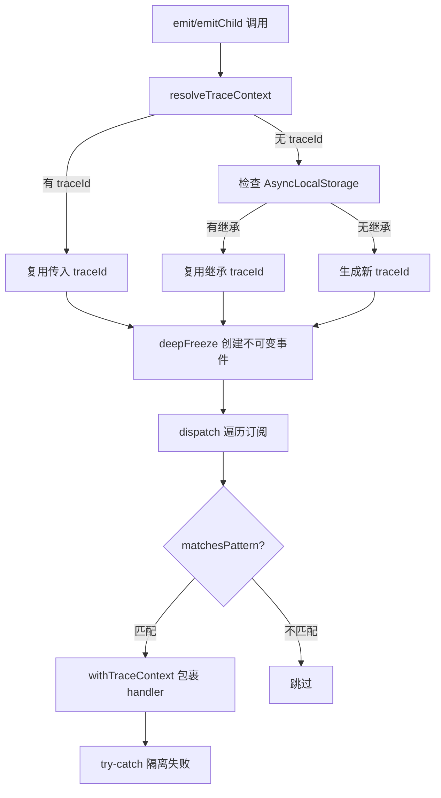
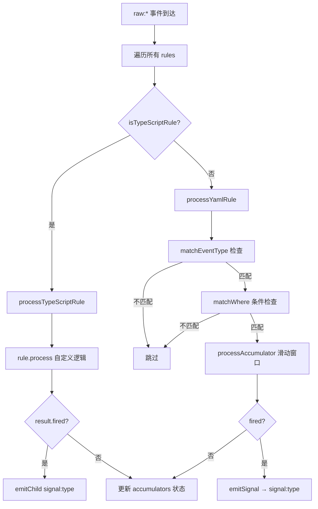
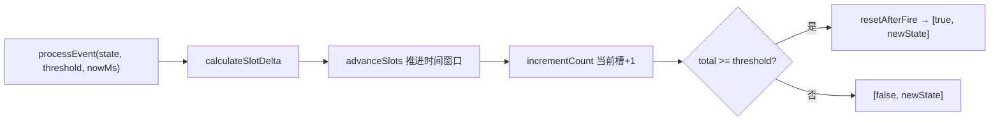

# PD-10.06 AIRI — 三层感知管道与 YAML 规则引擎

> 文档编号：PD-10.06
> 来源：AIRI `services/minecraft/src/cognitive/`
> GitHub：https://github.com/moeru-ai/airi.git
> 问题域：PD-10 中间件管道 Middleware Pipeline
> 状态：可复用方案

---

## 第 1 章 问题与动机（≥ 30 行）

### 1.1 核心问题

Minecraft 认知 AI 需要处理大量高频游戏事件（实体移动、攻击、聊天、环境变化），并将这些原始事件转化为有意义的"信号"供上层决策使用。核心挑战：

1. **事件洪流**：`entityMoved` 等事件每秒触发数百次，直接传递给 LLM 不现实
2. **语义鸿沟**：原始事件（"实体 A 蹲下"）与语义信号（"玩家在 teabag"）之间需要聚合推理
3. **规则可配置**：不同游戏场景需要不同的感知规则，硬编码不可维护
4. **层级解耦**：感知层（Perception）、反射层（Reflex）、意识层（Conscious/LLM）需要清晰分离

### 1.2 AIRI 的解法概述

AIRI 实现了一个三层感知管道，通过 EventBus 串联：

1. **PerceptionPipeline**（`pipeline.ts:9`）— 将 Mineflayer 原始事件转换为类型化的 `raw:modality:kind` 事件
2. **RuleEngine**（`rules/engine.ts:41`）— 订阅 `raw:*` 事件，通过 YAML 规则 + 滑动窗口累加器聚合事件，达到阈值后发射 `signal:*` 信号
3. **ReflexManager**（`reflex/reflex-manager.ts:13`）— 订阅 `signal:*` 信号，更新上下文状态，驱动行为选择，并决定是否转发给意识层（Brain/LLM）

所有组件通过 Awilix DI 容器（`container.ts:29`）注册为单例，EventBus 是唯一的通信通道。

### 1.3 设计思想

| 设计原则 | 具体实现 | 理由 | 替代方案 |
|----------|----------|------|----------|
| 纯函数状态管理 | accumulator/matcher 全部纯函数，Object.freeze 不可变 | 避免并发修改，便于测试和推理 | 可变状态 + 锁 |
| YAML 声明式规则 | 规则用 YAML 定义 trigger/accumulator/signal | 非程序员可配置，热加载友好 | 硬编码 if-else |
| 通配符事件路由 | EventBus 支持 `raw:*`、`signal:*` 模式匹配 | 松耦合，新事件类型无需修改订阅者 | 精确事件名注册 |
| TypeScript 逃生舱 | `TypeScriptRule` 接口允许复杂逻辑绕过 YAML | YAML 表达力有限时的安全出口 | 全部 YAML 或全部代码 |
| AsyncLocalStorage 追踪 | 事件分发时自动传播 traceId/parentId | 因果链追踪，无需手动传参 | 显式传递 context 对象 |
| DI 容器生命周期 | Awilix singleton + 显式 init/destroy | 组件间依赖清晰，销毁顺序可控 | 全局变量或手动 new |

---

## 第 2 章 源码实现分析（≥ 60 行，核心章节）

### 2.1 架构概览

AIRI 认知引擎的三层管道架构：

```
┌─────────────────────────────────────────────────────────────────┐
│                    CognitiveEngine (index.ts)                    │
│                    Awilix DI Container (container.ts)            │
├─────────────────────────────────────────────────────────────────┤
│                                                                  │
│  ┌──────────────────┐    ┌──────────────────┐    ┌────────────┐ │
│  │ PerceptionPipeline│    │   RuleEngine     │    │  Reflex    │ │
│  │                  │    │                  │    │  Manager   │ │
│  │ Mineflayer Bot   │    │ YAML Rules       │    │            │ │
│  │ ──→ EventRegistry│    │ ──→ Accumulator  │    │ ──→ Context│ │
│  │ ──→ raw:mod:kind │    │ ──→ signal:type  │    │ ──→ Modes  │ │
│  └────────┬─────────┘    └────────┬─────────┘    └──────┬─────┘ │
│           │                       │                      │       │
│           ▼                       ▼                      ▼       │
│  ┌──────────────────────────────────────────────────────────┐   │
│  │                     EventBus                              │   │
│  │  emit() ──→ dispatch() ──→ matchesPattern() ──→ handler() │   │
│  │  AsyncLocalStorage: traceId + parentId 自动传播            │   │
│  └──────────────────────────────────────────────────────────┘   │
│           │                                                      │
│           ▼                                                      │
│  ┌──────────────────┐                                           │
│  │  Brain (LLM)     │  ← conscious:signal:* (经 Reflex 过滤)    │
│  └──────────────────┘                                           │
└─────────────────────────────────────────────────────────────────┘
```

### 2.2 核心实现

#### 2.2.1 EventBus — 带追踪的发布订阅中枢



对应源码 `event-bus.ts:106-171`：

```typescript
export class EventBus {
  private readonly subscriptions = new Map<number, Subscription>()
  private nextSubId = 0

  public emit<T>(input: EventInput<T>): TracedEvent<T> {
    const trace = resolveTraceContext({
      traceId: input.traceId,
      parentId: input.parentId,
    })
    const event = deepFreeze({
      id: generateEventId(),
      traceId: trace.traceId,
      parentId: trace.parentId,
      type: input.type,
      payload: input.payload,
      timestamp: Date.now(),
      source: input.source,
    } satisfies TracedEvent<T>)
    this.dispatch(event)
    return event
  }

  public emitChild<T>(
    parent: TracedEvent,
    input: Omit<EventInput<T>, 'traceId' | 'parentId'>,
  ): TracedEvent<T> {
    return this.emit({
      ...input,
      traceId: parent.traceId,
      parentId: parent.id,
    })
  }

  private dispatch(event: TracedEvent): void {
    for (const sub of this.subscriptions.values()) {
      if (!matchesPattern(sub.pattern, event.type))
        continue
      try {
        withTraceContext(event.traceId, event.id, () => {
          sub.handler(event)
        })
      }
      catch {
        // 隔离订阅者失败，保持 dispatch 弹性
      }
    }
  }
}
```

关键设计点：
- `deepFreeze` 确保事件不可变（`event-bus.ts:67-81`）
- `emitChild` 自动继承父事件的 traceId 并设置 parentId（`event-bus.ts:130-139`）
- `dispatch` 中 try-catch 隔离每个 handler 的异常（`event-bus.ts:161-169`）
- `matchesPattern` 支持 `*`（全匹配）和 `prefix:*`（前缀通配）（`event-bus.ts:55-65`）

#### 2.2.2 RuleEngine — YAML 驱动的事件聚合



对应源码 `rules/engine.ts:133-194`：

```typescript
private processEvent(event: TracedEvent): void {
  const nowMs = Date.now()
  const slotMs = this.deps.config.slotMs ?? DEFAULT_SLOT_MS

  for (const rule of this.rules) {
    try {
      if (isTypeScriptRule(rule)) {
        this.processTypeScriptRule(rule, event, nowMs)
      } else {
        this.processYamlRule(rule, event, nowMs, slotMs)
      }
    } catch (err) {
      this.deps.logger
        .withError(err as Error)
        .withFields({ ruleName: rule.name })
        .error('RuleEngine: rule processing failed')
    }
  }
}

private processYamlRule(rule: ParsedRule, event: TracedEvent, nowMs: number, slotMs: number): void {
  if (!matchEventType(rule.trigger.eventType, event.type)) return
  if (!matchWhere(rule.trigger.where, event.payload)) return

  let accState = this.accumulators[rule.name]
  if (!accState) {
    const windowSlots = calculateWindowSlots(rule.accumulator.windowMs, slotMs)
    accState = createAccumulatorState(windowSlots)
  }

  const [fired, newAccState] = processAccumulator(accState, rule.accumulator.threshold, nowMs, slotMs)
  this.accumulators = Object.freeze({ ...this.accumulators, [rule.name]: newAccState })

  if (fired) {
    this.emitSignal(rule, event)
  }
}
```

#### 2.2.3 滑动窗口累加器 — 纯函数实现



对应源码 `rules/accumulator.ts:129-155`：

```typescript
export function processEvent(
  state: AccumulatorState,
  threshold: number,
  nowMs: number,
  slotMs: number = DEFAULT_SLOT_MS,
): readonly [boolean, AccumulatorState] {
  const slotDelta = calculateSlotDelta(state.lastUpdateMs, nowMs, slotMs)
  let newState = advanceSlots(state, slotDelta, slotMs)
  newState = Object.freeze({ ...newState, lastUpdateMs: nowMs })
  newState = incrementCount(newState)

  if (newState.total >= threshold) {
    const firedState = resetAfterFire(newState, newState.head)
    return [true, firedState] as const
  }
  return [false, newState] as const
}
```

累加器使用环形缓冲区（circular buffer）实现滑动窗口：
- `counts` 数组是固定大小的环形缓冲区（`accumulator.ts:22`）
- `head` 指针标记当前写入位置（`accumulator.ts:23`）
- `advanceSlots` 推进时间时清零过期槽位并扣减 total（`accumulator.ts:48-85`）
- 每个函数返回新的 frozen 对象，零副作用

### 2.3 实现细节

#### YAML 规则 DSL

YAML 规则文件定义了完整的事件→信号转换逻辑。以 `teabag.yaml` 为例：

```yaml
name: teabag-attention
version: 1
trigger:
  modality: sighted
  kind: sneak_toggle
  where:
    entityType: player
accumulator:
  threshold: 6        # 6 次蹲下
  window: 1s          # 1 秒内
  mode: sliding
signal:
  type: social_gesture
  description: 'Player {{ displayName }} is teabagging'
  confidence: 1.0
  metadata:
    gesture: teabag
    distance: '{{ distance }}'
```

规则加载器（`loader.ts:30-70`）将 YAML 解析为 `ParsedRule`，自动构建 `eventType`（如 `raw:sighted:sneak_toggle`）并解析时间窗口字符串。

#### ReflexManager 信号过滤与转发

ReflexManager 订阅所有 `signal:*` 事件，但不是所有信号都转发给 LLM。`shouldForwardToConscious`（`reflex-manager.ts:174-178`）过滤掉高频的 `entity_attention` 信号，只让语义更丰富的信号（如 `social_gesture`、`chat_message`、`saliency_high`）到达意识层。

#### 模式状态机

ReflexRuntime 维护 5 种模式（`modes.ts:3`）：`idle | social | alert | work | wander`。模式选择基于上下文快照（`modes.ts:5-13`）：威胁分数 > 0 → alert，最近 15 秒有聊天 → social，否则 idle。模式转换触发 `onExitMode`/`onEnterMode` 副作用（如停止自动跟随）。

#### 行为竞选机制

ReflexRuntime.tick（`runtime.ts:92-224`）实现了基于分数的行为竞选：
1. 过滤当前模式允许的行为
2. 调用 `behavior.when(ctx)` 检查前置条件
3. 调用 `behavior.score(ctx)` 获取优先级分数
4. 检查冷却时间（`cooldownMs`）
5. 选择最高分行为执行

---

## 第 3 章 迁移指南（≥ 40 行）

### 3.1 迁移清单

**阶段 1：EventBus 基础设施**
- [ ] 实现 `EventBus` 类：emit/subscribe/dispatch + 通配符匹配
- [ ] 添加 `TracedEvent` 类型：id/traceId/parentId/type/payload/timestamp/source
- [ ] 实现 `deepFreeze` 工具函数确保事件不可变
- [ ] 可选：集成 `AsyncLocalStorage` 实现自动追踪传播

**阶段 2：规则引擎**
- [ ] 定义 YAML 规则 DSL 类型（trigger/accumulator/signal）
- [ ] 实现滑动窗口累加器（环形缓冲区 + 纯函数）
- [ ] 实现条件匹配器（where 子句 + 比较运算符）
- [ ] 实现 YAML 加载器（递归目录扫描 + 解析验证）
- [ ] 实现 RuleEngine 主类：订阅 raw:* → 匹配规则 → 发射 signal:*

**阶段 3：反射层**
- [ ] 实现 ReflexContext 状态管理（self/environment/social/threat/attention/autonomy）
- [ ] 实现模式状态机（idle/social/alert/work/wander）
- [ ] 实现行为竞选机制（when/score/cooldown/run）
- [ ] 实现 ReflexManager：订阅 signal:* → 更新上下文 → 驱动行为 → 过滤转发

**阶段 4：集成**
- [ ] 配置 DI 容器注册所有组件为单例
- [ ] 实现生命周期管理（init/destroy 顺序）
- [ ] 编写 YAML 规则文件

### 3.2 适配代码模板

#### EventBus 最小实现（TypeScript）

```typescript
import { AsyncLocalStorage } from 'node:async_hooks'
import { randomUUID } from 'node:crypto'

interface TracedEvent<T = unknown> {
  readonly id: string
  readonly traceId: string
  readonly parentId?: string
  readonly type: string
  readonly payload: Readonly<T>
  readonly timestamp: number
}

type Handler<T = unknown> = (event: TracedEvent<T>) => void
type Unsubscribe = () => void

const traceStore = new AsyncLocalStorage<{ traceId: string; parentId?: string }>()

function matchPattern(pattern: string, type: string): boolean {
  if (pattern === '*') return true
  if (pattern.endsWith(':*')) return type.startsWith(pattern.slice(0, -1))
  return pattern === type
}

export class EventBus {
  private subs = new Map<number, { pattern: string; handler: Handler }>()
  private nextId = 0

  emit<T>(type: string, payload: T, parentEvent?: TracedEvent): TracedEvent<T> {
    const inherited = traceStore.getStore()
    const event: TracedEvent<T> = Object.freeze({
      id: randomUUID().slice(0, 12),
      traceId: parentEvent?.traceId ?? inherited?.traceId ?? randomUUID().slice(0, 16),
      parentId: parentEvent?.id ?? inherited?.parentId,
      type,
      payload: Object.freeze(payload) as Readonly<T>,
      timestamp: Date.now(),
    })
    for (const sub of this.subs.values()) {
      if (!matchPattern(sub.pattern, event.type)) continue
      try {
        traceStore.run({ traceId: event.traceId, parentId: event.id }, () => sub.handler(event))
      } catch { /* 隔离失败 */ }
    }
    return event
  }

  subscribe<T = unknown>(pattern: string, handler: Handler<T>): Unsubscribe {
    const id = this.nextId++
    this.subs.set(id, { pattern, handler: handler as Handler })
    return () => { this.subs.delete(id) }
  }
}
```

#### 滑动窗口累加器最小实现

```typescript
interface AccState {
  readonly counts: readonly number[]
  readonly head: number
  readonly total: number
  readonly lastMs: number
}

function createAcc(slots: number, now = Date.now()): AccState {
  return Object.freeze({ counts: Object.freeze(Array(slots).fill(0)), head: 0, total: 0, lastMs: now })
}

function processEvent(state: AccState, threshold: number, now: number, slotMs: number): [boolean, AccState] {
  const delta = Math.floor((now - state.lastMs) / slotMs)
  const counts = [...state.counts]
  let { head, total } = state

  // 推进窗口
  for (let i = 0; i < Math.min(delta, counts.length); i++) {
    head = (head + 1) % counts.length
    total = Math.max(0, total - (counts[head] ?? 0))
    counts[head] = 0
  }
  if (delta >= counts.length) { counts.fill(0); total = 0 }

  // 计数 +1
  counts[head] = (counts[head] ?? 0) + 1
  total += 1

  const newState: AccState = Object.freeze({ counts: Object.freeze(counts), head, total, lastMs: now })

  if (total >= threshold) {
    return [true, Object.freeze({ counts: Object.freeze(Array(counts.length).fill(0)), head, total: 0, lastMs: now })]
  }
  return [false, newState]
}
```

### 3.3 适用场景

| 场景 | 适用度 | 说明 |
|------|--------|------|
| 游戏 AI 感知系统 | ⭐⭐⭐ | 完美匹配：高频事件聚合 + 行为驱动 |
| IoT 事件处理 | ⭐⭐⭐ | 传感器事件 → 滑动窗口 → 告警信号 |
| 实时监控告警 | ⭐⭐⭐ | 日志/指标事件 → 阈值规则 → 告警 |
| Agent 工具调用管道 | ⭐⭐ | 可借鉴 EventBus + 规则引擎，但 LLM 管道更适合中间件链 |
| Web 请求中间件 | ⭐ | 过于复杂，Express/Koa 中间件更简单直接 |

---

## 第 4 章 测试用例（≥ 20 行）

```typescript
import { describe, it, expect, vi, beforeEach } from 'vitest'

// ---- EventBus 测试 ----
describe('EventBus', () => {
  let bus: EventBus

  beforeEach(() => { bus = new EventBus() })

  it('should dispatch to matching subscribers', () => {
    const handler = vi.fn()
    bus.subscribe('raw:sighted:*', handler)
    bus.emit({ type: 'raw:sighted:punch', payload: { entityId: '1' }, source: { component: 'test' } })
    expect(handler).toHaveBeenCalledOnce()
    expect(handler.mock.calls[0][0].type).toBe('raw:sighted:punch')
  })

  it('should not dispatch to non-matching subscribers', () => {
    const handler = vi.fn()
    bus.subscribe('signal:*', handler)
    bus.emit({ type: 'raw:sighted:punch', payload: {}, source: { component: 'test' } })
    expect(handler).not.toHaveBeenCalled()
  })

  it('should isolate subscriber failures', () => {
    const badHandler = vi.fn(() => { throw new Error('boom') })
    const goodHandler = vi.fn()
    bus.subscribe('*', badHandler)
    bus.subscribe('*', goodHandler)
    bus.emit({ type: 'test', payload: {}, source: { component: 'test' } })
    expect(goodHandler).toHaveBeenCalledOnce()
  })

  it('should propagate traceId via emitChild', () => {
    const handler = vi.fn()
    bus.subscribe('signal:*', handler)
    const parent = bus.emit({ type: 'raw:test', payload: {}, source: { component: 'test' } })
    bus.emitChild(parent, { type: 'signal:derived', payload: {}, source: { component: 'test' } })
    expect(handler.mock.calls[0][0].traceId).toBe(parent.traceId)
    expect(handler.mock.calls[0][0].parentId).toBe(parent.id)
  })
})

// ---- Accumulator 测试 ----
describe('Accumulator', () => {
  it('should fire when threshold reached within window', () => {
    let state = createAccumulatorState(100, 0) // 100 slots
    // 模拟 6 次事件在 1 秒内
    for (let i = 0; i < 5; i++) {
      const [fired, newState] = processEvent(state, 6, i * 100, 20)
      expect(fired).toBe(false)
      state = newState
    }
    const [fired, _] = processEvent(state, 6, 500, 20)
    expect(fired).toBe(true)
  })

  it('should not fire when events spread beyond window', () => {
    let state = createAccumulatorState(50, 0) // 50 slots × 20ms = 1s window
    // 事件间隔 500ms，窗口 1s，阈值 6 → 不会触发
    for (let i = 0; i < 6; i++) {
      const [fired, newState] = processEvent(state, 6, i * 500, 20)
      state = newState
      if (i < 5) expect(fired).toBe(false)
    }
  })

  it('should reset after firing', () => {
    let state = createAccumulatorState(100, 0)
    for (let i = 0; i < 6; i++) {
      const [fired, newState] = processEvent(state, 6, i * 10, 20)
      state = newState
      if (fired) {
        expect(state.total).toBe(0) // 重置后 total 归零
      }
    }
  })
})

// ---- Matcher 测试 ----
describe('Matcher', () => {
  it('should match wildcard patterns', () => {
    expect(matchEventType('raw:*', 'raw:sighted:punch')).toBe(true)
    expect(matchEventType('*', 'anything')).toBe(true)
    expect(matchEventType('signal:*', 'raw:test')).toBe(false)
  })

  it('should match where conditions', () => {
    expect(matchWhere({ entityType: 'player' }, { entityType: 'player', distance: 5 })).toBe(true)
    expect(matchWhere({ entityType: 'player' }, { entityType: 'mob' })).toBe(false)
    expect(matchWhere({ distance: { lt: 10 } }, { distance: 5 })).toBe(true)
    expect(matchWhere(undefined, {})).toBe(true)
  })

  it('should render templates', () => {
    const result = renderTemplate('Player {{ name }} at {{ distance }}m', { name: 'Bob', distance: 5 })
    expect(result).toBe('Player Bob at 5m')
  })
})
```

---

## 第 5 章 跨域关联

| 关联域 | 关系类型 | 说明 |
|--------|----------|------|
| PD-01 上下文管理 | 协同 | ReflexContext 维护的状态快照是 LLM 上下文的一部分，Brain 从 ReflexManager 获取上下文注入 prompt |
| PD-02 多 Agent 编排 | 协同 | CognitiveEngine 通过 DI 容器编排 Perception→Reflex→Brain 三层，类似多 Agent 管道 |
| PD-04 工具系统 | 依赖 | TaskExecutor 是工具执行层，ReflexManager 监听其 action:started/completed/failed 事件切换模式 |
| PD-06 记忆持久化 | 协同 | ReflexContext 的 social/attention 状态是短期记忆，可扩展为持久化记忆 |
| PD-09 Human-in-the-Loop | 协同 | chat_message 信号通过 EventBus 桥接人类输入，ReflexManager 转发给 Brain 处理 |
| PD-11 可观测性 | 依赖 | DebugService.emitReflexState 输出反射层状态，EventBus 的 traceId 支持因果链追踪 |

---

## 第 6 章 来源文件索引

| 文件 | 行范围 | 关键实现 |
|------|--------|----------|
| `services/minecraft/src/cognitive/event-bus.ts` | L1-L176 | EventBus 核心：emit/subscribe/dispatch + AsyncLocalStorage 追踪 |
| `services/minecraft/src/cognitive/perception/pipeline.ts` | L1-L51 | PerceptionPipeline：EventRegistry 桥接 Mineflayer → EventBus |
| `services/minecraft/src/cognitive/perception/events/index.ts` | L1-L133 | EventRegistry：事件定义注册 + Bot 事件监听 + filter/extract |
| `services/minecraft/src/cognitive/perception/rules/engine.ts` | L1-L283 | RuleEngine：YAML 规则加载 + 事件匹配 + 累加器 + 信号发射 |
| `services/minecraft/src/cognitive/perception/rules/accumulator.ts` | L1-L187 | 滑动窗口累加器：纯函数环形缓冲区实现 |
| `services/minecraft/src/cognitive/perception/rules/matcher.ts` | L1-L169 | 条件匹配器：where 子句 + 通配符 + 模板渲染 |
| `services/minecraft/src/cognitive/perception/rules/loader.ts` | L1-L112 | YAML 规则加载器：递归目录扫描 + 解析验证 |
| `services/minecraft/src/cognitive/perception/rules/types.ts` | L1-L174 | 规则类型定义：YamlRule/ParsedRule/AccumulatorState/TypeScriptRule |
| `services/minecraft/src/cognitive/reflex/reflex-manager.ts` | L1-L188 | ReflexManager：信号订阅 + 上下文更新 + 行为触发 + 意识层转发 |
| `services/minecraft/src/cognitive/reflex/runtime.ts` | L1-L300 | ReflexRuntime：模式状态机 + 行为竞选 + 自动跟随 |
| `services/minecraft/src/cognitive/reflex/context.ts` | L1-L144 | ReflexContext：6 维状态管理（self/env/social/threat/attention/autonomy） |
| `services/minecraft/src/cognitive/reflex/modes.ts` | L1-L14 | 模式选择函数：threat→alert, chat→social, else→idle |
| `services/minecraft/src/cognitive/container.ts` | L1-L93 | Awilix DI 容器：所有组件单例注册 |
| `services/minecraft/src/cognitive/index.ts` | L1-L179 | CognitiveEngine 插件：生命周期管理 + 组件初始化顺序 |
| `services/minecraft/src/cognitive/perception/rules/social/teabag.yaml` | L1-L24 | YAML 规则示例：6 次蹲下/1 秒 → social_gesture |
| `services/minecraft/src/cognitive/perception/rules/attention/movement.yaml` | L1-L23 | YAML 规则示例：14 次移动/2 秒 → entity_attention |
| `services/minecraft/src/cognitive/perception/rules/danger/damage.yaml` | L1-L22 | YAML 规则示例：1 次伤害/500ms → saliency_high |

---

## 第 7 章 横向对比维度

```json comparison_data
{
  "project": "AIRI",
  "dimensions": {
    "中间件基类": "无基类，三层独立组件通过 EventBus 松耦合",
    "钩子点": "EventBus subscribe 通配符模式（raw:*、signal:*）",
    "中间件数量": "3 层 × 多组件：5 个事件定义 + 5 条 YAML 规则 + 1 个行为",
    "条件激活": "YAML where 子句 + matchEventType 通配符过滤",
    "状态管理": "纯函数不可变状态：Object.freeze + 环形缓冲区累加器",
    "执行模型": "同步 dispatch + try-catch 隔离，行为层支持 async",
    "同步热路径": "EventBus dispatch 和 RuleEngine processEvent 全同步",
    "错误隔离": "三级隔离：dispatch try-catch、rule try-catch、behavior try-catch",
    "数据传递": "TracedEvent 不可变对象 + deepFreeze 递归冻结",
    "可观测性": "AsyncLocalStorage traceId/parentId 因果链 + DebugService 状态广播",
    "去抖队列": "滑动窗口累加器替代去抖：threshold+window 聚合高频事件",
    "懒初始化策略": "Awilix DI 容器 lazy resolve + 显式 init() 两阶段初始化",
    "环形错误缓冲": "累加器 counts 环形缓冲区，advanceSlots 自动清零过期槽位",
    "双向序列化": "TracedEvent deepFreeze 确保不可变，YAML 规则双向：文件↔ParsedRule",
    "声明式规则引擎": "YAML DSL 定义 trigger/accumulator/signal 三段式规则",
    "TypeScript逃生舱": "TypeScriptRule 接口允许复杂逻辑绕过 YAML 限制",
    "信号过滤转发": "ReflexManager.shouldForwardToConscious 按信号类型过滤",
    "行为竞选机制": "score 评分 + cooldown 冷却 + mode 过滤的行为选择"
  }
}
```

### 域元数据补充

```json domain_metadata
{
  "solution_summary": "AIRI 用 EventBus 通配符路由串联三层感知管道：PerceptionPipeline 转换原始事件，YAML RuleEngine 通过滑动窗口累加器聚合事件生成信号，ReflexManager 竞选行为并过滤转发给 LLM",
  "description": "声明式规则引擎与事件聚合：YAML DSL 定义事件→信号转换，滑动窗口累加器替代传统去抖",
  "sub_problems": [
    "声明式规则 DSL：YAML 定义 trigger/accumulator/signal 三段式规则的表达力与扩展性",
    "滑动窗口聚合：环形缓冲区纯函数实现高频事件计数与阈值触发",
    "信号过滤转发：反射层按信号类型决定是否转发给意识层（LLM）的路由策略",
    "行为竞选评分：多行为按 score/cooldown/mode 三维度竞争执行权的仲裁机制",
    "TypeScript 逃生舱：声明式规则表达力不足时的编程式扩展接口设计",
    "事件因果链追踪：AsyncLocalStorage 自动传播 traceId 实现跨层因果链"
  ],
  "best_practices": [
    "纯函数状态管理：累加器和匹配器全部纯函数 + Object.freeze，零副作用便于测试",
    "三级错误隔离：EventBus dispatch、RuleEngine rule、ReflexRuntime behavior 各层独立 try-catch",
    "YAML 规则 + TypeScript 逃生舱：声明式覆盖 80% 场景，编程式处理复杂逻辑",
    "信号语义过滤：反射层过滤高频低语义信号（entity_attention），只让决策相关信号到达 LLM"
  ]
}
```
