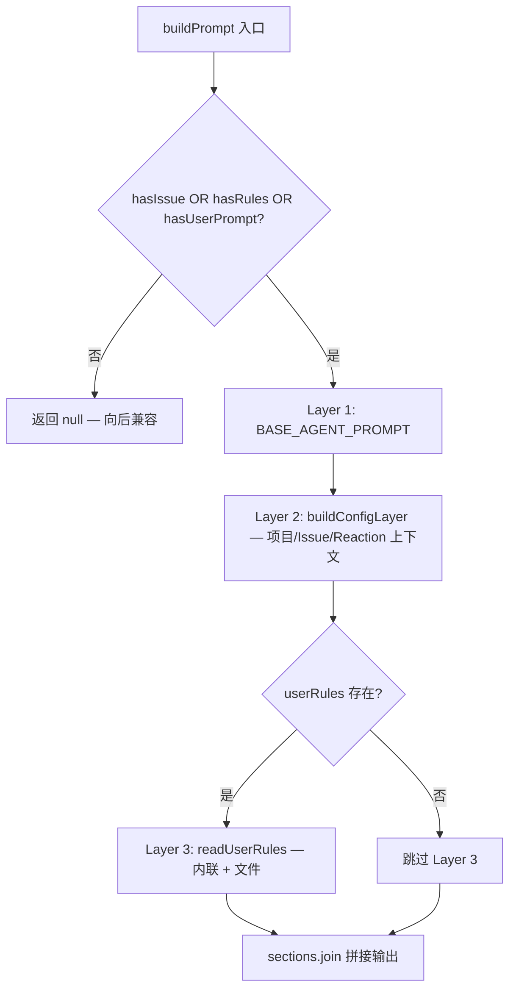
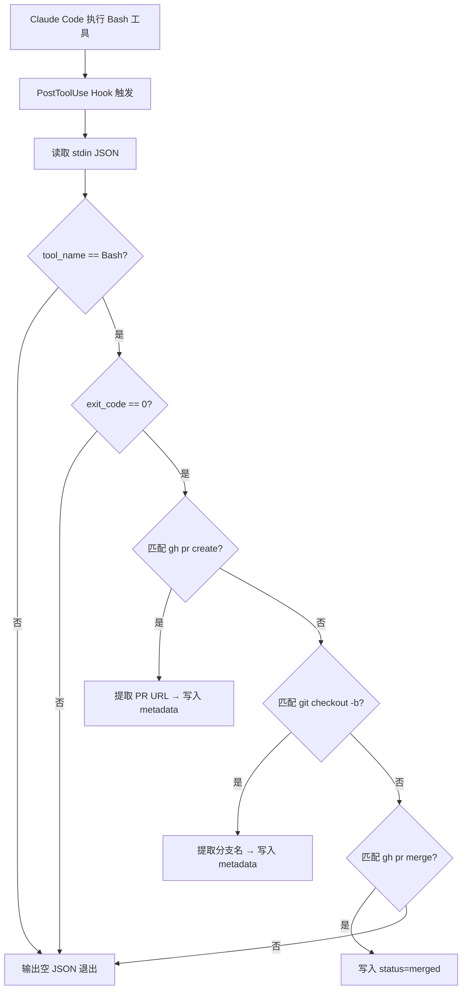
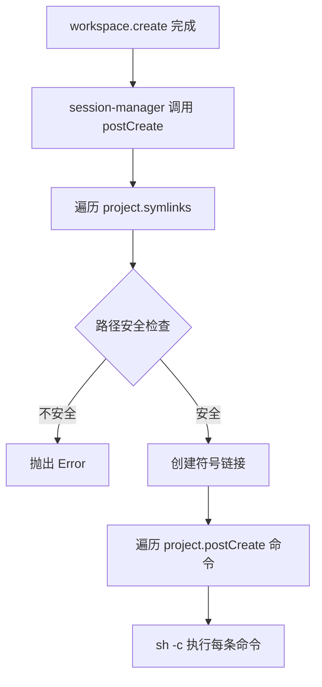

# PD-10.06 Agent Orchestrator — 三层 Prompt 组合管道与 PostToolUse Hook 链

> 文档编号：PD-10.06
> 来源：Agent Orchestrator `packages/core/src/prompt-builder.ts`, `packages/plugins/agent-claude-code/src/index.ts`
> GitHub：https://github.com/ComposioHQ/agent-orchestrator.git
> 问题域：PD-10 中间件管道 Middleware Pipeline
> 状态：可复用方案

---

## 第 1 章 问题与动机

### 1.1 核心问题

Agent 编排系统需要在多个层面注入上下文和行为拦截：

1. **Prompt 组合问题**：Agent 启动时需要融合系统指令、项目配置、Issue 上下文、用户自定义规则等多层信息，且各层有明确的优先级关系（后层覆盖前层）。
2. **运行时元数据回流问题**：Agent 在执行过程中产生的副作用（创建 PR、切换分支、合并 PR）需要自动回传到编排层的元数据系统，而不能依赖 Agent 主动上报。
3. **Workspace 后处理问题**：工作空间创建后需要执行一系列初始化操作（符号链接、依赖安装），这些操作与核心创建逻辑正交，应当解耦。

这三个问题的共同本质是：**如何在不修改核心流程代码的前提下，在关键节点注入横切关注点**。

### 1.2 Agent Orchestrator 的解法概述

Agent Orchestrator 采用三种互补的管道/钩子机制：

1. **三层 Prompt 组合管道**（`prompt-builder.ts:148`）：BASE_AGENT_PROMPT → Config Context → User Rules，通过 `buildPrompt()` 函数将三层拼接为最终 prompt，null 返回值表示无需组合（向后兼容）。
2. **PostToolUse Hook 链**（`agent-claude-code/src/index.ts:31-167`）：一个 Bash 脚本作为 Claude Code 的 PostToolUse hook，拦截所有 Bash 工具调用，通过正则匹配 `gh pr create`、`git checkout -b`、`gh pr merge` 等命令，自动提取 PR URL / 分支名并写入元数据文件。
3. **Workspace postCreate 钩子**（`workspace-worktree/src/index.ts:249-297`）：工作空间创建后执行符号链接和用户自定义命令，通过 `ProjectConfig.postCreate` 数组驱动。

### 1.3 设计思想

| 设计原则 | 具体实现 | 理由 | 替代方案 |
|----------|----------|------|----------|
| 分层组合优于单体 prompt | 三层独立构建再拼接 | 各层可独立测试、独立变更 | 模板字符串插值（不可测试） |
| 外部 Hook 优于内部修改 | Bash 脚本作为 PostToolUse hook | Agent 是黑盒，无法修改其内部逻辑 | 轮询 Agent 日志（延迟高、不可靠） |
| 配置驱动优于硬编码 | postCreate 命令数组来自 YAML | 不同项目有不同的初始化需求 | 在代码中 if-else 判断项目类型 |
| Null 安全的向后兼容 | buildPrompt 返回 null 表示无需组合 | 裸启动（无 issue、无 rules）不应注入空 prompt | 总是返回空字符串（改变 Agent 行为） |
| 原子文件操作 | 元数据更新用 tmp + mv 原子替换 | 防止并发写入导致文件损坏 | 直接 sed -i（非原子、可能丢数据） |

---

## 第 2 章 源码实现分析

### 2.1 架构概览

Agent Orchestrator 的中间件管道分布在三个层面，覆盖 Agent 生命周期的不同阶段：

```
┌─────────────────────────────────────────────────────────────────┐
│                    Session Manager (编排核心)                     │
│                                                                  │
│  spawn() ─────────────────────────────────────────────────────── │
│    │                                                             │
│    ├─ 1. workspace.create()          创建 Git Worktree           │
│    ├─ 2. workspace.postCreate()      ← Hook: 符号链接 + 命令     │
│    ├─ 3. buildPrompt()               ← 管道: 三层 Prompt 组合    │
│    ├─ 4. agent.getLaunchCommand()     生成启动命令                │
│    ├─ 5. runtime.create()            启动 tmux/process           │
│    └─ 6. agent.postLaunchSetup()     ← Hook: 写入 settings.json │
│                                                                  │
│  运行时 ─────────────────────────────────────────────────────── │
│    │                                                             │
│    └─ PostToolUse Hook               ← Hook: 拦截 Bash 命令     │
│       (metadata-updater.sh)            自动更新 PR/分支元数据     │
│                                                                  │
│  轮询 ──────────────────────────────────────────────────────── │
│    │                                                             │
│    └─ LifecycleManager.pollAll()     状态机 + 反应引擎           │
│       ├─ determineStatus()           多插件链式探测              │
│       ├─ statusToEventType()         状态→事件映射               │
│       ├─ eventToReactionKey()        事件→反应映射               │
│       └─ executeReaction()           反应执行 + 升级             │
└─────────────────────────────────────────────────────────────────┘
```

### 2.2 核心实现

#### 管道 1：三层 Prompt 组合



对应源码 `packages/core/src/prompt-builder.ts:148-178`：

```typescript
export function buildPrompt(config: PromptBuildConfig): string | null {
  const hasIssue = Boolean(config.issueId);
  const userRules = readUserRules(config.project);
  const hasRules = Boolean(userRules);
  const hasUserPrompt = Boolean(config.userPrompt);

  // Nothing to compose — return null for backward compatibility
  if (!hasIssue && !hasRules && !hasUserPrompt) {
    return null;
  }

  const sections: string[] = [];

  // Layer 1: Base prompt (always included when we have something to compose)
  sections.push(BASE_AGENT_PROMPT);

  // Layer 2: Config-derived context
  sections.push(buildConfigLayer(config));

  // Layer 3: User rules
  if (userRules) {
    sections.push(`## Project Rules\n${userRules}`);
  }

  // Explicit user prompt (appended last, highest priority)
  if (config.userPrompt) {
    sections.push(`## Additional Instructions\n${config.userPrompt}`);
  }

  return sections.join("\n\n");
}
```

Layer 2 的 `buildConfigLayer` 动态注入项目上下文和 Reaction 提示（`prompt-builder.ts:67-109`）：

```typescript
function buildConfigLayer(config: PromptBuildConfig): string {
  const { project, projectId, issueId, issueContext } = config;
  const lines: string[] = [];

  lines.push("## Project Context");
  lines.push(`- Project: ${project.name ?? projectId}`);
  lines.push(`- Repository: ${project.repo}`);
  lines.push(`- Default branch: ${project.defaultBranch}`);

  // Include reaction rules so the agent knows what to expect
  if (project.reactions) {
    const reactionHints: string[] = [];
    for (const [event, reaction] of Object.entries(project.reactions)) {
      if (reaction.auto && reaction.action === "send-to-agent") {
        reactionHints.push(`- ${event}: auto-handled (you'll receive instructions)`);
      }
    }
    if (reactionHints.length > 0) {
      lines.push(`\n## Automated Reactions`);
      lines.push(...reactionHints);
    }
  }
  return lines.join("\n");
}
```

Layer 3 的 `readUserRules` 支持内联规则和文件规则双来源（`prompt-builder.ts:115-135`）：

```typescript
function readUserRules(project: ProjectConfig): string | null {
  const parts: string[] = [];
  if (project.agentRules) {
    parts.push(project.agentRules);
  }
  if (project.agentRulesFile) {
    const filePath = resolve(project.path, project.agentRulesFile);
    try {
      const content = readFileSync(filePath, "utf-8").trim();
      if (content) parts.push(content);
    } catch { /* skip silently */ }
  }
  return parts.length > 0 ? parts.join("\n\n") : null;
}
```

#### 管道 2：PostToolUse Hook 链 — 元数据自动回流



对应源码 `packages/plugins/agent-claude-code/src/index.ts:31-167`（METADATA_UPDATER_SCRIPT）：

```bash
# 核心命令检测逻辑
# Detect: gh pr create
if [[ "$command" =~ ^gh[[:space:]]+pr[[:space:]]+create ]]; then
  pr_url=$(echo "$output" | grep -Eo 'https://github[.]com/[^/]+/[^/]+/pull/[0-9]+' | head -1)
  if [[ -n "$pr_url" ]]; then
    update_metadata_key "pr" "$pr_url"
    update_metadata_key "status" "pr_open"
    echo '{"systemMessage": "Updated metadata: PR created at '"$pr_url"'"}'
    exit 0
  fi
fi

# Detect: git checkout -b <branch> or git switch -c <branch>
if [[ "$command" =~ ^git[[:space:]]+checkout[[:space:]]+-b[[:space:]]+([^[:space:]]+) ]] || \
   [[ "$command" =~ ^git[[:space:]]+switch[[:space:]]+-c[[:space:]]+([^[:space:]]+) ]]; then
  branch="${BASH_REMATCH[1]}"
  if [[ -n "$branch" ]]; then
    update_metadata_key "branch" "$branch"
  fi
fi
```

Hook 的注册通过 `setupHookInWorkspace` 函数写入 `.claude/settings.json`（`agent-claude-code/src/index.ts:497-575`）：

```typescript
async function setupHookInWorkspace(workspacePath: string, hookCommand: string): Promise<void> {
  // ... 读取现有 settings.json ...
  
  // 检查是否已配置 metadata-updater hook
  // 如果不存在则添加，存在则更新命令
  if (hookIndex === -1) {
    postToolUse.push({
      matcher: "Bash",           // 只拦截 Bash 工具调用
      hooks: [{
        type: "command",
        command: hookCommand,    // 指向 metadata-updater.sh
        timeout: 5000,           // 5 秒超时
      }],
    });
  }
  
  hooks["PostToolUse"] = postToolUse;
  existingSettings["hooks"] = hooks;
  await writeFile(settingsPath, JSON.stringify(existingSettings, null, 2) + "\n", "utf-8");
}
```

#### 管道 3：Workspace postCreate 钩子



对应源码 `packages/plugins/workspace-worktree/src/index.ts:249-297`：

```typescript
async postCreate(info: WorkspaceInfo, project: ProjectConfig): Promise<void> {
  const repoPath = expandPath(project.path);

  // Symlink shared resources
  if (project.symlinks) {
    for (const symlinkPath of project.symlinks) {
      // Guard against absolute paths and directory traversal
      if (symlinkPath.startsWith("/") || symlinkPath.includes("..")) {
        throw new Error(`Invalid symlink path "${symlinkPath}": must be relative`);
      }
      const sourcePath = join(repoPath, symlinkPath);
      const targetPath = resolve(info.path, symlinkPath);
      // Verify resolved target is still within the workspace
      if (!targetPath.startsWith(info.path + "/") && targetPath !== info.path) {
        throw new Error(`Symlink target resolves outside workspace: ${targetPath}`);
      }
      // ... 创建符号链接 ...
    }
  }

  // Run postCreate hooks
  if (project.postCreate) {
    for (const command of project.postCreate) {
      await execFileAsync("sh", ["-c", command], { cwd: info.path });
    }
  }
}
```

### 2.3 实现细节

**元数据原子更新**：`METADATA_UPDATER_SCRIPT` 中的 `update_metadata_key` 函数使用 tmp 文件 + `mv` 实现原子替换（`agent-claude-code/src/index.ts:90-112`），避免并发写入导致文件损坏。

**Hook 幂等注册**：`setupHookInWorkspace` 在写入前先扫描现有 `PostToolUse` 数组，通过检查 `command` 字段是否包含 `metadata-updater.sh` 来判断是否已注册（`agent-claude-code/src/index.ts:529-548`），实现幂等性。

**Lifecycle Manager 的反应升级链**：`executeReaction` 维护 per-session 的 `ReactionTracker`，支持重试次数和时间窗口双维度升级判定（`lifecycle-manager.ts:292-416`）。当 `tracker.attempts > maxRetries` 或超过 `escalateAfter` 时间窗口时，自动升级为人工通知。

**轮询重入保护**：`pollAll` 使用 `polling` 布尔标志防止上一轮未完成时重复执行（`lifecycle-manager.ts:524-527`）。

**通知路由**：`notifyHuman` 根据事件优先级从 `config.notificationRouting` 查找对应的 notifier 列表，支持 urgent/action/warning/info 四级路由（`lifecycle-manager.ts:418-433`）。


---

## 第 3 章 迁移指南

### 3.1 迁移清单

**阶段 1：三层 Prompt 组合管道**

- [ ] 定义 `BASE_PROMPT` 常量（系统级指令，所有 session 共享）
- [ ] 实现 `buildConfigLayer(config)` 函数（从项目配置动态生成上下文）
- [ ] 实现 `readUserRules(project)` 函数（支持内联 + 文件双来源）
- [ ] 实现 `buildPrompt(config)` 入口函数（三层拼接，null 表示无需组合）
- [ ] 在 session spawn 流程中调用 `buildPrompt` 并传入 agent launch config

**阶段 2：PostToolUse Hook 元数据回流**

- [ ] 编写 Hook 脚本（读取 stdin JSON → 匹配命令模式 → 更新元数据文件）
- [ ] 实现 `setupHookInWorkspace` 函数（幂等写入 agent 配置文件）
- [ ] 在 `postLaunchSetup` 中调用 hook 注册
- [ ] 定义元数据文件格式（key=value 或 JSON）
- [ ] 实现原子文件更新（tmp + mv）

**阶段 3：Workspace postCreate 钩子**

- [ ] 在 Workspace 接口中添加可选 `postCreate` 方法
- [ ] 在 session spawn 流程中调用 `workspace.postCreate`（失败时清理 workspace）
- [ ] 支持配置驱动的命令数组（从 YAML/JSON 配置读取）
- [ ] 添加路径安全校验（防止目录遍历）

### 3.2 适配代码模板

#### 三层 Prompt 组合器（TypeScript）

```typescript
// prompt-builder.ts — 可直接复用的三层 Prompt 组合器

interface PromptConfig {
  basePrompt: string;
  project: { name: string; repo: string; defaultBranch: string };
  issueId?: string;
  issueContext?: string;
  userRules?: string;
  userRulesFile?: string;
  userPrompt?: string;
}

export function buildPrompt(config: PromptConfig): string | null {
  const hasIssue = Boolean(config.issueId);
  const hasRules = Boolean(config.userRules) || Boolean(config.userRulesFile);
  const hasUserPrompt = Boolean(config.userPrompt);

  if (!hasIssue && !hasRules && !hasUserPrompt) return null;

  const sections: string[] = [config.basePrompt];

  // Layer 2: Project context
  const ctx = [
    `## Project Context`,
    `- Project: ${config.project.name}`,
    `- Repository: ${config.project.repo}`,
    `- Default branch: ${config.project.defaultBranch}`,
  ];
  if (config.issueId) {
    ctx.push(`\n## Task\nWork on issue: ${config.issueId}`);
  }
  if (config.issueContext) {
    ctx.push(`\n## Issue Details\n${config.issueContext}`);
  }
  sections.push(ctx.join("\n"));

  // Layer 3: User rules
  const rules: string[] = [];
  if (config.userRules) rules.push(config.userRules);
  if (config.userRulesFile) {
    try {
      const content = require("fs").readFileSync(config.userRulesFile, "utf-8").trim();
      if (content) rules.push(content);
    } catch { /* skip */ }
  }
  if (rules.length > 0) {
    sections.push(`## Project Rules\n${rules.join("\n\n")}`);
  }

  if (config.userPrompt) {
    sections.push(`## Additional Instructions\n${config.userPrompt}`);
  }

  return sections.join("\n\n");
}
```

#### PostToolUse Hook 元数据更新器（Bash）

```bash
#!/usr/bin/env bash
# metadata-updater.sh — 通用 PostToolUse Hook 模板
set -euo pipefail

METADATA_DIR="${AO_DATA_DIR:-$HOME/.sessions}"
SESSION_ID="${AO_SESSION:-}"

input=$(cat)
tool_name=$(echo "$input" | jq -r '.tool_name // empty')
command=$(echo "$input" | jq -r '.tool_input.command // empty')
output=$(echo "$input" | jq -r '.tool_response // empty')
exit_code=$(echo "$input" | jq -r '.exit_code // 0')

[[ "$exit_code" -ne 0 || "$tool_name" != "Bash" || -z "$SESSION_ID" ]] && { echo '{}'; exit 0; }

metadata_file="$METADATA_DIR/$SESSION_ID"
[[ ! -f "$metadata_file" ]] && { echo '{}'; exit 0; }

update_key() {
  local key="$1" value="$2" temp="${metadata_file}.tmp"
  if grep -q "^$key=" "$metadata_file" 2>/dev/null; then
    sed "s|^$key=.*|$key=$value|" "$metadata_file" > "$temp"
  else
    cp "$metadata_file" "$temp"
    echo "$key=$value" >> "$temp"
  fi
  mv "$temp" "$metadata_file"  # 原子替换
}

# 按需添加命令匹配规则
if [[ "$command" =~ ^gh[[:space:]]+pr[[:space:]]+create ]]; then
  pr_url=$(echo "$output" | grep -Eo 'https://github[.]com/[^/]+/[^/]+/pull/[0-9]+' | head -1)
  [[ -n "$pr_url" ]] && update_key "pr" "$pr_url" && update_key "status" "pr_open"
fi

echo '{}'
exit 0
```

### 3.3 适用场景

| 场景 | 适用度 | 说明 |
|------|--------|------|
| 多 Agent 编排系统 | ⭐⭐⭐ | 核心场景：多个 Agent 并行工作，需要统一的 prompt 组合和元数据回流 |
| 单 Agent + 自动化 CI/CD | ⭐⭐⭐ | PostToolUse Hook 自动捕获 PR/分支信息，无需人工干预 |
| IDE 插件开发 | ⭐⭐ | Prompt 组合管道可复用，但 Hook 机制需适配不同 IDE 的扩展点 |
| 纯 CLI 工具 | ⭐ | 管道模式过重，简单的模板字符串即可 |
| Agent 黑盒集成 | ⭐⭐⭐ | Hook 机制的核心价值：不修改 Agent 内部代码即可拦截和增强行为 |

---

## 第 4 章 测试用例

```typescript
import { describe, it, expect, vi, beforeEach } from "vitest";

// ============================================================
// 三层 Prompt 组合管道测试
// ============================================================

describe("buildPrompt", () => {
  const BASE_PROMPT = "You are an AI agent.";

  function buildPrompt(config: {
    basePrompt: string;
    project: { name: string; repo: string; defaultBranch: string };
    issueId?: string;
    issueContext?: string;
    userRules?: string;
    userPrompt?: string;
  }): string | null {
    const hasIssue = Boolean(config.issueId);
    const hasRules = Boolean(config.userRules);
    const hasUserPrompt = Boolean(config.userPrompt);
    if (!hasIssue && !hasRules && !hasUserPrompt) return null;

    const sections: string[] = [config.basePrompt];
    const ctx = [`## Project Context`, `- Project: ${config.project.name}`];
    if (config.issueId) ctx.push(`\n## Task\nWork on issue: ${config.issueId}`);
    if (config.issueContext) ctx.push(`\n## Issue Details\n${config.issueContext}`);
    sections.push(ctx.join("\n"));
    if (config.userRules) sections.push(`## Project Rules\n${config.userRules}`);
    if (config.userPrompt) sections.push(`## Additional Instructions\n${config.userPrompt}`);
    return sections.join("\n\n");
  }

  const project = { name: "test", repo: "owner/repo", defaultBranch: "main" };

  it("returns null when no issue, rules, or prompt", () => {
    expect(buildPrompt({ basePrompt: BASE_PROMPT, project })).toBeNull();
  });

  it("includes all three layers when issue + rules + prompt provided", () => {
    const result = buildPrompt({
      basePrompt: BASE_PROMPT,
      project,
      issueId: "INT-42",
      userRules: "Always use TypeScript",
      userPrompt: "Focus on tests",
    });
    expect(result).toContain("You are an AI agent.");
    expect(result).toContain("Work on issue: INT-42");
    expect(result).toContain("Always use TypeScript");
    expect(result).toContain("Focus on tests");
  });

  it("user prompt appears last (highest priority)", () => {
    const result = buildPrompt({
      basePrompt: BASE_PROMPT,
      project,
      issueId: "INT-1",
      userPrompt: "OVERRIDE",
    })!;
    const lastSection = result.split("\n\n").pop()!;
    expect(lastSection).toContain("OVERRIDE");
  });

  it("skips Layer 3 when no user rules", () => {
    const result = buildPrompt({
      basePrompt: BASE_PROMPT,
      project,
      issueId: "INT-1",
    })!;
    expect(result).not.toContain("Project Rules");
  });
});

// ============================================================
// PostToolUse Hook 命令匹配测试
// ============================================================

describe("PostToolUse Hook command matching", () => {
  function matchCommand(command: string): { type: string; value: string } | null {
    // gh pr create
    const prMatch = command.match(/^gh\s+pr\s+create/);
    if (prMatch) return { type: "pr_create", value: "detected" };

    // git checkout -b <branch>
    const checkoutMatch = command.match(/^git\s+checkout\s+-b\s+(\S+)/);
    if (checkoutMatch) return { type: "branch", value: checkoutMatch[1] };

    // git switch -c <branch>
    const switchMatch = command.match(/^git\s+switch\s+-c\s+(\S+)/);
    if (switchMatch) return { type: "branch", value: switchMatch[1] };

    // gh pr merge
    const mergeMatch = command.match(/^gh\s+pr\s+merge/);
    if (mergeMatch) return { type: "merge", value: "detected" };

    return null;
  }

  it("detects gh pr create", () => {
    expect(matchCommand("gh pr create --title 'Fix bug'")).toEqual({
      type: "pr_create", value: "detected",
    });
  });

  it("detects git checkout -b", () => {
    expect(matchCommand("git checkout -b feat/INT-42")).toEqual({
      type: "branch", value: "feat/INT-42",
    });
  });

  it("detects git switch -c", () => {
    expect(matchCommand("git switch -c fix/bug-123")).toEqual({
      type: "branch", value: "fix/bug-123",
    });
  });

  it("detects gh pr merge", () => {
    expect(matchCommand("gh pr merge 42 --squash")).toEqual({
      type: "merge", value: "detected",
    });
  });

  it("ignores non-matching commands", () => {
    expect(matchCommand("npm install")).toBeNull();
    expect(matchCommand("git status")).toBeNull();
  });
});

// ============================================================
// Hook 幂等注册测试
// ============================================================

describe("Hook idempotent registration", () => {
  it("does not duplicate hooks on repeated setup", () => {
    const settings: Record<string, unknown> = {
      hooks: {
        PostToolUse: [{
          matcher: "Bash",
          hooks: [{ type: "command", command: "/path/metadata-updater.sh", timeout: 5000 }],
        }],
      },
    };

    // Simulate second registration
    const postToolUse = (settings["hooks"] as Record<string, unknown>)["PostToolUse"] as Array<Record<string, unknown>>;
    let found = false;
    for (const entry of postToolUse) {
      const hooksList = entry["hooks"] as Array<Record<string, unknown>>;
      for (const h of hooksList) {
        if (typeof h["command"] === "string" && h["command"].includes("metadata-updater")) {
          found = true;
          h["command"] = "/new/path/metadata-updater.sh"; // Update, don't duplicate
        }
      }
    }
    if (!found) {
      postToolUse.push({
        matcher: "Bash",
        hooks: [{ type: "command", command: "/new/path/metadata-updater.sh", timeout: 5000 }],
      });
    }

    expect(postToolUse).toHaveLength(1); // Still only one entry
    const hooks = postToolUse[0]["hooks"] as Array<Record<string, unknown>>;
    expect(hooks[0]["command"]).toBe("/new/path/metadata-updater.sh");
  });
});

// ============================================================
// Workspace postCreate 安全校验测试
// ============================================================

describe("Workspace postCreate path safety", () => {
  function validateSymlinkPath(symlinkPath: string, workspacePath: string): boolean {
    if (symlinkPath.startsWith("/") || symlinkPath.includes("..")) return false;
    const resolved = require("path").resolve(workspacePath, symlinkPath);
    return resolved.startsWith(workspacePath + "/") || resolved === workspacePath;
  }

  it("rejects absolute paths", () => {
    expect(validateSymlinkPath("/etc/passwd", "/workspace")).toBe(false);
  });

  it("rejects directory traversal", () => {
    expect(validateSymlinkPath("../../../etc/passwd", "/workspace")).toBe(false);
  });

  it("accepts valid relative paths", () => {
    expect(validateSymlinkPath("node_modules", "/workspace")).toBe(true);
    expect(validateSymlinkPath("config/settings.json", "/workspace")).toBe(true);
  });
});
```


---

## 第 5 章 跨域关联

| 关联域 | 关系类型 | 说明 |
|--------|----------|------|
| PD-01 上下文管理 | 协同 | 三层 Prompt 组合管道本质上是上下文注入机制，Layer 2 动态注入 Issue 上下文和 Reaction 提示，与 PD-01 的上下文窗口管理互补 |
| PD-02 多 Agent 编排 | 依赖 | Lifecycle Manager 的轮询→事件→反应管道是多 Agent 编排的核心驱动力，PostToolUse Hook 的元数据回流为编排层提供状态感知 |
| PD-04 工具系统 | 协同 | PostToolUse Hook 是工具系统的扩展点，通过 Claude Code 的 hooks 配置机制拦截工具调用，不修改工具本身 |
| PD-06 记忆持久化 | 依赖 | 元数据文件（key=value 格式）是 Hook 链的持久化目标，原子更新机制保证并发安全 |
| PD-07 质量检查 | 协同 | Lifecycle Manager 的 `determineStatus` 链式探测可视为质量检查管道，检测 CI 失败、Review 变更请求等质量信号 |
| PD-09 Human-in-the-Loop | 协同 | 反应升级链（retries + escalateAfter）是 Human-in-the-Loop 的自动化入口，当自动处理失败时升级为人工通知 |
| PD-11 可观测性 | 协同 | PostToolUse Hook 的 `systemMessage` 输出和 Lifecycle Manager 的事件系统（30+ EventType）提供了丰富的可观测性数据 |

---

## 第 6 章 来源文件索引

| 文件 | 行范围 | 关键实现 |
|------|--------|----------|
| `packages/core/src/prompt-builder.ts` | L1-L179 | 三层 Prompt 组合管道：BASE_AGENT_PROMPT、buildConfigLayer、readUserRules、buildPrompt |
| `packages/core/src/prompt-builder.ts` | L22-L40 | Layer 1: BASE_AGENT_PROMPT 常量定义 |
| `packages/core/src/prompt-builder.ts` | L67-L109 | Layer 2: buildConfigLayer — 项目上下文 + Reaction 提示 |
| `packages/core/src/prompt-builder.ts` | L115-L135 | Layer 3: readUserRules — 内联规则 + 文件规则 |
| `packages/core/src/prompt-builder.ts` | L148-L178 | buildPrompt 入口 — null 返回值的向后兼容设计 |
| `packages/plugins/agent-claude-code/src/index.ts` | L31-L167 | METADATA_UPDATER_SCRIPT — PostToolUse Hook Bash 脚本 |
| `packages/plugins/agent-claude-code/src/index.ts` | L90-L112 | update_metadata_key — 原子文件更新函数 |
| `packages/plugins/agent-claude-code/src/index.ts` | L119-L162 | 命令检测逻辑：gh pr create / git checkout -b / gh pr merge |
| `packages/plugins/agent-claude-code/src/index.ts` | L497-L575 | setupHookInWorkspace — 幂等 Hook 注册 |
| `packages/plugins/agent-claude-code/src/index.ts` | L761-L773 | setupWorkspaceHooks + postLaunchSetup — 两个 Hook 注入点 |
| `packages/plugins/workspace-worktree/src/index.ts` | L249-L297 | postCreate — 符号链接 + 命令执行钩子 |
| `packages/plugins/workspace-worktree/src/index.ts` | L256-L270 | 路径安全校验（防目录遍历） |
| `packages/core/src/session-manager.ts` | L414-L428 | spawn 中调用 workspace.postCreate（失败时清理） |
| `packages/core/src/session-manager.ts` | L533-L534 | spawn 中调用 agent.postLaunchSetup |
| `packages/core/src/session-manager.ts` | L593-L594 | spawnOrchestrator 中调用 agent.setupWorkspaceHooks |
| `packages/core/src/lifecycle-manager.ts` | L172-L607 | Lifecycle Manager — 轮询循环 + 状态机 + 反应引擎 |
| `packages/core/src/lifecycle-manager.ts` | L182-L289 | determineStatus — 多插件链式状态探测 |
| `packages/core/src/lifecycle-manager.ts` | L292-L416 | executeReaction — 反应执行 + 升级逻辑 |
| `packages/core/src/lifecycle-manager.ts` | L524-L527 | pollAll 重入保护 |
| `packages/core/src/types.ts` | L262-L316 | Agent 接口 — postLaunchSetup / setupWorkspaceHooks 定义 |
| `packages/core/src/types.ts` | L379-L399 | Workspace 接口 — postCreate 定义 |
| `packages/core/src/types.ts` | L700-L736 | EventType — 30+ 事件类型定义 |
| `packages/core/src/types.ts` | L755-L787 | ReactionConfig — 反应配置（auto/action/retries/escalateAfter） |
| `packages/core/src/plugin-registry.ts` | L1-L119 | 插件注册表 — 7 slot × 16 内置插件 |

---

## 第 7 章 横向对比维度

> **重要：** 本章用于自动填充 Butcher Wiki 的横向对比表。

```json comparison_data
{
  "project": "AgentOrchestrator",
  "dimensions": {
    "中间件基类": "无基类，三种独立机制：Prompt 组合函数 + Bash Hook 脚本 + 接口方法",
    "钩子点": "6 个：buildPrompt / postCreate / postLaunchSetup / setupWorkspaceHooks / PostToolUse / pollAll",
    "中间件数量": "3 层 Prompt + 1 个 Bash Hook + 1 个 postCreate + 16 个反应配置",
    "条件激活": "buildPrompt 返回 null 跳过空组合；Hook 按 tool_name==Bash 过滤",
    "状态管理": "key=value 元数据文件 + 原子 tmp+mv 更新",
    "执行模型": "Prompt 同步拼接；Hook 异步 Bash 子进程；轮询 30s 间隔",
    "同步热路径": "buildPrompt 纯同步；PostToolUse Hook 5s 超时",
    "错误隔离": "postCreate 失败回滚 workspace；postLaunchSetup 失败回滚 runtime+workspace+metadata",
    "交互桥接": "无直接交互桥接，通过 Lifecycle Manager 的 needs_input 状态间接检测",
    "装饰器包装": "无装饰器，采用接口方法（postCreate/postLaunchSetup）的可选实现模式",
    "通知路由": "四级优先级路由（urgent/action/warning/info）→ 多 notifier 并行推送",
    "反应升级": "双维度：retries 次数 + escalateAfter 时间窗口，超限自动升级为人工通知",
    "超时保护": "Hook 脚本 5s 超时；Git 命令 30s 超时；轮询重入保护",
    "外部管理器集成": "无外部 Hook 管理器冲突处理，直接写入 .claude/settings.json",
    "版本同步": "Hook 幂等注册：检测 metadata-updater.sh 存在则更新命令，不重复添加",
    "可观测性": "30+ EventType 事件系统 + Hook systemMessage 输出 + JSONL 会话日志",
    "数据传递": "环境变量（AO_SESSION/AO_DATA_DIR）+ stdin JSON + metadata 文件"
  }
}
```

### 域元数据补充

```json domain_metadata
{
  "solution_summary": "Agent Orchestrator 用三层 Prompt 拼接管道（BASE→Config→UserRules）+ PostToolUse Bash Hook 自动捕获 PR/分支元数据 + Lifecycle Manager 轮询反应引擎实现中间件管道",
  "description": "Agent 黑盒场景下通过外部 Hook 脚本拦截工具调用实现元数据回流",
  "sub_problems": [
    "Prompt 层级优先级：多层 prompt 拼接时如何保证后层覆盖前层的语义优先级",
    "Hook 脚本 jq 依赖：目标环境无 jq 时的 fallback 解析策略",
    "反应配置合并：全局默认反应与项目级覆盖的合并规则（浅合并 vs 深合并）"
  ],
  "best_practices": [
    "Prompt 组合返回 null 而非空字符串：裸启动不注入空 prompt，保持 Agent 默认行为",
    "Hook 注册幂等性：写入前扫描已有配置，存在则更新不重复添加",
    "元数据原子更新：tmp 文件 + mv 替换，防止并发写入导致文件损坏"
  ]
}
```

